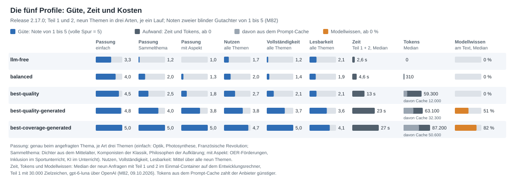

# compendious-text-fastapi (v2)

Erzeugt kompendiale Texte zu einem Thema für WirLernenOnline: Weltwissen aus lokalen
Kiwix-ZIM-Archiven (Wikipedia, Klexikon, weitere abonnierbar), Lehrplanbezüge aus einem
MEM-Cache und einen Überblick über die zugehörige Sammlung. Ohne LLM lauffähig; die b-api
kann optional zugeschaltet werden.

Der vollständige Plan mit Architektur, Entscheidungen und Phasen steht in [PLAN.md](PLAN.md).
Der alte Dienst, den dieser ablöst, gehört nicht zum Repository; die Messungen, die ihn nachstellen, beschreibt
[docs/entwicklung](docs/entwicklung/README.md). Was der Betrieb braucht und wie Aufrufer vom alten Dienst
umsteigen, fasst [docs/uebergabe](docs/uebergabe/README.md) für das Technik-Team zusammen.

## Aufbau des Dokuments

Angefragte Teile ergeben **ein** Markdown, nicht drei: ein YAML-Vorspann, eine Überschrift
`# Kompendium: <Thema>`, danach die gewählten Teile in fester Reihenfolge.

```
---
kompendium_version: 2 … parts: [world, curricula, collection]
---

# Kompendium: Optik

## Teil 1 · Weltwissen          (Bausteine des Templates, je Abschnitt eine Markierung)
## Teil 2 · Lehrplanbezüge      (aus dem MEM-Cache, je Fundstelle ein Facettenblock)
## Teil 3 · Die Sammlung im Überblick   (je Knoten eine Zeile mit Art und nodeId)
```

`parts` wählt aus, ohne das Feld sind alle drei angefragt; nicht angefragte Teile entfallen ersatzlos, die
Reihenfolge der übrigen bleibt. Teil 3 beschreibt eine Sammlung: die aus `collection_id` oder, wenn das Feld leer ist,
eine Sammlung des eingestellten Repositorys in `node_id` (D77). Ohne Sammlung enthält das Kompendium Teil 1 und 2, auch
wenn `knowledge_collection_id` gesetzt ist (`parts_status` meldet Teil 3 als `unavailable`); `parts: ["collection"]`
allein ist dann ein 422, mit einem Material in `node_id` ein 503. Der Vorspann nennt unter `parts`, was wirklich
drinsteht. `frontmatter_in_markdown: false`
lässt den Vorspann weg und beginnt bei der Überschrift — die Angaben stehen dann weiter im
Antwortfeld `frontmatter`. Sätze aus Modellwissen kennzeichnet nur das Markup; `model_knowledge_label: true` setzt
hinter jeden sichtbar `[Modellwissen]` (D76).

Facettenmarker haben die Form `<!-- f: Name=Wert|Wert; Name=Wert -->` und stehen immer auf einer
Zeile; ein Block reicht vom Marker bis zum nächsten `<!-- /f -->`. In einem Wert sind `;`, `=`, `|`,
`<` und `>` prozentkodiert (`%3B`, `%3D`, `%7C`, `%3C`, `%3E`), damit kein Wert ein Paar anfügen,
sich in zwei teilen oder den Marker beenden kann; dasselbe gilt im `facets`-Attribut der
Abschnittsmarker von Teil 1.

## Stand

- Phase 0 (Fundament): Kern aus dem Prototyp portiert, Teil 1 im Regelmodus, Tests offline.
- Phase 1 (ZIM-Betrieb): Abo-Manifest, Kiwix-Katalog, Downloader mit Resume und SHA-256,
  `active.json` mit Wechsel ohne Neustart, Sync-Job als Sidecar, Dockerfile und Compose.
- Phase 2 (Matching, teilweise): Goldstandard über zehn Schulfach-Themen, Eval-Harness,
  Überschriften-Lexikon aus dem Dump, kalibrierte Policy mit Standardbaustein, Model2Vec im
  Image, Vertrauensschwelle 0,65 mit Abschnitts-Glättung (D28). macro-F1 0,45 und micro-F1 0,66
  (Ziel 0,70 nicht erreicht, siehe `eval/README.md`).
- Phase 3 (Lehrplanbezüge): Vollabzug aller MEM-Lehrpläne in einen SQLite-Cache
  (`lehrplan.db`), wöchentliche Zählprüfung, Themen-Matching mit Wortgrenzen-Regel und
  Fach-Filter, Teil 2 mit Markern je Absatz, Endpunkte und CLI. Zur Inferenzzeit kein
  SPARQL.
- Phase 4 (Sammlung): edu-sharing-Client für Sammlungen, Teil 3 „Die Sammlung im Überblick“
  mit Untersammlungen, Eingabe per `collection_id` (Thema, Fach und Kontext aus der Sammlung),
  Wissens-Sammlung (`knowledge_collection_id`) als zusätzliche Quellen für Teil 1 (bis D70 nur
  unter freien Lizenzen), Caches, `GET /api/v2/collections/{id}/overview`, CLI `compendium collection overview`.
- Phase 5 (LLM-Schicht): b-api-Client, Prompt-Registry mit Versionen, zwei Schalter `extraction`
  (das LLM wählt die Sätze, D33) und `generation` (`llm-fast`, `llm`), Belegprüfung je Satz,
  Token-Budget, Modellprüfung gegen `/models`, Rückfall auf den Regelmodus.
- Audit vom 2026-09-18 ([Bericht](docs/audits/2026-09-18-audit.md)): Befunde zu API-Vertrag, Fehlerpfaden,
  Attribution, Downloads, Caches, Rate-Limit, Tests, CI und Image behoben. Offen blieben damals Zugriffsschutz,
  v1-Vertrag und Request-IDs: Zugriffsschutz (`API_KEYS`) und Request-IDs sind seither gebaut, den v1-Vertrag hat
  Umbau U1 wieder entfernt. Stand je Befund im Nachtrag des Berichts.
- Audits vom 2026-09-27 ([Bericht](docs/audits/2026-09-27-audit.md), 73 Befunde) und vom 2026-09-28
  ([Bericht](docs/audits/2026-09-28-audit.md), 51 Befunde): abgearbeitet; was mit Grund offen bleibt und der Stand
  je Befund steht am Ende des jeweiligen Berichts.
- Überwachung: Prometheus-Endpunkt `/metrics` mit Zustand und Laufzeitmetriken, getestete Alarmregeln in
  `monitoring/`, Prometheus als Compose-Profil (D31).
- Prüfansicht (D66, Releases 2.4.0 bis 2.4.2): Mit `UI_ENABLED` liefert der Dienst unter `/ui/` eine Seite, auf
  der Menschen die Antworten aller Endpunkte im Browser prüfen: Herkunft je Absatz, Qualität, Zeit und Kosten,
  zwei Profile im Vergleich, Markdown kopieren und speichern (siehe „Prüfansicht“).
- Übergabe an das Technik-Team (29. und 30.09.2026, [docs/uebergabe](docs/uebergabe/README.md)): Lastmessung mit bis
  zu fünf gleichzeitigen Anfragen, Speichergrenze der API 6 GiB, GitLab-Pipeline nach dem Muster der Plattform. Ohne
  Eintrag gilt kein Tagesbudget (D67); eine Anfrage ohne Profil läuft mit `PRESET_DEFAULT` (ausgeliefert
  `best-quality-generated`), solange ein LLM eingerichtet ist, sonst mit `llm-free` (D68).
- Profile und Thema (D69 bis D75, Releases 2.6.0 bis 2.6.2): fünftes Profil `best-coverage-generated` (D69), 30.000
  Zielzeichen in allen Profilen (D70); jeder Prompt hört das angefragte Thema, `best-quality-generated` füllt leere
  Bausteine aus Modellwissen, ein langes Thema, eine Frage oder ein Knoten ohne Thema wird zuerst als Thema formuliert
  (D72); ein wörtlicher Text, der einen anderen Artikel behandelt, nennt in der Prüfung die schreibenden Profile, eine
  unlesbare Antwort der Zuordnung wird neu gefragt (D73); die Prüfung des Modellwissens ist ein Schalter, in keinem
  Profil voreingestellt (M53, D74); Überschrift und `topic` nennen in jedem Profil das angefragte Thema (D75). Güte,
  Zeit und Kosten aller fünf Profile: M52, Seite 09.
- Vermerk `[Modellwissen]` nur auf Wunsch (D76, Release 2.7.0): Ein fertiger Text geht ohne den sichtbaren Vermerk an
  Endkunden; das Markup kennzeichnet die Sätze aus Modellwissen weiter. `model_knowledge_label: true`, die
  CLI-Option `--model-knowledge-label` und der Schalter der Prüfansicht holen ihn zurück.
- Eine Sammlung, ein Feld (D77, Release 2.8.0): Eine Sammlung in `node_id` bekommt im Kompendium Teil 3 wie mit
  `collection_id`. Die Prüfansicht hat in allen Bereichen ein Feld „Sammlung oder Material“, liest den Knoten und sagt,
  was er ist und wie er verwendet wird; bei einer Sammlung lassen sich ihre Materialien als Quelle zuschalten.
- Audit vom 02.10.2026 (D78, Release 2.9.0): Ein belegter Satz braucht seine Zahlen im Beleg; Quellen ohne freie
  Lizenz machen Teil 1 nicht mehr pauschal zu freien Inhalten unter CC BY-SA 4.0; die Nebenartikel einer Stufe
  teilen sich, was `CORPUS_MAX_CHUNKS` lässt; ein schreibendes Profil mit Rückfall in einzelnen Bausteinen nennt
  sie im Hinweis `topic-scope`; Materialtexte halten `KNOWLEDGE_MAX_CHARS` auch im ersten Absatz; die ersten
  Lesezugriffe aufs Repository halten `REQUEST_TIMEOUT_S`; ein unlesbarer Cache-Eintrag ist ein Fehltreffer.
- Audit-Nachgang (D79, Release 2.9.1): Die Facette `Zugang` steht bei jeder CC-Lizenz, gemeinfreien Werken und
  „frei zugänglich“; gemessen und nicht gebaut, weil keine Verbesserung: ein Link-Filter für die Artikel der Frage N
  (M54), die Teile von N als Suchwörter für Teil 2 (M55), ein Teil 1 ohne Hauptartikel aus der Wissens-Sammlung (M56).
- Teil 2 und Denkaufwand (D80, D81, Release 2.10.0): Nach der KI-Prüfung steht in Teil 2 nur einzeln, was sie mit 2
  bewertet; was sie mit 1 bewertet, zählt in der Bündelzeile seines Bereichs. Zu allgemeine Nebenwörter eines Themas
  (mehr als `LEHRPLAN_GENERIC_WORD_HITS` Treffer im Cache) sucht Teil 2 nicht mehr. Fünf KI-Fragen stellt der Dienst
  ohne das Denken des Modells (`LLM_REASONING_EFFORTS`): Frage N, Artikelwahl, Lehrplanprüfung, Themenformulierung
  und QA-Paare antworteten so gleich gut in etwa der halben Zeit; Schreiben, Zuordnung, `/entities` und die
  Artikelwahl eines Materials denken weiter (M59). Die KI-Zuordnung liest 250 statt 400 Zeichen je Absatz.
- Standardprofil und Formeln (D82, D83, Release 2.11.0): Ohne Profil läuft eine Anfrage mit `best-quality-generated`
  (ohne LLM weiter `llm-free`). Formeln, die das LLM in LaTeX schreibt, stehen als lesbarer Text mit Unicode im
  Kompendium („n₁ sin θ₁ = n₂ sin θ₂“) statt als Rohtext mit Backslashes.
- Formeln aus Wikipedia, Artikelwahl und Audit-Reste (D84 bis D90, Release 2.12.0): Formeln der Wikipedia-Artikel
  stehen als Text im Korpus, die auf eigener Zeile am Absatz davor („Das Gesetz lautet: …“); bisher verwarf der
  Parser sie (M61: 99,6 % von 10.006 Formeln werden Text). Sagt die KI-Artikelwahl, dass keiner der Kandidaten
  passt, fällt auch der Artikel der Regeln weg; die Übersicht der Frage N nimmt seinen Platz oder die Anfrage
  antwortet 404 mit dem Rat, ein Fach anzugeben (M63). Gemessen und nicht gebaut: der KI-Zuordner ohne Denken (M62)
  und weitere Lehrplan-Suchwörter (M64). Aus den Audits: eine Regel für Themenstämme (KO-11), drei Faktoren der
  Zuordnungsregeln gestrichen (WA-02), Themenauflösung und Korpusbau in `app/knowledge` (AR-03, WA-01). Die
  Beispiele der Prüfansicht setzen nur, was ihr Titel nennt (U11).
- Nachtrag Artikelwahl (D85, Release 2.12.1): Nennt die KI statt eines Kandidaten einen Titel, den das Archiv nicht
  als Artikel hat, gelten die Kandidaten ebenso als verworfen (live bei „Funktion“).
- Externes Audit vom 03.10. geprüft (D91, Release 2.12.2): Ein Satz der Modellwissensprüfung ohne verwertbares Urteil
  zählt nicht mehr als geprüft (`unchecked`). Teil 3 nennt den Grund, wenn eine Sammlungsliste am Seitenlimit, an einer
  doppelten Seite oder an einer nicht lesbaren Untersammlung endet. Materialtexte verlieren Einwilligungstexte statt
  jeder Zeile mit „Cookie“ (M68). Eine Teilregeneration prüft den Alttext, bevor sie Archive oder LLM fragt, und lässt
  die KI Sätze nur für neue Bausteine wählen. Gemessen und nicht gebaut: Verneinungsregeln der Belegprüfung (M67),
  Anteile im Korpusdeckel (M69), die Themenformulierung vor der Artikelwahl (M70); Bericht und Entscheidungsgrundlage in
  `docs/audits/2026-10-03-audit.md`.
- Empfehlungen gemessen, Sammlungen im Themenbaum (D92, Release 2.13.0): Gibt eine Sammlung das Thema, liest der
  Dienst ihren Ort im Themenbaum; die KI-Artikelwahl und die Themenformulierung hören ihn, die Nachbarsammlungen als
  nicht gemeint. Ein inhaltsneutraler Titel wie „Grundlagen“ steht für die nächste sprechende Sammlung darüber, die
  Überschrift heißt „Grundlagen (Kernphysik)“ (M71). Ohne KI findet eine Frage ihren Artikel über ihre Stichwörter
  (M73). Antworten von edu-sharing und b-api liest der Dienst nur bis zu einer Größe (F12). Gemessen und nicht gebaut:
  eine Passungsprüfung der Artikel, die die KI nennt (M72), ein Filter wiederholter Absätze in Materialtexten (M74).
- Zeit, Tokens und kaputte Antworten (D93, Release 2.14.0): Gleichzeitige LLM-Aufrufe und Frist je Anfrage richten
  sich nach dem Anbieter (OpenAI 20 und 300 s, academiccloud 2 und 600 s; `LLM_MAX_CONCURRENCY` und
  `REQUEST_TIMEOUT_S` überschreiben). Teil 2 und Teil 3 entstehen neben Teil 1, und die KI-Zuordnung antwortet in
  Zeilen statt in JSON (M77): `best-quality` braucht rund 5 s, `best-quality-generated` rund 4 s weniger (M78). Beim
  Schreiben gilt JSON nicht als Text, und ein Satz, den das Ausgabelimit abschnitt, fällt weg. Gemessen und nicht
  gebaut: ein Deckel für die KI-Prüfung von Teil 2 (M76: er strich nur bestätigte Lehrplanbezüge).
- Offene Befunde und Review des Tages (D94, Release 2.15.0): Die KI-Prüfung von Teil 2 rechnet aus einem eigenen
  Budget (`LLM_MAX_TOKENS_CURRICULUM_CHECK`, 400.000), so nehmen Lehrpläne weiterer Länder und Schularten Teil 1
  nichts weg. `API_STOP_GRACE_PERIOD` hat 630 s als Vorgabe. Aus den Audits: Templates mit `ETag` und `If-Match` (F09),
  `LOG_FORMAT=json` (OPS-03), Pakete ohne gegenseitige Importe (A-01, A-03, A-04), Tests der Kommandozeile (T-03),
  [Änderungsprotokoll](CHANGELOG.md) und [CONTRIBUTING](CONTRIBUTING.md) (DOC-06), die letzten ungemessenen Zahlen
  gemessen und belassen (WA-02, M80). Ein Review aller Änderungen des Tages fand 5 schwere und rund 25 kleinere
  Befunde, alle behoben; dazu verwirft ein unerwarteter Fehler in Teil 2 oder 3 Teil 1 nicht mehr.

- Audit-Reste und Logging (D95, Release 2.16.0): Über der Treffergrenze der Lehrplansuche kommen die Lehrpläne einer
  Rolle reihum dran (D-03, M81), `uvicorn` ohne das Extra `standard` (DEP-02), libzim unter Last geprüft (M81). Eine
  Prüfung des Loggings ([Bericht](docs/audits/2026-10-08-logging.md)): je Anfrage eine Zeile mit Status und Dauer, je
  Kompendium eine mit KI-Anteil und Rückfällen nach Ursache, Startzeilen mit Version, der Schutzschalter und die
  Updater melden sich mit Grund, ein Fehler steht einmal im Log; das Log geht nach stderr (docs/betrieb.md, „Logs“).
- Ergebniszeile für alle Endpunkte mit KI (D96, Release 2.17.0): `/qa`, `/entities`, `/knowledge` und die
  Lehrplansuche schreiben bei einer Anfrage mit LLM die Zeile eines Kompendiums mit KI-Anteil und Rückfällen nach
  Ursache; ein fehlendes LLM ist eine eigene Ursache und eine WARNING mit Grund (docs/betrieb.md, „Logs“).

## Installation

Für eine Maschine, auf der nur Debian 13 liegt, führt [docs/installation.md](docs/installation.md) von
Docker bis zum ersten Kompendium. Kurzfassung, wenn Docker schon läuft:

```bash
git clone https://github.com/janschachtschabel/compendius-textgenerator-sc26.git && cd compendius-textgenerator-sc26
cp .env.example .env          # läuft unverändert und ohne LLM; ZIM_PROFILE wählt die Archivgröße
docker compose build
docker compose up -d          # der Updater lädt die Archive des Profils (standard: rund 14,1 GB)
curl -sS http://127.0.0.1:8000/ready
```

`/ready` meldet bis dahin 503 und nennt die Archive, auf die der Dienst noch wartet.

## Entwicklung

```bash
uv sync --all-extras
uv run pytest
uv run ruff check . && uv run ruff format --check .
uv run mypy app scripts tests
```

Die CI (GitHub Actions `.github/workflows/ci.yml`, GitLab `.gitlab-ci.yml`) führt dieselben Prüfungen aus,
dazu die Tests mit Zweigabdeckung (`uv run pytest --cov`, Schwelle 90 %) und `pip-audit` über die gelockten
Laufzeitpakete, jede Woche auch ohne Push. Beide bauen das Image, prüfen es mit `scripts/smoke_image.py` und
veröffentlichen es erst danach, unter denselben Namen (`docs/uebergabe/README.md`, CI im GitLab). Tests sehen keine Variablen aus der Shell (`tests/conftest.py`), auch nicht `B_API_KEY`.

Ein Kompendium von der Kommandozeile (Teil 1 und, wenn der Lehrplan-Cache vorliegt, Teil 2;
Regelmodus mit dem Profil `llm-free`; ohne `--preset` gilt `PRESET_DEFAULT`, ausgeliefert
`best-quality-generated`, und ohne LLM `llm-free`):

```bash
uv run compendium generate --topic Optik --preset llm-free --zim /pfad/wikipedia_de_all_nopic_2026-01.zim --zim /pfad/klexikon_de_all_maxi_2026-08.zim --out optik.md
```

API lokal:

```bash
uv run uvicorn app.main:create_app --factory --reload
```

Konfiguration über Umgebungsvariablen oder `.env` (Vorlage `.env.example`, jede Variable erklärt
unter [Konfiguration](#konfiguration)).

## Matching bewerten

Der Goldstandard in `eval/gold` sagt für Chunks echter Korpora, in welchen Baustein sie gehören.
`compendium eval export` schreibt Chunks eines Themas zum Labeln, `eval import` macht aus der
geprüften CSV eine Gold-Datei, `eval run` misst alle Strategien (Klassifikation vor dem Budget,
je Baustein Präzision, Recall, F1). Details, Labelregeln und Stand in [eval/README.md](eval/README.md).
Der Embedding-Ranker läuft, wenn `MODEL2VEC_PATH` gesetzt ist (im Image `/models/m2v`; lokal die
Hugging-Face-ID mit `HF_HUB_OFFLINE=1` und `uv run --extra embeddings`).

## ZIM-Archive betreiben

Welche Archive ein Profil braucht, steht in `config/zim_subscriptions.yaml` (`compact` für
Entwicklung und CI, `standard` für die Produktion, `extended` mit Wikibooks und Wikiversity).
Die Archiv-ID ist Katalogname plus Flavour, zum Beispiel `wikipedia_de_all_nopic`.

Der Sync-Job pflegt das Verzeichnis `ZIM_DIR`: Er übernimmt vorhandene Dateien, von einem Archiv den
neuesten Dump, und löst ältere Dumps dabei ab, auch wenn er eine verlorene `active.json` neu aufbaut; er lädt
neue Dumps aus dem Kiwix-Katalog (Range-Resume in eine `.part`-Datei, SHA-256 aus dem
Metalink), schaltet `active.json` atomar um und löscht abgelöste Dateien nach
`ZIM_RETENTION_HOURS`: in einem Lauf, den er für das Ende der Frist ansetzt, und vor jedem Download.
Ein Download beginnt nur, wenn das Volume ihn und 1 GB darüber fasst. Nach einem Wechsel von
`ZIM_PROFILE` löst er die Archive des alten Profils ab, sobald die Pflichtarchive des neuen aktiv sind.
Ein geladenes, geprüftes Archiv, das libzim nicht öffnen kann, löscht er und lädt diesen Dump nicht
noch einmal (`unreadable` in `active.json`), erst einen neueren. Die API-Prozesse prüfen `active.json`
bei jeder Anfrage und öffnen neue Archive ohne Neustart, ohne die Datei von jedem Archiv im Verzeichnis den
neuesten Dump; der Sync schreibt die Datei nur, wenn sich
etwas ändert, denn dann öffnet jeder Worker alle Archive neu und verliert seine Caches. Zur
Inferenzzeit wird nichts heruntergeladen.

```bash
uv run compendium zim status                       # aktive Archive, fehlende Pflichtarchive, letzter Sync
uv run compendium zim catalog                      # neueste Dumps der abonnierten Archive im Kiwix-Katalog
uv run compendium zim sync --download-missing      # einmal abgleichen, fehlende Pflichtarchive laden
uv run compendium zim sync --loop                  # Updater-Sidecar: monatlich (ZIM_SYNC_INTERVAL) plus Trigger-Datei
uv run compendium zim sync --offline               # nur lokale Dateien übernehmen, kein Katalogzugriff
```

Erststart: Mit `ZIM_BOOTSTRAP_DOWNLOAD=true` lädt der Updater die Pflichtarchive des
Profils selbst (Profil `standard` rund 14,1 GB). Alternativ werden die Dateien einmalig in
`ZIM_DIR` kopiert; der nächste Sync übernimmt sie. `GET /ready` antwortet erst mit 200, wenn
alle Pflichtarchive vorliegen.

Container: `docker-compose.yml` startet `api`, `zim-updater`, `lehrplan-updater`, `wikidata-updater` und
`gnd-updater` aus demselben Image mit den Volumes `zim` (geplant 40 GB, in Kubernetes ein PVC mit 40Gi) und `state`.

```bash
docker compose up --build
```

Ohne eigenen Bau zieht Compose das fertige Image aus der GitHub Container Registry; dorthin
veröffentlicht es der Job `publish` in `.github/workflows/ci.yml`, und zwar erst, wenn die Prüfungen
desselben Laufs grün sind und das fertige Image im Rauchtest ein Kompendium geliefert hat. Nicht jeder
Push kommt dorthin: GitHub lässt je Ref einen Lauf des Jobs arbeiten und einen warten, ein weiterer Push
bricht den wartenden ab, und dessen Commit bekommt kein Image (sein Lauf steht als abgebrochen da, nicht als
rot). Tags: die kurze Commit-Sha für jeden veröffentlichten Commit, `latest` und `main` nur für den Commit, auf
dem `main` gerade steht, und für ein Versions-Tag `vX.Y.Z` die Tags `X.Y.Z` und `X.Y`:

```bash
docker compose up -d
```

**Das Paket ist öffentlich** wie das Repository; ein Host zieht es ohne Anmeldung. GHCR übernimmt die
Sichtbarkeit nicht vom Repository: Ein neues Paket ist erst einmal privat und wird in seinen
Einstellungen umgestellt. Öffentlich muss es bleiben, denn bei einem privaten Paket scheitert der Pull
mit `unauthorized`, Compose startet die Container mit dem Image, das schon auf dem Host liegt, und das
Update meldet trotzdem Erfolg. Der Job `publish` prüft deshalb nach jedem Push, dass das Image ohne
Anmeldung ziehbar ist. Ein privater Fork braucht auf dem Host einmalig `docker login ghcr.io` mit einem
Zugriffstoken mit `read:packages`.

## Lehrpläne betreiben (Teil 2)

Einzige Quelle ist der MEM-Triplestore der FWU (`LEHRPLAN_ENDPOINT`). Der Harvest-Job zieht
alle Lehrpläne aller Bundesländer, die MEM veröffentlicht (Stand 2026-09-17: Bayern, Sachsen,
Rheinland-Pfalz, Berlin; laut mem-mcp führt MEM inzwischen auch Brandenburg), samt Knoten, Rollen und
Stufenangaben in `STATE_DIR/lehrplan.db`. Berlin nennt in MEM zu keinem seiner 46 Lehrpläne eine Schulart und nur zu
dreien Jahrgangs- und Schulstufe, seine Elemente keine Klasse (8 von 5.928 eine Berlin-Brandenburger Niveaustufe;
geprüft am 28.09.2026); Teil 2 nennt für Berlin darum meist nur Land, Fach und Lehrplan. Der Cache liegt
als SQLite mit FTS5-Trigram-Index vor, der Harvest tauscht die Datei atomar aus; ein Vollabzug dauert rund 25
Minuten (2.514 Lehrpläne, 295.000 Knoten, 278 MB). Listet MEM gar keinen Lehrplan, fehlt ein Land des Caches
oder behält eines weniger als die Hälfte seiner Lehrpläne oder seiner auffindbaren Elemente, oder nennt MEM auch auf
Nachfrage keine Rollen zu den Klassen der Elemente oder keine Kopfdaten zu Lehrplänen, die der Cache damit hält,
verwirft der Harvest sein Ergebnis und der alte
Cache bleibt: MEM antwortet während eines Neuladens mit leeren Listen. `compendium lehrplan harvest --force`
übernimmt ein solches Ergebnis trotzdem. Die API liest nur den Cache; ohne Cache enthält
Teil 2 einen Hinweistext. Das Fach kommt aus der Anfrage (`subject`) oder
aus einem Präfix wie „Physik: Optik“ und wird über `config/subjects.yaml` auf MEM-Schulfächer
abgebildet; ohne Fach wird über alle Fächer gesucht. Teil 2 enthält alle Treffer (Kompendialtexte
dürfen lang sein); ein Element, das nur seine Überschrift zum Thema macht, steht gebündelt bei seinem
Bereich, als eine Zeile mit der Zahl und einem Link (D58). Hat die KI jedes Element gelesen (`curriculum_check=llm`,
die `best-quality`-Profile), steht nur einzeln, was sie mit 2 bewertet; was sie mit 1 bewertet, berührt das Thema
nur am Rand und zählt in derselben Zeile (D80: bei gewöhnlichen Themen 88 statt 76 % passend, bei Gruppen 67 statt
50 %). Ein Suchwort aus Alias oder Untertitel des Artikels, das im ganzen Lehrplan-Cache mehr als
`LEHRPLAN_GENERIC_WORD_HITS` Elemente trifft (Vorgabe 1.000; etwa „Gruppe“, „Musik“, „Teile“), ist zu allgemein und
wird nicht gesucht; der Titel selbst immer. Die Antwort nennt solche Wörter unter `generic_keywords` (D80). Jede Gruppe nennt in ihrer ersten Zeile
Lehrplan mit Link, Land, Bildungsstufe, Schulart und Klasse und steht zwischen `<!-- f: Bundesland=…;
Bildungsstufe=…; Klassenstufe=…; Schulart=…; Lehrplan=<IRI>; Lehrplantitel=… -->` und `<!-- /f -->`,
lässt sich also samt Herkunft herausparsen; die JSON-Einträge tragen dieselben Angaben je Element. Bezeichnungen
aus MEM stehen wie Repository-Text in Teil 3 als Text auf einer Zeile, ohne Kommentar und ohne Link; nur eine
http(s)-IRI wird zum Linkziel.
`LEHRPLAN_MAX_GROUPS_PER_LAND` kappt optional. Von den einzeln gezeigten Elementen passen 70 bis
81 %, 5 bis 9 % nicht; in den `best-quality`-Profilen prüft zusätzlich das LLM jedes Element
(`curriculum_check=llm`): 74 bis 79 % passend, ohne ein passendes zu verlieren (M32, 20 Themen).
Dieselbe Suche gibt es einzeln, `GET /api/v2/lehrplan/search`, und sie nimmt die Profile wie Teil 2 (D59):
`llm-free` und `balanced` finden und bewerten mit den Regeln, `balanced` wählt im Themenmodus den Artikel mit
dem LLM, die `best-quality`-Profile lassen zusätzlich das LLM jedes Element prüfen, aus einem eigenen Budget von 400.000
Tokens je Anfrage (`LLM_MAX_TOKENS_CURRICULUM_CHECK`, D94).
Ein sehr allgemeines Stichwort findet mehr Elemente, als die Suche bewertet (20.000): `total_hits` zählt alle, `cut_hits`
die jenseits der Grenze, und es bleiben die mit den stärksten Rollen (Themenbereich, Kompetenz, Inhalt); vorher blieben
die zuerst geschriebenen, also die Länder, die der Harvest zuerst abrief, und `total_hits` nannte die Grenze.
Die MEM-Daten sind frei nutzbar: Die FWU stellt den Zugang offen bereit
(github.com/FWU-DE/mem-mcp), Jan hat die Nutzung ohne Einschränkung freigegeben (D58).

```bash
uv run compendium lehrplan status          # Cache-Stand, Lehrpläne je Land, letzter Harvest-Lauf
uv run compendium lehrplan check           # MEM-Zählung je Land mit dem letzten Harvest vergleichen
uv run compendium lehrplan harvest         # Vollabzug, wenn fällig (Änderung oder älter als LEHRPLAN_HARVEST_MAX_AGE)
uv run compendium lehrplan harvest --loop  # Sidecar: wöchentlich prüfen (LEHRPLAN_CHECK_INTERVAL) plus Trigger-Datei
uv run compendium lehrplan search --q Optik --subject Physik
```

## Entitäten und Kennungen

`POST /api/v2/entities` erkennt Entitäten auf drei Wegen: `ner` (spaCy findet Namen), `dictionary` (Wörter, die ein
Artikeltitel der Archive sind) und `llm` (das LLM nennt die Personen, Orte, Organisationen, Werke, Ereignisse und
Fachbegriffe, um die es im Text geht, mit dem Titel ihres Wikipedia-Artikels). Welche laufen, legt das Profil fest
(D62): `llm-free` die beiden Regeln, `balanced` und die `best-quality`-Profile das LLM. Gemessen an den Texten von 40
Materialien gegen zwei blinde Gutachter, durch den Endpunkt (M36): Regeln F1 0,38 bei einer Präzision von 0,29, das
LLM F1 0,78 bei 0,70 - von 269 verknüpften Artikeln meinte einer etwas anderes -, rund 800 Tokens und 4 s. Auf
Wunsch prüft das LLM zusätzlich jede Verknüpfung (`link_check: llm`, in keinem Profil voreingestellt): Präzision
0,94, aber ein Drittel der passenden Entitäten fällt weg (F1 0,76), rund 820 Tokens und 2 s mehr. Ohne `preset` gilt
`PRESET_DEFAULT`, ausgeliefert `best-quality-generated`, auf einem Server ohne LLM `llm-free` (D68).

Zu jedem verknüpften Wikipedia-Artikel nennt der Endpunkt GND, VIAF, Wikidata und DBpedia (D43). GND und VIAF stehen im Normdaten-Block des
Archivs. Die DBpedia-URI ist die Ressource des englischen Artikels, `http://dbpedia.org/resource/<englischer Titel>`
(D65): `de.dbpedia.org` antwortet nicht mehr (M42), und DBpedia benennt seine Ressourcen nach dem englischen Artikel.
Ohne englischen Artikel bleibt die deutsche IRI `http://de.dbpedia.org/resource/<Titel>`. Den englischen Titel und die
Wikidata-Nummer liefert `STATE_DIR/wikidata.db`, gebaut aus drei Dumps der deutschen Wikipedia (`page_props`, `page`
und `langlinks`); gefragt wird dabei nichts online. Die Kiwix-Archive tragen die Nummern nicht: Von 188 geprüften Artikeln verlinken 14 ihr
Wikidata-Objekt (M41). Den Index baut der Sidecar `wikidata-updater` (`compendium wikidata sync --loop`, D64): bei
einer neuen Installation sofort, später neu, wenn das aktive Wikipedia-Archiv jünger ist als der Dump des Index und
dumps.wikimedia.org einen neueren fertigen Lauf hat. Ein Lauf lädt die drei Dateien (rund 750 MB, geprüft gegen die
SHA-1, die Wikimedia veröffentlicht), baut den Index neben dem alten, tauscht ihn und löscht die Dumps; der laufende
Dienst öffnet den neuen Index binnen einer Minute, ohne Neustart. Fehlt der Index, fehlt nur die Wikidata-Nummer;
`/health` meldet ihn unter `entities.wikidata`. Ein Genitiv findet seinen Artikel über die Grundform: „des
Wassers“ → *Wasser*, „Abraham Lincolns“ → *Abraham Lincoln* (D46, M20).

```bash
uv run compendium wikidata sync          # bauen, wenn der Index fehlt oder ein neueres Archiv einen neueren Dump braucht
uv run compendium wikidata sync --force  # auch einen aktuellen Index neu bauen
uv run compendium wikidata status        # Artikel, Datum des Dumps, Quelldateien
# ohne Netz aus den Dumps auf der Platte; ohne --langlinks bleiben die DBpedia-URIs deutsch
uv run compendium wikidata build --page-props dewiki-…-page_props.sql.gz --page dewiki-…-page.sql.gz \
  --langlinks dewiki-…-langlinks.sql.gz
```

Im Docker-Betrieb baut der Sidecar in das Volume `state`. Von Hand stößt ihn dieser Befehl an; läuft gerade ein
Bau, wartet er nicht, sondern meldet ihn:

```bash
docker compose run --rm --no-deps wikidata-updater compendium wikidata sync --force
```

Unter Windows lässt sich ein Index, den ein laufender Dienst offen hält, nicht ersetzen: Der Bau lässt den neuen
Index dann als `wikidata.db.part` daneben liegen und sagt, dass er nach dem Beenden des Dienstes umbenannt werden
muss. Weiterleitungen zählen mit, wenn Wikidata ihnen ein eigenes Objekt gibt (*Nenner* führt in *Bruchrechnung*,
ist aber Q3044574). Gemessen an den Entitäten von 20 Themen: GND bei 503 von 679 Wikipedia-Artikeln, Wikidata bei 674
(M18 im Messprotokoll); je Profil an den Texten von 40 Materialien in M41.

Hat ein Artikel keinen Normdaten-Block mit GND - ein Viertel der richtigen Artikel in M41 -, nimmt der Endpunkt sie
aus dem lokalen GND-Index `STATE_DIR/gnd.db` (D65): zuerst den GND-Satz, der das Wikidata-Objekt des Artikels nennt
(`owl:sameAs`), sonst den einen Satz, der den Titel als Namen trägt („Folge (Mathematik)“ auch als „Folge
<Mathematik>“, wie die GND schreibt); was zwei Sätze teilen, zählt nicht, und nennt der Normdaten-Block eine Art
(Person, Werk), muss der Satz sie haben. `gnd_source` sagt, woher die Nummer stammt: `normdaten`, `wikidata` oder
`name`. Den Index baut der Sidecar `gnd-updater` (`compendium gnd sync --loop`)
aus den Abzügen der DNB, Sachbegriffe und Geografika (rund 65 MB, CC0, geprüft gegen die SHA-256 der DNB), neu bei
jeder neueren Ausgabe; auch hier fragt der Dienst nichts online. Im Dienst gemessen an den richtigen Artikeln aus
M36 (M43): Wo der Normdaten-Block die GND nennt, führten Wikidata-Objekt und Name in 107 von 109 und 90 von 91 Fällen
zu derselben Nummer; von den 49 Artikeln ohne Block bekamen 22 eine GND, 21 davon die richtige, und über alle
verknüpften Artikel meinen 41 von 46 Sätzen aus dem Index denselben Begriff wie ihr Artikel. Lebende Abfragen
(lobid-gnd, Entity Facts, SPARQL der DNB) beruhen auf denselben GND-Daten; sie brächten vor allem eine unscharfe
Suche dazu, und der Dienst fragt nichts online.

```bash
uv run compendium gnd sync          # bauen, wenn der Index fehlt oder die DNB eine neuere Ausgabe hat
uv run compendium gnd status        # Datensätze, Release, eindeutige Wikidata-Objekte und Namen
# ohne Netz aus den Abzügen auf der Platte
uv run compendium gnd build --sachbegriff authorities-gnd-sachbegriff_lds_….ttl.gz \
  --geografikum authorities-gnd-geografikum_lds_….ttl.gz
```

## Knoten als Eingang

Statt eines Themas kann eine Anfrage einen Knoten eines edu-sharing-Repositorys nennen (D45): `node_id` und optional
`repository`, bei `POST /api/v2/compendium`, `/knowledge`, `/qa` und `/entities`. Der Dienst liest die Metadaten des
Knotens (`/node/v1/nodes/-home-/{id}/metadata`): Titel, Beschreibung, Schlagwörter, Fach und Bildungsstufe. Bei einer
Sammlung wird der Titel zum Thema. Bei einem Material ist der Titel nur der Anfang der Suche (D47), weil er oft ein
Format nennt („Stationsarbeit zur Optik“): Ohne LLM nehmen die Regeln den Artikel des Titels, wenn die Begriffe aus
Titel und Beschreibung ihn auch nennen, sonst den ersten Begriff, wenn der Titel ihn nennt, sonst keinen; dann
antwortet der Dienst mit einem 404, der nach einem `topic` fragt. Mit `article_choice: llm` (oder `preset:
balanced`) nennt das LLM den Artikel aus Titel, Fächern, Schlagwörtern und Beschreibung (vom Titel die ersten 300
Zeichen, von Schlagwörtern und Beschreibung je 1.500); ein genannter Titel zählt nur, wenn das Archiv ihn hat.
`audit.node_article` (bei `/knowledge` `node_article`) sagt, wie der Artikel gefunden wurde.

`topic` und `node_id` lassen sich kombinieren: Das Thema führt, das Material bringt Fächer, Stufen und Schlagwörter
als Kontext mit, und sein eigener Artikel kommt als weitere Quelle (`origin: node`) dazu, wenn er ein anderer ist und
mit dem Hauptartikel verlinkt ist. Mit `article_choice: llm` hört eine Frage Thema und Material zusammen und nennt
beide Artikel; das LLM darf das Thema dabei überstimmen. Fächer und Stufen sind Mehrfachfelder, jeder Wert zählt
gleich, egal an welcher Stelle er steht: Die Artikelwahl nimmt die Fachwörter aller Fächer, der LLM-Prompt nennt alle
Fächer, Teil 2 sucht in jedem. Ein `subject` dazu geht vor, ebenso ein Fach, das der Titel nennt („Physik: Optik“).
`/entities` liest statt eines `text` Titel, Beschreibung und Schlagwörter als Text. `/qa` übernimmt mit der Stufe
`llm` die Bildungsstufen des Knotens, wenn keine gesendet sind, und fragt bevorzugt nach Titel und Schlagwörtern.
Die Antworten nennen den Knoten unter `node`, und `GET /api/v2/nodes/{node_id}` zeigt vorab Thema, Fächer
(`topic_subjects`) und Kontextwörter, wie eine Anfrage sie ohne LLM ableitet. Im Kompendium gilt eine Sammlung des
eingestellten Repositorys in `node_id` zugleich als `collection_id`, wenn das leer ist: Sie bekommt Teil 3 (D77).

`repository` ist die REST-Adresse, etwa `https://repository.staging.openeduhub.net/edu-sharing/rest`; der Host allein
oder `…/edu-sharing` geht auch. Ohne Angabe gilt `EDU_SHARING_BASE_URL`. Erlaubt sind nur https-Adressen der Hosts aus
`EDU_SHARING_REPOSITORIES` (Standard: WLO-Staging und WLO-Produktion), sonst 422. Knoten liest der Dienst immer ohne
Zugangsdaten, auch aus dem konfigurierten Repository: Er hat keine Anmeldung und gibt nur weiter, was öffentlich ist.
Unbekannter oder nicht öffentlicher Knoten: 404, Repository nicht erreichbar: 502, weder `repository` noch ein
konfiguriertes: 503. Die Beispiele in `/docs` nennen Knoten der WLO-Staging. In der CLI heißen die Felder
`compendium generate --node-id … [--repository …]`.

**Gemessen (M21 bis M25):** An 31 echten Materialien der WLO-Produktion mit klarem Thema trifft der Titel als Thema
den Hauptartikel mit F1 0,20, die Regeln über Titel und Beschreibung mit 0,56 und das LLM mit 0,98 (rund 340 Tokens,
2 s); an 30 weiteren, vor dem Lauf beschrifteten Materialien 0,00, 0,63 und 0,88. Der Begriff, den eine Lehrkraft
eintippen würde, trifft 0,94 und 0,83, zusammen mit dem Material über das LLM 1,00 und 0,87. Bis zum Kompendium
gemessen (M23) wurde es mit dem Titel bei 5 von 31 Materialien brauchbar (mindestens die Hälfte der gedruckten Absätze
passt), mit dem Thema vom LLM bei 17. Ohne LLM hilft auch eine Embedding-Suche über das ganze Archiv nicht (M24, F1
höchstens 0,03).

## Sammlungen (Teil 3 und Wissens-Sammlung)

Eine Sammlung kann im Kompendium drei Rollen haben; meist ist es dieselbe ID (D77):

| Rolle | Feld | Was geschieht |
|---|---|---|
| Thema und Kontext | `collection_id` oder `node_id` | ohne `topic` ist ihr Titel das Thema (die schreibenden Profile formulieren es aus Titel, Fächern, Schlagwörtern und Beschreibung, D72); mit `topic` führt das Thema. Ihre Stufen werden Kontextwörter, ihre Fächer gelten, solange kein `subject` gesetzt ist. Ohne `topic` liest der Dienst auch ihren Ort im Themenbaum (D92): Die KI-Artikelwahl hört die Sammlungen darüber, ihre Untersammlungen, die ersten Materialtitel und die Nachbarn als nicht gemeint. Die schreibenden Profile formulieren das Thema mit diesem Ort. Ein inhaltsneutraler Titel („Grundlagen“, „Einführung“, „Methoden“) steht für die nächste sprechende Sammlung darüber: Die Regeln lösen sie auf, mit KI führt die genannte Übersicht, und die Überschrift heißt „Grundlagen (Kernphysik)“; `audit.topic_tree` zeigt, was gelesen wurde (M71) |
| Teil 3 | `collection_id` oder `node_id` | beschreibt die Sammlung, wenn `parts` Teil 3 enthält (ohne das Feld: alle drei Teile) |
| Quelle für Teil 1 | `knowledge_collection_id` (dieselbe ID oder eine andere) | ihre Materialien sind Quellen, mit `knowledge_fulltext` und `knowledge_depth` |

`collection_id` (nodeId einer WLO-Sammlung) liefert Thema, Fächer und Bildungsstufen für Teil 1
und 2 sowie Teil 3: Zweck, Kennzahlen (Materialtypen, Bildungsstufen, Fächer, Lizenzen), alle
Inhalte und die Untersammlungen eine Ebene tief, jeder Block zwischen
`<!-- f: Sammlung=<id>; Fach=…; Bildungsstufe=… -->` und `<!-- /f -->`. Fehlende Beschreibungen
bleiben sichtbar leer. `knowledge_collection_id` nimmt die Materialien einer Sammlung als Quellen
in Teil 1 auf (Bausteine Bildung und Praxis bevorzugen sie), jedes gleich unter welcher Lizenz: Der
Dienst ist für Redaktionen mit eigenen Inhalten gebaut (D70; bis dahin nur CC0, PDM, CC BY und
CC BY-SA). Ohne weitere Angabe bringt jedes Material seine Beschreibung mit (ab 40 Zeichen), und kein
Text wird geholt; `knowledge_fulltext: true` holt dazu seinen Volltext (`textContent`, bis
`KNOWLEDGE_MAX_CHARS`). `knowledge_depth` (0 bis 5, Vorgabe 0) liest die Untersammlungen bis zu dieser
Tiefe mit: Die Sammlungen geben reihum je ein Material ab, bis `KNOWLEDGE_MAX_MATERIALS` erreicht ist,
und ein Material, das in mehreren steht, zählt einmal. Ohne Sammlung sind beide Schalter ein 422.
Kompendiale Texte, die eine Sammlung oder ein Material im Feld `ccm:oeh_collection_compendium_text`
trägt, liest der Dienst nie: Sie sollen aus ihm erst entstehen. Die Quellenliste nennt je Material
Urheber und Lizenz mit der Version, die das Repository führt (`ccm:commonlicense_cc_version`; ohne
Angabe keine Version, ohne Urheber „nicht angegeben“), der Lizenzhinweis die tatsächlich verwendeten
Lizenzen. Trägt eine Quelle keine freie Lizenz (frei sind gemeinfreie Werke, CC BY und CC BY-SA), heißen
die Quellen nicht mehr „freie Wissensbestände“, der Hinweis nennt sie und sagt, dass für ihre Absätze die
Bedingungen der Quelle gelten und nur für den übrigen Text CC BY-SA 4.0, und das Frontmatter nennt „Quellen
ohne freie Lizenz“ (Audit 2026-10-02, A09). Zugang und Lizenz sind zweierlei: Frei zugänglich ist jede
CC-Lizenz, auch mit NC oder ND, ein gemeinfreies Werk und ein Material „frei zugänglich (keine OER-Lizenz)“;
nur ohne Lizenzangabe, urheberrechtlich geschützt oder mit eigenen Bedingungen ist der Zugang unbekannt, dann
fehlt die Facette `Zugang` am Eintrag und am Baustein, und die Prüfung meldet sie. An der Sammlung Optik der Staging (anonym, 168 Inhalte, sechs Untersammlungen, 01.10.2026):
nur Beschreibungen 25 von 30 Materialien als Quelle, rund 15.000 Zeichen; mit Volltexten 22, rund
41.000 Zeichen in 181 Absätzen (7 Texte anonym nicht lesbar); mit `knowledge_depth: 1` lieferten fünf
der sieben Sammlungen Quellen statt nur einer (20 der 30 Materialien mit Beschreibung).

### Knotenzeilen in Teil 3

Jeder Knoten — die Sammlung selbst, jede Untersammlung, jeder Inhalt — steht auf genau einer
Listenzeile: vorn seine Art, hinten seine nodeId. Die Inhalte einer Untersammlung stehen eingerückt
unter ihrer Zeile:

```markdown
- Sammlung: [**Optik**](https://repository.staging.openeduhub.net/edu-sharing/components/render/9e7ae956-e9df-430f-bace-f3db4b910013) · Fach: Physik · Bildungsstufe: Sekundarstufe I · redaktionelle Sammlung · Stand 2026-09-22 · nodeId: 9e7ae956-e9df-430f-bace-f3db4b910013
- Inhalt: [**Elliptischer Hohlspiegel**](https://www.geogebra.org/classic/WtDBvGD9) · Ein Hohlspiegel mit elliptischem Querschnitt · Schlagwörter: Optik, Spiegel · Simulation · Sekundarstufe I · CC BY-SA 3.0 · nodeId: 8f42c56f-cd9f-47e1-bc20-b75fbb81ce51
- Untersammlung: **Geometrische Optik** · Die geometrische Optik nutzt das physikalische Modell des Lichtstrahls. · nodeId: f35c17d1-a29e-4b26-9d22-802682fad43d
  - Inhalt: [**Phänomenbasierter Anfangsunterricht Optik**](http://didaktik.physik.hu-berlin.de/material/PbPU_Anfangsoptik.html) · … · nodeId: …
```

Die Zeilen stehen in ihren Abschnitten: die Sammlung im Kopf, ihre eigenen Inhalte unter „Inhalte
der Sammlung", die Untersammlungen unter „Untersammlungen", jede Gruppe zwischen ihrem Facettenmarker
`<!-- f: Sammlung=<id>; … -->` und `<!-- /f -->`.

| Art | Titel | Felder |
|---|---|---|
| `Sammlung` | verlinkt die Sammlung im Repository | Fach, Bildungsstufe, Sammlungstyp, Stand |
| `Untersammlung` | ohne Link | erster Satz ihrer Beschreibung |
| `Inhalt` | verlinkt das Material; ohne URL unverlinkt | erster Satz, bis zu fünf Schlagwörter, bis zu zwei Materialtypen und Bildungsstufen, Lizenz als Kurzangabe (die Version aus `ccm:commonlicense_cc_version`, nie geraten) |

Die nodeId eines Inhalts ist sein eigener Knoten — die `originalId` der Sammlungsreferenz, nicht die
Id der Referenz —, die einer (Unter-)Sammlung deren Knoten. Damit lässt sich jeder Knoten im
Repository nachschlagen (`…/edu-sharing/components/render/<id>`). Ein Parser braucht nur
`^( *)- (Sammlung|Untersammlung|Inhalt): (.*) · nodeId: ([0-9a-f-]{36})$`; ein eingerückter Inhalt
gehört zur Untersammlung in der Zeile über seiner Gruppe.

Jeder Wert kommt aus dem Repository, wo Redakteure frei tippen können. Deshalb wird jede Knotenzeile
auf eine Zeile gebracht, ebenso die Kennzahlenzeile und jeder Facettenmarker, und jeder Wert steht so da, wie er
getippt wurde: Ein Backslash maskiert `\`, Backticks, `[` und `]`, ein `<` vor einem Buchstaben, `/` oder `?`, ein
`&` vor einer Entität, jedes `*` und jedes `_`, das eine Hervorhebung öffnen könnte (keines nach einem Buchstaben oder
einer Ziffer oder vor einem Leerzeichen: `Brechung_(Physik)` bleibt, wie es ist), und das erste Zeichen einer Zeile,
das sie zur Überschrift, zum Zitat, zur Liste, zur Linie, zum Codeblock oder zur Tabellenzeile machte; `<!--` steht
als `<\!--` da. CommonMark zeigt jedes davon als das
Zeichen, das es war; wer die Werte als Text braucht, entfernt den Backslash vor einem ASCII-Satzzeichen. Nur eine
Webadresse wird ein Link, mit Leerzeichen oder Klammern in `<…>`; steht er in einer Tabellenzelle (Belegtabelle,
Glossar), wird ein `|` der Adresse zu `\|`, damit er die Zeile nicht teilt. Die Beschreibung der Sammlung behält die Zeilen und
Absätze der Redaktion, doch jeder Zeilenumbruch darin wird ein gewöhnlicher; eine Aufzählung in der Beschreibung liest
sich deshalb als Fließtext. So kann kein Wert aus dem Repository eine Zeile teilen, einen Knoten vortäuschen, ein
Tag, einen Kommentar oder ein Bild einschleusen, auch nicht für einen Leser, der wie `str.splitlines()` an `\r`,
U+2028 und den übrigen Unicode-Zeilenumbrüchen trennt, und eine nodeId mitten in einem Wert liest der Ausdruck nie,
weil er die am Zeilenende nimmt. Jedes `<!--` in Teil 3 ist also einer seiner Marker, und kein Wert kann einen Block
vorzeitig schließen oder einen eigenen öffnen. Dieselbe Maskierung gilt für jeden fremden Text im Kompendium: die
wörtlichen Sätze von Teil 1, Quellenblock, Belegtabelle, Glossar, Akteure und die Bezeichnungen von Teil 2
(Audit 2026-09-28, SE-16).

Welches Repository gilt, entscheidet `EDU_SHARING_BASE_URL` (anonym oder Basic-Auth); der Standard ist
Staging (`repository.staging.openeduhub.net`); für die Produktion bekommt die Variable den Wert
`https://redaktion.openeduhub.net/edu-sharing/rest`. Die b-api folgt dem Repository:
`B_API_BASE_URL` leer lassen heißt
`b-api.staging` zum Staging-Repository und `b-api.prod` zur Produktion. Ein eigener Wert wird befolgt,
und wenn er nicht zum Repository passt, sagt es das Log beim Start. `GET /health` nennt beide Hosts
(`components.edu_sharing.repository`, `components.llm.host`), damit sichtbar ist, womit der Dienst
gerade spricht. Das Repository wird zur Inferenzzeit gelesen, Sammlungen 1 h und
Materialtexte 7 Tage gecacht (`STATE_DIR/wlo_cache.db`, abgelaufene Einträge räumt jeder Schreibvorgang
weg). Ein Eintrag gilt nur für das Repository und den Zugang, mit dem er gelesen wurde (anonym oder das
Konto aus `EDU_SHARING_USER`): Nach einem Wechsel von `EDU_SHARING_BASE_URL` oder des Kontos liest der
Dienst neu, statt Daten des alten zu liefern. Nach Ablauf von `REQUEST_TIMEOUT_S` fragt der Dienst das
Repository nichts mehr, und keine Anfrage wartet länger als die Restzeit: Materialtexte, die bis dahin nicht
geholt sind, bleiben draußen und stehen als `timed_out` im Audit; kam keine Seite der Liste mehr, nennt das
Audit der Wissens-Sammlung das als `error`, und Teil 3 ist der Hinweis statt des Überblicks.

```bash
uv run compendium collection overview 9e7ae956-e9df-430f-bace-f3db4b910013 --out optik_teil3.md
uv run compendium generate --collection-id 9e7ae956-e9df-430f-bace-f3db4b910013 --knowledge-collection-id 9e7ae956-e9df-430f-bace-f3db4b910013 --knowledge-depth 1 --knowledge-fulltext --preset llm-free --zim … --out optik.md
```

## LLM-Schicht (optional)

Der Dienst arbeitet in fünf Profilen (`preset`, D41, D53, D69). Ohne Angabe gilt `PRESET_DEFAULT`, ausgeliefert
`best-quality-generated`; ohne LLM läuft eine Anfrage ohne Profil mit `llm-free`, gleich was `PRESET_DEFAULT` sagt
(D68). Jedes Profil außer `llm-free` braucht ein LLM (`LLM_ENABLED=true` und `B_API_KEY`); nennt eine Anfrage ohne LLM
ein solches Profil, ist sie ein 503, der sagt, welcher Schalter ein LLM braucht. Das Template von Teil 1 wählt
`template_id`, sonst `TEMPLATE_DEFAULT`, ausgeliefert `sc26`. Ist die b-api nur gerade nicht erreichbar, laufen die
Regeln, und `audit.llm` sagt warum. Die LLM-Schritte einer Anfrage teilen sich ein Token-Budget: 60.000 in `llm-free`
und `balanced` (`LLM_MAX_TOKENS_PER_REQUEST`), 180.000 in den drei Profilen ab `best-quality` (`best-quality`,
`best-quality-generated`, `best-coverage-generated`; `LLM_MAX_TOKENS_PER_REQUEST_BEST_QUALITY`, D59), weil dort das
LLM die Absätze zuordnet. Die KI-Prüfung der Lehrplanelemente von Teil 2 hat ein eigenes Budget von 400.000 Tokens je
Anfrage (`LLM_MAX_TOKENS_CURRICULUM_CHECK`, D94): Sie bewertet jedes Element, rund 70 bis 85 Tokens je Element (M76),
und läuft neben Teil 1; so nimmt keiner dem anderen Platz, auch wenn Lehrpläne weiterer Länder oder Bildungsbereiche
dazukommen. Was ihr Budget nicht prüfen kann, bleibt ungeprüft in Teil 2, wie die Regeln es fanden.
Die Profile der Entscheidungsvorlage (`docs/entwicklung/07-entscheidungsvorlage.md`):

| `preset` | setzt | Güte und Kosten je Kompendium (M25, M27 bis M31, M47, M48, M52, `gpt-6-luna`) |
|---|---|---|
| `llm-free` (für einen Dienst ohne LLM) | `article_choice: rule-based`, `matcher: hybrid_light`, Text wörtlich, `curriculum_check: rule-based` | 87 von 94 Hauptartikeln richtig (M35), macro-F1 0,45, Teil 1 und 2 rund 1,6 s, keine Tokens; QA-Paare aus den Regeln über den spaCy-Parse (D55), Glossar und Akteure füllen auf (D60): 95 von 120 verlangten, 58 davon mangelfrei (M34; vorher 48 von 96, M30), 0,3 s je Text; Lehrplanelemente aus den Regeln, Überschriften-Treffer gebündelt, 70 bis 81 % der einzeln gezeigten passend (M32); M52: Passung zum Thema 3,0 bei einfachen Themen, 1,5 bei Sammelthemen, 1,0 bei Themen mit Aspekt, Teil 1 1,7 s |
| `balanced` | wie `llm-free`, aber `article_choice: llm`: das LLM nennt Übersicht und Teile jedes Themas (D63) und entscheidet unsichere Artikel | 91 von 94; aus passenden Artikeln gedruckt 87 statt 43 % bei 25 Sammelthemen, 93 statt 71 % bei 20 gewöhnlichen Themen (M39); rund 4,2 s und 480 Tokens; das Gold der Zuordnung deckt den neuen Korpus nicht mehr ab (vorher macro-F1 0,45 wie `llm-free`); QA-Paare aus denselben Regeln wie `llm-free` (D57); M52: Passung 3,7, 2,8 und 1,2, Teil 1 5,0 s und 530 Tokens |
| `best-quality` | `article_choice: llm-thorough` (Übersicht und Teile wie `balanced`), `matcher: llm`, Text wörtlich, `curriculum_check: llm`; 180.000 Tokens je Anfrage (D59) | 93 von 94 (M35, D61; mit D63 unverändert, M39), macro-F1 0,70 vor D63, rund 14 s und 26.000 Tokens, rund 170 je Absatz; QA-Paare vom LLM, 99 von 120 mangelfrei, rund 2.400 Tokens je Text (M30); Lehrplanelemente vom LLM geprüft, 74 bis 79 % passend, im Median rund 6 s und 8.000 bis 10.000 Tokens mehr mit Teil 2 (M32); M52: Passung 4,2, 3,8 und 1,7, Teil 1 16 s und 59.900 Tokens |
| `best-quality-generated` (ausgeliefert) | wie `best-quality`, dazu `generation: llm` und `enrichment: model-knowledge`: das LLM schreibt jeden Baustein zum angefragten Thema und darf eigenes Wissen ergänzen, seit D70 bis zur Hälfte eines Bausteins, gekennzeichnet im Markup (mit `model_knowledge_label` auch sichtbar als `[Modellwissen]`, D76); einen Baustein ohne Belege schreibt es seit D72 ganz aus eigenem Wissen | rund 24 s und 35.000 Tokens; Lesbarkeit 4,0 statt 2,5 von 5, in 11 von 12 Urteilen vorgezogen; unter dem ersten Prompt waren zwei Drittel des Modellwissens Füllsätze (M28), der zweite verlangt eine prüfbare Sachaussage oder nichts (D56): 50 statt 82 Sätze Modellwissen, 13 statt 50 Füllsätze (M31); eine Frage ohne Beleg fällt seit D60 weg, drei dieser Füllsätze; M52 (seit D72): Passung 4,8, 4,7 und 4,2, Nutzen 4,1, Vollständigkeit 4,2, Lesbarkeit 3,9, keine schweren Fehler, 62 % Modellwissen, Teil 1 30 s und 84.000 Tokens; vor D72, über den gefundenen Artikel, Passung bei Sammelthemen 3,0 und bei Themen mit Aspekt 1,7 (M48) |
| `best-coverage-generated` | wie `best-quality-generated`, aber `enrichment: model-knowledge-full`: das LLM schreibt jeden Baustein vollständig zum angefragten Thema, aus den Belegen, wo sie das Thema treffen, sonst aus Modellwissen, sichtbar gekennzeichnet (D69) | an acht Themen mit Aspekt („OER-Förderungen“) Passung zum angefragten Thema 4,8 statt 1,8 von 5, Nutzen 4,8 statt 2,1, Vollständigkeit 5,0 statt 1,7, keine schweren Fehler (M47, zwei blinde Gutachter); Teil 1 rund 28 s und 91.000 bis 99.000 Tokens, rund ein Drittel davon aus dem Prompt-Cache (M46), rund 30.000 Zeichen bei 12.000 Zielzeichen; den größten Teil schreibt das Modell aus eigenem Wissen (im Median 123 gekennzeichnete Sätze, 34 Belegnummern); M52: Passung 5,0 bei allen drei Arten von Themen, Nutzen 4,8, Vollständigkeit 4,9, Lesbarkeit 4,2, 0,11 schwere Fehler je Text, 83 % Modellwissen, Teil 1 mit 30.000 Zielzeichen 38 s, 103.300 Tokens (60.200 aus dem Prompt-Cache) und rund 59.000 Zeichen |

Welches Profil wofür (M52, `docs/entwicklung/09-methoden-und-profile.md`): ein Thema mit eigenem Artikel wörtlich
und belegt mit `balanced`, lesbar mit `best-quality-generated`; Sammelthemen („Dichter aus dem Mittelalter“) und
Themen mit Aspekt („OER-Förderungen“) am besten mit `best-coverage-generated`; seit D72 schreibt auch
`best-quality-generated` dort zum Thema (Passung 4,7 und 4,2, M52), die wörtlichen Profile drucken einen Vertreter
oder den Oberbegriff. Die Überschrift nennt auch dann das angefragte Thema (D75, Jan 02.10.2026: keine Verfälschung
des Themas in irgendeinem Profil), und die Prüfung des Kompendiums sagt, was darunter steht: `audit.lint` mit der
Regel `topic-scope` (in der Prüfansicht unter „Hinweise der Prüfung“) nennt den gedruckten Artikel und die beiden
schreibenden Profile (V3, D73). Ab `balanced` entscheidet die Frage N, ob
ihre Übersicht das Thema deckt (`articles_covers`), ohne LLM die Wörter des Themas, die dem Artikeltitel fehlen; ein
Stufen- oder Fachzusatz („Optik in Klasse 7“) zählt nicht. Ein Text, den das LLM mit Modellwissen zum Thema schrieb,
bekommt keinen Hinweis; fiel das Schreiben in einzelnen Bausteinen auf die Regeln zurück, nennt der Hinweis, wie
viele Bausteine den Artikel wörtlich wiedergeben (Audit 2026-10-02, A10).



Güte, Zeit und Kosten aller fünf Profile im Stand D72 (M52, neun Themen, zwei blinde Gutachter), als Tabelle auf
[Methoden, Messwerte und Profile](docs/entwicklung/09-methoden-und-profile.md).

Seit D72 hört in jedem Profil jeder Prompt das angefragte Thema, nicht den gefundenen Artikel: die Prüfung der
Nebenartikel, die Zuordnung, die Satzauswahl, das Schreiben und die Prüfung der Lehrplanelemente. Die Suchen in den
Archiven und Lehrplänen bleiben beim Artikel (`resolution.title`); Überschrift und `topic` nennen in jedem Profil das
angefragte Thema (D75). In den beiden
schreibenden Profilen formuliert das LLM das Thema zuerst, wenn `topic` ein Text ist (mehr als sechs Wörter oder 60
Zeichen, ein Satz, eine Frage) oder ein Knoten (`node_id`, Material oder Sammlung) oder die Sammlung für Teil 3
(`collection_id`) ohne Thema kommt, aus deren Titel, Fächern, Schlagwörtern und Beschreibung; ein Knoten oder eine
Sammlung neben einem Thema zeigt, wie es gemeint ist.

Die Werte der Profile stammen von `gpt-6-luna` (M25, M27 bis M31, M39; Zeiten für Teil 1 und 2 auf dem
Entwicklungsrechner). Die Tabelle der Schalter unten nennt noch Messungen mit `gpt-5.6-luna`; mit `gpt-6-luna` ist die
Güte gleich (Artikelwahl 90 statt 91 von 94, Zuordner macro-F1 0,70), jeder LLM-Aufruf dauert aber ein Viertel bis
drei Viertel länger (M19).

Ein Schalter, den die Anfrage selbst setzt, geht dem Profil vor; so schreibt etwa `preset: balanced` mit
`generation: llm-fast` einen lesbaren Einstieg. `audit.preset` nennt das wirksame Profil, `compendium generate
--preset` wählt es auf der Kommandozeile. Einzeln gibt man die Schritte von Teil 1 je Anfrage an das LLM (D33): die
Artikelwahl über `article_choice`, die Zuordnung der Absätze über `matcher`, die Satzauswahl über `extraction` und
das Schreiben über `generation`. Ein weiterer Schalter,
`enrichment`, entscheidet, ob das schreibende Modell über die Quellen hinausgehen darf, und `curriculum_check`, ob
das LLM die Lehrplanelemente von Teil 2 prüft (D58). `/docs` zeigt zu jedem
Schalter die erlaubten Werte, was sie tun und was sie kosten; jeder Endpunkt sagt dort, was die fünf Profile bei
ihm bewirken, und seine Beispiele reichen von der kürzesten Anfrage bis zu einer mit allen Parametern.

| Schalter | Wert | Was das LLM tut |
|---|---|---|
| `article_choice` | `rule-based` (Profil `llm-free`) | nichts: die Regeln wählen die Artikel und sagen, wie sicher sie sind |
| | `llm` (Profil `balanced`) | nennt Übersicht und Teile jedes Themas, die statt der verlinkten Unterartikel und Volltexttreffer in den Korpus kommen; die Übersicht ersetzt den Artikel der Regeln, wo diese das Thema verfehlen (D63); entscheidet, wo die Regeln sonst unsicher sind; im Median rund 480 Tokens und 3,6 s für die Frage (M39) |
| | `llm-thorough` (Profile `best-quality`, `best-quality-generated`, `best-coverage-generated`) | wie `llm`, und es prüft auch eine sichere Wahl eines mehrdeutigen Wortes (D61); je geprüftem Wort rund 800 Tokens und 1 s mehr |
| `curriculum_check` | `rule-based` (Profile `llm-free`, `balanced`) | nichts: die Stichwortregeln finden die Elemente von Teil 2; eines, das nur seine Überschrift zum Thema macht, steht gebündelt bei seinem Bereich |
| | `llm` (Profile `best-quality`, `best-quality-generated`, `best-coverage-generated`) | bewertet jedes gefundene Element mit Bereich und Lehrplan und verwirft, was nicht passt; im Median rund 6 s und 8.000 bis 10.000 Tokens je Kompendium mit Teil 2, rund 75 bis 80 Tokens je Element (M32) |
| `matcher` | `hybrid_light` (Profile `llm-free`, `balanced`), `bm25`, `char_tfidf`, `lexicon_only` | nichts: lokale Ranker und die Policy ordnen die Absätze zu, in unter 0,3 s |
| | `llm` (Profile `best-quality`, `best-quality-generated`, `best-coverage-generated`) | ordnet jeden Absatz einem Baustein zu oder keinem; rund 34.500 Tokens je Kompendium, Teil 1 im Median 12 bis 23 statt 1,2 bis 1,8 s, je nachdem, wie schnell die b-api antwortet |
| `extraction` | `rule-based` (alle Profile) | nichts: die Policy ordnet ganze Absätze zu, der Baustein nimmt ihre ersten Sätze |
| | `llm` | wählt je Baustein die passenden Sätze unter den Kandidaten (Absätze der Policy, dann die nächstbesten nach ihrem Score, `LLM_EXTRACTION_CANDIDATES`, Standard 8); es nennt nur Satznummern, der Wortlaut bleibt der der Quelle |
| `generation` | `rule-based` (Profile bis `best-quality`) | nichts: der Baustein besteht aus den gewählten Sätzen, je Absatz mit Belegnummer (unter einer Tabelle als eigener Absatz) |
| | `llm-fast` | formuliert die Bausteine aus `LLM_FAST_SECTIONS` (Standard 1 und 11) aus ihren Belegen |
| | `llm` (Profile `best-quality-generated`, `best-coverage-generated`) | formuliert jeden Inhaltsbaustein aus seinen Belegen, zum angefragten Thema; ist das Thema ein Text (mehr als sechs Wörter oder 60 Zeichen, ein Satz, eine Frage) oder kommt ein Knoten (`node_id`) oder eine Sammlung (`collection_id`) ohne Thema, formuliert das LLM das Thema zuerst daraus (D72, Prompt `topic_wording`, `audit.llm.topic_wording`) |
| `enrichment` | `sources-only` (Profile bis `best-quality`) | nichts: jeder Satz muss aus den Belegen gedeckt sein, alles andere wird verworfen |
| | `model-knowledge` (Profil `best-quality-generated`) | ergänzt gesichertes eigenes Fachwissen, höchstens für die Hälfte der Sätze eines Bausteins mit Belegen; einen Baustein ohne Belege schreibt es ganz daraus (D72); solche Sätze tragen keine Belegnummer und werden im Text gekennzeichnet, eine Frage ohne Beleg fällt weg (D60; braucht `generation` `llm` oder `llm-fast`) |
| | `model-knowledge-full` (Profil `best-coverage-generated`) | schreibt jeden Inhaltsbaustein zum angefragten Thema mit seinem Aspekt, vollständig und ohne zu kürzen: Belege, wo sie das Thema treffen, sonst gesichertes eigenes Fachwissen, gekennzeichnet wie bei `model-knowledge`; auch ein Baustein ohne Belege wird geschrieben, die Ziellänge ist eine Untergrenze (D69) |
| `model_knowledge_check` | `rule-based` (alle Profile) | nichts: die Sätze aus Modellwissen bleiben, wie das schreibende LLM sie schrieb |
| | `llm` (in keinem Profil voreingestellt, D74) | ein zweiter Aufruf je Baustein liest dessen Sätze aus Modellwissen mit dem Baustein als Zusammenhang und streicht, was er für falsch oder erfunden hält, oder berichtigt eine falsche Angabe, die er sicher kennt (Jahreszahlen, Namen, Gremien, Zuschreibungen); die Kennzeichnung bleibt, ein Baustein nur aus Modellwissen, der jeden Satz verliert, fällt auf die Regeln zurück: wörtliche Absätze, wo er Belege hat, sonst bleibt er leer (07, Punkt 12a; `audit.llm.model_knowledge_check`, dort `unchecked`: Sätze ohne verwertbares Urteil, etwa ohne Eintrag, mit „unklar“ oder einer Rückfrage); in M53 sanken die leichten Fehler je Text von 1,6 auf 1,1 bei gleicher Passung, gleichem Nutzen und gleicher Vollständigkeit, für rund 27.000 Tokens und 5 s mehr; gestrichene Sätze waren meist richtig, den schweren Fehler ließ sie stehen |

Gemessen für „Optik“ mit `gpt-5.6-luna` am 2026-09-19: `extraction=llm` 10 Aufrufe, rund 16.500 Tokens und 11 s;
beide Schalter auf `llm` 20 Aufrufe, rund 27.200 Tokens und 18 s. Das Schreiben allein (Messung vom 2026-09-18,
vier Themen): `llm-fast` 2 bis 3 Aufrufe und 2.300 bis 4.000 Tokens, `llm` 8 bis 10 Aufrufe und 10.500 bis
14.500 Tokens.

Mit `extraction=llm` tragen die Bausteine den Status `ki-ausgewählt`, die KI-Kennzeichnung im Frontmatter nennt
wörtliche Quellenauszüge mit KI-gestützter Auswahl. Passt kein angebotener Absatz, bleibt der Baustein leer
(`audit.llm.extraction.emptied`); scheitert die Auswahl (b-api, Budget, Zeit, unlesbare Antwort), behält der
Baustein die Absätze der Policy (`audit.llm.extraction.fallbacks`).

**Zuordnung durch das LLM (`matcher: llm`, D34).** Statt der Policy kann das LLM jeden Absatz einem Baustein
zuordnen oder keinem, über `matcher` oder die drei Profile ab `best-quality`. Es sieht die Bausteine mit
Beschreibung, „gehört hinein“ und „gehört nicht hinein“, die Zuordnungsregeln des Templates (`assignment_rules`)
und je Absatz Artikel, Rolle, Überschriftenpfad und Text (bis 400 Zeichen), 50 Absätze je Aufruf. Die
Standard-Strategie läuft vorher und bleibt der Rückfall: Absätze, für die das LLM nicht entscheidet (b-api, Budget,
Zeit, unlesbare Antwort, unbekannter Baustein), behalten ihre Regelzuordnung (`audit.llm.matching`). Eine unlesbare
Antwort fragt der Dienst zuvor einmal neu (V4, `asked_again`): In M48 verlor sie in vier von 27 Läufen einen Stapel
von 50 Absätzen, und seit D70 bekommt die zweite Frage eine frische Antwort. Ist die b-api
gerade nicht erreichbar, gilt `hybrid_light` ganz, und der Vorspann nennt `matcher_requested: llm`. Ohne
konfiguriertes LLM ist die Anfrage ein 503. Bausteine mit Absätzen, die
das LLM zugeordnet hat, tragen den Status `ki-ausgewählt`. Gemessen am Goldstandard am 2026-09-23: macro-F1 0,66
statt 0,43, rund 240 Tokens je Absatz mit 25 Absätzen je Aufruf und 700 Zeichen, im Median rund 39.000 je
Kompendium. Seit 2026-09-24 sind es 50 Absätze je Aufruf mit 400 Zeichen (D36): In zwei Läufen auf denselben Absätzen
kam das auf 0,72 und 0,69, die alte Einstellung auf 0,66 und 0,73 - gleich gut im Rahmen der Streuung, aber mit
27 bis 29 % weniger Tokens, rund 177 je Absatz. Nur die Absätze, bei denen die Policy unsicher ist, an das LLM zu
geben, brachte 0,54. Jeder Stapel reserviert vorab rund 13.000 Tokens und verbraucht rund 8.000; bei
`LLM_MAX_TOKENS_PER_REQUEST=60000` laufen vier Stapel gleichzeitig, weitere warten, bis laufende abgerechnet sind
(D39). Bis dahin fielen sie sofort auf die Standard-Strategie zurück, am 2026-09-24 bei 3 von 5 Themen 18 % der
Absätze (M13); seither entschied das LLM in fünf neuen Themen alle 1.005 Absätze, für im Mittel 34.500 Tokens je
Kompendium (18.800 bis 45.900, M14). Teil 1 dauerte mit `matcher=llm` im Median 12,0 s (M13) und 22,7 s (M14) statt
1,2 und 1,8 s: In M14 antwortete die b-api langsamer, und Themen ab fünf Stapeln (rund 200 Absätze) brauchen eine
zweite Runde, 22 bis 25 s für die Zuordnung statt 15 bis 17 s bei drei Stapeln im selben Lauf. Die drei Profile
ab `best-quality`, die `matcher: llm` setzen, rechnen seit D59 mit 180.000 Tokens je
Anfrage (`LLM_MAX_TOKENS_PER_REQUEST_BEST_QUALITY`): Das lässt rund dreimal so vielen Stapeln zugleich Platz, spart
großen Themen die zweite Runde und lässt Raum für das Schreiben (die Prüfung der Lehrplanelemente hat seit D94 ein
eigenes Budget); bei 60.000
blieben neben einem großen Thema nur rund 14.000 Tokens. Die Grenze hebt den Rahmen, nicht den Verbrauch eines
Themas, das darunter bleibt. Wer `matcher: llm` einzeln in `llm-free` oder `balanced` setzt, rechnet mit
`LLM_MAX_TOKENS_PER_REQUEST`.

**Artikelwahl durch das LLM (`article_choice: llm`, D35).** Je Anfrage über `article_choice: llm` oder jedes Profil
außer `llm-free`, also auch `balanced` (D53; bis dahin war `rule-based` die Vorgabe, D40). Nennt
eine Anfrage das eine oder ein solches Profil ohne konfiguriertes LLM, ist sie ein 503; ohne Profil läuft sie dann
mit `llm-free` (D68). Die Regeln lösen jedes Thema zuerst selbst auf und
halten fest, ob sie sich sicher sind (`topic_resolution.method` und `confident` im Vorspann). Unsicher sind sie bei
einer Begriffsklärung, die das Fach nicht entscheidet, bei einem exakten Titel, dessen Text nichts vom Fach nennt,
und bei Titelvorschlägen und Volltexttreffern. Nur dann bekommt das LLM Thema, Fach und die Kandidaten der Regeln
mit dem Anfang ihres Textes und wählt einen davon oder nennt den Titel eines Wikipedia-Artikels, der nur zählt,
wenn das Archiv ihn als Artikel hat. Die Auflösung trägt dann `method: llm` und bleibt als unsicher markiert. Bei
einem Material ohne `topic` nennt das LLM den Artikel selbst (D47, siehe „Knoten als Eingang“).
Scheitert der Aufruf oder nennt die Antwort nichts Brauchbares, bleibt der Artikel der Regeln
(`audit.llm.article_choice`). Gemessen an den drei Goldsätzen in `eval/artikelwahl` am 2026-09-23: 57 statt 55 von
59, 23 statt 22 von 23 und 11 statt 9 von 12 Hauptartikeln richtig, rund 950 Tokens je Aufruf bei 18 von 94
Anfragen. Mit `article_choice: llm-thorough` (D61, die drei Profile ab `best-quality`) prüft das LLM auch eine
sichere Wahl eines Wortes mit mehreren Bedeutungen: eine Bedeutung, die die Regeln einer Begriffsklärung entnahmen,
oder einen exakten Titel, zu dem es eine Seite „(Begriffsklärung)“ gibt. Am Gold (M35, gpt-6-luna): 93 statt 91
von 94, keine der 44 richtigen sicheren Wahlen, die es zusätzlich sah, wurde falsch; gefragt wird bei 64 statt 18
der 94 Anfragen, je neuer Frage rund 800 Tokens und 1 s. Außerdem prüft das LLM die Nebenartikel des Korpus, wenn
die Frage nach den Artikeln des Themas (unten, D63) keine brauchbare Antwort gab: Es benotet alle Korpusartikel eines Themas in einem
Aufruf (2 gehört zum Thema, 1 verwandt, 0 passt nicht), und Volltexttreffer und verlinkte Unterartikel mit 0 fallen
heraus (`hits_dropped`, D48). Volltexttreffer ohne Link zum oder vom Hauptartikel lässt der Dienst in jeder Stufe
weg. Gemessen an den blind vergebenen Noten der 20 Themen aus M1 (M25, gpt-6-luna): statt 25 druckte die
Standard-Strategie ohne LLM 12 Absätze aus unpassenden Artikeln, mit der Prüfung der Nebenartikel 5; das LLM
verwarf keinen passenden oder verwandten Artikel. Zeit, gemessen am 2026-09-25 an 30 Themen, die keine frühere
Messung gestellt hatte: im Median 2,0 s mehr je Kompendium (90. Perzentil 4,2 s) bei rund 935 Tokens; die Prüfung der
Nebenartikel braucht im Median 2,0 s, eine unsichere Artikelwahl kommt dazu (M13 mit gpt-5.6-luna: 1,0 bis 2,7 s).
Die Regeln selbst kosten gegenüber v2.0.0 keine Zeit (Teil 1 im Median 1,35 statt 1,37 s). Derselbe Schalter steht in
`POST /api/v2/knowledge`, damit Wissenstexte und Kompendium für ein Thema dieselben Artikel nennen.

**Übersicht und Teile eines Themas (D63).** Mit `article_choice: llm` oder `llm-thorough` fragt der Dienst bei jedem
Thema zuerst nach seinen Artikeln: Das LLM nennt den Übersichtsartikel - bei einer Gruppe wie „deutsche Dichter“ die
Epoche, Gattung oder den Oberbegriff, keine Liste - und bis zu acht Artikel zu den wichtigsten Vertretern, Teilen oder
Aspekten (Prompt `topic_articles@v2`: die Frage N aus M37 wortgleich, dazu seit V3 die Angabe, ob die Übersicht das
Thema, wie es gefragt ist, als Ganzes behandelt); ein Fach der Anfrage hört es mit („Baum (Fach: Informatik)“). Was davon ein Artikel des Archivs ist (eine Weiterleitung gilt als ihr Ziel, eine Begriffsklärung
entfällt), kommt nach Hauptartikel und Klexikon-Zwilling in den Korpus (`origin: named`), an die Stelle der verlinkten
Unterartikel und Volltexttreffer; die Prüfung der Nebenartikel entfällt dann. Die Übersicht ersetzt den Artikel der
Regeln nur, wo diese das Thema verfehlen: bei einem Titelvorschlag, einem Volltexttreffer, einer Listenseite oder ohne
jeden Treffer. Fehlt die Übersicht im Archiv, sucht der Dienst sie auch ohne Klammerzusatz („Aufklärung
(Philosophie)“ → *Aufklärung*, V1a, M49); fehlt sie dann noch, steht wie gemessen der erste gefundene Teil für sie ein
(„Philosophen der Aufklärung“: *John Locke*). Sonst bleibt der Artikel der Regeln, und das LLM entscheidet unsichere
Fälle wie oben. Ohne
brauchbare Antwort oder ohne einen Teil, den das Archiv hat, bleibt der Korpus wie vorher, samt Prüfung der
Nebenartikel; `audit.llm.article_choice` nennt die gefundenen Titel (`articles_found`), die Übersicht, wie das Archiv
sie führt (`articles_overview`, leer, wenn ein Teil einsprang), ob der erste davon Hauptartikel wurde
(`articles_main`), ob die Übersicht das Thema deckt (`articles_covers`; `false`, wo ein Teil einsprang, leer ohne
Angabe) und warum der Korpus blieb (`articles_fallback`). Ein Material ohne `topic` behält seinen Weg (D47);
mit `topic` und Material nennt die Frage zu beiden den Artikel und N die Teile.
Gemessen mit `gpt-6-luna` (M37, durch den Dienst nachgemessen in M39): Bei 25 Sammel- und Mischthemen stammen 87 statt
45 % der gedruckten Absätze aus passenden Artikeln (21 statt 10 brauchbare Kompendien), bei 20 gewöhnlichen Themen 93
statt 73 %; am Gold der Artikelwahl bleiben es 91 von 94 („Lichtlehre“ wird *Optik*, „Ursachen des Ersten
Weltkriegs“ *Julikrise*). Die Frage kostet im Median 3,6 s und 480 Tokens; ein Kompendium mit Teil 1 und 2 brauchte in
`balanced` 4,2 s. `llm-free` bleibt ohne LLM: Weder spaCy noch der Aufbau des Archivs (M38) noch kleine lokale Modelle
(M40) erreichen diese Wirkung.

Schreibt das LLM, sieht es nur den nummerierten Evidenzblock des Bausteins, mit `extraction=llm` nur die
ausgewählten Sätze. Nach dem Aufruf bleibt ein Satz nur
stehen, wenn er eine gültige Belegnummer trägt, seine Inhaltswörter im zitierten Absatz vorkommen und jede Zahl,
die er in Ziffern nennt, dort ebenfalls steht (in beliebiger Schreibweise: 10.000, 10000 und 10 Tausend gelten
gleich; Audit 2026-10-02, A03; Verneinungen prüft der Dienst nicht);
alles andere wird verworfen und im Audit gezählt (`dropped_sentences`, `unsupported_sentences`). Mit
`LLM_UNSUPPORTED_SENTENCES=mark` bleiben solche Sätze ohne Nummer stehen, eingefasst in
`<!-- f: Evidenzgrad=Schlussfolgerung -->` und `<!-- /f -->` (`marked_sentences`). HTML-Kommentare in der
Modellantwort werden entfernt, damit sie keine Marker des Dokuments fälschen kann, ebenso Bilder, Linkziele,
HTML-Tags und nackte Adressen: Die Belege enthalten fremden Text, und eine Anweisung darin könnte das Modell einen
Link schreiben lassen, den keine Quelle enthält. Die Wörter eines Links bleiben stehen. Was nur wie eine Marke des
Dienstes aussieht, steht als Text da: eine Nummer, die die Prüfung nicht gelesen hat (`[1234]`, `[0012]`), und ein
`[Modellwissen]`, das das Modell selbst schrieb, außerhalb eines so gekennzeichneten Satzes. Eine Antwort, die ein
JSON-Objekt oder eine Liste ist, gilt nicht als Text: Der Baustein fällt zurück wie bei einem gescheiterten Aufruf,
mit Grund im Audit. Schnitt das Ausgabelimit die Antwort ab (`finish_reason=length`), fällt der Satz weg, in dem sie
abbrach; `cut_off` nennt die Bausteine (D93). In den Profilen mit Modellwissen standen beide sonst als
gekennzeichnete Sätze im Text.

Mit `enrichment: model-knowledge` gilt dieselbe Prüfung, aber nicht gedeckte Sätze werden nicht verworfen,
sondern als `<!-- f: Evidenzgrad=Modellwissen -->` … `<!-- /f -->` gekennzeichnet. Der Kommentar allein
verschwindet, sobald das Markdown gerendert ist; mit `model_knowledge_label: true` endet deshalb jeder solche Satz
sichtbar mit `[Modellwissen]` (D56). Ohne den Schalter fehlt der Vermerk, so geht ein fertiger Text an Endkunden
(D76, Jan, 02.10.2026): im Markdown und im Text jedes Bausteins, auch in Bausteinen aus `existing_markdown`. Das
Markup kennzeichnet die Sätze in beiden Fällen, und die Prüfansicht zeigt sie mit „Herkunft je Absatz“. Es schreibt
dann
ein anderer Prompt (`section_enrichment`, im Frontmatter unter `llm.prompts` nachlesbar), der eigenes Fachwissen
erlaubt, aber ohne Belegnummer verlangt, seit Version 3 für höchstens die Hälfte der Sätze (D70, bis dahin jeden
dritten). Seit Version 2 nur als prüfbare
Sachaussage — ein Fakt, ein Zusammenhang, ein Beispiel, eine Zahl — oder gar nicht: Unter Version 1 nannten zwei
Gutachter zwei Drittel des Modellwissens Füllsätze, Aussagen über den Baustein oder den Unterricht und
Transferfloskeln (M28). Mit Version 2 sank das Modellwissen an sechs Themen von 82 auf 50 Sätze, die Füllsätze
darunter von 50 auf 13, falsch war nach beiden Gutachtern keiner (M31). Einen Baustein ohne Belege schreibt das
Modell seit D72 ganz aus eigenem Wissen, jeden Satz gekennzeichnet, und seit dem 02.10.2026 bleibt auch ein Baustein
geschrieben, dessen Text keinen seiner Belege zitiert; bis dahin fiel er auf wörtliche Absätze zurück, mitten in einem
geschriebenen Text. Die Antwort sagt es an drei Stellen: `enrichment` im
Kompendium und im Frontmatter, `frontmatter.llm.enrichment` mit Satzzahl und Hinweis, `audit.llm.generation`
mit `enrichment` und `marked_sentences`, je Baustein `sections[].llm.marked_sentences`. Die KI-Kennzeichnung
richtet sich nach dem Text, nicht nach der Erlaubnis: Nur wenn der Text wirklich Modellwissen trägt, nennt sie
„KI-generierter Text zum angefragten Thema aus belegten Quellen und aus Modellwissen ohne Quellenbeleg“ (seit D72;
vorher „ergänzt um Modellwissen“, doch ein Baustein ganz aus Modellwissen ist keine Ergänzung) — bleibt das Modell
in den Quellen, steht dort die gewohnte
Kennzeichnung und der erklärende Hinweis im Frontmatter entfällt. Ohne schreibendes LLM
(`generation: rule-based` oder b-api nicht verfügbar) meldet die Antwort `sources-only` — der Schalter kann
dann nichts bewirken.

Mit `enrichment: model-knowledge-full` (Profil `best-coverage-generated`, D69) schreibt das LLM jeden Inhaltsbaustein
über das Thema, wie es angefragt ist: bei „Ernährung im Leistungssport“ über die Ernährung von Leistungssportlern,
nicht über den Artikel *Sporternährung*, auf den die Artikelwahl das Thema auflöst. Nur ein allgemeines Präfix oder
ein Fach vor einem Doppelpunkt fällt weg („Physik: Optik in Klasse 7“ wird „Optik in Klasse 7“); bei einem Material
ohne `topic` bleibt es beim Artikel. Der Prompt `section_coverage` nutzt Belege nur, wo sie das Thema treffen, und
füllt den Rest aus gesichertem eigenem Fachwissen, ohne die Drittel-Grenze von `section_enrichment` und auch für einen
Baustein, zu dem die Archive nichts haben; er soll vollständig schreiben und nicht kürzen. Die Ziellänge eines
Bausteins (`target_length`, nach Gewicht verteilt) ist hier eine Untergrenze, sein Ausgabelimit rund ein Token je
Zielzeichen, höchstens 4.000. Gekennzeichnet wird wie bei `model-knowledge`. Überschrift und `topic` der Antwort
nennen das angefragte Thema, sobald das LLM einen Baustein so geschrieben hat; `resolution.title` bleibt der Artikel.
Die KI-Kennzeichnung lautet dann „KI-generierter Text zum angefragten Thema aus belegten Quellen und aus Modellwissen
ohne Quellenbeleg“. Ein Baustein ohne Belege trägt keine Facetten, weil sie aus den Quellen stammen; das Lint im
Audit meldet dort fehlende Pflichtfacetten.
Gemessen an acht Themen mit Aspekt und zwei Kontrollthemen (M47, zwei blinde Gutachter): Passung zum angefragten
Thema 4,81 statt 1,81 von 5 für `best-quality-generated`, Vollständigkeit 5,0 statt 1,7, keine schweren Fehler;
auf den Kontrollthemen bleiben beide beim Thema, mit 2,25 statt 1,0 leichten Fehlern je Text, vier von neun
schon aus den Quellen.
Quellen, Belegtabelle, Glossar, Akteure und alle Marker bleiben deterministisch. LLM-Bausteine tragen
den Status `ki-generiert`, Prompt-ID und Version stehen im Frontmatter (`llm.prompts`).

Fällt die b-api aus, fehlt das Modell in `/models`, ist das Budget erschöpft oder liefert das Modell
nichts Brauchbares, bleibt der Baustein regelbasiert. Das Frontmatter nennt die tatsächlich verwendeten
Schalter (`extraction`, `generation`) und, wenn sie abweichen, die angeforderten (`extraction_requested`,
`generation_requested`); `audit.llm` nennt je Schalter Bausteine und Gründe, `audit.llm_tokens` den
Verbrauch, unter `cached` den Teil der Eingabe-Tokens, den das Modell aus seinem Prompt-Cache las (D69): Die b-api
reicht den Cache des Anbieters durch, und solche Tokens rechnet er niedriger ab. Zwischengespeichert wird nur die
System-Nachricht, und eine kurze nicht: Gemeinsamer Text, der in die Nachricht des Nutzers weiterläuft, kam in M46
nie aus dem Cache, die zehn Schreibaufrufe mit gleicher System-Nachricht von rund 600 Tokens ebenso wenig; gleichzeitig
gesendete Aufrufe mit langer gemeinsamer System-Nachricht lasen sie dagegen alle bis auf den ersten. Seit D69 steht
deshalb dort, was alle Aufrufe einer Art teilen: der Bausteinkatalog der LLM-Zuordnung (`paragraph_assignment` v2)
und der Überblick aller Bausteine beim Schreiben von `model-knowledge-full` (`section_coverage` v2), beides für jedes
Thema gleich. In `best-coverage-generated` kamen so an drei Themen rund 32.000 von 66.000 bis 73.000 Eingabe-Tokens
eines Kompendiums aus dem Cache; die übrigen fielen im Mittel von 53.000 auf 36.000. Die Zuordnung blieb am Gold
gleich gut (macro-F1 0,64 und 0,72 mit, 0,68 und 0,70 ohne den Umbau, M46). `GET /health` zeigt unter `components.llm`
Verfügbarkeit, Modellprüfung und Tagesverbrauch. Standard ist `gpt-6-luna` beim Provider `openai`
mit `reasoning_effort=low` und `verbosity=low` (D44: gleiche Güte wie `gpt-5.6-luna` zum halben Preis je Token,
aber je Aufruf ein Viertel bis drei Viertel langsamer; `B_API_MODEL=gpt-5.6-luna` holt das alte zurück). Fünf Fragen
stellt der Dienst ohne das Denken des Modells (`reasoning_effort=none`, `LLM_REASONING_EFFORTS`, D81): die Frage N,
die Artikelwahl, die Lehrplanprüfung, die Themenformulierung und die QA-Paare. Sie wählten in M59 dieselben Artikel
(91 und 93 von 94 Gold-Anfragen), bewerteten die Lehrplanelemente gleich und formulierten gleichwertig, in etwa der
halben Zeit; eine `best-quality`-Anfrage braucht für Artikelwahl und Lehrplanprüfung zusammen rund 6 statt 14 s,
`balanced` für die Frage N 2,4 statt 4,4 s. Das Schreiben, die KI-Zuordnung, `/entities` und die Artikelwahl eines
Materials verloren ohne Denken an Güte und denken weiter; die Zuordnung ohne Denken machte eine
`best-quality-generated`-Anfrage 5 s schneller und ihre Texte messbar weniger passend (M62, D86). Ein Wechsel
auf `academiccloud` braucht nur `B_API_PROVIDER` und `B_API_MODEL`. Als Denkmodell mit Raum zum Denken erkennt der
Dienst ein Modell nur am Namen (`gpt-5`, `gpt-6`, `o1`, `o3`, `o4`). Schreibt ein Modell nur in sein Denkfeld
(`reasoning`, `reasoning_content`), gilt das als Antwort, außer es brach an der Grenze der Ausgabe ab
(`finish_reason=length`): Dann zählt der Aufruf als leere Antwort, und die Regeln entscheiden (Audit 2026-09-29, L2).

Betrieb: Die Modellprüfung ist ein einzelner Versuch mit 10 s Timeout (Start, danach höchstens alle zehn
Minuten, solange das Modell fehlt); `/health` ruft die b-api nie selbst. Alle Versuche eines Aufrufs teilen sich
seine Frist; eine Wiederholung wartet 1,5 s, dann 3 s, je mit einer Streuung zwischen der Hälfte und dem
Anderthalbfachen, oder so lange, wie `Retry-After` verlangt, wenn das noch in die Frist passt. Nach einem Timeout oder
drei Fehlversuchen in Folge (Verbindungsfehler, 429, 500, 502, 503 oder 504, über alle Aufrufe; jeder davon wird
wiederholt, ein 501 nicht) setzt ein Schutzschalter die b-api 60 s aus, Anfragen laufen dann sofort im Regelmodus;
danach probiert ein einzelner Aufruf, ob sie wieder antwortet. Ein 401, 403 oder 404 setzt sie zehn Minuten aus,
`/health` nennt den Grund (Schlüssel, Berechtigung oder Modell). Ein Versuch, der das Modell erreicht haben kann
(Timeout nach dem Senden, 502 oder 504), belastet das Budget mit den Tokens seiner Eingabe, auch wenn ein späterer
Versuch antwortet; eine Antwort, die sich nicht lesen lässt, ebenso, oder mit dem Verbrauch, den sie meldet.
Jeder Aufruf reserviert sein Token-Budget vorab (je Anfrage das des Profils,
`LLM_MAX_TOKENS_PER_REQUEST` oder in den `best-quality`-Profilen `LLM_MAX_TOKENS_PER_REQUEST_BEST_QUALITY`, bei `/qa`
für Teil 1 und die Paare zusammen; die Prüfung von Teil 2 aus `LLM_MAX_TOKENS_CURRICULUM_CHECK`;
`LLM_DAILY_TOKEN_BUDGET` je Tag, wenn gesetzt), den Text eines Aufrufers (`/entities`, `/qa`)
nach seinen UTF-8-Bytes: So viele Tokens kann er höchstens werden, wie man ihn auch formt; zufällige Zeichenfolgen
kamen bei `gpt-6-luna` auf bis zu 4,3-mal so viele Tokens wie geschätzt (Audit 2026-09-28, SE-20).
Passt er nicht mehr neben die laufenden Aufrufe derselben Anfrage, wartet er auf deren Abrechnung, solange danach noch
ein Aufruf rechtzeitig starten kann (D39); ein gesetztes Tagesbudget weist dagegen sofort ab. Die Wiederholung nach einem Versuch,
der das Modell erreicht haben kann, reserviert dessen Eingabe erneut und wartet nicht: Ist dafür kein Platz mehr, endet
der Aufruf ohne sie (Audit 2026-09-29, L1). Der Tageszähler liegt in
`STATE_DIR/llm_budget.db`, gilt für alle Worker gemeinsam und übersteht Neustarts; dort liegen auch die Reservierungen
laufender Aufrufe, geprüft und geschrieben in einem Schritt, sodass zwei Worker nicht beide die letzten Tokens des Tages
bekommen. Die Reservierung eines abgestürzten Workers zählt nach zehn Minuten nicht mehr. Die Schätzung vor einem
Aufruf rechnet drei Zeichen je Token und ab U+0800, etwa bei Chinesisch, ein Token je Zeichen (gemessen mit
`gpt-6-luna`: Deutsch 4,62 Zeichen je Token, Russisch 3,96, Arabisch 3,27, Chinesisch 1,28).
`REQUEST_TIMEOUT_S` begrenzt die LLM-Arbeit und das Lesen des Repositorys einer Anfrage: jeder Aufruf
bekommt höchstens die Restzeit, bei weniger als 5 s Rest entsteht der Baustein extraktiv. Der Schlüssel erscheint in keiner Meldung, Fehlerkörper
der b-api nur im Log.

```bash
LLM_ENABLED=true uv run compendium generate --topic Optik --extraction llm --generation llm-fast --zim … --out optik.md
```

## Prüfansicht

Menschen ohne Kenntnis der API prüfen die Texte im Browser (D66): `UI_ENABLED=true` setzen, dann steht unter
`http://<host>:8000/ui/` eine Seite bereit. Links wählt man, was geprüft wird — Kompendium, Wissenstexte,
Lehrplan, Entitäten oder Fragen und Antworten —, gibt ein Thema ein, eine Sammlung oder ein Material oder beides,
oder lädt ein Beispiel (Staging), wählt Teile und Profil und auf Wunsch ein zweites Profil zum Vergleich. Für
Sammlung und Material gibt es ein Feld (D77): Die Seite liest den Knoten (`GET /api/v2/nodes/{id}`), nennt darunter, was
er ist („Sammlung „Optik“ · Physik · Sekundarstufe I“), und sagt, wie er verwendet wird — als Thema oder neben dem
Thema, für Teil 3, mit Stufe und Fach. Bei einer Sammlung lassen sich ihre Materialien als Quelle für Teil 1
zuschalten, mit Volltexten und Untersammlungen; eine andere Sammlung als Quelle geht nur über die API. Teil 3 unter
„Teile“ ist gesperrt („braucht eine Sammlung“), bis eine Sammlung des Server-Repositorys erkannt ist. Unter
„Erweitert“ lassen sich die Methoden einzelner Schritte setzen, die sonst das Profil wählt. Rechts steht der Text
gerendert:

- **Herkunft je Absatz** (abschaltbar, ebenso die Belegnummern): Jeder Baustein von Teil 1 sagt, wie sein Text
  entstand — wörtlich aus den Quellen, von der KI ausgewählt, von der KI formuliert oder automatisch
  zusammengestellt —, jeder Absatz, aus welchem Artikel und Abschnitt er stammt („Wörtlich aus „Optik“
  (Wikipedia, Einleitung)“). Sätze aus dem Modellwissen der KI sind hervorgehoben. Eine Belegnummer öffnet
  Artikel, Abschnitt, Textauszug und den Grund der Zuordnung.
- **Qualität, Zeit, Kosten** in einer Zeile über jedem Ergebnis, beim Vergleich zweier Profile alle Kennzahlen
  nebeneinander. Kosten sind Tokens und Aufrufe, wie jeder Endpunkt sie meldet.
- **Rückfall auf die Regeln** sichtbar: Hat die KI an einem Kompendium nicht mitgearbeitet, obwohl das Profil sie
  verlangt (etwa weil die b-api mit 502 antwortet), heißt das Ergebnis „<Profil> · ohne KI“, ein Kasten über dem Text
  nennt den Grund des Dienstes, und die Statuszeile sagt es; fielen nur einzelne Schritte zurück, „teils ohne KI“
  mit ihren Namen. Links steht der letzte Prüfstand der KI wie in `/health` („KI verfügbar“, „KI nicht erreichbar
  (Grund)“ oder „KI eingerichtet“, solange keine Prüfung lief), nicht nur, ob eine eingerichtet ist.
- **„Wie entstand dieser Text?“** unter dem Kompendium: Thema und Artikel, Anteile nach Herkunft, Methode je
  Schritt (angefragt und verwendet, mit Rückfällen), Zeit je Schritt, Kosten, Quellen, Hinweise der Prüfung
  und die gesendete Anfrage mit ihrer Anfrage-ID für eine Rückmeldung. „Markdown speichern“ legt das fertige
  Kompendium als `.md`-Datei ab (beim Vergleich je Profil), „Antwort speichern“ Anfrage und Antwort als JSON.

Die Seite ist statisch — HTML, CSS und JavaScript-Module in `app/ui/static`, ohne Build-Schritt und ohne fremde
Bibliothek — und schickt ihre Anfragen vom Browser an die Endpunkte desselben Servers. Verlangt der Server
Schlüssel, trägt man einen links unten ein; er bleibt nur im Tab. Sie setzt jeden Text der Antworten als Text,
nie als Markup, und ihre Content-Security-Policy lässt nur die eigenen Dateien zu. Ohne LLM auf dem Server bietet
sie nur `llm-free` an. Ein Beispiel ändert nur die Felder, die es enthält, und leert die übrige Eingabe seines Modus
(Thema, Text, Knoten, Sammlungen); Profil, Vergleich, Schritte, Fach und Zahlen bleiben, wie sie gesetzt sind. Es
enthält nur, was sein Titel nennt: nie ein Profil oder einen Schritt, die Teile oder ein Fach nur, wo der Titel sie
nennt (U11). Auswahllisten, Grenzen und Beispiele kommen aus `/ui/options.json`, also aus denselben
Modellen wie die Endpunkte (`app/ui/options.py`); `tests/test_ui.py` prüft jedes Beispiel gegen sein Modell und
Listen und Grenzen gegen `/openapi.json`, `tests/ui/*.test.mjs` prüfen die Skripte mit dem Testläufer von Node,
den `tests/test_ui_scripts.py` startet (in GitLab ein eigener Job, `ui-scripts`).

## Konfiguration

Alle Einstellungen kommen aus Umgebungsvariablen (`app/settings.py`). `.env.example` ist die Vorlage:
Kopie als `.env`, Werte anpassen. **Die Vorlage enthält bewusst keine Kommentare und keine Leerzeilen** —
nur `NAME=Wert`, eine Einstellung je Zeile. Manche Hosting-Umgebungen (etwa Hostinger) lesen eine solche
Datei Zeile für Zeile und stolpern über Kommentare oder halten `# FOO=bar` für eine Variable namens
`# FOO`. Die Erklärungen stehen deshalb hier und in `docs/`; ein Test hält beides zusammen.

Die angegebenen Werte sind die der Vorlage. Wer eine Zeile wegnimmt, bekommt die Vorgabe aus
`app/settings.py` — bei den meisten ist das derselbe Wert. Ein leerer Eintrag `NAME=`, wie ihn ein Panel für ein leer
gelassenes Feld schreibt, gilt wie keine Zeile; das gilt auch für `WEB_CONCURRENCY`, `FORWARDED_ALLOW_IPS` und
`UVICORN_HTTP`. Nur vier Einstellungen geben „leer“ eine eigene Bedeutung: `EDU_SHARING_BASE_URL` (keine
Sammlungen), `EDU_SHARING_REPOSITORIES` (nur das konfigurierte Repository), `MODEL2VEC_PATH` (keine Einbettungen)
und `SPACY_MODEL` (kein spaCy-Modell). Die beiden Modelle setzt das Image selbst; ein leerer Eintrag überschreibt
das und schaltet sie ab, der Start warnt dann. Wer das Modell des Images behalten will, lässt die Zeile weg.

### Compose-Variablen

Diese vier liest `docker-compose.yml` selbst, nicht der Dienst — sie stehen deshalb **nicht** in
`.env.example`, sondern werden beim Aufruf gesetzt oder in die `.env` geschrieben.

| Variable | Vorgabe | Bedeutung |
|---|---|---|
| `IMAGE` | `ghcr.io/janschachtschabel/compendius-textgenerator-sc26:latest` | Welches Image alle fünf Dienste nutzen. Eine eigene Registry, ein Sha-Tag oder ein lokal gebautes Image tragen sich hier ein |
| `API_BIND` | `0.0.0.0:8000` | Woran der Port der API gebunden wird. Die Vorgabe bindet an **alle** Schnittstellen, damit der Dienst in einer Hosting-Umgebung überhaupt erreichbar ist — deren Proxy läuft meist nicht im selben Netz-Namensraum und käme an eine Loopback-Bindung nicht heran. Die Firewall des Hosts schützt einen veröffentlichten Docker-Port nicht (Docker leitet an ufw und der INPUT-Kette vorbei); öffentlich gehören `API_KEYS` und `METRICS_TOKEN` gesetzt (docs/installation.md, Abschnitt 8). Auf einem Arbeitsrechner und hinter einem Reverse-Proxy auf dem Host gehört `API_BIND=127.0.0.1:8000` gesetzt |
| `API_STOP_GRACE_PERIOD` | `630s` | Wie lange Docker bei einem Update wartet, bis die API ihre laufenden Anfragen beendet hat; uvicorn lässt ihnen `REQUEST_TIMEOUT_S` plus 15 s. Die Vorgabe deckt die längste Frist eines Anbieters, academiccloud mit 600 s (OpenAI 300 s, D94); wer `REQUEST_TIMEOUT_S` darüber hebt, setzt diesen Wert darüber, sonst beendet Docker Anfragen mittendrin |
| `API_MEMORY` | `6g` | Speichergrenze der API, eine Obergrenze und kein reservierter Speicher. Gemessen am 2026-09-29 mit den zwei Workern des Images (`WEB_CONCURRENCY`): 2,5 GiB nach dem Start, nach dem Aufwärmen 3,4 GiB, rund 1,7 GiB je Worker; den Rest füllt der Seiten-Cache der Archive. Die alte Vorgabe 4 GiB trug 47 Anfragen, bis zu fünf gleichzeitig, aber knapp; mit mehr Workern je Worker rund 1,7 GiB dazu (`docs/uebergabe/README.md`, Lastmessung). Die Sidecars haben keine Grenze; im Leerlauf je rund 108 MiB, beim Bau ihrer Indexe nicht gemessen |

### Betrieb

| Variable | Vorlage | Bedeutung |
|---|---|---|
| `LOG_LEVEL` | `INFO` | Protokollstufe der Zeilen des Dienstes und der Updater: `DEBUG`, `INFO`, `WARNING`, `ERROR`, `CRITICAL`, in beliebiger Schreibung, `WARN` gilt als `WARNING`; ein unbekannter Wert hält den Start an. Die Zeilen von uvicorn (Start, Stopp, ein beendeter Worker) bleiben auf `INFO`, `httpx` und `httpcore` schreiben erst ab `WARNING` |
| `LOG_FORMAT` | `text` | `text`: eine Zeile je Ereignis mit Zeit, Stufe, Prozess-ID, Logger, Anfrage-ID und Meldung; `json`: ein JSON-Objekt je Zeile mit `time` (UTC), `level`, `pid`, `logger`, `request_id`, `message`, bei Fehlern `exc` mit dem Traceback, und den Feldern des Ereignisses (eine Anfrage: `method`, `path`, `route`, `status`, `duration_ms`, `client`), für einen Log-Sammler (Audit 2026-09-18, OPS-03). Das gilt auch für die Zeilen von uvicorn (Start und Stopp, ein beendeter Worker) und für die Meldungen der Updater in ihrer Schleife. Die Zeilen gehen nach stderr; ein einmaliger Aufruf der Kommandozeile druckt seinen Bericht für Menschen auf stdout. Was wann im Log steht: docs/betrieb.md, Abschnitt „Logs“ |
| `REQUEST_TIMEOUT_S` | leer: je Anbieter, `openai` 300, `academiccloud` 600 | Frist je Anfrage für die LLM-Arbeit und das Lesen des Repositorys (Sammlung und Knoten der Anfrage, Teil 3, Materialtexte); die lokalen Schritte (Archivsuche, Zuordnung der Regeln, Ausgabe) laufen zu Ende, die Frist ist also kein hartes Ende-zu-Ende-Limit. Aufrufe bekommen höchstens die Restzeit; danach entsteht der Rest extraktiv, das Repository wird nicht mehr gefragt, nicht geholte Materialtexte bleiben draußen (`audit.knowledge.timed_out`). Bis 120 s vor M75; gemessen brauchte `best-coverage-generated` 35 bis 43 s, einmal 126 s hinter einer langsamen Antwort, mit 2 gleichzeitigen Aufrufen (academiccloud) rund 120 s schon in der Geschwindigkeit von `gpt-6-luna`. Über 615 s mit `API_STOP_GRACE_PERIOD` heben, sonst beendet Docker bei einem Update laufende Anfragen. Bis 10 s bleibt dem LLM kaum ein Aufruf — einer beginnt nur, solange noch 5 s bleiben —, und seine Schritte fallen auf die Regeln zurück; mit LLM warnt dann der Start |
| `RATE_LIMIT` | `60` | Anfragen je Minute und Client auf `compendium`, `knowledge`, `entities`, `qa`, `nodes/{id}`, `collections/overview` und `lehrplan/search`, je Worker gezählt; `0` schaltet es ab |
| `REQUEST_BODY_MAX_BYTES` | `1000000` | Obergrenze eines Anfragekörpers, mindestens 10.000; ein größerer ist ein 413, bevor der Dienst ihn liest. `POST /api/v2/compendium` und `PUT /api/v2/templates/{id}` nehmen bis 13.000.000 Byte (`existing_markdown`, ein ganzes Template) |
| `FORWARDED_ALLOW_IPS` | `127.0.0.1,::1` | Hinter einem Reverse-Proxy sieht uvicorn nur dessen Adresse, und alle Clients teilen sich ein Rate-Limit-Fenster. Diese Variable sagt uvicorn, welchen Absendern es `X-Forwarded-For` glauben darf: einzelne Adressen, Netze in CIDR-Schreibweise, mehrere durch Komma getrennt. **Nur das eigene Proxy-Netz eintragen** — `*` lässt jeden Aufrufer seine Adresse frei wählen und hängt damit das Rate-Limit aus. Im Container kommt auch ein Proxy auf dem Host nicht von `127.0.0.1`, sondern vom Gateway des Compose-Netzes (siehe docs/installation.md, Abschnitt 8) |
| `UVICORN_HTTP` | `h11` | Der HTTP-Parser von uvicorn; `app/serve.py` setzt h11, wenn die Variable fehlt oder leer ist. h11 antwortet auf Anfragezeile und Kopfzeilen über etwa 16 KB mit 400; `httptools`, sonst uvicorns Wahl, nahm einen `X-Request-ID` von 12 MB an. Weitere Optionen liest uvicorn als `UVICORN_*` selbst; `UVICORN_LIMIT_CONCURRENCY` zählt auch Verbindungen, die ihre Kopfzeilen nie beenden, und hilft darum nicht gegen langsame Aufrufer (siehe docs/installation.md, Abschnitt 8) |
| `WEB_CONCURRENCY` | `2` | Worker-Prozesse der API; uvicorn liest die Variable selbst. Ein Worker nimmt mehrere Anfragen zugleich an, rechnet sie aber weitgehend nacheinander: Lesen der Archive und Zuordnung halten die Interpreter-Sperre. Gemessen am 2026-09-29 mit zwei Workern: fünf gleichzeitige Kompendien je 9 bis 26 s statt 7 s allein, mit 2, 4 und 16 Kernen gleich lang. Jeder Worker kostet nach dem Aufwärmen rund 1,7 GiB (`docs/uebergabe/README.md`, Lastmessung) |
| `API_DOCS_ENABLED` | `true` | `/docs`, `/redoc` und `/openapi.json` ausliefern. Die beiden Seiten laden Swagger UI und ReDoc von cdn.jsdelivr.net, in fester Version mit Prüfsumme (SRI: der Browser führt keine veränderte Datei aus); ihre Content-Security-Policy lässt deren Skripte nur mit dem Dienst sprechen. Auf einem öffentlichen Server, der sie nicht braucht, oder wenn die Leser cdn.jsdelivr.net nicht erreichen: `false` (docs/betrieb.md, Regeln) |
| `UI_ENABLED` | `false` | Die Prüfansicht unter `/ui/` ausliefern (siehe „Prüfansicht“). Sie besteht nur aus Seite und Skripten und fragt die Endpunkte mit dem Schlüssel, den der Leser einträgt; `API_KEYS` schützt sie also wie die API. Ohne `API_KEYS` warnt der Start: dann kann jeder über `/ui/` die Profile mit LLM nutzen, ohne Tagesgrenze, solange `LLM_DAILY_TOKEN_BUDGET` keine setzt |
| `ADMIN_TOKEN` | leer | Admin-Endpunkte (ZIM-Katalog, Sync-Anstoß, Löschen, Harvest-Anstoß, Templates schreiben und löschen) nur mit diesem Token, mindestens 16 Zeichen (kürzer: der Dienst startet nicht; länger ist besser, etwa `openssl rand -hex 32`); leer schaltet sie ab |
| `API_KEYS` | leer | Schlüssel, kommagetrennt, je mindestens 16 Zeichen, am besten erzeugt (`openssl rand -hex 32`). Gesetzt, verlangen alle Endpunkte mit einem Profil — `compendium`, `knowledge`, `qa`, `entities`, `lehrplan/search`, `nodes/{id}` und `collections/overview` — einen davon im Header `X-API-Key`, sonst 401; `/health`, `/ready`, `/docs`, Templates und Statusendpunkte bleiben offen. Leer: Die Endpunkte antworten jedem. Auf einem öffentlichen Server setzen |

### ZIM-Archive

| Variable | Vorlage | Bedeutung |
|---|---|---|
| `ZIM_DIR` | `/data/zim` | Verzeichnis mit `active.json`, vom Sync-Job gepflegt |
| `ZIM_PATHS` | leer | Statt des Verzeichnisses explizite Pfade, durch Komma getrennt — für die Entwicklung. Gesetzt hat es Vorrang vor `ZIM_DIR` |
| `ZIM_PROFILE` | `standard` | Welches Archivbündel gilt: `compact`, `standard` oder `extended` (`config/zim_subscriptions.yaml`) |
| `ZIM_REQUIRED` | leer | Pflichtarchive für `/ready`; leer leitet sie aus `config/zim_subscriptions.yaml` für `ZIM_PROFILE` ab |
| `ZIM_BOOTSTRAP_DOWNLOAD` | `true` | Lädt beim ersten Start die fehlenden Pflichtarchive des Profils — `compact` rund 1,4 GB, `standard` rund 14,1 GB, `extended` rund 18,1 GB. Erst danach meldet `/ready` den Dienst bereit. `false` lässt das Volume, wie es ist; dann müssen die Archive von Hand hinein |
| `ZIM_SYNC_INTERVAL` | `30d` | Wie oft der Sync-Job (`compendium zim sync --loop` im Updater-Sidecar) den Katalog prüft. Mindestens `1m`; kürzer startet der Sidecar nicht, denn `0s` ließ ihn ohne Pause laufen |
| `ZIM_RETENTION_HOURS` | `24` | Wie lange ein ersetztes Archiv nach dem Umschalten liegen bleibt, bevor es gelöscht wird; für das Ende der Frist setzt der Sync-Job einen Lauf an |
| `ZIM_CATALOG_URL` | leer | OPDS-Katalog für den Sync-Job; leer nimmt den eingebauten Kiwix-Katalog (`https://opds.library.kiwix.org/catalog/v2/entries`) |
| `ZIM_DOWNLOAD_HOSTS` | `download.kiwix.org,lb.download.kiwix.org,mirror.download.kiwix.org` | Von welchen Hosts der Sync-Job laden darf. Ein Katalogeintrag, der woanders hinzeigt, wird abgelehnt |

### Ablage

| Variable | Vorlage | Bedeutung |
|---|---|---|
| `STATE_DIR` | `/data/state` | Zustandsvolume: Lehrplan-Cache, Sammlungs-Cache, Tagesbudget, eigene Templates, optional der Wikidata-Index `wikidata.db` |
| `CONFIG_DIR` | `config` | Verzeichnis mit `facets.yaml`, `heading_lexicon.yaml`, `subjects.yaml`, `zim_subscriptions.yaml` und den Fachvokabularen (`vocabs/`). Die Templates liegen nicht hier: die eingebauten in `app/templates/builtin`, eigene in `STATE_DIR/templates` |
| `EVAL_GOLD_DIR` | `eval/gold` | Goldstandard für `compendium eval`; im Image nicht enthalten |

### Kompendium und Matching

| Variable | Vorlage | Bedeutung |
|---|---|---|
| `TEMPLATE_DEFAULT` | `sc26` | Template, wenn die Anfrage keines nennt (`template_id` geht vor). Nennt es ein Template, das es nicht gibt, nimmt eine solche Anfrage `sc26`, und der Start warnt; ein eigenes Template dieses Namens gilt, sobald es gespeichert ist (D68) |
| `PRESET_DEFAULT` | `best-quality-generated` | Profil einer Anfrage, die keins nennt (D53), solange ein LLM eingerichtet ist (`LLM_ENABLED` und `B_API_KEY`). Ohne LLM läuft eine solche Anfrage mit `llm-free`, gleich was hier steht (D68): Der Dienst antwortet immer mindestens mit den Regeln. Werte: `llm-free`, `balanced`, `best-quality`, `best-quality-generated` oder `best-coverage-generated` (D69). Es setzt `article_choice`, `matcher`, `extraction`, `generation` und `enrichment`; ein Profil oder Schalter der Anfrage geht vor. Nennt eine Anfrage selbst ein Profil außer `llm-free` oder einen Schalter, der ein LLM braucht, und ist keins eingerichtet, ist sie ein 503. Die lokale Zuordnung der Profile ist `hybrid_light` (Überschriften-Lexikon, BM25 und Zeichen-TF-IDF zusammen, dazu Model2Vec-Einbettungen, wenn `MODEL2VEC_PATH` gesetzt ist); `matcher` nimmt je Anfrage auch `bm25`, `char_tfidf` und `lexicon_only`, eine unbekannte Strategie ist ein 422. Ersetzt `MATCHER_DEFAULT` und `LLM_ARTICLE_CHOICE_DEFAULT`, `LLM_EXTRACTION_DEFAULT`, `LLM_GENERATION_DEFAULT` und `LLM_ENRICHMENT_DEFAULT`, die der Start nur noch als veraltet meldet |
| `POLICY_CONFIDENT_SCORE` | `0.65` | Ab dieser fusionierten Trefferstärke gilt ein Ranker-Treffer als Beleg; darunter greift der Standardbaustein des Templates. Mit Glättung 0,5 auf `eval/gold` gemessen: 0,45 → 0,65 hebt macro-F1 von 0,430 auf 0,447 und senkt falsch gedruckte Absätze um ein Drittel |
| `POLICY_SECTION_SMOOTHING` | `0.5` | Anteil des Abschnittsmittels an jedem Score — Absätze unter einer Überschrift stützen sich gegenseitig; `0` schaltet es ab |
| `FACETS_LEVEL` | `minimal` | Wie viele Facetten das Frontmatter trägt: `minimal` oder `full` |
| `FACETS_VISIBLE` | `false` | Facettenmarken zusätzlich sichtbar in den Text schreiben |
| `CORPUS_MAX_ARTICLES` | `12` | Artikel je Kompendium. Thema und Zwilling sind immer dabei |
| `CORPUS_MAX_CHUNKS` | `400` | Absätze je Kompendium. Gefüllt wird in der Reihenfolge Hauptartikel, Klexikon, angeforderte Materialien, verlinkte, gesuchte Artikel; der Rest steht als `chunks_truncated` im Audit |

### Modelle im Image

| Variable | Vorlage | Bedeutung |
|---|---|---|
| `MODEL2VEC_PATH` | `/models/m2v` | Statisches Einbettungsmodell für `hybrid_light`; im Image unter `/models/m2v`. Lokal eine Hugging-Face-ID mit `HF_HUB_OFFLINE=1`, wenn das Modell im Cache liegt. Leer heißt: `hybrid_light` ohne Einbettungen |
| `SPACY_MODEL` | `de_core_news_md` | Modell für die Entitätserkennung (`POST /api/v2/entities`) und die QA-Regeln (`rule-based`): installierter Name oder Pfad. Leer heißt: `/api/v2/entities` antwortet nur mit den Begriffen, die einen Artikel haben, und `rule-based` fragt nur mit vier Vorlagen |

`QG_MODEL_PATH` und `QA_MODEL_PATH` gibt es seit D57 nicht mehr: Die beiden QA-Modelle sind mit ihrer Stufe
aus dem Image entfernt. Sind die Variablen noch gesetzt, nennt der Start sie im Log.

### Wikidata-Index (Kennungen von `/api/v2/entities`)

Der Sidecar `wikidata-updater` (`compendium wikidata sync --loop`) baut `STATE_DIR/wikidata.db` aus den Dumps
`page_props`, `page` und `langlinks` der deutschen Wikipedia (D64, D65): bei einer neuen Installation sofort, später
neu, wenn das aktive Wikipedia-Archiv jünger ist als der Dump des Index und ein neuerer Lauf fertig ist. Ein Lauf lädt
rund 750 MB und braucht dabei rund 1,5 GB freien Platz im Volume `state`; die Dumps löscht er danach,
`wikidata_status.json` hält den Lauf fest. Ein Index des alten Schemas 1 (ohne englische Titel) gilt als unbrauchbar
und wird neu gebaut.

| Variable | Vorlage | Bedeutung |
|---|---|---|
| `WIKIDATA_DUMPS_URL` | `https://dumps.wikimedia.org` | Woher der Sync die Dumps lädt; ein Spiegel mit demselben Aufbau (`/dewiki/<Lauf>/dumpstatus.json`) geht auch. Laufliste und Prüfsummen kommen nur von diesem Host über https, ohne Umleitung |
| `WIKIDATA_CHECK_INTERVAL` | `1d` | Wie oft der Sidecar prüft, ob der Index fehlt oder ein neueres Archiv einen neueren Dump braucht. Mindestens `1m`; kürzer startet der Sidecar nicht, denn `0s` ließ ihn ohne Pause laufen |

### GND-Index (Kennungen von `/api/v2/entities`)

Der Sidecar `gnd-updater` (`compendium gnd sync --loop`) baut `STATE_DIR/gnd.db` aus den Abzügen der DNB (D65):
bei einer neuen Installation sofort, später neu, sobald die DNB eine neuere Ausgabe mit beiden Abzügen
(Sachbegriffe, Geografika) veröffentlicht; sie erscheinen etwa zweimal im Jahr. Die Ausgabe, ihre SHA-256 und die
Dateinamen stehen in `001_Pruefsumme_Checksum.txt`. Ein Lauf lädt rund 65 MB, die Dumps löscht er danach,
`gnd_status.json` hält den Lauf fest.

| Variable | Vorlage | Bedeutung |
|---|---|---|
| `GND_DUMPS_URL` | `https://data.dnb.de/opendata` | Woher der Sync die Abzüge und ihre Prüfsummen lädt; Prüfsummen und Größen kommen nur von diesem Host über https, ohne Umleitung |
| `GND_CHECK_INTERVAL` | `1d` | Wie oft der Sidecar prüft, ob der Index fehlt oder eine neuere Ausgabe da ist. Mindestens `1m`; kürzer startet der Sidecar nicht, denn `0s` ließ ihn ohne Pause laufen |

### Lehrpläne (Teil 2)

Vollabzug aus MEM in `STATE_DIR/lehrplan.db` durch den Harvest-Sidecar (`compendium lehrplan harvest --loop`);
die API liest nur den Cache. Wöchentlich wird die Zählung geprüft, ein Vollabzug bei Änderung oder spätestens
nach `LEHRPLAN_HARVEST_MAX_AGE` angestoßen — er dauert rund 25 Minuten und stellt 2.605 Anfragen.

| Variable | Vorlage | Bedeutung |
|---|---|---|
| `LEHRPLAN_ENDPOINT` | `https://sparql.mem.edufeed.org/sparql/` | SPARQL-Endpunkt der MEM |
| `LEHRPLAN_CHECK_INTERVAL` | `7d` | Wie oft die Zählung geprüft wird. Mindestens `1m`; kürzer startet der Sidecar nicht, denn `0s` ließ ihn ohne Pause laufen |
| `LEHRPLAN_HARVEST_MAX_AGE` | `30d` | Spätestens nach dieser Zeit wird neu abgezogen, auch ohne erkannte Änderung. Mindestens `1m`, wie die Intervalle; kürzer startet der Sidecar nicht |
| `LEHRPLAN_REQUEST_PAUSE_S` | `0.5` | Pause zwischen zwei Anfragen an die MEM |
| `LEHRPLAN_MAX_GROUPS_PER_LAND` | `0` | Optionale Kappung der Lernbereiche je Bundesland und Bildungsstufe; `0` heißt: alle Treffer, denn kompendiale Texte dürfen lang sein |
| `LEHRPLAN_GENERIC_WORD_HITS` | `1000` | Teil 2 sucht ein Wort aus Alias oder Untertitel des Artikels nicht, wenn es im ganzen Cache mehr Elemente trifft: zu allgemein (D80); der Titel bleibt immer, `0` sucht jedes Wort |

### Sammlungen (Teil 3) und Wissens-Sammlung

edu-sharing-Repository, anonym oder mit Basic-Auth; leere Basis-URL schaltet Teil 3 ab (der Endpunkt
antwortet dann 503). Der Cache liegt in `STATE_DIR/wlo_cache.db`. Die Wissens-Sammlung nimmt jedes Material,
gleich unter welcher Lizenz (D70).

| Variable | Vorlage | Bedeutung |
|---|---|---|
| `EDU_SHARING_BASE_URL` | `https://repository.staging.openeduhub.net/edu-sharing/rest` | Welches Repository gilt. Staging ist der Standard; für Produktion `https://redaktion.openeduhub.net/edu-sharing/rest`. Leer schaltet die Sammlungen ab |
| `EDU_SHARING_REPOSITORIES` | `repository.staging.openeduhub.net,redaktion.openeduhub.net` | Hosts, die eine Anfrage als `repository` ihrer `node_id` nennen darf (D45), neben dem konfigurierten; nur https, andere Adressen: 422. Knoten werden aus jedem Repository ohne Zugangsdaten gelesen, auch aus dem konfigurierten. Leer lässt nur das konfigurierte zu |
| `EDU_SHARING_USER` | leer | Benutzername für Basic-Auth; leer heißt anonym. Mit Zugangsdaten liest jede Anfrage, die eine Sammlung nennt, was dieses Konto lesen darf, auch nicht öffentliche Sammlungen und die Texte ihrer Materialien, und der Cache gibt es an alle weiter. Knoten (`node_id`) liest der Dienst immer ohne Zugangsdaten, über eine eigene Verbindung ohne Sitzungscookie des Kontos. Nur zusammen mit `API_KEYS` setzen; sonst warnt der Start |
| `EDU_SHARING_PASSWORD` | leer | Passwort dazu. Gehört in die `.env`, nicht in die Vorlage |
| `EDU_SHARING_TIMEOUT_S` | `30` | Frist je Anfrage an das Repository |
| `COLLECTION_CACHE_TTL_S` | `3600` | Wie lange eine Sammlung im Cache gilt |
| `COLLECTION_MAX_ITEMS` | `0` | Optionale Kappung der Inhalte je Sammlung; `0` listet alle |
| `MATERIAL_TEXT_CACHE_TTL_S` | `604800` | Wie lange ein geholter Materialtext im Cache gilt (sieben Tage) |
| `KNOWLEDGE_MAX_MATERIALS` | `30` | Materialien, die die Wissens-Sammlung höchstens liest; mit `knowledge_depth` über alle Sammlungen zusammen, die reihum je eines abgeben |
| `KNOWLEDGE_MAX_CHARS` | `20000` | Zeichen je Materialtext (mit `knowledge_fulltext`) |
| `KNOWLEDGE_CONCURRENCY` | `4` | Wie viele Materialtexte gleichzeitig geholt werden (mit `knowledge_fulltext`) |

### LLM-Schicht über die b-api

Optional und standardmäßig aus. Ohne `LLM_ENABLED=true` **und** einen `B_API_KEY` läuft eine Anfrage ohne Profil
mit `llm-free` (D68); nennt sie ein anderes Profil oder einen Schalter, der ein LLM braucht, ist sie ein 503. Ist die
b-api nur gerade nicht erreichbar, laufen die Regeln, und das Frontmatter nennt die angefragten Schalter
(`extraction_requested`, `generation_requested`).

| Variable | Vorlage | Bedeutung |
|---|---|---|
| `LLM_ENABLED` | `false` | Hauptschalter der LLM-Schicht |
| `LLM_EXTRACTION_CANDIDATES` | `8` | Bei `extraction=llm` angebotene Absätze je Baustein: alle, die die Policy dem Baustein zuordnet (bis zu dessen `max_chunks`, auch über diese Zahl hinaus), dann die nächstbesten nach Score bis zu dieser Zahl |
| `LLM_FAST_SECTIONS` | `sc26_1,sc26_11` | Welche Bausteine `llm-fast` schreibt |
| `LLM_UNSUPPORTED_SENTENCES` | `drop` | Sätze ohne gültigen, deckenden Beleg: `drop` (verwerfen) oder `mark` (als Schlussfolgerung kennzeichnen) |
| `B_API_KEY` | leer | Schlüssel der b-api. Gehört in die `.env`, nicht in die Vorlage |
| `B_API_BASE_URL` | leer | Leer lassen: dann gilt die b-api, die zum Repository oben gehört (Staging → `https://b-api.staging.openeduhub.net`, Redaktion → `https://b-api.prod.openeduhub.net`). Ein eigener Wert wird befolgt; passt er nicht zum Repository, sagt es das Log beim Start |
| `B_API_PROVIDER` | `openai` | Anbieterprofil der b-api |
| `B_API_MODEL` | `gpt-6-luna` | Modell, das die b-api ansprechen soll (D44; die Messungen bis M18 liefen mit `gpt-5.6-luna`). Ohne Eintrag, auch bei leerem Wert, gilt `gpt-6-luna`. Gemessen an der Staging-b-api; ob eine andere b-api es führt, zeigt `/health` unter `components.llm` |
| `B_API_RESPONSE_CACHE` | `false` | Ob die b-api eine wortgleiche Anfrage aus ihrem Speicher beantworten darf (D70). Sie tut es, ohne dass ein Schalter es abstellt: gleiche Antwort-ID, gleicher Text, 0,4 statt 3,8 s, auch nach einer unbrauchbaren Antwort und in jeder Wiederholung einer Messung. Aus: Jeder Aufruf trägt einen eigenen `safety_identifier` und wird neu beantwortet; das Prompt-Caching des Anbieters (gleicher Anfang des Prompts, `cached` im Audit) bleibt dabei erhalten, anders als mit `user` (gemessen am 01.10.2026) |
| `LLM_REASONING_EFFORT` | `low` | Nur Reasoning-Modelle: GPT-5-, GPT-6- und o-Serie. Denkaufwand jeder Frage, die `LLM_REASONING_EFFORTS` nicht nennt. Bekannt sind `none`, `minimal`, `low`, `medium`, `high` und `xhigh`; einen anderen Wert schickt der Dienst trotzdem, und der Start warnt: ein Tippfehler lässt vermutlich jeden Aufruf mit 400 scheitern |
| `LLM_REASONING_EFFORTS` | `topic_articles=none,article_choice=none,curriculum_check=none,topic_wording=none,qa_pairs=none` | Fragen mit eigenem Denkaufwand, als Prompt=Aufwand mit Komma getrennt (D81). Die ausgelieferten antworteten ohne Denken gleich gut, in etwa der halben Zeit (M59). Der Start warnt bei einer Frage, die der Dienst nicht stellt, und bei einem unbekannten Aufwand |
| `LLM_VERBOSITY` | `low` | Nur Reasoning-Modelle: GPT-5-, GPT-6- und o-Serie. Bekannt sind `low`, `medium` und `high`; bei einem anderen Wert warnt der Start |
| `LLM_TEMPERATURE` | `0.2` | Nur klassische Modelle; Reasoning-Modelle nutzen stattdessen die beiden Zeilen darüber |
| `LLM_TIMEOUT_S` | `120` | Frist je einzelnem LLM-Aufruf |
| `LLM_MAX_CONCURRENCY` | leer: je Anbieter, `openai` 20, `academiccloud` 2 | Gleichzeitige LLM-Aufrufe je Worker-Prozess (bei zwei Workern doppelt so viele); die Zuordnung stellt etwa 6 bis 8 zugleich, das Schreiben 10, die Prüfung von Teil 2 bei breiten Themen bis 14 neben der Zuordnung, und Anfragen können sich einen Worker teilen (M75, D93). Ein gesetzter Wert gilt für jeden Anbieter |
| `LLM_ATTEMPTS` | `3` | Versuche je Aufruf, bevor aufgegeben wird |
| `LLM_MAX_TOKENS_PER_REQUEST` | `60000` | Kostenschutz je Anfrage in den Profilen `llm-free` und `balanced` (ein Kompendium; bei `/qa` Teil 1 und die Paare zusammen). Für *Optik* wurden mit beiden Schaltern 27.205 Tokens gemessen; über die zehn Gold-Themen kostet allein die Auswahl 14.000 bis 22.400, das Schreiben 10.500 bis 14.500, `matcher=llm` bis rund 46.000 (M14). Parallele Aufrufe reservieren vorab ihren Höchstbedarf; was nicht mehr hineinpasst, wartet auf die laufenden (D39) |
| `LLM_MAX_TOKENS_PER_REQUEST_BEST_QUALITY` | `180000` | Kostenschutz je Anfrage in `best-quality`, `best-quality-generated` und `best-coverage-generated` (D59, D69): Artikelwahl, Zuordnung durch das LLM (im Median rund 26.000 Tokens) und Schreiben; die Prüfung von Teil 2 hat ihr eigenes Budget (`LLM_MAX_TOKENS_CURRICULUM_CHECK`, D94). Das breiteste Thema, Demokratie mit rund 400 Absätzen, brauchte mit Teil 1 und 2 140.600 Tokens in `best-quality-generated` und 160.900 in `best-coverage-generated`, davon die Prüfung 66.200 (M79). Gilt in jedem Endpunkt dieser Profile, auch in `/qa`, `/knowledge` und der Lehrplansuche |
| `LLM_MAX_TOKENS_CURRICULUM_CHECK` | `400000` | Kostenschutz der KI-Prüfung von Teil 2 (`curriculum_check=llm`) je Anfrage, neben dem Budget der Anfrage, im Kompendium und in der Lehrplansuche (D94): Die Prüfung bewertet jedes Element, das die Regeln fanden, rund 70 bis 85 Tokens je Element (M76: Demokratie 819 Elemente, 66.200 Tokens); 400.000 reichen für rund 4.800, Raum für die Lehrpläne weiterer Länder und Bildungsbereiche. Elemente darüber hinaus bleiben ungeprüft in Teil 2, wie die Regeln sie fanden; der Rückfallgrund nennt das Token-Budget der Lehrplanprüfung |
| `LLM_DAILY_TOKEN_BUDGET` | `0` | Tokens je Tag für alle Worker zusammen. `0`, die Vorgabe seit D67, setzt keine Grenze: Im Betrieb können an einem Tag viele Einträge anfallen. Eine Zahl kappt den Tag; der Zähler liegt in `STATE_DIR/llm_budget.db`, gilt samt den Reservierungen laufender Aufrufe für alle Worker gemeinsam und übersteht Neustarts. Kann ein Worker die Datei nicht lesen oder schreiben, zählt er für sich weiter (das Log meldet es): Der Dienst bleibt verfügbar, die Grenze gilt dann aber je Worker, nicht für alle zusammen. Gezählt wird auch ohne Grenze (`/health`, `kompendium_llm_tokens_used_today`). Mit Grenze melden `KompendiumLlmBudgetNearlySpent` 90 % und `KompendiumLlmBudgetBurnsFast` ein Viertel in einer Stunde. Ohne Grenze und ohne `API_KEYS` warnt der Start: Dann kann jeder Tokens ohne Grenze verbrauchen |

### Metriken

| Variable | Vorlage | Bedeutung |
|---|---|---|
| `METRICS_ENABLED` | `true` | `GET /metrics` ausliefern |
| `METRICS_TOKEN` | leer | Verlangt `Authorization: Bearer <Token>`, mindestens 16 Zeichen; leer heißt ohne Token. Auf einem öffentlichen Server setzen |
| `PROMETHEUS_MULTIPROC_DIR` | leer | Wo die Worker ihre Werte ablegen, damit `/metrics` sie summiert. Leer nimmt den Standard `/tmp/prometheus`, den der API-Befehl des Images selbst setzt — **in der Regel leer lassen**, denn diese Datei gilt auch für die Sidecars, die keine Metriken schreiben. Ein eigener Pfad muss je Container leer und beschreibbar sein und darf niemals das Zustandsvolume sein |

## Endpunkte

| Endpunkt | Zweck |
|---|---|
| `GET /metrics` | Prometheus-Metriken (siehe „Überwachung“); optional nur mit `METRICS_TOKEN` |
| Alle Antworten | tragen `X-Request-ID` (die des Aufrufers, davon nur Buchstaben, Ziffern und `._:@+/=-`, höchstens 64 Zeichen; sonst eine neue); jede Logzeile der Anfrage nennt sie, auch die Zeile, die der Dienst je Anfrage mit Status und Dauer schreibt; ein unerwarteter Fehler antwortet mit 500, `detail` und `request_id` und steht einmal mit seiner Ursache im Log |
| Alle Fehlerantworten | nennen den Grund in `detail`: als deutschen Text; bei einer 422 der Prüfung als Liste mit Stelle (`loc`), Art (`type`) und Grund (`msg`) je Wert, ohne den Wert selbst — ein Körper, der kein lesbares JSON ist (abgeschnitten, kein UTF-8, zu tief verschachtelt), als `json_invalid` mit dem Grund in `ctx.error`; ein `topic` (und `q` der Lehrplansuche) nur aus Leerraum ist ein 422; bei der 404 eines Themas, das die Archive nicht haben, als Objekt mit `message`, der Auflösung samt Alternativen und bei einem Material `node_article`. `/docs` nennt je Endpunkt die möglichen Fehler |
| `GET /ui/` (mit `UI_ENABLED`) | Die Prüfansicht im Browser (siehe „Prüfansicht“); `GET /ui/options.json` liefert ihr Profile, Schalter, Grenzen und Beispiele aus den Modellen der Endpunkte. Ohne `UI_ENABLED`: 404 |
| `GET /health`, `GET /ready` | Prozess lebt (mit LLM-Status unter `components.llm`); Pflichtarchive vorhanden (sonst 503) |
| `POST /api/v2/compendium` | Kompendium zu `topic`, `collection_id` oder `node_id` (ein Material oder eine Sammlung eines Repositorys, dazu `repository`; siehe „Knoten als Eingang“); `parts` wählt `world`, `curricula`, `collection` (ohne `world` entfallen Teil 1, seine Quellen, das Matching und die Wissens-Sammlung; `extraction`, `generation` und `matcher` betreffen nur Teil 1, ohne ihn ist das Kompendium regelbasiert und `audit.matcher` leer); `subject`, `knowledge_collection_id` mit `knowledge_depth` und `knowledge_fulltext` (siehe „Sammlungen“); `preset` wählt ein Profil (`llm-free`, `balanced`, `best-quality`, `best-quality-generated`, `best-coverage-generated`) und setzt die Schalter und die Ziellänge, die die Anfrage offen lässt; `target_length` die Ziellänge von Teil 1 (Vorgabe des Profils, in allen 30.000 Zeichen, D70); `extraction` wählt `rule-based` oder `llm`, `generation` `rule-based`, `llm-fast` oder `llm`, `enrichment` `sources-only`, `model-knowledge` oder `model-knowledge-full`, `curriculum_check` `rule-based` oder `llm` (prüft die Lehrplanelemente von Teil 2, D58); das frühere Feld `mode`: 422; `matcher: llm` lässt das LLM die Absätze zuordnen (siehe LLM-Schicht); unbekannte Strategie in `matcher`: 422; nur `collection` ohne `collection_id`: 422 (mit ihr braucht Teil 3 keinen Artikel in den Archiven); kein angefragter Teil erzeugbar (etwa Teil 3 ohne `EDU_SHARING_BASE_URL`): 503; `template_id` wählt ein Template (Standard aus den Einstellungen), `max_articles` begrenzt den Korpus (Standard `CORPUS_MAX_ARTICLES`, Thema und Zwilling sind immer dabei), `empty_slot_policy` und `facets_visible` überschreiben Template bzw. `FACETS_VISIBLE`, `language` kennt heute nur `de` (sonst 422); zur teilweisen Neuerzeugung mit `existing_markdown` und `regenerate_sections` siehe unten; `frontmatter_in_markdown: false` lässt den YAML-Vorspann im Markdown weg und beginnt bei der Überschrift — dieselben Angaben stehen weiter im Feld `frontmatter` |
| `POST /api/v2/knowledge` | Wissenstexte zu `topic`, `node_id` oder beidem (mit `repository` und `subject`, siehe „Knoten als Eingang“), ohne Template und Synthese: die Artikel des Korpus mit ihren Abschnitten und ihrer Herkunft (`origin`). `archives` fragt gezielt einzelne Archive (unbekannte ID: 404), `max_articles` begrenzt die zusätzlichen Artikel (Thema und Zwilling sind immer dabei), `max_chars` deckelt den Text über alle Artikel und setzt `truncated`; Thema nicht gefunden: 404 mit `resolution` |
| `POST /api/v2/entities` | Entitäten in einem Text (`text`, oder Titel, Beschreibung und Schlagwörter von `node_id`; die Antwort gibt den gelesenen Text unter `text` zurück, einen gesendeten nur, wenn das Lesen in einer Schreibweise ihn verändert hat). `methods` wählt `ner` (spaCy-Modell, braucht keine Archive), `dictionary` (Begriffe, die einen Artikel haben) und `llm` (das LLM nennt die Entitäten mit ihrem Artikeltitel); ohne Angabe nimmt das Profil (`preset`, D62) `ner` und `dictionary` in `llm-free`, `llm` in den anderen. `link_check: llm` lässt das LLM jede Verknüpfung prüfen, nur Note 2 bleibt. Die Antwort nennt unter `methods`, welche Wege wirklich liefen, je Entität `source`, `kind`, `linked` und den Artikel mit seinem Lead, und unter `llm`, was das LLM tat und kostete. `link: false` lässt das Nachschlagen weg, `archives` grenzt ein (unbekannte ID: 404); kann kein Weg laufen: 503, die nennt, was den versuchten Wegen fehlt (spaCy-Modell, Archive), ebenso `llm` ohne konfiguriertes LLM; ist die b-api gerade nicht erreichbar, übernehmen `ner` und `dictionary`, und `note` sagt warum. Steht hinter einem Begriff des Wörterbuchs oder des LLM nur eine Begriffsklärungsseite oder gar kein Artikel, entfällt er: diese Wege versprechen Begriffe **mit** Artikel. Das gilt nicht für `ner` und nicht bei `link: false` — dort sagt `note`, dass ungeprüft geliefert wurde. `max_entities` greift vor dieser Prüfung, es können also weniger zurückkommen. `dictionary` schlägt je Text höchstens 4.000 verschiedene Begriffe nach, rund 25.000 Zeichen Fließtext; wo es aufhörte, sagt `note` (gemessen: ein Begriff kostet im Wikipedia-Archiv 1,1 bis 1,5 ms). Jeder mit Wikipedia verknüpfte Artikel trägt `ids` (D43), nur aus lokalen Daten: GND, Art des Datensatzes und VIAF aus seinem Normdaten-Block, die Wikidata-Nummer aus dem Index (siehe „Entitäten und Kennungen“), die DBpedia-URI aus dem Titel gebildet; unter `same_as` alle als URIs |
| `POST /api/v2/qa` | Frage-Antwort-Paare zu `text`, `topic` oder `node_id` (`text` geht nur allein, sonst 422; `subject` und `article_choice` gelten nur mit `topic` oder `node_id`). **`text`** ist der Text, aus dem die Paare gemacht werden — etwa das Markdown eines Kompendiums, das du schon hast; ein solches Markdown wird wie ein Kompendium gelesen - die Prosa seiner Bausteine, Glossar und Akteure als Füller, ohne die Quellen (D60) und ohne die Sätze, die es als Modellwissen oder Schlussfolgerung kennzeichnet: sie sind nicht belegt. **`topic`** erzeugt erst Teil 1 des Kompendiums zu diesem Thema und fragt dessen Bausteine, sein Glossar und seine Akteure ab; beide Schritte also in einem Aufruf, zum Preis einer Erzeugung (404 mit `resolution`, wenn es das Thema nicht gibt, 503 wenn Teil 1 nicht erzeugbar ist). Ein `text` oder `topic` nur aus Leerraum ist ein 422, ein `text` ohne Fließtext, aus dem sich Fragen bilden ließen (nur Überschriften, Listen oder Quellen), ein 404. Dieser Teil 1 entsteht immer ohne LLM, wie im Profil `llm-free` (D55): schnell, kostenlos und dieselbe Wissensbasis, welches Verfahren auch fragt; `article_choice: llm` lässt ausdrücklich das LLM den Artikel wählen. Nur bei **`node_id`** wählt in den Profilen mit LLM das LLM den Artikel eines Materials, weil die Regeln ihn nur in etwa jedem zweiten Fall finden (D47). `preset` wählt das Verfahren der Paare, auch zu einem `text`; `method` geht ihm vor: `rule-based` (`llm-free`, `balanced`) fragt aus dem spaCy-Parse jedes Satzes nach Zeit, Ort, Person oder Sache, nach Präpositionalobjekten, Anzahlen, Gründen und Definitionen, dazu nach den Begriffen des Glossars und den Akteuren; die Arten wechseln sich ab, jeder Satz kommt einmal dran; gibt der Text zu wenig her, füllen Glossar und Akteure auf, bevor ein Satz zweimal gefragt wird (D60), und die Antwort ist der ganze Satz, nichts wird erfunden (`app/synthesis/qa_rules.py`; ohne spaCy-Modell bleiben nur vier Fragevorlagen). `llm` (`best-quality`, `best-quality-generated`) lässt die b-api schreiben; Teil 1 und die Paare teilen sich ein Token- und ein Zeitbudget, das des Profils (`LLM_MAX_TOKENS_PER_REQUEST`, in den `best-quality`-Profilen `LLM_MAX_TOKENS_PER_REQUEST_BEST_QUALITY`) und `REQUEST_TIMEOUT_S`. Fehlen Budget, Zeit oder eine verwertbare Antwort oder ist die b-api gerade nicht erreichbar, fällt `llm` auf `rule-based` zurück und `note` sagt warum; `llm_tokens` nennt, was das LLM gekostet hat (Prompt-, Antwort- und Gesamttokens und Aufrufe von Teil 1 und den Paaren zusammen, wie `audit.llm_tokens` eines Kompendiums; `null` ohne Aufruf); `llm` ohne konfiguriertes LLM ist ein 503, ebenso ein Knoten, dessen Artikel das LLM wählen soll. Die Stufen `models` und `parse-based` gibt es seit D57 nicht mehr: nach ihnen zu fragen ist ein 422. `count` ist eine Obergrenze: Hält der Text weniger Fragen, als verlangt, sagt `note`, wie viele es sind; `max_answer_length` kürzt die Antworten. Auf sechs Themen mit je 20 verlangten Paaren lieferten die Regeln 95 Paare in 0,3 s je Text, nach zwei Gutachtern seit D60 58 davon mangelfrei (M34; vorher 48 von 96, M30), das LLM 120, 99 mangelfrei (M30). `/docs` hat Beispiele von der kürzesten Anfrage über ein Thema je Profil, einen eigenen Text, einen Knoten und ein einzeln gewähltes Verfahren bis zu einer mit allen Feldern |
| `GET /api/v2/nodes/{node_id}` | Ein Material oder eine Sammlung eines Repositorys, wie der Dienst es liest (D45): Titel, Beschreibung, Schlagwörter, Fächer, Bildungsstufen, Adresse und Repository, dazu das abgeleitete `topic` (bei einer Sammlung ihr Titel, bei einem Titel ohne Gegenstand wie „Grundlagen“ die nächste Sammlung darüber, die einen nennt, sonst ihr Fach, M71; bei einem Material der Artikel, den die Regeln finden, und `node_article`), `topic_subjects` und die Kontextwörter `context`; `repository` wie bei `node_id` (nicht erlaubt: 422, unbekannter Knoten: 404, Repository nicht erreichbar: 502); ein anderer Parameter ist ein 422, das ihn nennt |
| `GET /api/v2/collections/{id}/overview` | Teil 3 für eine Sammlung (404 unbekannt, 502 Repository nicht erreichbar); hält sich an `REQUEST_TIMEOUT_S`, danach `summary.incomplete` und ein Hinweis im Text, vor der ersten Seite der Inhalte 502; den Hinweis mit Grund gibt es auch, wenn eine Liste mehr als 20.000 Materialien hat, das Repository eine Seite doppelt liefert oder eine Untersammlung nicht lesbar ist; `summary.incomplete_reasons` nennt die Gründe |
| `GET /api/v2/templates`, `/templates/{id}` | Templates (Bausteine) |
| `PUT /api/v2/templates/{id}` (Admin) | eigenes Template anlegen oder ersetzen; die Version zählt bei jedem Schreiben hoch, auch wenn zwei zugleich schreiben (sie warten aufeinander), und wer währenddessen liest, bekommt die alte oder die neue Fassung, nie eine halbe. `GET /api/v2/templates/{id}` nennt die Version im Header `ETag` (etwa `"3"`); wer sie beim Schreiben in `If-Match` mitschickt, schreibt nur über genau diese Version, sonst 412 mit der aktuellen: So überschreibt ein veralteter Entwurf keine neuere Bearbeitung (Audit 2026-10-03, F09). `If-Match: *` schreibt nur über ein vorhandenes Template; ohne den Header gilt die letzte Speicherung. Die Version setzt der Dienst: Ein neues Template beginnt bei 1, eines, das unter seiner id gelöscht war, zählt von dessen letzter Version weiter, so passt ein Entwurf von vor dem Löschen nicht mehr. Die id im Pfad und im Body müssen übereinstimmen (sonst 422), eingebaute Templates sind schreibgeschützt (409). Den Rumpf beschreibt `/docs` Feld für Feld: `slots` mit `title`, `inclusions`, `exclusions`, `sub_items`, `search_queries`, `facets`, `budget`, `generator` und `role`. `role` sagt, was ein Baustein für die Regeln ist: `definition` bekommt die Einleitung und die Definitionen des Hauptartikels, `systematik` die Einleitungen der Teilgebiete, `context` die Relevanzaussagen; ein Template ohne Rollen erhält sie aus den Schlüsseln `themendefinition`, `systematik` und `gesellschaftlicher_kontext`. Die Schlüssel (`slot`) müssen verschieden sein, auch ohne Rücksicht auf die Schreibweise (sonst 422). `id` und `slot` bestehen aus Buchstaben, Ziffern, Unterstrich und Bindestrich (höchstens 80 Zeichen), `title` steht auf einer Zeile: So stehen sie in den Markierungen des Textes, die `existing_markdown` wieder liest. Ein Facettenname in `facets` besteht aus Wörtern aus Buchstaben, Ziffern, Unterstrich und Bindestrich mit je einem Leerzeichen dazwischen (höchstens 60 Zeichen), ein Wert in `defaults` aus einer Zeile (höchstens 100 Zeichen). Ein Template hat höchstens 60 Bausteine, Texte und Listen haben Obergrenzen (`/docs`), `budget.weight` ist eine endliche Zahl über 0 bis 100, und ein Suchmuster in `heading_patterns` darf keine Wiederholung in einer unbegrenzten Wiederholung enthalten wie `(a+)+`; es bräuchte für eine fast passende Überschrift exponentiell viel Zeit. Ein Suchmuster liest die ersten 120 Zeichen einer Überschrift, `*`, `+` und `{n,}` wiederholen darin nur ein Zeichen oder eine Zeichenklasse, und es darf höchstens 20.000 Schritte brauchen, alle Suchmuster eines Templates zusammen 50.000: eine Folge multipliziert, Alternativen addieren sich, ein Muster ohne `^` am Anfang zählt jede Stelle (sonst 422 mit der Zahl). `default_slot` nennt den Baustein, in den thematische Passagen ohne sichere Zuordnung wandern; `version` und `builtin` setzt der Dienst selbst. Ein Feld, das das Schema nicht kennt, ist ein 422 (ein Tippfehler wie `empty_slot_polcy` fiel sonst still weg); eine schon gespeicherte Datei mit einem solchen Feld liest der Dienst weiter und nennt das Feld im Log |
| `DELETE /api/v2/templates/{id}` (Admin) | eigenes Template löschen (204); eingebaute: 409, unbekannte: 404; mit `If-Match` nur in der genannten Version, sonst 412 |
| `GET /api/v2/matching/strategies` | Matching-Strategien |
| `GET /api/v2/lehrplan/status` | Lehrplan-Cache: Stand, Abdeckung, Lehrpläne je Land, letzter Harvest (ob er scheiterte, ohne Fehlertext) |
| `GET /api/v2/lehrplan/search?q=&subject=&limit=&mode=&preset=&curriculum_check=` | Lehrplanelemente zu einem Stichwort (`mode=keyword`) oder einem Thema (`mode=topic`, so wie Teil 2 eines Kompendiums sucht) aus dem Cache, die besten zuerst; `limit` begrenzt die Antwort. `preset` wirkt wie in Teil 2 (D59): `llm-free` und `balanced` finden und bewerten mit den Regeln, `balanced` wählt im Themenmodus den Artikel mit dem LLM, `best-quality` und `best-quality-generated` lassen zusätzlich das LLM jedes Element bewerten und verwerfen, was nicht passt (`curriculum_check`, auch einzeln), aus einem eigenen Budget von 400.000 Tokens je Anfrage (`LLM_MAX_TOKENS_CURRICULUM_CHECK`, D94). Jedes Element nennt Lehrplan, Land, Schulart, Stufe und Klasse, `matched_in` und die Note des LLM; `llm` und `llm_tokens` sagen, was das LLM tat und kostete. Ein Profil, das ein LLM braucht, ist ohne LLM ein 503; ein unbekannter Parameter (etwa `prest=`) ist ein 422, das ihn und die bekannten nennt, statt still das Profil des Servers zu nehmen |
| `POST /api/v2/lehrplan/harvest` (Admin) | Harvest-Prüfung anstoßen (Trigger-Datei für den Sidecar) |
| `GET /api/v2/zim/status` | Archive, Pflichtarchive, `active.json`, letzter Sync (Zahl der Fehler; die Texte nennt `/progress`) |
| `GET /api/v2/zim/catalog` (Admin) | Kiwix-Katalog mit Markierung abonniert/installiert |
| `GET /api/v2/zim/progress` (Admin) | Stand des Sync-Jobs samt laufendem Download |
| `POST /api/v2/zim/sync` (Admin) | Sync anstoßen (Trigger-Datei für den Updater) |
| `DELETE /api/v2/zim/{datei}` (Admin) | nicht aktive Archivdatei samt `.part` löschen |

**Was der Dienst nicht versteht, ist eine 422 (D49).** Früher lief eine Anfrage ohne das, was sie nicht verstand,
und die Antwort sah richtig aus. Jetzt antwortet der Dienst mit 422 auf ein Feld, das er nicht kennt (`topik`), auf ein
`subject` außerhalb der beiden Fachvokabulare, die edu-sharing in `ccm:taxonid` nutzt (70 Schulfächer und 344
Hochschulfächer der Destatis-Systematik, Schnappschüsse in `config/vocabs`, D51; die Antwort nennt die Schulfächer).
Die Fächer eines Knotens oder einer Sammlung prüft er nicht, dort zählt ein unbekanntes einfach nicht; sie kommen aus
`ccm:taxonid` und `ccm:oeh_taxonid_university`. Ebenso 422 auf einen Namen in `regenerate_sections`,
den das Template nicht hat (die Antwort nennt dessen Bausteine als `id (Schlüssel)`). Ebenso auf `regenerate_sections`
ohne `existing_markdown`, auf `knowledge_collection_id` ohne `world` in `parts` und bei `/qa` auf `text` zusammen mit
`topic` oder `node_id`. Eine unbekannte `knowledge_collection_id` ist ein 404 wie eine unbekannte `collection_id`,
noch bevor ein LLM gefragt wird; ein Repository, das scheitert, steht weiter nur in `audit.knowledge`, denn das
Kompendium kommt ohne die Materialien aus.

Ein 422 nennt je Fehler Ort (`loc`), Art (`type`), Grund (`msg`) und die verletzte Grenze (`ctx`), nicht aber den
abgelehnten Wert: Früher kam ein 5-MB-Feld als 5-MB-Fehler zurück. Er nennt höchstens 20 Fehler, ein letzter Eintrag
(`too_many_errors`) zählt den Rest; mehr als drei unbekannte Felder sind ein einziger Fehler, der drei nennt. Listen
und Kennungen haben Obergrenzen (`archives` 20 zu je 100 Zeichen, `regenerate_sections` 60 zu je 80, `template_id`
wie im Pfad). Ein Anfragekörper über `REQUEST_BODY_MAX_BYTES` (Vorgabe 1.000.000 Byte) ist ein 413, bevor der Dienst
ihn liest; nur `POST /api/v2/compendium` und `PUT /api/v2/templates/{id}` nehmen bis 13.000.000 Byte, so viel braucht
höchstens `existing_markdown` mit 2 Mio. Zeichen, jedes als JSON-Escape geschrieben. Rate-Limit, `API_KEYS` und
Admin-Token prüft der Dienst, bevor er einen Körper liest.

Text liest der Dienst in einer Schreibweise: Umlaute zusammengesetzt (NFC), unsichtbare Formatzeichen wie weiche
Trennstriche und Leerzeichen der Breite null entfernt. Das gilt für jedes Feld einer Anfrage außer
`existing_markdown`, das wortgleich bleibt, für `q` und `subject` der Lehrplansuche, für Templates und für Titel,
Beschreibung, Schlagwörter und Text eines Knotens; die Grenzen zählen den so gelesenen Text, und ein Wert nur aus
Formatzeichen ist ein 422. Ein zerlegt geschriebenes Thema, etwa aus einem macOS-Dateinamen, fand seinen Artikel
vorher nur über den unsicheren Vorschlag des Archivs. Bei `/entities` zählen `start` und `end` im so gelesenen
Text; hat das Lesen einen gesendeten Text verändert, steht er unter `text` in der Antwort.

**Teilweise neu erzeugen.** `existing_markdown` nimmt ein früheres Kompendium entgegen. Bausteine, die dort
als `redaktionell-geprüft` markiert sind, bleiben wortgleich stehen; mit `regenerate_sections` werden nur die
genannten Bausteine neu gemacht und alle übrigen behalten. Sie heißen wie in den Markierungen des Dokuments
(`sc26_3`). Ein behaltener Baustein behält seine Belegnummern und seinen Wortlaut; nur was das Netz aller Schreiber
entschärft — Tags, Bilder, Links außer http(s) und Referenzdefinitionen —, wird auch in ihm maskiert, denn ein
früheres Kompendium kann aus einem CMS kommen, in dem andere schreiben. Die neuen Bausteine werden hinter der
höchsten behaltenen Nummer weitergezählt, und der Quellen-Baustein führt beide auf. Eine Quelle, die nur ein
behaltener Baustein zitiert und die der neue Korpus nicht mehr hat (anderes `max_articles`, keine Wissens-Sammlung,
neueres Archiv), behält ihren Eintrag mit Urheber und Lizenz aus dem Quellenverzeichnis des früheren Textes, steht
auch unter `sources`, und ihre Belege tragen wieder eine `source_id`. Fehlt dieser Eintrag, nennt
`audit.unattributed_citations` die betroffenen Belegnummern. Ein Baustein reicht bis zur
Überschrift des nächsten
(einer `###`-Zeile mit Markierung darunter) oder bis zum nächsten Teil, eigene Zwischenüberschriften der Redaktion
bleiben also in ihm; Zeilenenden mit CR (Windows, Textfelder) liest der Dienst wie LF. Eine Markierung, die er nicht
lesen kann, ein Baustein, der zweimal vorkommt, ein Status, den er nicht kennt, und ein zu behaltender Baustein, für
den das Template keinen Platz hat (ein anderes `template_id`), sind ein 422: Sonst würde der Baustein still neu
erzeugt oder ein Baustein in Prüfung als geprüft ausgegeben. Diese Prüfung kommt vor jedem anderen Schritt, eine
abgelehnte Anfrage kostet also keine LLM-Aufrufe; die Zuordnung der Absätze läuft weiter über alle Bausteine, die
Satzauswahl von `extraction: llm` nur für die neu erzeugten. Die KI-Kennzeichnung des Vorspanns (`ai_disclosure`,
`review.status`) folgt allen Bausteinen des Dokuments: Ein behaltener Baustein `ki-generiert` oder `ki-ausgewählt`
und sein Modellwissen zählen mit, ein `redaktionell-geprüfter` steht unter redaktioneller Verantwortung (Art. 50
Abs. 4 EU AI Act). `kept_sections` nennt die behaltenen Bausteine mit ihrem Status; `extraction`, `generation` und
`enrichment` sagen weiter, was dieser Lauf getan hat.

Admin-Endpunkte erwarten den Header `X-Admin-Token` mit dem Wert von `ADMIN_TOKEN`; ohne
gesetztes Token sind sie deaktiviert. Dieselben Schreibwege gibt es in der CLI:
`compendium templates save datei.json` und `compendium templates delete id`; `compendium templates`
ohne Verb listet wie bisher.

`POST /api/v2/compendium`, `/knowledge`, `/entities` und `/qa`, `GET /api/v2/nodes/{node_id}`,
`GET /api/v2/collections/{id}/overview` und `GET /api/v2/lehrplan/search` sind je Client auf `RATE_LIMIT` Anfragen
pro Minute begrenzt (Standard 60 wie im alten Dienst, je Worker,
0 schaltet ab); darüber antworten sie 429 mit `Retry-After`. Eine IPv6-Adresse zählt mit ihrem ganzen /64, und je
Worker bleiben höchstens 10.000 Fenster; darüber fällt der am längsten nicht gesehene Client heraus und beginnt
neu. Hinter einem Reverse-Proxy sieht uvicorn die
Client-Adresse nur mit `FORWARDED_ALLOW_IPS`. Eine Anmeldung gibt es nicht, aber `API_KEYS` macht einen
Schlüssel im Header `X-API-Key` zur Bedingung für diese sieben Endpunkte; die Prüfung läuft nach dem Rate-Limit,
ein Fehlversuch zählt also als Anfrage. `/docs` bietet den Schlüssel unter „Authorize“ an. Admin-Endpunkte
zählen ebenfalls gegen `RATE_LIMIT`. `API_DOCS_ENABLED=false` schaltet `/docs`, `/redoc` und
`/openapi.json` ab. `GET /health` meldet `version` und `revision` (den Commit, aus dem das Image entstand; leer bei
einem lokalen Bau) sowie `zim`, `lehrplan_cache`, `edu_sharing` und `llm`; Fehlermeldungen
nennen keine Serverpfade und keine Antworttexte des Repositorys (die stehen im Log).

Betrieb, Störungen und Wiederherstellung: [docs/betrieb.md](docs/betrieb.md).

## Überwachung (Prometheus)

`GET /metrics` liefert Metriken im Prometheus-Format (Textformat 0.0.4 oder OpenMetrics, je nach `Accept`).
Zustandswerte liest der Endpunkt bei jedem Abruf aus Registry, Cache und den Statusdateien der Sidecars; sie
sind in jedem Worker gleich, bis auf `kompendium_llm_available`: Das ist der Stand des Workers, der den Abruf
beantwortet (letzte Modellprüfung, Schutzschalter, ein abgelehnter Schlüssel oder ein abgelehntes Modell). Der
Alarm `KompendiumLlmUnavailable` stützt sich deshalb auf die über alle Worker summierten Kompendium-Zähler. Unbekannte
Werte (noch kein Sync, kein Cache) fehlen, statt als 0 zu erscheinen.
Laufzeitmetriken summiert der Endpunkt über alle Worker: Im Image legt jeder Worker seine Werte in
`PROMETHEUS_MULTIPROC_DIR` ab (`/tmp/prometheus`; der Start löscht dort nur die Metrik-Dateien eines früheren
Laufs; die Variable setzt nur der API-Befehl `python -m app.serve`, die Sidecars laden die Metriken nicht). Labels kommen nur aus festen Mengen
(Routen-Templates, Schalter, Phasen), nie aus Eingaben. Die Kompendium-Metriken stammen aus dem Audit jeder Antwort.

| Metrik | Bedeutung |
|---|---|
| `kompendium_zim_ready`, `kompendium_zim_archives`, `kompendium_zim_required_missing`, `kompendium_zim_archive_articles{archive}` | Archive, wie `/ready` sie sieht |
| `kompendium_zim_sync_running`, `kompendium_zim_sync_status_updated_timestamp_seconds`, `kompendium_zim_sync_last_run_timestamp_seconds`, `kompendium_zim_sync_last_run_errors`, `kompendium_zim_sync_alive_timestamp_seconds` | Updater-Sidecar (`sync_status.json`); ein abgebrochener Lauf endet mit `state: error`; während eines Laufs gelten Ende und Fehler des letzten abgeschlossenen. `_alive_` ist das Lebenszeichen seiner Schleife (`sync_alive`), geschrieben beim Start und stündlich, solange sie wartet |
| `kompendium_lehrplan_cache_available`, `kompendium_lehrplan_cache_harvested_timestamp_seconds`, `kompendium_lehrplan_harvest_failed`, `kompendium_lehrplan_harvest_last_run_timestamp_seconds`, `kompendium_lehrplan_harvest_alive_timestamp_seconds` | Lehrplan-Cache und Harvest-Sidecar; `_alive_` ist das Lebenszeichen seiner Schleife (`lehrplan_alive`), wie beim Updater; `_failed` ist 1 nach einem gescheiterten Lauf, bis einer gelingt, und nach einer gescheiterten wöchentlichen Prüfung (`check_error`), bis eine gelingt |
| `kompendium_wikidata_index_available`, `kompendium_wikidata_index_dump_timestamp_seconds`, `kompendium_wikidata_sync_failed`, `kompendium_wikidata_sync_last_run_timestamp_seconds`, `kompendium_wikidata_sync_alive_timestamp_seconds` | Wikidata-Index (`wikidata.db`, Datum seines Dumps) und Wikidata-Sidecar (`wikidata_status.json`; Ende des letzten Laufs oder der täglichen Prüfung); `_alive_` ist das Lebenszeichen seiner Schleife (`wikidata_alive`) |
| `kompendium_gnd_index_available`, `kompendium_gnd_index_release_timestamp_seconds`, `kompendium_gnd_sync_failed`, `kompendium_gnd_sync_last_run_timestamp_seconds`, `kompendium_gnd_sync_alive_timestamp_seconds` | GND-Index (`gnd.db`, Datum der Ausgabe der DNB) und GND-Sidecar (`gnd_status.json`; Ende des letzten Laufs oder der täglichen Prüfung); `_alive_` ist das Lebenszeichen seiner Schleife (`gnd_alive`) |
| `kompendium_volume_free_bytes{volume}` | Freier Platz auf der Platte der Volumes `zim` und `state`; ohne das Verzeichnis kein Wert |
| `kompendium_llm_enabled`, `kompendium_llm_available`, `kompendium_llm_tokens_used_today`, `kompendium_llm_daily_budget_tokens` | b-api und Tagesbudget (`0`: keine Tagesgrenze); `_available` ist der Stand des antwortenden Workers |
| `kompendium_edu_sharing_enabled`, `kompendium_build_info{version,revision}` | Konfiguration, Version und Commit |
| `kompendium_status_section_failed{section}` | 1, wenn ein Abschnitt dieser Zustandswerte nicht gelesen werden konnte (seine Werte fehlen dann) |
| `kompendium_http_requests_total{method,route,status}`, `kompendium_http_request_duration_seconds{method,route}` | Anfragen je Routen-Template (unbekannte Pfade als `unmatched`; ein 413, das vor dem Routing antwortet, unter dem Template seines Pfads) |
| `kompendium_compendium_requests_total{llm_requested,llm_used}`, `kompendium_compendium_phase_seconds{phase}` | Kompendien, Rückfall auf den Regelmodus (ein LLM-Schalter oder `matcher: llm` verlangt, nichts vom LLM), Dauer der Phasen |
| `kompendium_parts_total{part,available}`, `kompendium_knowledge_materials_total{outcome}`, `kompendium_corpus_chunks_truncated_total` | Teile 2 und 3, Wissens-Sammlung, Kappung des Korpus |
| `kompendium_llm_tokens_total{endpoint,type}`, `kompendium_llm_calls_total{endpoint,outcome}`, `kompendium_llm_selections_total{outcome}`, `kompendium_llm_sections_total{outcome}`, `kompendium_llm_sentences_total{outcome}` | LLM-Verbrauch jedes Aufrufs, nach Route (`/api/v2/entities` …) und Art (`prompt`, `completion`, `cached` als Teil von `prompt`) und Ausgang (`answered`, `failed`, `skipped` ohne Budget oder Zeit), Satzauswahl (`chosen`, `emptied`, `fallback`) und Belegprüfung |

`METRICS_TOKEN` verlangt `Authorization: Bearer …`, `METRICS_ENABLED=false` schaltet den Endpunkt ab.
Alarmregeln liegen in [monitoring/alerts.yml](monitoring/alerts.yml), ihre Tests in `monitoring/alerts_test.yml`:

```bash
docker run --rm -v "$PWD/monitoring:/m" --entrypoint promtool prom/prometheus:v3.15.0 test rules /m/alerts_test.yml
docker compose --profile monitoring up -d api prometheus   # Prometheus lokal auf 127.0.0.1:9090
```

Jemanden erreichen die Alarme erst über einen Alertmanager; er ist nicht Teil des Repos, `monitoring/prometheus.yml`
zeigt, wo er eingetragen wird. Ohne ihn zeigt nur Prometheus selbst sie an (`/alerts`).

## Lizenz

Der Code steht unter der Apache License 2.0 ([LICENSE](LICENSE)). Das Image enthält libzim, das unter
GPL-3.0-or-later steht; wer das Image weitergibt, prüft dessen Bedingungen. Die erzeugten Texte übernehmen
Inhalte unter den Lizenzen der Quellen (Wikipedia und Klexikon CC BY-SA 4.0, Materialien wie angegeben).
