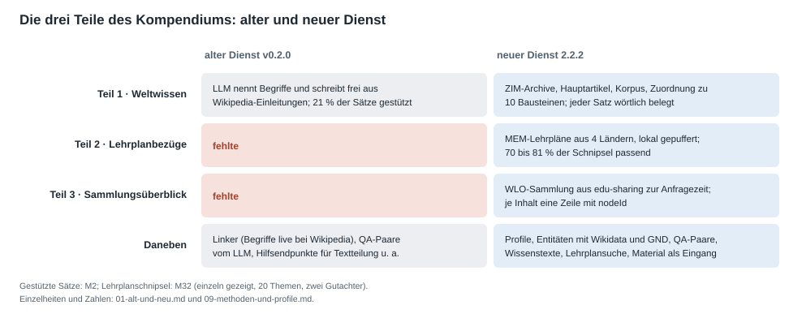
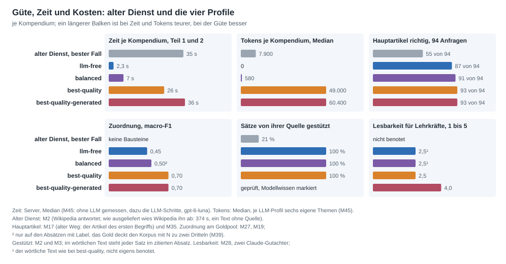

# Alter und neuer Dienst im Vergleich

[Übersicht](README.md) · Stand 29.09.2026 · neuer Dienst: Release 2.4.2, Messwerte mit 2.2.2 · alter Dienst: v0.2.0
(`alterCode/compendious`) · Messungen: [Messprotokoll](05-messprotokoll.md), vor allem M1 bis M3, M17, M37 und M45 ·
Methoden je Schritt: [Methoden, Messwerte und Profile](09-methoden-und-profile.md)

Ein Kompendium hat nach dem neuen Soll drei Teile: Weltwissen, Lehrplanbezüge und einen Überblick über die
WLO-Sammlung zum Thema. Der alte Dienst, nach seinem README ein weitgehend KI-generierter Proof of Concept, erzeugte
davon nur das Weltwissen, als freien Text eines LLM-Aufrufs. Der neue Dienst erzeugt alle drei Teile. Das Weltwissen
übernimmt er wörtlich und belegt aus Wikipedia und Klexikon; ein Sprachmodell arbeitet nur dort, wo das gewählte
Profil es vorsieht.

## Die drei Teile: Soll, alter und neuer Dienst

| Teil | Soll | alter Dienst v0.2.0 | neuer Dienst 2.2.2 |
|---|---|---|---|
| **1 · Weltwissen** | gesichertes Wissen zum Thema, gegliedert nach dem Template SC26 in 13 Bausteine: zehn aus den Quellen, dazu Akteure, Quellen und Glossar; jede Aussage belegt | ein LLM nennt bis zu zehn Begriffe; je Begriff holt der Dienst live die Einleitung des Wikipedia-Artikels; ein zweiter LLM-Aufruf schreibt daraus einen freien Text. Die 15 Aspekte des damaligen Templates stehen nur als Hinweis im Prompt | Wikipedia und Klexikon als ZIM-Archive beim Dienst. Ein Hauptartikel, ein Korpus aus bis zu 12 ganzen Artikeln, jeder Absatz einem der zehn Inhaltsbausteine zugeordnet und wörtlich mit Belegnummer übernommen; Akteure, Quellen und Glossar aus denselben Artikeln. Je Profil helfen LLM-Schritte bei Artikelwahl, Korpus, Zuordnung und Text |
| **2 · Lehrplanbezüge** | was Lehrpläne aller Bildungsstufen zum Thema vorsehen, nach Stufe, Land und Lehrplan | fehlte | die MEM-Lehrpläne aus vier Ländern (2.514 Lehrpläne, 295.184 Elemente) als lokaler Cache; Suche mit Fach- und Wortgrenzenfilter, nach Stufe, Land und Lehrplan gruppiert, die Herkunft je Block genannt; in den `best-quality`-Profilen prüft ein LLM jedes Element |
| **3 · Sammlungsüberblick** | was die WLO-Sammlung zum Thema enthält, für Menschen lesbar und für Maschinen auswertbar | fehlte | die Sammlung aus edu-sharing zur Anfragezeit: Kopf mit Kennzahlen, je Inhalt eine Zeile mit Art, Stufe, Lizenz und nodeId, Untersammlungen eine Ebene tief; optional eine zweite Sammlung als Quelle für Teil 1 |

## Güte, Zeit und Kosten

- **Alter Dienst:**
  - Im besten Fall, also wenn Wikipedia antwortete, brauchte er je Kompendium 35 s und rund 7.900 Tokens.
  - Den Hauptartikel nannte er an erster Stelle bei 55 von 94 Goldanfragen.
  - Nur 21 % seiner Sätze stützt der zitierte Text.
- **`llm-free`:** ist auf dem Server in 2,3 s fertig und braucht keine Tokens. Den Hauptartikel trifft es bei 87 von 94, und jeder Satz steht wörtlich im zitierten Absatz.
- **`balanced` (Standard):** fragt das LLM an zwei Stellen, bei unsicheren Hauptartikeln und nach Übersicht und Teilen des Themas. Das dauert rund 7 s und kostet 580 Tokens. Dafür trifft es 91 von 94, und bei Sammelthemen stammen 87 statt 43 % der gedruckten Absätze aus passenden Artikeln.
- **`best-quality`:** lässt das LLM zusätzlich die Absätze zuordnen und die Lehrplanschnipsel prüfen. Die Zuordnung steigt auf macro-F1 0,70 statt 0,45, für 26 s und rund 49.000 Tokens.
- **`best-quality-generated`:** lässt das LLM auch den Text schreiben. Lesbar ist er mit 4,0 statt 2,5 von 5, das dauert 36 s und kostet rund 60.000 Tokens.

**Was man bekommt:**
- `llm-free` ist schnell und kostet nichts.
- Der Standard verdoppelt etwa die Zeit, für den deutlich besseren Korpus und die treffsicherere Artikelwahl.
- Die beiden `best-quality`-Profile sind für die Vorbereitung durch die Redaktion gedacht, nicht für Massenabrufe. Das Tagesbudget von 2 Mio. Tokens reicht für rund 40 beziehungsweise 33 Kompendien.

## Teil 1: Weltwissen

### Der alte Dienst

Der Weg vom Thema zum Text (`POST /api/v1/pipeline-compendium-only`):

1. **Begriffe:**
   - Ein LLM-Aufruf nennt bis zu zehn Begriffe zum Thema, jeweils mit dem vermuteten exakten Wikipedia-Titel (`app/core/openai_wrapper.py`, Temperatur 0,7).
2. **Wikipedia:**
   - Je Begriff fragt der Dienst die MediaWiki-API mit genau diesem Titel ab und holt nur den Einleitungsabschnitt.
   - Findet er nichts, probiert er bis zu acht Schreibvarianten und lässt ein LLM bis zu drei Synonyme vorschlagen.
   - Die Begriffe laufen nacheinander.
3. **Text:**
   - Ein einziger LLM-Aufruf schreibt das ganze Kompendium: Ziel 6.000 Zeichen, höchstens 4.000 Ausgabetokens (`app/core/compendium.py`).
   - Im Prompt stehen die Einleitungen, die 15 Aspekte als Liste von Überschriften und die Anweisung, mit „(1)“, „(2)“ auf die URL-Liste zu verweisen.

Die 15 Aspekte hält das Modell meist ein, im Median 14,5 als Überschrift. Der Code prüft sie aber nicht, und es gibt keinen eigenen Schritt je Aspekt.

### Der neue Dienst

Teil 1 entsteht in fünf Schritten; die Methoden und ihre Messwerte stehen auf
[Methoden, Messwerte und Profile](09-methoden-und-profile.md):

1. **Hauptartikel:**
   - Den Hauptartikel findet der Index des Archivs: exakter Titel, Weiterleitung, Begriffsklärung nach den Fachwörtern, Titelvorschläge, Volltextsuche.
   - Ab `balanced` entscheidet ein LLM die unsicheren Fälle.
2. **Korpus:** Der Hauptartikel, sein Klexikon-Zwilling und weitere Artikel bilden den Korpus. Welche weiteren Artikel es sind, hängt vom Profil ab:
   - `llm-free`: verlinkte Unterartikel und verlinkte Volltexttreffer.
   - ab `balanced`: die Artikel, die das LLM als Übersicht und Teile des Themas nennt.
3. **Zuordnung:**
   - Jeder Absatz kommt in höchstens einen der zehn Inhaltsbausteine.
   - Die Regel-Policy mit Model2Vec ordnet zu, in `best-quality` das LLM.
4. **Text:**
   - Die zugeordneten Absätze werden wörtlich übernommen, jeder Satz mit Belegnummer.
   - In `best-quality-generated` schreibt das LLM jeden Baustein und markiert Modellwissen sichtbar.
5. **Neu erzeugen, auf Wunsch:**
   - Mit `existing_markdown` bleiben redaktionell geprüfte Bausteine wörtlich stehen.
   - Mit `regenerate_sections` entstehen nur die genannten Bausteine neu.

### Messvergleich vom 23.09.2026

Dieselben zehn Themen aus zehn Schulfächern. Der alte Dienst lief unverändert über die b-api, der neue auf dem Server
ohne Sprachmodell; das war damals der Standard und ist heute das Profil `llm-free`.

| | Alt, wie ausgeliefert | Alt, bester Fall | Neu, ohne LLM |
|---|---|---|---|
| Themen | 1 (Optik) | 10 | 10 |
| Dauer | 374 s | Median 35 s (29–62 s) | Teil 1: Median 2,0 s (1,1–2,5 s) |
| Modellaufrufe | 12 | Median 3,5 (2–7) | 0 |
| Tokens | 4.926 | Median 7.913 | 0 |
| Wikipedia-Anfragen | 240, alle abgelehnt | Median 14, alle beantwortet | keine |
| Quellen | keine | Median 10 Einleitungen | Median 10,5 ganze Artikel |
| Begriffsklärungsseiten als Quelle | – | 10 (in 3 Themen) | 0 von 87 Quellen |
| Hauptartikel des Themas dabei | – | 9 von 10 | 10 von 10 |
| Sätze mit Quellenangabe | 0 (15 Verweise ins Leere) | 24 % | jeder Absatz belegt |
| Sätze durch ihre Quelle gestützt | 0 % | 21 % | 100 %: jeder Satz steht wörtlich im zitierten Absatz |
| Umfang | 11.906 Zeichen | Median 13.200 Zeichen | Median 7.600 Zeichen Bausteintext, 25.200 mit Akteuren, Quellen und Glossar |

- **Bester Fall:** Nur über die Konfiguration steht eine Kontaktadresse im User-Agent, sodass Wikipedia antwortet.
- **Umfang:** Der alte Text ist länger, weil das Modell frei schreibt. Der neue enthält nur, was die Quellen hergeben, und lässt Bausteine ohne passenden Absatz weg.
- **Wiederholbarkeit:** Zweimal dieselbe Anfrage an den neuen Dienst ergab in der Stichprobe denselben Text.

Die aktuellen Werte je Profil zeigen die Grafik oben und M45.

## Teil 2: Lehrplanbezüge

**Alter Dienst:** Teil 2 gab es nicht.

**Neuer Dienst:**
- **Daten:**
  - Maschinenlesbar liegen Lehrpläne nur in MEM vor, dem Triplestore der FWU.
  - Ein Sidecar holt alle Lehrpläne in einen lokalen Cache: 2.514 Lehrpläne aus Bayern, Sachsen, Rheinland-Pfalz und Berlin.
  - Er prüft wöchentlich und holt spätestens nach einem Monat alles neu.
  - Zur Anfragezeit fragt der Dienst MEM nicht.
- **Zeit:** Teil 2 kostet auf dem Server im Median 240 ms.
- **Suche:**
  - Gesucht wird mit dem Thema, seinen Synonymen und passenden Unterartikeln, gefiltert nach Fach und Wortgrenzen.
  - Treffer, die nur in einer Überschrift stehen, stehen gebündelt in einer Zeile.
  - Mit dieser Bündelung sind 70 bis 81 % der einzeln gezeigten Elemente passend (M32).
  - In den `best-quality`-Profilen prüft das LLM jedes Element: 74 bis 79 % passend, keines der passenden verworfen.
- **Darstellung:** Der Text gruppiert nach Stufe, Land und Lehrplan und nennt je Block die Herkunft, lesbar und als Facettenmarker.
- **Einzeln:** Die Suche gibt es auch als eigenen Endpunkt, `GET /api/v2/lehrplan/search`.

## Teil 3: Sammlungsüberblick

**Alter Dienst:** Teil 3 gab es nicht.

**Neuer Dienst:**
- **Quelle:** Teil 3 entsteht zur Anfragezeit aus edu-sharing.
- **Inhalt:**
  - Kopf der Sammlung mit Kennzahlen.
  - Je Inhalt eine Zeile mit Titel, Art, Stufe, Lizenz und nodeId, die ein regulärer Ausdruck auslesen kann.
  - Die Untersammlungen eine Ebene tief.
- **Zeit:** Aus dem Zwischenspeicher dauert Teil 3 höchstens 0,16 s, beim ersten Abruf bis 3,5 s.
- **Teil 1 aus Material:** Optional liefert eine zweite Sammlung Material als Quelle für Teil 1. Wörtlich übernommen wird es nur unter freien Lizenzen.
- **Einzeln:** Teil 3 allein gibt es als `GET /api/v2/collections/{id}/overview`.

## Zusatzfunktionen des neuen Dienstes

| Funktion | alter Dienst v0.2.0 | neuer Dienst 2.4.2 |
|---|---|---|
| Profile (`preset`) | – | vier Profile; ein Schalter wählt die Methoden aller Schritte (D53) |
| Ein Material als Eingang (`node_id`, `GET /api/v2/nodes/{id}`) | – | Titel, Beschreibung, Schlagwörter, Fach und Stufe eines Materials; eine eigene Artikelwahl dafür, mit Thema kombinierbar (D45, D47) |
| Wissenstexte ohne Template (`POST /api/v2/knowledge`) | – | die Artikel des Korpus mit ihren Abschnitten, gewählt wie für das Kompendium |
| Entitäten in einem Text (`POST /api/v2/entities`) | `/api/v1/linker`: ein LLM nennt Begriffe, jeder live bei Wikipedia nachgeschlagen | je Profil die Regeln (spaCy und die Artikeltitel des Archivs) oder das LLM, das die Entitäten mit ihrem Artikel nennt: F1 0,38 und 0,78 (M36); ohne Live-Abfrage |
| Kennungen der Entitäten | Wikidata-Nummer live | Wikidata, GND, VIAF und DBpedia aus lokalen Indexen, die zwei Sidecars bauen (D64, D65) |
| QA-Paare (`POST /api/v2/qa`) | `/api/v1/qa`: ein LLM schreibt die Paare, auch nach Bildungsstufen | je Profil die Regeln aus dem Satzbau oder das LLM, zu einem Text, einem Thema oder einem Material, auf Wunsch über Bildungsstufen verteilt (`levels`); 61 und 83 % mangelfrei (M34, M30) |
| Lehrplansuche (`GET /api/v2/lehrplan/search`) | – | Teil 2 ohne Kompendium, zu einem Stichwort oder Thema |
| Sammlungsüberblick allein (`GET /api/v2/collections/{id}/overview`) | – | Teil 3 ohne Kompendium |
| Templates (`/api/v2/templates`) | 15 Aspekte im Prompt | SC26 und `standard`; eigene Templates mit Rollen je Baustein anlegen und löschen (Admin-Token) |
| Geprüfte Bausteine behalten, Teile neu erzeugen | – | `existing_markdown`, `regenerate_sections` |
| Archive und Indexe aktuell halten | – | Sidecars für ZIM-Archive, Lehrplan-Cache, Wikidata- und GND-Index; Archive wechseln atomar nach Prüfsumme |
| Prüfansicht im Browser (`/ui/`, `UI_ENABLED`) | – | eine Seite der API, auf der Menschen ohne Kenntnis der API die Antworten aller fünf Endpunkte prüfen: Herkunft je Absatz mit Beleg, Qualität, Zeit und Kosten, zwei Profile im Vergleich, Markdown kopieren und speichern (D66) |
| Betrieb | `/health` | `/health`, `/ready`, Prometheus-Metriken und Alarme, optionaler API-Schlüssel, Rate-Limit, `parts_status` je Teil, Request-ID in jeder Antwort |
| Hilfsendpunkte für Textteilung, Synonyme, Übersetzung (`/api/v1/utils`) und die Kette `/api/v1/pipeline` | vorhanden | entfallen: Das Kompendium und `/qa` decken die Kette ab |

Aus der Testapp `kompendium-test` kamen der ZIM-Zugriff, die Segmentierung, die Ranker BM25, Zeichen-TF-IDF und
Model2Vec, die extraktive Synthese und die Idee, jeden Satz gegen seine Quelle zu prüfen.

## Probleme des alten Dienstes und was der neue dagegen setzt

| Problem des alten Dienstes | Beleg | Lösung im neuen Dienst |
|---|---|---|
| Wikipedia weist ihn ab | Sein Client meldet sich ohne Kontaktangabe. Im Lauf zu „Optik“ kamen auf 240 Anfragen 240 Ablehnungen (403); er wiederholte sie viermal und brauchte 374 s | Wikipedia und Klexikon liegen als ZIM-Archive beim Dienst; zur Anfragezeit gibt es keinen Wikipedia-Zugriff. Neue Archive holt ein Sidecar mit Prüfsumme |
| Der Ausfall bleibt unsichtbar | Antwort mit HTTP 200 und 11.906 Zeichen Text ohne eine einzige Quelle, darin 15 Verweise „(1)“ ins Leere | passende Statuscodes, `parts_status` je Teil, Metriken und Alarme |
| Titel werden geraten statt gesucht | In drei von zehn Themen waren zehn der „Quellen“ Begriffsklärungen; an 94 Goldanfragen stand der richtige Artikel 55 Mal an erster Stelle (M17) | Auflösung über den Index des Archivs, Begriffsklärungen erkannt: 87 von 94 mit den Regeln, 91 und 93 mit dem LLM |
| Nur Einleitungen als Quelle | im Median rund 12.200 Zeichen Einleitung für 13.200 Zeichen Text | ganze Artikel, bis 12 Artikel und 400 Absätze |
| Text großteils unbelegt | 24 % der Sätze mit Quellenangabe, 21 % von ihr gestützt; Verweise zeigen auf ganze Artikel | jeder Satz steht wörtlich im zitierten Absatz; jede Belegnummer führt zu Artikel, Abschnitt und Textstelle |
| Dauer und Kosten | im besten Fall 35 s und 7.900 Tokens, fast die ganze Zeit Warten auf das Modell | 2,3 s ohne Tokens (`llm-free`), rund 7 s und 580 Tokens im Standard (M45) |
| Keine Struktur | 15 Aspekte als Hinweis im Prompt, vom Code nicht geprüft | Template SC26 mit 13 Bausteinen, Längenbudgets, Facetten und maschinenlesbaren Markern |
| Nur Weltwissen | – | Teil 2 Lehrplanbezüge, Teil 3 Sammlungsüberblick |
| Fehler als normale Antwort | „# Fehler bei der Generierung …“ als Markdown in einer normalen Antwort | Fehlerantworten mit einem Fehlermodell in OpenAPI |
| Betrieb | der synchrone LLM-Client blockiert die Event-Loop des Servers | LLM-Aufrufe in Threads, mit Frist, Budget und Schutzschalter |
| Tests nur mit Attrappen | jeder LLM- und Wikipedia-Aufruf ersetzt | 1.528 Tests (Stand 28.09.2026), CI mit Rauchtest des fertigen Images, Messungen am Goldstandard |
