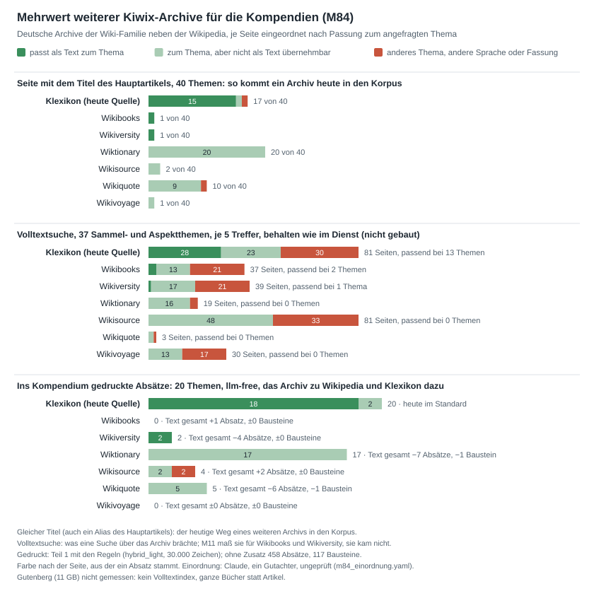

# Messprotokoll (23.09. bis 09.10.2026)

[Übersicht](README.md) · Skripte und Ergebnisdateien: [messung/](messung/README.md)

## Umgebung

| Was | Stand |
|---|---|
| Server | Hostinger, Image v2.0.0 aus GHCR, zwei Worker; Archive `wikipedia_de_all_nopic_2026-01` und `klexikon_de_all_maxi_2026-08`; Lehrplan-Cache vom 22.09.2026; edu-sharing `repository.staging.openeduhub.net` |
| Entwicklungsrechner | Windows 11, Python 3.13.5; venv des neuen Dienstes, venv der Testapp (torch 2.14, transformers 5.17, model2vec 0.9), venv des alten Dienstes nach seiner Lock-Datei (openai 2.26, aiohttp 3.12.13); dieselben Archive |
| Testsuite | 767 Tests bestanden, 94,11 % Abdeckung mit `matcher=llm` (D34); Stand `02070a3` nach 2.0.0: 753 Tests, 94,04 %; Schwelle der CI 90 % |
| Sprachmodelle | `gpt-4.1-mini` für den alten Dienst, `gpt-5.6-luna` für den Richter und als Zuordner, alle über die b-api |
| Tokens für diese Messungen | alter Dienst 87.710 (`gpt-4.1-mini`); mit `gpt-5.6-luna`: Richter 67.936, LLM als Zuordner 144.596, Richter der Artikelwahl 21.166, `matcher=llm` im Dienst 144.486 laut b-api, davon acht Themen aus ihrem Zwischenspeicher. M9 bis M12 (24.09.2026): Artikelwahl 17.116, Trefferprüfung 6.330 und 14.240, Zusatzquellen 18.188, schärfere Beschreibungen 149.910, Zuordnung nur für unsichere Absätze 71.173, mit 50 und 400 105.727; M12 zweiter Lauf 144.758 und 103.368; M13 Artikelwahl 34.288, `matcher=llm` 146.848; M14 `matcher=llm` 172.440; dazu Wiederholungen aus dem Zwischenspeicher der b-api (dieselben Prompts, dieselben Antworten), die sie trotzdem mit ihren Tokens meldet |

Gerundet wird kaufmännisch. Nebenwerte (Testsuite, Entitätenerkennung, Kiefer-Alternativen, Länge von Teil 2,
Knotenzeilen von Teil 3) stehen in `messung/ergebnisse/nebenwerte.txt`, die Suchzeiten des Wikipedia-Archivs in
`zim_suche.json`: Titelvorschlag im Median 2,9 ms, Volltextsuche 0,4 ms, gemessen auf dem Entwicklungsrechner direkt
nach den Korpusläufen, also mit der Datei im Speicher des Betriebssystems.

## M1 Laufzeit des neuen Dienstes

**Aufbau:** 20 Themen (die zehn Goldthemen, die vier Richterthemen und sechs weitere Schulthemen). Nach einer
Aufwärmanfrage kam jedes Thema einmal (Durchgang 1), danach alle noch einmal (Durchgang 2), jeweils mit Teil 1 und 2.
Dazu kamen drei Sammlungen mit allen drei Teilen und mit Teil 3 allein. Jede Anfrage schaltete das Sprachmodell
ausdrücklich ab; kein Audit meldete eine LLM-Nutzung. 47 Anfragen, alle mit HTTP 200.

| Server | Median | 90. Perzentil | Maximum |
|---|---|---|---|
| Teil 1 und 2, Durchgang 1 | 2,81 s | 3,96 s | 4,34 s |
| Teil 1 und 2, Durchgang 2 | 1,98 s | 2,61 s | 3,42 s |
| alle drei Teile (drei Sammlungen) | 3,09 s | – | 5,52 s |
| Teil 3 allein | 0,16 s | – | 0,16 s |

| Schritt (Durchgang 1, Median) | Dauer |
|---|---|
| Thema auflösen | 32 ms |
| Korpus aus den Archiven | 882 ms |
| Segmentieren | 18 ms |
| Zuordnen | 291 ms |
| Text bauen (samt Akteuren, Quellen, Glossar) | 1.087 ms |
| Teil 2 | 240 ms |
| Zusammensetzen | 3 ms |

Beim ersten Abruf einer Sammlung kostete Teil 3 bis 3,45 s. Im lokalen Container dauerte Durchgang 1 im Median
7,0 s, weil Docker Desktop die Archive über das Windows-Dateisystem liest; für den Vergleich zählen die
Serverwerte. Die Entitätenerkennung brauchte für einen Beispielsatz 0,07 bis 0,15 s.

## M2 Alter Dienst

**Aufbau:** Der Code v0.2.0 blieb unverändert. Ein Messrahmen ruft die Funktion hinter
`POST /api/v1/pipeline-compendium-only` direkt auf und zeichnet an zwei Bibliotheksaufrufen auf: jeden Chat-Aufruf
(Dauer, Tokens) und jede HTTP-Anfrage (Adresse, Status, Dauer). Modell `gpt-4.1-mini` am b-api-Endpunkt `openai`;
das Standardmodell im Code, `deepseek-r1`, bietet die b-api nicht mehr an.

- **Wie ausgeliefert** (User-Agent ohne Kontakt), Thema Optik: 374,3 s, 12 Modellaufrufe (1 für Begriffe,
  10 für Synonyme, 1 für den Text), 4.926 Tokens; 240 Wikipedia-Anfragen, alle mit 403 beantwortet; keine Quelle.
  Der Aufruf endete ohne Fehler, über HTTP wäre das ein 200. Ergebnis: 11.906 Zeichen Text, 78 Sätze, 15 Verweise
  „(1)“, Literaturverzeichnis „Keine Referenzen verfügbar“.
- **Nachstellung der Abweisung:** Dieselbe Anfrage über aiohttp mit dem alten User-Agent ergab 403 mit Verweis auf
  die Robot-Policy von Wikimedia, mit einer Kontaktadresse im User-Agent 200. Über `curl` kam auch der alte
  User-Agent durch; Wikimedia bewertet also vermutlich Client und User-Agent zusammen.
- **Bester Fall** (`PROJECT_NAME` mit Kontaktadresse, Code unverändert), zehn Goldthemen:

| Thema | Dauer | Aufrufe | Tokens | Wikipedia-Anfragen | Begriffe mit Artikel | verschiedene Artikel | Begriffsklärungen | Sätze | mit Quellenangabe | gestützt |
|---|---|---|---|---|---|---|---|---|---|---|
| Barockliteratur | 37,0 s | 3 | 8.685 | 12 | 9 von 9 | 9 | 0 | 101 | 20 | 18 |
| Bruchrechnung | 60,4 s | 7 | 8.200 | 34 | 8 von 10 | 5 | 0 | 95 | 12 | 11 |
| Demokratie | 32,6 s | 2 | 7.819 | 10 | 10 von 10 | 10 | 0 | 87 | 29 | 28 |
| Französische Revolution | 29,4 s | 4 | 7.220 | 16 | 10 von 10 | 10 | 0 | 81 | 29 | 27 |
| Klimawandel | 28,8 s | 2 | 11.044 | 10 | 10 von 10 | 10 | 0 | 83 | 9 | 8 |
| Optik | 30,8 s | 4 | 7.880 | 18 | 10 von 10 | 10 | 4 | 76 | 17 | 15 |
| Photosynthese | 28,6 s | 2 | 7.946 | 10 | 10 von 10 | 9 | 0 | 77 | 28 | 27 |
| Programmiersprache | 43,1 s | 6 | 7.307 | 22 | 10 von 10 | 10 | 4 | 95 | 28 | 18 |
| Säure-Base-Konzepte | 62,4 s | 7 | 8.845 | 32 | 9 von 10 | 8 | 2 | 110 | 30 | 26 |
| Sinfonie | 37,5 s | 2 | 7.838 | 10 | 10 von 10 | 10 | 0 | 111 | 18 | 14 |
| **Summe oder Median** | **Median 34,8 s** | **39** | **82.784** | **174** | **96 von 99** | **91** | **10** | **916** | **220 (24 %)** | **192 (21 %)** |

Die 82.784 Tokens verteilen sich auf 46.590 Eingabe- und 36.194 Ausgabetokens. Der Textaufruf dauerte im Median 26,3 s
und schrieb im Median 2.865 Tokens. Die Wikipedia-Anfragen dauerten je Thema zusammen im Median 3,3 s (2,3 bis
22,6 s). „Gestützt“ heißt: Mindestens 20 % der Inhaltswörter eines Satzes stehen in der Einleitung, auf die er
verweist; geprüft mit dem Belegcode des neuen Dienstes. 25 zitierte Sätze fielen durch, 3 waren zu kurz für ein
Urteil. Die 696 Sätze ohne Quellenangabe wurden nicht mit den Quellen verglichen. Die Begriffsklärungen waren Brechen,
Beugung, Polarisierung, Interferenz (Optik), Bedeutungslehre, Assembler, Hochsprache, Verfahren (Programmiersprache)
sowie Säuregrad und Wasserstoffion (Säure-Base-Konzepte). Einzelwerte je Thema:
`messung/ergebnisse/m2_alter_dienst_details.json`.

## M3 Teil 1 im neuen Dienst

**Aufbau:** Die zehn Goldthemen, nur Teil 1, regelbasiert, vom Server. Lokal wurde derselbe Korpus aus denselben
Archiven aufgebaut, sodass hinter jeder Belegnummer der zitierte Absatz bekannt ist. Geprüft wurden die gematchten
Bausteine 1 bis 5 und 7 bis 11: Jeder Satz mit eigener Belegnummer muss wörtlich in dem Absatz stehen, auf den die
Nummer zeigt. Listenpunkte tragen keine eigene Nummer, weil die Liste als Ganzes belegt ist; sie müssen in einem der
Absätze stehen, die ihr Baustein zitiert. Tabellenzeilen wurden nicht geprüft. Die Sätze wurden mit demselben Code
zerlegt wie beim alten Dienst. Die Dauer stammt aus dem ersten Lauf; die Belegprüfung lief in einem zweiten Lauf mit
denselben Texten.

| Thema | Dauer Teil 1 | Quellartikel | belegte Bausteine (samt erzeugten) | Zeichen Bausteintext | Markdown gesamt | Sätze mit eigener Nummer, im zitierten Absatz | Listenpunkte, im Baustein belegt |
|---|---|---|---|---|---|---|---|
| Barockliteratur | 1,6 s | 2 | 7 von 13 | 5.838 | 19.098 | 34 von 34 | – |
| Bruchrechnung | 2,4 s | 5 | 4 von 13 | 3.014 | 11.493 | 23 von 23 | – |
| Demokratie | 2,1 s | 12 | 11 von 13 | 9.466 | 29.470 | 55 von 55 | 7 von 7 |
| Französische Revolution | 2,3 s | 12 | 9 von 13 | 7.091 | 23.936 | 33 von 33 | 11 von 11 |
| Klimawandel | 2,4 s | 9 | 11 von 13 | 8.721 | 26.475 | 45 von 45 | – |
| Optik | 1,1 s | 12 | 11 von 13 | 8.121 | 31.785 | 62 von 62 | – |
| Photosynthese | 2,5 s | 8 | 7 von 13 | 6.419 | 19.460 | 39 von 39 | – |
| Programmiersprache | 1,5 s | 12 | 12 von 13 | 12.390 | 34.061 | 70 von 70 | 8 von 8 |
| Säure-Base-Konzepte | 1,9 s | 3 | 6 von 13 | 2.995 | 12.035 | 21 von 21 | – |
| Sinfonie | 1,8 s | 12 | 10 von 13 | 9.261 | 29.470 | 50 von 50 | – |
| **Summe oder Median** | **Median 2,0 s** | **Median 10,5** | | **Median 7.606** | **Median 25.206** | **432 von 432** | **26 von 26** |

Weitere Prüfungen (`messung/ergebnisse/m3_pruefungen.txt`):

- In allen zehn Themen ist der Hauptartikel die erste Quelle. Unter den 87 Quellen ist keine Begriffsklärungsseite.
- Zweimal dieselbe Anfrage (Photosynthese, Teil 1 und 2) ergab bis auf den Zeitstempel denselben Text von 93.335
  Zeichen.
- Keine Belegnummer zeigte auf einen Absatz, den es im lokal aufgebauten Korpus nicht gibt.

## M4 Zuordnung: alle Verfahren im Ablauf des Dienstes

**Aufbau:** Für jedes der zehn Themen wurde der Korpus mit dem Code 2.0.0 gebaut, zusammen 1.632 Absätze, und die 603
noch bewertbaren Labels wurden zugeordnet; 40 von 643 Labels passen zu keinem heutigen Absatz mehr. Jedes Verfahren
nimmt den Weg von `CompendiumService.match`: Ranker, Zusammenführung, Glättung und Policy mit einem Längenziel von
12.000 Zeichen.

- **Ranker des Dienstes:** direkt gerechnet. Ein Nachbau von `hybrid_light` aus seinen Bestandteilen ergab auf
  allen zehn Themen und in beiden Pools dieselbe Zuordnung wie der Dienst.
- **Modelle der Testapp:** Sie bewerteten zuerst in der Umgebung der Testapp alle Paare aus Baustein und Absatz.
  Dabei sahen sie dieselben Texte wie die Ranker des Dienstes: Überschriftenpfad plus Text gegen Titel,
  Beschreibung, Inhalte, Unterpunkte und Suchbegriffe. Ihre Werte liefen dann als Ranker durch denselben Weg.
- **Frage-Antwort-Modell:** Es prüfte wie in der Testapp nur die 15 besten MiniLM-Kandidaten je Baustein, mit
  ihrer Formel ohne die Stichwort-Boni.

Klassifikation heißt die Entscheidung je Absatz vor den Längenbudgets (macro- und micro-F1). „Richtig unter Top 2“
zählt unter den zwei besten Absätzen je Baustein die mit Gold-Label, die richtig sitzen. Die Tabelle gilt für den
vollen Kandidatenpool, also alle Absätze des Korpus:

| Verfahren | macro-F1 | micro-F1 | zugeordnet | davon falsch | richtig unter Top 2 | belegte Bausteine | Rechenzeit je Thema |
|---|---|---|---|---|---|---|---|
| nur Überschriften-Lexikon | 0,35 | 0,65 | 518 | 184 | 63,9 % | 5,1 | 0,02 s |
| BM25 | 0,37 | 0,65 | 525 | 189 | 61,5 % | 5,6 | 0,03 s |
| Zeichen-TF-IDF | 0,42 | 0,64 | 538 | 203 | 55,6 % | 7,1 | 0,25 s |
| Model2Vec allein | 0,45 | 0,62 | 550 | 218 | 53,7 % | 7,3 | 0,04 s |
| MiniLM-Satzvektoren allein | 0,37 | 0,60 | 550 | 229 | 48,3 % | 7,3 | 4,1 s |
| Cross-Encoder allein | 0,30 | 0,53 | 550 | 270 | 35,6 % | 8,8 | 73,3 s |
| Frage-Antwort-Modell (MiniLM-Kandidaten) | 0,38 | 0,65 | 527 | 190 | 55,6 % | 6,1 | 29,8 s |
| BM25 + Model2Vec | 0,44 | 0,65 | 535 | 194 | 62,9 % | 5,9 | 0,05 s |
| `hybrid_light` ohne Model2Vec | 0,39 | 0,65 | 531 | 193 | 61,2 % | 6,0 | 0,26 s |
| **Standard** (`hybrid_light` + Model2Vec) | 0,45 | 0,66 | 533 | 189 | 67,1 % | 6,0 | 0,30 s |
| Standard, vom Cross-Encoder umsortiert | 0,35 | 0,51 | 568 | 289 | 37,9 % | 8,6 | 14,9 s |
| Standard + Cross-Encoder als vierter Ranker | 0,37 | 0,64 | 535 | 197 | 57,9 % | 6,5 | 73,6 s |

Rechenzeiten (Entwicklungsrechner, nur CPU):

- **Ranker des Dienstes:** Mittelwert über die zehn Themen mit Aufwärmlauf.
- **Modelle der Testapp:** Median je Thema für ihre Paare. Der Cross-Encoder schaffte 46,8 ms je Paar. Das
  Frage-Antwort-Modell brauchte über alle Paare für Demokratie allein 746 s, deshalb die Kandidaten.
- **Umsortieren:** der Standard plus die Cross-Encoder-Zeit für die Kandidatenpaare, im Median rund 310 je Thema.

Nur auf den 603 gelabelten Absätzen gerechnet (Goldpool), bleibt die Reihenfolge fast gleich (M5). Die F1-Werte je
Baustein stehen in `messung/ergebnisse/m3_pruefungen.txt`, die vollständige Ausgabe in `m4_goldstandard.txt` und
`m4_tabellen.json`.

## M5 LLM als Zuordner

**Aufbau der ersten Messung (Skript `mc_llm_matcher.py`):** `gpt-5.6-luna` über die b-api, mit den
Voreinstellungen des Dienstes (`reasoning_effort` und `verbosity` niedrig), bekam je Aufruf:

- die zehn Inhaltsbausteine mit Titel, Beschreibung, „gehört hinein“ und „gehört nicht hinein“;
- die Labelregeln des Goldstandards aus `eval/README.md`;
- 25 Absätze, je mit Artikel und dessen Rolle, Überschriftenpfad und Text (bis 700 Zeichen).

Es antwortete je Absatz mit Baustein oder „keiner“ und einer Sicherheit von 0 bis 1. Die Sicherheit ordnet die
Absätze je Baustein für „richtig unter Top 2“. Vier Aufrufe liefen parallel. Das Ergebnis: 28 Aufrufe, keiner
fehlgeschlagen, alle 603 Absätze beantwortet, kein unbekannter Baustein-Schlüssel.

**Nachmessung im Dienst (`matcher=llm`, D34, Skript `mc_llm_dienst.py`):** Der Prompt ging unverändert in den
Dienst; die Regeln stehen dort als `assignment_rules` im Template. Ein Vergleich der Anfragen ergab in 29 Stapeln
aus drei Themen Zeichen für Zeichen dieselben. Für jedes Goldthema baute `CompendiumService.prepare` den Korpus, er
wurde auf die gelabelten Absätze geschnitten, und `CompendiumService.match` lief mit `matcher=llm`, vier Aufrufe
parallel. Das Ergebnis: 28 Aufrufe, keiner fehlgeschlagen, kein Absatz fiel auf die Regeln zurück. Der Dienst gab
601 Absätze an das Modell, weil er zwei für das Akteursverzeichnis zurückhält; die b-api meldete 144.486 Tokens.
Acht Themen beantwortete sie aus ihrem Zwischenspeicher, mit denselben Antworten und Tokenzahlen wie im ersten Lauf
und 0,1 bis 3,3 s je Thema. In Optik und Sinfonie verschoben die zurückgehaltenen Absätze die Stapel, das Modell
antwortete neu (8,7 und 8,1 s), und 17 von 154 Entscheidungen wichen vom ersten Lauf ab. Im Dienst zählt „richtig
unter Top 2“ nach den Längenbudgets wie bei allen anderen Verfahren; der erste Lauf kannte keine Budgets. Zum
Vergleich wurden alle Verfahren aus M4 auf denselben 603 Absätzen gemessen:

| Verfahren | macro-F1 | micro-F1 | zugeordnet | davon falsch | richtig unter Top 2 |
|---|---|---|---|---|---|
| **`matcher=llm` im Dienst** | 0,66 | 0,79 | 547 | 125 | 74,8 % |
| `gpt-5.6-luna`, erste Messung | 0,63 | 0,79 | 547 | 128 | 72,6 % |
| nur Überschriften-Lexikon | 0,35 | 0,65 | 518 | 184 | 63,3 % |
| BM25 | 0,36 | 0,63 | 536 | 203 | 59,8 % |
| Zeichen-TF-IDF | 0,40 | 0,61 | 551 | 223 | 51,4 % |
| Model2Vec allein | 0,41 | 0,57 | 566 | 260 | 43,2 % |
| MiniLM-Satzvektoren allein | 0,37 | 0,57 | 562 | 254 | 41,7 % |
| Cross-Encoder allein | 0,29 | 0,45 | 570 | 327 | 30,6 % |
| Frage-Antwort-Modell (MiniLM-Kandidaten) | 0,37 | 0,64 | 531 | 196 | 53,7 % |
| BM25 + Model2Vec | 0,43 | 0,64 | 546 | 208 | 58,3 % |
| `hybrid_light` ohne Model2Vec | 0,38 | 0,63 | 543 | 207 | 57,4 % |
| **Standard** (`hybrid_light` + Model2Vec) | 0,43 | 0,64 | 546 | 205 | 60,8 % |
| Standard, vom Cross-Encoder umsortiert | 0,32 | 0,43 | 584 | 345 | 35,0 % |
| Standard + Cross-Encoder als vierter Ranker | 0,36 | 0,63 | 546 | 214 | 52,9 % |

**Kosten und Zeit der ersten Messung:** 144.596 Tokens für 603 Absätze, also rund 240 je Absatz. Je Aufruf im Median
5,5 s (höchstens 9,8 s), je Thema im Median 7,5 s Wandzeit. Hochgerechnet mit einem Aufruf je angefangene 25 Absätze,
vier Aufrufen parallel und 240 Tokens je Absatz kostet ein ganzes Kompendium im Median rund 39.000 Tokens (5.500 bis
92.000) und 11 s (höchstens 22 s). Beurteilte das LLM nur die Absätze, die die Ranker überhaupt vorschlagen, wären es
im Median 109 von 162 Absätzen und rund 26.000 Tokens. Die Antworten je Absatz stehen in
`messung/ergebnisse/m5_llm_zuordnung.json`, die Entscheidungen des Dienstes in `m5_llm_dienst.json`.

## M6 Gegenprobe: blinder LLM-Richter

**Aufbau:** Vier Themen, an denen nichts abgestimmt wurde: Plattentektonik, Ökosystem, Atommodell (Weiterleitung
auf *Liste der Atommodelle*) und Industrielle Revolution. Das sind andere Daten als der Goldstandard. Beurteilt
wurden die Verfahren des Dienstes, je Baustein ihre zwei besten Absätze. Je Thema und Baustein wurde die Vereinigung
aller Auswahlen einmal bewertet, gemischt und ohne Verfahrensnamen, acht Absätze je Aufruf, mit dem Prompt vom
18.09.2026. Bewertung: 2 = gehört klar hinein, 1 = teilweise, 0 = gehört nicht hinein.

Bewertungen vom 18.09. wurden übernommen, wo Absatztext und Bausteinbeschreibung unverändert waren. Der erste Lauf
kostete 48 Aufrufe und 62.101 Tokens; ein Teil davon galt Auswahlen aus dem Ablauf der Testapp, die nicht vergleichbar
sind und hier nicht aufgeführt werden. Der Lauf für Model2Vec allein und BM25 + Model2Vec kostete 11 Aufrufe und
5.835 Tokens.

| Verfahren | Absätze | Ø Note | klar | teilweise | falsch | belegte Bausteine | mit Volltreffer |
|---|---|---|---|---|---|---|---|
| **Standard** | 39 | 1,33 | 61,5 % | 10,3 % | 28,2 % | 5,50 | 3,75 |
| BM25 + Model2Vec | 39 | 1,36 | 61,5 % | 12,8 % | 25,6 % | 5,25 | 3,75 |
| `hybrid_light` ohne Model2Vec | 38 | 1,37 | 63,2 % | 10,5 % | 26,3 % | 5,25 | 3,75 |
| Zeichen-TF-IDF | 42 | 1,31 | 59,5 % | 11,9 % | 28,6 % | 5,75 | 3,75 |
| BM25 | 38 | 1,37 | 63,2 % | 10,5 % | 26,3 % | 5,25 | 3,75 |
| nur Überschriften-Lexikon | 38 | 1,39 | 63,2 % | 13,2 % | 23,7 % | 5,25 | 3,75 |
| Model2Vec allein | 49 | 1,16 | 49,0 % | 18,4 % | 32,7 % | 7,00 | 4,25 |

„Belegte Bausteine“ und „mit Volltreffer“ (mindestens ein Absatz mit Note 2) sind Mittelwerte je Thema, von zehn
Inhaltsbausteinen. Je Thema, Anteil klar und falsch:

| Verfahren | Plattentektonik | Ökosystem | Atommodell | Industrielle Revolution |
|---|---|---|---|---|
| **Standard** | 83 % / 0 % (6) | 67 % / 33 % (12) | 50 % / 25 % (8) | 54 % / 38 % (13) |
| BM25 + Model2Vec | 83 % / 0 % (6) | 62 % / 38 % (13) | 57 % / 0 % (7) | 54 % / 38 % (13) |
| `hybrid_light` ohne Model2Vec | 83 % / 0 % (6) | 67 % / 33 % (12) | 57 % / 14 % (7) | 54 % / 38 % (13) |
| Zeichen-TF-IDF | 71 % / 14 % (7) | 69 % / 31 % (13) | 57 % / 0 % (7) | 47 % / 47 % (15) |
| BM25 | 83 % / 0 % (6) | 67 % / 33 % (12) | 57 % / 14 % (7) | 54 % / 38 % (13) |
| nur Überschriften-Lexikon | 83 % / 0 % (6) | 67 % / 33 % (12) | 57 % / 0 % (7) | 54 % / 38 % (13) |
| Model2Vec allein | 60 % / 30 % (10) | 64 % / 29 % (14) | 38 % / 13 % (8) | 35 % / 47 % (17) |

In Klammern die Zahl der bewerteten Absätze; die Stichproben je Thema sind klein. Die Modelle der Testapp im Ablauf
des Dienstes wurden nicht vom Richter beurteilt; Grundlage des Vergleichs ist der Goldstandard. Beim LLM wären
Richter und Zuordner dasselbe Modell.

## M7 Größe des XML-Dumps

**Aufbau:** Aus `dewiki-latest-pages-articles-multistream.xml.bz2` (8,25 GB, Stand 07.09.2026) wurden an 16
gleichmäßig verteilten Stellen je 4 MB geladen und alle darin vollständigen bz2-Blöcke entpackt, zusammen 541
Blöcke. Das Verhältnis entpackt zu gepackt lag bei 3,88 (3,43 bis 4,26), hochgerechnet auf die ganze Datei 32,0 GB
(29,8 GiB). Das ist eine Hochrechnung, keine Messung der ganzen Datei. Größen der übrigen Varianten stehen in
`messung/ergebnisse/m7_xml_dump.txt`.

## M8 Artikelwahl

**Aufbau:** Das Gold liegt in `eval/artikelwahl/` und wurde von Claude festgelegt; redaktionell ist es ungeprüft.

- `hauptartikel.yaml`: 59 Anfragen in sechs Arten mit den akzeptierten Titeln, festgelegt vor dem ersten Lauf.
  Eine Weiterleitung, die Wikipedia für einen akzeptierten Titel setzt, zählt mit. Vor dem Lauf wurde ein Titel nach
  dem Archiv korrigiert: *Welle (Physik)* gibt es nicht, *Welle* ist der Physikartikel.
- `korpus_labels.yaml`: 288 Bewertungen auf der Skala 2 = gehört zum Thema, 1 = verwandt, 0 = passt nicht. Bewertet
  wurden die 221 Artikel, die `build_corpus` für die 20 Themen aus M1 wählt, und die 91 Artikel, die der alte Dienst
  im besten Fall (M2) für die zehn Goldthemen abrief; 24 davon wählten beide. Die Artikel lagen gemischt und
  alphabetisch vor, nur mit Titel und Artikelanfang, ohne Angabe des Dienstes. Klexikon-Artikel verraten ihre
  Herkunft.

Jede Anfrage lief durch `CompendiumService.prepare` mit den Archiven des Servers (Wikipedia und Klexikon). Die
gedruckten Absätze stammen vom Standard (`hybrid_light` mit Model2Vec, 12.000 Zeichen). Als Artikel des alten
Dienstes zählt der Artikel hinter der abgerufenen Adresse; wo Wikipedia umleitete, weicht er vom Titel ab, den sein
LLM geraten hatte („Emblem (Literatur)“ wurde zu *Symbol*).

Der Richter `gpt-5.6-luna` bekam je Thema einen Aufruf mit derselben Skala. Die Artikel waren mit festem Startwert
gemischt, er sah nur Titel und die ersten 180 Zeichen. 20 Aufrufe, 21.166 Tokens, alle 288 Artikel bewertet.

| Art der Anfrage | Hauptartikel richtig |
|---|---|
| normale Themen (die 20 aus M1) | 20 von 20 |
| mit Klassen-, Stufen- oder Fachzusatz | 8 von 8 |
| mehrdeutig, Fach als Kontext | 6 von 16 |
| mehrdeutig, ohne Kontext | 3 von 3 |
| Schreibvariante, Abkürzung, Mehrzahl | 6 von 8 |
| ohne gleichnamigen Artikel zum Thema | 2 von 4 |
| **alle** | **45 von 59** |

| Korpus, 20 Themen | Artikel | Gold: gehört, verwandt, passt nicht | Richter: gehört, verwandt, passt nicht |
|---|---|---|---|
| Hauptartikel | 20 | 100 %, 0 %, 0 % | 100 %, 0 %, 0 % |
| dasselbe Thema aus Klexikon | 14 | 86 %, 14 %, 0 % | 86 %, 0 %, 14 % |
| verlinkte Unterartikel | 140 | 50 %, 41 %, 9 % | 54 %, 41 %, 6 % |
| Volltexttreffer je Baustein | 47 | 32 %, 34 %, 34 % | 40 %, 36 %, 23 % |
| alle gewählten | 221 | 53 %, 34 %, 13 % | 57 %, 33 %, 10 % |
| davon mit Absätzen im Korpus | 183 | 58 %, 31 %, 11 % | 61 %, 31 %, 9 % |
| davon ohne Absatz (Themenfilter) | 38 | 29 %, 50 %, 21 % | 39 %, 47 %, 13 % |

Von den 3.035 Absätzen im Korpus stammen 149 (5 %) aus Artikeln, die nach Gold nicht passen, von den 358
gedruckten 26 (7 %). Am meisten druckt der Standard aus *Probit-Modell* (Lineare Funktion, 5 Absätze) und
*Kernwaffe* (Atommodell, 4).

| Zehn Goldthemen | Artikel | Median je Thema | Gold: gehört, verwandt, passt nicht | Richter: gehört, verwandt, passt nicht |
|---|---|---|---|---|
| alter Dienst, bester Fall | 91 | 10 | 51 %, 35 %, 14 % | 71 %, 23 %, 5 % |
| neuer Dienst, Artikel mit Absätzen | 87 | 11 | 62 %, 32 %, 6 % | 66 %, 32 %, 2 % |

Gold und Richter stimmen bei 223 von 288 Artikeln überein (77 %, Cohens Kappa 0,61). Der Richter vergibt öfter
eine 2 als das Gold. Von den sieben Artikeln, die das Gold mit 0 und der Richter mit 2 bewertet, sind sechs
Begriffsklärungsseiten des alten Dienstes. Die falsch aufgelösten Anfragen, die unpassenden Artikel mit Absätzen im
Korpus und die Kreuztabelle stehen in `messung/ergebnisse/m8_artikelwahl.txt`, die Rohdaten in
`m8_artikelwahl.json` und `m8_artikel_richter.json`.

## M9 Artikelwahl: schärfere Regeln und LLM für unsichere Fälle (23. und 24.09.2026)

**Aufbau:** Zu `hauptartikel.yaml` aus M8 kamen zwei Goldsätze, beide festgelegt, bevor die Verbesserungen
geschrieben wurden: `hauptartikel_validierung.yaml` mit 23 Anfragen und `hauptartikel_test.yaml` mit 12
zurückgehaltenen Anfragen, die erst liefen, als die Regeln feststanden. `mc_aufloesung.py` löst jede Anfrage durch
`CompendiumService.prepare` auf, ohne Korpus, einmal nur mit den Regeln und einmal mit `article_choice=llm`
(`gpt-5.6-luna`). Der alte Stand ist Commit `c03dafe` in einer `git archive`-Kopie. Eine Weiterleitung, die
Wikipedia für einen akzeptierten Titel setzt, zählt wie in M8 mit.

| Goldsatz | alter Stand | Regeln | Regeln und LLM | LLM gefragt |
|---|---|---|---|---|
| Hauptgold, 59 Anfragen | 45 | 55 | 57 | 7 |
| Validierung, 23 | 14 | 22 | 23 | 5 |
| Test, 12, erster Lauf | 7 | 8 | 9 | 4 |
| Test, 12, nach zwei Korrekturen | 7 | 9 | 11 | 6 |

| Art der Anfrage (alle drei Sätze) | alter Stand | Regeln | Regeln und LLM |
|---|---|---|---|
| normale Themen | 24 von 24 | 24 | 24 |
| mit Klassen-, Stufen- oder Fachzusatz | 8 von 8 | 8 | 8 |
| mehrdeutig, Fach als Kontext | 19 von 38 | 31 | 35 |
| mehrdeutig, ohne Kontext | 3 von 3 | 3 | 3 |
| Schreibvariante, Abkürzung, Mehrzahl | 9 von 12 | 11 | 12 |
| ohne gleichnamigen Artikel zum Thema | 3 von 9 | 9 | 9 |

Die Validierung ist seit ihrem ersten Lauf nach der ersten Regelrunde (21 von 23) nicht mehr unabhängig: Ihre beiden
Fehler flossen in die zweite Runde ein. Der Testsatz fand im ersten Lauf zwei Fehler, die danach behoben wurden:
Wortformen eines Fachworts zählten doppelt („Mathematik: Ableitung“ wurde zu *Ableitung (Informatik)*), und ein
exakter Titel ohne jeden Fachbezug galt als sicher („Erdkunde: Delta“ blieb beim Buchstaben). Unabhängig gemessen
sind also 7 zu 8 zu 9 auf dem Testsatz.

Übrig: „Physik: Leiter“ und „Physik: Strom“ enden bei *Leiter (Physik)* und *Strom (Physik)*, allgemeineren
Physikartikeln zum richtigen Begriff; die Regeln sind sich dort sicher, also fragen sie das LLM nicht. „Informatik:
Netzwerk“ bleibt bei *Netzwerk* statt *Rechnernetz*. „Physik: Strom“ traf der alte Stand mit *Elektrischer Strom*;
es ist die einzige Anfrage, die schlechter wurde. Wo die Regeln sich sicher sind, liegen sie 73 von 76 Mal richtig,
bei den 18 unsicheren 13 Mal, mit dem LLM 18 Mal. Das LLM wurde 18-mal gefragt, rund 950 Tokens je Aufruf, zusammen
17.116; der Messlauf mit eigenem Skript und der Lauf über den Schalter des Dienstes ergaben genau dieselben Titel
und dieselbe Tokenzahl, die b-api erkannte die Prompts als gleich. Rohdaten: `m9_aufloesung_alt.json`,
`m9_aufloesung_regeln.json`, `m9_aufloesung_llm.json`; Zusammenfassung mit allen geänderten und falschen Anfragen:
`m9_artikelwahl.txt`.

## M10 Volltexttreffer je Baustein: Filter (24.09.2026)

**Aufbau:** Die 47 Volltexttreffer der 20 Themen aus M1 mit ihren blind vergebenen Noten aus M8.
`mc_trefferfilter.py` beschreibt jeden Treffer so, wie ein Filter ihn sehen könnte. `mc_treffer_llm.py` lässt
`gpt-5.6-luna` mit dem unveränderten Prompt des M8-Richters benoten, einmal die Treffer allein, einmal mit allen
Korpusartikeln des Themas im selben Aufruf (`--korpus`). `mc_treffer_wirkung.py` baut den Korpus ohne die mit 0
benoteten Treffer und zählt, was der Standard druckt.

| Filter | behalten: gehört, verwandt, passt nicht | verworfen |
|---|---|---|
| heute: Themenstamm in Titel oder Einleitung | 15, 16, 16 | 0, 0, 0 |
| Themenstamm im Titel oder im ersten Satz | 8, 5, 2 | 7, 11, 14 |
| alle Themenwörter in Titel und Einleitung | 14, 16, 13 | 1, 0, 3 |
| Model2Vec-Ähnlichkeit zur Einleitung des Hauptartikels ≥ 0,7 | 14, 12, 10 | 1, 4, 6 |
| LLM, Treffer allein benotet | 15, 16, 10 | 0, 0, 6 |
| LLM, mit dem ganzen Korpus benotet | 15, 16, 5 | 0, 0, 11 |

| 20 Themen, Standard | gedruckt: gehört, verwandt, passt nicht | gefüllte Inhaltsbausteine |
|---|---|---|
| heute | 252, 80, 26 | 122 |
| ohne die mit 0 benoteten Treffer | 260, 86, 10 | 120 |

Die zwei Bausteine, die leer werden, trugen bei „Atommodell“ nur Absätze aus *Kernwaffe*. Das LLM brauchte 16 Aufrufe
mit 14.240 Tokens (Treffer allein: 6.330); über den Schalter des Dienstes verwarf es dieselben 11 Treffer (14.243
Tokens). Nebenbefund: Passte der Hauptartikel selbst auf ein Muster der Sperrliste für Links, galt die ganze Liste
nicht; „Atommodell“ leitet auf *Liste der Atommodelle* um und ließ so *Physik* ein. Seit der Korrektur ändern sich
zwei Korpora: *Liste von Programmiersprachen* weicht *Zeittafel der Programmiersprachen*, *Physik* weicht *Molekül*.
Rohdaten: `m10_trefferfilter.json`, `m10_treffer_llm_allein.json`, `m10_treffer_llm_korpus.json`,
`m10_treffer_wirkung.json`; Zusammenfassung: `m10_volltexttreffer.txt`.

## M11 Wikibooks und Wikiversity als weitere Quellen (24.09.2026)

**Aufbau:** Die 20 Themen aus M1 mit Wikipedia und Klexikon (Profil `standard`) und zusätzlich mit
`wikibooks_de_all_nopic_2026-01` und `wikiversity_de_all_nopic_2026-07` (Profil `extended`), zugeordnet mit dem
Standard. `mc_zusatzquellen.py` misst den heutigen Weg: Aus weiteren Archiven kommt nur ein Artikel mit genau dem
Titel des Hauptartikels. `mc_zusatzsuche.py` fügt je Archiv die ersten drei Volltexttreffer zum Thema hinzu
(Metaseiten und Sperrliste ausgenommen) und misst ohne und mit der Trefferprüfung aus M10.

| 20 Themen | Seiten aus Wikibooks und Wikiversity | davon verworfen | gedruckt | gefüllte Inhaltsbausteine |
|---|---|---|---|---|
| nur Wikipedia und Klexikon | 0 | | | 122 |
| heute: gleicher Titel | 2 | | 2 | 122 |
| Volltextsuche, 3 je Archiv | 88 | | 29 | 123 |
| Volltextsuche mit Trefferprüfung | 88 | 33 | 31 | 125 |

Über den gleichen Titel kamen nur Wikibooks *Optik* (kein Absatz gedruckt) und Wikiversity *Lineare Funktion*
(2 Absätze); bei „Lineare Funktion“ druckte der Standard danach 16 statt 21 Absätze, weil der Zwilling einen
Korpusplatz belegt. Die Volltextsuche findet Brauchbares, etwa *Physikunterricht/ Optik*, den Wikiversity-Kurs
*Kurs:Optik*, *Anorganische Chemie für Schüler/ Säure-Base-…* oder *Wikijunior Wie Dinge funktionieren/ Elektrischer
Strom*, aber von keiner dieser Seiten druckte der Standard einen Absatz. Gedruckt wurde aus Seiten wie
*OpenSource4School/Potenziale digitaler Medien*, *Arbeiten mit .NET*, *SHK-Handwerk in Sachsen* oder *Kommutative
Ringe/Bruchrechnung/Aufgabe*. Bei fünf Themen kommen Wikibooks-Treffer aus dem *Ungarisch-Lesebuch*, 9 der 42, bei
zweien alle drei. Ohne die Prüfung sinkt „Wasserkreislauf“ von 5 auf 3 gefüllte Bausteine. Tokens der Prüfung:
18.188. Zusammenfassung: `m11_zusatzquellen.txt`; Rohdaten:
`m11_zusatzquellen.json`, `m11_zusatzsuche.json`; die Textanfänge der Seiten bleiben außerhalb des Repositorys.

## M12 Zuordnung: schärfere Bausteinbeschreibungen und günstigere LLM-Zuordnung (23. und 24.09.2026)

**Aufbau:** `mc_varianten.py` und `mc_llm_sparvarianten.py` auf festen Korpora der zehn Goldthemen, wie M4 und M5.
Die schärferen Beschreibungen stehen in `messung/sc26_beschreibungen.json` (sc26 mit überarbeiteten Beschreibungen,
„gehört hinein“ und „gehört nicht hinein“; Suchanfragen und Überschriftenmuster unverändert, damit der Korpus
gleich bleibt).

| Bausteinbeschreibungen | Pool | macro-F1 | micro-F1 | richtig unter Top 2 | Tokens |
|---|---|---|---|---|---|
| sc26, `hybrid_light` | alle Absätze | 0,447 | 0,656 | 67,1 % | |
| schärfer, `hybrid_light` | alle Absätze | 0,448 | 0,658 | 63,4 % | |
| sc26, `matcher=llm` | Gold | 0,665 | 0,794 | 74,8 % | 144.486 |
| schärfer, `matcher=llm` | Gold | 0,678 | 0,795 | 81,2 % | 149.910 |

Nicht übernommen: lokal kein Gewinn, mit dem LLM +0,013 macro-F1, innerhalb der Streuung wiederholter Läufe.

| LLM-Zuordnung, Gold-Pool (597 Absätze) | macro-F1 | micro-F1 | falsch | an das LLM | Tokens |
|---|---|---|---|---|---|
| Regeln (`hybrid_light` mit Model2Vec) | 0,433 | 0,645 | 201 von 542 | 0 | 0 |
| 25 Absätze je Aufruf, 700 Zeichen (bis D36) | 0,657 | 0,791 | 127 von 548 | 597 | 144.062 |
| nur Absätze ohne sicheres Signal der Policy | 0,543 | 0,686 | 203 von 578 | 278 | 71.173 |
| 50 Absätze je Aufruf, 400 Zeichen (D36) | 0,720 | 0,820 | 113 von 550 | 597 | 105.727 |

| F1 je Baustein | Belege | Regeln | 25 und 700 | nur unsichere | 50 und 400 |
|---|---|---|---|---|---|
| Fachinhalte | 276 | 0,70 | 0,84 | 0,74 | 0,86 |
| Entwicklung & Ausblick | 83 | 0,73 | 0,83 | 0,74 | 0,84 |
| Gliederung & Systematik | 55 | 0,60 | 0,76 | 0,64 | 0,78 |
| Gesellschaftlicher Kontext | 38 | 0,41 | 0,71 | 0,58 | 0,80 |
| Themendefinition | 22 | 0,68 | 0,81 | 0,65 | 0,91 |
| Praxis | 18 | 0,19 | 0,34 | 0,51 | 0,58 |
| Beruf & Wirtschaft | 11 | 0,27 | 0,80 | 0,50 | 0,80 |
| Bildung | 8 | 0,50 | 0,74 | 0,63 | 0,78 |
| Querschnitt & Bezüge | 3 | 0,00 | 0,17 | 0,22 | 0,19 |
| Regularien & Rahmensetzung | 2 | 0,25 | 0,57 | 0,22 | 0,67 |

Der Lauf mit 25 und 700 kam für neun der zehn Themen aus dem Zwischenspeicher der b-api (4,9 s): dieselben Prompts
wie in M5, dieselben Antworten. Die Policy entscheidet 319 der 597 Absätze mit sicherem Signal und liegt bei 125 davon
falsch (39 %), bei den übrigen 278 bei 131 (47 %); darum hilft das LLM nur für die unsicheren wenig.

**Zweiter Lauf (24.09.2026, `--rotieren`):** Jeder Pool beginnt in der Mitte, das Modell bekommt dieselben Absätze in
anderen Stapeln, und kein Prompt kommt aus dem Zwischenspeicher: eine unabhängige Stichprobe beider Einstellungen.

| LLM-Zuordnung, Gold-Pool | 1. Lauf macro-F1 | 2. Lauf macro-F1 | 2. Lauf micro-F1 | 2. Lauf falsch | 2. Lauf Tokens |
|---|---|---|---|---|---|
| 25 Absätze je Aufruf, 700 Zeichen | 0,657 | 0,727 | 0,826 | 110 von 550 | 144.758 |
| 50 Absätze je Aufruf, 400 Zeichen | 0,720 | 0,694 | 0,820 | 113 von 550 | 103.368 |

Der Vorsprung des ersten Laufs hat sich umgedreht: Der Unterschied liegt in der Streuung des Modells, die bei den
kleinen Bausteinen am größten ist (Praxis 0,34, 0,58, 0,73 und 0,69; Themendefinition 0,81, 0,91, 0,90 und 0,76),
während die großen stabil bleiben (Fachinhalte 0,84 bis 0,86). Beide Einstellungen sind gleich gut; 50 und 400 braucht
27 bis 29 % weniger Tokens und bleibt deshalb (D36). Je Thema brauchte der Gold-Pool im Median 7,5 s mit 25 und
700 und 6,8 s mit 50 und 400. Rohdaten: `m12_beschreibungen_lokal.json`, `m12_beschreibungen_llm.json`,
`m12_sparvarianten.json`, `m12_sparvarianten_rotiert.json`; Zusammenfassung mit Tokens und Sekunden je Weg und F1 je
Baustein in beiden Läufen: `m12_zuordnung.txt`.

## M13 Laufzeit der LLM-Schalter gegen den vorherigen Standard (24.09.2026)

**Aufbau:** 30 Themen, die keine frühere Messung gestellt hatte, damit kein Prompt aus dem Zwischenspeicher der b-api
kommt: 20 Schulthemen, 9 mehrdeutige Wörter mit Fach und eine Genitivwendung (`mc_zeit_artikelwahl.py`). Jede Anfrage
lief im Prozess durch `CompendiumService.generate`, nur Teil 1, mit Model2Vec, auf dem Entwicklungsrechner. Vor dem
gemessenen Durchgang lief jedes Thema einmal mit den Regeln, damit Archivseiten und Modell warm sind. Der vorherige
Standard ist `c03dafe` (v2.0.0 mit D34) in einer `git archive`-Kopie, der aktuelle Stand `f9accb7`; beim aktuellen
wechselten sich `rule-based` und `llm` je Thema ab.

| Teil 1 je Kompendium | Median | 90. Perzentil | Mittel |
|---|---|---|---|
| vorheriger Standard (v2.0.0) | 1,27 s, im zweiten Lauf 1,37 s | 1,83 s | 1,30 s |
| aktuelle Regeln (`article_choice=rule-based`), eigener Lauf | 1,35 s | 1,88 s | 1,36 s |
| `article_choice=llm`, im Wechsel mit den Regeln | 2,68 s | 4,64 s | 2,93 s |

Im Wechsellauf kamen die Regeln auf 0,90 s, weil der LLM-Durchgang desselben Themas die Archivseiten gerade gelesen
hatte; der Unterschied zwischen den Prozessen ist Dateicache, nicht Code. Belastbar sind deshalb die Phasen, die das
Audit je Anfrage misst:

| Phase mit `article_choice=llm` | Median | 90. Perzentil | Maximum |
|---|---|---|---|
| Trefferprüfung (alle 30 Themen) | 1,43 s | 3,19 s | 3,84 s |
| unsichere Artikelwahl (5 Themen) | 1,45 s | | 2,65 s, kürzeste 1,00 s |
| beide zusammen je Thema | 1,72 s | 3,37 s | 3,86 s |

Tokens: 34.288 für 30 Themen, im Median 927 je Thema. Die Trefferprüfung verwarf 20 Treffer in 14 Themen, etwa
*Buchbinder*, *Heraklit* und *Mnemotechnik* bei „Satz des Thales“ oder *Halluzination* bei „Musik: Stimme“; das LLM
änderte eine Auflösung („Physik: Feder“: *Feder (Technik)* statt der Begriffsklärung) und bestätigte vier. Die neuen
Regeln wählten bei 5 der 9 mehrdeutigen Wörter einen anderen Hauptartikel als v2.0.0, dem Titel nach jedes Mal den
besseren; ein Goldsatz dafür fehlt.

**`matcher=llm` an ganzen Kompendien** (`mc_zeit_zuordnung.py`): fünf dieser Themen, `article_choice=rule-based`, im
Wechsel mit `hybrid_light`.

| Teil 1 je Kompendium | Median | davon Zuordnung | Maximum | Tokens |
|---|---|---|---|---|
| `hybrid_light` | 1,20 s | 0,27 s | 1,26 s | 0 |
| `matcher=llm` (D36) | 11,97 s | 10,83 s | 13,36 s | 146.848, 19.000 bis 38.000 je Thema |

Bei 3 der 5 Themen blieben 194 von 1.053 Absätzen bei der Standard-Strategie, alle mit „Token-Budget der Anfrage
erschöpft“: Jeder Stapel zu 50 Absätzen reserviert vorab rund 12.500 bis 13.500 Tokens (Schätzung der Eingabe plus
Antwortgrenze samt Denkreserve) und verbraucht rund 8.000; die Stapel laufen parallel, und so war das Budget von 60.000
nach vier Stapeln verplant, bevor einer abgerechnet hatte. Rohdaten: `m13_zeit_alt.json`,
`m13_zeit_alt_zweiter_lauf.json`, `m13_zeit_neu.json`, `m13_zeit_neu_regeln_zweiter_lauf.json`,
`m13_zeit_zuordnung.json`; Zusammenfassung mit allen Themen: `m13_laufzeit.txt`.

## M14 `matcher=llm` ohne Rückfall am Budget (24.09.2026)

**Frage:** Entscheidet das LLM mit D39 alle Absätze, und was kostet das Warten an Zeit?

**Aufbau:** Fünf Themen, die keine frühere Messung gestellt hatte, damit kein Stapel aus dem Zwischenspeicher der
b-api kommt, ähnlich groß wie die aus M13: *Relativitätstheorie*, *Völkerwanderung*, *Kreuzzüge* (aufgelöst zu
*Kreuzzug*), *Expressionismus* und *Verdauung*, zusammen 1.005 Absätze, drei Themen mit fünf oder sechs Stapeln.
`mc_zeit_zuordnung.py` mit diesen Themen als Argumenten, der Stand mit D39 in einer `git archive`-Kopie, sonst wie
M13: Teil 1, Model2Vec, `article_choice=rule-based`, `LLM_MAX_TOKENS_PER_REQUEST=60000`, im Wechsel mit
`hybrid_light`. Was das alte Verfahren mit denselben Themen getan hätte, rechnet `mc_budget_nachrechnung.py` ohne
b-api nach: Es schneidet die Stapel wie der Dienst, schätzt ihre Reservierung wie `budgeted_chat` und lässt sie der
Reihe nach zu, bis der nächste nicht mehr passt. So verhielten sich die parallelen Aufrufe, weil jeder reservierte,
bevor der erste abrechnete. Für die fünf Themen aus M13 ergibt die Rechnung genau die gemessenen Rückfälle (94, 50,
0, 50 und 0 Absätze), und der erste abgewiesene Stapel von *Evolution* reserviert 12.883 Tokens, die Zahl aus dem
Audit von M13.

| Thema | Absätze | Stapel | Rückfall ohne Warten, nachgerechnet | mit D39 | Teil 1 | davon Zuordnung | Tokens |
|---|---|---|---|---|---|---|---|
| Relativitätstheorie | 284 | 6 | 84 | 0 | 25,36 s | 25,11 s | 45.915 |
| Völkerwanderung | 236 | 5 | 36 | 0 | 24,92 s | 23,07 s | 42.815 |
| Kreuzzüge | 231 | 5 | 31 | 0 | 22,71 s | 22,22 s | 40.633 |
| Expressionismus | 150 | 3 | 0 | 0 | 19,23 s | 16,95 s | 24.267 |
| Verdauung | 104 | 3 | 0 | 0 | 15,40 s | 15,08 s | 18.810 |

| Teil 1 je Kompendium | Median | davon Zuordnung | Maximum | Rückfall | Tokens |
|---|---|---|---|---|---|
| `hybrid_light` (M14) | 1,83 s | 0,51 s | 2,70 s | – | 0 |
| `matcher=llm` vor D39 (M13, andere Themen) | 11,97 s | 10,83 s | 13,36 s | 194 von 1.053 | 146.848 |
| `matcher=llm` mit D39 (M14) | 22,71 s | 22,22 s | 25,36 s | 0 von 1.005 | 172.440 |

Kein Absatz fiel zurück; ohne Warten wären es 151 gewesen (15 %). Das LLM brauchte 22 Aufrufe und 172 Tokens je Absatz
(M13: 171), ein Kompendium im Mittel 34.500 Tokens, das größte 45.915. Die Zeit ist aus zwei Gründen länger. Die b-api
antwortete langsamer als bei M13: Themen mit drei Stapeln, deren Reservierungen zusammen in 60.000 passen und die
deshalb nie warten, brauchten 15,1 und 16,9 s für die Zuordnung, in M13 10,8 und 11,7 s. Und Themen ab fünf Stapeln
brauchen eine zweite Runde: Vier Stapel zu je rund 13.000 Tokens passen in 60.000, jeder weitere startet erst, wenn
laufende abgerechnet haben. Sie brauchten 22,2 bis 25,1 s für die Zuordnung. Ein Budget, das alle Stapel zugleich hält
(sechs volle Stapel reservieren rund 80.000), spart die zweite Runde, ohne den Verbrauch zu ändern; gemessen ist das
nicht. Auch `hybrid_light` lief langsamer als in M13 (0,51 statt 0,27 s für die Zuordnung). Wo der Verbrauch selbst an
die Grenze kommt, fällt weiter zurück, was nicht mehr hineinpasst: gerechnet ab rund 320 Absätzen, wenn der letzte
Stapel seine Reservierung nicht mehr neben dem Verbrauch der übrigen unterbringt. Rohdaten: `m14_zeit_zuordnung.json`,
`m14_budget_nachrechnung.json`; Zusammenfassung: `m14_zuordnung_budget.txt`.

## M15 F1 je Baustein aller lokalen Strategien (24.09.2026)

**Aufbau:** `mc_varianten.py` ohne LLM auf den festen Korpora der zehn Goldthemen, mit `lexicon_only`, `bm25`,
`char_tfidf` und `hybrid_light` (mit Model2Vec), in beiden Kandidatenpools. Keine Tokens. `hybrid_light` im Goldpool
trifft die Regeln aus M12 je Baustein genau; die Werte stehen also neben den beiden LLM-Läufen aus M12 auf denselben
597 Absätzen.

| F1 je Baustein (Gold-Absätze) | `lexicon_only` | `bm25` | `char_tfidf` | `hybrid_light` | `llm`, Lauf 1 | `llm`, Lauf 2 |
|---|---|---|---|---|---|---|
| Fachinhalte (276) | 0,70 | 0,69 | 0,69 | 0,70 | 0,86 | 0,86 |
| Entwicklung & Ausblick (83) | 0,74 | 0,72 | 0,70 | 0,73 | 0,84 | 0,84 |
| Gliederung & Systematik (55) | 0,58 | 0,60 | 0,57 | 0,60 | 0,78 | 0,76 |
| Gesellschaftlicher Kontext (38) | 0,43 | 0,37 | 0,40 | 0,41 | 0,80 | 0,78 |
| Themendefinition (22) | 0,68 | 0,68 | 0,68 | 0,68 | 0,91 | 0,76 |
| Praxis (18) | 0,21 | 0,20 | 0,15 | 0,19 | 0,58 | 0,69 |
| Beruf & Wirtschaft (11) | 0,17 | 0,15 | 0,20 | 0,27 | 0,80 | 0,80 |
| Bildung (8) | 0,00 | 0,20 | 0,43 | 0,50 | 0,78 | 0,78 |
| Querschnitt & Bezüge (3) | 0,00 | 0,00 | 0,00 | 0,00 | 0,19 | 0,00 |
| Regularien & Rahmensetzung (2) | 0,00 | 0,00 | 0,17 | 0,25 | 0,67 | 0,67 |
| **macro-F1** | **0,35** | **0,36** | **0,40** | **0,43** | **0,72** | **0,69** |

Die lokalen Strategien unterscheiden sich nur in drei kleinen Bausteinen: Bildung, Regularien und Beruf & Wirtschaft,
zusammen 21 Gold-Absätze. Dort liegt der ganze Abstand von 0,35 auf 0,43; in den großen Bausteinen liegen sie
höchstens 0,04 auseinander, bei Gesellschaftlichem Kontext und Praxis liegt das Lexikon allein leicht vorn. Im vollen
Pool: 0,350, 0,370, 0,422 und 0,448. Rohdaten: `m15_bausteine_lokal.json`; Zusammenfassung: `m15_bausteine_lokal.txt`.
Die Grafiken der Entscheidungsvorlage erzeugt `mc_grafiken.py` aus diesen und den übrigen Rohdaten.

## M16 laya-multilingual für Artikelwahl und Trefferprüfung (24.09.2026)

**Aufbau:** laya ist ein kleines Entscheidungsmodell ohne Textgenerierung (GitHub NandhaKishorM/laya, Paket `laya`
0.3.20 von PyPI, Apache 2.0): Es beantwortet typisierte Fragen (Auswahl, Ja/Nein, Skala) in einem Durchlauf. Getestet
wurde `convaiinnovations/laya-multilingual` (mmBERT-base, 322 Mio. Parameter, 644 MB) ohne Nachtraining auf der CPU des
Entwicklungsrechners, in der venv der Testapp (torch 2.14 CPU, transformers 5.17). `mc_laya_export.py` legt die
Entscheidungen so an, wie der Dienst sie dem LLM stellt: für die 18 unsicheren Anfragen der drei Goldsätze dieselben
Kandidaten mit Textanfang (291 zusammen, 1 bis 39 je Anfrage), für die 47 Volltexttreffer aus M10 Titel, Textanfang und
den Hauptartikel des Themas. `mc_laya.py` stellt die Artikelwahl als Auswahlfrage und die Trefferprüfung als
Ja/Nein-Frage und als Dreiwahl (gehört, verwandt, passt nicht). Keine Tokens.

| Artikelwahl, 18 unsichere Anfragen | richtig | ohne die 3 mit nur einem Kandidaten |
|---|---|---|
| Regeln | 13 | 10 von 15 |
| laya, deutsche Anweisung | 8 | 5 von 15 |
| laya, englische Anweisung | 8 | 5 von 15 |
| LLM (`article_choice=llm`, M9) | 18 | 15 von 15 |

laya wählte etwa *Strom (Ucker)* für „Strom“, *The Fall* für „Deutsch: Fall“, *Benin* für „Aufbau der Atome“ und
*Delta Motor Group* für „Erdkunde: Delta“. Auf höchstens 20 Kandidaten begrenzt, wie das Modellblatt rät: 7 richtig.

| Trefferprüfung, 47 Treffer | verworfen: gehört (15), verwandt (16), passt nicht (16) | AUC gehört gegen passt nicht |
|---|---|---|
| laya ja/nein unter 0,5, deutsche Anweisung | 5, 6, 5 | 0,51 |
| laya ja/nein unter 0,5, englische Anweisung | 8, 8, 10 | 0,47 |
| laya Dreiwahl „passt nicht“ | 12, 11, 12 | – |
| LLM mit dem ganzen Korpus (M10) | 0, 0, 11 | – |

Die Wahrscheinlichkeit für „ja“ trennt nicht: Unpassende Treffer bekommen im Median 0,72, passende 0,70. Keine
Schwelle verwirft mehr als einen unpassenden Treffer, ohne einen passenden zu verlieren.

**Auf der CPU** läuft es: Laden 22 bis 61 s aus dem Plattencache (beim ersten Mal 121 s samt Download),
Arbeitsspeicher 1,7 GB, beim Laden kurz 2,3 GB. Eine Entscheidung dauert 0,2 s bei kurzem Text und rund 0,5 s bei den
Entscheidungen hier, die 47 Treffer im Stapel 21 s. Die Trefferprüfung eines Themas mit rund 12 Artikeln bräuchte so
rund 6 s; das LLM braucht im Median 1,4 s für alle Artikel in einem Aufruf.

**Ergebnis:** Ohne Nachtraining taugt laya-multilingual für keine der beiden Entscheidungen. Es liegt bei der
Artikelwahl unter den Regeln und bei der Trefferprüfung auf Zufallsniveau. An die Stelle des LLM gesetzt, ergäbe es mit
den Regeln 81 von 94 Hauptartikeln (54, 20 und 7 in den drei Goldsätzen): fünf weniger als die Regeln allein (86) und
zehn weniger als mit dem LLM (91). Das Modellblatt nennt für die eigene Aufgabensammlung 0,352 ohne und 0,766 mit
Feinabstimmung (laya-typed-decisions). **laya müsste also erst auf unsere Entscheidungen trainiert werden**, etwa auf
die Wahlen und Noten, die heute das LLM trifft, und danach am selben Gold bestehen; das wäre ein Destillationsversuch
(06-daten-und-training.md). Auch dann bräuchte es 1,7 GB je Worker und mehr Zeit als das LLM. **Nicht in die API
eingebaut** (D42); die Werte stehen hier und in der Entscheidungsvorlage nur zum Vergleich. Rohdaten: `m16_laya.json`,
`m16_laya_englisch.json`; die Textanfänge der Kandidaten bleiben außerhalb des Repositorys.

## M17 Die Artikelwahl des alten Dienstes auf dem Gold (24.09.2026)

**Aufbau:** Der alte Dienst (v0.2.0) wählte keinen Hauptartikel. Sein Linker ließ ein LLM bis zu zehn Begriffe „mit
exakten Wikipedia-Titeln“ nennen (Modus `generate`, Bildungsmodus an) und schlug jeden Titel live nach: direkt samt
Weiterleitung, dann mit Schreibvarianten, dann über drei LLM-Synonyme. Die Einleitungen der Treffer waren die Quellen
seines Textes. `mc_alte_artikelwahl.py` schickt denselben Prompt wortgleich an das Modell des alten Dienstes
(`gpt-4.1-mini`, Temperatur 0,7 wie dort) und an das des neuen (`gpt-5.6-luna`) und schlägt die Titel im
Wikipedia-Archiv des neuen Dienstes nach, direkt und mit den alten Schreibvarianten; den Synonymschritt spart es aus.
Gezählt wird je Anfrage der drei Goldsätze aus M9, ob der Artikel hinter dem ersten Begriff ein akzeptierter
Hauptartikel ist und ob einer unter allen Artikeln ist. Im selben Lauf rechnen die Regeln des neuen Dienstes nach: 86
wie in M9, und 87 Mal steht ein akzeptierter Artikel irgendwo in ihrem Korpus. Je Modell ein Lauf; mit Temperatur 0,7
streut `gpt-4.1-mini` von Lauf zu Lauf.

| 94 Anfragen | alter Weg, `gpt-4.1-mini`: erster Begriff / unter allen | alter Weg, `gpt-5.6-luna`: erster / unter allen | Regeln | Regeln und LLM (M9) |
|---|---|---|---|---|
| normale Themen (24) | 18 / 20 | 5 / 5 | 24 | 24 |
| mit Klassen-, Stufen- oder Fachzusatz (8) | 7 / 8 | 6 / 7 | 8 | 8 |
| mehrdeutig, Fach als Kontext (38) | 12 / 30 | 29 / 30 | 31 | 35 |
| mehrdeutig, ohne Kontext (3) | 2 / 2 | 1 / 1 | 3 | 3 |
| Schreibvariante, Abkürzung, Mehrzahl (12) | 7 / 9 | 8 / 9 | 11 | 12 |
| ohne gleichnamigen Artikel (9) | 9 / 9 | 6 / 6 | 9 | 9 |
| **alle** | **55 / 78** | **55 / 58** | **86** | **91** |

| Je Anfrage | alter Weg, `gpt-4.1-mini` | alter Weg, `gpt-5.6-luna` | Regeln und LLM |
|---|---|---|---|
| LLM-Aufrufe | immer einer, im alten Dienst dazu einer je nicht gefundenem Titel | immer einer | nur bei unsicheren Auflösungen einer (18 von 94) |
| Tokens, Median | 1.311 (123.357 für alle 94) | 1.484 (139.889) | rund 950 je Aufruf |
| Zeit, Median (90. Perzentil) | 6,3 s (7,3 s) | 8,3 s (9,4 s) | 1,0 bis 2,7 s je Aufruf (M13) |
| Titel ohne Artikel im Archiv | 102 von 940 (11 %) | 62 von 935 (7 %) | – |
| Begriffsklärungen unter den Treffern | 29 von 838 (3,5 %) | 32 von 873 (3,7 %) | keine (M8) |

- **Der Prompt verlangt „additional entities“**, also Begriffe neben dem Text. `gpt-5.6-luna` nennt deshalb bei
  normalen Themen das Thema selbst fast nie (5 von 24; für „Klimawandel“ etwa *Globale Erwärmung*, *Treibhauseffekt*,
  *Treibhausgas*), `gpt-4.1-mini` öfter (20 von 24). M8 fand im Korpus des alten Dienstes den Hauptartikel bei 9 von
  10 Goldthemen.
- **Bei mehrdeutigen Wörtern mit Fach** liegt der alte Weg unter allen Artikeln gleichauf mit den Regeln (30 gegen
  31 von 38), sagt aber nicht, welcher der Hauptartikel ist. An erster Stelle steht bei `gpt-4.1-mini` in 17 der 38
  Anfragen das Fach selbst („Physik: Leiter“ ergibt zuerst *Physik*), der richtige Artikel nur 12 Mal.
- **Wo die Regeln scheitern**, findet er 6 der 8 Hauptartikel, darunter zwei, bei denen sich die Regeln sicher sind
  und das LLM deshalb nicht gefragt wird: *Elektrischer Strom* für „Physik: Strom“ und *Rechnernetz* für „Informatik:
  Netzwerk“, mit beiden Modellen; `gpt-4.1-mini` findet auch den dritten, *Elektrischer Leiter*. Dafür fehlt der
  richtige Artikel bei 14 (`gpt-4.1-mini`) und 34 (`gpt-5.6-luna`) Anfragen, die die Regeln treffen.

**Ergebnis:** Der alte Weg ersetzt die Artikelwahl nicht. Einen Hauptartikel benennt er nicht; an erster Stelle steht
der richtige 55 von 94 Mal, irgendwo unter bis zu zehn Artikeln 58 bis 78 Mal. Die Regeln treffen 86, mit LLM 91. Er
kostet bei jeder Anfrage einen Aufruf, 6 bis 8 s und rund 1.300 bis 1.500 Tokens und bringt Begriffsklärungsseiten mit;
für den Korpus fand M8 bei ihm 14 % unpassende Artikel gegen 6 %. Seine Stärke, das Wissen des Modells um den
richtigen Titel, nutzt der neue Dienst schon: Mit `article_choice=llm` darf das LLM bei einer unsicheren Auflösung
einen Titel nennen, der nur zählt, wenn das Archiv ihn als Artikel hat (D35). Offen ist allein, ob das LLM auch die
drei sicheren Fehler der Regeln fangen soll; dafür müsste es auch sichere Auflösungen mehrdeutiger Wörter prüfen, und
das wäre eigens zu messen. Rohdaten: `m17_alte_artikelwahl_gpt41mini.json`, `m17_alte_artikelwahl.json`
(`gpt-5.6-luna`); nur Titel, kein Artikeltext. `gpt-4.1-mini` diente hier nur der Nachstellung des alten Dienstes;
es ist veraltet und teurer und wird sonst nicht verwendet (M19, D44).

## M18 GND-Nummern aus dem Archiv (24.09.2026)

**Aufbau:** Die deutsche Wikipedia schließt die meisten Artikel mit dem Normdaten-Block, und der Kiwix-Dump behält
ihn: die Art des Datensatzes (Person, Sachbegriff, Geografikum, Körperschaft, Werk), die GND-Nummer, oft VIAF und
LCCN. Wikidata-Nummern führt der Dump nicht ([Umbau](../umbau.md)). `mc_entitaeten_gnd.py` nimmt die Anfänge (bis
2.000 Zeichen) der Hauptartikel der 20 Themen aus M1, erkennt die Begriffe über das Wörterbuch von
`POST /api/v2/entities`, verknüpft sie mit dessen eigener Funktion und liest aus jedem verknüpften Wikipedia-Artikel
den Normdaten-Block. Das spaCy-Modell liegt nur im Image; ein Name, den es findet, verknüpft über dieselbe Funktion.
Kein Download, kein Netz; nur die Stichprobe fragt lobid-gnd (hbz), und zwar mit nichts als den Nummern.

| 20 Texte | Anzahl |
|---|---|
| Begriffe des Wörterbuchs | 931 |
| verknüpft (Begriffsklärungen fallen weg) | 724, davon 679 mit einem Wikipedia-Artikel |
| mit Normdaten-Block | 506 (75 % der Wikipedia-Artikel) |
| mit GND-Nummer | 503 (74 %): 450 Sachbegriffe, 25 Geografika, 23 Personen, 3 Werke, 2 Körperschaften |
| Personen nach `kind` des Dienstes mit GND | 21 von 24 |

Ohne GND bleiben 176 Artikel, fast alle Sachartikel (169).

**Stichprobe gegen lobid-gnd:** 30 Nummern mit fester Saat, jede vorkommende Art dabei (12 Sachbegriffe, 7 Geografika,
7 Personen, 3 Werke, 1 Körperschaft). Alle 30 gibt es, und jede benennt den Gegenstand ihres Artikels (*Lebewesen*
ergibt „Organismus“, *Martin Lowry* „Lowry, Thomas Martin“). Vier der 30 Artikel sind aber schon falsch verknüpft,
keiner davon ein Sachbegriff: „Abraham Lincolns“ und „des Wassers“ im Genitiv führen zum biblischen *Abraham* und zum
Ort *Wassers*, „Potenzen und Wurzeln“ zur Fernsehserie *Wurzeln* (GND „Roots“), „Zeiträume“ zu einem Verein. Der
Fehler liegt beim Wörterbuch (U3b), nicht bei der Nummer.

**Ergebnis:** Für verknüpfte Entitäten ist die GND-Nummer im Archiv schon vorhanden, ohne Download und so genau wie die
Verknüpfung selbst: Drei von vier verknüpften Wikipedia-Artikeln tragen sie. Nicht gelöst sind Entitäten ohne
Wikipedia-Artikel und falsche Verknüpfungen. Wikidata-Nummern gibt der Dump nicht her; dafür bräuchte es einen Index
aus den Wikipedia-Tabellen `page_props` (105 MB) und `page` (320 MB) oder den Entity-Facts-Abzug der DNB (1,3 GB, nur
Personen, Familien, Körperschaften, Konferenzen und Geografika). Beim alten Weg aus M17 trugen 67 bis 74 % der
gefundenen Artikel eine GND.

**Nachtrag, eingebaut (D43):** Der Endpunkt liefert GND, VIAF und die aus dem Titel gebildete DBpedia-URI, die
Wikidata-Nummer kommt aus einem lokalen Index. `compendium wikidata build` baute ihn aus `page_props` (105 MB) und
`page` (320 MB) vom 07.09.2026 in fünf bis acht Minuten auf dem Entwicklungsrechner (302 und 504 s): 3.177.984 Titel,
darunter rund 32.100 Weiterleitungen mit eigenem Wikidata-Objekt, 107 MB. Dieselben 20 Texte, jetzt mit der Funktion
des Endpunkts gezählt:

| 679 verknüpfte Wikipedia-Artikel | Anzahl |
|---|---|
| mit GND-Nummer | 503 (74 %), wie oben |
| mit Wikidata-Nummer | 674 (99,3 %), darunter alle 503 mit GND |
| ohne Wikidata-Nummer | 5, etwa *Bruchterme*, *Schichten*: Weiterleitungen auf einen Abschnitt, die Wikidata mit keinem eigenen Objekt verknüpft |
| Verknüpfen je Text, Median | 141 ms ohne, 147 ms mit Index (beide warm, im Mittel 47 Begriffe je Text) |

Gegenprobe ohne Netz: Für die 30 Stichprobennummern nennt lobid-gnd eine Wikidata-Verknüpfung; 29 stimmen mit dem
Index überein. Die eine Abweichung ist keine: Der Artikel *England* ist das Land (Q21), der GND-Datensatz „England“
ist in Wikidata mit dem historischen Königreich verknüpft (Q179876). Rohdaten: `m18_entitaeten_gnd.json` (Kennungen
je Entität), `m18_gnd_stichprobe.json`; nur Begriffe, Titel und Nummern.

**Korrektur nach dem Review (24.09.2026):** Die erste Fassung zählte 670 und hielt die neun Fehlstellen für Artikel,
die seit dem ZIM umbenannt wurden. Das stimmte nicht. Alle neun sind schon im ZIM vom Januar Weiterleitungen auf einen
Abschnitt (*Nenner* → *Bruchrechnung#Nenner*), die das ZIM als eigene Seite führt, und der Index ließ Weiterleitungen
aus. Vier davon sind in Wikidata aber eigene Objekte, mit dem Abzeichen „Sitelink auf Weiterleitung“: *Nenner*
Q3044574, *Gedicht* Q5185279, *Ordinate* Q500576, *Abszisse* Q515874. Seitdem nimmt der Index sie auf. Die damals
vorgeschlagene Tabelle `redirect` hätte geschadet: Sie führt zum Zielartikel und damit zur Nummer eines anderen
Begriffs, *Lyrik* statt *Gedicht*. Auch die erste Zeitmessung war schief: Sie wärmte den Index nicht vor, die 46 ms
Aufschlag waren kalte Seiten; warm sind es 6 ms je Text.

## M19 gpt-6-luna gegen gpt-5.6-luna (24.09.2026)

**Aufbau:** `gpt-6-luna` ist an der b-api der Nachfolger von `gpt-5.6-luna`, nach Angabe zum halben Preis je Token.
Es ist wie sein Vorgänger ein Reasoning-Modell: `max_tokens` beantwortet es mit HTTP 400 und verlangt
`max_completion_tokens`. Der Client erkannte es daran bisher nicht, D44 behebt das. Verglichen wurden die drei
LLM-Entscheidungen des Dienstes an denselben Goldsätzen, mit den Skripten von M9, M10 und M12 und
`B_API_MODEL=gpt-6-luna`; die Werte von `gpt-5.6-luna` stammen aus diesen Messungen. Zeiten verschiedener Läufe lassen
sich nicht vergleichen, weil die b-api über den Tag schwankt. Deshalb bekamen beide Modelle dieselben acht frischen
Prompts abwechselnd in denselben Minuten (`mc_latenz_modelle.py`, zwei abgelegte Läufe).

| | `gpt-5.6-luna` | `gpt-6-luna` |
|---|---|---|
| Artikelwahl, 94 Anfragen (18 unsichere entscheidet das LLM) | 91 richtig | 90 richtig |
| Tokens der Artikelwahl, 18 Aufrufe | 17.116 | 17.642 |
| Trefferprüfung, 47 Treffer: unpassende verworfen | 11 von 16 | 10 von 16 |
| dabei passende verworfen | 0 von 31 | 0 von 31 |
| Tokens der Trefferprüfung | rund 14.200 | 15.924 |
| LLM-Zuordner, Goldpool: macro-F1 / micro-F1 | 0,720 und 0,694 / 0,820 (zwei Läufe) | 0,703 / 0,814 |
| falsch zugeordnet | 113 von 550 | 98 von 519 |
| Tokens des Zuordners | 105.727 und 103.368 | 108.266 |
| Latenz bei gleichen frischen Prompts, Median | 1,60 s und 2,47 s | 2,75 s und 3,06 s |
| Ausgabetokens dabei, Summe über acht Aufrufe | 800 und 854 | 1.500 und 1.526 |

Die eine falsche Artikelwahl mehr ist „Lichtlehre“: `gpt-6-luna` nannte *Hesychasmus*, `gpt-5.6-luna` *Optik*. Bei
„Musik: Satz“ wählte es *Tonsatz* statt *Satz (Musikstück)*, beide nach dem Gold richtig; die übrigen 92 Anfragen enden
beim selben Artikel. Der Zuordner brauchte auf dem Goldpool im Median 12,6 s je Thema, `gpt-5.6-luna`
am Vormittag 6,8 s; der Unterschied ist größer als der im gleichzeitigen Vergleich und wohl zum Teil Tagesschwankung.

**Ergebnis:** Gleichauf in der Güte: je eine Entscheidung weniger bei Artikelwahl und Trefferprüfung, beim Zuordner
zwischen den beiden Läufen von `gpt-5.6-luna`. Die Tokens der Aufgaben des Dienstes liegen gleich bis 12 % höher; zum
halben Preis je Token sind das rund 45 % geringere Kosten, solange Ein- und Ausgabe gleich viel kosten. `gpt-6-luna`
gibt aber fast doppelt so viele Ausgabetokens aus (im Latenzvergleich 1.500 und 1.526 statt 800 und 854 bei gleicher
Eingabe); kostet die Ausgabe mehr als die Eingabe, fällt die Ersparnis kleiner aus. Der Preis ist die Zeit: je Aufruf
0,6 und 1,1 s mehr, ein Viertel bis drei Viertel. Übernommen als Vorgabe (D44). `gpt-4.1-mini`, das Modell des alten
Dienstes, wird nicht mehr verwendet: veraltet und teurer; es diente nur der Nachstellung in M17. Gemessen wurde an der
Staging-b-api; die Produktiv-b-api ließ sich mit dem Schlüssel der Entwicklung nicht fragen (HTTP 401). Ein erster
Latenzlauf (1,79 gegen 2,43 s) wurde überschrieben und ist nicht abgelegt; seitdem verweigert das Skript eine
vorhandene Ausgabedatei. Rohdaten: `m19_aufloesung_gpt6.json`, `m19_treffer_gpt6.json`, `m19_zuordnung_gpt6.json`,
`m19_latenz.json`, `m19_latenz_2.json`.

## M20 Genitiv beim Verknüpfen der Entitäten (24.09.2026)

**Aufbau:** In M18 verknüpfte das Wörterbuch zwei Genitive falsch: „des Wassers“ mit dem Ort *Wassers*, „Abraham
Lincolns“ mit dem biblischen *Abraham*. Eine Regel (D46) versucht den Titel ohne Genitivendung, „-es“ vor „-s“: nach
*des*, *eines* und ähnlichen Artikeln zuerst (ein Wort dazwischen erlaubt), sonst erst, wenn die wörtliche Form kein
Titel ist. Ohne Artikel bleiben ein einzelnes Wort am Satzanfang vor einem kleingeschriebenen Wort und Adverbien auf
„-s“ („Bereits“) wörtlich. Dieselben 20 Texte wie in M18, verglichen Verknüpfung für Verknüpfung
(`mc_entitaeten_gnd.py` mit dem Index von M18).

| | vorher (M18) | mit Regel |
|---|---|---|
| Begriffe (höchstens 50 je Text) | 931 | 939 |
| verknüpft, davon Wikipedia | 724, 679 | 729, 682 |
| mit GND / mit Wikidata-Nummer | 503 / 674 | 505 / 677 |
| neue Verknüpfungen | – | 30, keine falsch |
| ersetzte Verknüpfungen | – | 4: *Abraham* → *Abraham Lincoln*, Ort *Wassers* → *Wasser*, *Klimas* → *Klima*, *Systems* → *System* |
| von der Obergrenze verdrängt | – | 12 spätere Begriffe |

Die neuen sind Genitive, die ihren Artikel jetzt finden: *Englands*, *Jahrhunderts*, *Europas*, *Lichts*, *Kampfes*,
*Volkes*, *Ciceros* (→ *Marcus Tullius Cicero*) und weitere. *Stroms* und *Elements* führen in der Wikipedia auf
Begriffsklärungen und landen deshalb beim Klexikon, beide passend. Die Obergrenze gilt vor dem Verknüpfen in
Lesereihenfolge, wie `max_entities` am Endpunkt: Findet das Wörterbuch vorn mehr, fallen hinten Begriffe weg. Ein
erster Entwurf verknüpfte noch *Daraus* → *Darau*, *Bereits* → *Johann Bereit* und *Reiches* → *Reiche*; daher
kamen die Endungsfolge und die Ausnahmen ohne Artikel dazu, jede mit einem Test. Der Abgleich mit lobid bleibt bei
29 von 30.

**Ergebnis:** Übernommen (D46). Nicht gelöst sind Homonyme ohne Genitiv (*Wurzeln* → Fernsehserie, *Zeiträume* →
Verein); dafür bräuchte die Verknüpfung den Zusammenhang des Textes. Rohdaten: `m20_entitaeten_genitiv.json`.

## M21 Artikelwahl für echte Materialien (24.09.2026)

**Aufbau:** Der Knoten-Eingang (D45) nimmt den Titel eines Materials als Thema. Echte Materialien nennen im Titel aber
oft ihr Format, ihre Quelle oder ein Datum. Das Gold `eval/materialwahl/materialien.yaml` hält 40 Materialien der
WLO-Produktion, je Fach 4 mit Beschreibung, gezogen mit fester Saat (`mc_material_stichprobe.py`) und beschriftet von
Claude, bevor ein Verfahren lief: 31 mit klarem Thema, 7 unscharf (Portal, Methode, Meinung), 2 ohne Thema. Die
Stichprobe zeigt die Lage der Metadaten: Fächer passen oft nicht (ein Zeitraffer vom Sonnenuntergang unter Chemie,
englische Videos zur organischen Chemie unter Biologie), Titel nennen Daten („21./22. April 1946“) oder Formate
(„… - Experiment“), Beschreibungen sind Werbelinks oder der Text des Arbeitsblatts. Verglichen im Ablauf des Dienstes
(`mc_material_artikelwahl.py`, die Materialien anonym aus dem Repository gelesen):

| Weg | richtig, 38 mit Thema | davon klar, 31 | ohne Artikel | Zeit je Material, Median | Tokens |
|---|---|---|---|---|---|
| S0 Titel als Thema (heute) | 7 | 5 | 15 | 11 ms | 0 |
| S1 Titel ohne Format- und Quellenteile | 9 | 7 | 6 | 11 ms | 0 |
| S2 das häufigste Schlagwort | 6 | 5 | 11 | 9 ms | 0 |
| S3 Entitäten aus Titel und Beschreibung, gewichtet | 16 | 13 | 0 | 0,22 s | 0 |
| S4 das LLM nennt den Artikel | 34 | 30 | 0 | 2,8 s | rund 470 |
| Regeln, wo sicher, sonst Entitäten | 16 | 13 | 0 | – | 0 |
| Regeln, wo sicher, sonst LLM | 31 | 28 | 0 | – | weniger |

Das LLM liest aus der Beschreibung, was der Titel verschweigt: „21./22. April 1946“ wird zur *Zwangsvereinigung von
SPD und KPD zur SED*, ein englisches Video zu SN1 und SN2 zur *Nukleophilen Substitution*, der Text eines
Arbeitsblatts zu *Dreisatz* oder *Proportionalität*. Die Entitäten schlagen den Titel deutlich, verlieren aber an
häufige Allerweltswörter: *Brötchen* aus einem Arbeitsblatt, *April*, *Lernen*, *Zeit*. Die Regeln, die bei Themen
verlässlich sagen, ob sie sicher sind (M9), sind es bei Materialien nicht: Von fünf Materialien, bei denen S1 sich
sicher gibt, liegen drei falsch, und bei allen dreien läge das LLM richtig, etwa *Scratch (Computer)* statt der
Programmiersprache. Grenzfall: „20. - 24.
Sept. 1947“ nennt das LLM *Parteitag der SED*; vertretbar, nach dem Gold falsch. Bei den zwei Materialien ohne Thema
nennt jeder Weg trotzdem einen Artikel. 18.757 Tokens für 40 Materialien, mit `gpt-6-luna`.

**Ergebnis und Optionen (zu entscheiden):** Der Titel trägt bei echten Materialien nicht. Für Knoten ohne mitgeschicktes
`topic` stehen vier Wege offen: (A) das LLM nennt das Thema aus Titel, Beschreibung und Schlagwörtern, die Regeln
schlagen es nach, 34 von 38 für rund 470 Tokens und 2,8 s; (B) die Entitäten aus Titel und Beschreibung, lokal, 16
von 38 in 0,2 s; (C) A, wo ein LLM bereitsteht (Stufen `balanced` und `best-quality`), sonst B; (D) wie heute der
Titel, 7 von 38, und der Aufrufer schickt das Thema mit. Die Messung spricht für C. Rohdaten: `m21_materialwahl.json`.

## M22 Lehrplanbezüge von Teil 2 (24.09.2026)

**Aufbau:** Teil 2 sucht im lokalen MEM-Cache nach den Stichwörtern eines Themas und schränkt die Lehrpläne auf die
Fächer ein, wenn welche bekannt sind (`04-lehrplaene-und-sammlung.md`). Ob die ausgegebenen Elemente zum Thema
gehören, war nicht geprüft; der alte Dienst ordnete keine Lehrpläne zu, einen Vergleich gibt es nicht. Die 20
normalen Themen des Artikelgolds liefen im Ablauf des Dienstes je zweimal, ohne Fach und mit dem Fach, das eine
Lehrkraft nennen würde (Optik mit Physik, Klimawandel mit Geografie), über den lokalen Cache vom 17.09.2026
(`mc_lehrplan_treffer.py`, LLM aus). Der Lauf mit Fach gibt eine Teilmenge des anderen aus. Beurteilt wurde eine
Stichprobe mit fester Saat: je Thema bis zu fünf Elemente des Laufs mit Fach und bis zu fünf, die nur der Lauf ohne
Fach ausgibt, zusammen 175, gemischt und ohne Angabe der Schicht. Noten: 2 gehört zum Thema, 1 berührt es (Beispiel
in einer Aufzählung, Werkzeug, Zeile ohne eigenen Inhalt unter einem passenden Bereich), 0 passt nicht. Claude hat
beschriftet, ein Claude-Subagent ohne die ersten Noten ein zweites Mal nach denselben Regeln: gleiche Note bei 93 %
der Elemente (Cohens Kappa 0,89), einig über „passend“ bei 98 %, über „passt nicht“ bei 95 %; strittig war nur die 1,
etwa Napoleon unter „Aufklärung, Französische Revolution und Napoleon“. Die Anteile sind je Thema aus beiden
Schichten hochgerechnet und über die Themen gemittelt (`mc_lehrplan_auswertung.py`), in Klammern mit den zweiten
Noten:

| | ohne Fach | mit Fach |
|---|---|---|
| Elemente in den 20 Themen | 4.623 | 3.154 |
| davon nur über die Überschrift gefunden | 1.503 | 1.211 |
| passend (Note 2) | 60 % (62 %) | 62 % (64 %) |
| mindestens berührt (Note 1 oder 2) | 86 % (81 %) | 87 % (81 %) |
| passende Elemente, hochgerechnet | 2.434 (2.651) | 1.831 (2.048) |

Die Themen gehen weit auseinander, von 100 % passend (Plattentektonik, Industrielle Revolution, Photosynthese mit
Fach) bis 0 % (Programmiersprache mit Fach: Die Elemente nutzen eine Programmiersprache als Werkzeug, „implementieren
verkettete Listen in einer objektorientierten Programmiersprache“, und bekommen eine 1). Je Thema und Schicht stehen
höchstens fünf Elemente in der Stichprobe; die Werte je Thema sind grob, die Mittel über 20 Themen tragen.

Die Fehltreffer (Note 0) haben zwei Ursachen. Im Lauf ohne Fach steckt das Stichwort meist in einem anderen Wort oder
hat eine andere Bedeutung: „Erdplatten“ trifft die „Herdplatten“, der Bindestrich-Teil „affin“ des Synonyms
„affin-linearen Funktion“ trifft „Paraffin“ und „Affinität“, „Zelle“ die „Solarzelle“ und die Zellen einer
Tabellenkalkulation, „Base“ die „Basenpaarung“ der DNA, „Lineare Funktion“ die Überschrift „NICHT-LINEARE
FUNKTIONEN“. Das Fach nimmt 17 der 21 Wortfehler der Stichprobe heraus, nach den zweiten Noten 20 von 24. Im Lauf
mit Fach nennt meist nur die Überschrift das Thema, und das Element handelt von etwas anderem, etwa „Ionennachweise“
unter „Vom Daltonschen Atommodell zum Kern-Hülle-Modell“: 10 der 13 Fehltreffer dieser Schicht sind
Überschriften-Treffer, nach den zweiten Noten 15 von 19. Überschriften-Treffer sind ein Drittel aller Elemente und
passen seltener (46 % passend, 25 % gar nicht) als solche mit dem Stichwort im eigenen Text (55 % und 15 %), oft
aber doch: „Ausbreitung von Licht“ unter „Grundlagen der Optik“.

Das Fach macht Teil 2 um ein Drittel kürzer und hebt die Treffsicherheit kaum. Es verwirft ein Viertel der passenden
Elemente, vor allem aus drei Gruppen: berufliche Lehrpläne ohne Schulfach (Optik für Podologen und Geomatiker, die
Sinfonie für Instrumentenmacher), der Sachunterricht der Grundschule (Demokratie, Wasserkreislauf) und Nachbarfächer,
die das Thema ebenso lehren (Atommodell in Physik statt Chemie, Photosynthese in Chemie, Ökosystem in Geographie,
Plattentektonik in Geologie, Römisches Reich in Latein). Der Wasserkreislauf behält mit Geografie 2 von 19 Elementen.

**Ergebnis und Optionen (zu entscheiden):** Teil 2 findet zu jedem der 20 Themen passende Lehrplanelemente, aber
nicht nur solche. Von dem, was er ausgibt, gehören rund 60 % zum Thema, 17 bis 26 % berühren es, 13 bis 19 % passen
nicht. Vier Wege, die sich ergänzen:
(A) Stichwortregeln schärfen: Bindestrich-Teile nur aus dem Thema selbst, nicht aus Synonymen und Unterartikeln;
eine Fundstelle direkt nach „nicht-“ zählt nicht; am Ende eines längeren Wortes zählt ein Treffer nur, wenn davor
mindestens zwei Buchstaben stehen („H|erdplatten“ ist keine Zusammensetzung, „Ei|zelle“ bleibt); Silbentrennzeichen
fallen vor dem Vergleich weg. Lokal und ohne Kosten. Über alle Elemente nachgerechnet fallen 44 ohne Fach und 34 mit
Fach, keines davon passend, 38 bei Lineare Funktion (quadratische, Potenz-, Exponential- und Winkelfunktionen,
affine Abbildungen der Geometrie); in der Stichprobe 8 der 21 Wortfehler. Andere Bedeutungen kurzer Stichwörter
(Solarzelle, Stromversorgung) bleiben.
(B) Überschriften-Treffer bündeln: Elemente, die nur über ihre Überschrift gefunden werden, erscheinen nicht
einzeln; der Bereich steht einmal da, mit der Zahl seiner Elemente. Teil 2 wird um ein Drittel kürzer, und die
meisten Fehltreffer im Lauf mit Fach verschwinden; die passenden Elemente darunter sind dann nur über den Bereich zu
finden. (C) Fachfilter ergänzen: Lehrpläne ohne Schulfach und der Sachunterricht passieren den Filter, oder sie
folgen dem Fach in einem eigenen Abschnitt; das holt einen Teil der verlorenen passenden Elemente zurück und
verlängert Teil 2. (D) Inhaltlich prüfen: Ein Ähnlichkeitsmaß (Model2Vec liegt im Image) oder das LLM ordnet oder
kappt die Elemente; das LLM läse mit Fach im Mittel 158 Elemente je Thema, bei breiten Themen über 500. Beides wäre
vorher an den 175 Noten zu messen. Die Messung spricht für A und, nach einem Blick auf die Darstellung, für B; C und D
hängen davon ab, ob Lehrkräfte berufliche Lehrpläne und Nachbarfächer sehen sollen. Rohdaten:
`m22_lehrplan_treffer.json`, Noten `eval/lehrplan/treffer_noten.yaml` und `treffer_noten_zweit.yaml`.

## M23 Kompendium aus den Metadaten eines Materials (24.09.2026)

**Aufbau:** M21 hat gemessen, wie der Dienst den Hauptartikel eines echten Materials findet; M23 geht bis zum
Kompendium und fragt, ob es aus den Metadaten eines Materials so gut wird wie aus einem Begriff. Für die 40
Materialien des Golds `eval/materialwahl/materialien.yaml` (WLO-Produktion, anonym aus dem Repository gelesen)
entstanden im Ablauf des Dienstes je sechs Kompendien mit Teil 1 und 2 (`mc_material_kompendium.py`):

| Weg | Eingabe |
|---|---|
| B | der Begriff, den eine Lehrkraft eintippen würde (`begriff` im Gold, vor dem Lauf festgelegt), ohne Knoten |
| K0 | der Knoten allein, wie heute: Sein Titel ist das Thema (D45) |
| K0b | der Knoten allein mit `preset: balanced`: Das LLM entscheidet einen unsicheren Artikel (D35) |
| KL | der Knoten und dazu das Thema, das ein LLM aus Titel, Fächern, Schlagwörtern und Beschreibung nennt (M21 S4) |
| KEl | Entitäten aus Titel und Beschreibung, lokal erkannt (Wörterbuch von `/entities`, Rangfolge wie M21 S3); ihre bis zu zehn Artikel sind der Korpus |
| KEa | Entitäten wie im alten Dienst: dessen Linker-Prompt wortgleich (`alter_linker.py`) auf Titel, Beschreibung und Schlagwörter; ihre bis zu zehn Artikel sind der Korpus |

Die Entitäten-Wege gibt es nur in der Messung: Der Dienst baut seinen Korpus aus einem Artikel; für sie ersetzt das
Skript diesen Schritt durch die Artikel der Entitäten (die erste als Hauptartikel, ohne Begriffsklärungen), alles
danach läuft im Dienst. Teil 1 schreiben in allen Wegen die Regeln. Gezählt sind die gedruckten Absätze je
Quellartikel wie in M10. Jeden der 603 Artikel, aus denen für eines der 38 Materialien mit Thema Absätze gedruckt
wurden, hat Claude benotet (2 Thema des Materials oder ein zentraler Teil, 1 verwandt, 0 unpassend), ohne den Weg zu
kennen; ein Claude-Subagent benotete sie ein zweites Mal nach denselben Regeln: gleiche Note bei 91 % (Cohens Kappa
0,86), einig über „passend“ bei 97 %. Werte der 31 Materialien mit klarem Thema. „Passend“ und „unpassend“ sind
Anteile der gedruckten Absätze, gemittelt über die Kompendien, die entstanden; „brauchbar“ heißt, dass mindestens die
Hälfte der Absätze passt (`mc_material_kompendium_auswertung.py`). In Klammern die Werte mit den zweiten Noten:

| Weg | Kompendium | Hauptartikel im Gold | passend | unpassend | brauchbar | Absätze, Median | LLM je Material |
|---|---|---|---|---|---|---|---|
| B Begriff | 31 | 29 | 59 % (59 %) | 22 % (23 %) | 18 (18) | 16 | – |
| K0 Knoten wie heute | 18 | 5 | 23 % (22 %) | 52 % (51 %) | 5 (5) | 14,5 | – |
| K0b Knoten, `balanced` | 18 | 11 | 48 % (47 %) | 19 % (17 %) | 10 (10) | 14 | 600 Tokens, rund 4,6 s |
| KL Knoten, Thema vom LLM | 31 | 30 | 60 % (59 %) | 19 % (20 %) | 17 (17) | 17 | 440 Tokens, 2,8 s |
| KEl Entitäten, lokal | 31 | 14 | 22 % (23 %) | 62 % (61 %) | 5 (6) | 23 | – |
| KEa Entitäten wie im alten Dienst | 31 | 29 | 42 % (43 %) | 17 % (16 %) | 11 (11) | 23 | 1.680 Tokens, 9,9 s |

Bei den Entitäten-Wegen zählt als Hauptartikel die erste Entität. Die Frage von KL ist wortgleich mit der von M21 und
kam aus dem Zwischenspeicher der b-api; die 2,8 s sind die aus M21. K0b rechnet zu K0 den Unterschied der
Erzeugungszeiten im selben Lauf.

**Geht es?** Mit dem Knoten allein, wie der Dienst ihn heute nimmt, selten: Für 13 der 31 Materialien findet der
Titel keinen Artikel (Antwort 404), für 13 weitere einen falschen; brauchbar sind 5 Kompendien, mit `balanced` 10.
Für die zwei Materialien ohne Thema baut jeder Knoten-Weg trotzdem ein Kompendium (*Studienabschlussarbeit*,
*Digitale Kompetenz*, *Kultusministerkonferenz*): Der Dienst erkennt nicht, dass ein Material kein Thema hat.

**Besser oder schlechter als der Begriff?** Nennt ein LLM das Thema aus den Metadaten (KL), wird das Kompendium so gut
wie aus dem Begriff: Meist ist es derselbe Hauptartikel und damit derselbe Text (24 von 31 Materialien gleich, 4
besser, 3 schlechter bei mehr als zehn Punkten Unterschied im passenden Anteil). Die Fächer des Knotens helfen, wo
der Begriff mehrdeutig ist: „Scratch“ endet ohne Fach beim Bahnradsport, mit Informatik und Medienbildung bei der
Programmiersprache. Schlechter wird es, wo das LLM einen breiteren Artikel nennt als die Lehrkraft (*Getriebe* statt
*Zahnrad*). Auch der Begriff druckt Unpassendes (22 %), etwa *Fahrradverleih* und *Hollandrad* zum Zahnrad.
Der Linker des alten Dienstes (KEa) hat den richtigen Artikel fast immer unter seinen Entitäten (31 von 31), mischt
aber verwandte Artikel dazu: mehr Absätze (23 statt 16) und Bausteine (10 statt 8), am wenigsten Unpassendes (17 %),
aber auch weniger Passendes (42 %). Das hilft bei Materialien mit mehreren Aspekten (*Horst Köhler* mit IWF und
Osteuropabank 93 % statt 18 % passend, die Wirtschaftskrise Frankreichs 64 % statt 21 %) und schadet bei Materialien
mit einem Thema (*Planck-Konstante* 20 % statt 83 %, *Petersberger Klimadialog* 9 % statt 90 %): 9 besser, 16 bis 18
schlechter. Die lokal erkannten Entitäten (KEl) taugen als Korpus nicht: Beschreibungen tragen Rauschen (der
Kanalname „Ecole Science“ wird zu *École* und *Science*, Ausrüstungslisten zu *Sony* und *Softbox*), und in
englischen Texten werden einzelne Großbuchstaben zu den Artikeln *A*, *H*, *J*; 62 % der Absätze passen nicht. Bei den
7 unscharfen Materialien (Portale, Methoden, Meinungen) sind alle Wege schwach (brauchbar 1 bis 4 von 7), bei so
wenigen ohne klare Rangfolge. Zusammen 113.476 Tokens für 40 Materialien, mit `gpt-6-luna`.

**Precision, Recall und F1 (aus denselben Läufen und Noten):** Auf Artikelebene lassen sich die Wege vergleichen
wie bei TREC: Passend sind je Material die Artikel mit Note 2, die einer der sechs Wege gedruckt hat (im Median 2,
höchstens 7). Ein Artikel, den kein Weg druckte, bleibt unbekannt; verwandte Artikel (Note 1) zählen als nicht
passend. Precision ist der Anteil der passenden unter den gedruckten Artikeln eines Kompendiums, Recall der Anteil der
passenden Artikel, die es gedruckt hat, F1 ihr harmonisches Mittel, je Material gerechnet und über die Materialien
gemittelt; ein fehlendes Kompendium zählt Recall und F1 0. Für den Hauptartikel gilt das Gold: Precision ist der
Anteil der richtigen unter den gebauten Kompendien, Recall der unter allen 31 Materialien. Werte der 31 Materialien
mit klarem Thema, in Klammern mit den zweiten Noten:

| Weg | Hauptartikel P / R / F1 | Artikel P | Artikel R | Artikel F1 | Artikel-F1 gegen B je Material: besser, gleich, schlechter |
|---|---|---|---|---|---|
| B Begriff | 0,94 / 0,94 / 0,94 | 0,44 (0,41) | 0,57 (0,58) | 0,45 (0,43) | – |
| K0 Knoten wie heute | 0,28 / 0,16 / 0,20 | 0,17 (0,15) | 0,12 (0,11) | 0,10 (0,09) | 0, 7, 24 |
| K0b Knoten, `balanced` | 0,61 / 0,35 / 0,45 | 0,35 (0,32) | 0,27 (0,27) | 0,22 (0,20) | 3, 9, 19 |
| KL Knoten, Thema vom LLM | 0,97 / 0,97 / 0,97 | 0,47 (0,45) | 0,67 (0,66) | 0,50 (0,47) | 5, 26, 0 |
| KEl Entitäten, lokal | 0,45 / 0,45 / 0,45 | 0,17 (0,18) | 0,34 (0,35) | 0,22 (0,22) | 2, 13, 16 |
| KEa Entitäten wie im alten Dienst | 0,94 / 0,94 / 0,94 | 0,39 (0,40) | 0,82 (0,83) | 0,50 (0,50) | 13, 7, 11 |

Zum Vergleich Begriffe ohne Material: Im Gold der Artikelwahl (M9, 94 Anfragen, jede bekommt eine Antwort, also
Precision = Recall = F1) treffen die Regeln 0,91, mit LLM 0,97. B ist eine günstige Vergleichsgröße, weil derselbe
Beschrifter Begriff und Gold festlegte.

Den Hauptartikel trifft das Material mit LLM so sicher wie ein Begriff. Wählen KL und B denselben (24 von 31
Materialien), druckt KL genau dieselben Absätze: Beschreibung und Schlagwörter wirken heute nur über die Wahl des
Hauptartikels. Von den sieben übrigen ist KL bei fünf um mehr als 0,1 besser (zweimal *Scratch (Programmiersprache)*
statt *Scratch (Bahnradsport)*, *Galvanische Zelle*, *Division (Mathematik)*, *Getriebe*), bei zwei gleich.
Artikel-F1 und passender Anteil der Absätze messen Verschiedenes, denn F1 zählt Artikel, nicht Absätze: Zum Zahnrad
druckt B 22 Absätze, 18 davon aus *Zahnrad* (Artikel-F1 0,25, passend 82 %), KL mit *Getriebe* 26 Absätze aus acht
Artikeln rund ums Getriebe, 9 davon passend (Artikel-F1 0,50, passend 35 %).

Auf Artikelebene liegt auch der Begriff nur bei F1 0,45: Die Unschärfe sitzt in den Nebenartikeln (allen gedruckten
Artikeln außer dem Hauptartikel), nicht in der Eingabe. Der Hauptartikel trägt bei KL 31-mal Note 2, bei B 29-mal.
Von den rund drei Nebenartikeln je Kompendium tragen bei B 16 % Note 2 und 36 % Note 0, bei KL 18 % und 34 %; sie
liefern 46 und 53 % der gedruckten Absätze. Die Entitäten des alten Linkers (KEa) erreichen dieselbe Artikel-F1 wie
KL auf anderem Weg: Sie finden die meisten passenden Artikel (Recall 0,82), drucken aber 4,3 Nebenartikel je
Kompendium, aus denen drei Viertel der Absätze kommen. KL und KEa zusammen, als ein Weg gezählt (eine Abschätzung,
kein gebautes Kompendium, 8,2 Artikel je Material), kämen auf Recall 0,96, aber Precision 0,30 und F1 0,44: Die
Entitäten einfach dazuzunehmen, hebt F1 nicht. Bei den 7 unscharfen Materialien liegt KL unter dem Begriff
(Hauptartikel-F1 0,57 gegen 1,00, Artikel-F1 0,30 gegen 0,42); bei sieben Materialien und einem Begriff vom
Beschrifter des Golds ist das keine belastbare Aussage.

**Ergebnis und Optionen (zu entscheiden):** Die Metadaten eines Materials tragen ein Kompendium, wenn ein Schritt
das Thema aus ihnen bestimmt; der Titel allein trägt es nicht. Für Knoten ohne mitgeschicktes `topic`: (A) Das LLM
nennt das Thema (KL, Option A aus M21): so gut wie der Begriff, 17 statt 18 brauchbar, F1 des Hauptartikels 0,97
statt 0,94, der Artikel 0,50 statt 0,45, bei keinem Material um mehr als 0,1 schlechter; rund 440 Tokens und 3 s je
Material. (B) Die Entitäten des alten Linkers werden der Korpus (KEa): breiter (Recall 0,82), aber seltener brauchbar
(11); stark bei Ereignissen, Personen und Meinungsbeiträgen, 1.680 Tokens und 10 s. A mit den Entitäten als
zusätzlichen Quellen hebt F1 nach der Abschätzung nicht (0,44); lohnen könnte es nur mit einem Filter gegen
Plattform- und Formatentitäten wie *YouTube*, das ist nicht gemessen. (C) Ohne LLM bleibt der Titel (5 brauchbar, F1
des Hauptartikels 0,20); keiner der lokalen Wege aus M21 und M23 trifft mehr als 14 von 31 Hauptartikeln. (D)
Unabhängig davon: Findet keiner der Schritte ein Thema, sollte der Dienst kein Kompendium bauen statt eines falschen.
Die Messung spricht für A, wo ein LLM bereitsteht, und für D.

**Weitere Verfahren?** Für den Hauptartikel nicht, wo ein LLM bereitsteht: KL erreicht den Begriff. Ohne LLM müsste
ein neues Verfahren gemessen werden, falls Knoten ohne `topic` auch in der Stufe `llm-free` ein Kompendium bekommen
sollen; sonst genügt D. Messen sollte man als Nächstes die Nebenartikel, denn dort geht die Treffsicherheit verloren,
beim Begriff wie beim Material. Ein Material bringt mit Beschreibung und Schlagwörtern Kontext mit, den der Dienst
beim Auswählen der Nebenartikel heute nicht nutzt. Rohdaten: `m23_material_kompendium.json`, Noten
`eval/materialwahl/kompendium_noten.yaml` und `kompendium_noten_zweit.yaml`.

## M24 Artikel eines Materials ohne LLM: statische Embeddings und Verlinkung (25.09.2026)

**Aufbau:** Ohne LLM findet der Knoten-Eingang den Artikel eines Materials bisher schlecht: Hauptartikel-F1 0,20 mit
dem Titel, höchstens 0,45 mit den lokalen Entitäten (M21, M23). M24 prüft, ob ein statisches Embedding das besser
kann und ob Ähnlichkeit oder Verlinkung ohne LLM die Artikel der alten Entitäten und die Nebenartikel filtern. Das
Modell ist das des Dienstes, `m2v-gte-256-edu` mit 256 Dimensionen. Ein Index über alle Artikel passte auf dem
Entwicklungsrechner weder auf die Platte (4,6 GB frei) noch in den Speicher (2,4 GB frei). Deshalb läuft Stufe 1
blockweise über alle 5,35 Mio. Einträge der Wikipedia-ZIM, bettet ihre Titel ein (eine Weiterleitung steht für ihr
Ziel) und behält je Anfrage die nächsten; für diese Anfragen ist das dasselbe Ergebnis wie mit einem vollständigen
Index (`mc_material_embedding.py`). Stufe 2 bettet Titel und Anfang (600 Zeichen) der 200 nächsten Artikel ein und
rankt sie neu, ohne Begriffsklärungen. Die Material-Anfrage enthält, was das LLM in M21 und M23 las: Titel, Fächer,
Schlagwörter und Beschreibung bis 1.500 Zeichen.

| Weg | Anfrage | Kandidaten |
|---|---|---|
| D1 | Material | alle Titel des Archivs |
| D1k | Material ohne Beschreibung | alle Titel des Archivs |
| D2, D2k | wie D1 und D1k | die 200 nächsten, neu gerankt mit Titel und Anfang |
| E | Material | die zehn lokalen Entitäten aus M23 (KEl), gerankt mit Titel und Anfang |
| BD1, BD2 | der Begriff aus M23, zur Gegenprobe | wie D1 und D2 |

Werte der 31 Materialien mit klarem Thema; jeder Weg antwortet, Precision, Recall und F1 sind also gleich
(`mc_material_embedding_auswertung.py`):

| Weg | Hauptartikel-F1 | akzeptiert unter den ersten 3, 10, 20 | passende Artikel aus M23 unter den ersten 10 |
|---|---|---|---|
| D1 Material, Titel | 0,00 | 0, 1, 2 | 3 % |
| D1k ohne Beschreibung, Titel | 0,03 | 4, 7, 8 | 16 % |
| D2 Material, Titel und Anfang | 0,03 | 1, 2, 3 | 3 % |
| D2k ohne Beschreibung, Titel und Anfang | 0,00 | 2, 4, 5 | 10 % |
| E lokale Entitäten, nach Ähnlichkeit | 0,45 | 19, 21, 21 | 38 % |
| BD1 Begriff, Titel | 0,87 | 28, 28, 28 | 50 % |
| BD2 Begriff, Titel und Anfang | 0,06 | 6, 10, 12 | 17 % |

Zum Vergleich (M21, M23): Titel als Thema 0,20, lokale Entitäten nach Häufigkeit 0,42 und 0,45, Thema vom LLM 0,97,
Begriff mit den Regeln 0,94. Die zweiten Noten ändern die letzte Spalte um höchstens drei Punkte.

**Warum die Suche scheitert:** Ein statisches Embedding mittelt die Vektoren der Wortteile. Bei einem Material
bestimmen Format- und Allerweltswörter den Mittelwert: „Zahnrad und Riemen - Experiment“ landet bei
*Experimentalphysik*, ebenso der Versuch zum planckschen Wirkungsquantum. Lange Beschreibungen ziehen Titel mit
seltenen Wortteilen an (*ProSiebenSat.1 Media* zur Batterie, ein Protein zum Blitzeis mit Windeln). Beim Begriff
trifft der Titel meist genau, mit Gleichständen: *Mond Mond Mond* hat denselben Vektor wie *Mond*. Mit dem
Artikelanfang gewinnen kurze Komposita (*Zahnradbremse* statt *Zahnrad*). Als Rangfolge der lokalen Entitäten (E)
trifft die Ähnlichkeit so oft wie die Häufigkeit (14 von 31), unter den ersten drei steht der akzeptierte Artikel bei
19. Die Entitäten enthalten ihn bei 21 von 31; mehr als 0,68 erreicht auf diesen Kandidaten auch ein besseres lokales
Ranking nicht. Die zwei Materialien ohne Thema fallen über die Ähnlichkeit nicht auf: Ihr erster Treffer liegt bei
0,67 bis 0,80, der Median der klaren bei 0,69 bis 0,76.

**Ähnlichkeit als Filter:** Gemessen sind 599 der 603 in M23 benoteten Artikel; die vier übrigen sind
Klexikon-Artikel, deren Titel in Wikipedia eine Begriffsklärung ist. Die Ähnlichkeit zum Material liegt im Mittel
bei 0,49 (Note 0), 0,53 (Note 1) und 0,57 (Note 2); die AUC für passend gegen unpassend ist 0,63, mit den zweiten
Noten 0,66 (0,5 wäre Zufall). Eine Schwelle, die 90 % der passenden behält, entfernt 22 % der unpassenden. Als
Filter taugt die Ähnlichkeit nicht.

**Verlinkung als Filter:** Anker ist der Hauptartikel des LLM-Themas (KL). Verlinkt heißt, der Anker verweist auf den
Artikel oder der Artikel auf den Anker, Weiterleitungen aufgelöst. In Klammern die Werte mit den zweiten Noten:

| Artikel | Anzahl | verlinkt: Note 2, Note 0 | nicht verlinkt: Note 2, Note 0 | nur verlinkte behalten |
|---|---|---|---|---|
| Zusatzartikel der alten Entitäten (KEa gedruckt, KL nicht) | 166 | 75: 32 %, 5 % | 91: 14 %, 38 % | behält 65 % (56 %) der passenden, entfernt 90 % (85 %) der unpassenden |
| Nebenartikel des LLM-Themas (KL, ohne Hauptartikel) | 126 | 111: 19 %, 31 % | 15: 0 %, 73 % | behält alle passenden, entfernt 24 % (25 %) der unpassenden |

Abgeschätzt wie die Vereinigung in M23 (Artikelebene, aus den gedruckten Artikeln, kein gebautes Kompendium), 31
klare Materialien:

| Artikel | Precision | Recall | F1 |
|---|---|---|---|
| Thema vom LLM (KL) | 0,47 (0,45) | 0,67 (0,66) | 0,50 (0,47) |
| KL und alle Entitäten des alten Dienstes | 0,30 (0,30) | 0,96 (0,95) | 0,44 (0,44) |
| KL und die mit seinem Hauptartikel verlinkten | 0,39 (0,37) | 0,89 (0,87) | 0,51 (0,48) |

Die Verlinkung hält fast den ganzen Recall der alten Entitäten und kostet weniger Precision als die Vereinigung ohne
Filter; F1 bleibt gleich. Bei den Nebenartikeln sind die meisten unpassenden verlinkte Unterartikel (31 % der 111
verlinkten tragen Note 0), die 15 unverlinkten sind zu drei Vierteln unpassend. Unverlinkte wegzulassen entfernt ein
Viertel der unpassenden Nebenartikel und hier keinen passenden.

**Speicher und Geschwindigkeit:** Stufe 1 las die 5,35 Mio. Einträge (3,51 Mio. Artikel, 1,84 Mio. Weiterleitungen)
in 36 s, bettete sie in 110 s ein und verglich sie in 14 s; ein Titelindex wäre auf diesem Rechner in rund
zweieinhalb Minuten gebaut. Bei 256 Dimensionen hätte er 5,5 GB (float32), 2,7 GB (float16) oder 1,4 GB (int8), nur
die Artikel 3,6, 1,8 oder 0,9 GB, dazu das Modell (322 MB, rund 1 GB im Speicher je Worker). Eine Suche ohne
Näherungsindex braucht 4,5 ms je 100.000 Vektoren, 0,24 s über alle Einträge. Titel und Anfang zu lesen kostet 33 ms
je Artikel (Stufe 2: 16.934 Artikel in gut 9 Minuten), für alle Artikel rund 32 Stunden auf einem Kern. Bei den
gemessenen Trefferquoten lohnt keiner dieser Indizes. Ein Lauf dauerte 14 Minuten.

**Ergebnis und Optionen (zu entscheiden):** Ohne LLM gibt es mit den gemessenen Mitteln keinen Weg, der den Artikel
eines Materials verlässlich findet: Titel 0,20, lokale Entitäten 0,45, statische Embeddings höchstens 0,03. Ein
stärkeres lokales Modell könnte höchstens die Kandidaten der lokalen Entitäten besser ordnen und bliebe unter 0,68.
Für Knoten ohne `topic` in der Stufe `llm-free` bleibt der Titel wie heute (er trifft 5 von 31, nimmt bei 13 einen
falschen Artikel und findet bei 13 keinen), oder der Dienst verlangt dort das Thema vom Aufrufer. Die Kombination
aus LLM-Thema und den verlinkten Entitäten des alten Dienstes bringt Breite (Recall 0,89 statt 0,67) bei gleichem F1,
für den Linker-Aufruf (1.680 Tokens, 10 s); ob sie sich lohnt, hängt davon ab, ob mehrteilige Materialien breiter
abgedeckt werden sollen, und wäre im Ablauf des Dienstes mit neuen Noten zu messen. Bei den Nebenartikeln ist das
Weglassen unverlinkter eine lokale Regel ohne Kosten; für die verlinkten Unterartikel braucht es ein stärkeres Signal
als Ähnlichkeit oder Verlinkung. Rohdaten: `m24_material_embedding.json`.

## M25 Einbau nach M21 bis M24: Nebenartikel, Knoten-Eingang, QA-Paare (25.09.2026)

M21 bis M24 hatten Optionen gemessen; Jan entschied am 25.09.2026, die empfohlenen einzubauen (D47, D48) und danach
im Ablauf des Dienstes nachzumessen. Die Regeln, die auf den Materialien von M21 ausgewählt wurden, prüft eine zweite
Stichprobe, die vor jedem Lauf beschriftet wurde.

### Nebenartikel: Verlinkung und LLM-Prüfung (D48)

**Aufbau:** Für die 20 normalen Themen des Begriffs-Golds baut der Dienst seinen Korpus wie für ein Kompendium; jeder
Nebenartikel bekommt seine blinde Note aus `eval/artikelwahl/korpus_labels.yaml` (M8) und die Angabe, ob er und der
Hauptartikel einander verlinken (beide Richtungen, Weiterleitungen aufgelöst, `LinkedTo`). Das LLM (gpt-6-luna)
benotet mit der Trefferprüfung des Dienstes (`rate_articles`) den ganzen Korpus in einem Aufruf je Thema. Gezählt
sind die gedruckten Absätze nach Note ihres Artikels, Standardzuordnung `hybrid_light` mit Model2Vec, 12.000 Zeichen
(`mc_korpus_verlinkung.py`, gemessen am Korpus vor dem Einbau).

| 44 Volltexttreffer | Note 2 | Note 1 | Note 0 |
|---|---|---|---|
| mit dem Hauptartikel verlinkt (28) | 13 | 11 | 4 |
| nicht verlinkt (16) | 2 | 4 | 10 |

Die 104 verlinkten Unterartikel sind zu 5 % unpassend (5 mit Note 0, 59 mit Note 2); anders als bei den Materialien
in M24 (31 %), deren Hauptartikel breiter oder schiefer sind.

| Korpus | gedruckt: Note 2 | Note 1 | Note 0 | gefüllte Inhaltsbausteine | LLM-Aufrufe (20 Themen) | Tokens je Thema |
|---|---|---|---|---|---|---|
| heute ohne LLM | 252 | 80 | 25 | 122 | 0 | 0 |
| ohne unverlinkte Volltexttreffer | 263 | 77 | 12 | 118 | 0 | 0 |
| LLM prüft die Volltexttreffer (`balanced` bis M25) | 257 | 81 | 17 | 120 | 15 | 697 |
| LLM prüft Volltexttreffer und verlinkte Unterartikel | 259 | 80 | 11 | 119 | 20 | 842 |
| beides: ohne unverlinkte, dann LLM auf Treffer und Unterartikel | 264 | 77 | 5 | 117 | 20 | 752 |

Die unverlinkten Treffer wegzulassen halbiert ohne LLM die unpassenden Absätze; ihre Plätze nehmen passende ein (263
statt 252). Die Regel verliert zwei passende Treffer (*Klimapolitik*, *Schnittweite*) und vier Bausteine über 20
Themen. Bei *Lineare Funktion* druckten *Differenzierbarkeit*, *Markow-Operator* und *Probit-Modell* fünf unpassende
Absätze; das LLM ließ sie stehen, der Filter nimmt sie heraus. Die erweiterte LLM-Prüfung verwirft die unpassenden
Unterartikel (*System* und *Ökosystemischer Ansatz nach Bronfenbrenner* bei *Ökosystem*, die Verfilmung *Die
Französische Revolution*); einen passenden oder verwandten Artikel bewertete das LLM nie mit 0. Zusammen bleiben 5
statt 25 unpassende Absätze, bei 20 statt 15 Aufrufen und rund 55 Tokens mehr je Thema.

**Nebenbefund:** gpt-6-luna erkennt als Trefferprüfer nur 7 der 14 unpassenden Volltexttreffer (6 mit Note 1, einer
mit 2); in M10 waren es mit gpt-5.6-luna 11 von 16. Die Verlinkung fängt, was das Modell übersieht.

**Kosten der Verlinkung:** Die Links des Hauptartikels werden einmal aufgelöst (60 bis 300 ms kalt, 10 bis 50 ms warm
je Artikel); die meisten Paare entscheidet schon der wörtliche Linktitel. Je Nebenartikel im Median 0 ms, höchstens
213 ms, je Thema höchstens 0,5 s über alle Nebenartikel.

**Eingebaut (D48):** `build_corpus` lässt Volltexttreffer ohne Link zum oder vom Hauptartikel weg, in allen Stufen,
ohne die Plätze nachzufüllen, wie gemessen. Die Trefferprüfung von `article_choice=llm` verwirft Volltexttreffer und
verlinkte Unterartikel mit Note 0; Hauptartikel, Zwilling, der Artikel des Materials und die Materialien einer
Sammlung bleiben. Rohdaten: `m25_korpus_verlinkung.json`.

### Knoten-Eingang im Ablauf des Dienstes (D47)

**Aufbau:** `mc_material_knoten.py` ruft für jedes Material die Artikelwahl des Dienstes auf (`choose_main_article`,
wie Kompendium und `/knowledge`), jedes Material neu und anonym aus seinem Repository gelesen:

| Weg | Eingabe | Stufe |
|---|---|---|
| K0 | Material, Titel als Thema (bis D47) | ohne LLM |
| R | Material allein, Regeln über Titel und Beschreibung | ohne LLM (`llm-free`) |
| L | Material allein, das LLM nennt den Artikel | `article_choice llm` (`balanced`) |
| B | der Begriff einer Lehrkraft allein | ohne LLM |
| BR | Begriff und Material, der Begriff führt | ohne LLM |
| BL | Begriff und Material in einer Frage an das LLM | `article_choice llm` |

Gold 1 sind die 40 Materialien von M21 (`materialien.yaml`), auf denen die Regel ausgewählt wurde. Gold 2 sind 40
weitere (`materialien_m25.yaml`, Saat 25, ohne die ersten), am 25.09.2026 aus Titel, Beschreibung und Schlagwörtern
beschriftet, bevor ein Weg auf ihnen lief; danach wurde nur geprüft, ob die akzeptierten Titel Artikel des Archivs
sind. Hauptartikel der Materialien mit klarem Thema:

| Weg | Gold 1: richtig, falsch, keins | F1 | Gold 2: richtig, falsch, keins | F1 |
|---|---|---|---|---|
| K0 Titel als Thema | 5, 13, 13 | 0,20 | 0, 19, 11 | 0,00 |
| R Regeln (neu, `llm-free`) | 15, 8, 8 | 0,56 | 17, 7, 6 | 0,63 |
| L LLM (neu, `balanced`) | 30, 0, 1 | 0,98 | 26, 3, 1 | 0,88 |
| B Begriff | 29, 2, 0 | 0,94 | 25, 5, 0 | 0,83 |
| BR Begriff und Material, Regeln | 29, 2, 0 | 0,94 | 25, 5, 0 | 0,83 |
| BL Begriff und Material, LLM | 31, 0, 0 | 1,00 | 26, 4, 0 | 0,87 |

Die Regel ohne LLM hält auf den neuen Materialien, was sie auf den alten versprach (0,63 gegen 0,56), während der
Titel dort gar nichts mehr trifft. Materialien ohne Thema (2 und 4): Die Regeln geben bei 5 von 6 keinen Artikel, das
LLM nennt bei 5 von 6 einen (*Marokko* für eine Literaturliste, *Open Educational Resources* für eine Werkzeugliste)
und sagt nur einmal "", wie in M21. Unscharfe Materialien (7 und 6): Regeln 3 und 2 richtig, LLM 4 und 1, der Begriff
7 und 5. Der Begriff selbst trifft auf Gold 2 seltener (0,83): *Siddhartha* führt zum Religionsstifter,
*DNA-Rekombination* zur natürlichen Rekombination, *Photosynthesepigmente* ist kein Artikel.

**Zwei Fehler, die die zweite Stichprobe aufdeckte:** Im ersten Lauf auf Gold 2 lag das LLM bei 0,80, und die Hälfte
seiner Fehler lag nicht am LLM:

- Das LLM nannte „Kreis (Geometrie)“ und „Pong“; die Regeln machten mit dem Fach *Soziale Gruppe* und *Ping
  (Datenübertragung)* daraus. Den genannten Titel prüften die Regeln wie ein Thema, und ein exakter Titel, dessen Anfang
  das Fach nicht nennt, ging an eine Bedeutung der Begriffsklärung, die das Fach einmal im Text erwähnte. Über alle
  Golds griff diese Regel dreimal; richtig war sie nur, wo die Bedeutung das Fach im Titel trägt (*Baum
  (Datenstruktur)*, *Geschichte Indiens*). Seitdem muss sie das (`_meaning_for_subject`); der Begriff „Kreis“ mit dem
  Fach Mathematik bleibt beim Kreis.
- Namen, die kein Artikel sind, fanden über die Volltextsuche einen: „Photosynthesepigmente“ wurde *Engelmannscher
  Bakterienversuch*, „Einwanderung nach Israel“ *Einwanderung der dreihundert Rabbiner*. Ein genannter Titel zählt
  jetzt wie in der Artikelwahl (D35) nur, wenn das Archiv ihn hat; sonst entscheiden die Regeln.

Beide Korrekturen änderten Gold 1 kaum (L 0,97 → 0,98, BL 0,97 → 1,00) und hoben auf Gold 2 L von 0,80 auf 0,88, R
von 0,59 auf 0,63, BR von 0,80 auf 0,83 und BL von 0,83 auf 0,87 (Rohdaten vor der Korrektur:
`m25_knoten_materialien_m25_vor_korrektur.json`).

**Kosten:** Die Regeln brauchen je Material im Median 0,2 bis 0,4 s. Die Frage an das LLM kostete auf den frischen
Materialien von Gold 2 im Median 308 Tokens und 1,8 s, mit Begriff 554 Tokens und 2,6 s (erster Lauf; im zweiten kamen
die Antworten aus dem Zwischenspeicher der b-api).

**Begriff und Material zusammen:** Der Artikel des Materials unterschied sich vom Hauptartikel bei 18 (Regeln) und
12 (LLM) von 38 Materialien in Gold 1 und kam bei je 6 dazu, weil er mit dem Hauptartikel verlinkt ist. Soweit M23
diese Artikel benotet hat (je 5), passten sie oder waren verwandt (Regeln 3 und 2, LLM 4 und 1), keiner war
unpassend. In Gold 2 kamen 5 (Regeln) und 9 (LLM) dazu, ohne Noten. Ob die Kompendien dadurch besser werden, ist
nicht gemessen.

Rohdaten: `m25_knoten_materialien.json`, `m25_knoten_materialien_m25.json`.

### Zeit und Tokens von `balanced` nach D48

Mit `mc_zeit_artikelwahl.py --m25` auf 30 Themen, die keine frühere Messung gestellt hatte (wie M13, gpt-6-luna,
Model2Vec an, Dateicache warm): Teil 1 im Median 1,0 s mit den Regeln und 2,96 s mit `article_choice llm` (im Median
2,0 s mehr, 90. Perzentil 4,2 s, höchstens 5,0 s), im Median 935 Tokens (721 bis 1.175). Die Prüfung der
Nebenartikel lief bei allen 30 Themen, im Median 2,0 s; eine unsichere Artikelwahl kam nicht vor. Verworfen wurden
bei 13 Themen allgemeine oder fremde Artikel (*Geschichte* bei Monsun, *Modell* bei Marktwirtschaft, *Künstler* bei
Expressionismus, *Riemannsche Zeta-Funktion* bei Verschlüsselung). Gegen M13 (gpt-5.6-luna, 1,7 s und 930 Tokens mehr)
kostet `balanced` also gleich viele Tokens und 0,3 s mehr; die längere Zeit je Aufruf von gpt-6-luna kennt M19.
Rohdaten: `m25_zeit_artikelwahl.json`.

### QA-Paare und die übrigen Funktionen

Die Stufe `llm` von `/qa` übernimmt mit `node_id` die Bildungsstufen des Knotens, wenn die Anfrage keine nennt, und
fragt bevorzugt nach Titel und Schlagwörtern des Materials (`qa_pairs` v3); getestet, nicht gemessen. Eine Durchsicht
aller übrigen Endpunkte fand acht Fehler, die behoben sind: ein Template mit kaputtem Muster brach jedes Kompendium mit
500 ab, seine Kennung konnte über die CLI aus dem Template-Verzeichnis hinaus schreiben, eine Sammlung ohne
konfiguriertes Repository ergab 404 statt 503, `/qa` nahm Leerraum als Text, `/knowledge` fragte das LLM vor der
Prüfung des Templates, die CLI stürzte bei unbekanntem Template ab, der Sammlungsüberblick meldete einen Fehler mit
200, und gleichnamige Untersammlungen überschrieben einander in der Zusammenfassung. Dazu wartet der Lehrplan-Abgleich
nach einem Fehler eine Stunde statt sieben Tage, und vier Hilfetexte widersprachen dem Code. `/qa` nimmt jetzt
`subject`, `preset` und `article_choice`, `/knowledge` `subject`, so wie das Kompendium.

**Ergebnis:** Ohne LLM findet der Dienst den Artikel eines Materials mit klarem Thema jetzt bei rund der Hälfte (15
von 31 und 17 von 30; F1 0,56 und 0,63 statt 0,20 und 0,00); bei den übrigen nimmt er etwa so oft einen falschen
Artikel (8 und 7) wie keinen (8 und 6), und ohne Artikel sagt der 404, dass ein `topic` fehlt. Mit LLM trifft er
F1 0,98 und 0,88. Die Nebenartikel ohne Link zum Hauptartikel fallen in allen Stufen weg,
`balanced` prüft zusätzlich die verlinkten, bei gleichen Tokens. Offen: ob der Artikel eines Materials neben einem
Thema das Kompendium besser macht (nur auf Artikelebene gemessen), und die Vorschläge der Durchsicht, die Aufrufer
betreffen (siehe Entscheidungsvorlage, „Zu entscheiden“). Tokens der Messungen von M25 (gpt-6-luna): Nebenartikel
23.490, Knotenfragen 78.984 im ersten und 81.681 im zweiten Lauf (dieser großenteils aus dem Zwischenspeicher der
b-api), Zeitmessung 27.931.

## M27 Die vier Profile im Ablauf des Dienstes (25.09.2026)

Jan legte am 25.09.2026 vier Profile fest (D53, D54): `llm-free`, `balanced`, `best-quality` und
`best-quality-generated`. Diese Messung gibt jedem Profil Werte für Güte, Tokens und Zeit, mit `gpt-6-luna` und dem
Code nach D54, auf dem Entwicklungsrechner (Model2Vec an, `LLM_MAX_TOKENS_PER_REQUEST` 100.000 wie für
`best-quality` empfohlen).

### Zuordnung am Goldstandard: LLM-frei und ausgewogen

Die Entscheidungsvorlage nannte für `balanced` dieselbe Zuordnung wie für `llm-free` (0,43), ohne sie gemessen zu
haben: `compendium eval` bereitet jedes Goldthema ohne LLM-Artikelwahl vor, und `mc_grafiken.py` übernahm den Wert.
`mc_profile_zuordnung.py` misst beide Profile auf den zehn Goldthemen mit derselben Strategie (`hybrid_light` mit
Model2Vec), `balanced` mit der Artikelwahl, wie `/compendium` sie öffnet:

| macro-F1 | LLM-frei | ausgewogen |
|---|---|---|
| gelabelte Absätze (Goldpool) | 0,447 | 0,450 |
| alle Absätze des Korpus | 0,459 | 0,460 |
| bewertete Labels (alle Absätze) | 585 | 581 |

Bei allen zehn Themen wählen Regeln und LLM denselben Hauptartikel. Die Prüfung der Nebenartikel verwarf bei drei
Themen Artikel, nur bei *Französische Revolution* einen mit Absätzen (*Die Französische Revolution*, 20 Absätze
weniger; F1 dieses Themas 0,77 statt 0,68). `balanced` kostete im Median 877 Tokens (703 bis 1.006). Die Zuordnung
bleibt also gleich; `balanced` wirkt vor ihr: bei unsicheren Artikeln (91 statt 86 von 94, M9) und an den
Nebenartikeln (5 statt 12 gedruckte Absätze aus unpassenden Artikeln, M25). Der Wert 0,43 der Vorlage stammt aus M15;
dieselbe Rechnung ergibt heute 0,45. Rohdaten: `m27_zuordnung_gold.json`.

### Tokens: alle Profile auf denselben sechs Themen

`mc_profile.py` erzeugt zu sechs Themen, die keine frühere Messung gestellt hatte (Zellatmung, Elektrischer
Widerstand, Kolonialismus, Lineare Gleichung, Renaissance, Klimazonen), Teil 1 und Teil 2 in allen vier Profilen:

| Profil | Tokens, Median (Spanne) | LLM-Aufrufe | gefüllte Inhaltsbausteine | Sätze mit Modellwissen |
|---|---|---|---|---|
| `llm-free` | 0 | 0 | 8 | – |
| `balanced` | 905 (750 bis 1.103) | 1 | 8 | – |
| `best-quality` | 26.267 (4.942 bis 54.448) | 5 | 8,5 | – |
| `best-quality-generated` | 35.376 (9.223 bis 65.975) | 10,5 | 8,5 | 82 in 6 Themen (3 bis 25) |

Die Tokens wachsen mit der Zahl der Absätze: rund 170 je Absatz für die LLM-Zuordnung (18 Absätze bei Zellatmung,
323 bei Renaissance); das Umformulieren kostet je Thema 4.300 bis 11.600 Tokens mehr. Die LLM-Zuordnung füllt bei
großen Themen mehr Bausteine (Renaissance 11 statt 9, Klimazonen 10 statt 7), beim kleinen Thema Zellatmung weniger
(4 statt 7). Der Hauptartikel war in allen Profilen derselbe. Die Zeiten dieses Laufs gelten nicht: Artikelwahl und
Zuordnung schicken in mehreren Profilen denselben Prompt, und der Zwischenspeicher der b-api beantwortete ihn beim
zweiten Profil in Zehntelsekunden. Rohdaten: `m27_profile_tokens.json`.

### Zeit: jedes Profil auf eigenen Themen

`mc_profile_zeit.py` gibt deshalb jedem LLM-Profil sechs eigene Themen, 18 weitere, die keine Messung gestellt
hatte; `llm-free` läuft auf allen 18, weil es keinen Prompt schickt. Teil 1 und Teil 2 je Kompendium:

| Profil | `llm-free` plus LLM-Anteil, Median (Spanne) | gemessen, Median (Spanne) | Tokens, Median (Spanne) | Absätze je Thema |
|---|---|---|---|---|
| `llm-free` (18 Themen) | – | 1,6 s (1,1 bis 3,0) | 0 | 152 |
| `balanced` | 3,4 s (1,4 bis 5,3) | 5,8 s (2,1 bis 6,3) | 833 (767 bis 907) | 225 |
| `best-quality` | 14,2 s (11,4 bis 15,7) | 14,7 s (12,5 bis 19,6) | 19.484 (11.793 bis 35.447) | 105 |
| `best-quality-generated` | 23,5 s (18,6 bis 28,1) | 23,8 s (20,2 bis 28,7) | 41.641 (27.566 bis 67.892) | 205 |

Die lokalen Schritte (Korpus, Text, Teil 2) liefen in einigen LLM-Läufen um 0,3 bis 2 s langsamer als im Durchgang
ohne LLM auf denselben Themen: Während der Messung zog der Rechner ein Image und maß im Container QA-Paare (M29). Die
belastbarere Zahl ist deshalb die Zeit von `llm-free` auf demselben Thema plus dem LLM-Anteil aus den Phasen des
Audits (`mc_grafiken.py`, `profile_seconds`); bei `best-quality` und `best-quality-generated` liegen beide nah
beieinander, bei `balanced` nicht. LLM-Anteil im Median: Prüfung der Nebenartikel 1,5 s (0,1 bis 4,2), mit
LLM-Zuordnung 12,7 s, mit Umformulieren 21,4 s; M25 maß für `balanced` 2,0 s mehr, hier 1,5 s.
Die drei Sätze sind verschieden groß; die Tokens vergleicht die Tabelle davor besser. `/knowledge` (Auflösung,
Korpus, Prüfung der Nebenartikel) braucht danach 0,5 s ohne LLM und rund 2 bis 3 s mit. Rohdaten:
`m27_profile_zeit.json`.

## M28 Lesefassung: `best-quality-generated` gegen `best-quality` (25.09.2026)

Punkt 3 der Entscheidungsvorlage verlangte vor einer Lesefassung einen Richtervergleich. Die Texte von Teil 1 aus M27
zu den sechs Themen, einmal wörtlich (`best-quality`) und einmal vom LLM geschrieben und um Modellwissen ergänzt
(`best-quality-generated`), gingen ohne ihre Kennzeichen (Kommentare entfernt, Belegnummern stehen gelassen) als A und
B in zufälliger Reihenfolge an zwei Claude-Gutachter. Sie benoteten jeden Text von 1 bis 5 nach Lesbarkeit für eine
Lehrkraft, Zusammenhang und Themenbezug, zählten Füllsätze (Aussagen über Text, Baustein oder Kompendium,
Allgemeinplätze, Wiederholungen), listeten Fachfehler und wählten den besseren Einstieg. Danach bewerteten sie jeden
der 82 Sätze mit Modellwissen nach Richtigkeit und Nutzen.

| je Text, Mittel über beide Gutachter und sechs Themen | `best-quality` (wörtlich) | `best-quality-generated` |
|---|---|---|
| Lesbarkeit, 1 bis 5 | 2,5 | 4,0 |
| Zusammenhang, 1 bis 5 | 2,4 | 4,0 |
| beim Thema, 1 bis 5 | 3,6 | 3,5 |
| Füllsätze je Thema | 0,8 | 12,3 |
| Fachfehler, Summe beider Gutachter | 17 | 14 |
| als besserer Einstieg gewählt | 1 von 12 | 11 von 12 |

Die wörtliche Fassung verlor vor allem an Bruchstücken: Sätze ohne Bezug („Dabei …“), fehlende Formelzeichen,
zerbrochene Tabellen, Verweise auf Karten, die es nicht gibt. Die Fachfehler stehen meist schon in den Quellen und
kommen in beiden Fassungen vor (etwa die Unabhängigkeit der USA „1789“ aus dem Klexikon). Beide Fassungen verloren bei
*Lineare Gleichung* den Themenbezug (partielle Differentialgleichungen) und bei *Klimazonen* Absätze über
Winterhärtezonen. Von den 82 Sätzen mit Modellwissen nannten beide Gutachter 52 Füllsätze und 26 fachlich; zwei
hielten beide für falsch, 7 und 8 für fraglich. Die Füllsätze sind vor allem Aussagen über den Text („Der Baustein
behandelt …“, „Das Kompendium fragt …“) und Transfer- oder Unterrichtsfloskeln („Als Transferprinzip lässt sich
daraus ableiten …“), am häufigsten in Praxis (12 der 17 ergänzten Sätze), Gesellschaftlicher Kontext (11 von 13) und
Themendefinition (7 von 8), jeweils von beiden als Füllsatz gewertet; in Entwicklung & Ausblick waren es nur 4 von 19.

**Ergebnis:** Für Menschen, die den Text direkt lesen, ist die geschriebene Fassung klar besser. Das ergänzte
Modellwissen trägt dazu wenig bei: zwei Drittel davon sind Füllsätze, die den Text länger, aber nicht reicher machen.
Die Gutachter sind Sprachmodelle, keine Lehrkräfte; sechs Themen sind eine kleine Stichprobe. Rohdaten:
`m28_lesefassung.json` (Noten, Zählungen und Urteile je Satz, ohne Texte und Zitate).

## M29 QA-Paare je Profil (25.09.2026)

D54 gibt `llm-free` das Verfahren `parse-based` und den übrigen Profilen `llm`. Für `llm` gab es bis dahin keine
Messung (M25: „getestet, nicht gemessen“). `mc_qa_profile.py` fragt beide auf den Texten der vier Kompendien der
Messung vom 22.09.2026 (Optik, Ernst Abbe, Französische Revolution, Photosynthese; Teil 1 von `llm-free`, so wie
`/qa` ihn abfragt, 5.200 bis 8.600 Zeichen) nach je 20 Paaren: `parse-based` im Image, das das spaCy-Modell hat,
`llm` (`gpt-6-luna`) auf dem Entwicklungsrechner mit denselben Texten.

| | `parse-based` (`llm-free`) | `llm` (übrige Profile) |
|---|---|---|
| Paare, angefragt 4 × 20 | 29 (13, 5, 7, 4) | 80 |
| Zeit je Text | 0,14 bis 0,31 s | 3,9 bis 5,7 s |
| Tokens je Text | 0 | 1.972 bis 2.721 |
| mangelfrei, Gutachter 1 und 2 | 1 und 4 von 29 | 74 und 68 von 80 |
| mangelfrei bei beiden | 1 | 67 |
| ohne den Mangel „doppelt“ | 8 und 11 | 75 und 73 |
| Anfänge der Fragen | 2 (Was, Wer) | 21 |

Zwei Claude-Gutachter bewerteten blind: je Thema die Paare beider Verfahren gemischt in fester Zufallsordnung, ohne
Angabe des Verfahrens. Mangelfrei heißt, eine Lehrkraft kann das Paar ohne Änderung für eine Wissensabfrage zum Text
verwenden; sonst nennt das Urteil einen Hauptmangel (Sachfehler, unbelegt, Frage unklar, Antwort passt nicht,
trivial, doppelt). Die Gutachter waren sich bei 98 von 109 Paaren einig. Die Mängel von `parse-based`: Frage ohne
den Text unverständlich (10), trivial (5 und 7, etwa „Was ist die Lehre vom Licht? – Die Optik“), doppelt (7),
Antwort passt nicht (3 und 4). Beim LLM: doppelt oder unklar je 1 bis 5, zwei Antworten passen nicht, ein bis zwei
triviale; kein Sachfehler und keine unbelegte Antwort. Das Maß ist strenger als am 22.09. (dort 26 von 33 mangelfrei
für `parse-based`, gezählt nur Wiederholung, Rückverweis und Echo). „Doppelt“ zählt ein Paar, das dasselbe fragt wie
ein früheres desselben Themas; im gemischten Bogen trifft das auch Paare, deren Inhalt ein Paar des anderen
Verfahrens schon abfragte, deshalb die Zeile ohne diesen Mangel.

**Ergebnis:** Die LLM-Paare sind fast alle brauchbar, für rund 2.000 bis 2.700 Tokens und 4 bis 6 s je Text. Die
Paare aus dem Parse kosten nichts und sind schnell, aber nur wenige taugen ohne Nacharbeit. Rohdaten:
`m29_qa.json` (Zahlen, Verfahren je Paar und die Urteile; ohne Texte und Paare, die aus den Artikeln stammen).

## M30 QA-Stufen nach D55 (26.09.2026)

Jan fand die Paare der Standardstufe zu einseitig, fast nur Jahresfragen, und `count` nicht eingehalten: 20 verlangt,
rund 5 geliefert. D55 lässt `rule-based` aus dem spaCy-Parse fragen statt aus vier Vorlagen, gibt `balanced` die zwei
kleinen Modelle und macht Teil 1 immer ohne LLM. `mc_qa_stufen.py` fragt alle Stufen auf denselben Texten nach je 20
Paaren: Teil 1 von `llm-free` zu den vier Themen von M29 (Optik, Ernst Abbe, Französische Revolution, Photosynthese)
und zu zwei Themen, an denen keine Regel abgestimmt wurde (Zellteilung, Weimarer Republik), 4.900 bis 12.000 Zeichen;
die Regeln lesen dazu Glossar und Akteure. Die freien Stufen liefen im Image, `llm` (`gpt-6-luna`) auf dem
Entwicklungsrechner. Die vier Texte aus M29 sind unverändert; die b-api gab ihre LLM-Paare aus dem Cache zurück, es
sind also die Paare von M29.

| je Stufe, sechs Texte mit je 20 verlangt | `rule-based` neu (`llm-free`) | Vorlagen bis D55 | `parse-based` | `models` (`balanced`) | `llm` (`best-quality`) |
|---|---|---|---|---|---|
| Paare von 120 | 96 | 56 | 44 | 120 | 120 |
| Texte mit 20 von 20 | 3 | 1 | 0 | 6 | 6 |
| Fragen nach einer Zeit | 9 | 46 | 0 | 6 | 14 |
| verschiedene Frageanfänge je Text, Median | 5 | 1 | 1 | 7,5 | 8 |
| Zeit je Text, Median | 0,28 s | 0,02 s | 0,17 s | 25 s (18 bis 36 s) | 4 bis 6 s (M29), neu 7,2 und 7,5 s |
| Tokens je Text | 0 | 0 | 0 | 0 | 1.972 bis 3.870, Median 2.402 |
| mangelfrei, Gutachter 1 und 2 | 50 und 52 von 96 | nicht bewertet | 16 und 17 von 44 | 27 und 25 von 120 | 105 und 100 von 120 |
| mangelfrei bei beiden | 48 (50 %) | – | 16 (36 %) | 25 (21 %) | 99 (83 %) |

Die Regeln liefern 9 bis 20 Paare je Text: 20 bei Optik, Ernst Abbe und Weimarer Republik, 16 bei der Französischen
Revolution, 11 bei der Photosynthese und 9 bei der Zellteilung, deren Teil 1 mit 4.900 Zeichen der kürzeste ist. Die
Vorlagen fragten zu 82 % nach einer Zeit („Was geschah im Jahr …?“), die Regeln zu 9 %. Frageanfänge zählen nur das
erste Wort; bei den Regeln beginnen Definition, Objekt- und Subjektfrage alle mit „Was“, die Arten sind vielfältiger als
die Anfänge.

Zwei Claude-Gutachter bewerteten blind mit dem Auftrag von M29, je drei Themen auf einem Bogen, die Paare von Regeln,
Parse, Modellen und LLM je Thema gemischt in fester Zufallsordnung; die Vorlagen nicht, ihre Art zeigen M29 und D55.
Einig waren sie bei 364 von 380 Paaren. Die Mängel, Gutachter 1 und 2: bei den Regeln Frage ohne den Text
unverständlich (23 und 24, etwa „Was ist notwendig?“ oder „Wo befinden sich die Kurszentren?“), doppelt (11 und 9),
Antwort passt nicht (7 und 6), trivial (je 4), ein Sachfehler; bei den Modellen Antwort passt nicht (je 27), Sachfehler
(je 24, etwa „Wer war seit 1899 Hauptinhaber der Firma Carl Zeiss? – Jenaer Glaswerk Schott & Gen“), Frage unklar
(24 und 26), doppelt (11 und 10), trivial (5 und 6), unbelegt (je 2); beim LLM doppelt (7 und 6), Antwort passt nicht
(je 5), trivial (3 und 4), Frage unklar (0 und 5). Drei der 96 Regel-Paare waren Definitionsfragen zu einem Adverb
oder einer Präposition am Satzanfang („Was versteht man unter Daneben?“); der Smoke-Test des Images fand den Fehler, der
Fix `2542932` kam nach dieser Messung. Ohne sie sind 48 von 93 Regel-Paaren bei beiden mangelfrei (52 %).

Das Maß schwankt zwischen zwei Läufen: Die 80 LLM-Paare der vier M29-Themen bewerteten die Gutachter wie in M29
(67 bei beiden mangelfrei, damals 67), die 29 Paare aus dem Parse aber milder (9 statt 1). Es trennt die Stufen, die
Zahl einer Stufe ist auf einige Paare genau.

**Ergebnis:** Die Regeln von D55 halten `count` bei längeren Texten ein, fragen kaum noch nach Jahren und liefern die
Hälfte ihrer Paare mangelfrei, ohne Modell und in 0,3 s; ihr häufigster Mangel ist eine Frage, die ohne den Text nicht
verständlich ist. Die kleinen Modelle halten `count` immer ein und fragen am vielfältigsten, aber nur ein Fünftel ihrer
Paare ist mangelfrei, und sie brauchen rund 25 s je Text. Das LLM bleibt mit vier von fünf mangelfreien Paaren die
beste Stufe. Rohdaten: `m30_qa.json` (Zählung je Stufe und Thema, Verfahren je Paar und die Urteile; ohne Texte und
Paare).

## M31 Modellwissen mit Prompt v2 (26.09.2026)

M28 fand zwei Drittel des Modellwissens von `best-quality-generated` Füllsätze. D56 schärft den Prompt
`section_enrichment` (v2): eine konkrete, überprüfbare Sachaussage, die in den Belegen fehlt, oder nichts; keine Sätze
über Text, Baustein, Kompendium oder Unterricht, keine Transferfloskeln. `mc_modellwissen_v2.py` erzeugte die sechs
Themen von M27 noch einmal in `best-quality-generated`. Artikelwahl und Zuordnung stellten der b-api dieselben Fragen
wie damals und kamen aus ihrem Cache, alle sechs Hauptartikel sind dieselben; die beiden Fassungen unterscheiden sich
nur darin, wie die Bausteine geschrieben wurden. Zwei Claude-Gutachter bewerteten v1 (M27) und v2 blind mit dem Auftrag
von M28: je Thema beide Texte als A und B in fester Zufallsordnung, Kommentare und Kennzeichen entfernt, dann jeden
der 132 Sätze mit Modellwissen beider Fassungen in einer gemischten Liste.

| je Fassung, sechs Themen | v1 (M27, M28) | v2 (D56) |
|---|---|---|
| Sätze mit Modellwissen | 82 | 50 |
| davon Füllsätze nach beiden Gutachtern | 50 | 13 |
| davon fachlich nach beiden | 27 | 32 |
| davon falsch nach beiden | 2 | 0 |
| Füllsätze je Text, Mittel beider Gutachter | 11,5 | 5,4 |
| Lesbarkeit, Zusammenhang, beim Thema (1 bis 5) | 3,7; 3,5; 3,8 | 3,5; 3,3; 3,9 |
| Fachfehler, Summe beider Gutachter | 11 | 10 |
| als besserer Einstieg gewählt | 4 von 12 | 8 von 12 |
| Tokens je Kompendium, Median | 35.376 | 36.450 |

Die Sätze von v1 bewerteten die Gutachter fast wie in M28 (50 statt 52 Füllsätze, 27 statt 26 fachlich, dieselben zwei
falsch); das Maß ist hier stabil. Die 13 Füllsätze von v2 sind drei rhetorische Fragen („Wie wird die gewonnene Energie
verfügbar gemacht?“), fünf Zuordnungen zu Fachgebieten („Der Gegenstand gehört zur Klimatologie …“) und fünf
Allgemeinplätze über Berufe und Branchen; Fragen verbietet der Prompt noch nicht. Beim Elektrischen Widerstand und bei
der Linearen Gleichung zogen beide Gutachter v1 vor: v1 nennt dort Namen und eine Formel (Siemens, Ohm, R = ρ·l/A) oder
ordnet die Beispiele ein, v2 bleibt näher an den Auszügen. Ein Satz von v2 nannte sich selbst „Modellwissen: …“; der Fix
`a965dd0` nimmt das Präfix heraus, bevor der Dienst sein sichtbares Kennzeichen setzt. Der längere Prompt kostet rund
3 % mehr Tokens.

**Ergebnis:** v2 ergänzt weniger, und was es ergänzt, ist öfter Sache: 32 statt 27 fachliche Sätze, 13 statt 50
Füllsätze, keiner falsch nach beiden Gutachtern. Lesbarkeit und Zusammenhang bleiben gleich, im Vorzug liegt v2 vorn.
Ganz ohne Füllsätze ist auch v2 nicht: rund fünf je Text, gegen zwölf vorher. Die Gutachter sind Sprachmodelle,
keine Lehrkräfte, und sechs Themen sind eine kleine Stichprobe. Rohdaten: `m31_modellwissen.json` (Noten, Zählungen,
Urteile je Satz mit Fassung; ohne Texte und Sätze).

## M32 Lehrplanbezüge nach D58 (26.09.2026)

Jan nahm die Profile für Teil 2 an und gab die MEM-Daten ohne Einschränkung frei (D58): In allen Profilen stehen
Elemente, die nur ihre Überschrift zum Thema macht, gebündelt bei ihrem Bereich (B aus M22), in den beiden
`best-quality`-Profilen prüft zusätzlich das LLM jedes Element (`curriculum_check=llm`). `mc_lehrplan_pruefung.py`
stellt die 40 Anfragen von M22 (20 Themen, ohne und mit dem Fach, das eine Lehrkraft nennen würde) im Ablauf des
Dienstes, mit dem Profil `llm-free` - die Regeln wählen den Artikel wie in M22 - und `parts=["curricula"]`: einmal nur
mit den Regeln (A, `f5d8297`, und B), einmal mit der LLM-Prüfung (`gpt-6-luna`, Budget und Frist wie ausgeliefert:
60.000 Tokens und 120 s je Anfrage). Bewertet wird mit den Noten von M22 (zwei Gutachter, 175 Elemente) und dem
Schätzer von M22, eingeschränkt auf die Elemente, die Teil 2 einzeln zeigt: je Thema aus beiden Schichten
hochgerechnet, dann über die Themen gemittelt, Gutachter 1 und 2.

| Mittel über 20 Themen | alles (nach A) | B: einzeln gezeigt (`llm-free`, `balanced`) | LLM-Prüfung: einzeln gezeigt (`best-quality`) |
|---|---|---|---|
| Elemente ohne / mit Fach | 4.579 / 3.120 | 3.103 / 1.932 | 3.691 / 2.667 |
| passend, ohne Fach | 62 und 64 % | 70 und 72 % | 74 und 77 % |
| passend, mit Fach | 64 und 67 % | 77 und 81 % | 76 und 79 % |
| passt nicht, ohne Fach | 12 und 17 % | 8 und 9 % | 5 und 8 % |
| passt nicht, mit Fach | 11 und 17 % | 5 und 6 % | 5 und 9 % |
| passende Elemente der Stichprobe, die nicht einzeln stehen | 0 | 24 von 92 und 25 von 95 | 1 und 1 |
| Tokens je Anfrage, Median ohne / mit Fach | 0 | 0 | 9.564 / 7.817 |
| Sekunden je Anfrage, Median ohne / mit Fach | 0,7 / 0,1 | 0,7 / 0,1 | 6,4 / 6,0 |

B hebt den Anteil passender Elemente unter den einzeln gezeigten ohne Kosten und halbiert die unpassenden; ein Drittel
der Elemente ohne Fach und zwei Fünftel mit Fach stehen nur noch in der Bündelzeile ihres Bereichs, darunter ein
Viertel der passenden. Die LLM-Prüfung erreicht einen ähnlichen Anteil passender und unpassender Elemente, zeigt aber
fast alle passenden einzeln: Kein Element, das ein Gutachter passend nannte, bewertete das LLM mit 0. Von den
unpassenden der Stichprobe, die A noch findet, verwarf es 14 von 24 und 17 von 33, viele weitere bewertete es mit 1
(berührt das Thema) und behielt sie; seine Nullen trafen 14 von 18 und 17 von 18 Mal unpassende Elemente, der Rest
berührte das Thema. Verworfen hat es 400 von 4.579 Elementen ohne Fach und 177 von 3.120 mit Fach.

Die Prüfung kostet rund 75 bis 80 Tokens je Element. Ohne Fach im Median 9.564 Tokens und 6,4 statt 0,7 s je
Anfrage, höchstens 55.599 Tokens und 26 s (Demokratie, 819 Elemente); mit Fach 7.817 Tokens und 6,0 statt 0,1 s,
höchstens 47.970 Tokens und 13 s. Bei Demokratie ohne Fach reichte das Budget von 60.000 Tokens nicht: 180 der 819
Elemente blieben ungeprüft bei den Regeln. In `best-quality` teilt sich die Prüfung das Budget mit der LLM-Zuordnung
(rund 26.000 Tokens, M27); dann reicht es für rund 400 Elemente, und bei breiten Themen ohne Fach bleibt der Rest bei
den Regeln. Der ganze Lauf kostete 592.835 Tokens.

D1, die Ähnlichkeit von Thema und Element unter dem Model2Vec-Modell des Dienstes: AUC 0,74 bis 0,76 zwischen
passenden und unpassenden Elementen, 0,65 bis 0,69 zwischen passenden und dem Rest, mit der Überschrift nicht besser.
Eine Schwelle, die die Hälfte der unpassenden Elemente entfernt, nähme 25 bis 31 % der passenden mit.

**Ergebnis:** B bringt `llm-free` und `balanced` ohne Kosten von rund 63 auf 71 % passende Elemente ohne Fach und
auf 79 % mit Fach und halbiert die unpassenden; was es bündelt, ist über den Bereich erreichbar. Die LLM-Prüfung von
`best-quality` erreicht 74 bis 79 % passend und 5 bis 9 % unpassend, ohne passende Elemente zu verlieren, für rund
8.000 bis 10.000 Tokens und 6 s je Anfrage; bei breiten Themen ohne Fach reicht das Budget von 60.000 Tokens nicht für
alle Elemente. D1 wird nicht gebaut: Es verlöre ein Viertel der passenden Elemente. Die Gutachter sind Claude, keine
Lehrkräfte; je Thema und Schicht stehen höchstens fünf Elemente in der Stichprobe. Rohdaten:
`m32_lehrplan_pruefung.json` (je Anfrage Elemente, Verworfene, Tokens und Sekunden, je Stichprobenelement Fundort,
Note des LLM, beide Noten und die Ähnlichkeit; ohne Texte).

## M33 Budget von `best-quality` nach D59 (26.09.2026)

Jan hob das Budget je Anfrage der beiden `best-quality`-Profile auf 120.000 Tokens (D59); in M32 reichten 60.000 bei
Demokratie ohne Fach (819 Elemente) nicht für die Prüfung aller Lehrplanelemente. `mc_budget_best_quality.py` stellt
dasselbe Thema im Ablauf des Dienstes, über die API (`gpt-6-luna`, Frist 120 s), mit dem Budget der Befehlszeile: als
Kompendium mit Teil 1 und 2 in beiden `best-quality`-Profilen und im ersten Lauf als Lehrplansuche mit `mode=topic`.

| Demokratie ohne Fach: 382 Absätze, 819 Elemente | Budget | Tokens (Aufrufe) | Elemente geprüft, verworfen | Sekunden |
|---|---|---|---|---|
| Lehrplansuche, `best-quality` | 120.000 | 75.016 (15) | 819, 58 | 9,5 |
| Kompendium, `best-quality` | 120.000 | 112.626 (19) | 579, 40; 240 bei den Regeln | 20,9 |
| Kompendium, `best-quality` | 200.000 | 137.398 (23) | 819, 58 | 2,6 |
| Kompendium, `best-quality-generated` | 200.000 | 152.197 (32) | 819, 58 | 8,1 |
| Kompendium, `best-quality` | 180.000 | 137.398 (23) | 819, 58 | 2,0 |
| Kompendium, `best-quality-generated` | 180.000 | 152.197 (32) | 819, 58 | 1,5 |

In allen Kompendien ordnete das LLM alle 382 Absätze zu, in `best-quality-generated` schrieb es dazu 9 Bausteine.
Die Zuordnung eines so großen Themas braucht den größeren Teil des Budgets (im Median von M27 26.267 Tokens je
Kompendium). Ein Stapel der Prüfung reserviert vorab 8.500 bis 10.400 Tokens und verbraucht rund 5.000; passt die
Reservierung nicht mehr ins Budget, behält er die Entscheidung der Regeln: Bei 120.000 fanden vier Stapel keinen Platz
mehr (7.374 Tokens frei). Die Lehrplansuche prüft rund 90 Tokens je Element; ein Kompendium nur mit Teil 2 fragt
dasselbe. Der Lauf mit 200.000 zeigt den Bedarf ohne Grenze, 137.398 und 152.197 Tokens; Jan gab frei, das Budget zu
erhöhen, und 180.000 lassen dem schreibenden Profil 28.000 Tokens Luft für Reservierungen und längere Antworten. Die
b-api beantwortete Aufrufe, die sie schon kannte, aus ihrem Zwischenspeicher - dieselbe Antwort und dieselben Tokens:
Die Sekunden der späteren Läufe sind deshalb zu kurz, der erste zeigt die Dauer ohne Zwischenspeicher.

**Ergebnis:** Mit 180.000 Tokens je Anfrage prüfen beide `best-quality`-Profile beim breitesten Thema von M32 alle
Lehrplanelemente, auch neben der Zuordnung von 382 Absätzen und dem Schreiben; 120.000 reichten dafür nur in der
Lehrplansuche. Rohdaten: `m33_budget_best_quality.json` (je Lauf Budget, Tokens, Sekunden, Zahlen und die Gründe der
Rückfälle; keine Texte).

## M34 QA-Regeln nach D60 (26.09.2026)

Jan entschied, dass die Regeln mit Glossar und Akteuren auffüllen, wenn ein Text wenig hergibt (D60); dazu kamen die
Sperren aus Punkt 7 der Entscheidungsvorlage. `mc_qa_nachschaerfung.py` stellt die Regeln vor und nach D60 auf die
sechs Texte von M30 mit ihrem Glossar und ihren Akteuren, je 20 Paare, im Image (spaCy). Die Regeln vor D60 erzeugen
dort fast genau die Paare von M30: 93 von 95 kennen die Urteile von M30. Für die Regeln nach D60 ersetzt das Skript in
den Bögen von M30 die Paare der Regeln durch die neuen, lässt die der anderen Verfahren an ihrem Platz und nummeriert
alles neu; zwei blinde Claude-Gutachter bewerten mit dem Auftrag von M30.

| Regeln auf den sechs M30-Texten, je 20 verlangt | vor D60 (Urteile M30) | nach D60 (Urteile M34) |
|---|---|---|
| mangelfrei bei beiden Gutachtern | 46 von 95, 2 ohne Urteil | 58 von 95 |
| Erstfragen aus dem Text | 16 von 52 | 25 von 49 |
| Glossar-Definitionen | 8 von 13, 2 ohne Urteil | 10 von 15 |
| Füller aus Glossar und Akteuren | 20 von 23 | 22 von 29 |
| zweite Frage zu einem Satz | 2 von 5 | 1 von 2 |
| Mängel, Urteile beider Gutachter | frage_unklar 47, doppelt 20, antwort_passt_nicht 13, trivial 8, sachfehler 2 | frage_unklar 26, trivial 19, doppelt 10, antwort_passt_nicht 8, sachfehler 4 |

Weggefallen sind 13 Paare, 12 davon bemängelt: „Was ist notwendig?“, „Was lautet?“, „Was dauern
Prüfungsvorbereitungskurse … ungefähr?“, die Fragen mit einem zweiten Verb hinter „und“; eine mangelfreie Wiederholung
wich einem Füller. Neu kamen unter anderem „Seit wann war Ernst Abbe Alleininhaber der Firma Carl Zeiss?“ und „Was
versteht man unter Sauerstoff?“. Die Gegenprobe: Dieselben Paare der anderen Verfahren nannten die Gutachter von M34
etwas seltener mangelfrei als die von M30 (LLM 96 statt 99 von 120, Parse 12 statt 16 von 44, Modelle 24 statt 25 von
120); der Zuwachs kommt also nicht von milderen Urteilen. Mehr Füller heißt auch mehr Nachbarn: „Wer war Immanuel
Kant?“ im Kompendium zu Ernst Abbe nannten beide trivial, wie schon in M30, ebenso „Was beziffert sich auf 6,497
Milliarden Euro?“. Kurze Themen bleiben kurz: Photosynthese 12 statt 11, Zellteilung 8 statt 9 von 20, weil Glossar
und Akteure dort klein sind.

Modellwissen (Punkt 3): In den Texten von M31 sind 3 der 50 Sätze mit Modellwissen Fragen, nach beiden Gutachtern
alle drei Füllsätze. Seit D60 fallen sie weg; gezählt an den gespeicherten Texten, ohne neuen Lauf.

**Ergebnis:** 58 statt 46 von 95 Regel-Paaren mangelfrei, ohne Modell und ohne Tokens. Die meisten übrigen Mängel sind
Fragen, die ohne den Text nicht zu verstehen sind („Wo befinden sich die Kurszentren?“), und Nachbar-Personen. Die
Gutachter sind Claude, keine Lehrkräfte. Rohdaten: `m34_qa_regeln.json` (Kennungen, Verfahren, Urteile und Zahlen;
keine Texte und Paare).

Nachtrag nach zwei Reviews von D60 (26.09.2026, `6b39f9c`, `56f2904` und die Korrekturen des zweiten): Seit D60
lesen die Regeln auch den Text, den ein Aufrufer schickt. Sechs präparierte Texte der Höchstlänge (50.000 Zeichen,
lange Leerzeichenfolgen in Glossarzeile, Begriff, Definition, Akteursname, Akteurszeile und Prosa) brauchten vorher
3,7 s bis Stunden - die Glossarzeile kubisch, 13 s schon bei 3.000 Leerzeichen. Das zweite Review fand weitere Formen:
Folgen von „(“ in Begriff und Name (1,5 s) und in `parse_document` „### “ über und über (2,3 s bei 50.000, 9,5 s bei
100.000 Zeichen) oder abgebrochene Zitatzeilen (0,9 s). `parse_document` liest auch `existing_markdown` von
`/compendium`, bis 2.000.000 Zeichen: rund eine Stunde je Anfrage, eine Lücke älter als D60. Jetzt brauchen alle zwölf
Eingaben 1 bis 4 ms und 2.000.000 Zeichen Markdown rund 40 ms; `parse_document` liest acht echte Kompendien (Vorlagen,
Facetten, Hinweise leerer Bausteine, Teil 2) wie zuvor. Keine der Korrekturen ändert an den Kompendien der sechs
Themen ein Paar, weder über `topic` noch über das Markdown als `text` (bis 50 Paare je Thema, live im
Entwicklungscontainer verglichen), auch nicht die Mengensperre, die für „wiegen“ und „zählen“ wieder wie in D60 immer
gilt und für „messen“ nur bei einer eigenen Zahl des Objekts; M34 beschreibt also weiter den heutigen Stand.

## M35 Sichere Auflösungen mehrdeutiger Wörter (26.09.2026)

Punkt 5 der Entscheidungsvorlage: Mit `article_choice=llm` entscheidet das LLM nur, wo die Regeln unsicher sind (D35).
Soll es auch sichere Auflösungen mehrdeutiger Wörter prüfen? `mc_sichere_aufloesung.py` stellt die 94 Anfragen der drei
Gold-Dateien von `eval/artikelwahl` durch `choose_main_article`, den Auflösungsschritt des Dienstes, in vier Varianten:
die Regeln allein, das LLM für unsichere Fälle wie heute (`balanced`), dazu A für sichere Auflösungen über eine
Begriffsklärungsseite und B zusätzlich für sichere exakte Titel, zu denen es „<Titel> (Begriffsklärung)“ gibt. Das LLM
sieht dieselben Kandidaten wie bei einer unsicheren Auflösung. Modell `gpt-6-luna` an der Staging-b-api.

| Variante | richtig von 94 | Haupt / Validierung / Test | LLM gefragt | Tokens |
|---|---|---|---|---|
| Regeln (`llm-free`) | 87 | 56 / 22 / 9 | 0 | 0 |
| unsichere Fälle (`balanced` heute) | 91 | 57 / 23 / 11 | 18 | 17.707 |
| A: dazu sichere Begriffsklärungen | 92 | 58 / 23 / 11 | 47 | 49.653 |
| B: dazu exakte Titel mit Begriffsklärungsseite | 93 | 58 / 23 / 12 | 64 | 60.169 |

A behebt „Physik: Strom“ (*Strom (Physik)* statt *Elektrischer Strom*), B dazu „Informatik: Netzwerk“ (*Netzwerk* statt
*Rechnernetz*). Keine der 44 richtigen sicheren Auflösungen, die das LLM zusätzlich sah, hat es verdorben. Eine neue
Frage kostete im Median 818 Tokens (321 bis 2.064) und rund 1 s (0,1 bis 1,8 s, gemessen im ersten Lauf ohne Last
nebenher); B fragt bei 64 statt 18 von 94 Anfragen. Falsch bleibt nur „Lichtlehre“: Die Regeln finden per Volltext
eine Person, das LLM wählt aus zwei Kandidaten ebenfalls falsch.

Nebenbefund, behoben in `20aaca4`: Die Archive führen eine Weiterleitung auf einen Abschnitt eines anderen Artikels als
eigene Seite, mit einem Meta-Refresh auf „./Lyrik#Gedicht“ und dem Titel als einzigem Text. Die Auflösung nahm diese
Seite als Hauptartikel, sicher: Ein Kompendium zu „Gedicht“ baute auf 7 Zeichen, „Nenner“ auf 6, „Elektrischer Leiter“
auf 19. Seit `20aaca4` folgt sie der Seite zum Artikel (*Lyrik*, 32.394 Zeichen; *Bruchrechnung*; *Leiter (Physik)*).
Die Auswertung aller Gold-Messungen folgte solchen Weiterleitungen ebenso wenig; deshalb zählte „Physik: Leiter“ bisher
falsch, obwohl der Dienst *Leiter (Physik)* nahm, den Artikel, auf den *Elektrischer Leiter* weiterleitet. Mit der
korrigierten Auswertung stehen die Regeln bei 87 statt 86 und `balanced` bei 91 statt 90 von 94; „Gedicht“ bleibt
richtig, nun mit *Lyrik*. Der erste Lauf vor dem Fix ergab dieselben Unterschiede zwischen den Varianten.

**Ergebnis:** Die Prüfung sicherer Auflösungen lohnt sich an diesem Gold, ohne etwas zu verderben: B bringt zwei der
drei übrigen Fehler in Ordnung, kostet dafür 46 zusätzliche Aufrufe auf 94 Anfragen, rund 800 Tokens und 1 s je
betroffener Anfrage. Zwei Treffer auf 94 sind wenig; das Gold hat noch keine Redaktion gesehen (Punkt 4), und
Validierung und Test sind nicht unabhängig. Rohdaten: `m35_sichere_aufloesung.json` (Titel, Kennzeichen, Tokens und
Sekunden je Anfrage und Variante; keine Artikeltexte).

**Umsetzung (D61):** Jan: „mehrdeutige Wörter prüfen“. B ist als `article_choice: llm-thorough` eingebaut und in den
beiden `best-quality`-Profilen eingeschaltet, wie vorgeschlagen; `balanced` bleibt bei `llm`. Ein Trockenlauf des
eingebauten Wegs über die 94 Anfragen, bei dem ein Platzhalter statt des Modells nur die Kandidaten zählt, fragt bei
denselben 64 Anfragen mit derselben Zahl von Kandidaten wie B in M35 (94 von 94 gleich). Dieselben Kandidaten ergeben
denselben Prompt, die Güte von B gilt damit für den eingebauten Weg, ohne dass ein Token ausgegeben wurde.

## M36 Verfahren von `/entities` (26.09.2026)

Jan: den Endpunkt und die Profile der Entitätenerkennung ansehen, die Verfahren bewerten, passende Profile zuordnen.
`/api/v2/entities` kennt zwei Wege, beide ohne LLM: `ner` (das spaCy-Modell des Images) und `dictionary` (Wörter, die
ein Artikeltitel sind); jede Erwähnung wird über ihren Titel mit einem Artikel verknüpft, eine Begriffsklärung zählt
nicht. Ein Profil nimmt der Endpunkt nicht. `mc_entitaeten.py` stellt die Texte der 40 Materialien aus
`eval/materialwahl/materialien.yaml` - Titel, Beschreibung und Schlagwörter, wie der Endpunkt sie aus einem Knoten
liest - durch den Endpunkt des Entwicklungscontainers (das spaCy-Modell gibt es nur im Image; er liest dieselben
Archive) und daneben durch zwei LLM-Wege als Prototypen:

- LLM nennt: Das LLM nennt Personen, Orte, Organisationen, Werke, Ereignisse und Fachbegriffe des Textes mit dem
  genauen Titel ihres Artikels; ein Titel zählt, wenn das Archiv ihn als Artikel hat (Weiterleitungen gefolgt);
- LLM prüft: Das LLM benotet in einem Aufruf jede Verknüpfung der anderen Wege (2 Entität oder Fachbegriff, um den es
  geht, und der Artikel meint genau das; 1 passt, aber nebensächlich oder Allerweltswort; 0 der Artikel meint etwas
  anderes).

Jeden verknüpften Artikel benoteten zwei Claude-Subagenten blind nach dem Text des Materials, dem Titel und dem Anfang
der Einleitung (`eval/entitaeten/`, dieselbe Skala): 654 Paare. Richtig ist ein Artikel mit Note 2; der Recall zählt
gegen alle Artikel mit Note 2, die irgendein Weg für den Text fand (Pooling wie M23). Modell `gpt-6-luna`,
Staging-b-api.

Gleiche Note bei 97 % der Paare, Cohens Kappa 0,95. In Klammern die Werte mit den zweiten Noten.

| Weg | Artikel | Präzision | Recall | F1 | Note 0 |
|---|---|---|---|---|---|
| `ner` | 120 | 0,41 (0,42) | 0,23 (0,24) | 0,30 (0,30) | 19 |
| `dictionary` | 481 | 0,25 (0,26) | 0,58 (0,59) | 0,35 (0,36) | 116 |
| `ner` + `dictionary` (heute) | 394 | 0,29 (0,30) | 0,55 (0,56) | 0,38 (0,39) | 65 |
| heute, das LLM prüft (behält Note 2) | 165 | 0,58 (0,60) | 0,45 (0,47) | 0,51 (0,53) | 1 |
| LLM nennt | 269 | 0,70 (0,68) | 0,89 (0,87) | 0,78 (0,76) | 1 |
| LLM nennt, das LLM prüft (behält Note 2) | 165 | 0,91 (0,88) | 0,71 (0,69) | 0,80 (0,77) | 1 |
| alle zusammen, das LLM prüft (behält Note 2) | 251 | 0,67 (0,67) | 0,80 (0,80) | 0,73 (0,72) | 2 |

Im Median kostet „LLM nennt“ 816 Tokens und 4,2 s je Text, die Prüfung 1.418 Tokens und 3,3 s; die Regeln brauchen
0,25 s einschließlich des HTTP-Aufrufs. Die Prüfung sah im Versuch alle Verknüpfungen eines Textes zusammen (im Median
13); prüfte sie nur, was das LLM nannte, wäre sie kürzer.

Die Regeln finden gut die Hälfte dessen, worum es geht, aber mit viel Beifang: Das Wörterbuch verknüpft jedes Wort,
das ein Artikeltitel ist - „Woche“, „Frage“, „Ich“, „Cool“ oder den Buchstaben „M“ -, und `ner` bringt in englischen
Texten Verlage und Musiknachweise („Kevin MacLeod“, „Pearson Education“). 65 der 394 Verknüpfungen meinen etwas
anderes als der Text oder haben nichts mit ihm zu tun. Das LLM nennt, worum es im Text geht, auch Fachbegriffe, die als
Wort anders dastehen (zu „Eine Batterie bauen“: *Batterie (Elektrotechnik)*, *Zitrone*, *Säuren*, *Kupfer*, *Zink*),
und verknüpft nur ein einziges Mal falsch. Jedes der 324 Wörter, die es nannte, steht im Text (322 wörtlich, 2 bis auf
Groß- und Kleinschreibung); seine Stelle ließe sich also wie bei den Regeln angeben. Die Prüfung hebt die Präzision
auf 0,91, kostet aber Recall; F1 bleibt fast gleich. Sie nur auf die Treffer der Regeln anzuwenden, hilft weniger,
weil die Regeln vieles gar nicht finden.

**Ergebnis:** Ein Aufruf, in dem das LLM die Entitäten mit ihrem Artikeltitel nennt, verdoppelt F1 gegenüber heute
(0,78 statt 0,38) für rund 800 Tokens und 4 s. Die zusätzliche Prüfung lohnt sich, wo falsche Kennungen mehr schaden
als fehlende. Vorschlag in der Entscheidungsvorlage (Punkt 10): `llm-free` wie heute, `balanced` lässt das LLM
nennen, die `best-quality`-Profile lassen es nennen und prüfen. Grenzen: 40 Materialtexte einer Stichprobe, der Recall
zählt nur gegen das, was einer der Wege fand, und beide Gutachter sind Claude-Subagenten.

Rohdaten: `m36_entitaeten.json` (je Material und Weg die verknüpften Artikel mit ihren Erwähnungen, die Noten der
LLM-Prüfung, Tokens und Sekunden; keine Texte).

**Umsetzung und Nachmessung im Dienst (D62).** Jan: die Methoden gemäß den Ergebnissen den Profilen zuordnen. Gebaut
ist `methods: llm` mit der Frage von M36 wortgleich, `preset` setzt `methods` (`llm-free` die Regeln, die anderen das
LLM), und `link_check: llm` stellt die Prüfung bereit. `mc_entitaeten_dienst.py` stellt die 40 Materialien danach mit
`node_id` durch den Endpunkt des Entwicklungscontainers, mit LLM (`balanced`, `best-quality`, dazu `balanced` mit
`link_check: llm`), und `mc_entitaeten_dienst_auswertung.py` rechnet mit den Noten von M36:

| Variante | Artikel | Präzision | Recall | F1 | gleich wie M36 |
|---|---|---|---|---|---|
| `llm-free` | 394 | 0,29 (0,30) | 0,55 (0,56) | 0,38 (0,39) | 40 von 40 Texten |
| `balanced`, `best-quality` | 269 | 0,70 (0,68) | 0,89 (0,87) | 0,78 (0,76) | 38 von 40 |
| `link_check: llm` | 142 | 0,94 (0,93) | 0,64 (0,63) | 0,76 (0,75) | 15 von 40 |

Der erste Lauf fand zwei Abweichungen im eingebauten Weg: Ein Wort, das zuerst in einem längeren stand („schwefel“ in
„schwefelsäure“, „Sonne“ in „Sonnenuntergang“), zeigte dorthin und fiel beim Zusammenführen überlappender
Erwähnungen weg. Seitdem gilt die erste Stelle, an der das Wort als ganzes Wort steht, und ein kürzerer Name sucht an
Stellen, die kein längerer genannter belegt (nach dem Review; ein dritter Lauf danach ergab in allen 40 Texten
dieselben Artikel und Erwähnungen wie der zweite, dessen Zahlen die Tabelle zeigt). Die zwei übrigen
Abweichungen sind gewollt: Der Endpunkt verknüpft wie seit D43 mit der Weiterleitung auf einen Abschnitt
(*Transferunion*, *Organische Verbindung*), M36 mit dem Artikel dahinter; eine davon hat keine Note und zählt als 0.

Die Prüfung sieht im Endpunkt nur, was das LLM nannte (im Median 6 Artikel), im Versuch sah sie alle Verknüpfungen
eines Textes, auch den Beifang der Regeln (im Median 13). So benotet sie strenger: Die Präzision steigt auf 0,94, aber
ein Drittel der passenden Entitäten fällt weg - sie verwirft 53 Artikel mit Note 2 neben 73 mit Note 1, darunter
Fachbegriffe wie *Polymer*, *Nukleophilie* oder *Erdkruste*.
Falsch verknüpft das LLM ohnehin fast nie (1 von 269); die Prüfung trennt also vor allem Nebensächliches von
Zentralem und kostet dabei Zentrales. Sie steht deshalb in keinem Profil. Kosten der Prüfung im ersten Lauf, mit
echten Aufrufen: im Median 815 Tokens und 2,0 s (0,8 bis 4,2 s). Die Nennung kam im Dienst aus dem b-api-Cache
(gleiche Frage wie M36, 816 Tokens im Median); ihre echte Dauer ist die von M36, 4,2 s. Der zweite Lauf lief nach
429-Antworten des Rate-Limits mit Wartezeit.

Rohdaten: `m36_entitaeten_dienst.json` (je Material und Variante die verknüpften Wikipedia-Artikel mit ihren
Erwähnungen, der Bericht des LLM und die Sekunden; keine Texte).

## M37 Sammel- und Mischthemen (26.09.2026)

Jan: Komplexe oder gemischte Themen wie „deutsche Dichter“ brauchen wohl nicht einen Hauptartikel, sondern mehrere
passende, kombiniert; die alte App löste das über die Entitäten, die ihr LLM erzeugte. Der Dienst nimmt genau einen
Hauptartikel und ergänzt ihn um verlinkte Unterartikel und Volltexttreffer; ein Thema als Gruppe oder als Verbindung
zweier Themen erkennt er nicht, eine Mehrzahl macht er nur zur Einzahl. `mc_sammelthemen.py` stellt 25 solcher Themen
auf vier Wegen durch den Ablauf des Dienstes (Teil 1, Text wörtlich):

- R: `llm-free` wie heute;
- B: `balanced` wie heute - das LLM entscheidet, wo die Regeln unsicher sind, und verwirft unpassende Nebenartikel;
- A: der Weg der alten App - die Entitäten ihres Linkers (Prompt wortgleich, `alter_linker.py`) sind der Korpus, die
  erste ist der Hauptartikel, wie KEa in M23;
- N: eine neue Frage - das LLM nennt den Übersichtsartikel und bis zu acht Artikel zu Vertretern, Teilen oder
  Aspekten des Themas; der Übersichtsartikel ist der Hauptartikel, die anderen kommen ganz in den Korpus.

Jeden Artikel, aus dem ein Weg Absätze druckte, benoteten zwei Claude-Subagenten blind nach Thema, Titel und Anfang der
Einleitung (2 gehört zum Thema, 1 verwandt, 0 passt nicht; `eval/sammelthemen/`): 289 Paare, gleiche Note bei 97 %,
Cohens Kappa 0,94. „Brauchbar“ heißt wie in M23: Mindestens die Hälfte der gedruckten Absätze stammt aus Artikeln mit
Note 2. Modell `gpt-6-luna`, Staging-b-api.

| Weg, 25 Themen | Hauptartikel 2/1/0 | gedruckte Absätze 2/1/0 | aus passenden Artikeln | brauchbar | Tokens je Thema |
|---|---|---|---|---|---|
| R `llm-free` heute | 17/4/4 | 150/133/68 | 43 % | 11 | 0 |
| B `balanced` heute | 21/1/3 | 159/157/41 | 45 % | 10 | 1.362 |
| A Entitäten der alten App | 16/9/0 | 319/184/0 | 63 % | 16 | 1.504 |
| N LLM nennt Übersicht und Teile | 21/4/0 | 432/60/2 | 87 % | 21 | 537 |

Mit den zweiten Noten: aus passenden Artikeln 41, 45, 63 und 87 %, brauchbar 10, 10, 16 und 21.

Nach Art des Themas (Anteil aus passenden Artikeln, brauchbar):

| Art | R | B | A | N |
|---|---|---|---|---|
| mit eigenem Artikel (7: Edelgase, Weltreligionen, …) | 48 %, 3 | 49 %, 3 | 77 %, 6 | 98 %, 7 |
| Gruppe ohne eigenen Artikel (14: deutsche Dichter, Komponisten der Klassik, …) | 43 %, 7 | 45 %, 6 | 73 %, 10 | 93 %, 13 |
| Verbindung zweier Themen (4: Klimawandel und Landwirtschaft, …) | 24 %, 1 | 25 %, 1 | 9 %, 0 | 53 %, 1 |

Heute landen Gruppen oft auf einer Listenseite („deutsche Dichter“ auf *Liste deutschsprachiger Lyriker*, „römische
Kaiser“, „Nobelpreisträger für Physik“, „deutsche Flüsse“) oder, wo die Regeln unsicher sind, auf einem Zufallstreffer
(„Philosophen der Aufklärung“ → *Böse Philosophen*, „Komponisten der Klassik“ → *Max Richter (Komponist)*). Das LLM
von B behebt die unsicheren Gruppen (*Romantik*, *Wiener Klassik*, *Planet*, *Grimms Märchen*, *Zeitalter der
Entdeckungen*), findet aber für Verbindungen keinen einzelnen Artikel - dann bleibt der Treffer der Regeln
(„Klimawandel und Landwirtschaft“ → *American Farm Bureau Federation*, „Chemie im Alltag“ → *Chemie in unserer Zeit*).
Die Liste trägt wenig Fließtext; die Nebenartikel sind oft nur verwandt. N baut „deutsche Dichter“ auf
*Deutschsprachige Literatur* mit Goethe, Schiller, Heine, Rilke und anderen, „Komponisten der Klassik“ auf *Wiener
Klassik* mit Haydn, Mozart und Beethoven. A nennt dieselben Vertreter, aber oft ohne Übersicht an erster Stelle: Bei
„deutsche Dichter“ wird Goethe zum Hauptartikel. Fehlt der Übersichtsartikel, den N nennt, im Archiv („Philosophie der
Aufklärung“, „Römischer Kaiser“ ist eine Begriffsklärung), wird der erste Vertreter Hauptartikel (*John Locke*,
*Augustus*). Verbindungen bleiben auf jedem Weg schwach: Ein Artikel über beide Hälften fehlt meist, und die Hälften
allein sind nur verwandt („Säugetiere des Waldes“: *Wald*; „Klimawandel und Landwirtschaft“: *Klimawandel*).

Die Fragen von A und N kamen im gültigen Lauf aus dem b-api-Cache - ein erster Lauf aus dem Ordner der Skripte stellte
sie, rechnete aber ohne Lexikon und Fachwörter und zählt nicht. Neu gestellt brauchte die Frage von N im Median 3,5 s
(2,5 bis 6,0 s) bei 493 Tokens, die des alten Linkers 5,6 s bei 1.516 Tokens (Kontrolle unten). Der Korpus von N kommt
ohne Volltextsuche aus; Teil 1 selbst lief im Median in 1,1 statt 3,3 s (R) - im selben Prozess nach R und B, also
mit warmem Dateicache, deshalb nur ein Anhaltspunkt.

**Kontrolle an 20 gewöhnlichen Themen** (die Themen von M1, `--normal`; 233 Paare, gleiche Note bei 93 %, Cohens
Kappa 0,85; in Klammern die zweiten Noten): N nennt als Übersicht in allen 20 den Artikel, den auch die Regeln nehmen,
und ändert nur die Nebenartikel. Aus passenden Artikeln gedruckt: R 71 % (69), B 73 % (71), A 70 % (66), N 93 % (92);
brauchbar 16, 18, 13 (11) und 19. A nimmt meist einen Nachbarbegriff als Hauptartikel (*Barock* statt
*Barockliteratur*, *Treibhauseffekt* statt *Klimawandel*). Die Frage von N kostete im Median 493 Tokens und 3,5 s (2,5
bis 6,0 s), die des alten Linkers 1.516 Tokens und 5,6 s; `balanced` gab für seine Prüfung der Nebenartikel dieser
Themen rund 880 Tokens aus (seine Zeiten kamen aus dem b-api-Cache von M25).

**Ergebnis:** Ein Hauptartikel trägt ein Sammel- oder Mischthema oft nicht. Die Entitäten der alten App helfen; eine
Frage nach Übersicht und Teilen hilft mehr und kostet ein Drittel davon. Sie hebt auch gewöhnliche Themen, weil die
genannten Teile die oft nur verwandten Nebenartikel ersetzen. Offen bleiben Verbindungen zweier Themen, für die es selten
einen Artikel über beide Hälften gibt, und `llm-free`, das ohne LLM nichts nennen kann. Vorschlag in der
Entscheidungsvorlage (Punkt 9). Grenzen: Die Noten gelten Artikeln, nicht einzelnen Absätzen - ein Artikel mit Note 2
kann auch Absätze drucken, die nur am Rand zum Thema gehören -, die Themen hat Claude gewählt, und beide Gutachter sind
Claude-Subagenten.

Rohdaten: `m37_sammelthemen.json` und `m37_kontrolle.json` (je Thema und Weg Hauptartikel, gedruckte Artikel mit
Absatzzahl, Personen des Akteursblocks, genannte und gefundene Titel, Tokens und Sekunden; keine Artikeltexte).

## M38 Sammelthemen ohne großes LLM (26.09.2026)

Jan: `llm-free` bleibt ohne LLM, aber kann eine Entitätenerkennung mit spaCy oder ein anderes Verfahren ohne LLM
mehr passende Artikel zuordnen? Kann ein kleines, schnelles Modell die Lücke schließen, in höchstens 2 bis 3 s? Die
Frage N von M37 soll ab `balanced` in alle höheren Profile; erst prüfen, ob sie ein großes LLM braucht.

Zuerst zwei Sonden im Entwicklungscontainer, der als einziger das spaCy-Modell hat. Die Entitätenerkennung findet in
den Themen fast nichts: in „deutsche Dichter“ nur „deutsche“ (MISC), in „Philosophen der Aufklärung“ gar nichts - ein
Sammelthema ist keine Entität. Der Parse dagegen liefert Kopfnomen und Bezug (*Planeten* → Planet, *des
Sonnensystems*), und die Links des passenden Artikels tragen die Mitglieder (*Romantik* verlinkt Tieck, Hölderlin,
Heine). Die Volltextsuche des Archivs findet in 0,2 bis 0,6 s oft eine bessere Übersicht als die Regeln (*Wiener
Klassik*, *Nobelpreis für Physik*), aber keine Mitglieder. Daraus der Weg P; daneben die Frage N wortgleich an zwei
kleine Modelle der b-api. `mc_sammelthemen_ohne_llm.py` stellt dieselben 25 Sammelthemen und 20 gewöhnlichen Themen
wie M37 durch Teil 1, im Container und wie M37 ohne Model2Vec in der Zuordnung:

- R: `llm-free` wie heute - druckt in allen 45 Themen dasselbe wie in M37, die Noten von M37 gelten also weiter;
- P, ohne LLM: spaCy zerlegt das Thema; Kandidaten für die Übersicht sind der sichere Artikel der Regeln, sonst der
  Artikel des Bezugsworts, zwei Volltexttreffer ohne Klammerzusatz und die Listenseite der Regeln; gewählt wird der,
  dessen erste 60 Links die meisten Artikel mit dem Kopfnomen im ersten Absatz tragen (gelesen ohne den ganzen
  Artikel zu zerlegen), und diese Artikel sind die Teile; bei einer Verbindung zweier Themen die Links, die beide
  Hälften teilen. P greift nur, wo die Regeln unsicher sind, auf einer Liste landen, das Kopfnomen in der Mehrzahl
  steht oder zwei Themen verbunden sind;
- L8 und Q30: die Frage N an `meta-llama-3.1-8b-instruct` und `qwen3-30b-a3b-instruct-2507` (academiccloud über die
  b-api; Q30 ist ein Mixture-of-Experts-Modell mit rund 3 Mrd. aktiven Parametern); die genannten Titel nachgeschlagen
  wie in M37. Nennt ein Modell keinen Artikel des Archivs, zählt der Rückfall auf `balanced` von heute.

Die 181 Artikel, die erst diese Wege druckten, benoteten zwei weitere Claude-Subagenten blind mit der Skala von M37
(`eval/sammelthemen/`, an die Noten von M37 angehängt): bei den Sammelthemen gleiche Note bei 99 % (Cohens Kappa
0,99), bei den gewöhnlichen Themen bei 76 % (Kappa 0,60; der zweite Gutachter gab neun Artikeln, die der erste zum
Thema zählte, nur „verwandt“). In Klammern die Werte mit den zweiten Noten.

| Weg | 25 Sammel- und Mischthemen | brauchbar | 20 gewöhnliche Themen | brauchbar | Zeit für die Artikel |
|---|---|---|---|---|---|
| R `llm-free` heute | 43 % (41 %) | 11 (10) | 71 % (69 %) | 16 (16) | – |
| B `balanced` heute (M37) | 45 % (45 %) | 10 (10) | 73 % (71 %) | 18 (18) | – |
| N `gpt-6-luna` (M37) | 87 % (87 %) | 21 (21) | 93 % (92 %) | 19 (19) | 3,5 s, 493 Tokens |
| P ohne LLM | 38 % (38 %) | 9 (9) | 71 % (69 %) | 16 (16) | im Median 3,1 s, bis 8,2 s |
| L8 `meta-llama-3.1-8b-instruct` | 63 % (63 %) | 15 (15) | 63 % (59 %) | 13 (12) | 0,67 s, 337 Tokens |
| Q30 `qwen3-30b-a3b-instruct-2507` | 88 % (88 %) | 24 (23) | 83 % (75 %) | 17 (15) | 0,60 s, 311 Tokens |

Anteil der gedruckten Absätze aus Artikeln mit Note 2; brauchbar, wo es mindestens die Hälfte ist. Nach Art der
Sammelthemen (erste Noten): mit eigenem Artikel R 48, N 98, P 38, L8 78, Q30 100 %; Gruppen R 43, N 93, P 51, L8 67,
Q30 88 %; Verbindungen R 24, N 53, P 8, L8 14, Q30 62 %.

P bleibt unter den Regeln (38 statt 43 %) und über dem Zeitrahmen: Bei 13 der 23 Sammelthemen, bei denen es greift,
braucht es mehr als 3 s, weil es viele erste Absätze liest. Ohne Wissen darüber, wer wichtig ist, nimmt es die Links in
der Reihenfolge ihrer Seite - bei „deutsche Dichter“ Minnesänger vor Goethe, bei den Malern des Impressionismus
australische Maler einer Länderliste -, das Kopfnomen lässt Begriffe durch („philosoph“ steckt in *Philosophie*,
„Planet“ im ersten Satz jedes Mondes), und die Volltextsuche bevorzugt Titel, die die Wörter tragen (*Deutsches
Dichter-Album*, *Bundeskanzler-Helmut-Kohl-Stiftung*). Bei gewöhnlichen Themen greift P nur zweimal und ändert fast
nichts. L8 nennt oft passende Vertreter, aber auch Nebenartikel und bei zwei gewöhnlichen Themen gar kein lesbares
JSON (3,7 und 5,4 s); an gewöhnlichen Themen liegt es unter heute. Q30 erreicht an den Sammelthemen N, bei 24 statt
21 brauchbaren Kompendien, in einem Sechstel der Zeit; bei zwei Themen erfand es alle Titel („Vulkanismus in
Europa“, „Frauen in der mittelalterlichen Gesellschaft“), dort zählt der Rückfall. An den gewöhnlichen Themen liegt
es zwischen heute und N (83 oder 75 %, je nach Gutachter, gegen 93 %). Einmal antwortete academiccloud im Lauf mit
429 (Rate-Limit) auf beide kleinen Modelle; die Frage wurde fünf Sekunden später wiederholt (0,65 s).

**Ergebnis:** Ohne LLM lässt sich die Wirkung von N nicht erreichen - weder mit der Entitätenerkennung von spaCy
noch mit Parse und Archivstruktur; `llm-free` bleibt, wie es ist. Ein kleines, schnelles Modell reicht bei
Sammelthemen: `qwen3-30b-a3b-instruct-2507` beantwortet die Frage N in 0,6 statt 3,5 s ebenso gut, bei gewöhnlichen
Themen etwas schwächer als `gpt-6-luna`. Das 8B-Modell reicht nicht. Im Dienst selbst, auf der CPU, wären 2 bis 3 s
für rund 150 Ausgabetokens bei keinem der beiden zu erwarten (geschätzt, nicht gemessen; Q30 braucht dazu gut 17 GB
Speicher schon in 4-Bit-Quantisierung) - beide laufen hier auf den Rechnern von academiccloud. Grenzen: Die Themen hat Claude gewählt, die Gutachter sind Claude-Subagenten, die neuen Noten stammen von
anderen Subagenten als die von M37, und academiccloud ist ein zweiter Anbieter mit eigenem Rate-Limit.

Rohdaten: `m38_sammelthemen.json` und `m38_kontrolle.json` (je Thema und Weg Hauptartikel, gedruckte Artikel mit
Absatzzahl, für P Kandidaten und gewählte Titel, für die Modelle genannte und gefundene Titel, Tokens und Sekunden;
keine Artikeltexte).

## M39 Die Frage N im Dienst (27.09.2026)

Jan: „am balanced sollte gpt-6-luna die fragen stellen nach dem neuen verfahren“ - Option C von Punkt 9, gebaut als
D63. Vor dem Bau zu prüfen waren die Artikelwahl an den Gold-Anfragen, bei denen N den Hauptartikel ersetzt, und die
Zuordnung am Gold, dessen Absätze aus dem heutigen Korpus stammen; danach die Wirkung durch den Dienst und die Zeit.

**Artikelwahl am Gold** (`mc_n_artikelwahl.py`, vor dem Bau, Prompt von M37 wortgleich): Bei 5 der 94 Anfragen
verfehlen die Regeln das Thema im Sinn von Option C (Titelvorschlag, Volltexttreffer, Listenseite):

| Anfrage | Regeln | `balanced` bisher | mit N | erwartet |
|---|---|---|---|---|
| Atommodell | *Liste der Atommodelle* (Weiterleitung) | dieselbe | dieselbe | Atommodell, Weiterleitung auf die Liste |
| Lichtlehre | *Ernst Adalbert Voretzsch* (Volltexttreffer) | *Hesychasmus* | *Optik* | Optik |
| Gewaltenteilung in Deutschland | *Gewaltenteilung* (Volltexttreffer) | dieselbe | dieselbe | Gewaltenteilung |
| Photosynthese bei Pflanzen | *Photosynthese* (Volltexttreffer) | dieselbe | dieselbe | Photosynthese |
| Ursachen des Ersten Weltkriegs | *Erster Weltkrieg* (Titelvorschlag) | dieselbe | *Julikrise* | Erster Weltkrieg |

N macht „Lichtlehre“ richtig und „Ursachen des Ersten Weltkriegs“ falsch; die Artikelwahl bleibt bei 91 (`balanced`)
und 93 von 94 (`best-quality`). Die zweite Anfrage stammt aus dem Testsatz; eine Regel auf sie zuzuschneiden wäre
Überanpassung. *Julikrise* ist auch kein Zufallstreffer, sondern der engere Artikel zu den Ursachen.

**Durch den Dienst** (`mc_n_dienst.py`, nach dem Bau): die 25 Sammelthemen und 20 gewöhnlichen Themen von M37 durch Teil
1 von `balanced`, wie eine Anfrage. Die b-api beantwortete die Frage wie in M37 aus ihrem Cache, mit denselben Titeln;
gemessen ist also, was der Einbau ändert: Er ersetzt den Hauptartikel nur, wo die Regeln das Thema verfehlen, behält
den Klexikon-Zwilling und füllt bis `CORPUS_MAX_ARTICLES`. Jeder gedruckte Artikel hatte schon eine Note (die Zwillinge
tragen den Titel ihres Hauptartikels), die Noten von M37 gelten. In Klammern die zweiten Noten:

| Weg | Sammelthemen: passend | brauchbar | Absätze | Bausteine | gewöhnliche Themen: passend | brauchbar |
|---|---|---|---|---|---|---|
| R `llm-free` (M37) | 43 % (41 %) | 11 | 351 | 8,5 | 71 % (69 %) | 16 |
| B `balanced` vor D63 (M37) | 45 % (45 %) | 10 | 357 | 8,5 | 73 % (71 %) | 18 |
| N als Prototyp (M37) | 87 % (87 %) | 21 | 494 | 9,2 | 93 % (92 %) | 19 |
| C `balanced` mit N (D63) | 87 % (86 %) | 21 | 504 | 9,2 | 93 % (92 %) | 19 |

In allen 45 Themen derselbe Hauptartikel wie beim Prototyp. Die Übersicht ersetzte den Artikel der Regeln bei 19 der
25 Sammelthemen und bei einem der 20 gewöhnlichen (Atommodell); die Wahl unter den Kandidaten der Regeln war nie mehr
nötig, und kein Thema fiel zurück. Im Median 537 und 493 Tokens je Thema.

**Zeit** (`mc_n_zeit.py`): zehn Themen, erst `llm-free`, dann `balanced`, Teil 1 und 2 wie M27b. Zwei davon
(„Wasserkreislauf“, „Ökosystem“) waren Kontrollthemen von M37 und kamen aus dem Cache. An den acht übrigen dauerte die
Frage (Phase `resolve`) im Median 3,6 s (3,0 bis 4,5 s) bei 481 Tokens, ein Kompendium in `balanced` 4,2 s (3,9 bis
5,0 s), mit `llm-free` auf denselben Themen 3,2 s (ohne den ersten Lauf, der das Archiv aufwärmte). `balanced` lief
jeweils nach `llm-free` mit warmem Archiv; der Abstand unterschätzt den Preis der Frage also etwas. Die Prüfung der
Nebenartikel (M25: im Median 1,4 bis 2,0 s) läuft nicht mehr.

**Zuordnung am Gold** (`mc_profile_zuordnung.py` wie M27, jetzt mit N in `balanced`): Die zehn Goldthemen verlieren
ihre Nebenartikel. 243 statt 62 der 643 Labels veralten, weil ihre Absätze aus verlinkten Unterartikeln und
Volltexttreffern stammen, die N ersetzt. An den 400 übrigen kommt die Standard-Strategie auf macro-F1 0,50 statt 0,45
(Gold-Pool), `llm-free` bleibt bei 0,45. Auf die gedruckten Absätze gerechnet sind es 0,19 statt 0,29, weil nun
Absätze ohne Label den Platz füllen. Vergleichbar ist beides nicht mehr: Das Gold deckt den Korpus mit N nur zu zwei
Dritteln ab. Wer die Zuordnung unter N messen will, braucht Labels für die genannten Artikel.

**Nach dem Review** (frischer Subagent, vier schwere Befunde, behoben in D63): N hörte das Fach einer Anfrage nicht,
und seine Teile ersetzen die fachgerechten Nebenartikel. Seitdem hört es das Fach mit. Eine Stichprobe an sechs
mehrdeutigen Gold-Anfragen mit Fach, nicht benotet: „Informatik: Baum“ bringt *Binärbaum*, *Suchbaum* und *AVL-Baum*,
„Physik: Linse“ *Sammellinse*, *Brennweite* und *Optische Abbildung*, „Biologie: Zelle“ *Zellkern*, *Zellmembran* und
*Organell*, „Informatik: Netzwerk“ *Rechnernetz*, *Internet* und *OSI-Modell* - dort bleibt der Hauptartikel der sichere
Fehler *Netzwerk* der Regeln -, je Frage 424 bis 765 Tokens. Außerdem blieb der Korpus nicht wie vorher, wenn N außer
dem Hauptartikel keinen Artikel des Archivs nannte; mit Thema und Material wurde N nicht gefragt; und bei 8 der 19
ersetzten Hauptartikel sprang ein Teil für die fehlende Übersicht ein (*John Locke*, *Augustus*, bei allen vier
Verbindungen). Das Letzte bleibt, wie gemessen, steht aber im Audit. Nach den Korrekturen druckt der Dienst in allen 45
Themen dasselbe wie vorher.

**Ergebnis:** Eingebaut wirkt N wie gemessen: 87 statt 45 % passende Absätze bei Sammelthemen und 93 statt 73 % bei
gewöhnlichen, dieselben Hauptartikel wie der Prototyp, die Artikelwahl am Gold unverändert. Die Frage kostet rund 3,6 s
und 480 Tokens, die entfallene Prüfung der Nebenartikel spart 1,4 bis 2 s und 750 bis 900 Tokens. Grenzen: Die
Titel kamen aus dem Cache der b-api, also dieselben wie in M37; die Zeit stammt von acht Themen; die Gutachter sind
Claude-Subagenten.

Rohdaten: `m39_n_artikelwahl.json`, `m39_n_dienst.json`, `m39_n_dienst_kontrolle.json`, `m39_n_zeit.json`,
`m39_zuordnung_gold.json` (Titel, Absatzzahlen, Tokens, Millisekunden und F1-Werte; keine Artikeltexte).

## M40 Kleine lokale Modelle für `llm-free` (27.09.2026)

Jan: M38 hätte keine kleineren Modelle der b-api testen sollen, sondern Modelle, die im Dienst selbst laufen; offen ist
nur noch, wie `llm-free` bei Sammel- und Mischthemen besser werden kann, in höchstens 2 bis 3 s. Genannt waren
extrahierende Modelle (GLiNER small multilingual, Flair ner-german, XLM-RoBERTa- und GBERT-Feintunes) und generative
(LFM2, LFM2.5, Qwen3 0.6B). Mit Jans Freigabe heruntergeladen wurden nur die generativen: llama.cpp b11206 als CPU-Build
und drei GGUF-Dateien von Hugging Face, zusammen 1,9 GB, jede mit ihrer SHA-256 geprüft. Die extrahierenden entfielen
nach Jans Wahl: Sie finden Namen in einem Text, die die Links des Archivs schon genau markieren, und wissen nicht,
welche davon zu einem Sammelthema gehören; im Thema selbst steht meist keine Entität (M38).

`mc_sammelthemen_lokal.py` stellt die Frage N wortgleich an drei Modelle, jedes in `llama-server` im
Entwicklungscontainer mit 4 Threads, mit einem JSON-Schema, dem die Antwort folgen muss, und ohne den Denkmodus von
Qwen3: LF7 LFM2-700M (Q4_K_M, 469 MB), LF12 LFM2.5-1.2B-Instruct (Q4_K_M, 731 MB), Q06 Qwen3-0.6B (Q8_0, 639 MB). Die
gefundenen Titel laufen wie L8 und Q30 in M38 durch Teil 1; nennt ein Modell keinen Artikel des Archivs, zählt der
Rückfall auf `llm-free` von heute. Dazu R2 (`mc_sammelthemen_nur_haupt.py`): `llm-free` mit `max_articles: 2`, also
nur Hauptartikel und Zwilling - was ein kleinerer Korpus allein bewirkt. Die 46 Artikel, die erst diese Wege druckten,
benoteten zwei weitere Claude-Subagenten blind mit der Skala von M37 (gleiche Note bei 45 von 46; `eval/sammelthemen/`).
In Klammern die zweiten Noten:

| Weg | Sammelthemen: passend | brauchbar | Absätze | Bausteine | gewöhnliche: passend | brauchbar | Bausteine | Frage, Median (höchstens) |
|---|---|---|---|---|---|---|---|---|
| R `llm-free` heute | 43 % (41 %) | 11 | 351 | 8,5 | 71 % (69 %) | 16 | 8,4 | – |
| R2 nur Hauptartikel und Zwilling | 76 % (73 %) | 19 | 214 | 6,6 | 94 % (94 %) | 20 | 7,3 | – |
| LF7 LFM2-700M | 59 % (57 %) | 16 | 290 | 7,5 | 92 % (91 %) | 20 | 7,7 | 4,4 s (16,9 s) |
| LF12 LFM2.5-1.2B | 61 % (61 %) | 17 | 285 | 7,4 | 74 % (74 %) | 15 | 8,0 | 4,8 s (12,5 s) |
| Q06 Qwen3-0.6B | 55 % (53 %) | 14 | 277 | 7,2 | 94 % (94 %) | 20 | 7,0 | 6,3 s (27,7 s) |
| N `gpt-6-luna` (M37) | 87 % (87 %) | 21 | 494 | 9,2 | 93 % (92 %) | 19 | 8,8 | 3,6 s (b-api) |

Die Modelle kennen die Vertreter der Themen nicht. Von rund neun genannten Titeln hatte das Archiv bei den
Sammelthemen im Mittel 0,3 (LF7), 2,0 (LF12) und 0,8 (Q06); bei 18, 5 und 13 der 25 Themen keinen einzigen. Als
Übersicht nannten sie meist das Thema selbst (18, 25 und 23 Mal). Zu „Komponisten der Klassik“ nannte LF7 „Bach,
Johann“, „Cleber, Johann“ und „Dürer, Martin“ neben „Mozart, Wolfgang“, alle in Sternchen und in einer Form, die kein
Titel ist; LF12 „Klassische Musik“, „Baroque“ und „Renaissance“, Q06 „Deutsche Dichter“ und fünfmal „Klassik und
Kultur“. Zu „deutsche Dichter“ erfanden alle drei Titel wie „Dichter der deutschen
Literatur“ oder „Deutsche Dichterkunstbewegung“. Q06 nannte bei „Planeten des Sonnensystems“ Wikipedia-Adressen statt
Titeln. Bei gewöhnlichen Themen trafen sie 0,9, 2,5 und 1,1 von neun.

Der Anteil passender Absätze steigt trotzdem - weil der Korpus kleiner wird, nicht weil die Modelle etwas wissen: Wo
nur das Thema selbst ein Artikel ist, druckt der Weg den Hauptartikel allein, ohne die oft nur verwandten Nebenartikel
von `llm-free`. R2 zeigt das ohne jedes Modell und liegt über allen dreien (76 statt 55 bis 61 % bei Sammelthemen).
Der Preis: ein Drittel weniger Absätze und rund zwei Bausteine weniger gefüllt, und die Vertreter einer Gruppe fehlen
weiter - „deutsche Dichter“ bleibt auf der *Liste deutschsprachiger Lyriker*.

**Zeit** (`mc_sammelthemen_lokal_zeit.py`, die Frage allein, 45 Themen, 4 Threads, nichts sonst auf der CPU): im
Median 4,4 s (LF7), 4,8 s (LF12) und 6,3 s (Q06); in höchstens 3 s blieben 2, 0 und 0 der 45 Fragen. Schon das Lesen
des Prompts kostet 1,0 bis 1,9 s, das Schreiben von rund 100 bis 140 Tokens 2,9 bis 4,7 s; wo ein Modell sich
wiederholt, bis die 400 Tokens voll sind, dauert eine Frage bis 28 s.

**Ergebnis:** Kleine lokale Modelle verbessern `llm-free` nicht: Sie wissen nicht, wer zu einer Gruppe gehört, ihr
scheinbarer Gewinn kommt aus dem kleineren Korpus und ist ohne Modell höher, und keines bleibt in 2 bis 3 s. Größere
Modelle wären noch langsamer. Grenzen: Die Themen hat Claude gewählt, die Gutachter sind Claude-Subagenten; 4 Threads
des Entwicklungsrechners (Ryzen 7 7730U) stehen für einen Server, dessen CPU nicht gemessen ist.

Rohdaten: `m40_sammelthemen.json`, `m40_kontrolle.json` (je Thema und Modell genannte und gefundene Titel, gedruckte
Artikel mit Absatzzahl, Sekunden), `m40_nur_haupt.json`, `m40_nur_haupt_kontrolle.json` (R2) und `m40_zeiten.json`
(Sekunden und Tokens je Frage); keine Artikeltexte.

**Entscheidung (27.09.2026):** Jan folgt dem Vorschlag (a) der Entscheidungsvorlage: `llm-free` bleibt, wie es ist;
wer Sammelthemen braucht, nimmt `balanced`.

## M41 Kennungen je Profil: Wikidata, DBpedia, GND (27.09.2026)

Jan: `/entities` soll neben Wikipedia möglichst genau und treffsicher auch Wikidata-, DBpedia- und DNB-Entitäten
vorhersagen, möglichst lokal ohne API - mit den Profilen, gemessen, und so, dass neue Installationen die Daten
bekommen. Seit D43 nennt der Endpunkt zu jedem verknüpften Wikipedia-Artikel dessen Kennungen, alle aus lokalen Daten:
GND, Art des Normdatensatzes und VIAF aus dem Normdaten-Block der Seite im ZIM, die Wikidata-Nummer aus dem lokalen
Index (M18), die DBpedia-URI aus dem Titel gebildet. Die Kennungen folgen also der Verknüpfung, und die wählt das
Profil (D62).

**Aufbau:** Kein neuer Lauf. `mc_kennungen.py` nimmt die Artikel, die der Endpunkt nach D62 je Profil für die Texte
der 40 Materialien aus M36 verknüpfte (`m36_entitaeten_dienst.json`), liest ihre Kennungen mit der Funktion des
Endpunkts im Entwicklungscontainer (ZIM vom Januar 2026, Index aus den Dumps vom 07.09.2026) und rechnet mit den
Noten von M36: Eine Kennung ist richtig, wenn ihr Artikel die Note 2 hat; der Recall zählt gegen die Artikel mit
Note 2 aus dem Pool, die diese Kennung tragen. Kein Netz; die Präzisionen von D62 kommen auf zwei Stellen wieder
heraus. In Klammern die Werte mit den zweiten Noten.

Pool: 211 Paare aus Material und Artikel mit Note 2, 188 verschiedene Artikel. Alle 211 haben eine Wikidata-Nummer,
161 (76 %) eine GND: 108 Sachbegriffe, 28 Geografika, 17 Körperschaften, 5 Personen, 3 Werke.

| Profil | Kennung | Kennungen | Präzision | Recall | F1 | Note 0 |
|---|---|---|---|---|---|---|
| `llm-free` | Wikidata, DBpedia | 394 | 0,29 (0,30) | 0,55 (0,56) | 0,38 (0,39) | 65 |
| `llm-free` | GND | 295 | 0,33 (0,33) | 0,61 (0,62) | 0,43 (0,43) | 21 |
| `balanced`, `best-quality` | Wikidata, DBpedia | 269 | 0,70 (0,68) | 0,89 (0,87) | 0,78 (0,76) | 2 |
| `balanced`, `best-quality` | GND | 204 | 0,69 (0,68) | 0,88 (0,87) | 0,77 (0,76) | 2 |
| `link_check: llm` | Wikidata, DBpedia | 142 | 0,94 (0,93) | 0,64 (0,63) | 0,76 (0,75) | 1 |
| `link_check: llm` | GND | 104 | 0,92 (0,92) | 0,60 (0,60) | 0,72 (0,73) | 1 |

Jeder verknüpfte Artikel hatte eine Wikidata-Nummer; die Zeile gleicht also der Verknüpfung selbst. Die DBpedia-URI
wird für jeden Artikel gebildet. Die GND fehlt 49 der 188 richtigen Artikel, und keiner von ihnen hat einen
Normdaten-Block: Fachbegriffe (*Hydroborierung*, *Proportionalität*, *Zahl*, *Motor*), Ereignisse (*Eurokrise*,
*UN-Klimakonferenz*), Produkte und Einrichtungen (*Fidget Spinner*, *Landesbildungsserver Baden-Württemberg*).

**Stehen die Nummern auch im ZIM?** Jan fragte, ob die vorhandenen Kiwix-Archive die Wikipedia-Dumps ersetzen können.
In den Seiten der 188 richtigen Artikel verlinken 14 ihr Wikidata-Objekt (etwa *Berlin* im Kasten zu den
Schwesterprojekten), alle 14 mit der Nummer des Index; Sprachlinks, aus denen sich ein englischer Titel ergäbe, hat
keine Seite. Das ZIM ersetzt die Dumps also nicht: Der Index deckt 188 der 188 Artikel ab, das ZIM 14.

**Ergebnis:** Die Kennungen sind genau so treffsicher wie die Verknüpfung mit Wikipedia. Mit dem LLM (`balanced`,
`best-quality`) sind sieben von zehn Wikidata-, DBpedia- und GND-Kennungen richtig, und fast neun von zehn passenden
Entitäten bekommen eine; ohne LLM ist knapp ein Drittel richtig. Falsch ist dabei der Artikel, nicht die Nummer (M18:
30 von 30 GND- und 29 von 30 Wikidata-Nummern gehören zu ihrem Artikel). Offen sind die GND eines Viertels der
richtigen Artikel, Entitäten ohne Artikel in der deutschen Wikipedia und die DBpedia-URI: Sie wird unter
`de.dbpedia.org` gebildet, und dieser Dienst antwortet nicht mehr (M42). Grenzen wie M36: 40 Materialtexte, Recall
gegen den Pool, Gutachter Claude-Subagenten.

Rohdaten: `m41_kennungen.json` (je Notenfassung und Profil die Zählung, je Artikel die Kennungen; keine Texte).

## M42 Kennungen verbessern: GND-Lücke, DBpedia-URIs, DBpedia Spotlight (27.09.2026)

Jan: prüfen, ob unser Vorgehen passt, möglichst lokal; freigegeben sind die GND-Abzüge und DBpedia Spotlight,
Wikipedia-Dumps nur, wo das ZIM nicht reicht, und danach wieder löschen. Zwei Subagenten recherchierten vorher, was
es lokal gibt (Quellen unter Punkt 11 der Entscheidungsvorlage).

**a) GND für richtige Artikel ohne Normdaten-Block.** `mc_kennungen_gnd.py` liest die GND-Abzüge der DNB
(Sachbegriffe 207.505, Geografika 334.696, Körperschaften 1.573.108 Datensätze, Stand 17.02.2026, CC0, Turtle,
zusammen 270 MB) und prüft zwei lokale Wege: (A) die Wikidata-Nummer des Artikels aus dem Index zum GND-Satz, der
dieses Objekt mit `owl:sameAs` nennt (das tun 37.841 der Sachbegriffe); (B) den Titel des Artikels zum GND-Satz,
dessen Vorzugs- oder Variantenname er ist, ohne Groß- und Kleinschreibung („Folge (Mathematik)“ auch als
„Folge <Mathematik>“, die Form der GND). Erst gegen die 139 richtigen Artikel, deren GND der Normdaten-Block schon
nennt, dann auf die 49 ohne:

| Weg | bekannte GND: gefunden | eindeutig | dieselbe Nummer | Lücke: Vorschläge | davon Note 2 |
|---|---|---|---|---|---|
| A: Wikidata-`sameAs` | 108 von 139 | 106 | 104 (98 %) | 9 | 9 |
| B: Name | 99 von 139 | 89 | 88 (99 %) | 21 | 20 |
| A oder B | | | | 22 | 21 |

Schlagen beide etwas vor (8 Artikel), ist es dieselbe Nummer. Die Abweichungen an den bekannten: *YouTube* und
*YouTube-Kanal* führen über `sameAs` zu einem zweiten Satz „YouTube“, *Chat* über den Namen zu einem anderen Satz
„CHAT“. Die 22 Vorschläge der Lücke benoteten zwei Claude-Subagenten blind nach Titel, Einleitung und GND-Satz
(`eval/kennungen/noten_gnd*.yaml`, gleiche Note bei 22 von 22): 21 meinen denselben Begriff (*Zahl*, *Windel*,
*Planck-Konstante* als „Plancksches Wirkungsquantum“, *Tetraethylblei* als „Bleitetraethyl“, *Erdkundeunterricht*
als „Geografieunterricht“), einer einen verwandten (*Digitale Transformation* als „Digitalisierung“). Damit trügen
160 statt 139 der 188 richtigen Artikel eine GND, 85 statt 74 %. Ohne Vorschlag bleiben Ereignisse, Produkte und
Einrichtungen (*Eurokrise*, *Fidget Spinner*, *Landesbildungsserver Baden-Württemberg*) und einige Fachbegriffe
(*Proportionalität*, *Nukleophilie*): Sie fehlen in der GND oder stehen dort unter anderem Namen.

**b) DBpedia-URIs, die antworten.** Die URI, die der Endpunkt bildet, liegt unter `de.dbpedia.org`, und dieser
Dienst antwortet nicht mehr: HTTP wird zurückgesetzt, HTTPS zeigt ein fremdes Zertifikat (geprüft am 27.09.2026);
laut Recherche stammt der letzte deutsche Release von 2022 und der Stand des Servers von 2016. Es antwortet
`dbpedia.org/resource/<englischer Titel>` (303 auf die Seite); dort vergibt DBpedia seine Kennungen, nach den
englischen Artikeln. Den englischen Titel nennt die Tabelle `langlinks` der deutschen Wikipedia, und das ZIM führt
keine Sprachlinks (M41). `mc_kennungen_dbpedia.py` liest `langlinks` und `page` aus demselben Lauf (20260901, 329 und
320 MB):

| Verknüpfte Artikel | mit englischem Artikel |
|---|---|
| `llm-free` (394) | 341 (87 %) |
| `balanced`, `best-quality` (269) | 258 (96 %) |
| `link_check: llm` (142) | 138 (97 %) |
| richtige Artikel des Pools (211 Paare) | 196 (93 %) |

Ohne englischen Artikel bleiben vor allem deutsche Besonderheiten (*Deutschunterricht*, *Erdkundeunterricht*,
*Landesbildungsserver Baden-Württemberg*, *Pädagogische Hochschule Schwyz*).

**c) DBpedia Spotlight als lokaler Verknüpfer für `llm-free`.** Die Recherche nannte DBpedia Spotlight als den
einzigen deutschsprachigen Verknüpfer, der lokal, frei und klein genug läuft (VoxEL deutsch F1 0,60; mGENRE ist nicht
frei, BELA 22 GB groß und archiviert, entity-fishing ohne deutsche Messwerte). `mc_kennungen_spotlight.py` stellt
dieselben 40 Materialtexte wie M36 durch Spotlight in Docker (Modell de 2022.03.01; das Image von 2023 findet sein
Modell im Databus nicht mehr, es kam direkt von downloads.dbpedia.org) und liest jeden Titel wie der Endpunkt:
Weiterleitung zum Ziel, Begriffsklärung fällt weg. Von den Artikeln bei den Schwellen 0,5, 0,7 und 0,9 hatte M36 340
nie benotet; zwei weitere Claude-Subagenten benoteten sie blind wie M36 (`eval/kennungen/noten_spotlight*.yaml`,
gleiche Note bei 339 von 340, Kappa 0,99; ein Hilfsskript im gemeinsamen Ordner, das nur einen Materialtext zeigte,
überschrieb einer, Noten sahen sie nicht voneinander). 8 der 340 bekamen eine 2, 109 eine 1, 223 eine 0. Gegen
denselben, um diese Noten gewachsenen Pool:

| Weg | Artikel | Präzision | Recall | F1 | Note 0 |
|---|---|---|---|---|---|
| Spotlight, Schwelle 0,5 | 621 | 0,23 (0,23) | 0,65 (0,66) | 0,34 (0,34) | 233 |
| Spotlight, Schwelle 0,7 | 399 | 0,28 (0,28) | 0,53 (0,52) | 0,37 (0,36) | 140 |
| Spotlight, Schwelle 0,9 | 292 | 0,32 (0,32) | 0,44 (0,44) | 0,37 (0,37) | 83 |
| `llm-free` (Regeln) | 394 | 0,29 (0,30) | 0,54 (0,55) | 0,38 (0,39) | 65 |
| `balanced` (LLM nennt) | 269 | 0,70 (0,68) | 0,88 (0,86) | 0,78 (0,76) | 2 |

Spotlight ist nicht besser als die Regeln: gleich groß (0,7) trifft es gleich oft, meint aber doppelt so oft etwas
anderes, meist Namensvettern - Stifter und Autoren englischer Kurse als Namensvettern, der IWF als
Gewichtheberverband, „Börse“ als New York Stock Exchange. Für Kennungen ist das schlimmer als eine fehlende. Dazu
kommen 4,4 GB Arbeitsspeicher und ein Java-Dienst mit einem Modell von 2022. Mit 0,01 bis 0,1 s je Text ist er schnell.

**Ergebnis:** Das Vorgehen passt: Die Kennungen folgen der Verknüpfung, und die ist im Profil festgelegt; ein lokaler
Verknüpfer wie Spotlight macht `llm-free` nicht besser. Zwei Stellen lassen sich lokal verbessern, in allen Profilen
gleich: Die GND-Abzüge der DNB schließen 21 der 49 GND-Lücken richtig (einer verwandt, keiner falsch), und über den
englischen Artikel bekäme `balanced` für 96 % seiner Artikel eine DBpedia-URI, die antwortet, statt einer unter
`de.dbpedia.org`, die ins Leere führt. Grenzen: dieselben 40 Materialtexte wie M36, Recall gegen den Pool, alle
Gutachter Claude-Subagenten; die GND-Wege sind an 139 bekannten Nummern und 22 benoteten Vorschlägen gemessen.

Rohdaten: `m42_gnd.json` (je Weg die Treffer an bekannten Nummern und die Vorschläge der Lücke mit GND-Name, Art und
Definition, CC0), `m42_dbpedia.json` (je Profil die Zählung, je Titel der englische), `m42_spotlight.json` (je
Schwelle und Material die DBpedia-Titel und Artikel, mit den ersten Noten gezählt); keine Artikeltexte. Die
GND-Abzüge, `langlinks` und das Spotlight-Modell sind nach der Messung gelöscht.

## M43 Kennungen nach D65: GND-Index und DBpedia im Dienst (27.09.2026)

Jan: die Profile für Entitäten wie empfohlen umsetzen, Werte und Methoden in der Entwicklerdoku festhalten,
`dbpedia.org` statt `de.dbpedia.org` nehmen; die GND-Abzüge sind für den Container freigegeben. Dazu seine Frage, ob
die GND-Abrufe gut genug sind oder Dienste wie lobid-gnd, Entity Facts oder SPARQL der DNB nötig wären. Gebaut ist
D65: Der Wikidata-Index kennt den englischen Titel jedes Artikels (`langlinks`), und ein GND-Index aus den Abzügen der
DNB füllt die GND, wo der Normdaten-Block keine nennt. M43 misst beides im Dienst mit `mc_kennungen.py` wie M41, jetzt
mit der Funktion des Endpunkts nach D65 und den Indexen, die die Sidecars im Entwicklungscontainer gebaut haben
(Wikidata aus dem Lauf 20260901, GND-Ausgabe vom 17.02.2026). Eine GND aus dem Index zählt nur als richtig, wenn ihr
Artikel die Note 2 hat und zwei Gutachter auch das Paar aus Artikel und GND-Satz mit 2 benoteten (derselbe Begriff).
In Klammern die Werte mit den zweiten Noten.

**Der Leser am echten Abzug.** Vor der Messung zeigten die ersten 400 KB des Sachbegriff-Abzugs, dass die DNB lange
Objektlisten nach einem Komma auf der nächsten, tiefer eingerückten Zeile fortsetzt: 482 solche Zeilen mit
Variantennamen in den ersten 6.267 Sätzen. Der Leser des Index nahm jede eingerückte Zeile als neue Aussage und verlor
diese Namen („Abfallbeseitigung“ verlor „Müllentsorgung“); das Skript von M42 las die Abzüge mit derselben
Zeilenlogik. Seit dem Fix setzt eine Zeile, die mit einem Komma endet, ihr Prädikat in der nächsten fort. Der Index
hat nun 1.072.074 statt 933.131 eindeutige Namen und 121.196 statt 120.075 Wikidata-Objekte.

**Gegenprobe an bekannten Nummern** (die 139 richtigen Artikel, deren Normdaten-Block die GND nennt, wie M42 a):

| Weg | eindeutig gefunden | dieselbe Nummer | M42 |
|---|---|---|---|
| Wikidata-`sameAs` | 109 | 107 (98 %) | 106 und 104 |
| Name | 91 | 90 (99 %) | 89 und 88 |

Abweichend sind wie in M42 nur *YouTube* und *YouTube-Kanal*: Über `sameAs` führen beide zu einem zweiten Satz
„YouTube“.

**Kennungen je Profil:**

| Profil | Kennung | Kennungen | Präzision | Recall | F1 | M41 F1 |
|---|---|---|---|---|---|---|
| `llm-free` | Wikidata | 394 | 0,29 (0,30) | 0,55 (0,56) | 0,38 (0,39) | 0,38 |
| `llm-free` | GND | 332 | 0,31 (0,31) | 0,57 (0,58) | 0,40 (0,41) | 0,43 |
| `llm-free` | DBpedia, englischer Artikel | 348 | 0,30 (0,30) | 0,52 (0,53) | 0,38 (0,38) | – |
| `balanced`, `best-quality` | Wikidata | 269 | 0,70 (0,68) | 0,89 (0,87) | 0,78 (0,76) | 0,78 |
| `balanced`, `best-quality` | GND | 230 | 0,70 (0,68) | 0,88 (0,87) | 0,78 (0,77) | 0,77 |
| `balanced`, `best-quality` | DBpedia, englischer Artikel | 259 | 0,70 (0,69) | 0,92 (0,90) | 0,80 (0,78) | – |
| `link_check: llm` | Wikidata | 142 | 0,94 (0,93) | 0,64 (0,63) | 0,76 (0,75) | 0,76 |
| `link_check: llm` | GND | 121 | 0,93 (0,92) | 0,62 (0,62) | 0,75 (0,74) | 0,72 |
| `link_check: llm` | DBpedia, englischer Artikel | 139 | 0,94 (0,93) | 0,66 (0,65) | 0,78 (0,77) | – |

Pool: 211 Paare aus Material und Artikel mit Note 2, 188 verschiedene Artikel. Eine richtige GND tragen 182 statt 161
Paare (86 statt 76 %) und 160 statt 139 der 188 Artikel; unter den GND-Sätzen sind nun 130 Sachbegriffe (vorher 108),
28 Geografika, 17 Körperschaften, 5 Personen und 3 Werke. Einen englischen Artikel und damit eine DBpedia-URI, die
antwortet, haben 198 der 211 Paare (94 %).

In `balanced` kommen 26 der 230 GND aus dem Index (16 über den Namen, 10 über Wikidata), und die Treffsicherheit
bleibt: F1 0,78 statt 0,77. In `llm-free` sinkt sie leicht, 0,40 statt 0,43: Der Index gibt auch dem Beifang der
Regeln eine GND, etwa den Buchstaben „C“, „M“ und „T“ oder der „Liste“, deren Artikel nicht zum Text passen, und der
Pool wächst um die gefüllten GND richtiger Artikel, die die Regeln nur zum Teil verknüpfen. Die Kennungen folgen der
Verknüpfung.

**Stimmt der Satz aus dem Index?** Unabhängig davon, ob der Artikel zum Text passt: Allen 46 GND, die der Index einem
der verknüpften Artikel gab, stellten zwei Claude-Subagenten blind Titel und Einleitung des Artikels und den GND-Satz
gegenüber (Name, Varianten, Art, Definition). 22 Paare hatte M42 benotet, 24 kamen neu dazu
(`eval/kennungen/noten_gnd*.yaml`, gleiche Note bei 24 von 24). 41 meinen denselben Begriff, 3 einen verwandten
(*Digitale Transformation* als „Digitalisierung“, *Finanzwesen* als „Finanzwirtschaft“, *Popularität* als
„Beliebtheit“) und 2 etwas anderes: der Vorname *Martha* als gleichnamiger Ort und die beamtenrechtliche *Umsetzung*
als „Transformation“, die „Umsetzung“ als Variante führt. Über das Wikidata-Objekt kamen 15 GND, 14 davon derselbe
Begriff; über den Namen 31, davon 27. Beide Fehlgriffe kamen über den Namen.

**Zeit.** Der Wikidata-Sync lief im Entwicklungscontainer 619 statt 1.271 s: gut drei Minuten Download und ein Bau
von rund 6,5 statt 18 min, weil von `langlinks` nur noch Zeilen mit einem englischen Link geparst werden. Der Index
blieb gleich (3.177.984 Artikel, 1.609.287 englische Titel). Der GND-Sync brauchte 78 s mit Download; sein Index ist
55 MB groß.

**Ergebnis:** D65 wirkt wie gemessen. In `balanced` tragen die Artikel eine GND so treffsicher wie eine
Wikidata-Nummer (F1 0,78). 21 der 49 Lücken sind richtig geschlossen, an bekannten Nummern stimmen 98 und 99 %, und
96 % der Artikel bekommen eine DBpedia-URI, die antwortet. Lebende Dienste brächten hier wenig: lobid-gnd, Entity
Facts und SPARQL der DNB lesen dieselben GND-Daten, und Entity Facts braucht die Nummer schon. Offen bleiben
Ereignisse, Produkte und Einrichtungen, die in der GND fehlen oder anders heißen (*Eurokrise*, *Fidget Spinner*,
*Landesbildungsserver Baden-Württemberg*); dafür bräuchte es andere Daten, keine Abfrage. Grenzen wie M41: 40
Materialtexte, Recall gegen den Pool, alle Gutachter Claude-Subagenten; die Sätze aus dem Index an 46 Paaren
geprüft.

Nach dem zweiten Review (Leerzeilen und Kommentare im Abzug, die Art des Normdaten-Blocks in beiden Abfragen des
Index) lief M43 mit dem endgültigen Code noch einmal, auf einem neu gebauten GND-Index: dieselben Kennungen und
dieselben Zahlen.

Rohdaten: `m43_kennungen.json` (je Notenfassung und Profil die Zählung je Kennung und die Herkunft der GND, die
Gegenprobe, je Artikel die Kennungen mit Herkunft, die vom Index gefüllten GND mit ihren Noten; keine Texte). Die
Bewertungsbögen mit den Einleitungen blieben außerhalb des Repositorys; die GND-Sätze für die Bögen kamen aus dem
gestreamten Abzug, gespeichert wurde davon nichts.

## M44 Faktoren der Zuordnungsregeln (28.09.2026)

Das Audit vom 27.09.2026 (WA-02) fand in `_score_candidate` sechs Faktoren ohne Messung, gegen die Regel des
Projekts. M44 misst jeden am Gold, im Ablauf des Dienstes: die zehn Themen von `eval/gold`, das Korpus von `llm-free`
wie `compendium eval`, die Strategie der Profile `hybrid_light` samt Model2Vec, `target_length` 12.000. Jeder Faktor
läuft einmal mit seinem Wert und einmal mit 1,0; jedes Thema wird einmal vorbereitet, nur die Zuordnung läuft neu.
Skript `mc_policy_faktoren.py`, im Einmal-Container des Images mit den Archiven des Entwicklungscontainers
(Wikipedia 2026-01-15, Klexikon 2026-08-07, dieselben wie beim Gold), rund 22 s.

| Faktor | Wert | macro-F1 vor Budget ohne ihn | gedruckt ohne ihn | Themen, die sich bewegen |
|---|---|---|---|---|
| ausgeliefert | | 0,459 (micro 0,666) | 0,288 | |
| `FIRST_SOURCE_BOOST`: bevorzugtes Projekt des Bausteins | 1,15 | 0,412 (−0,047) | 0,244 (−0,044) | Optik −0,098, Barockliteratur +0,022, Photosynthese +0,011 |
| `OTHER_HEADING_FACTOR`: Überschrift nennt einen anderen Baustein | 0,5 | 0,438 (−0,020) | 0,268 (−0,019) | Programmiersprache −0,026, Optik −0,016, Barockliteratur +0,004 |
| `SECTION_LEAD_BOOST`: Abschnittseinleitung für die Gliederung | 1,3 | 0,455 (−0,003) | 0,288 (±0) | Programmiersprache −0,013, Optik −0,005 |
| `SUBAREA_BOOST`: Einleitung eines Nebenartikels mit dem Thema | 1,25 | 0,459 (±0) | 0,288 (±0) | keins |
| `PREFERRED_SOURCE_BOOST`: weiteres bevorzugtes Projekt | 1,08 | 0,459 (±0) | 0,288 (±0) | keins |
| `EXCLUSION_FACTOR`: Ausschlusswort des Bausteins | 0,6 | 0,466 (+0,007) | 0,295 (+0,007) | Barockliteratur +0,026, Optik +0,012, Programmiersprache −0,005 |

**Ergebnis:** Drei Faktoren tragen: ohne den Vorzug des bevorzugten Projekts, ohne den Abschlag für eine fremde
Überschrift und ohne den Zuschlag für Abschnittseinleitungen fällt die Zuordnung. Zwei wirken auf dem Gold nicht, und
der Abschlag für Ausschlusswörter kostet etwas. Jeder Faktor bewegt zwei bis drei der zehn Themen; der Gewinn des
bevorzugten Projekts hängt fast ganz an Optik. Zehn Themen sind wenig, und ein Faktor, der auf ihnen nichts ändert,
kann auf anderen wirken. Die Werte bleiben, bis Jan entscheidet; zur Wahl stehen `SUBAREA_BOOST` und
`PREFERRED_SOURCE_BOOST` zu streichen und `EXCLUSION_FACTOR` auf 1,0 zu setzen, also die Ausschlusswörter nicht mehr
zu werten.

**Nebenbefund: Model2Vec fehlte.** Der erste Lauf maß ohne Model2Vec (macro-F1 0,396, gedruckt 0,225): Seit
`f167a9f` gehört die Laufzeitkopie der Modelle root, und `save_pretrained` schreibt die Gewichte mit 0600. Der Dienst
konnte sie nicht lesen, meldete das beim Start im Log und unter `/health` mit `embeddings: false`, und die
Smoke-Probe prüfte es nicht. Jedes seither veröffentlichte Image ordnete ohne Embeddings zu. Behoben in `d82fb72`; die
Smoke-Probe verlangt seit `9c94d43` vom veröffentlichten Image `model2vec` im Matcher. Nach der Teilung von
`_score_candidate` (WA-01) gibt M44 alle sieben Werte je Thema gleich, ohne Model2Vec und mit ihm (Image von
`9c94d43`): die Teilung ändert nichts.

Rohdaten: `m44_faktoren.json` (je Einstellung macro- und micro-F1 vor Budget und gedruckt, je Thema; dazu die Läufe
ohne und mit Model2Vec nach der Teilung; keine Texte).

## M45 Die vier Profile an allen Endpunkten nach dem Audit (28.09.2026)

Für Präsentation und Abnahme fehlten aktuelle Werte: Die Profile waren zuletzt in M27 gemessen, vor D58 und D63, nur
`balanced` in M39 nachgemessen, die Zeiten teils auf dem Entwicklungsrechner, teils auf dem Server. M45 misst Release
2.2.2 an allen Endpunkten, an denen sich die Profile unterscheiden: `/compendium` mit Teil 1 und 2, `/knowledge`,
`/lehrplan/search`, `/qa` und `/entities`.

**Aufbau:** `mc_profile_endpunkte.py` fragt den Entwicklungscontainer über HTTP, mit `gpt-6-luna` über die b-api
(Staging); eine Zusatzdatei für Compose schaltet das LLM an und bleibt außerhalb des Repositorys. Weil die b-api eine
wiederholte Frage aus ihrem Zwischenspeicher beantwortet, stellt M45 nur Themen, die kein früherer Messsatz nennt
(gegen `messung/` und `eval/` geprüft): 18 Themen für das Kompendium, je LLM-Profil sechs eigene (Methode von M27b);
`llm-free` läuft auf allen, nach einem Aufwärmdurchgang, der nicht zählt. `/knowledge` bekommt je LLM-Profil drei
eigene Themen, die Lehrplansuche sechs Suchbegriffe mit 16 bis 50 Treffern, `/qa` und `/entities` Teil 1 der
`llm-free`-Kompendien der sechs `balanced`-Themen (`/entities` davon die ersten 1.500 Zeichen, so lang wie ein
Materialtext). Die Tokens liest das Skript aus den Zählern des Dienstes in `/metrics`, je Route vor und nach jeder
Anfrage. Derselbe Lauf mit `--nur-llm-free` gegen den Server misst dort die Schritte ohne LLM, ohne Tokens.

**Kompendium, Teil 1 und 2:**

| Profil | Entwicklungscontainer, Median (Spanne) | Server ohne LLM, Median | Schritte des LLM, Median | Server mit LLM, Median (Spanne) | Tokens, Median (Spanne) | Absätze, Median |
|---|---|---|---|---|---|---|
| `llm-free` (18 Themen) | 4,21 s (2,50 bis 19,68) | 2,26 s (1,17 bis 3,42) | – | 2,26 s | 0 | 171 |
| `balanced` | 8,81 s (5,00 bis 27,43) | 2,30 s | 5,1 s: Artikelwahl und N | 6,9 s (5,6 bis 9,5) | 576 (495 bis 663) | 324 |
| `best-quality` | 25,88 s (18,06 bis 28,47) | 2,04 s | 24,3 s: Artikelwahl 4,7, Zuordnung 12,7, Lehrplanprüfung 7,0 | 26,0 s (18,6 bis 28,8) | 49.019 (17.357 bis 65.116) | 255 |
| `best-quality-generated` | 35,53 s (29,74 bis 45,25) | 2,42 s | 32,8 s: dazu Schreiben 8,7 | 35,7 s (30,5 bis 45,6) | 60.357 (44.639 bis 134.766) | 242 |

„Server mit LLM“ ist die Zeit von `llm-free` auf dem Server für dasselbe Thema plus die Schritte, in denen das LLM des
Profils arbeitet (Phasen `resolve`, `match`, `synthesize`, `curricula` gegen `llm-free` im Container); das LLM spricht
von beiden Rechnern dieselbe b-api an. Die lokalen Schritte dauern im Container rund doppelt so lange wie auf dem
Server, weil er die Archive von einem Windows-Laufwerk liest. Drei Ausreißer im Container (`llm-free` Bienen 19,7 s
und Hormone 13,2 s, `balanced` Logarithmus 27,4 s mit 19,7 s für die Zuordnung ohne LLM) kamen aus lokalen
Schritten; die Serverzahl zählt davon nur die Schritte des LLM. Der Korpus ist in den LLM-Profilen rund 2 s schneller
fertig, weil N die Volltextsuche ersetzt; die Serverzahl zieht das nicht ab und liegt damit eher etwas zu hoch.

**Die übrigen Endpunkte**, Median (Spanne):

| Endpunkt | `llm-free`, Server | `llm-free`, Container | mit LLM, Container |
|---|---|---|---|
| `/knowledge` | 0,33 s (0,16 bis 0,46), 10 Artikel | 0,59 s | `balanced` 4,62 s (3,97 bis 8,09) und 494 Tokens (465 bis 893); `best-quality` 5,68 s (5,05 bis 5,95) und 903 Tokens (510 bis 998), zweimal auch die Artikelwahl gefragt |
| `/lehrplan/search` | 0,05 s (0,04 bis 0,09), 47,5 Treffer | 0,01 s | `best-quality` 8,32 s (1,51 bis 10,63) und 5.085 Tokens (1.448 bis 18.633), 45,5 Treffer nach der Prüfung |
| `/qa` mit `text`, 20 verlangt | 0,52 s (0,36 bis 0,93), 14 Paare (9 bis 20) | 1,35 s | `best-quality` 6,31 s (5,57 bis 7,34) und 7.137 Tokens (5.313 bis 12.742), 20 Paare |
| `/entities`, 1.500 Zeichen | 1,05 s (0,25 bis 1,49), 43,5 Entitäten | 1,98 s | `balanced` 6,78 s (4,73 bis 8,00) und 1.284 Tokens (990 bis 1.373), 13 Entitäten, 73 von 74 mit Wikidata-Nummer |

**Ergebnis:** Die beiden `best-quality`-Profile kosten heute rund das Doppelte von M27 (26.267 und 35.376 Tokens, 14
und 24 s): Seit D58 prüft das LLM die Lehrplanelemente (im Median 7 s), und seit D63 bringt N mehr Artikel in den
Korpus, im Median 255 statt 105 Absätze für die LLM-Zuordnung. `balanced` braucht rund 7 s und 580 Tokens; die Frage N
dauerte heute 5,1 statt 3,6 s (M39), bei gleichen Tokens. Die Tokens von `/qa` wachsen mit dem Text (7.137 an 23.000
Zeichen, 2.402 an 5.000 bis 12.000 in M30), die von `/entities` an dichter Prosa ebenso (1.284 statt rund 800 an
Materialtexten in M36). Auf dem Server dauern die Schritte ohne LLM etwa halb so lange wie im Container. Die Güte misst
M45 nicht; sie steht je Methode auf [Methoden, Messwerte und Profile](09-methoden-und-profile.md). Grenzen: sechs Themen
je LLM-Profil, die Antwortzeit der b-api an einem Tag, das Kompendium auf dem Server nur ohne LLM gemessen.

Rohdaten: `m45_profile_endpunkte.json` (Entwicklungscontainer) und `m45_server_llm_free.json` (Server, nur
`llm-free`): je Anfrage Sekunden, Tokens, Aufrufe, Phasen, Hauptartikel und Zählungen; keine Texte.

## M46 Prompt-Cache des Anbieters über die b-api (01.10.2026)

**Aufbau:** Seit D69 meldet der Dienst unter `cached` in `audit.llm_tokens` (und als Typ `cached` von
`kompendium_llm_tokens_total`), wie viele Eingabe-Tokens das Modell aus seinem Prompt-Cache las; die b-api reicht dafür
`usage.prompt_tokens_details.cached_tokens` durch. Ein erster Lauf von `best-coverage-generated` an drei neuen Themen
meldete 0 von 50.000 bis 58.000 Eingabe-Tokens, obwohl die LLM-Zuordnung je Kompendium mehrere Stapel mit demselben
Bausteinkatalog schickt (rund 1.700 Tokens) und die zehn Schreibaufrufe dieselbe System-Nachricht. Drei
Proben klärten, warum:

1. **Wo der gemeinsame Text stehen muss** (`mc_cache_probe.py`, je Aufbau ein eigener Text von rund 3.600 Tokens, zwei
   Aufrufe nacheinander): Als System-Nachricht las der zweite Aufruf 3.600 Tokens aus dem Cache. Als Anfang der
   Nachricht des Nutzers hinter einer kurzen System-Nachricht las keiner etwas; beide schrieben den ganzen Prompt neu
   (je 3.637 Tokens unter `cache_write_tokens`).
2. **Ob ein Aufruf vorausgehen muss** (dieselbe Probe, ein Aufruf und drei weitere 0, 1 und 2 s nach ihm): nein. Auch
   gleichzeitig gesendet schrieb genau einer den Cache, die drei anderen lasen 3.599 oder 3.600 Tokens.
3. **Ob eine andere Reihenfolge der Zuordnung allein hilft** (`mc_cache_zuordnung_ablauf.py`, Stand `c59afdb` mit dem
   Katalog in der Nachricht des Nutzers, `best-quality`, je Ablauf zwei eigene Themen): nein.

| Ablauf der Zuordnung | Thema | Zuordnung | Eingabe-Tokens | aus dem Cache |
|---|---|---|---|---|
| alle Stapel zugleich (wie ausgeliefert) | Vulkanismus | 14,7 s | 37.285 | 0 |
| | Kalter Krieg | 13,2 s | 61.255 | 0 |
| erster Stapel ganz voraus | Romantik | 24,8 s | 56.422 | 0 |
| | Elektromagnetismus | 26,3 s | 52.555 | 0 |
| erster Stapel 2 s voraus | Ökosystem | 14,7 s | 34.787 | 0 |
| | Industrielle Revolution | 17,5 s | 56.456 | 0 |

**Umbau (D69):** `Prompt.sharing` stellt, was alle Aufrufe einer Art teilen, hinter die Anweisungen in die
System-Nachricht: `paragraph_assignment` v2 den Bausteinkatalog mit den Zuordnungsregeln, `section_coverage` v2 den
Überblick aller Bausteine. Beides hängt nicht vom Thema ab, der Cache wirkt also auch über Anfragen hinweg.

**Vorher und nachher** (`mc_kompendium_profil.py`, `best-coverage-generated`, Teil 1; vorher Stand `c59afdb`, nachher
`6753e4d`; die Artikelwahl des zweiten Laufs kam aus dem Antwortspeicher der b-api):

| Thema | Eingabe-Tokens vorher | nachher | davon aus dem Cache | ohne Cache | Schreiben vorher, nachher |
|---|---|---|---|---|---|
| Ernährung im Leistungssport | 57.780 | 72.964 | 31.880 | 41.084 | 11,6 s, 10,5 s |
| Gewaltprävention an Grundschulen | 49.952 | 65.704 | 32.352 | 33.352 | 15,3 s, 10,7 s |
| Medienkompetenz in der Sekundarstufe | 51.367 | 66.527 | 32.352 | 34.175 | 16,7 s, 10,7 s |

**Güte der Zuordnung** (Goldpool, zehn Themen, 653 Absätze; `mc_llm_dienst.py` im Aufbau des Dienstes, dazu
`mc_zuordnung_aufbau.py` mit einem Leerzeichen am Ende, damit die b-api nicht aus ihrem Antwortspeicher antwortet):

| Lauf | Aufbau | macro-F1 | micro-F1 | falsch zugeordnet | Tokens |
|---|---|---|---|---|---|
| M19, 24.09.2026 | v1 | 0,703 | 0,814 | 98 von 519 | 108.266 |
| `v1s`, 01.10.2026 | v1 | 0,678 | 0,780 | 115 von 515 | 106.159 |
| v2, 01.10.2026 | v2 | 0,637 | 0,780 | 117 von 518 | 106.240 |
| `v2s`, 01.10.2026 | v2 | 0,715 | 0,823 | 92 von 513 | 105.911 |

**Ergebnis:** Der Prompt-Cache des Anbieters, den die b-api durchreicht, hielt nur die System-Nachricht, und eine
kurze nicht: Was dort steht, lesen alle
weiteren Aufrufe, auch gleichzeitig gesendete; was in die Nachricht des Nutzers weiterläuft, liest keiner. Nach dem
Umbau kamen in `best-coverage-generated` rund 32.000 Eingabe-Tokens je Kompendium aus dem Cache. Die Gesamtzahl stieg
um rund 15.000, weil jeder Schreibaufruf den Überblick der Bausteine trägt; die Tokens ohne Cache fielen im Mittel von
53.000 auf 36.000. Was das an Geld spart, hängt vom Preis gecachter Tokens ab, den die Messung nicht kennt; bei einem
Zehntel des Normalpreises wäre es rund ein Viertel der Eingabekosten. In `best-quality` und `best-quality-generated`
gilt der Umbau für die Zuordnung: In M47 kamen dort 8.600 bis 13.800 Tokens je Kompendium aus dem Cache. Die Zuordnung
streut zwischen zwei Läufen desselben Aufbaus am selben Tag um 0,08 macro-F1; im Mittel liegen v1 (0,69) und v2
(0,68) gleichauf, micro-F1 je 0,80. Grenzen: drei Themen vorher und nachher, die Zeiten des zweiten Laufs ohne die
Artikelwahl vergleichbar; die übrigen Prompts sind für den Cache zu kurz und bleiben, wie sie waren.

Rohdaten: `m46_cache_probe.json` (Proben 1 und 2), `m46_zuordnung_ablauf.json`, `m46_kompendium.json` und
`m46_zuordnung_gold.json`: je Aufruf oder Lauf Sekunden, Tokens, `cached` und Zählungen; keine Texte.

## M47 Profil `best-coverage-generated` (01.10.2026)

**Aufbau:** Ein erster Praxistext zeigte, dass `best-quality-generated` Themen mit einem Aspekt verfehlt:
„OER-Förderungen“ ergab einen Text über *Open Educational Resources*, den Artikel, auf den die Artikelwahl auflöst.
Ein Prototyp hob am selben Tag die Passung zum angefragten Thema an acht solchen Themen von 1,38 auf 4,25 von 5. M47
misst das gebaute Profil (D69, Stand `6753e4d`) im Ablauf des Dienstes, Teil 1, an den acht Aspektthemen des
Prototyps und zwei Kontrollthemen (Photosynthese, Französische Revolution), je in drei Varianten:
`best-coverage-generated` wie ausgeliefert, dasselbe mit `matcher: hybrid_light` (ob die LLM-Zuordnung hier ihren
Preis wert ist) und `best-quality-generated` (`mc_kompendium_profil.py`). Zwei blinde Claude-Gutachter lasen je Thema
die drei Texte in zufälliger Reihenfolge, die Bausteine 1 bis 4 und 8 bis 10 ohne Belegnummern und Kennzeichnung
(`mc_abdeckung_boegen.py`), benoteten Passung zum angefragten Thema, Nutzen und Vollständigkeit von 1 bis 5 und
nannten Fehler mit ihrer Schwere. Weil die b-api gleiche Anfragen aus ihrem Antwortspeicher beantwortet und
Artikelwahl und Zuordnung in zwei Varianten gleich sind, misst M47 die Zeit getrennt: jede Variante an drei eigenen
neuen Themen.

**Güte**, Mittel beider Gutachter:

| Themen | Variante | Passung | Nutzen | Vollständigkeit | schwere Fehler je Text | leichte Fehler je Text |
|---|---|---|---|---|---|---|
| acht mit Aspekt | `best-quality-generated` | 1,81 | 2,12 | 1,69 | 0 | 0,38 |
| | `best-coverage-generated` | **4,81** | **4,81** | **5,00** | 0 | 0,25 |
| | dasselbe mit `hybrid_light` | 4,56 | 4,31 | 4,69 | 0 | 0,44 |
| zwei Kontrollthemen | `best-quality-generated` | 5,00 | 2,50 | 1,50 | 0 | 1,00 |
| | `best-coverage-generated` | 5,00 | 4,75 | 5,00 | 0 | 2,25 |
| | dasselbe mit `hybrid_light` | 5,00 | 5,00 | 5,00 | 0 | 1,25 |

Bei der Passung waren sich die Gutachter in 27 von 30 Texten einig, in drei um eine Note verschieden.

**Läufe**, Median; die Zeit an je drei eigenen Themen, die übrigen Werte an den zehn Themen:

| Variante | Zeit, Teil 1 | Tokens | davon aus dem Cache | Zeichen | Bausteine mit Text | Belegnummern | Sätze Modellwissen |
|---|---|---|---|---|---|---|---|
| `best-coverage-generated` | 27,5 s (24,3 bis 32,2) | 90.907 | 34.943 | 29.912 | 10 von 10 | 34 | 123 |
| dasselbe mit `hybrid_light` | 16,0 s (14,7 bis 16,9) | 34.904 | 21.990 | 30.051 | 10 von 10 | 20 | 139 |
| `best-quality-generated` | 24,3 s (23,6 bis 24,4) | 72.180 | 12.953 | 12.167 | 9 (7 bis 10) | 67 | 12 |

**Ergebnis:** Auf Themen mit Aspekt verfehlt `best-quality-generated` das Thema (Passung 1,81: der Text handelt vom
Artikel), `best-coverage-generated` trifft es (4,81) und füllt jeden Baustein (Vollständigkeit 5,0 statt 1,7) mit
zweieinhalbmal so viel Text. Schwere Fehler fand keiner der Gutachter in einem der 60 Urteile; leichte (ungenaue Daten,
veraltete Werte, ein falscher Fachbegriff) 0,25 je Text gegen 0,38. Auf den Kontrollthemen bleiben beide Profile beim
Thema; `best-coverage-generated` ist nützlicher und vollständiger (4,75 und 5,0 statt 2,5 und 1,5), trägt aber mehr
leichte Fehler (2,25 statt 1,0 je Text), vier der neun wie bei `best-quality-generated` schon aus den Quellen
(Mn₄CaO₅-Cluster, Verfassung von 1791). Den größten Teil des Textes schreibt das Modell aus eigenem Wissen: im Median
123 gekennzeichnete Sätze gegen 34 Belegnummern. Die Gutachter suchten Fehler, prüften aber nicht Satz für Satz gegen
Quellen. Die LLM-Zuordnung hebt Passung und Nutzen um 0,25 und 0,5 Noten für rund 56.000 Tokens und 11 s mehr; das
Profil behält sie (Jan: höchste Qualität), `matcher: hybrid_light` in der Anfrage spart sie. Mit dem Prototyp lässt
sich das nur grob vergleichen (andere Gutachter, dort nur die Bausteine 1 bis 4): Passung 4,81 statt 4,25, Nutzen
4,81 statt 3,56. Grenzen: zehn Themen, ein Lauf je Variante, Gutachter sind Sprachmodelle, die Zeit nur für Teil 1 auf
dem Entwicklungsrechner; Teil 2 kostet wie in `best-quality` (M45).

Rohdaten: `m47_abdeckung.json`: je Kompendium Phasen, Tokens mit `cached`, Zeichen, Bausteine, Belege und
Modellwissen, die Zeitläufe, der Schlüssel der Bögen und die Urteile beider Gutachter ohne die Zitate; keine Texte.

## M48 Fünf Profile an drei Arten von Themen (01.10.2026)

**Aufbau:** Jan: „Wir wollen einfache und komplexe Fälle messen und vergleichen … ich brauche Qualität, Token / Kosten,
Generierungszeit usw. belegt. Es muss gemessen werden ob die Themen wirklich eingehalten werden. Wir müssen wissen wann
wir welches Profil einsetzen können.“ M48 schickt neun Themen durch alle fünf Profile im Ablauf des Dienstes (Stand
D70, `8381c8a`), Teil 1 mit der Vorgabe von 30.000 Zeichen, je ein Lauf mit frischen Antworten der b-api (D70: kein
Antwortspeicher, deshalb Zeit und Tokens aus denselben Läufen; `mc_kompendium_profil.py`). Drei Arten von Themen, je
drei:

- **einfach**, mit eigenem Wikipedia-Artikel: Optik, Photosynthese, Französische Revolution;
- **Sammelthema**, eine Gruppe ohne eigenen Artikel (M37): Dichter aus dem Mittelalter, Komponisten der Klassik,
  Philosophen der Aufklärung;
- **mit Aspekt**, ein Thema, das die Artikelwahl auf einen Oberbegriff auflöst (M47): OER-Förderungen, Inklusion im
  Sportunterricht, Künstliche Intelligenz im Unterricht.

Zwei blinde Claude-Gutachter lasen je Art einen Bogen: die drei Themen mit je fünf Texten in zufälliger Reihenfolge,
die Bausteine 1 bis 4 und 8 bis 10 ohne Belegnummern und Kennzeichnung (`mc_profilvergleich_boegen.py`, wie M47).
Sie benoteten Passung zum angefragten Thema, Nutzen, Vollständigkeit und Lesbarkeit von 1 bis 5 und nannten Fehler mit
ihrer Schwere; ein fehlender Baustein zählt wie ein leerer. Modell `gpt-6-luna`.

**Güte**, Mittel beider Gutachter (je Art 6 Urteile je Profil):

| Themen | Profil | Passung | Nutzen | Vollständigkeit | Lesbarkeit | schwere Fehler je Text | leichte Fehler je Text |
|---|---|---|---|---|---|---|---|
| einfach | `llm-free` | 3,17 | 2,33 | 1,50 | 2,33 | 0 | 0,67 |
| | `balanced` | 4,00 | 2,83 | 1,83 | 2,00 | 0,17 | 0,50 |
| | `best-quality` | 4,50 | 3,17 | 2,67 | 2,83 | 0 | 2,17 |
| | `best-quality-generated` | 4,83 | 3,67 | 3,33 | 3,67 | 0 | 1,50 |
| | `best-coverage-generated` | **5,00** | **5,00** | **5,00** | **4,00** | 0 | 1,00 |
| Sammelthema | `llm-free` | 1,33 | 1,33 | 1,00 | 1,67 | 0 | 0,17 |
| | `balanced` | 2,50 | 2,50 | 1,33 | 2,00 | 0 | 1,33 |
| | `best-quality` | 2,00 | 2,67 | 1,67 | 2,33 | 0 | 1,00 |
| | `best-quality-generated` | 3,00 | 3,33 | 2,50 | 3,50 | 0,33 | 0,83 |
| | `best-coverage-generated` | **5,00** | **4,67** | **4,67** | **4,00** | 0 | 1,17 |
| mit Aspekt | `llm-free` | 1,00 | 1,33 | 1,00 | 2,17 | 0 | 0,67 |
| | `balanced` | 1,33 | 1,83 | 1,00 | 2,00 | 0 | 0,50 |
| | `best-quality` | 1,50 | 2,17 | 1,50 | 2,33 | 0 | 0,33 |
| | `best-quality-generated` | 1,67 | 2,33 | 2,00 | 3,83 | 0 | 0,67 |
| | `best-coverage-generated` | **5,00** | **3,83** | **4,67** | **4,17** | 0 | 0,33 |
| alle neun | `llm-free` | 1,83 | 1,67 | 1,17 | 2,06 | 0 | 0,50 |
| | `balanced` | 2,61 | 2,39 | 1,39 | 2,00 | 0,06 | 0,78 |
| | `best-quality` | 2,67 | 2,67 | 1,94 | 2,50 | 0 | 1,17 |
| | `best-quality-generated` | 3,17 | 3,11 | 2,61 | 3,67 | 0,11 | 1,00 |
| | `best-coverage-generated` | **5,00** | **4,50** | **4,78** | **4,06** | 0 | 0,83 |

Die Gutachter gaben in 38 (Passung, Lesbarkeit) bis 39 (Nutzen, Vollständigkeit) von 45 Texten dieselbe Note, sonst
eine um eins verschiedene.

**Läufe**, Median über die neun Themen (Spanne):

| Profil | Zeit, Teil 1 | Tokens | davon aus dem Prompt-Cache | Zeichen | Bausteine mit Text | Anteil Modellwissen | Belegnummern |
|---|---|---|---|---|---|---|---|
| `llm-free` | 1,6 s (1,0 bis 2,6) | 0 | – | 8.720 | 6 von 10 | 0 | 20 |
| `balanced` | 6,1 s (4,7 bis 7,0) | 580 (475 bis 736) | 0 | 11.488 | 6 | 0 | 27 |
| `best-quality` | 18,3 s (15,8 bis 20,9) | 61.060 (28.452 bis 71.089) | 13.816 | 13.408 | 8 | 0 | 32 |
| `best-quality-generated` | 29,0 s (27,6 bis 32,3) | 82.335 (50.873 bis 87.718) | 37.262 | 19.987 | 8 | 28 % (19 bis 50 %) | 93 |
| `best-coverage-generated` | 37,1 s (34,5 bis 41,2) | 101.150 (76.083 bis 111.081) | 50.936 | 57.378 | 10 | 84 % (79 bis 89 %) | 46 |

Anteil Modellwissen: Zeichen der Sätze mit `[Modellwissen]` an allen Zeichen des Textes. Beim Schreiben fiel kein
Baustein zurück. Bei der Zuordnung durch das LLM fiel in vier der 27 Läufe mit `matcher: llm` je ein Stapel von 50
Absätzen auf die Regeln zurück, weil das Modell eine unlesbare Antwort gab (in `best-quality-generated` zu Photosynthese
und zur Französischen Revolution, in `best-coverage-generated` zu den Dichtern aus dem Mittelalter und den Komponisten
der Klassik); in zwei weiteren nannte es für 1 und 5 Absätze einen unbekannten Baustein. Eine unlesbare Antwort fragt
der Dienst bisher nicht neu.

**Thema eingehalten:** Bei den einfachen Themen fand jedes Profil den Artikel des Themas. Bei den anderen nennt die
Tabelle den Hauptartikel; `best-coverage-generated` überschreibt das Kompendium mit dem angefragten Thema und schreibt
darüber, der Artikel ist dann nur noch Quelle.

| Thema | `llm-free` | `balanced` | `best-quality` | `best-quality-generated` | `best-coverage-generated` |
|---|---|---|---|---|---|
| Dichter aus dem Mittelalter | Sangspruchdichtung | Walther von der Vogelweide | Walther von der Vogelweide | Deutsche Literatur im Mittelalter | das Thema (Artikel wie links) |
| Komponisten der Klassik | Max Richter (Komponist) | Wiener Klassik | Wiener Klassik | Wiener Klassik | das Thema |
| Philosophen der Aufklärung | Böse Philosophen | Immanuel Kant | Immanuel Kant | Aufklärung | das Thema |
| OER-Förderungen | Open Educational Resources | ebenso | ebenso | ebenso | das Thema |
| Inklusion im Sportunterricht | Sportdidaktik | Inklusive Pädagogik | ebenso | ebenso | das Thema |
| Künstliche Intelligenz im Unterricht | Halluzination (Künstliche Intelligenz) | Künstliche Intelligenz | ebenso | ebenso | das Thema |

`best-quality` und `best-quality-generated` stellen dieselbe Frage der Artikelwahl (`llm-thorough`) und wählten bei
zwei der drei Sammelthemen verschiedene Hauptartikel: Mit frischen Antworten streut die Artikelwahl des LLM zwischen
zwei Läufen.

**Fehler:** Schwer nannten die Gutachter zwei Aussagen, beide in belegten Sätzen: in `balanced` zu Photosynthese ein
wörtlich übernommener Absatz eines Nebenartikels über den Anbau von Ananas (ein Gutachter), in
`best-quality-generated` zu den Philosophen der Aufklärung eine falsche Angabe zum Wahlrecht des US-Repräsentantenhauses
(beide). In `best-coverage-generated` nannten die Gutachter acht verschiedene leichte Fehler, sieben davon beide;
sechs stehen in Sätzen mit `[Modellwissen]`: ein vertauschtes Gremium (Nationalversammlung statt Nationalkonvent), eine
Edition doppelt genannt, die Parteien eines Musikstreits verwechselt und drei Zeitangaben daneben (eine Eröffnung ein
Jahr zu früh, eine Entstehungszeit zu spät, eine Ausgabe „nach“ statt vor dem Tod des Autors). Die übrigen zwei stehen
in belegten Sätzen.

**Ergebnis:**

- **Thema:** Nur `best-coverage-generated` bleibt in jeder Art beim angefragten Thema (Passung 5,0 in allen 18
  Urteilen). Bei einfachen Themen halten es alle Profile mit LLM (4,0 bis 5,0); `llm-free` kommt auf 3,17, weil sein
  Korpus allgemeine Nebenartikel mitnimmt (zur Französischen Revolution Revolution, Bürger, Republik, Verfassung),
  wo die Teile, die das LLM nennt, beim Thema bleiben. Sammelthemen landen ohne LLM auf falschen oder zu engen
  Artikeln, mit LLM auf einem Vertreter oder dem Oberbegriff (2,0 bis 3,0); Themen mit Aspekt landen in allen anderen
  Profilen beim Oberbegriff (1,0 bis 1,67).
- **Nutzen und Vollständigkeit:** `best-coverage-generated` liegt in jeder Art vorn (4,5 und 4,78 über alle). Die
  wörtlichen Profile füllen im Median 6 bis 8 der 10 Bausteine; ihre Vollständigkeit bleibt unter 2.
- **Lesbarkeit:** Die geschriebenen Profile 3,67 und 4,06, die wörtlichen 2,0 bis 2,5, wie in M28.
- **Fehler:** keiner schwer in `best-coverage-generated`; leichte 0,83 je Text, die meisten im Modellwissen. Die
  beiden schweren Fehler stehen in belegten Sätzen anderer Profile.
- **Kosten:** Die Tokens wachsen mit der Zuordnung durch das LLM, nicht mit dem Schreiben: `best-quality` braucht
  61.060, das Schreiben legt in `best-quality-generated` rund 21.000 und in `best-coverage-generated` rund 40.000
  dazu. Die Hälfte der Tokens von `best-coverage-generated` liest das Modell aus dem Prompt-Cache.
- **Länge:** Die wörtlichen Profile bleiben unter der Vorgabe von 30.000 Zeichen (8.700 bis 13.400), weil sie nur
  übernehmen, was die Quellen tragen; `best-quality-generated` schreibt rund 20.000, `best-coverage-generated` rund
  57.000, denn dort ist die Ziellänge Untergrenze (D69).
- **Modellwissen:** In `best-quality-generated` erlaubt Prompt v3 die Hälfte; genutzt hat das Modell im Median 28 %,
  höchstens 50 %. In `best-coverage-generated` sind es 84 %.

Grenzen: neun Themen, ein Lauf je Profil; die Gutachter sind Sprachmodelle und prüften nicht Satz für Satz gegen
Quellen; die Zeit gilt für Teil 1 auf dem Entwicklungsrechner, Teil 2 kostet wie in M45.

Rohdaten: `m48_profilvergleich.json`: Noten je Art und Profil, Übereinstimmung, Läufe je Art und Profil (Median und
Spanne), jeder Lauf ohne Text (Zeit je Phase, Tokens mit `cached`, Hauptartikel, Überschrift, Quellen), der Schlüssel
der Bögen und die Urteile beider Gutachter ohne die Zitate; keine Texte.

## M49 Verbesserungen für die anderen Profile (02.10.2026)

**Aufbau:** Jan: „falls dir noch lösungen einfallen um auch die anderen profile in den problemstellen besser zu machen -
siehe unsere messung. bitte vorschlagen, testen und empfehlen.“ Die Problemstellen aus M48: Sammelthemen in
`balanced` bis `best-quality-generated` (Passung 2,0 bis 3,0), Themen mit Aspekt (1,0 bis 1,7), `llm-free` bei
einfachen Themen (3,2) und die Zuordnung, die in vier von 27 Läufen einen Stapel an eine unlesbare Antwort verlor. Eine
Probe der Frage N (30 Fragen) fand die Ursache bei den Sammelthemen: Fehlt die Übersicht, die das LLM nennt, im
Archiv („Literatur des Mittelalters“, „Aufklärung (Philosophie)“), wird der erste genannte Teil Hauptartikel, ein
Vertreter der Gruppe (D63). Die Vorschläge stehen als Prototyp auf einem lokalen Zweig (`m49-proben`, Stand
`b01357c`, nicht auf `main`):

- **V1** Übersicht robuster finden: N nennt drei Übersichtstitel in Rangfolge (Prompt `topic_articles` v2), und eine
  Übersicht wird auch ohne Klammerzusatz gesucht.
- **V2** `best-quality-generated` schreibt über das angefragte Thema wie `best-coverage-generated`, behält aber die
  Grenze von höchstens der Hälfte Modellwissen.
- **V3** Hinweis in der Prüfung des Kompendiums (`topic-scope`), wenn der Text einen anderen Artikel behandelt als das
  angefragte Thema, mit dem Profil, das genau dazu schreibt: ab `balanced` sagt N dafür, ob seine Übersicht das Thema
  ganz abdeckt (`deckt_ab`, rund zehn Tokens); in `llm-free` entscheidet ein Wortvergleich des normalisierten Themas
  mit dem Artikeltitel, ohne Tokens.
- **V4** Eine unlesbare Antwort der Zuordnung wird einmal neu gefragt, bevor die Regeln den Stapel übernehmen; seit D70
  bekommt die zweite Frage eine frische Antwort.

**V1 und V3, Frage N:** 54 Themen (die neun aus M48, die 25 Sammel- und Mischthemen aus M37, die 20 gewöhnlichen aus
M39), je zwei Runden, mit Prompt v1 (`main`), v2 („bis zu drei“ Übersichten) und v2b („genau drei“):

| Themen | Übersicht im Archiv gefunden: v1 | v2 | v2b | `deckt_ab` true (v2b) |
|---|---|---|---|---|
| M48, einfach | 6 von 6 | 6 | 6 | 6 von 6 |
| M48, Sammelthema | 5 von 6 | 6 | 6 | 3 von 6 |
| M48, mit Aspekt | 6 von 6 (der Oberbegriff) | 6 | 6 | 0 von 6 |
| M37, Sammel- und Mischthemen | 38 von 50 | 41 | **50** | 21 von 50 |
| M39, gewöhnliche Themen | 40 von 40 | 40 | 40 | 40 von 40 |
| Tokens je Frage N | 562 | 694 | 774 | |

Mit „bis zu drei“ nannte das Modell meist doch nur einen Titel; erst „genau drei“ brachte Alternativen. Bei den
gewöhnlichen Themen blieb die Übersicht in 36 von 40 Fällen das Thema selbst, wie mit v1. Aber: Wo v1 die Übersicht
nicht fand, war der Vertreter, der nachrückte, nach den blinden Artikelnoten von M37 meist ein Artikel, der zum Thema
gehört (Augustus, Ätna, Waschmittel, Hildegard von Bingen: Note 2), die Ersatz-Übersicht von v2b ein breiterer
(Römisches Reich, Vulkanismus, Chemie, Frauengeschichte: Note 1). `deckt_ab` trennt sauber: keiner der 46 Themen mit
eigenem Artikel bekam „deckt nicht ab“, alle 6 Themen mit Aspekt bekamen es.

**V3, Wortregel ohne N** (`llm-free`), auf den 94 Goldanfragen der Artikelwahl und den neun Themen aus M48 mit der
Auflösung der Regeln:

| Anfragen | mit Hinweis |
|---|---|
| gewöhnlich | 0 von 24 |
| mit Stufen- oder Fachzusatz | 0 von 8 |
| mehrdeutig, ohne Kontext | 0 von 3 |
| mehrdeutig, mit Fach | 4 von 38: wo die Regeln einen falschen Artikel wählten („Informatik: Maus“ → Kleinsäuger, „Bus“ → Omnibus) oder einen übergeordneten („Ableitung“ → Differentialrechnung) |
| andere Schreibung | 1 von 12: „Lichtlehre“, die die Regeln einer Person zuordneten |
| ohne eigenen Artikel | 7 von 9: Aspekte wie „Ursachen des Ersten Weltkriegs“, „Aufbau der Zelle“; ein Fehlalarm („Kreislauf des Kohlenstoffs“ → Kohlenstoffzyklus) |
| M48, einfach / Sammelthema / mit Aspekt | 0 von 3 / 3 von 3 / 3 von 3 |

Ein Stufenzusatz („Optik in Klasse 7“) gilt nicht als Aspekt: Die Regel vergleicht das normalisierte Thema.

**V2, Textläufe:** `best-quality-generated` zum angefragten Thema an den neun Themen aus M48; zwei blinde
Claude-Gutachter lasen je Thema drei Texte: `best-quality-generated` aus M48, den Prototyp und
`best-coverage-generated` aus M48 als Anker (`mc_profilvergleich_boegen.py --variants=bqg,bqg-thema,bcg --seed=49`).
Gleiche Note bei der Passung in 21 von 27 Texten, sonst eine um eins verschieden.

| Themen | Variante | Passung | Nutzen | Vollständigkeit | Lesbarkeit | Tokens | Zeit, Teil 1 |
|---|---|---|---|---|---|---|---|
| einfach | `best-quality-generated` | 4,67 | 3,17 | 2,50 | 3,17 | 82.141 | 28,7 s |
| | zum angefragten Thema (V2) | 4,17 | 3,33 | 2,33 | 3,17 | 85.143 | 28,5 s |
| | `best-coverage-generated` | 5,00 | 5,00 | 4,67 | 4,00 | 85.732 | 37,1 s |
| Sammelthema | `best-quality-generated` | 2,83 | 3,17 | 2,17 | 3,00 | 84.183 | 29,0 s |
| | zum angefragten Thema (V2) | **3,33** | 3,33 | 2,00 | 3,17 | 84.803 | 33,3 s |
| | `best-coverage-generated` | 4,83 | 4,67 | 4,50 | 4,00 | 106.695 | 34,8 s |
| mit Aspekt | `best-quality-generated` | 1,50 | 2,17 | 1,33 | 3,00 | 82.335 | 29,8 s |
| | zum angefragten Thema (V2) | **2,17** | 2,33 | 2,00 | 3,00 | 78.626 | 29,7 s |
| | `best-coverage-generated` | 4,83 | 4,50 | 4,83 | 4,33 | 101.150 | 37,1 s |

Bei einfachen Themen ist das angefragte Thema der Artikel; der Unterschied dort ist die Streuung zweier Läufe
desselben Ablaufs. Der Anteil Modellwissen blieb mit V2 bei 26 % (bis 45 %), die Überschrift nannte in allen neun
Läufen das angefragte Thema.

**V4:** In den neun Läufen von V2 war keine Antwort der Zuordnung unlesbar; belegt ist V4 durch zwei Tests (eine
lesbare zweite Antwort entscheidet, nach einer zweiten unlesbaren übernehmen die Regeln ohne dritte Frage).

**Nicht verfolgt:** In `llm-free` den Oberbegriff eines mehrteiligen Themas aus dem Korpus nehmen („Revolution“ zu
„Französische Revolution“). Das Korpus-Gold (M8) nennt solche Artikel „verwandt“ (Note 1), nicht unpassend; je Thema
träfe die Regel höchstens einen Artikel.

**Ergebnis:**

- V3 bringt den Nutzer zum richtigen Profil, ohne Fehlalarme bei Themen mit eigenem Artikel, für rund zehn Tokens ab
  `balanced` und ohne Tokens in `llm-free`.
- V4 schließt einen Fehlerweg der Zuordnung, der in M48 vier von 27 Läufen traf, und kostet nur, wenn er greift (rund
  9.000 Tokens je Stapel).
- V1 findet jede Übersicht, aber eine breitere: ob ein Text über „Römisches Reich“ zu „römische Kaiser“ besser passt
  als einer über Augustus, ist nicht gemessen. Den Klammerzusatz wegzulassen findet dagegen denselben Artikel
  („Aufklärung (Philosophie)“ → „Aufklärung“).
- V2 hebt `best-quality-generated` bei Sammelthemen und Aspekten um 0,5 und 0,7 Noten zum gleichen Preis, bleibt aber
  weit unter `best-coverage-generated` (4,83): Mit höchstens der Hälfte Modellwissen und Quellen über den Oberbegriff
  lässt sich ein Aspekt nicht ganz schreiben.

Grenzen: neun Themen für V2, ein Lauf je Variante; die Gutachter sind Sprachmodelle; die Probe der Frage N misst die
Fundquote, nicht die Güte des Textes.

Rohdaten: `m49_profilverbesserungen.json`: die Proben der Frage N je Art, die Wortregel je Goldanfrage, Noten,
Übereinstimmung und Läufe von V2, die Urteile ohne Zitate; keine Texte.

## M50 Wortlaut und Herkunft des Textes: generierende Profile und alter Dienst (02.10.2026)

**Aufbau:** Jan: „werden bei best-quality-generated und best-coverage-generated noch artikel 1 zu 1 zitiert
(anteilig) oder werden die texte zu den kategorien komplett ki geschrieben auf basis des quellwissens? … der alte
dienst hätte (wenn er richtig gelaufen wäre) das wissen aufgenommen und dann ki generiert alle absätze mit ki gebaut -
ich will das mi dem neuen dienst vergleichen“. Gezählt wurden die Texte der fünf Profile aus M48 und der alte Dienst
im besten Fall an denselben neun Themen. Dieser lief wie in M2 mit `old_run.py`: Code v0.2.0 unverändert,
Kontaktadresse im User-Agent, `gpt-4.1-mini`, denn der alte Code schickt `max_tokens`, und `gpt-6-luna` lehnt das mit
400 ab. Jeder Aufruf trug eine eigene Kennung, damit die b-api neu antwortet.

Ein Wort gilt als wörtlich übernommen, wenn es in einer Folge von mindestens acht Wörtern steht, die genau so in einem
Quellartikel steht (Kleinschreibung, nur Wörter; Belegnummern, Kennzeichnung und Markdown entfernt). Ein Satz gilt als
ganz übernommen, wenn neun Zehntel seiner Wörter es sind (`mc_wortlaut.py`).

- Quellartikel im neuen Dienst: jeder Artikel, den ein Lauf von M48 in einem der Profile als Quelle nannte, aus den
  Archiven des Dienstes.
- Quellartikel im alten Dienst: die Einleitungen, die er live bekam, und die Artikel derselben Titel im Archiv.
- Gezählt: im neuen Dienst die Inhaltsbausteine, im alten der Fließtext ohne Überschriften und Literaturverzeichnis.

**Wörtlich übernommen**, Median der neun Themen; „Text“ meint Zeichen:

| Variante | Wörter in wörtlichen Folgen | Text in ganz übernommenen Sätzen | Text in Sätzen ohne wörtliche Folge | Sätze mit Beleg: Anteil am Text, davon Wörter wörtlich | Sätze mit `[Modellwissen]`: Anteil, davon Wörter wörtlich |
|---|---|---|---|---|---|
| `llm-free`, `balanced`, `best-quality` | 100 % | 100 % | 0 | – | – |
| `best-quality-generated` | 3,7 % (2,4 bis 5,2) | 0,4 % | 93 % | 72 %, 4,8 % | 26 %, 0 |
| `best-coverage-generated` | 1,3 % (0,8 bis 2,1) | 0,1 % | 97 % | 16 %, 5,5 % | 83 %, 0,2 % |
| alter Dienst | 1,1 % (0,3 bis 2,4) | 0,1 % | 99 % | 34 % mit „(n)“, 0 | nicht gekennzeichnet |

Die extraktiven Profile stehen ganz wörtlich in den Quellartikeln, das ist die Gegenprobe der Zählung. Die beiden
generierenden Profile schreiben jeden Satz neu: Belegte Sätze geben den Inhalt ihres Absatzes in eigenen Worten
wieder, Sätze mit `[Modellwissen]` enthalten nichts Wörtliches aus den Quellen. In M48 schrieb das LLM jeden gefüllten
Baustein; keiner fiel auf extrahierten Text zurück. Diesen Rückfall gibt es: Scheitert der Aufruf für einen Baustein,
druckt der Dienst dort die zugeordneten Absätze. Rund 1 % des Textes sind Bruchstücke an Ordnungszahlen („Im 17.“),
deren Rest zum nächsten Satz zählt.

**Alter Dienst und die generierenden Profile**, Median der neun Themen:

| | alter Dienst, bester Fall | `best-quality-generated` | `best-coverage-generated` |
|---|---|---|---|
| Wissen im Prompt | die Einleitungen von bis zu zehn Artikeln, live von Wikipedia (9.632 Zeichen) | je Baustein die ihm zugeordneten Absätze aus den Artikeln des Korpus | ebenso |
| Schreiben | ein Aufruf für den ganzen Text, Ziel 6.000 Zeichen, die 15 Aspekte als Überschriften im Prompt | ein Aufruf je Baustein, über den gefundenen Artikel | ein Aufruf je Baustein, über das angefragte Thema |
| Länge | 13.022 Zeichen Markdown | 19.987 Zeichen | 57.378 Zeichen |
| Text in Sätzen mit Quellenangabe | 34 %; 23 % der Sätze, von ihnen stützt die Einleitung 81 % | 72 %, jeder Satz vom Dienst gegen seinen Absatz geprüft | 16 %, ebenso |
| Text ohne Quellenangabe | 66 %, nicht gekennzeichnet | 26 %, als `[Modellwissen]` gekennzeichnet | 83 %, ebenso |
| Wörter wörtlich aus den Quellen | 1,1 % | 3,7 % | 1,3 % |
| Zeit, Tokens | 28,8 s, 7.038 (`gpt-4.1-mini`, 3 Aufrufe) | 29,0 s, 82.335 (`gpt-6-luna`) | 37,1 s, 101.150 |

Der alte Dienst schrieb an den neun Themen 735 Sätze, davon 166 mit Quellenangabe (23 %), 134 von ihrer Einleitung
gestützt (18 %), wie in M2 (24 und 21 %); die 15 Aspekte standen im Median 14-mal als Überschrift. Alle 139
Wikipedia-Anfragen wurden beantwortet. Die Zeiten des neuen Dienstes stammen aus M48 (Teil 1 auf dem
Entwicklungsrechner), die des alten von heute, mit den Anfragen an Wikipedia.

**Bausteine nach Regeln:** In jedem Profil baut der Dienst drei Bausteine ohne LLM:
- Akteure: Name und erster Satz des Artikels, wörtlich.
- Glossar: Begriff und Definitionssatz vom Anfang eines Artikels, wörtlich ohne Klammern.
- Quellen: Verzeichnis mit Titel, Urheber und Lizenz.

In `balanced` an den neun Themen (`mc_regelbausteine.py`) haben Akteure und Glossar zusammen 3.649 Zeichen (2.468 bis
8.275), Quellen 11.571 (8.050 bis 17.790) und die Inhaltsbausteine 11.329.

**Ergebnis:**

- In `best-quality-generated` und `best-coverage-generated` schreibt das LLM jeden Satz der Inhaltsbausteine. Aus den
  Artikeln übernimmt es den Inhalt, nicht den Wortlaut: unter 4 % der Wörter in wörtlichen Folgen, fast kein Satz
  ganz (0,4 und 0,1 % des Textes). Wörtlich bleiben in jedem Profil Akteure und Glossar, rund 3.600 Zeichen.
- Der alte Dienst arbeitet im besten Fall nach demselben Prinzip wie `best-coverage-generated`: Wissen holen, dann
  schreibt das LLM alles. Er formuliert ebenso frei (1,1 gegen 1,3 % wörtlich). Er bekommt aber nur Einleitungen und
  schreibt in einem Aufruf. Zwei Drittel seines Textes stehen ohne Quellenangabe und ohne Kennzeichnung; von den Sätzen
  mit Angabe stützt die Einleitung 81 %.
- `best-coverage-generated` kennzeichnet jeden Satz ohne Beleg und prüft jeden belegten. `best-quality-generated`
  stützt drei Viertel seines Textes auf geprüfte Belege.
- Nicht gemessen ist die Güte des alten Dienstes an diesen Themen (Passung, Nutzen, Fehler): Die Gutachter von M48
  sahen seine Texte nicht.

Grenzen:
- neun Themen, ein Lauf je Variante;
- der alte Dienst mit `gpt-4.1-mini`, der neue mit `gpt-6-luna`;
- die Zählung findet wörtliche Folgen, keine engen Umschreibungen;
- als Quellartikel zählen die genannten Quellen aller Profile, nicht der ganze Korpus eines Laufs.

Rohdaten: `m50_wortlaut.json`: je Lauf und Satzklasse Zeichen, Sätze und Anteile; die Messwerte der Läufe des alten
Dienstes, ohne Sätze; die Größe der Regel-Bausteine je Thema. Keine Texte.

## M51 Das angefragte Thema in jedem Prompt (D72, 02.10.2026)

**Aufbau:** Jan: „das thema im prompt sollte bei best-quality generated auch das angefragte thema und nicht der
gefundene artikel sein - das sollte eigentlich für alle profile gelten“, „bei best quality generated sollten auch leere
bausteine aus modellwissen geschrieben werden“ und „wenn das thema zu lang ist oder eine texteingabe war sollte in den
beiden profilen die ki das thema passend zum input formulieren“. Zwei Messungen:

- **Thema aus Text oder Metadaten** (`mc_themenformulierung.py`): acht Eingaben einer Lehrkraft statt eines Themas
  (Fragen, Sätze, zu lange Themen), drei davon noch einmal mit einem Material daneben, die zwölf Materialien von M21
  mit erkennbarem Thema aus der WLO-Produktion ohne Thema und drei Sammlungen der Staging-Umgebung, je ein Aufruf des
  Prompts `topic_wording` über die b-api.
- **`best-quality-generated` nach D72** an den neun Themen von M48, blind gegen `best-quality-generated` und
  `best-coverage-generated` aus M48, zwei Claude-Gutachter wie in M48 und M49
  (`mc_profilvergleich_boegen.py --variants=bqg,bqg-d72,bcg --seed=51`), dazu das Modellwissen je Baustein
  (`mc_bausteinanteile.py`).
- **Gegenprobe `best-quality`**, wörtlich, an denselben neun Themen gegen M48: Zuordnung und Prüfung der
  Nebenartikel hören jetzt das angefragte Thema.

**Thema aus Text oder Metadaten:** 26 Eingaben, jede bekam ein Thema, keine fiel zurück; im Median 432 Tokens
(342 bis 949) und 1,0 s (0,7 bis 3,4) je Aufruf.

| Eingabe | Thema |
|---|---|
| Wie funktioniert die Photosynthese bei Pflanzen? | Photosynthese bei Pflanzen |
| Warum ist der Himmel blau? | Blaue Farbe des Himmels |
| Ich möchte mit meiner 8. Klasse über die Ursachen des Ersten Weltkriegs sprechen. | Ursachen des Ersten Weltkriegs |
| Die Schülerinnen und Schüler sollen verstehen, wie eine repräsentative Demokratie funktioniert und welche Rolle Wahlen spielen. | Repräsentative Demokratie und Wahlen |
| Material zur Lichtbrechung an Linsen für den Physikunterricht der Sekundarstufe I mit Experimenten | Lichtbrechung an Linsen |
| Förderprogramme für offene Bildungsmaterialien in Deutschland und Europa seit 2015 | OER-Förderprogramme in Deutschland und Europa seit 2015 |
| Was müssen Lehrkräfte über Künstliche Intelligenz im Unterricht wissen? | Künstliche Intelligenz im Unterricht |
| Inklusion im Sportunterricht: Wie gelingt gemeinsames Bewegen von Kindern mit und ohne Behinderung? | Inklusion im Sportunterricht |

Klasse, Materialart und Fach fallen weg, der Aspekt bleibt. Mit einem fremden Material daneben (Zahnrad und Riemen
neben der Photosynthese und zwei weitere Paare) blieb das Thema der Lehrkraft in allen drei Fällen vorn. Die drei
Sammlungen behielten ihren Titel (Optik, Photosynthese, Geometrische Optik).

Die zwölf Materialien ohne Thema, neben dem Begriff, den M21 vor jedem Lauf als Eingabe einer Lehrkraft festlegte:

| Titel des Materials | Begriff (M21) | Thema |
|---|---|---|
| Zahnrad und Riemen - Experiment: | Zahnrad | Zahnräder und Riemen |
| Bestimmung des Planckschen Wirkungsquantums h (Variante 1) - Experiment | Plancksches Wirkungsquantum | Bestimmung des Planckschen Wirkungsquantums |
| Funktionsweise eines Galvanometer - Experiment | Galvanometer | Funktionsweise eines Galvanometers |
| Mond durch mein Teleskop - Moon through my telescope (Skywatcher 200/1000) | Mond | Mondbeobachtung mit dem Teleskop |
| Eine Batterie "bauen" | Batterie | Bau einer Zitronenbatterie |
| "Blitzeis" mit Wasser und Windeln | Superabsorber | Superabsorber in Windeln |
| Sonnenuntergang im Zeitraffer | Sonnenuntergang | Sonnenuntergang im Zeitraffer |
| Organometallic Reagents and Carbanions: Crash Course Organic Chemistry #28 | Metallorganische Chemie | Organometallische Verbindungen und Carbanionen |
| Determining SN1, SN2, E1, and E2 Reactions: Crash Course Organic Chemistry #23 | Nukleophile Substitution | Unterscheidung von SN1-, SN2-, E1- und E2-Reaktionen |
| Alkene Addition Reactions: Crash Course Organic Chemistry #16 | Elektrophile Addition | Additionsreaktionen von Alkenen |
| Acidity: Crash Course Organic Chemistry #11 | Säurestärke | Vorhersage der Säurestärke in der organischen Chemie |
| Schritte des Dreisatzes | Dreisatz | Dreisatz |

Die Themen bleiben nah am Material und deutsch, auch bei englischen Titeln. Vier von zwölf nennen noch die Aufgabe
des Materials („Bestimmung des …“, „Bau einer …“, „Unterscheidung von …“, „Vorhersage der …“), wo der Begriff von
M21 den Gegenstand nennt. Ein erster Entwurf des Prompts ohne die Vorgabe „den Gegenstand, nicht die Tätigkeit“ und
ohne „kein Nebensatz“ schrieb „Warum der Himmel blau ist“, „Den Mond durch ein Teleskop beobachten“, „Batterie
selber bauen“ und „Schritte des Dreisatzes“; ausgeliefert ist die geschärfte Fassung.

**`best-quality-generated` nach D72**, je ein Lauf an den neun Themen von M48 (`mc_kompendium_profil.py`), gegen die
Läufe von M48:

| Thema | Bausteine mit Text (mit Belegen), M48 → D72 | Zeichen | Modellwissen | Überschrift D72 |
|---|---|---|---|---|
| Optik | 8 (8) → 10 (7) | 19.572 → 27.631 | 42 → 67 % | Optik |
| Photosynthese | 8 (8) → 10 (7) | 20.335 → 28.605 | 36 → 61 % | Photosynthese |
| Französische Revolution | 6 (6) → 10 (6) | 14.724 → 28.108 | 22 → 70 % | Französische Revolution |
| Dichter aus dem Mittelalter | 4 (4) → 10 (5) | 12.756 → 27.809 | 24 → 71 % | Dichter aus dem Mittelalter (M48: Deutsche Literatur im Mittelalter) |
| Komponisten der Klassik | 8 (8) → 10 (6) | 18.693 → 28.861 | 19 → 62 % | Komponisten der Klassik (M48: Wiener Klassik) |
| Philosophen der Aufklärung | 8 (8) → 10 (7) | 19.987 → 22.815 | 24 → 50 % | Philosophen der Aufklärung (M48: Aufklärung) |
| OER-Förderungen | 10 (10) → 10 (1) | 26.337 → 35.518 | 30 → 95 % | OER-Förderungen (M48: Open Educational Resources) |
| Inklusion im Sportunterricht | 9 (9) → 10 (10) | 24.460 → 23.851 | 27 → 33 % | Inklusion im Sportunterricht (M48: Inklusive Pädagogik) |
| Künstliche Intelligenz im Unterricht | 10 (10) → 10 (10) | 28.996 → 26.268 | 50 → 32 % | Künstliche Intelligenz im Unterricht (M48: Künstliche Intelligenz) |
| **Median** | 8 (8) → 10 (7) | 19.987 → 27.809 | 27 → 62 % | 9 von 9 wie angefragt (M48: 3 von 9) |

Tokens 82.335 → 84.016 (davon aus dem Prompt-Cache 37.262 → 13.816), Zeit Teil 1 29,0 → 30,3 s, Belegnummern 93 → 67.
Das Modellwissen je Baustein (`mc_bausteinanteile.py`): 31 der 90 Bausteine hatten keine Belege und sind ganz
Modellwissen; in den 59 mit Belegen sind es 37 % der Sätze (M48: 30 %), 11 davon über der Hälfte (M48: 12 von 71).
Der Anstieg kommt also aus den gefüllten Bausteinen ohne Belege, nicht aus den belegten.

Die Zuordnung hört jetzt das angefragte Thema. Bei „OER-Förderungen“ ließ sie fast alle Absätze des Artikels Open
Educational Resources weg, die die Förderung nicht behandeln: Nur ein Baustein bekam Belege, der Text ist zu 95 %
Modellwissen. Bei „Inklusion im Sportunterricht“ und „Künstliche Intelligenz im Unterricht“ fand sie für alle zehn
Bausteine passende Absätze.

**Gegenprobe `best-quality`** (wörtlich; die Zuordnung durch das LLM und die Prüfung der Nebenartikel hören jetzt das
angefragte Thema), dieselben neun Themen gegen M48: im Median 7 statt 8 Bausteine mit Text, 11.703 statt 13.408
Zeichen, 59.940 statt 61.060 Tokens, 16,4 statt 18,3 s; die Überschrift bleibt der Artikel. Je Thema schwankt die
Länge in beide Richtungen (Optik 14.186 → 9.927, Photosynthese 12.597 → 16.050, Inklusion im Sportunterricht 16.425 →
20.200); am deutlichsten verliert „OER-Förderungen“: 17.529 → 9.668 Zeichen bei weiter neun Bausteinen. Dort zeigt
sich die Streuung der Zuordnung, die das Aspektthema hört: Im Lauf von `best-quality` hielt sie Absätze über OER
allgemein in neun Bausteinen für passend, im Lauf von `best-quality-generated` nur in einem; keiner der beiden Läufe
verlor einen Stapel an eine unlesbare Antwort.

**Blinde Noten** (zwei Claude-Gutachter, die Bausteine 1 bis 4 und 8 bis 10 ohne Belegnummern und Kennzeichnung,
Mittel beider, `mc_profilvergleich_auswertung.py`); `best-quality-generated` M48 und D72, `best-coverage-generated` M48:

| Themen | Variante | Passung | Nutzen | Vollständigkeit | Lesbarkeit | Fehler je Text, schwer / leicht |
|---|---|---|---|---|---|---|
| einfach | bqg M48 | 4,67 | 3,00 | 2,33 | 3,00 | 0 / 1,50 |
| | bqg D72 | 4,83 | 4,00 | 3,67 | 3,67 | 0 / 0,83 |
| | bcg M48 | 5,00 | 5,00 | 4,67 | 4,00 | 0 / 1,17 |
| Sammelthema | bqg M48 | 2,83 | 3,17 | 2,50 | 3,00 | 0,33 / 0,83 |
| | bqg D72 | **3,83** | 3,83 | 3,67 | 3,83 | 0 / 1,00 |
| | bcg M48 | 4,67 | 4,33 | 4,67 | 4,00 | 0 / 1,17 |
| mit Aspekt | bqg M48 | 1,50 | 2,00 | 1,33 | 3,00 | 0 / 0,67 |
| | bqg D72 | **4,00** | 3,17 | 3,33 | 3,67 | 0 / 0,83 |
| | bcg M48 | 4,67 | 4,33 | 4,67 | 4,33 | 0 / 0,33 |
| alle neun | bqg M48 | 3,00 | 2,72 | 2,06 | 3,00 | 0,11 / 1,00 |
| | bqg D72 | 4,22 | 3,67 | 3,56 | 3,72 | 0 / 0,89 |
| | bcg M48 | 4,78 | 4,56 | 4,67 | 4,11 | 0 / 0,89 |

Gleiche Note bei der Passung in 23 von 27 Texten, sonst eine um eins verschieden (Nutzen und Vollständigkeit 24,
Lesbarkeit 22). `best-coverage-generated` bekam etwas andere Noten als in M48 (Passung 4,78 statt 5,0): andere
Gutachter, andere Texte daneben.

**Ergebnis:**

- Mit dem angefragten Thema trifft `best-quality-generated` alle drei Arten von Themen: Passung bei Themen mit Aspekt
  4,00 statt 1,50, bei Sammelthemen 3,83 statt 2,83, bei einfachen 4,83 statt 4,67. Nutzen, Vollständigkeit und
  Lesbarkeit steigen um 0,7 bis 1,5 Noten, kein schwerer Fehler, zum gleichen Preis (84.016 Tokens, 30 s). Es bleibt
  unter `best-coverage-generated` (Passung 4,78, Vollständigkeit 4,67) mit halb so viel Text.
- Der Preis ist das Modellwissen: 62 statt 27 % des Textes, vor allem aus den 31 von 90 Bausteinen ohne Belege; in den
  belegten Bausteinen bleibt es bei gut einem Drittel der Sätze.
- Die Zuordnung, die das angefragte Thema hört, lässt bei einem Aspekt Absätze über den Oberbegriff weg, und das
  streut zwischen Läufen (OER-Förderungen: Absätze für einen oder für neun Bausteine). Der wörtliche Text von
  `best-quality` wird dort halb so lang; über die neun Themen 11.703 statt 13.408 Zeichen.
- Die Formulierung gibt knappe Themen in den Worten der Eingabe, für 432 Tokens und 1 s; Materialtitel werden deutsch
  und verlieren die Materialart, ein Drittel nennt noch die Aufgabe des Materials.

Grenzen: neun Themen, ein Lauf je Variante; die Gutachter sind Sprachmodelle und lasen sieben der zehn
Inhaltsbausteine; `best-quality` nur in Zahlen, ohne Noten; die Formulierung ohne Gutachter, nur neben den Begriffen
von M21.

Rohdaten: `m51_thema.json`: die Formulierungsprobe mit Eingaben und Themen in beiden Fassungen des Prompts, die Läufe
von `best-quality-generated` und `best-quality` ohne Texte, das Modellwissen je Baustein, Noten, Übereinstimmung und
Schlüssel der Bögen, die Urteile ohne Zitate.

## M52 Die fünf Profile im Stand D72: Güte, Zeit und Kosten (02.10.2026)

**Aufbau:** Jan: „mach mir eine neue übersichtstabelle mit alle 5 profilen des dienst und den messwerten zu qualität,
zeit, und kosten und bitte auch als grafik“. M48 maß die fünf Profile vor D72; seither hört jeder Prompt das
angefragte Thema, und `best-quality-generated` schreibt anders. Deshalb eine neue Runde mit dem Code von D72 an den
neun Themen von M48, je ein Lauf (`mc_kompendium_profil.py`): `llm-free`, `balanced` und `best-coverage-generated`
neu, `best-quality` und `best-quality-generated` aus M51 (derselbe Code, am selben Tag). Zwei neue blinde
Claude-Gutachter lasen alle fünf Texte je Thema (`mc_laeufe_zusammen.py`, `mc_profilvergleich_boegen.py --seed=52`,
`mc_profilvergleich_auswertung.py`); Tabelle und Grafik entstehen aus dem Ergebnis (`mc_profiltabelle.py`,
`mc_grafiken.py`).

**Ergebnis**, Noten im Mittel beider Gutachter, Zeit, Tokens und Text im Median der neun Läufe; fett die beste Note
der Zeile:

| | `llm-free` | `balanced` | `best-quality` | `best-quality-generated` | `best-coverage-generated` |
|---|---|---|---|---|---|
| **Güte**, Noten von 1 bis 5 |  |  |  |  |  |
| Passung, Thema mit eigenem Artikel | 3,0 | 3,7 | 4,2 | 4,8 | **5,0** |
| Passung, Sammelthema | 1,5 | 2,8 | 3,8 | 4,7 | **5,0** |
| Passung, Thema mit Aspekt | 1,0 | 1,2 | 1,7 | 4,2 | **5,0** |
| Nutzen | 1,5 | 2,3 | 2,7 | 4,1 | **4,8** |
| Vollständigkeit | 1,0 | 1,3 | 1,9 | 4,2 | **4,9** |
| Lesbarkeit | 2,1 | 1,9 | 1,9 | 3,9 | **4,2** |
| Fehler je Text, schwer und leicht | 0,00 und 0,44 | 0,17 und 0,50 | 0,06 und 0,61 | 0,00 und 0,61 | 0,11 und 0,78 |
| Überschrift ist das angefragte Thema | 3 von 9 | 3 von 9 | 3 von 9 | 9 von 9 | 9 von 9 |
| Hauptartikel richtig, 94 Goldanfragen (M35) | 87 von 94 | 91 von 94 | 93 von 94 | 93 von 94 | 93 von 94 |
| **Zeit** |  |  |  |  |  |
| Teil 1, Median (Spanne) | 1,7 s (1,0 bis 2,7 s) | 5,0 s (3,5 bis 6,3 s) | 16,4 s (15,0 bis 20,4 s) | 30,3 s (26,8 bis 34,9 s) | 37,8 s (35,3 bis 40,7 s) |
| **Kosten** |  |  |  |  |  |
| Tokens, Median | 0 | 530 | 59.900 | 84.000 | 103.300 |
| davon aus dem Prompt-Cache | – | 0 | 26.600 | 13.800 | 60.200 |
| **Text** |  |  |  |  |  |
| Zeichen, Median | 8.720 | 11.426 | 11.703 | 27.809 | 58.917 |
| Bausteine mit Text, von 10 | 6 | 6 | 7 | 10 | 10 |
| Modellwissen am Text, Median | 0 % | 0 % | 0 % | 62 % | 83 % |

Übereinstimmung: gleiche Note bei der Passung in 38 von 45 Texten, sonst eine um eins verschieden (Nutzen 40,
Vollständigkeit 39, Lesbarkeit 41).

- Passung, Nutzen und Vollständigkeit steigen mit jedem LLM-Schritt, am stärksten mit dem Schreiben: Vollständigkeit
  1,0, 1,3, 1,9, 4,2 und 4,9; bei Themen mit Aspekt erreichen die wörtlichen Profile höchstens 1,7, die schreibenden
  4,2 und 5,0. Die Lesbarkeit steigt erst mit dem Schreiben: 2,1, 1,9, 1,9, 3,9 und 4,2.
- Die Zuordnung durch das LLM kostet rund 60.000 Tokens, das Schreiben legt rund 24.000 und 43.000 dazu;
  `best-coverage-generated` las 60.200 Tokens aus dem Prompt-Cache.
- Gegen M48: `best-coverage-generated` blieb bei Zeit und Tokens (37,8 statt 37,1 s, 103.271 statt 101.150).
  `best-quality` bekam bei Sammelthemen 3,8 statt 2,0; seit D72 hört seine Zuordnung das angefragte Thema, doch Noten
  zweier Runden mit anderen Gutachtern sind nur bedingt vergleichbar. Ebenso `best-quality-generated`: Passung 4,6 hier,
  4,2 in M51, wo es neben seiner alten Fassung und `best-coverage-generated` stand.

Grenzen: neun Themen, ein Lauf je Profil; `best-quality` und `best-quality-generated` aus M51 (derselbe Code, am selben
Tag); die Gutachter sind Sprachmodelle und lasen sieben der zehn Inhaltsbausteine; Zeit auf dem Entwicklungsrechner,
Teil 1 ohne Teil 2 (dazu M45).

Rohdaten: `m52_profiluebersicht.json`: Noten je Art und Profil, Übereinstimmung, Läufe je Art und Profil (Median und
Spanne), jeder Lauf ohne Text, Schlüssel der Bögen, die Urteile ohne Zitate.

## M53 Prüfung des Modellwissens in `best-coverage-generated` (02.10.2026)

**Aufbau:** Jan (02.10.2026) zu Punkt 12a der Entscheidungsvorlage: „bauen und messen“, in
`best-coverage-generated` einschalten, wenn die Fehler sinken, ohne dass Passung oder Nutzen leiden. Gebaut ist der
Schalter `model_knowledge_check` (D73, Prompt `model_knowledge_check` v1). Gemessen an den neun Themen von M48 und M52,
je ein Lauf `best-coverage-generated` mit der Prüfung (`mc_modellwissen_pruefung.py`). Ein Mitschnitt hält je Baustein
den Text vor und nach der Prüfung fest; die beiden Fassungen eines Themas stammen also aus demselben Lauf und
unterscheiden sich nur, wo die Prüfung strich oder berichtigte. Zwei blinde Claude-Gutachter lasen je Thema beide
Fassungen nach den Bögen von M48 (`mc_profilvergleich_boegen.py --variants=bcg,bcg-pruefung --seed=53`); zwei weitere
beurteilten jede Änderung für sich: War der Satz vorher falsch, ist er nachher richtig?

**Ergebnis**, blind, Mittel beider Gutachter:

| | ohne Prüfung | mit Prüfung |
|---|---|---|
| Passung: einfach, Sammelthema, Aspekt | 4,67, 4,33, 4,17 | 4,67, 4,33, 4,17 |
| Nutzen | 4,28 | 4,28 |
| Vollständigkeit | 4,22 | 4,22 |
| Lesbarkeit | 4,00 | 3,89 |
| schwere Fehler je Text | 0,11 | 0,11 |
| leichte Fehler je Text | 1,61 | **1,11** |
| leichte Fehler je Text: einfach, Sammelthema, Aspekt | 1,83, 1,17, 1,83 | 0,83, 0,83, 1,67 |

Übereinstimmung: gleiche Note bei der Passung in 8 von 18 Texten, sonst eine um eins verschieden (Nutzen 12,
Vollständigkeit 10, Lesbarkeit 18).

**Die Änderungen:** 2.419 Sätze aus Modellwissen geprüft, 17 gestrichen, 14 berichtigt; zwei Gutachter:

| | vorher falsch: ja, nein, unklar | nachher richtig: ja, unklar |
|---|---|---|
| 17 gestrichene Sätze, 34 Urteile | 5, 13, 16 | – |
| 14 berichtigte Sätze, 28 Urteile | 9, 14, 5 | 26, 2 |

Gleiches Urteil über „vorher falsch“ bei 28 von 31 Änderungen.

**Kosten:** Die Prüfung brauchte im Median 26.946 Tokens je Text (zehn Aufrufe, parallel), ihr längster Aufruf je Text
8,8 s; Teil 1 kam auf 43,2 s und 128.608 Tokens (M52 ohne Prüfung, andere Läufe: 37,8 s und 103.271). Ein Baustein von
90 blieb ungeprüft (unlesbare Antwort; seither nennt das Audit den `finish_reason`).

- Die Prüfung senkt die leichten Fehler um ein Drittel, von 1,6 auf 1,1 je Text, und ändert Passung, Nutzen und
  Vollständigkeit nicht. Was sie berichtigt, stimmt danach; in 9 von 28 Urteilen war der Satz vorher falsch
  (Ende des Direktoriums, Jahr von Kants königlicher Ermahnung, Geltung der Richtlinie 2009/41/EG).
- Sie streicht wenig und eher Unsicheres als Falsches: 5 von 34 Urteilen nannten einen gestrichenen Satz falsch.
- Den einzigen schweren Fehler („Anders als Kant nimmt Locke keine angeborenen Ideen an“) und viele leichte (Tag der
  Veröffentlichung der KI-Verordnung, Name der Hewlett Foundation) ließ sie stehen.
- Die Lesbarkeit eines Aspektthemas sank bei beiden Gutachtern um eine Note.

**Entscheidung** nach der mit Jan vereinbarten Regel (D73): in `best-coverage-generated` an
(`model_knowledge_check: llm`), sonst `rule-based`; `best-quality-generated` ist nicht gemessen. Revidiert (D74):
Jan sieht zu wenig Nutzen für die Kosten; kein Profil prüft, der Schalter bleibt.

**Frage N mit dem ausgelieferten Prompt (V3):** M49 maß `deckt_ab` mit drei Übersichten (v2b); ausgeliefert ist v2,
die Frage N von v1 mit nur `deckt_ab` dazu. Nachgemessen an denselben 54 Themen, zwei Runden (`mc_frage_n_probe.py`):

| Themen | Übersicht im Archiv gefunden | `deckt_ab` true, false |
|---|---|---|
| M48, einfach | 6 von 6 | 6, 0 |
| M48, Sammelthema | 5 von 6 | 5, 1 |
| M48, mit Aspekt | 6 von 6 | 0, 6 |
| M37, Sammel- und Mischthemen | 39 von 50 | 21, 29 |
| M39, gewöhnliche Themen | 40 von 40 | 40, 0 |

Kein Fehlalarm bei den 46 Themen mit eigenem Artikel, alle Themen mit Aspekt erkannt, wie in M49; rund 580 bis 720
Tokens je Frage. Die Übersichten der M48-Sammelthemen hält das Modell meist für deckend (*Wiener Klassik* für
Komponisten der Klassik, *Aufklärung* für Philosophen der Aufklärung): Hinweis bei 1 von 6 statt 3 von 6. Eine strengere
Frage oder die Wortregel daneben brächte mehr Hinweise bei Sammelthemen, die Wortregel aber auch Fehlalarme bei
Synonymen („Lichtlehre“ → *Optik*); nicht gebaut. Die Übersicht ohne Klammerzusatz (V1a) fand in beiden Runden
*Aufklärung* für „Aufklärung (Philosophie)“, wo M48 *Immanuel Kant* druckte.

Grenzen: neun Themen, ein Lauf; die Gutachter sind Sprachmodelle und lasen sieben der zehn Inhaltsbausteine; die
Urteile über Änderungen sahen den Satz ohne seinen Baustein.

Rohdaten: `m53_modellwissen_pruefung.json`: Noten je Art und Fassung, Übereinstimmung, die Urteile über die Änderungen
gezählt, jeder Lauf ohne Text, die Proben der Frage N gezählt.

## M54 Die Artikel der Frage N und ihre Verlinkung mit dem Hauptartikel (Audit A02, 03.10.2026)

Das Audit vom 02.10. (A02) zeigte mit einer erfundenen Antwort („Optik“ mit „Sinfonie“), dass die Artikel der Frage N
ohne Prüfung in den Korpus gehen. Vorschlag aus der Antwort: Ein genannter Artikel muss mit dem Hauptartikel verlinkt
sein, wie das Material eines Knotens (D47, M24). Jan: „A02 ja“, erst messen. `mc_genannte_teile.py` fährt die 25
Sammel- und Mischthemen von M37 und die 20 gewöhnlichen Themen von M39 durch den Ablauf des Dienstes bis zum Korpus
(`balanced`, Frage N mit dem ausgelieferten Prompt, `gpt-6-luna` über OpenAI direkt) und prüft je genanntem Teil
`LinkedTo` mit dem Hauptartikel. Die Noten stammen aus `eval/sammelthemen/`; 110 Paare ohne Note benoteten zwei
Claude-Subagenten blind wie in M37 (gleiche Note bei 105 von 110).

| Themen | genannte Teile | verlinkt: 2/1/0 | ohne Link: 2/1/0 |
|---|---|---|---|
| 25 Sammel- und Mischthemen | 176 | 141/3/0 | 26/5/1 |
| 20 gewöhnliche Themen | 126 | 105/11/0 | 7/3/0 |

Ein Link-Filter nähme 42 Teile heraus: 33 passende, 8 verwandte, einen unpassenden. Ohne Link sind vor allem
Mitglieder einer Gruppe, deren Übersicht nicht auf sie verweist („Säugetiere des Waldes“: Reh, Wildschwein unter
*Wald*; „Mathematik in der Musik“: alle fünf Teile unter *Musiktheorie*). Unpassend war einer von 302 genannten Teilen.

**Entscheidung:** nicht gebaut (D79). Rohdaten: `m54_genannte_teile.json`.

## M55 Teil 2 mit den Teilen der Frage N (Audit A06, 03.10.2026)

A06: Teil 2 sucht mit dem Titel des Hauptartikels, seinen Aliassen und den Untertiteln, die seinen Stamm tragen; die
Mitglieder einer Gruppe fehlen dort. Jan: „A06 umsetzen mit Prüfungen ob dies Verbesserungen bringt“.
`mc_lehrplan_teile.py` baut Teil 2 für dieselben 45 Themen zweimal, mit den Untertiteln von heute und zusätzlich mit den
Titeln der von N genannten Teile (`balanced`, ohne die LLM-Prüfung der Lehrplanstellen). Von den Treffern, die dazukamen,
und denen, die dabei wegfielen, zog eine Stichprobe je Thema bis zu fünf und bis zu drei (Saat 55); zwei
Claude-Subagenten benoteten sie blind auf der Skala von M22, zum Thema wie angefragt (gleiche Note bei 226 von 230).

| | Treffer | Note 2 | Note 1 | Note 0 |
|---|---|---|---|---|
| hinzugekommen (Stichprobe) | 173 | 27 % | 27 % | 46 % |
| verdrängt (Stichprobe) | 57 | 44 % | 26 % | 30 % |

Über alle 45 Themen kamen 2.558 Treffer dazu und 1.096 fielen weg, weil die Suche bei 200 Treffern endet: Kurze Titel
treffen andere Wörter an einer Wortgrenze („Hera“ 200-mal bei „griechische Götter“, „Oder“ 177-mal bei „deutsche
Flüsse“, „Ode“ 182-mal bei „Gedicht“). Nach Stichwort: bis fünf Zeichen 8 % passend und 71 % unpassend, ein längeres
Wort 30 und 41 %, mehrere Wörter 42 und 21 %. Passende Gewinne gibt es (Vesuv bei „Vulkane Europas“, Hadrian und
Trajan bei „römische Kaiser“, Wasserkraft bei „erneuerbare Energien“), aber auch die beste Klasse erreicht nur das
Niveau dessen, was sie verdrängt.

**Entscheidung:** nicht gebaut (D79). Rohdaten: `m55_lehrplan_teile.json`.

## M56 Ein Kompendium ohne Hauptartikel (Audit A05, 03.10.2026)

A05: Ohne Artikel im Archiv antwortet der Dienst 404, auch wenn die Anfrage eine Wissens-Sammlung nennt; bei Gruppen
ohne Übersicht wird ein Mitglied zum Anker. Jan: „A05 umsetzen mit Prüfungen ob dies Verbesserungen bringt“.

**Wie oft:** 30 realistische Themen in `llm-free`: 404 einmal, für eine lange Wortgruppe; lange, satzartige Themen zur
Optik: 4 von 8. Mit `balanced` fand die Frage N für alle vier einen passenden Artikel (*Optische Täuschung*, *Linse
(Optik)*, *Reflexion (Physik)*, *Open Educational Resources*): Ohne Hauptartikel bleibt nur `llm-free`. Ein Mitglied als
Anker gab es in 3 der 25 Sammelthemen (*Augustus*, *Ätna*, *Hildegard von Bingen*); die Regeln allein fänden dort meist
Schlechteres (*Marsili (Vulkan)*, *American Farm Bureau Federation*, einen Mathematiker), und der Hinweis `topic-scope`
nennt den Artikel schon (D73).

**Prototyp** (`mc_ohne_hauptartikel.py`, nicht eingebaut): Mit Wissens-Sammlung läuft ein Thema ohne Artikel weiter,
Teil 1 nur aus den Materialien. Vier Themen ohne Artikel, Sammlung Optik der Staging, `llm-free`: Alle vier bekamen
dasselbe Kompendium, denn ohne Hauptartikel wählt nichts mehr nach dem Thema aus. Gedruckt wurden Einstiegssätze von
Seiten („Diese Seite kann als Einstieg in eine Unterrichtsreihe zur Optik genutzt werden“), Werbung einer Hochschule
und Seitenreste („Um die Lizenzinformationen zu sehen, klicken Sie …“), keine Themendefinition.

**Nebenbefund:** In `llm-free` landete die Volltextsuche bei 8 der 30 Themen auf einem fremden Artikel („OER-Förderprogramme“
→ *Legden*, „Escape Room im Unterricht“ → *Pete Trewavas*, „Klimaanpassung in Städten“ → *Katja Aufermann*); der Hinweis
`topic-scope` nennt das, das Kompendium entsteht trotzdem. Das gehört zu A01 und ist nicht entschieden.

**Entscheidung:** nicht gebaut (D79). Rohdaten: `m56_ohne_hauptartikel.json`.

## M57 Teil 2 in allen Profilen (03.10.2026)

Jan: „die qualität der gesuchten lehrplan auszüge in allen profilen - ob diese passt oder verbessert werden muss“.
Teil 2 kennt drei Wege: `llm-free` (Artikel und Treffer nach Regeln), `balanced` (Artikel über die Frage N, Treffer
nach Regeln) und `best-quality` (gründliche Artikelwahl, jedes Element prüft das LLM, D58); die beiden schreibenden
Profile haben den Teil 2 von `best-quality`. `mc_lehrplan_profile.py` fährt 57 Themen (20 gewöhnliche aus M22, 26
Gruppen- und Mischthemen aus M37 und M48, 11 Aspektthemen, wie Lehrkräfte sie eingeben) in allen drei Wegen durch den
Dienst, ohne Fach, `gpt-6-luna` über OpenAI direkt. Je Thema und Weg zog eine Stichprobe bis zu sechs einzeln gezeigte
und zwei nur in der Bündelzeile genannte Elemente (Saat 57); 48 Paare hatten Noten aus M22, 681 benoteten zwei
Claude-Subagenten blind auf der Skala von M22, zum Thema wie angefragt (gleiche Note bei 670 von 729).

| Einzeln gezeigt: passend / berührt / unpassend | gewöhnlich | Gruppe | Aspekt |
|---|---|---|---|
| `llm-free` | 72 / 25 / 4 % | 27 / 36 / 36 % | 6 / 56 / 38 % |
| `balanced` | 69 / 28 / 3 % | 42 / 38 / 21 % | 23 / 51 / 26 % |
| `best-quality` | 73 / 25 / 2 % | 49 / 43 / 8 % | 10 / 81 / 10 % |

Noten von Gutachter 1; Gutachter 2 weicht höchstens um sechs Punkte ab, nur bei Aspekten mehr (passend 16, 37 und 32 %).

| Themen ohne passendes Element (Stichprobe) | Gruppe (26) | Aspekt (11) |
|---|---|---|
| `llm-free`: gar keins gezeigt + keins passend | 16 + 5 | 5 + 4 |
| `balanced` | 9 + 4 | 3 + 5 |
| `best-quality` | 9 + 3 | 3 + 7 |

Elemente je Thema (Median, gezeigt): gewöhnlich 65, 95 und 127; die LLM-Prüfung zeigt mehr einzeln, weil sie
Überschriften-Treffer bestätigt. In der Bündelzeile passen nach den Regeln 26 bis 27 % der Elemente, nach der
LLM-Prüfung 3 %. Die Noten 2 der LLM-Prüfung trafen 123 passende, 48 berührende und ein unpassendes Element. Tokens je
Anfrage (nur Teil 2, Median): 0, rund 650, 13.270 bei gewöhnlichen Themen; Sekunden 4, 5, 15.

Ursachen, aus den Läufen: Teil 2 sucht mit dem Titel des gefundenen Artikels, seinen Aliassen und Untertiteln, nie mit
dem angefragten Thema. Ist der Artikel eine Liste (*Liste der römischen Kaiser der Antike*), ein Mitglied (*Ätna*,
*Augustus*) oder ein Zufallstreffer der Volltextsuche (*Max Richter* zu „Komponisten der Klassik“, *Karlheinz Schüffler* zu
„Mathematik in der Musik“), findet er nichts oder Fremdes. Allgemeine Nebenwörter fluten ihn (*Musik* 3.978 Treffer zu
„Musik der Romantik“, *Gruppe* zu „Edelgase“, *Teile* aus *Teile-und-herrsche-Verfahren* 6.840 zu „Algorithmen im
Alltag“); Treffer über den Titel passen zu 53 bis 56 %, über andere Wörter zu 33 bis 48 %. Und die Schreibweise
entscheidet: Im Cache stehen *Fotosynthese* 111-mal und *Photosynthese* 36-mal, *Brüche* 170-mal und *Bruchrechnung*
6-mal, *Barock* 93-mal und *Barockliteratur* einmal.

**Ergebnis:** Für gewöhnliche Themen passt Teil 2 in allen Profilen (rund 70 % passend, höchstens 4 % unpassend). Für
Gruppen findet er oft nichts, für Aspekte fast nie das Angefragte, meist nur den Oberbegriff. Vorschläge in der Antwort
an Jan, nichts gebaut. Rohdaten: `m57_lehrplan_profile.json`.

**Nachtrag, gepoolt (03.10.2026):** Jan fragte, ob `llm-free` bei gewöhnlichen Themen besser sei als `balanced` und
warum `best-quality` bei Aspekten hinter `balanced` zurückfällt. Beides ist die Stichprobe: sechs gezogene von bis zu
200 gezeigten Elementen je Thema. `llm-free` und `balanced` wählen bei allen 20 gewöhnlichen Themen denselben Artikel
und zeigen bei 13 dieselben Elemente. Bei Aspekten haben `balanced` und `best-quality` bei 10 von 11 Themen denselben
Artikel; von den acht passenden Elementen der Stichprobe von `balanced` zeigt `best-quality` sieben einzeln (Note 2 der
LLM-Prüfung), eines verwirft es. Bei „Datenschutz für Schüler“ zog `balanced` vier passende, `best-quality` keins,
obwohl drei der vier dort einzeln stehen. Gepoolt zählt jedes gezogene und benotete Element aus M57 und M58 für jedes
Profil, das es einzeln zeigt, gewichtet mit 1 durch seine Chance, gezogen zu werden (`mc_lehrplan_gepoolt.py`,
Gutachter 1):

| Gepoolt: passend / unpassend | gewöhnlich (20) | Gruppe (26) | Aspekt (11) |
|---|---|---|---|
| `llm-free` | 72 / 3 % | 24 / 35 % | 12 / 37 % |
| `balanced` | 70 / 4 % | 42 / 18 % | 18 / 26 % |
| `best-quality` | 76 / 2 % | 50 / 9 % | 21 / 12 % |

`balanced` gegen `llm-free` bei gewöhnlichen Themen −2 Punkte (95-%-Intervall über die Themen −9 bis +3),
`best-quality` gegen `balanced` bei Aspekten +3 (−4 bis +10): Kein Profil fällt zurück, das Unpassende sinkt von Profil
zu Profil. Ein passendes Element zeigen bei Aspekten alle drei Profile nur für drei bis vier der elf Themen; das
eigentliche Problem bleibt der Oberbegriff.

## M58 Laufzeit der Frage N und Lehrplan-Suchbegriffe von N (03.10.2026)

Jan, nach einem Test der Prüfansicht: balanced brauchte für Teil 1 und 2 rund 20 statt 5 bis 6 s, „Thema auflösen“
11,3 s; dazu sein Vorschlag, das Thema ab `balanced` vom LLM in Suchanfragen zerlegen zu lassen, auch mit der
Schreibweise der Schule. Gemessen mit `gpt-6-luna`, Prototyp im Messskript `mc_lehrplan_suchbegriffe.py`.

**Laufzeit:** „Thema auflösen“ ist im Kern ein LLM-Aufruf, die Frage N (D63). Sie liest rund 250 Tokens und schreibt
275 bis 452, das meiste davon Denken des Modells (`reasoning_effort` `low`); die Antwort selbst ist kurz. Seit D70
(01.10.) fragt jeder Aufruf neu, vorher beantwortete die b-api eine wortgleiche Frage aus ihrem Speicher. Über die b-api
nachgemessen: mit erlaubtem Speicher die erste Frage 6,1 und 10,0 s, jede Wiederholung 0,10 bis 0,12 s; frisch wie seit
D70 4,0 bis 8,1 s jedes Mal, und die Antwort kann wechseln (*Vulkanismus in Europa* statt *Liste von Vulkanen in
Europa*). Wer dieselben Themen wiederholt prüfte, bekam N vor D70 also in 0,1 s. Direkt bei OpenAI dauerte N 3,4 bis
5,4 s, über die b-api 4,0 bis 10,0 s je nach Tageszeit; im Entwicklungscontainer lag „Thema auflösen“ seit dem Neustart
bei 7 von 13 Anfragen unter 5 s, bei 5 zwischen 5 und 10 s und einmal darüber (die 11,3 s). Warm brauchte `balanced`
für Teil 1 und 2 5,0 bis 8,7 s (sieben Themen, OpenAI direkt). Kalt kommt dazu, was ein Worker zum ersten Mal von der
Platte liest: das Model2Vec-Modell beim Start (3,7 s, ohne Dateicache 19 s), die Archivteile eines Artikels bei der
ersten Anfrage (*Französische Revolution* 5,6 s statt 30 ms); nach einem Neustart des Containers kam „Französische
Revolution“ kalt in 14,0 s, warm in 4,6 s. Mit `none` antwortet N im Median in 1,9 s (45 Themen von M54; `minimal`
lehnt das Modell mit 400 ab): gleiche Übersicht bei 40 von 45 Themen, gleiches `deckt_ab` bei 38; von den genannten
Artikeln passen 86 statt 92 %, die übrigen sind verwandt, keiner unpassend (44 neue Paare, zwei Gutachter).

**Suchbegriffe von N:** N nennt zusätzlich bis zu sechs kurze Suchbegriffe in der Sprache der Lehrpläne (Schreibweise
der Schule, Vertreter mit Nachnamen, den Aspekt selbst, keine allgemeinen Wörter) und die Schulfächer; Teil 2 sucht mit
dem Titel und den Begriffen, wahlweise auf die Fächer begrenzt. 57 Themen von M57, Stichprobe wie dort (Saat 58),
Gutachter 1 alle, Gutachter 2 30 % (gleiche Note bei 91 % von 1.175 Paaren). Gepoolt mit M57 wie im Nachtrag dort,
einzeln gezeigt, passend / unpassend, in Klammern die Themen, bei denen ein passendes Element gesehen wurde:

| | gewöhnlich (20) | Gruppe (26) | Aspekt (11) |
|---|---|---|---|
| `balanced` heute | 70 / 4 % (20) | 42 / 18 % (13) | 18 / 26 % (3) |
| `balanced`, Titel und Begriffe | 48 / 28 % (20) | 17 / 50 % (17) | 4 / 51 % (5) |
| `balanced`, dazu die Fächer | 60 / 14 % (20) | 30 / 27 % (17) | 18 / 35 % (6) |
| `best-quality` heute | 76 / 2 % (20) | 50 / 9 % (15) | 21 / 12 % (4) |
| `best-quality` heute, nur Note 2 der LLM-Prüfung einzeln | 88 / 0 % (20) | 67 / 1 % (15) | 26 / 8 % (4) |
| `best-quality`, Begriffe und Fächer | 59 / 9 % (19) | 32 / 20 % (17) | 23 / 23 % (7) |
| dasselbe, nur Note 2 einzeln | 78 / 1 % (19) | 49 / 8 % (17) | 35 / 9 % (7) |

Die Begriffe bringen viel mehr Elemente (gewöhnlich im Median 183 statt 95) und kein Thema mehr ohne Element, aber
mehr Fremdes: Über einen Wortteil getroffen passen kurze Begriffe zu 12 % (81 % unpassend), längere zu 19 %
(„Widerstand“ in *Widerstandskämpferin*, „Kondensation“ in *Polykondensation*); als ganzes Wort passen sie zu 34 %,
weil Fachbegriffe in anderen Fächern anderes bedeuten („Widerstand“ in Geschichte, „Spannung“ in Deutsch). Der Titel
des Hauptartikels ist spezifischer. Nur bei Aspekten mit LLM-Prüfung helfen die Begriffe: sieben statt vier Themen mit
einem passenden Element, 35 statt 26 % passend (Differenz +9 Punkte, Intervall −8 bis +26).

**Nur Note 2 einzeln:** Zeigt `best-quality` nur die Elemente einzeln, die die LLM-Prüfung mit 2 bewertet, und bündelt
die mit 1, steigt der passende Anteil bei gewöhnlichen Themen von 76 auf 88 % (Intervall der Differenz +8 bis +18
Punkte), bei Gruppen von 50 auf 67 % (+9 bis +27), bei Aspekten von 21 auf 26 % (+1 bis +10); Unpassendes fällt auf
0 bis 8 %. In die Bündelzeile rückten 6 % der passenden Elemente gewöhnlicher Themen und 12 % bei Gruppen, bei Aspekten
keins.

**Häufigkeitsfilter (Jans Punkt 2 zu M57, offline):** Welches Suchwort allgemein ist, zeigt der Lehrplan-Cache selbst:
„Verfahren“ trifft 4.296 Elemente, „Musik“ 3.978, „Teile“ 2.567, „Gruppe“ 2.291, danach folgen „Demokratie“ mit 800 und
„Strom“ mit 740 (`mc_lehrplan_wortfilter.py`, 269 Suchwörter von M57). Streicht Teil 2 jedes Element, das ein Wort mit
über 1.000 Treffern fand, außer dem Titel des Artikels, betrifft das in M57 drei Themen: „Edelgase“ über „Gruppe“ in
allen Profilen, „Musik der Romantik“ über „Musik“ und „Algorithmen im Alltag“ über „Teile“ und „Verfahren“ aus dem
falschen Artikel *Teile-und-herrsche-Verfahren*, beide in `llm-free`. Gepoolt sinkt das Unpassende bei Gruppen von 35
auf 19 % (`llm-free`), von 18 auf 14 % (`balanced`) und von 9 auf 5 % (`best-quality`), bei Aspekten in `llm-free` von
37 auf 27 %; kein passendes Element fällt weg. Ein bis zwei Themen bleiben ohne Element, und in ein bis zwei Läufen
rückten ungeprüfte Elemente hinter der Grenze von 200 nach. Mit der Schwelle 500 fielen bei gewöhnlichen Themen 17 bis
22 % der passenden Elemente weg („Säure“ aus *Säure-Base-Konzepte*, „Strom“ zu *Elektrischer Strom*).

**Ergebnis:** Nichts gebaut, Vorschläge an Jan. Rohdaten: `m58_lehrplan_suchbegriffe.json`, gepoolt
`m57_m58_gepoolt.json`, Wortzählung `m58_wortfrequenzen.json`.

## M59 Die KI ohne Denken: reasoning_effort none statt low (03.10.2026)

Jan: „Wahrscheinlich brauchen wir das reasoning an der stelle auch nicht - prüfe wo man das reasoning überall abschalten
kann um zeit und kosten zu sparen … wenn der qualitätsverfall gering ist könnten wir reasoning deaktivieren“, dazu die
Absatzauswahl im Korpusbau („beim prüfen immer das kategorien schemata zeigen und frage ob es in einer dieser kategorien
passt oder in keine davon … für mehrere absätze gleichzeitig“). `gpt-6-luna` denkt mit `reasoning_effort` `low` (D44)
vor jeder Antwort; das Denken zahlt man als Ausgabe-Tokens, und es kostet Zeit. `minimal` lehnt das Modell ab (M58),
`none` nimmt es. Jede KI-Frage des Dienstes lief mit `low` und mit `none`, in seinem Ablauf und mit seinen Prompts, über
OpenAI direkt mit frischen Antworten (`mc_reasoning.py`, Einmal-Container).

**Absatzauswahl:** Der KI-Zuordner der `best-quality`-Profile (`matcher=llm`, D34) arbeitet schon so, wie Jan es
vorschlägt: Die Systemnachricht zeigt alle Bausteine mit Aufgabe, „gehört hinein“, „gehört nicht hinein“ und den Regeln
der Vorlage, und jeder Aufruf ordnet 50 Absätze einem Baustein oder „keiner“ zu, vier Aufrufe gleichzeitig. Die
Satzauswahl je Baustein (`extraction=llm`) nutzt kein Profil. Gemessen wurden am Gold (583 Absätze, 10 Themen, je drei
Läufe) Stapel und Länge:

| Zuordnung | macro-F1 (Spanne) | micro-F1 | Tokens | Sekunden |
|---|---|---|---|---|
| `low`, 50 Absätze à 400 Zeichen (bis D81) | 0,687 (0,677–0,703) | 0,794 | 107.000 | 107 |
| `low`, 100 à 400 | 0,702 (0,692–0,710) | 0,770 | 92.000 | 111 |
| `low`, 50 à 250 (zwei Läufe) | 0,675 (0,658–0,693) | 0,796 | 92.000 | 95 |
| `none`, 50 à 400 | 0,609 (0,592–0,628) | 0,735 | 103.000 | 49 |
| `none`, 100 à 400 | 0,657 (0,640–0,684) | 0,733 | 86.000 | 49 |
| `none`, 50 à 250 | 0,676 (0,647–0,696) | 0,756 | 88.000 | 48 |
| Regeln (`hybrid_light`) | 0,447 | 0,653 | 0 | 32 |

250 Zeichen halten mit `low` die Güte von 400 bei 13 % weniger Tokens. Ohne Denken halbiert sich die Zeit; mit 250
Zeichen erreicht macro-F1 dann das Niveau von `low`, micro-F1 bleibt 4 Punkte darunter, und Antworten mit einem
unbekannten Baustein häufen sich.

**Die übrigen Fragen**, `low` → `none`:

| KI-Frage (Profil, Messung) | Güte | Zeit | Tokens |
|---|---|---|---|
| Frage N und Artikelwahl (`balanced`, 94 Gold-Anfragen von eval/artikelwahl) | 91 → 91 richtig, dieselben Titel | 4,4 → 2,4 s je Anfrage | 609 → 320 |
| genannte Teile von N (M58, 45 Themen) | passend 92 → 86 %, unpassend 0 → 0 % | 5,1 → 1,9 s | |
| gründliche Artikelwahl (`best-quality`, 94) | 93 → 93 richtig, dieselben Titel | 5,2 → 2,9 s | 1.076 → 742 |
| Lehrplanprüfung (`best-quality`, 57 Themen von M57; 48 mit demselben Artikel) | Note 2 passt bei gewöhnlichen Themen 82 und 86 → 81 %, bei Gruppen 62 → 61 %, bei Aspekten 20 und 22 → 19 %; gleiche Note 80 % (zwei `low`-Läufe untereinander 83 %); von den passenden behält sie 100 → 99 % und zeigt 94 → 92 % einzeln | 10 → 4,6 s je Anfrage | −14 % |
| Themenformulierung (die 8 Eingaben von M51) | 5 gleich, 3 gleichwertig (zweimal näher an der Eingabe) | 1,3 → 1,0 s | 352 → 352 |
| QA-Paare (`best-quality`, 6 Themen à 5, zwei Gutachter) | Note 1,50 → 1,47 und 1,50 → 1,50, keine falsche Antwort; besser 4:2 und 3:3 | gleich | gleich |
| Artikel eines Materials ohne Thema (`balanced`, 40 Materialien von eval/materialwahl) | 34 → 32 richtig, klar 30 → 27 von 31; nur die Frage je zweimal: 34 und 35 → 29 und 25 („23. März“ statt Horst Köhler, „Scratch“ statt *Scratch (Programmiersprache)*) | 1,5 → 0,9 s | 419 → 265 |
| `/entities` (`balanced`, die 40 Materialien, Noten von M36) | 279 → 218 Verknüpfungen; passend 73 → 75 %, von den passenden gefunden 84 → 63 % | 5,2 → 2,1 s | |

**Schreiben:** `best-quality-generated` und `best-coverage-generated` an den neun Themen von M48, beide Aufwände, zwei
blinde Gutachter je Art wie dort (gleiche Note bei Passung 33, Vollständigkeit 34 von 36 Texten, nie mehr als eine Stufe
auseinander):

| Profil | Passung | Nutzen | Vollständigkeit | Lesbarkeit | leichte Fehler je Text | Zeit | Tokens | Zeichen |
|---|---|---|---|---|---|---|---|---|
| `best-quality-generated` `low` | 4,28 | 3,94 | 3,56 | 3,67 | 1,17 | 37 s | 77.000 | 26.800 |
| `best-quality-generated` `none` | 3,39 | 2,72 | 2,50 | 3,11 | 1,17 | 22 s | 70.000 | 19.100 |
| `best-coverage-generated` `low` | 5,00 | 4,83 | 5,00 | 4,11 | 0,56 | 37 s | 106.000 | 55.800 |
| `best-coverage-generated` `none` | 4,50 | 4,44 | 4,39 | 4,11 | 1,11 | 24 s | 81.000 | 45.100 |

Ohne Denken schreibt das Modell kürzer und dünner; bei Aspekt-Themen fiel die Vollständigkeit von
`best-quality-generated` von 3,67 auf 1,50. In diesen Läufen ordnete auch der Zuordner ohne Denken zu.

**Eine ganze `best-quality`-Anfrage** (Teil 1 und 2, sechs Themen, Code mit 250 Zeichen): mit `low` 26 bis 32 s
(Artikelwahl 5,6, Zuordnung 11,9, Lehrplanprüfung 8,1 s im Median), mit `none` 11 bis 15 s (3,2, 5,7 und 3,0 s).

**Ergebnis:** Generell abschalten verliert Güte: beim Schreiben, bei der Zuordnung, bei `/entities` und beim Artikel eines
Materials. Ohne Denken laufen die fünf Fragen, die gleich gut antworteten: N, Artikelwahl, Lehrplanprüfung,
Themenformulierung und QA-Paare (D81); die Zuordnung nimmt 250 Zeichen je Absatz. Rohdaten: `m59_reasoning.json`.

## M60 Formeln in den Texten des LLM (03.10.2026)

Jan, mit einem Bildschirmfoto der Prüfansicht (Modellwissen in Baustein 3 zur Optik): „prüfe im ui auch die
darstellung von formeln“. Das LLM schreibt Formeln als LaTeX zwischen `\(` `\)`; das Escapen für Markdown verdoppelt
jeden Backslash, und die Prüfansicht zeigte den Rohtext. Formeln aus Wikipedia kommen nicht vor: Der Parser verwirft
MathML samt LaTeX-Alternativtext. `mc_formeln.py` liest die 36 Schreibläufe von M59 (`best-quality-generated` und
`best-coverage-generated` an den neun Themen von M48, je mit `low` und `none`):

- 48 Formeln in vier Texten (dreimal Optik, einmal Photosynthese), 37 verschiedene; benutzt werden Indizes,
  Exponenten, griechische Buchstaben, `\sin`, `\cos`, `\mathrm`, `\text`, `\sqrt`, `\partial`, `\nabla`,
  `\rightarrow`, `\,` und `{,}`. Anzeigeformeln zwischen `\[` `\]` schrieb das Modell keine; was dort im Escapen der
  Ausgabe so aussah, waren Klammern um Text und Verweise.
- `plain_formulas` (D83) zeigt alle 37 ohne LaTeX-Rest, etwa „n₁ sin θ₁ = n₂ sin θ₂“, „I = I₁ + I₂ + 2√(I₁I₂) cos δ“,
  „∇²u − (1/v²)∂²u/∂t² = 0“, „6 CO₂ + 6 H₂O + Lichtenergie → C₆H₁₂O₆ + 6 O₂“, „1,22λ/D“.

**Ergebnis:** gebaut (D83). Rohdaten: `m60_formeln.json`.

## M61 Formeln aus dem Wikipedia-Archiv (03.10.2026)

Jan: „formeln aus wikipedia sollten erhalten bleiben - bitte integrieren“. Das Archiv (Wikipedia 2026-01) hält jede
Formel als MathML mit ihrem LaTeX als alttext, dazu ein Bild mit demselben Text; der Parser übersprang beides.
`mc_formeln_archiv.py` liest 82 Schulartikel aus Mathematik, Physik und Chemie und die Goldthemen (80 im Archiv), im
Image vor D84, und wertet mit dem neuen Code aus:

- 10.006 Formeln in 70 der 80 Artikel, 2.106 davon auf eigener eingerückter Zeile; *Satz des Pythagoras* hat 284,
  *Quadratische Gleichung* 284, *Snelliussches Brechungsgesetz* 150, *Bruchrechnung* 117; *Optik* und *Klimawandel*
  keine.
- Der Leser von D83 kannte vieles nicht, was die Artikel schreiben (`mathbb`, `overline`, `tfrac`, `begin{aligned}`,
  `ce`, …). Erweitert (D84) schreibt `plain_latex` 9.961 (99,6 %) als Text, etwa „R = U/I = const.“, „Eₖᵢₙ = ½mv²“,
  „D = ℝ ∖ {3}“, „a = √(c² − b²); b = √(c² − a²)“, „K₂ = 1000 € · (1 + 2 · 0,05) = 1100 €“, „cos(α + k · 360°) = cos
  α“. 45 bleiben draußen (`underbrace` 19, `overset` 13, `atop` 9, nicht abgebildete Zahlbereiche, leere alttexte).
- Absätze vorher und nachher: Löcher (ein Leerzeichen vor einem Satzzeichen, leere Klammern, doppelte Leerzeichen)
  1.593 → 124; „Übliches Formelzeichen ist .“ wird „… ist V.“, „Für das Endkapital nach Jahren mit je Zinsperioden“
  wird „Für das Endkapital K_(n, k) nach n Jahren mit je m Zinsperioden“, die Tabelle der Körper bei *Volumen* hat
  wieder ihre Formeln („Würfel | V = a³“, „senkrechter Kreiskegel | V = ⅓πr²h“).
- Korpus: Eine Formel allein auf ihrer Zeile war für die Segmentierung zu kurz (unter 40 Zeichen) und die
  Einleitung davor ein Fragment („Das ohmsche Gesetz lautet:“). Mit der Formel am Absatz davor stehen 3.331 von 3.847
  verschiedenen Gleichungen in Absätzen, die in den Korpus kommen, und diese 80 Artikel geben 5.770 statt 4.624
  Absätze in den Korpus.

**Ergebnis:** gebaut (D84). Rohdaten: `m61_formeln_archiv.json` (ohne das HTML der Artikel).

## M62 Der KI-Zuordner ohne Denken, genauer (03.10.2026)

Jan: „ki zuordner wäre ein großer zeitgewinn - aber wir sollten den qualitätsverlust nochmal genauer prüfen“. M59 maß
am Gold drei Läufe je Aufwand und nur Summen: micro-F1 vier Punkte unter `low`. Zwei Fragen blieben: ist das Rauschen,
und merkt man es im Text?

**Am Gold** (`mc_zuordnung_none.py`): 585 Absätze der zehn Goldthemen, je Aufwand vier Läufe im Wechsel, damit die
Tageszeit beide trifft, `gpt-6-luna` über OpenAI direkt, 50 Absätze à 250 Zeichen je Aufruf wie ausgeliefert.

| Zuordnung | macro-F1 (Spanne) | micro-F1 (Spanne) | richtige Absätze je Lauf | Sekunden | Tokens (davon Ausgabe) |
|---|---|---|---|---|---|
| `low` | 0,669 (0,647–0,701) | 0,788 (0,779–0,805) | 403 | 98 | 93.400 (15.200) |
| `none` | 0,643 (0,634–0,654) | 0,745 (0,739–0,747) | 373 | 39 | 85.400 (6.600) |

Jeder Lauf ohne Denken liegt unter jedem mit; micro-F1 −4,3 Punkte (95-%-Intervall über die Themen −7,8 bis −1,5),
schlechter bei neun von zehn Themen (nur *Bruchrechnung* besser). Ohne Denken legt das Modell mehr Absätze als „keiner“
ab (48 statt 26 je Lauf, die das Gold einem Baustein gibt) und verwechselt *Entwicklung & Ausblick* mit *Fachinhalte*
(F1 0,70 statt 0,83; *Praxis* 0,30 statt 0,51). Unbekannte Bausteine sind selten (1 bis 6 je Lauf, Tippfehler wie
„themandefinition“) und erklären den Abstand nicht.

**Im Text:** `best-quality-generated` an den neun Themen von M48, je zweimal mit dem Zuordner mit und ohne Denken, das
Schreiben beide Male mit `low`; zwei blinde Gutachter je Bogen nach der Anleitung von M48 (gleiche Note bei 113 von 144,
nie mehr als eine Stufe auseinander):

| Zuordnung | Passung | Nutzen | Vollständigkeit | Lesbarkeit | Fehler (schwer/leicht) je Text | Sekunden | Tokens |
|---|---|---|---|---|---|---|---|
| `low` | 3,92 | 3,86 | 3,53 | 3,58 | 0,06 / 0,94 | 28,1 | 62.700 |
| `none` | 3,64 | 3,69 | 3,39 | 3,47 | 0,06 / 0,92 | 22,7 | 61.300 |

Die Passung sinkt um 0,28 (Intervall über die Themen −0,47 bis −0,06), Nutzen, Vollständigkeit und Lesbarkeit um 0,11
bis 0,17 (Intervalle schließen 0 ein); am meisten verlieren Aspekt-Themen (Passung 3,17 → 2,92, Nutzen 3,17 → 2,83,
Vollständigkeit 3,08 → 2,75). Eine Anfrage wird 5,4 s schneller (19 %).

**Ergebnis:** Der Zuordner denkt weiter (D86): Der Verlust ist klein, aber echt, am Gold wie im Text. Wer Tempo vorzieht,
setzt `paragraph_assignment=none` in `LLM_REASONING_EFFORTS`. Rohdaten: `m62_zuordnung_none.json` (ohne Texte).

## M63 „Kein Kandidat passt“ in der Artikelwahl (Audit A01, 03.10.2026)

A01: Antwortet die KI-Artikelwahl (D35) mit „wahl“: 0 und ohne Titel, blieb der Artikel der Regeln stehen. Jan: „wenn
die ki sagt der artikel passt nicht sollten sie wahrscheinlich raus weil wir sonst falsche artikel risikieren oder ?
prüfe das mit tests nach.“ `mc_kein_kandidat.py` löst 215 Themen auf, wie `balanced` und `best-quality` es tun (Frage N,
Regeln, Wahl unter den Kandidaten der Regeln), ohne den Korpus zu bauen: die 94 Gold-Anfragen von eval/artikelwahl,
die Themen von M51, M54, M56 und M57, 23 weitere Eingaben, wie Lehrkräfte sie schreiben, und 47 mehrdeutige Wörter, 30
ohne und 17 mit Fach. `gpt-6-luna` über OpenAI direkt.

- Gefragt wurde die Wahl bei 42 Themen (`balanced`) und 105 (`best-quality`, die gründliche Wahl prüft auch sichere
  Wörter mit mehreren Bedeutungen). „Kein Kandidat passt“ sagte sie bei 4 und 5, nur bei Einzelwörtern ohne Fach.
- Der behaltene Artikel war jeweils die erste Bedeutung der Regeln: unpassend bei „Stamm“ (*Stamm (Familienname)*),
  „Funktion“ (*Funktion (Objekt)*) und „Netz“ (*Netz (Textilie)*), vertretbar bei „Leiter“ (*Leiter (Gerät)*),
  „Spannung“ (*Elektrische Spannung*), „Schloss“ (*Schloss (Architektur)*) und „Bank“ (*Bank*). Die Übersicht der Frage
  N war bei „Funktion“ *Funktion (Mathematik)* und bei „Bank“ *Kreditinstitut*; bei den übrigen nannte N das Wort
  selbst, eine Begriffsklärung, oder einen Titel, den das Archiv nicht hat (*Spannung (Physik)*).
- Die Gold-Anfragen bekamen das Urteil nie; richtig waren 91 und 92 von 94.

**Ergebnis:** gebaut (D85): Der Artikel der Regeln geht, die Übersicht von N nimmt den Platz, wenn das Archiv sie als
Artikel hat, sonst antwortet der Dienst 404 mit den verworfenen Artikeln und dem Rat, ein Fach anzugeben. Für die sieben
Wörter heißt das: „Funktion“ und „Bank“ bekommen einen passenden Artikel, „Stamm“ und „Netz“ verlieren einen
unpassenden, „Leiter“, „Spannung“ und „Schloss“ einen vertretbaren; mit Fach wählen die Regeln dort wie bisher.
Rohdaten: `m63_kein_kandidat.json`.

## M64 Teil 2 mit weiteren Suchwörtern, enge Runde (03.10.2026)

Jan: „suchbegriffe und themen für teil 2 testen“. M58 zeigte, dass bis zu sechs Suchbegriffe der Frage N Teil 2
verschlechtern (Wortteile wie „Widerstand“ in *Widerstandskämpferin*, Fachbegriffe anderer Fächer) und nur Aspekt-Themen
mit LLM-Prüfung gewinnen. Die enge Runde (`mc_lehrplan_enge_runde.py`) prüft vier Varianten von Teil 2 je Thema mit
derselben Antwort von N, an den 57 Themen von M57, in `balanced` und `best-quality`, mit D80 (nur Note 2 einzeln,
Häufigkeitsfilter), `gpt-6-luna` über OpenAI direkt: heute; dazu die Schreibweise der Schule für den Titel, wenn sie
abweicht (Frage N nennt sie, „Brüche“ für *Bruchrechnung*); dazu die Suchbegriffe von N, auf ihre Fächer begrenzt; dazu
das angefragte Thema, wenn es nicht der Titel ist. Ein zusätzliches Suchwort zählt nur als ganzes Wort (höchstens zwei
Buchstaben Endung). Je Thema, Profil und Variante zog die Stichprobe bis zu sechs einzeln gezeigte und zwei gebündelte
Elemente (Saat 64); 378 der 1.506 Paare hatten Noten aus M57 und M58, 1.128 benotete ein Claude-Subagent blind auf der
Skala von M22, zum Thema wie angefragt, ein zweiter 450 davon (gleiche Note bei 92 %, gleich „passend“ bei 97 %).
Gepoolt mit M57 und M58 (Hajek, `mc_lehrplan_enge_runde_auswertung.py`); eine Variante gilt, wo sie lief, und ist sonst
„heute“:

| einzeln gezeigt: passend / unpassend | gewöhnlich (20) | Gruppe (26) | Aspekt (11) |
|---|---|---|---|
| `balanced` heute | 68 / 7 % | 30 / 38 % | 23 / 33 % |
| `balanced` + Begriffe | 62 / 18 % | 32 / 32 % | 20 / 48 % |
| `balanced` + angefragtes Thema | 68 / 7 % | 31 / 37 % | 27 / 32 % |
| `best-quality` heute | 84 / 0 % | 55 / 13 % | 31 / 30 % |
| `best-quality` + Begriffe | 80 / 1 % | 43 / 14 % | 37 / 22 % |
| `best-quality` + angefragtes Thema | 84 / 0 % | 54 / 13 % | 41 / 20 % |

- Schreibweise der Schule: N nannte eine abweichende nur für *Bruchrechnung* („Brüche“) und in `balanced` für zwei
  Aspekt-Themen; die Varianten ändern gepoolt nichts. „Brüche“ bringt neben den Bruchrechnungen auch die Brüche einer
  Kunstgeschichte und die Bruchzahlen einer Fremdsprache.
- Begriffe: wie in M58 schlechter bei gewöhnlichen Themen (`balanced` unpassend +11 Punkte, Intervall 0 bis +23) und
  Gruppen (`best-quality` passend −12, Intervall −28 bis +2), besser nur bei Aspekten in `best-quality` (+6, Intervall
  −10 bis +24; acht statt fünf Themen mit passendem Element).
- Angefragtes Thema: gleich bei gewöhnlichen Themen und Gruppen, bei Aspekten +3 (`balanced`, Intervall 0 bis +13) und
  +9 (`best-quality`, Intervall 0 bis +25); in `best-quality` prüft das LLM jede Variante neu, und seine Noten streuen von
  Lauf zu Lauf (bei *Nachhaltigkeit im Chemieunterricht* 74 einzeln gezeigte Elemente in der einen, 43 in der anderen).

**Ergebnis:** nicht gebaut (D89). Keine Variante verbessert Teil 2 sicher; was bei Aspekten gewinnt, bleibt im Rauschen
von elf Themen. Rohdaten: `m64_lehrplan_enge_runde.json`.

## M65 Drei Faktoren der Zuordnungsregeln an 81 Themen (Audit WA-02, 03.10.2026)

M44 maß die sechs Faktoren von `_score_candidate` an den zehn Goldthemen: `SUBAREA_BOOST` und `PREFERRED_SOURCE_BOOST`
änderten dort nichts, `EXCLUSION_FACTOR` kostete etwas (macro-F1 0,466 ohne ihn statt 0,459); zehn Themen sind wenig.
`mc_policy_faktoren_breit.py` setzt jeden der drei an 81 Themen (die 57 von M57 und die gewöhnlichen der Gold-Anfragen)
auf 1,0 und zählt die Absätze, die ihren Baustein wechseln (Korpus von `llm-free`, `hybrid_light` samt Model2Vec):

| Faktor | Absätze mit anderem Baustein (von 11.799) | im gedruckten Text | Themen |
|---|---|---|---|
| `SUBAREA_BOOST` 1,25 | 2 | 0 | 2 |
| `PREFERRED_SOURCE_BOOST` 1,08 | 1 | 1 | 1 |
| `EXCLUSION_FACTOR` 0,6 | 55 | 45 | 30 |

Die 55 Absätze, die der Ausschlussfaktor verschiebt, gingen ohne ihn meist von *Fachinhalte* zu *Gesellschaftlicher
Kontext* (20), *Praxis* (11) oder *Gliederung & Systematik* (6). Zwei Claude-Subagenten sahen je Absatz Thema,
Überschrift und Anfang und die beiden Bausteine in zufälliger Reihenfolge, mit den Beschreibungen der Vorlage (gleiches
Urteil bei 47 von 55): Beide fanden 25 Absätze ohne den Faktor besser zugeordnet und 17 mit ihm.

**Ergebnis:** alle drei entfernt (D88): zwei ändern praktisch nichts, der dritte kostet am Gold und verschiebt mehr
Absätze in den falschen als in den richtigen Baustein. Ohne die drei gibt das Gold macro-F1 0,467 statt 0,460 vor dem
Budget, 0,299 statt 0,288 im gedruckten Text, micro-F1 0,674 statt 0,672. Rohdaten: `m65_policy_faktoren.json`.

## M66 Eine Regel für die Themenstämme (Audit KO-11, 03.10.2026)

KO-11 (Audit vom 27.09.): Drei Regeln bildeten den Stamm eines Themas und widersprachen sich - `topic_stem` mit
`TopicMention` (erstes Titelwort ohne Artikel, kurze Wörter als ganzes Wort, KO-29), `_stems` in `related.py` (jedes
Titelwort ab vier Buchstaben, bis fünf Buchstaben ganz, ein „eine“ am Anfang als eigener Stamm) und `title[:5]` im
Glossar, mit dem Artikel („der p“). Die Vereinheitlichung (D87) verlangte eine Messung am Gold. `mc_themenstaemme.py`
baut den Korpus von `llm-free` für die 81 Themen von M65 und die Zuordnung am Gold (`hybrid_light` samt Model2Vec), im
Einmal-Container einmal mit dem Code vor und einmal mit dem Code nach D87:

- Korpus: bei 80 von 81 Themen gleich; bei *Zelle (Biologie)* kam *Zellteilung* statt *Membran* hinein, denn der Stamm
  „zell“ trifft jetzt Komposita, die „zelle“ nicht traf.
- Gold: macro-F1 0,460 und micro-F1 0,672 vorher wie nachher, bei jedem der zehn Themen gleich.
- Glossar (Test): *Der Pate* ist kein Unterbegriff von „Der Prozess“ mehr, *Der Prozess (1962)* bleibt einer.

**Ergebnis:** gebaut (D87). Rohdaten: `m66_themenstaemme.json`.

## M67 Was die Belegprüfung durchlässt (Audit F01, 04.10.2026)

F01 des externen Audits vom 03.10.: Die Belegprüfung der schreibenden Profile (`drop_unsupported`) vergleicht die
Wortstämme und Zahlen eines Satzes mit den Absätzen, die er zitiert; „Die Erde ist keine Kugel [1]“ besteht gegen „Die
Erde ist eine Kugel“, ebenso vertauschte Zahlen und ein Minus. Vorgeschlagen waren Regeln für Verneinung und Vorzeichen.
Ob solche Sätze in echten Texten vorkommen und was die Regeln träfen, misst `mc_belegpruefung.py`: best-quality-generated
(Vorgabe seit D82) zu 40 Themen über OpenAI direkt, jeder Aufruf der Prüfung mit dem Text des Modells und den zitierten
Absätzen festgehalten (Median 29,5 s je Thema; 123 Sätze ohne Deckung wurden wie immer zu Modellwissen). Stehen blieben
2.802 Sätze mit Beleg; 304 davon verneinen. `mc_belegpruefung_auswertung.py` prüft drei Regeln:

| Regel | Treffer | von den Gutachtern als Widerspruch erkannt |
|---|---|---|
| `neg_absatz`: Satz verneint, keiner der zitierten Absätze tut es | 64 | 0 von 64 (A und B); 47 bis 53 gedeckt, der Rest nicht gedeckt |
| `neg_satz`: Satz und ähnlichster Belegsatz unterscheiden sich in der Verneinung | 299 | 3 von 80 gezogenen der 235, die nur sie trifft (beide gleich) |
| `vorzeichen`: negative Zahl, deren Betrag der Beleg nur ohne Minus nennt | 0 | - |

Der Bogen war geschichtet - alle 64 Treffer der engen Regel, 80 der 235 Treffer nur der weiten, 150 der 2.503 übrigen
Sätze -, gemischt und ohne Angabe der Regel; zwei Claude-Subagenten urteilten je Satz *gedeckt*, *widerspricht* oder
*nicht gedeckt* (gleiches Urteil bei 284 von 294). Unter den 150 übrigen fand keiner einen Widerspruch. Hochgerechnet
(Hájek über die Schichten) widersprechen etwa 9 der 2.802 Sätze ihrem Beleg, 0,3 %, rund 0,2 Sätze je Text; nicht gedeckt
sind 1,6 % (B) bis 3,1 % (A). Die drei Widersprüche sind Fehldeutungen, keine umgedrehte Verneinung: „obwohl“ statt
„weil“ (Sonnenkorona), ein Zeitpunkt vor statt nach 1900 (Dampfmaschine), eine im 17. Jahrhundert noch bevorzugte
Teilchentheorie als widerlegt (Licht).

**Ergebnis:** keine Regel gebaut (D91). Die enge Regel hätte nur richtige Sätze getroffen, die weite für etwa 9
Widersprüche rund 290 richtige Sätze ihrer Belegnummer beraubt (in best-quality-generated würden sie zu Modellwissen).
Negative Zahlen schreibt das Modell nicht. Rohdaten (Sätze, Regeln, Urteile; Belege nur der Widersprüche):
`m67_belegpruefung.json`.

## M68 Der Filter gegen Cookie-Hinweise an echten Materialtexten (Audit F08, 04.10.2026)

F08: `paragraphs_from_text` verwarf jede Zeile eines Materialtexts, in der „cookie“ oder „consent“ steht, „Cookies sind
kleine Textdateien …“ also auch, und bei einem Text ohne Zeilenumbruch den ganzen Text. `mc_cookie_filter.py` liest
die Texte (`textContent`) der Materialien, die die öffentliche Suche des WLO-Staging-Repositorys zu fünf Wörtern findet,
ohne Anmeldung: 201 Materialien, 151 mit Text (Cookies 51, Datenschutz 18, Medienkompetenz 8, Optik 37, Photosynthese
37). `mc_cookie_filter_auswertung.py` zählt die Zeilen ab 40 Zeichen, die ein Filter verwirft:

| Filter | verworfene Zeilen | in Materialien | davon Einwilligungstext |
|---|---|---|---|
| alt: jede Zeile mit cookie/consent | 1 | 1 | 1 (LEIFI: „Wir nutzen Cookies und ähnliche Technologien, um Ihnen …“) |
| neu: `is_consent_notice` | 154 | 52 | 154 |

Die 51 Materialien eines Verlags, die die Suche zu „Cookies“ fand, tragen alle den Text seines Einwilligungsdialogs, je
dreimal „Ein Teil der von diesem Anbieter erhobenen Daten dient der Personalisierung sowie der Messung der
Werbewirksamkeit. Der Anbieter kann IP-Adressen für die Erfolgsmessung und Personalisierung von Werbung nutzen.“ - ohne
das Wort Cookie; der alte Filter ließ sie als Absätze in Teil 1. Fachtext über Cookies enthielt die Stichprobe nicht; die
Zeilen mit Einwilligung, Zustimmung oder Datenschutz, die der neue Filter stehen lässt, sind Fachtext (Bildrechte nach
dem KUG). Weitere Reste fremder Seiten kommen vor, sind aber keine Einwilligung: die Hinweise eines eingebetteten
Videoplayers in 17 der 37 Optik-Texte („Videos, die du dir ansiehst, werden möglicherweise zum TV-Wiedergabeverlauf
hinzugefügt …“), Fehlermeldungen beim Teilen, die Browserwarnung von PeerTube.

**Ergebnis:** gebaut (D91). Ein Hinweis gilt als Einwilligungstext, wenn er Cookies nennt und die Seite sie einsetzt
(„Wir nutzen Cookies“, „Diese Website verwendet Cookies“) oder wie ein Dialog spricht („Ihre Auswahl“, „um Ihnen“,
„Klicken Sie auf ‚Alle akzeptieren‘, um … Cookies zuzustimmen“), oder wenn er die Formeln eines Einwilligungsdialogs
trägt (die des Verlags oben, „Informationen auf einem Gerät speichern und/oder abrufen“, „Datenschutzeinstellungen“
nur mit der höflichen Anrede). Eine eigene Zeile fällt ganz, ein Text ohne Zeilenumbruch verliert nur die Sätze des
Hinweises. Zwei erste Fassungen waren zu weit: Die eine ließ schon „wir“ oder „Ihre“ genügen und verwarf sechs von
sieben Lehrtext-Sätzen eines Tests („Wir untersuchen, wie Cookies funktionieren“, „Ihre Schülerinnen und Schüler
erkunden …“); die andere verwarf jede Zeile mit „Cookie-Einstellungen“ oder „Datenschutzeinstellungen“, auch „Öffne die
Cookie-Einstellungen deines Browsers …“, und je Hinweis in einem Einzeiler bis zu 2.000 Zeichen Text (Review). Die
gebaute lässt die 15 Fachsätze des Tests stehen und verwirft in den 151 Texten dieselben 154 Zeilen. Als Hinweis
gilt weiter ein Lehrtext, der wie die Seite spricht („Wir nutzen im Alltag ständig Cookies“). Rohdaten:
`m68_cookie_filter.json`.

## M69 Wie oft der Hauptartikel den Korpusdeckel füllt (Audit F02, 04.10.2026)

F02: `segment_corpus` füllt `CORPUS_MAX_CHUNKS` (400) nach Rängen - Hauptartikel und Zwilling, dann Materialien und der
Artikel eines Knotens, dann benannte und verlinkte Nebenartikel, zuletzt Volltexttreffer -, innerhalb einer Quelle von
vorn. Im Gegenbeispiel des Audits (Hauptartikel 500 Absätze) bekam kein Nebenartikel einen Platz. `mc_korpusdeckel.py`
zählt im Einmal-Container für die 215 Themen von M63 (Korpus von `llm-free`, ohne LLM) die Absätze je Rang vor dem
Deckel und was jeder Rang bekam; `mc_korpusdeckel_auswertung.py` ordnet die 210 Themen mit Artikel ein:

| Fall | Themen |
|---|---|
| Deckel nicht erreicht | 202 |
| erreicht, jede Nebenquelle behält Absätze | 3 |
| erreicht, eine oder zwei Nebenquellen ohne Absatz | 5 |
| Hauptartikel und Zwilling allein über dem Deckel | 0 |

Hauptartikel und Zwilling haben im Median 39 Absätze, höchstens 298 (*Erster Weltkrieg*). Wo der Deckel greift, kürzt
`_share` die verlinkten Nebenartikel gleichmäßig (bei *Erster Weltkrieg* je 18 Absätze von *Grabenkrieg*, *Gaskrieg*,
*Luftkrieg*, *Seekrieg*), und die Volltexttreffer am Ende fallen weg: fachfremde wie *Normalleistung (REFA)* oder zwei
FFH-Gebiete bei der *Europäischen Union*, aber auch passende wie *Geoengineering* und *Kohlenstoffzyklus* bei der
*Globalen Erwärmung* oder *Privatrecht* beim *Römischen Reich*. Ein langer Hauptartikel selbst wurde nie gekürzt.

**Ergebnis:** nicht geändert (D91). Der Fall des Audits kam in 210 Themen nicht vor; der Deckel greift bei 4 % der
Themen und trifft dann die Treffer der Volltextsuche, die ohnehin den letzten Rang haben. `audit.chunks_truncated`
nennt die Zahl schon. Rohdaten: `m69_korpusdeckel.json`.

## M70 Lange Eingaben: Artikel vor oder nach der Themenformulierung (Audit F05, 04.10.2026)

F05: Die Artikelwahl läuft vor der Themenformulierung (D72); eine lange Eingabe oder eine Frage geht als Text in die
Auflösung, und fände sie nichts, endete die Anfrage mit 404, bevor das formulierte Thema helfen könnte.
`mc_lange_eingaben.py` läuft 20 Eingaben einer Lehrkraft („Wie entsteht ein Regenbogen und warum ist er gekrümmt?“,
„Die Ursachen des Ersten Weltkriegs für eine 9. Klasse“) bis zum Korpus, ohne zu schreiben: wie heute, und mit dem
Thema, das die KI dabei formulierte, als Eingabe - so, als käme die Formulierung zuerst.

- best-quality-generated (OpenAI direkt): keine Eingabe ohne Artikel; die KI nennt die Übersicht aus der Frage selbst
  (Verfahren `llm` bei allen 20): *Photosynthese*, *Regenbogen*, *Gewaltenteilung*, *Folgen der globalen Erwärmung in
  Deutschland*. Mit dem formulierten Thema bleibt der Artikel bei 18 gleich; „Wie wird aus einer Raupe ein
  Schmetterling?“ findet *Metamorphose (Zoologie)* statt *Schmetterlinge*, „Gefahren und Chancen sozialer Netzwerke für
  Jugendliche“ *Soziale Medien* statt *Soziales Netzwerk (Internet)*.
- llm-free (Regeln, keine Formulierung): ebenfalls kein 404, aber nach eigener Durchsicht bei etwa der Hälfte ein
  sachfremder Artikel: *Mond* für den Regenbogen, *Antikörper* für die Verdauung, *Reliance (Schiff, 1920)* für die
  Ursachen des Ersten Weltkriegs, *Das Erdbeben in Chili* für Erdbeben, *Inquisitionsverfahren* für die
  Gewaltenteilung; passend etwa *Photosynthese*, *Bruchrechnung*, *Primzahl*.

**Ergebnis:** nicht gebaut (D91). Wo die KI formuliert, findet sie den Artikel schon aus der Eingabe; die umgekehrte
Reihenfolge änderte 2 von 20 Artikeln, einen davon zum besseren. Die Schwäche liegt bei den Regeln ohne KI, wo es keine
Formulierung gibt; was dort hilft (die Frage auf ihre Stichwörter kürzen, oder ein Hinweis, ein Stichwort anzugeben),
steht in der Entscheidungsgrundlage des Audits. Rohdaten: `m70_lange_eingaben.json`.

## M71 Sammlungen mit inhaltsneutralem Titel: der Ort im Themenbaum (08.10.2026)

Jan: Eine Sammlung als `node_id` gibt ihren Titel als Thema, und mancher Titel im Themenbaum sagt nichts über den
Inhalt („Grundlagen“); Fach, Bildungsstufe und über- oder untergeordnete Sammlungen könnten helfen, „es darf dabei
aber nicht verloren gehen, das es trennscharf bleiben muss und nicht zuviel reingebracht wird, was eher bei anderen
sammlungen im baum liegt“. `mc_sammlungskontext.py` suchte im WLO-Staging-Repository Sammlungen zu 22 Wörtern, die oft
allein als Titel stehen, und las je Sammlung den Pfad der Sammlungen darüber bis unter das Fachportal
(`virtual:primaryparent_nodeid`), die eigenen Untersammlungen und die Titel der ersten Materialien. Die Stichprobe:
22 Sammlungen mit neutralem Titel („Grundlagen“, „Einführung“, „Methoden“, „Anwendungen“ …) und 10 Kontrollen mit
sprechendem Titel („Grundlagen der Bruchrechnung“). `mc_sammlungskontext_messung.py` lief sechs Varianten über OpenAI
direkt:

- R0: `llm-free` wie bisher, der Titel ist das Thema;
- R1: `llm-free` mit dem Titel der nächsten Sammlung darüber als Thema (ohne Pfad das Fach);
- N0: `balanced` wie bisher, die Frage N (D63) hört Titel und Fach;
- N1 bis N3: die Frage N hört dazu den Pfad (N1), die eigenen Untersammlungen und Materialtitel (N2) und die
  Nachbarsammlungen, ausdrücklich als nicht gemeint (N3).

Zwei Claude-Subagenten bewerteten je Sammlung Hauptartikel und genannte Artikel der sechs Varianten blind (passt, zu
breit, zu eng, Nachbar, daneben; Gesamtnote 1 bis 5; gleiches Urteil zum Hauptartikel bei 152 von 192):

| Variante | neutral: Note | neutral: Hauptartikel passt | Kontrolle: Note | Kontrolle: passt |
|---|---|---|---|---|
| R0 Titel, Regeln | 1,2 | 2 von 44 | 2,6 bis 2,7 | 11 von 20 |
| R1 Sammlung darüber, Regeln | 1,5 bis 1,6 | 3 von 44 | 1,9 bis 2,0 | 5 von 20 |
| N0 Titel und Fach | 1,9 | 3 von 44 | 2,8 bis 2,9 | 11 von 20 |
| N1 + Pfad | 2,7 bis 3,0 | 15 von 44 | 2,4 bis 2,6 | 11 von 20 |
| N2 + Untersammlungen, Materialien | 3,6 bis 3,8 | 22 von 44 | 3,4 bis 3,8 | 9 von 20 |
| N3 + Nachbarn als nicht gemeint | 3,5 bis 4,0 | 25 von 44 | 3,9 bis 4,3 | 11 von 20 |

(je Gutachter gezählt, also 44 Urteile für 22 Sammlungen.) Die Regeln lösten „Grundlagen“ zu *Sprachbau des
Esperanto* auf (ein Volltexttreffer), N nannte das ganze Fach. Mit dem Ort im Baum nennt N die Sammlung selbst: *Isotop*
für „Grundlagen“ unter Kernphysik, *Quantenmechanik* unter Quantenphysik, *Weimarer Republik* für „1 - Einführung“ im
Warenkorb der Galeriemethode zur Weimarer Republik. Die Nachbarn machen die Wahl trennschärfer, nicht breiter: Bei N3
ist der Hauptartikel öfter als bei N2 passend und seltener zu breit. Der Titel der Sammlung darüber hilft den Regeln nur
bei neutralem Titel; bei sprechendem Titel schadet er („Grundlagen der Prozentrechnung“ unter „Prozente & Zinsen“ wird
*Zinsbescheinigung*). Formate von Material sind kein neutraler Titel: Für „Experimente“ und „Übungen und Spiele“ passte
der eigene Artikel besser als die Sammlung darüber. Rohdaten: `m71_sammlungskontext.json`.

**Gebaut (D92)** und nachgemessen mit `mc_sammlungskontext_bau.py` (eingehängter Arbeitsstand, dieselben 32
Sammlungen):

Ohne KI gleicht das Ergebnis bei den Kontrollen dem bisherigen (10 von 10), bei neutralen Titeln lösen die Regeln die
Sammlung darüber auf. Anders als R1 nehmen sie deren Titel ohne Zusätze in Klammern, überspringen neutrale Sammlungen
darüber und lassen Formate wie „Experimente“ beim eigenen Titel. Wo das Ergebnis deshalb von R1 abweicht (13
Sammlungen), bewerteten zwei neue blinde Gutachter den gebauten Artikel mit 3,3 statt 1,2 von 5: besser in 22 von 26
Urteilen (*Nachhaltigkeit* statt *Carl von Ossietzky Universität Oldenburg* für „Grundlagen“ unter „Nachhaltigkeit
(LTP)“, *Mediendidaktik* statt *Bildpädagogik*), gleich in 3, schlechter in einem. Mit KI führt bei neutralem Titel
die Übersicht von N: 31 der 32 Hauptartikel sind ihre erste Nennung, die Ausnahme „Medien“ gilt nicht als neutral.
25 von 32 Hauptartikeln gleichen N3; die übrigen 7 bewerteten die Gutachter mit 2,8 gegen 3,0, die Streuung zweier
Läufe.

Dazu das Thema, wie Überschrift und Prompts es nennen (gleiches Urteil bei 121 von 128):

| Thema | neutral: Note | neutral: passt | Kontrolle: Note |
|---|---|---|---|
| Titel der Sammlung | 1,1 | 0 von 44 | 4,3 |
| Titel mit Ersatz, „Grundlagen (Kernphysik)“ | 2,4 | 24 von 44 | 4,4 |
| von der KI formuliert wie bisher (D72) | 3,4 bis 3,5 | 27 von 44 | 4,4 |
| von der KI formuliert, mit dem Ort im Baum | 3,8 | 32 von 44 | 4,7 |

Die schreibenden Profile formulieren das Thema seitdem mit dem Ort im Baum, die anderen zeigen den Titel mit Ersatz.
Einmal gab die Formulierung den neutralen Titel selbst zurück („Anwendungen“, Note 1); eine solche Antwort verwirft der
Dienst jetzt, und die Überschrift mit Ersatz bleibt (Note 2 bis 3). Ohne KI endet „Einführung“ unter „Pädagogische
Themenseite - Galeriemethode“ in einem 404, weil das Archiv zur Sammlung darüber keinen Artikel hat; bisher kam *Intro*.

Rohdaten Teil 3: `m71_sammlungskontext_bau.json`.

## M72 Passen die Artikel, die N zu einem Thema nennt? (Audit F04, 08.10.2026)

F04 des externen Audits: Die Artikel, die die Frage N (D63) zu den Teilen eines Themas nennt, prüft der Dienst nur
darauf, ob es sie gibt und ob sie keine Begriffsklärung sind. Die Entscheidungsgrundlage riet, erst zu messen, wie
viele davon nicht passen. `mc_benannte_artikel.py` lief `balanced` bis zum Korpus über OpenAI direkt für 20 gewöhnliche
Themen, 15 Sammelthemen aus M37 und die 8 Aspektthemen aus M47 (damit misst dieselbe Messung auch Zeile 1 der
Entscheidungsgrundlage, die Aspekte). Im Korpus landeten 277 benannte Artikel; zwei Claude-Subagenten bewerteten je
Artikel mit dem Anfang seiner Einleitung blind, ob er zum Thema passt, wie es gefragt ist (gleiches Urteil bei 262):

| Art der Themen | Artikel | passt | Randthema | passt nicht |
|---|---|---|---|---|
| gewöhnlich | 133 | 126 | 7 | 0 |
| Sammelthema | 106 | 102 bis 104 | 0 bis 2 | 2 |
| Aspektthema | 38 | 4 bis 14 | 21 bis 32 | 2 bis 3 |

Nicht passend fanden beide: *Marco Polo* zu „Entdecker der Neuzeit“, *Hadrian* zu „römische Kaiser“ (der Artikel zum
Vornamen, nicht zum Kaiser), *Massive Open Online Course* zu „Digitale Bildung in der Grundschule“ und *Schulpflicht* zu
„Datenschutz an Schulen“. Bei Aspektthemen nennt N fast nur Artikel zum Oberbegriff oder zu benachbarten Themen
(*UNESCO*, *Creative Commons* zu „OER-Förderungen“): Für den Aspekt gibt es meist keinen Artikel.

**Ergebnis:** nicht gebaut (D92). Eine Prüfung der benannten Artikel mit einem LLM-Aufruf mehr je Anfrage träfe etwa 5
von 277 Artikeln. Bei Aspektthemen fehlt nicht die Prüfung, sondern das Material; dort bleibt
`best-coverage-generated` mit Modellwissen der Weg (M47). Rohdaten: `m72_benannte_artikel.json`.

## M73 Fragen ohne KI: Stichwörter statt Volltextsuche (08.10.2026)

M70 zeigte: `llm-free` findet zu Fragen einer Lehrkraft oft einen sachfremden Artikel, denn die Regeln suchen mit der
ganzen Frage im Volltext („Mond“ für den Regenbogen). `mc_fragen_regeln.py` kürzt die Frage auf ihre Stichwörter und löst
sie in der Reihenfolge auf, in der die Frage sie nennt; an jedem Wort zuerst die längste Form: ein Paar mit „und“, ein
Adjektiv mit Nomen in der Grundform („nachhaltiger Landwirtschaft“ wird „Nachhaltige Landwirtschaft“), eine Folge
großgeschriebener Wörter samt Grundform ihres Adjektivs („Ersten Weltkriegs“ wird „Erster Weltkrieg“), dann das Nomen
allein. Fragewörter, Wörter der Fragart („Unterschied“, „Ursachen“) und Klassenwörter („Tiere“, „Aufgaben“) zählen
nicht. Es gilt das erste Stichwort, das einen Artikel genau trifft (Titel oder Schreibvariante). Die erste Fassung
lief an 40 Fragen der Entwicklung, die zweite dazu an 20 neuen; die dritte ordnet nach der Stellung in der Frage und
bildet auch großgeschriebene Adjektive in die Grundform - sie behob unter anderem einen Fehler, den eine der neuen
Fragen zeigte („Dreißigjährige Krieg“ wurde *Krieg*), die 20 sind also nicht ganz unberührt. Zwei Gutachter
bewerteten je Frage den Artikel von heute und den der dritten Fassung blind (gleiches Urteil bei 113 von 120):

| | heute: passt | heute: passt nicht | Stichwort: passt | Stichwort: passt nicht |
|---|---|---|---|---|
| 40 Fragen der Entwicklung | 14 bis 15 | 18 bis 19 | 29 bis 31 | 2 |
| 20 neue Fragen | 8 bis 9 | 6 | 14 | 0 |

Besser war das Heutige bei 5 Fragen, wo die Volltextsuche zufällig einen guten Artikel fand (*Gezeiten* statt *Ebbe*,
*Säure-Base-Konzepte* statt *Säuren*). Eine Probe an den 195 verschiedenen Themen von M63 zeigte, dass die Regel nicht
für kurze Themen taugt: Wo die Regeln heute raten, wechselten 41 Themen, so oft zum Schlechteren („Plastik im Meer“ wird
*Meer* statt *Plastikmüll in den Ozeanen*, „Erfindungen der Industrialisierung“ wird *Erfindung*) wie zum Besseren.

**Ergebnis:** gebaut (D92), nur ohne LLM, nur wo die Eingabe wie ein Text aussieht (Satz, Frage, mehr als sechs Wörter
oder 60 Zeichen, D72) und die Regeln geraten oder nichts gefunden haben; findet kein Stichwort einen Artikel, bleibt es
beim Ergebnis der Regeln. Der eingebaute Code (`app/knowledge/question.py`) gibt an den 60 Fragen 59-mal denselben Artikel
wie die Messung; die eine Abweichung ist die Sperre („Photosynthese einfach erklärt für die Grundschule“ hat sechs
Wörter). Rohdaten: `m73_fragen_regeln.json`.

## M74 Reste fremder Seiten in Materialtexten (08.10.2026)

M68 fand in Materialtexten neben Einwilligungstext Hinweise eines eingebetteten Videoplayers, Fehlermeldungen beim
Teilen und Browserwarnungen; die Entscheidungsgrundlage riet, erst zu messen, ob sie gedruckt werden. `mc_seitenreste.py`
erzeugte Teil 1 mit drei Wissens-Sammlungen samt Volltexten (`knowledge_fulltext`) in `llm-free` und `best-quality` und
zählte die Absätze aus Materialien, die als Seitenrest gelten (in mindestens drei Materialtexten gleich, oder ein
bekannter Hinweis). In der Optik-Sammlung trugen 24 Materialien 187 Absätze, 4 davon Seitenreste; gedruckt wurde in
keinem der beiden Profile einer. Die beiden anderen Sammlungen hatten fast keine Volltexte. Zwei der vier Reste waren
Cookie-Hinweise, die der Filter von D91 nicht erkannte, einer davon mit umgestellter Wortfolge („Derzeit verwenden wir
auf unserer Website keine Cookies …“).

**Ergebnis:** kein Filter nach Wiederholung gebaut (D92): Die Zuordnung lässt solche Absätze schon liegen. Der
Cookie-Filter erkennt die umgestellte Wortfolge jetzt mit (`ec0e72a`). Rohdaten: `m74_seitenreste.json`.

## M75 Zeit und Tokens je Profil, Aufruf für Aufruf (08.10.2026)

Jan: „abschließend sollten wir die frage analysieren ob wir bearbeitungsgeschwindigkeit und tokenverbrauch verbessern
können. dazu könnten prozessoptimierungen in den profilen gehören. verbesserter promptaufbau um providerabhängiges
caching der input token häufiger zu triggern usw. … auch könnte man überlegen die anzahl gleichzeitiger worker bei llm
nutzung konfigurierbar zu machen … die qualität muss aber im auge behalten werden“. `mc_tempo.py` erzeugt im
Einmal-Container (Arbeitsstand eingehängt, OpenAI direkt) je Thema und Profil ein Kompendium mit Teil 1 und 2 und
zeichnet jeden LLM-Aufruf auf: wann er gestellt und wann er gesendet wurde (dazwischen das Warten auf einen freien
Platz), wann die Antwort kam, Eingabe-Tokens mit dem Anteil aus dem Cache, Ausgabe-Tokens mit dem Anteil fürs Denken.
Die neun Themen von M52; `mc_tempo_auswertung.py` ordnet die Aufrufe den Schritten zu.

**Wohin Zeit und Tokens gehen**, wie ausgeliefert (10 gleichzeitige Aufrufe), Mediane über die neun Themen:

| Profil | Anfrage (Spanne) | Vorbereitung | Zuordnung | Schreiben | Teil 2 | Tokens | davon Ausgabe, darin Denken |
|---|---|---|---|---|---|---|---|
| `llm-free` | 7,3 s (2,3 bis 14,5) | – | – | – | 0,2 s | 0 | – |
| `balanced` | 5,1 s (2,1 bis 9,1) | 1,7 s | – | – | 0,1 s | 320 | 60 |
| `best-quality` | 20,4 s (16,0 bis 25,7) | 1,6 s | 13,8 s, 6 Stapel | – | 2,4 s | 48.500 | 7.300, 3.400 |
| `best-quality-generated` | 33,9 s (29,5 bis 37,9) | 1,6 s | 13,8 s, 7 Stapel | 14,6 s, 10 Bausteine | 2,3 s | 75.600 | 15.800, 6.300 |
| `best-coverage-generated` | 37,3 s (34,3 bis 42,8) | 1,6 s | 15,1 s, 6 Stapel | 17,8 s, 10 Bausteine | 2,3 s | 90.100 | 20.000, 5.600 |

- Kein Aufruf wartete auf einen Platz; das Schreiben nutzt die 10 Plätze genau aus. Schritte, die auf dem Weg liegen,
  laufen nacheinander: Vorbereitung, Zuordnung, Schreiben, dann Teil 2.
- Das Modell schreibt rund 100 Tokens je Sekunde. Das Schreiben dauert so lange wie der längste Baustein (das 1,2- bis
  1,6-fache des Medians, bis 1.900 Ausgabe-Tokens in `best-coverage-generated`), die Zuordnung so lange wie ihr
  langsamster Stapel (9 bis 15 s für 0,9 bis 1,3 Tausend Ausgabe-Tokens, davon 35 bis 60 % Denken; ohne Denken verlor
  sie in M59 vier Punkte micro-F1, D81).
- `llm-free` wartet auf das Archiv, nicht auf Rechnung: Im ersten Lauf eines Themas brauchten Korpus 2,6 s und
  Satzauswahl 2,3 s im Median (bis 6,2 und 9,2 s; die Satzauswahl schlägt Akteure und Glossar im Archiv nach), im
  zweiten Lauf desselben Themas 0,0 bis 0,1 s und 0,2 bis 4,6 s (Median 1,1 s).
- Die Tokens aus dem Cache sind hier zu hoch: Dasselbe Thema lief in den Profilen nacheinander, spätere Profile lasen
  Stapel und Teil 2 des vorigen aus dem Cache. Über OpenAI direkt cacht der Anbieter auch den gleichen Anfang der
  Nachricht des Nutzers, über die b-api nach M46 nur die System-Nachricht. Im Betrieb kommen je Anfrage der
  Bausteinkatalog der Zuordnung und in `best-coverage-generated` der Überblick der Bausteine aus dem Cache (D69).

**Wie viele Aufrufe zugleich** (`mc_tempo_simulation.py`: die gemessenen Dauern, je Schritt höchstens k Aufrufe; bei 10
Plätzen trifft die Rechnung die Messung):

| Plätze | `best-quality` | `best-quality-generated` | `best-coverage-generated` |
|---|---|---|---|
| 1 | 86 s | 187 s | 229 s |
| 2 | 47 s | 100 s | 119 s |
| 4 | 30 s | 60 s | 73 s |
| 10 (ausgeliefert) | 20 s | 34 s | 37 s |
| 20 | 20 s | 34 s | 37 s |

Mehr als 10 Plätze bringen allein nichts, weil kein Schritt mehr als 10 Aufrufe zugleich stellt; sie helfen, wenn
Schritte nebeneinander laufen oder mehrere Anfragen sich einen Worker teilen. Bei 2 Plätzen landen die schreibenden
Profile schon mit der Geschwindigkeit von `gpt-6-luna` nahe der Grenze von 120 s (`REQUEST_TIMEOUT_S`); ein
langsameres Modell bei academiccloud liegt darüber.

**Teil 2 neben Teil 1, Zuordnung in 25er-Stapeln, 20 Plätze** (`--variant=par --batch=25`, dieselben Themen):

| Profil | Anfrage vorher | nachher | Zuordnung vorher | nachher |
|---|---|---|---|---|
| `best-quality` | 20,4 s | 16,3 s | 13,8 s | 10,4 s |
| `best-quality-generated` | 33,9 s | 29,7 s | 13,8 s | 11,0 s |
| `best-coverage-generated` | 37,3 s | 35,2 s | 15,1 s | 10,8 s |

Teil 2 lief neben der Zuordnung (2,3 bis 5,8 s nach Beginn) ohne einen Rückfall. Bei gleich großem Korpus (11 Paare;
die Frage N nennt je Lauf andere Artikel, die Korpora streuen) fiel die Zuordnung im Median von 14,5 auf 10,3 s, die
Anfrage von 35,4 auf 28,1 s. Die kleineren Stapel kosten aber Tokens: je Absatz 26,6 statt 21,7 Ausgabe-Tokens
(+23 %), davon Denken 15,2 statt 10,4 (+46 %), weil jeder Aufruf einen festen Teil denkt; die Eingabe stieg um 30 %,
weil der Katalog in doppelt so vielen Aufrufen steht (im Betrieb meist aus dem Cache). In 2 von 27 Läufen ließ eine
Antwort Absätze aus (einmal 24, zurück an die Regeln), in der Grundmessung nie. Ein Stapel brauchte beim Anbieter
einmal 100 s statt 7 bis 15 s und hielt die Anfrage auf 126 s auf; unter den 456 Aufrufen der Grundmessung dauerte
keiner länger als 20 s.

**Güte der Zuordnung am Gold** (`mc_reasoning.py zuordnung`, 595 Absätze, je drei Durchgänge; dazu die kompaktere
Schreibweise des Absatzkopfs: Artikel und Abschnitt nur beim Wechsel genannt, nicht vor jedem Absatz):

| Zuordnung | macro-F1 (Spanne) | micro-F1 | Tokens | davon Ausgabe |
|---|---|---|---|---|
| 50 Absätze à 250 Zeichen (ausgeliefert) | 0,684 (0,658–0,699) | 0,794 | 95.000 | 14.500 |
| 25 Absätze à 250 Zeichen | 0,635 (0,612–0,661) | 0,787 | 117.100 | 17.300 |
| 50 à 250, kompakter Kopf | 0,666 (0,616–0,692) | 0,786 | 87.800 | 14.500 |

Die kleineren Stapel ordnen schlechter zu und kosten 23 % mehr: Sie scheiden aus. Der kompakte Kopf spart 7,5 % der
Tokens, nur Eingabe; seine Güte liegt in der Streuung, im Mittel knapp darunter.

**Teil 3** (`--part3`, ohne LLM): vier Sammlungen des Staging-Repositorys brauchten ohne Cache 0,8 bis 5,9 s, aus dem
Cache 0,00 bis 0,03 s. Heute läuft Teil 3 nach Teil 2.

**Teil 2 breiter Themen** (aus den Daten von M59, 57 Themen, `best-quality`): Die Prüfung bewertet jedes gefundene
Element, im Median 40 (4.000 Tokens). Sechs Themen mit mehr als 600 Elementen brauchten 54 % aller Tokens der Prüfung,
*Edelgase* allein 176.000 für 2.632 Elemente, von denen 2.261 verworfen wurden; dort war am Ende das Budget der
Anfrage erschöpft.

**Haltezeit des Caches** (`mc_cache_dauer.py`, OpenAI direkt, zwei gemeinsame Texte von je 3.600 Tokens als
System-Nachricht, einer mit `prompt_cache_retention: "24h"`): OpenAI nimmt den Parameter an. Nach 20 Minuten Pause
kamen bei beiden 3.600 Tokens aus dem Cache, nach weiteren 40 Minuten bei keinem; die verlängerte Haltezeit wirkte
nicht. Ob die b-api den Parameter durchreicht, ist damit ohne Belang.

**Ergebnis:** Entscheidungsvorlage, Punkt 15. Rohdaten: `m75_tempo.json`.

## M76 Ein Deckel für die Prüfung von Teil 2: was er streichen würde (08.10.2026)

Jan, 08.10.2026, zu Punkt 15f: „bei den entscheidungsfragen teil-2-prüfung nochmal genauer nachmessen“. M75 hatte aus
den Daten von M59 geschlossen, dass sechs breite Themen den Großteil der Prüftokens brauchen, und einen Deckel
vorgeschlagen: nur die ersten N Elemente prüfen. `mc_teil2_deckel.py` erzeugt im Einmal-Container (eingefrorener
Stand `6fcd28f`, OpenAI direkt) je Thema Teil 2 in `best-quality` mit der Prüfung aller Elemente, wie ausgeliefert,
und schneidet dabei die Elemente in der Reihenfolge der Prüfung mit (nach den Punkten der Regeln absteigend), ihre
Noten und die Darstellung. Für jeden Deckel N rechnet es mit derselben Darstellung (`render_curricula`) nach, was
Teil 2 zeigte, wenn nur die ersten N geprüft und die übrigen weggelassen würden. Gezählt sind die Elemente, die als
eigene Zeile gedruckt werden. Acht breite Themen von M75 und vier mittlere:

| Thema | geprüft | verworfen | gedruckt | Tokens | Deckel 120 | 240 | 360 | 480 | 600 |
|---|---|---|---|---|---|---|---|---|---|
| Demokratie | 800 | 38 | 489 | 66.200 | −489 | −422 | −308 | −233 | −157 |
| Elektrischer Strom | 769 | 53 | 520 | 49.700 | −455 | −364 | −282 | −194 | −104 |
| Chemie im Alltag | 679 | 205 | 183 | 44.500 | −183 | −182 | −124 | −78 | −43 |
| Klimaanpassung in Städten | 664 | 615 | 10 | 49.100 | −8 | −8 | −4 | −4 | −1 |
| Säure-Base-Konzepte | 607 | 67 | 403 | 45.500 | −340 | −257 | −160 | −94 | −5 |
| Zelle (Biologie) | 461 | 115 | 243 | 30.200 | −208 | −125 | −42 | | |
| Edelgase | 352 | 175 | 52 | 24.800 | −32 | −20 | | | |
| Photosynthese | 239 | 1 | 192 | 16.300 | −94 | | | | |
| Optik | 145 | 1 | 114 | 9.500 | −25 | | | | |
| Französische Revolution | 40 | 0 | 26 | 4.100 | | | | | |
| Bruchrechnung | 5 | 0 | 3 | 800 | | | | | |
| zusammen | 4.761 | 1.270 | 2.235 | 340.800 | −1.834 | −1.378 | −920 | −603 | −310 |

*Nachhaltigkeit im Chemieunterricht* fand kein Element. Die Spalten des Deckels nennen die gedruckten Elemente, die
wegfielen; ein leeres Feld: das Thema hat nicht mehr Elemente. **Jedes wegfallende Element hatte die Note „passt“**:
Was die Prüfung verwirft, wird ohnehin nicht gedruckt, der Deckel streicht nur, was sie bestätigt hätte. Anteilig an
den geprüften Elementen spart ein Deckel von 600 rund 37.900 Tokens (11 %) und streicht 310 von 2.235 Zeilen (14 %),
einer von 360 spart 131.400 (39 %) und streicht 920 (41 %). Ließe ein Deckel den Rest ungeprüft stehen, statt ihn
wegzulassen, kämen die Elemente zurück, die die Prüfung verwirft: insgesamt 27 %, bei *Klimaanpassung in Städten*
93 %.

Die Zahlen von M75 stammen aus M59: *Edelgase* hatte dort 2.632 Elemente und 176.000 Tokens, heute 352 und 24.800 (der
Häufigkeitsfilter von D80 und die engeren Suchwörter seither). Das breiteste Thema ist jetzt *Demokratie* mit 800
Elementen und 66.200 Tokens, gut ein Drittel des Budgets von `best-quality`.

**Ergebnis:** kein Deckel (Punkt 15f). Was er spart, kostet bestätigte Lehrplanbezüge im selben Verhältnis. Rohdaten:
`m76_teil2_deckel.json`.

## M77 Die Zuordnung antwortet in Zeilen statt in JSON (08.10.2026)

Jan, 08.10.2026: „bei den profilen max-quality-generated oder best-coverage-generated die zuordnung auf
regelbasierung umzustellen würde die qualität senken - auch wenn es spürbar schneller wird. aber ist das nicht
parallelisierbar mit mehreren workern? zumindest beim zeitfaktor sollten doch auch mit llm verbesserungen möglich
sein“. Die Stapel der Zuordnung laufen schon alle zugleich (M75: kein Aufruf wartete), kleinere Stapel ordnen
schlechter zu (M75, Punkt 15d). Ein Aufruf dauert so lange, wie das Modell schreibt, rund 100 Tokens je Sekunde: Die
Antwort ist der Hebel. Bisher ein JSON-Objekt, je Absatz `"p12": ["fachinhalte", 0.8]`; gemessen wird eine Zeile je
Absatz, `p12 fachinhalte 8`, die Sicherheit als Ziffer von 0 bis 9. Sonst gleich: dieselben Bausteine, Regeln und
Absätze (50 à 250 Zeichen). `mc_reasoning.py zuordnung llm_50x250 llm_50x250z` am Gold (595 Absätze, zehn Themen),
eingefrorener Stand, OpenAI direkt, vier Durchgänge; im vierten liefen die Zeilen zuerst:

| Durchgang | macro-F1 JSON | Zeilen | micro-F1 JSON | Zeilen | Rückfälle JSON | Zeilen | Zeit JSON | Zeilen |
|---|---|---|---|---|---|---|---|---|
| 1 | 0,691 | 0,671 | 0,807 | 0,790 | 0 | 0 | 165,8 s | 107,1 s |
| 2 | 0,667 | 0,662 | 0,774 | 0,779 | 1 | 0 | 149,2 s | 105,0 s |
| 3 | 0,664 | 0,705 | 0,790 | 0,800 | 5 | 0 | 145,9 s | 102,0 s |
| 4 (Zeilen zuerst) | 0,684 | 0,688 | 0,792 | 0,793 | 2 | 0 | 121,6 s | 112,8 s |
| Mittel | 0,676 | 0,682 | 0,791 | 0,791 | 8 | 0 | 145,6 s | 106,7 s |

Rückfälle sind Absätze, die eine Antwort ausließ oder einem unbekannten Baustein gab; die Regeln entschieden sie.
Tokens je Durchgang: JSON 95.500, davon 15.000 Ausgabe; Zeilen 92.800 (−2,8 %), davon 12.700 Ausgabe (−16 %).

Die Zeit hängt an der Reihenfolge: Wer im Container zuerst läuft, zahlt beim ersten Thema das Aufwärmen (13 bis 26 s
statt 7 bis 10 s), und JSON brauchte als Zweites je Thema 12,5 s, als Erstes 14,7 bis 15,5 s. Ohne das erste Thema
brauchen die Zeilen je Thema 10,1 bis 11,1 s, gleich an welcher Stelle; JSON 12,5 bis 15,5 s. Die Zuordnung braucht
in Zeilen also ein Fünftel (Zeilen zuerst) bis knapp ein Drittel (JSON zuerst) weniger Zeit.

**Ergebnis:** gebaut als Version 3 des Prompts (D93): Güte in der Streuung (macro-F1 im Mittel 0,682 statt 0,676,
micro-F1 gleich), keine ausgelassenen Absätze, 16 % weniger Ausgabe, ein Fünftel bis ein Drittel weniger Zeit. Ein
JSON-Objekt liest der Dienst weiter, falls ein Modell trotzdem so antwortet. Rohdaten: `m77_antwortformat.json`.

## M78 Zeit und Tokens nach dem Bau (08.10.2026)

Was D93 an Zeit gewinnt, im Ablauf des Dienstes: `mc_tempo.py --variant=seq` wie in M75, dieselben neun Themen und
fünf Profile, jetzt mit dem gebauten Stand (Teil 2 neben Teil 1, Zuordnung in Zeilen, 20 Plätze als Vorgabe von
OpenAI), Auswertung mit `mc_tempo_auswertung.py`. Mediane über die Themen:

| Profil | Anfrage M75 | M78 | Zuordnung M75 | M78 | Ausgabe der Zuordnung je Absatz M75 | M78 |
|---|---|---|---|---|---|---|
| `llm-free` | 7,3 s (2,3 bis 14,5) | 4,7 s (2,5 bis 10,3) | – | – | – | – |
| `balanced` | 5,1 s (2,1 bis 9,1) | 4,4 s (2,5 bis 8,0) | – | – | – | – |
| `best-quality` | 20,4 s (16,0 bis 25,7) | 15,1 s (13,4 bis 39,2) | 13,8 s | 11,9 s | 22,2 | 17,8 |
| `best-quality-generated` | 33,9 s (29,5 bis 37,9) | 29,8 s (24,0 bis 36,7) | 13,8 s | 12,4 s | 21,2 | 17,6 |
| `best-coverage-generated` | 37,3 s (34,3 bis 42,8) | 36,7 s (31,2 bis 40,3) | 15,1 s | 11,6 s | 21,2 | 17,5 |

- Teil 2 lief neben der Zuordnung: Seine Prüfung endete 4,7 bis 5,7 s nach Beginn der Anfrage, in M75 lag sie mit
  2,2 bis 2,4 s am Ende.
- Die Zuordnung schreibt je Absatz 17 bis 20 % weniger und ist kürzer, obwohl die Korpora diesmal teils größer waren
  (Median 374 statt 285 Absätze in `best-quality`; die Frage N nennt je Lauf andere Artikel). Kein Absatz fiel an die
  Regeln zurück, kein Aufruf wartete auf einen Platz, höchstens 10 liefen zugleich.
- Das Schreiben ist unverändert und dauerte so lange, wie der Anbieter schrieb: in `best-quality-generated` 13,7 statt
  14,6 s, in `best-coverage-generated` 21,5 statt 17,8 s bei gleich viel Ausgabe (13.700 statt 13.300 Tokens) und
  84 statt 92 Tokens je Sekunde. Dort hob der langsamere Anbieter die gewonnenen rund 6 s fast auf.
- Ein Lauf von `best-quality` brauchte 39 s: Das Thema aufzulösen dauerte 15 s ohne einen weiteren KI-Aufruf (dasselbe
  Thema in den beiden folgenden Profilen 2,0 und 2,2 s); dazu kam ein Stapel der Zuordnung mit 20 s.
- `llm-free` und `balanced` haben auf ihrem Weg keinen geänderten Schritt; ihre Unterschiede kommen aus dem Archiv
  (Korpus in `llm-free` 1,5 statt 2,6 s).
- Tokens je Anfrage folgen der Größe des Korpus: `best-quality` 56.700 statt 48.500 bei 31 % mehr Absätzen,
  `best-quality-generated` 67.900 statt 75.600, `best-coverage-generated` 91.800 statt 90.100.

**Ergebnis:** `best-quality` rund 5 s schneller (−26 %), `best-quality-generated` rund 4 s (−12 %);
`best-coverage-generated` gewann in Zuordnung und Teil 2 rund 6 s, die das langsamere Schreiben dieses Laufs fast
aufbrauchte. Rohdaten: `m78_tempo_nachher.json`.

## M79 Das breiteste Thema nach dem Bau: ein Budget für Teil 1 und 2 (08.10.2026)

Der Review des Baus (D93) fragte, ob Teil 1 zu kurz kommt, wenn Teil 2 neben ihm aus demselben Budget prüft; bisher
bekam Teil 2, was Teil 1 übrig ließ. `mc_tempo.py` wie in M78, mit den Korrekturen des Reviews, an *Demokratie*, dem
Thema mit den meisten Lehrplanelementen (M76), in den beiden schreibenden Profilen:

| Profil | Anfrage | Tokens (Grenze 180.000) | Absätze, davon an die Regeln | Elemente geprüft, beantwortet | Prüfung von Teil 2 |
|---|---|---|---|---|---|
| `best-quality-generated` | 65,3 s | 140.600 | 389, 0 | 819, 819 | 14 Aufrufe, 9,2 bis 12,8 s nach Beginn |
| `best-coverage-generated` | 57,2 s | 160.900 | 400, 0 | 800, 800 | 14 Aufrufe, 6,1 bis 10,2 s nach Beginn |

Kein Baustein fiel zurück, kein Aufruf wartete auf Platz im Budget (höchstens 0,05 s vor dem Senden). Die Prüfung von
Teil 2 war fertig, bevor die Zuordnung ihre letzten Stapel stellte; in `best-quality-generated` stellte die Zuordnung
ihre ersten erst nach 22,7 s.

**Ergebnis:** Das Budget trägt auch beim breitesten Thema beide Teile nebeneinander; eine Rangfolge der Teile im Budget
braucht es nicht. Rohdaten: `m79_breitestes_thema.json`.

## M80 Die letzten Zahlen ohne Messung (Audit WA-02, 08.10.2026)

Das Audit vom 27.09. (WA-02) fand Zahlen, die keine Messung trug; M44 und M65 maßen die Faktoren der Zuordnungsregeln
(D88). Offen blieben fünf, seit `bb0ef74` benannte Konstanten: die Ähnlichkeitsschwellen von Model2Vec
(`MIN_SIMILARITY` 0,1) und der Zeichen-n-Gramme (`MIN_CHAR_SIMILARITY` 0,02), die Untergrenze des Anteils eines
Bausteins (`MIN_BLOCK_CHARS` 300), die Gewichte der Rangfolge verlinkter Artikel und die Zahl der verlinkten Artikel,
die das Akteursverzeichnis nachschlägt (`MAX_LOOKUPS` 40). `mc_schwellen.py` misst sie im Ablauf des Dienstes wie M65
und M66: Korpus von `llm-free`, Zuordnung `hybrid_light` samt Model2Vec, `target_length` 12.000, die 81 Themen von M65
mit 12.182 Absätzen und darunter die zehn Goldthemen; im Einmal-Container des Images mit dem Code von `bb0ef74`,
55 Minuten. Ausgeliefert: macro-F1 0,467, micro-F1 0,674, gedruckt 0,299.

| Schwelle | Absätze mit anderem Baustein (gedruckt) | Themen | macro-F1 | micro-F1 | gedruckt |
|---|---|---|---|---|---|
| `MIN_SIMILARITY` 0 bis 0,2 | 0 (0) | 0 | 0,467 | 0,674 | 0,299 |
| `MIN_SIMILARITY` 0,3 | 3 (5) | 2 | 0,469 | 0,674 | 0,298 |
| `MIN_CHAR_SIMILARITY` 0 und 0,01 | 0 (0) | 0 | 0,467 | 0,674 | 0,299 |
| `MIN_CHAR_SIMILARITY` 0,05 | 3 (3) | 2 | 0,468 | 0,674 | 0,298 |
| `MIN_CHAR_SIMILARITY` 0,1 | 95 (86) | 50 | 0,489 | 0,683 | 0,316 |

Die Schwelle von Model2Vec wirkt zwischen 0 und 0,2 nicht: Die Werte werden über den ganzen Lauf normiert, und ein so
schwacher Kandidat gewinnt nirgends. Die der Zeichen-n-Gramme wirkt erst ab 0,05; bei 0,1 wechseln 95 Absätze in
50 Themen den Baustein, und am Gold steigt die Zuordnung um 0,022 (gedruckt 0,017). Ob die 86 gedruckten Wechsel an den
übrigen Themen besser sind, sagt das Gold mit seinen zehn Themen nicht.

Die Untergrenze greift nur unter 3.600 Zeichen (sc26: zehn Bausteine gleichen Gewichts); die Profile fragen 30.000 an,
die kleinste erlaubte Länge ist 2.000:

| Länge | Untergrenze | gedruckt anders als mit 300 | gedruckte Zeichen der 81 Themen | gedruckt am Gold |
|---|---|---|---|---|
| 2.000 | 0 oder 150 | 50 | 407.437 | 0,228 |
| 2.000 | 300 | – | 431.968 | 0,230 |
| 2.000 | 600 | 235 | 585.277 | 0,267 |
| 3.000 | 0 oder 150 | 8 | 448.507 | 0,227 |
| 3.000 | 300 | – | 450.677 | 0,230 |
| 3.000 | 600 | 208 | 585.277 | 0,267 |

300 druckt bei der kleinsten Länge 6 % mehr als keine Untergrenze, am Gold ein wenig besser; 600 druckt 35 % mehr, als
angefragt war, und trifft mehr, weil mehr gedruckt wird.

Die Gewichte der Rangfolge wählen den Korpus, also wurde jedes Thema je Einstellung neu vorbereitet (ein Kontrolllauf
mit den ausgelieferten Werten gab dieselben Korpora):

| Gewicht (ausgeliefert) | Wert | Korpora anders (von 81) | Nebenartikel heraus | macro-F1 | gedruckt |
|---|---|---|---|---|---|
| `STEM_IN_TITLE` (12) | 0 | 56 | 170 | 0,489 | 0,271 |
| | 24 | 37 | 52 | 0,473 | 0,299 |
| `TOPIC_WORD_IN_TITLE` (8) | 0 und 16 | 0 | 0 | 0,467 | 0,299 |
| `NAMES_A_HEADING` (7) | 0 | 53 | 96 | 0,478 | 0,300 |
| | 14 | 27 | 39 | 0,472 | 0,304 |
| `PER_MENTION` (1,5) | 0 | 72 | 143 | 0,444 | 0,225 |
| | 3 | 42 | 104 | 0,475 | 0,263 |
| `MAX_MENTIONS` (8) | 4 | 39 | 53 | 0,474 | 0,301 |
| | 16 | 49 | 113 | 0,480 | 0,316 |
| `ORDINARY_LENGTH` (1) | 0 und 2 | 3 und 5 | 2 und 6 | 0,467 | 0,299 |

Die Erwähnungen tragen: Ohne sie ändert sich der Korpus von 72 Themen, und der gedruckte Text am Gold fällt von 0,299
auf 0,225. `TOPIC_WORD_IN_TITLE` wirkt nie: Ein Titelwort im Link bringt seinen Stamm mit, und der Stamm zählt zuerst.
Die übrigen ändern die Korpora vieler Themen, das Gold aber in beide Richtungen und meist um weniger als 0,02; ohne
Stammgewicht steigt die Klassifikation, und der gedruckte Text fällt. Doppelt so viele gezählte Erwähnungen (16) heben
das Gold um 0,013, den gedruckten Text um 0,017, bei 49 geänderten Korpora.

Das Akteursverzeichnis wurde je Thema in einem Lauf von `generate` mit jeder Grenze gebaut, aus denselben Quellen wie
im Dienst; die ausgelieferten 40 zuerst und so kalt wie in einer Anfrage, die übrigen warm:

| Nachgeschlagen höchstens | Akteure je Thema, Mittel (Median) | nachgeschlagen im Mittel | Zeit |
|---|---|---|---|
| 10 | 1,9 (1) | 9,9 | warm 69 ms |
| 20 | 3,4 (2) | 19,6 | warm 83 ms |
| 40, ausgeliefert | 6,1 (3) | 37,3 | kalt 2,1 s im Median, höchstens 8,1 s |
| 80 | 11,8 (8) | 67,9 | kalt rund 2 s mehr |
| 160 | 20,8 (11) | 116,4 | kalt rund 5 s mehr |

69 der 81 Themen schöpfen die 40 aus. Jeder weitere Artikel kostet kalt 66 ms im Median. 80 brächte in 53 Themen mehr
Akteure, im Mittel doppelt so viele. Was dazukommt, ist gemischt: bei *Barockliteratur* weitere Dichter (Abraham a Sancta
Clara, Christian Reuter) und Forschende (Elisabeth Frenzel), bei *Demokratie* Politikwissenschaftler und mit
*Unterdrückung* ein Begriff, den die Kaskade als Akteur nahm. Die Zeiten liefen neben anderen Prozessen des Rechners und
streuen; die Zahl der Nachschläge ist genau.

**Ergebnis:** Keine der Zahlen ändert sich ohne Jan. Die Schwelle von Model2Vec und die Untergrenze sind begründet:
Die eine wirkt zwischen 0 und 0,2 nicht, die andere druckt bei der kleinsten Länge etwas mehr bei gleicher Güte.
`TOPIC_WORD_IN_TITLE` wirkt nie und kann gestrichen werden. Zwei Werte heben das Gold und verdienen eine Messung mit
blinden Urteilen an den übrigen Themen, bevor einer gebaut wird: `MIN_CHAR_SIMILARITY` 0,1 (macro-F1 +0,022, 86
gedruckte Wechsel in 50 Themen) und `MAX_MENTIONS` 16 (+0,013, 49 Korpora anders). `MAX_LOOKUPS` 80 verdoppelte das
Akteursverzeichnis für rund 2 s je Anfrage, mit gemischten Namen. Rohdaten: `m80_schwellen.json`.

## M81 Parallele Last und die Treffergrenze von Teil 2 (Audit vom 18.09., 08.10.2026)

Zwei Punkte des Audits vom 18.09. waren noch offen: die Thread-Sicherheit von libzim unter Last (ein `libzim.Archive`
je Archiv, von allen Threads eines Workers zugleich gelesen) und D-03, die Treffergrenze der Lehrplansuche.

**Last.** `mc_lastprobe.py` stellt die 81 Themen von M65 als `llm-free` an den Entwicklungscontainer (2.15.0, zwei
Worker, Wikipedia-Archiv vom Januar 2026 und Klexikon): einmal nacheinander, dann zweimal mit 20 Anfragen zugleich.

| Durchgang | Dauer | Status | je Anfrage (Median, höchstens) | Texte anders als nacheinander |
|---|---|---|---|---|
| nacheinander | 598 s | 81 × 200 | 5,3 s, 34,8 s | – |
| 20 parallel | 194 s | 81 × 200 | 31,9 s, 146,5 s | 0 |
| 20 parallel | 193 s | 81 × 200 | 29,6 s, 191,3 s | 0 |

Kein Text unterschied sich außer in `generated_at`, kein 429, kein Worker starb, das Log hat keine Fehlerzeile. Unter
dieser Last liest libzim aus vielen Threads, ohne dass ein Text anders ausfällt; die Wartezeit wächst, weil die
CPU-Arbeit die Worker teilt.

**Treffergrenze.** Die Suche bewertet höchstens 20.000 Elemente; seit PE-05 bleiben die stärksten Rollen, innerhalb
einer Rolle entschied die Reihenfolge des Harvests. `mc_teil2_grenze.py` misst am Cache des Containers (2.514
Lehrpläne aus BY, SN, RP und BE): Von den 81 Themen erreicht keines die Grenze (höchstens 5.168 Treffer, Median 40). Von
25 breiten Ein-Wort-Themen überschreitet sie nur „Arbeit“ mit 22.935 Treffern; behalten blieben 7.640 der 9.985
bayerischen, 9.694 der 10.284 sächsischen und alle 2.666 aus Rheinland-Pfalz.

Gebaut (`3c2632a`): Innerhalb einer Rolle kommen die Lehrpläne reihum dran. Mit dem neuen Code liefert die Suche für alle
81 Themen dieselben Treffer in derselben Reihenfolge; wo sie kürzt, behalten mehr Lehrpläne Elemente:

| Suchwort | Treffer | Lehrpläne mit Treffern | behalten vorher | behalten nachher | Zeit vorher | Zeit nachher |
|---|---|---|---|---|---|---|
| Arbeit | 22.935 | 1.878 | 1.762 | 1.778 | 0,64 s | 0,80 s |
| ein | 69.629 | 2.305 | 1.600 | 2.303 | 0,68 s | 1,35 s |
| und | 153.797 | 2.329 | 2.033 | 2.068 | 0,78 s | 2,04 s |

„ein“ und „und“ zeigen den Grenzfall; als Nebenwort fallen sie vorher heraus (Häufigkeitsfilter, M58), nur ein so
lautender Titel käme hierher. Die 81 Themen brauchen zusammen 1,66 s vorher und 1,76 s nachher. Rohdaten:
`m81_lastprobe.json`, `m81_teil2_grenze.json`.

## M82 Stand 2.17.0: alle Profile und Funktionen (09.10.2026)

Jan: „bitte ich darum mit dem aktuellen stand nochmal alle profile und funktionen zu vermessen hinsichtlich
geschwindigkeit, tokenverbrauch und qualität. damit wir den aktuellen stand dokumentiert haben - bitte für alle
funktionen“. M82 misst Release 2.17.0 (`7def24e`) an jeder Funktion, deren Güte, Zeit oder Kosten vom Profil abhängen,
jeweils mit dem Verfahren ihrer letzten Messung, damit die Zahlen vergleichbar bleiben: das Kompendium in fünf Profilen
wie M52, die Endpunkte wie M45, die KI-Fragen einzeln wie M59. Alle Läufe im Einmal-Container des
Entwicklungsrechners mit den Archiven, dem Lehrplan-Cache, den Wikidata- und GND-Indexen, Model2Vec und spaCy des
Entwicklungscontainers; das LLM `gpt-6-luna` über OpenAI direkt (`mc_openai_direkt.py`), wie ausgeliefert: der
Denkaufwand je Frage nach D81, 20 gleichzeitige Aufrufe. Gemessen am 09.10.2026 zwischen 1:20 und 2:30 Uhr. Nachts
antwortete der Anbieter schneller als tagsüber; die Zeiten der KI-Schritte liegen darum eher unter dem, was eine
Anfrage am Tag braucht (M78 lief am Nachmittag).

**Das Kompendium in fünf Profilen.** Teil 1 und 2, wie Aufrufer sie anfragen, mit 30.000 Zielzeichen an den neun
Themen von M48 und M52, je ein Lauf nach einem Aufwärmdurchgang, der nicht zählt (`mc_kompendium_profil.py
--parts=world,curricula --warmup`). Zwei neue blinde Gutachter benoteten Teil 1 mit den Bögen von M52
(`mc_profilvergleich_boegen.py --seed=82`). Bei der Passung gaben sie in 37 von 45 Fällen dieselbe Note (M52: 38),
sonst eine um eins verschiedene, bei Nutzen, Vollständigkeit und Lesbarkeit in 39, 40 und 38 Fällen. Kein Lauf fiel an
die Regeln zurück; 1.939.860 Tokens für die 45 Kompendien, davon 864.899 aus dem Prompt-Cache.

| | `llm-free` | `balanced` | `best-quality` | `best-quality-generated` | `best-coverage-generated` |
|---|---|---|---|---|---|
| **Güte**, Noten von 1 bis 5 |  |  |  |  |  |
| Passung, Thema mit eigenem Artikel | 3,3 | 4,0 | 4,5 | 4,8 | **5,0** |
| Passung, Sammelthema | 1,2 | 2,0 | 2,5 | 4,0 | **5,0** |
| Passung, Thema mit Aspekt | 1,0 | 1,3 | 1,8 | 3,8 | **5,0** |
| Nutzen | 1,7 | 2,0 | 2,7 | 3,8 | **4,7** |
| Vollständigkeit | 1,2 | 1,4 | 2,1 | 3,7 | **5,0** |
| Lesbarkeit | 2,1 | 1,9 | 2,1 | 3,6 | **4,1** |
| Fehler je Text, schwer und leicht | 0 und 0,78 | 0,11 und 0,72 | 0 und 1,06 | 0,11 und 1,17 | 0 und 0,67 |
| Überschrift ist das angefragte Thema | 9 von 9 | 9 von 9 | 9 von 9 | 9 von 9 | 9 von 9 |
| Hauptartikel richtig, 94 Goldanfragen (unten) | 87 von 94 | 91 von 94 | 91 von 94 | 91 von 94 | 91 von 94 |
| **Zeit**, Anfrage mit Teil 1 und 2, Median (Spanne) | 2,6 s (1,6 bis 3,8) | 4,6 s (2,7 bis 6,1) | 12,6 s (10,1 bis 16,0) | 23,2 s (20,4 bis 25,4) | 27,3 s (25,0 bis 28,3) |
| davon Zuordnung und Schreiben | – | – | 10,0 s und – | 10,3 und 10,4 s | 9,8 und 15,5 s |
| **Kosten** |  |  |  |  |  |
| Tokens, Median (Spanne) | 0 | 314 (307 bis 1.234) | 59.335 (29.663 bis 73.304) | 63.117 (48.758 bis 92.436) | 87.225 (63.683 bis 115.269) |
| davon aus dem Prompt-Cache | – | 0 | 11.984 | 32.346 | 50.637 |
| **Text** |  |  |  |  |  |
| Zeichen von Teil 1, Median | 9.718 | 11.146 | 12.914 | 24.711 | 54.309 |
| Bausteine mit Text, von 10 | 7 | 7 | 8 | 10 | 10 |
| Modellwissen am Text, Median (zweiter Lauf) | 0 % | 0 % | 0 % | 51 % (43 bis 69 %) | 82 % (77 bis 87 %) |
| Lehrplanelemente in Teil 2, Median | 0 | 88 | 68 | 68 | 68 |

- **Güte:** Die Reihenfolge ist dieselbe wie in M52. `best-coverage-generated` hält jedes Thema (Passung 5,0 bei allen
  drei Arten, Vollständigkeit 5,0). `best-quality-generated` bleibt bei Sammel- und Aspektthemen eine Stufe darunter
  (4,0 und 3,8); die Gutachter gaben ihm dort elfmal eine 4 und einmal eine 3. In M52 lag es bei 4,7 und 4,2, mit
  längeren Texten (27.800 statt 24.700 Zeichen) und mehr Modellwissen (62 % statt 51 %). Ob das an den Läufen liegt
  oder an Änderungen seit D72, sagt eine Runde nicht; Noten verschiedener Runden sind nur begrenzt vergleichbar (M52).
  Die wörtlichen Profile bleiben bei Sammel- und Aspektthemen beim Oberbegriff oder bei einem Vertreter (Passung
  höchstens 2,5); `llm-free` landete dort auf „Max Richter (Komponist)“, „Böse Philosophen“ und „Halluzination
  (Künstliche Intelligenz)“.
- **Zeit:** gegenüber M78 (Teil 1 und 2, nachmittags) `best-quality` 12,6 statt 15,1 s, `best-quality-generated` 23,2
  statt 29,8 s und `best-coverage-generated` 27,3 statt 36,7 s; gewonnen haben vor allem das Schreiben (10,4 statt 13,7
  und 15,5 statt 21,5 s) und die Zuordnung (rund 10 statt 12 s), beides Schritte, deren Dauer an der
  Schreibgeschwindigkeit des Modells hängt: Das spricht für die Tageszeit, nicht für einen geänderten Ablauf.
  `llm-free` 2,6 statt 4,7 s und `balanced` 4,6 statt 4,4 s.
- **Kosten:** wie in M78 (`best-quality` 59.335 statt 56.700, `best-quality-generated` 63.117 statt 67.900,
  `best-coverage-generated` 87.225 statt 91.800); die Tokens folgen der Größe des Korpus. `balanced` fragt einmal (N),
  rund 310 Tokens; nur bei „OER-Förderungen“ fragte es die Artikelwahl dazu (zwei Aufrufe, 1.234 Tokens).
- **Teil 2:** Ohne N findet `llm-free` bei Sammel- und Aspektthemen keine Lehrplanelemente (fünf von neun Themen ohne
  Treffer, wie M57); mit N findet `balanced` dort bis 200. Die Prüfung der `best-quality`-Profile strich bei den
  Sammelthemen rund ein Viertel (Komponisten der Klassik 20 von 88, Philosophen der Aufklärung 56 bis 61 von 218), bei
  den übrigen Themen höchstens fünf.

**Die Endpunkte.** Die Anfragen von M45 (Release 2.2.2) an dessen Themen und Suchwörtern, jetzt in jedem Profil, das
anders arbeitet (`mc_endpunkte.py`): je Block ein Aufwärmdurchgang in `llm-free`, dann je Anfrage Sekunden und die
Tokens aus den Zählern des Dienstes (`/metrics`, je Route). `/qa` und `/entities` lesen Teil 1 der
`llm-free`-Kompendien von sechs Themen (rund 27.000 Zeichen, für `/entities` die ersten 1.500); Material als Eingang
mit drei Materialien von eval/materialwahl. Die Lehrplansuche gibt bis zu 500 Treffer zurück (`limit=500`, in M45 die
Vorgabe 50), die Trefferzahlen sind darum nicht vergleichbar. Median (Spanne) je Anfrage:

| Endpunkt | Profil | Zeit | Tokens | Ergebnis | M45 (Release 2.2.2) |
|---|---|---|---|---|---|
| `/knowledge` | `llm-free` | 0,57 s (0,32 bis 1,85) | 0 | 10 Artikel | 0,59 s im Container |
| | `balanced` (Frage N) | 1,83 s (1,49 bis 2,11) | 313 | 8 Artikel | 4,62 s, 494 Tokens |
| | `best-quality` (dazu die gründliche Wahl) | 3,64 s (1,50 bis 6,31) | 751 | 7 Artikel | 5,68 s, 903 Tokens |
| `/lehrplan/search`, Suchwort | `llm-free` | 0,02 s | 0 | 63,5 Treffer | 0,01 s |
| | `best-quality` (KI prüft jeden Treffer) | 2,68 s (1,65 bis 3,57) | 4.533 | 61,5 Treffer | 8,32 s, 5.085 Tokens |
| `/lehrplan/search`, Thema (`mode=topic`) | `llm-free` | 0,57 s | 0 | 63,5 Treffer | – |
| | `balanced` | 2,29 s (1,81 bis 2,47) | 313 | 65 Treffer | – |
| | `best-quality` | 4,44 s (3,59 bis 19,54) | 4.925 | 61 Treffer | – |
| `/qa`, Text (20 Paare verlangt) | `llm-free` (Regeln) | 0,49 s (0,32 bis 1,21) | 0 | 16 Paare | 1,35 s im Container, 14 Paare |
| | `best-quality` (KI) | 5,77 s (5,20 bis 6,32) | 8.209 | 20 Paare | 6,31 s, 7.137 Tokens |
| `/qa`, Thema (Teil 1 ohne LLM, dann die Paare) | `llm-free` | 3,38 s (1,76 bis 4,45) | 0 | 20 Paare | – |
| | `best-quality` | 8,71 s (7,25 bis 11,26) | 3.234 | 20 Paare | – |
| `/entities`, 1.500 Zeichen | `llm-free` | 2,39 s (0,51 bis 3,40) | 0 | 43,5 Entitäten, 36 verknüpft | 1,98 s im Container |
| | `balanced` (KI nennt sie) | 5,80 s (5,37 bis 6,71) | 1.214 | 12,5 Entitäten, alle verknüpft | 6,78 s, 1.284 Tokens |
| | `balanced` und `link_check: llm` | 10,45 s (9,27 bis 12,53) | 3.089 | 6,5 Entitäten | – |
| `/compendium` aus einem Material, Teil 1 | `llm-free` | 1,15 s (0,95 bis 1,28) | 0 | dreimal ein akzeptierter Artikel | – |
| | `balanced` (KI nennt den Artikel) | 4,65 s (3,61 bis 11,40) | 1.071 | dreimal ein akzeptierter Artikel | – |

- Seit D81 fragen N, die Artikelwahl, die Lehrplanprüfung und die QA-Paare ohne Denken: `/knowledge` in `balanced` 1,8
  statt 4,6 s, die Lehrplansuche mit Prüfung 2,7 statt 8,3 s. Die Tokens von `/qa` wachsen mit dem Text (8.209 bei
  rund 26.500 Zeichen, in M45 7.137 bei rund 23.000). `/entities` denkt weiter (D81) und kostet wie in M45.
- Die Spanne der Lehrplansuche im Themenmodus kommt von „Glas“: 245 Treffer geprüft, 67 gestrichen, 19,5 s und
  19.325 Tokens.
- Die Kennungen folgen der Verknüpfung (M43): In `llm-free` tragen 188 von 200 Verknüpfungen der sechs Texte eine
  Wikidata-Nummer und 165 eine GND, in `balanced` 81 von 83 und 69 (M45: 73 von 74 mit Wikidata-Nummer).

**Die KI-Fragen einzeln**, wie M59, mit den Eingaben und dem Gold von dort (`mc_reasoning.py` in der ausgelieferten
Einstellung, Auswertung wie M59). Mit * markierte Zeiten liefen neben bis zu zwei weiteren Messungen; ihre lokalen
Schritte sind dadurch langsamer als allein.

| Funktion (Profil, Eingaben) | Güte M82 | vorher | Zeit je Anfrage, Median | Tokens je Anfrage, Median |
|---|---|---|---|---|
| Artikelwahl, Regeln (`llm-free`, 94 Goldanfragen von eval/artikelwahl) | 87 richtig | 87 (M35) | 3,0 s* | 0 |
| Artikelwahl mit Frage N (`balanced`) | 91 richtig, je Art dieselben wie M59 | 91 (M59) | 2,4 s | 320 |
| gründliche Artikelwahl (`best-quality`) | 91 richtig; falsch „Lichtlehre“ (*Licht*), „Deutsch: Artikel“ und „Ursachen des Ersten Weltkriegs“ (*Julikrise*, wie in M39) | 93 (M59), 92 (M63) | 3,0 s | 748 |
| Zuordnung am Gold, Regeln (`hybrid_light`, 10 Themen) | macro-F1 0,455, micro-F1 0,662 | 0,447 und 0,653 (M59) | 7 s für das ganze Gold | 0 |
| Zuordnung durch das LLM (50 Absätze à 250 Zeichen je Aufruf, Antwort in Zeilen; zwei Läufe, 595 Absätze) | macro-F1 0,661 und 0,675, micro-F1 0,775 und 0,798; kein Rückfall | 0,682 und 0,791 (M77, Mittel aus vier Läufen) | 77 und 84 s für das ganze Gold, 4 Aufrufe zugleich | 93.327 und 93.669 für das ganze Gold, je 18 Aufrufe |
| Lehrplanprüfung (`best-quality`, die 57 Themen von M57; 53 mit demselben Artikel wie in M59) | Note 2 passt bei gewöhnlichen Themen 80 %, bei Gruppen 55 %, bei Aspekten 19 %; von den passenden behält sie 100 % und zeigt 97, 89 und 79 % einzeln; kein Rückfall | 81, 57 und 19 %; 100 %; 95, 89 und 88 % (M59, gleich gerechnet) | 5,4 s* | 4.075 |
| Artikel eines Materials ohne Thema, Regeln (`llm-free`, 40 Materialien von eval/materialwahl) | 21 richtig, klar 16 von 31; zehnmal kein Artikel (404) | – | 4,2 s* | 0 |
| Artikel eines Materials mit LLM (`balanced`) | 36 richtig, klar 30 von 31, unscharf 5 von 7 | 34 (M59) | 6,3 s* | 435 |
| `/entities` an den 40 Materialien, Regeln (`llm-free`; Noten von eval/entitaeten) | passend 29 %, unpassend 16 %, von den passenden gefunden 55 % | 0,29 und 0,55 (M36) | 0,9 s* | 0 |
| `/entities` mit LLM (`balanced`) | passend 69 %, unpassend 1 %, von den passenden gefunden 81 % | 73 und 84 % (M59) | 5,5 s* | 887 |
| Themenformulierung (die 8 Eingaben von M51) | 6 wörtlich wie in M59, 2 gleichwertig („Entstehung der blauen Himmelsfarbe“ statt „Blaue Farbe des Himmels“) | M59 | 1,1 bis 2,3 s | 336 bis 357 |
| QA-Paare mit Thema, Regeln (`llm-free`, 6 Themen à 5, zwei Gutachter, Noten 0 bis 2) | Note 0,80 und 0,77; Note 2 bei 4 von 30 Paaren; 1 und 2 falsche Antworten | – | 5,8 s* mit Teil 1 | 0 |
| QA-Paare mit Thema, LLM (`best-quality`) | Note 1,37 und 1,47; Note 2 bei 15 und 16 von 30; je eine falsche Antwort; beide Gutachter nennen den Satz des LLM in allen sechs Themen besser | Note 1,47 und 1,50 (M59, ohne Denken) | 6,9 s* mit Teil 1 | 2.819 |

- Die Güte hält in jeder Funktion: Artikelwahl, Zuordnung, Lehrplanprüfung, Material und Themenformulierung liegen
  auf den Werten der letzten Messung oder innerhalb der Streuung eines Laufs (bei 94 Goldanfragen ein bis zwei
  Anfragen, bei rund 250 benoteten Verknüpfungen rund drei Punkte). Verknüpfungen, die die Noten von M36 nicht
  kennen, zählen wie in M59 nicht mit (61 von 703).
- `best-quality` trifft in diesem Lauf 91 statt 93 Hauptartikel; die drei Fehlgriffe sind bekannte Grenzfälle, an
  denen die Antworten des Modells zwischen Läufen wechseln (M19, M39).
- QA-Paare: Die Gutachter gaben bei 56 von 60 Paaren dieselbe Note. Die Regeln erreichen die Note 2 bei 4 von 30
  Paaren, das LLM bei 15 und 16; seine Paare sind in jedem Thema besser, ohne mehr falsche Antworten.

**Teil 3**, der Sammlungsüberblick, fragt kein LLM (`mc_tempo.py --part3`): Die vier Sammlungen von M75 auf der
Staging-Umgebung brauchten ohne Cache 0,8 bis 6,1 s (Photosynthese 0,8, Wellenoptik 2,9, Geometrische Optik 4,1, Optik
6,1 s), mit Cache 0,00 bis 0,04 s (M75: 0,8 bis 5,9 und 0,00 bis 0,03 s).

**Last** wie M81 (`mc_lastprobe.py`, `llm-free`, die 81 Themen von M65, gegen den Entwicklungscontainer mit zwei
Workern): einmal nacheinander, dann zweimal mit 20 Anfragen zugleich. Alle 243 Anfragen antworteten mit 200, ohne 429,
ohne Neustart und ohne Fehlerzeile im Log, und jeder Text unter Last glich dem aus dem Durchgang nacheinander.
Nacheinander 746 s (je Anfrage im Median 6,5 s; M81 598 s und 5,3 s), mit 20 zugleich 182 und 163 s (M81 194 und
193 s). Der erste Durchgang las die Archivseiten dieser Themen vermutlich kalt; M81 lief am selben Tag wie M80, das
dieselben Themen las. Unter Last ist 2.17.0 so schnell wie 2.15.0 oder schneller: Die Zeile je Anfrage und die
Ergebniszeilen (D95, D96) kosten nichts Messbares.

**Ergebnis:** Release 2.17.0 hält in jeder Funktion die Güte der letzten Messung; die Unterschiede liegen in der
Streuung eines Laufs. Die Reihenfolge der Profile ist dieselbe wie in M52: `best-coverage-generated` schreibt jedes
Thema vollständig (Passung 5,0 bei allen drei Arten, 27 s, 87.000 Tokens), `best-quality-generated`, der Standard
(D82), lesbar und zur Hälfte aus Modellwissen (Passung 4,8, 4,0 und 3,8; 23 s, 63.000 Tokens), die wörtlichen
Profile belegt, aber bei Sammel- und Aspektthemen beim Oberbegriff. Seit D81 fragen N, die Artikelwahl und die
Lehrplanprüfung ohne Denken: `/knowledge` braucht in `balanced` 1,8 statt 4,6 s, die Lehrplansuche mit Prüfung 2,7 statt
8,3 s (M45). Nachts dauerten die Anfragen der drei `best-quality`-Profile 17 bis 26 % weniger als am Nachmittag in M78;
die Tokens sind gleich.

**Grenzen:** je Thema und Profil ein Lauf, neun Themen; die Gutachter sind Claude-Subagenten, keine Lehrkräfte, und
Noten verschiedener Runden sind nur begrenzt vergleichbar. Gemessen auf dem Entwicklungsrechner: Die Schritte ohne
LLM dauern auf dem Server etwa halb so lange (M45). Die mit * markierten Zeiten liefen neben weiteren Messungen. Den
Anteil des Modellwissens zählte der erste Lauf nicht: Seit D76 kennzeichnet der Dienst es sichtbar nur auf Wunsch,
und `mc_kompendium_profil.py` zählte die sichtbare Kennzeichnung; es zählt jetzt die Markierungen im Markup, der Anteil
stammt aus einem zweiten Lauf der beiden schreibenden Profile (Teil 1, 18 Texte, ohne Rückfall), dessen Zeiten neben
anderen Messungen lagen und hier nicht zählen.

Rohdaten: `m82_profiluebersicht.json` (Noten, Zeiten, Tokens und Zählungen je Lauf, ohne Texte und Zitate),
`m82_endpunkte.json`, `m82_funktionen.json` (die KI-Fragen einzeln mit den QA-Paaren, dem Schlüssel und den Urteilen,
Teil 2 wie in M59 nur mit den benoteten Elementen), `m82_eingaben.json` (Themen und Texte der Läufe), `m82_teil3.json`
und `m82_lastprobe.json`; ausgewertet mit `mc_profilvergleich_auswertung.py`, `mc_profiltabelle.py` und
`mc_funktionen_auswertung.py`.

## M83 b-api-Routing als Provider (D97, 09.10.2026)

Jan: „die b-api unterstützt ab sofort ein optionales provider übergreifendes routing … zum testen kannst du für meinen
hinterlegen b api key mal eine persönliche route anlegen“. M83 prüft D97 an der Staging-b-api mit Jans Schlüssel und
einer eigenen Route `kompendium-test`: Priorität 0 `gpt-6-luna`, Priorität 1 `gpt-5.6-luna` als Reserve, `maxAttempts`
2. Vorab bestätigt: `gpt-5.6-luna` versteht dieselben Parameter wie `gpt-6-luna`, auch `reasoning_effort: none` (je ein
Aufruf über `openai/<modell>` ohne Route, 200 nach 1,5 und 0,9 s). Der Dienst lief mit dem Arbeitsstand vor Release
2.18.0 im Einmal-Container (`mc_routing.py`), das LLM über die b-api.

**Die Antworten des Routers**, je ein Aufruf mit `curl`:

| Anfrage | Status | Antwort | Zeit |
|---|---|---|---|
| Route `kompendium-test` mit den Parametern des Dienstes | 200 | Antwort im OpenAI-Format, `model: gpt-6-luna` | 1,2 s |
| eine Route, die es nicht gibt | 400 | `No route configured for model '…'` | 0,14 s |
| `max_tokens` an die Route (andere Parameterfamilie) | 400 | der Fehler von OpenAI, `code: unsupported_parameter`; Kopfzeilen `X-Error-Source: upstream`, `X-Upstream-Status: 400` | 0,39 s |
| `openai/gpt-6-lunaa` ohne Route (Tippfehler) | 503 | `Model pricing unavailable for 'gpt-6-lunaa' - cannot enforce cost quota` | 0,14 s |
| die Route mit beiden Modellen abgeschaltet | 503 | `No deployment could serve model '…' (no deployment left)` | 0,13 s |

Die Dauerfehler kamen in 0,13 bis 0,14 s, nicht nach 15 s wie im Test der b-api vom 01.10. Ihr Cache griff nicht:
Zwei wortgleiche Anfragen bekamen zwei ids, mit gleichem `safety_identifier` und ohne.

**Der Dienst über die Route.** Die Modellprüfung fand die Route („Route kompendium-test verfügbar, Parameter wie
gpt-6-luna“), die Startzeile nennt `LLM router kompendium-test (parameters of gpt-6-luna)`, `/health` `provider:
router` und `route: kompendium-test`. Je zwei Kompendien mit Teil 1 und 2, dieselben Anfragen direkt über `openai` zum
Vergleich:

| Thema, Profil | über die Route | direkt über `openai` |
|---|---|---|
| Optik, `balanced` | 5,5 s, 311 Tokens | 4,8 s, 307 Tokens |
| Optik, `best-quality-generated` | 26,9 s, 65.112 Tokens | 27,3 s, 65.540 Tokens |
| Photosynthese, `balanced` | 4,0 s, 313 Tokens | 3,2 s, 313 Tokens |
| Photosynthese, `best-quality-generated` | 26,0 s, 93.181 Tokens | 20,6 s, 93.904 Tokens |

Kein Rückfall, gleich viele Aufrufe (1, 21 und 23), und das Frontmatter nennt `provider: router`, die Route und `model:
gpt-6-luna`. Über die Route dauerten drei der vier Kompendien länger, zusammen 62,4 gegen 55,9 s; bei je einem Lauf sagt
das wenig. Die Tokens wichen um höchstens 1,3 % ab. Zehn kleine Aufrufe je Weg, abwechselnd („Antworte nur mit OK.“,
eigener `safety_identifier`), dauerten über die Route im Median 0,82 s (0,68 bis 2,69), direkt 0,86 s (0,74 bis 1,19):
Die Route kostet keine messbare Zeit.

**Ausweichen.** Mit abgeschaltetem Hauptmodell antwortete die Reserve: Das Log meldet einmal `b-api routing: route
'kompendium-test' answers with gpt-5.6-luna`, das Frontmatter `model: gpt-5.6-luna` (Optik, `balanced`, 4,1 s,
317 Tokens). Danach war die Route wiederhergestellt.

**Fehlende Route.** Mit `B_API_ROUTE=kompendium-gibt-es-nicht` warnt der Start „LLM unavailable … Route
'kompendium-gibt-es-nicht' steht nicht in /models des Routers … Route anlegen oder B_API_ROUTE prüfen“, `/health`
meldet `available: false` mit demselben Grund, und ein Kompendium in `balanced` lief mit den Regeln; seine
Ergebniszeile ist eine WARNING mit dem Grund.

Nur offline in den Tests geprüft: eine Route, die nach dem Start verschwindet (400, zehn Minuten Pause mit Grund), ein
Modell ohne Preis oder ohne Chat hinter der Route (503, zehn Minuten) und eine Route ohne freies Modell im Betrieb (503,
eine Minute), jeweils ohne Wiederholung, mit den hier aufgenommenen Antworten. Die Antwort für Modelle ohne Chat
(`NOT_ELIGIBLE` in einer Liste von Versuchen) und die 400 für eine abgeschaltete Route stammen aus der b-api-Doku vom
02.10., nicht aus M83.

Rohdaten: `m83_routing.json` (die Läufe, die Einzelaufrufe, die Proben vorab und die Antworten des Routers mit
ihren Zeiten, ohne Texte).

## M84 Weitere Kiwix-Archive als Quellen (09.10.2026)

Jan: „was ich als abschließenden punkt gern noch klären will ist, ob man das hinzufügen weiterer kiwix zum quellen die
qualität verbessern kann … Potentiell gehts primär um deutsche quellen … da sonst direkt übernommene absätze das
schriftbild vermischen würden“; dann „prüfen könnte man die quellen der wiki famlie. Wiktionary, wikiversity,
wikisource, wikiquite. einzelauszüge aus wikipedia macht kein sinn - haben wir schon im wikipedia de datensatz, projekt
gutenberg“ und „wichtig wäre das du die prüfung der anderen quellen auswertest, damit ich es als entscheidungsgrundlage
mitnehmen kann“.

**Katalog.** Der Kiwix-Katalog führte am 09.10.2026 309 deutschsprachige Einträge, 240 davon TED-Videos. Text zu
Schulthemen haben die Wikipedia, das Klexikon, sechs weitere Projekte der Wiki-Familie (Wikibooks, Wikiversity,
Wiktionary, Wikisource, Wikiquote, Wikivoyage) und Projekt Gutenberg. Die 14 Teilarchive der Wikipedia (Chemie, Physik,
Geschichte, Mathematik und andere) sind Auszüge aus `wikipedia_de_all` und bringen nichts Neues. Der Rest ist fachfremd
(Koch-Wiki, PokéWiki, ein Wiki zum VW-Bus T4, ubuntuusers von 2017, iFixit, freeCodeCamp), Satire (Stupidedia),
polemisch (Psiram) oder die Textsammlung einer Richtung (marxists.org); PhET bietet Simulationen, keinen Text.
ZUM-Unterrichten, das MiniKlexikon und Serlo führt Kiwix nicht. Gemessen wurde an heruntergeladenen Archiven;
Wiktionary, Wikiquote und Wikisource sind außerdem stichprobenweise im Browser gesichtet.

**Aufbau.** `mc_kiwix_quellen.py` (Projekt-venv, ohne LLM) misst das Klexikon als Bezug und sechs Archive ohne Bilder:
Wikibooks (Stand 2026-01) und Wikiversity (2026-07) wie in M11, dazu Wiktionary (2026-07), Wikisource (2026-09),
Wikiquote (2026-07) und Wikivoyage (2026-07), mit Katalog und Downloader des Dienstes geladen und per SHA-256 geprüft
(zusammen 2,7 GB). Es fragt dreierlei:

1. **Gleicher Titel:** zu jedem der 40 erwarteten Hauptartikel des Golds (`eval/artikelwahl/hauptartikel.yaml`) die
   Seite gleichen Titels. Nur so kommt ein weiteres Archiv heute in den Korpus: als Zwilling über den Titel des
   Hauptartikels oder einen seiner ersten zwei Aliasse.
2. **Volltextsuche:** zu den 26 Sammel- und 11 Aspektthemen von M82 die ersten fünf Treffer je Archiv, behalten wie ein
   Treffer im Dienst (das Thema in Titel oder Einleitung). Das zeigt, was eine Suche über die weiteren Archive brächte;
   gebaut ist sie nicht (M11).
3. **Ablauf des Dienstes:** Teil 1 der 20 gewöhnlichen Themen mit den Regeln (`llm-free`, `hybrid_light`, 30.000
   Zeichen), einmal mit Wikipedia und Klexikon, dann mit je einem weiteren Archiv und mit allen sechs.

Claude ordnete jede gefundene Seite nach Titel, Gliederung und Anfang ein (`m84_einordnung.yaml`, ein Gutachter,
redaktionell ungeprüft): *passend* erklärt das Thema oder einen klaren Teil davon als heutiger deutscher Sachtext, bei
einem Sammelthema ein Glied der Sammlung oder ihren Oberbegriff; *teilweise* ist beim Thema, aber in einer Form, die ein
Kompendium nicht als Text übernehmen kann (Wörterbucheintrag, Zitatliste, historischer Text, Linkliste, Reiseführer,
Unterrichtsplanung, Kursprotokoll, Quiz, Gesetzestext), oder nur am Rand; *daneben* ist ein anderes Thema, eine andere
Sprache oder die Druckfassung eines Buchs. Drei Läufe ergaben dieselben Zahlen.

| Archiv | gleicher Titel, 40 Themen | davon passend | Volltextsuche, 37 Themen: behalten | davon passend (Themen) | im Ablauf gedruckt | Text der 20 Themen insgesamt |
|---|---|---|---|---|---|---|
| Klexikon (heute Quelle) | 17 | 15 | 81 | 28 (13) | 20 | – |
| Wikibooks | 1 | 1 | 37 | 3 (2) | 0 | +1 Absatz |
| Wikiversity | 1 | 1 | 39 | 1 (1) | 2 | −4 Absätze |
| Wiktionary | 20 | 0 | 19 | 0 | 17 | −7 Absätze, −1 Baustein |
| Wikisource | 2 | 0 | 81 | 0 | 4 | +2 Absätze |
| Wikiquote | 10 | 0 | 3 | 0 | 5 | −6 Absätze, −1 Baustein |
| Wikivoyage | 1 | 0 | 30 | 0 | 0 | ±0 |
| alle sechs zusammen | | | | | 27 | −16 Absätze, −3 Bausteine |

Ohne weiteres Archiv druckt Teil 1 der 20 Themen 458 Absätze, 20 davon aus dem Klexikon, und füllt 117 Inhaltsbausteine.

**Gleicher Titel.** Wikibooks und Wikiversity finden wie in M11 nur *Optik* und *Lineare Funktion*: Bücher und Kurse
heißen anders als Lexikonartikel. *Optik* ist Band 10 eines Lehrbuchs der theoretischen Physik, nach eigener Angabe zu
20 % fertig; im Ablauf druckte der Dienst daraus nichts. Wiktionary hat zu 20 Themen eine Seite, aber jede ist ein
Wörterbucheintrag: Deklination, Worttrennung, Bedeutungen, Herkunft, Beispielsätze. Wikiquote führt zu zehn Themen
Zitatlisten, Wikisource zu zwei Themenseiten mit Listen von Quelltexten, Wikivoyage einen Reiseführer zur Europäischen
Union.

**Volltextsuche.** Für die elf Aspektthemen hat kein weiteres Archiv eine passende Seite; die einzige kommt aus dem
Klexikon (*Datenschutz* zu „Datenschutz für Schüler“). Unter den Sammelthemen passen aus Wikibooks drei Seiten zu zwei
Themen (*Geschichte des römischen Weltreiches* zu den römischen Kaisern, *Wikijunior Die Elemente* zu den Edelgasen),
aus Wikiversity eine (*Gerberga von Sachsen* zu den Frauen im Mittelalter). Sonst trifft die Suche Kursprotokolle eines
Seminars zur mathematischen Modellbildung, Quizfragen zum Einbürgerungstest, Druck- und LaTeX-Fassungen ganzer Bücher
und fünf Seiten aus dem *Ungarisch-Lesebuch*, also ungarischen Text. Wikisource ist oft beim Thema, bei 48 von 81
Seiten, aber nur mit historischen Texten: *Die Gartenlaube*, die *Allgemeine Deutsche Biographie*, Meyers
Konversations-Lexikon von 1888, Gesetze. Wikivoyage beschreibt Reiseziele (Marbach am Neckar zu den deutschen Dichtern,
Giverny zum Impressionismus), Wiktionary Wörter, oft in mehreren gebeugten Formen (*Edelgas*, *Edelgase*, *Edelgasen*,
*Edelgases*).

**Ablauf.** Kein Archiv füllte einen Baustein mehr. Wiktionary kam bei 16 der 20 Themen in den Korpus und brachte 17
Absätze in den Text, alle unter „Fachinhalte“: Deklinationstabellen („| Singular | Plural Nominativ | die Demokratie |
…“), Beispielsätze und Bedeutungsangaben. Wikiquote setzte fünf Zitate in den Text, Wikisource vier Zeilen aus Listen
von Quelltexten und Büchern, etwa „Siehe auch die bei Wikisource verfügbaren Texte in der Kategorie Französische
Revolution“. Die Zwillinge belegen Plätze im Korpus und verdrängen Unterartikel der Wikipedia: Mit allen sechs Archiven
druckte Teil 1 442 statt 458 Absätze in 114 statt 117 Bausteinen; 27 davon kamen aus den neuen Archiven, 41 Absätze der
Wikipedia fielen weg.

**Nicht gemessen.** Die Profile mit LLM: `balanced` wählt die Absätze mit denselben Regeln wie `llm-free`,
`best-quality` lässt das LLM zuordnen, die schreibenden Profile übernehmen nichts wörtlich; die Zwillinge kämen in allen
genauso in den Korpus. Projekt Gutenberg (`gutenberg_de_all_2026-01`, 11,05 GB, 3.544 Einträge): Laut Katalog hat es
keinen Volltextindex, der Dienst könnte darin nur Buchtitel nachschlagen; es enthält ganze Bücher ohne Auswahl für die
Schule und stammt von gutenberg2zim, nicht von mwoffliner, dessen HTML der Parser kennt.

**Nebenbefund: Zwillinge über einen Alias.** Den Klexikon-Zwilling nimmt der Dienst schon heute auch über einen Alias
des Hauptartikels. Bei „Elektrischer Strom“ ist das die Klexikon-Seite *Strom*, die mit Flüssen beginnt; ihr erster
Absatz („Im Alltag gibt es viele verschiedene Ströme. Im Mittelalter bedeutete der Ausdruck Strom …“) steht im Standard
unter „Themendefinition“. Bei „Zelle (Biologie)“ steht dort der Anfang der Klexikon-Seite *Zelle*, der mit Gefängnis-
und Klosterzellen beginnt. Beide Seiten sind keine Begriffsklärungen, deshalb hält die Prüfung sie nicht auf. Nicht
behoben; eine Änderung wäre erst zu messen.

**Nebenbefund: die Wikipedia vom Oktober.** Kiwix bietet seit dem 01.10.2026 eine neue deutsche Wikipedia ohne Bilder
(`wikipedia_de_all_nopic_2026-10`, rund 18,6 statt 14,6 GB, 5,15 statt 5,04 Millionen Einträge), gebaut mit mwoffliner
2.0.1-dev0 statt 1.17.4. Ihr HTML hat neue Hüllen (`<section>` je Abschnitt, Parsoid-Attribute). Der Parser des Dienstes
las *Optik*, *Bruchrechnung* und *Photosynthese* daraus (über die Bibliothek von Kiwix im Browser) mit denselben
Abschnitten, Links und Formeln, Absatz für Absatz gleich bis auf Änderungen der Wikipedia selbst (in *Photosynthese*
heißt es jetzt „der wichtigste“ statt „der einzige“ biochemische Prozess). Der `zim-updater` lädt die Ausgabe bei seiner
nächsten Prüfung (`ZIM_SYNC_INTERVAL`, 30 Tage) und hält beim Wechsel beide 24 Stunden nebeneinander: rund 33 GB im
Volume `zim`, geplant sind 40 GB.

Rohdaten: `m84_kiwix_quellen.json` (Titel, Zahlen und Überschriften, ohne Text), die Einordnung `m84_einordnung.yaml`;
die Grafik `bilder/kiwix_quellen.svg` zeichnet `mc_grafiken.py`. Die Anfänge der Seiten und der gedruckten Absätze
bleiben außerhalb des Repositorys.

**Nach der Messung (D99).** Jan: „empfehlungen bitte umsetzen. nicht mehr benötigte archive nach den tests wieder
entfernen sofern die empfehlung ergibt nicht benutzen“. Die sechs gemessenen Archive sind gelöscht (6,8 GB);
`mc_kiwix_laden.py` lädt dieselben Ausgaben wieder, solange Kiwix sie anbietet. Die Oktober-Ausgabe der Wikipedia lädt
der Entwicklungsrechner nicht, für zwei Ausgaben fehlt dort der Platz; Jan prüft sie online auf dem Testserver. Die
Januar-Ausgabe bleibt die des Entwicklungscontainers und Grundlage der Messungen. Die Empfehlung je Quelle zeigt
`bilder/quellen_empfehlung.svg`, gezeichnet von `mc_grafiken.py` aus denselben Rohdaten.
