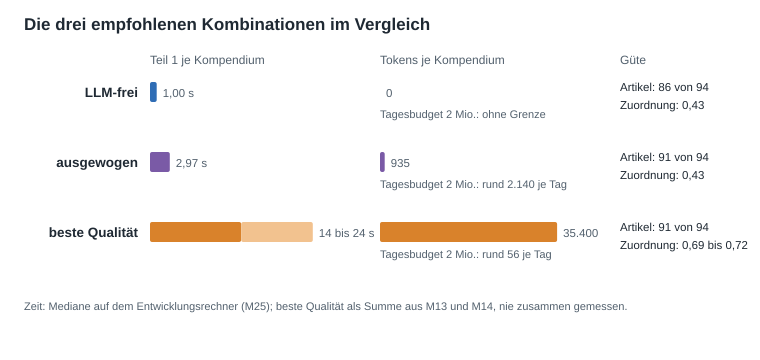
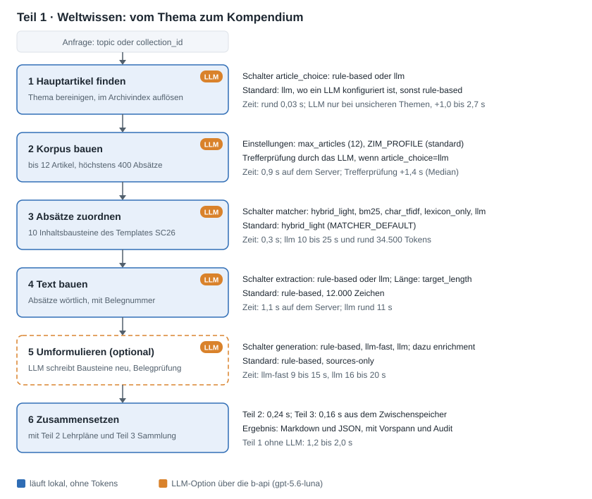
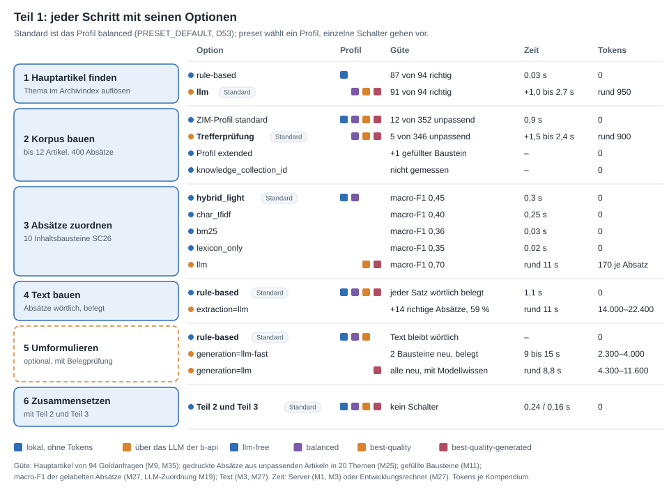
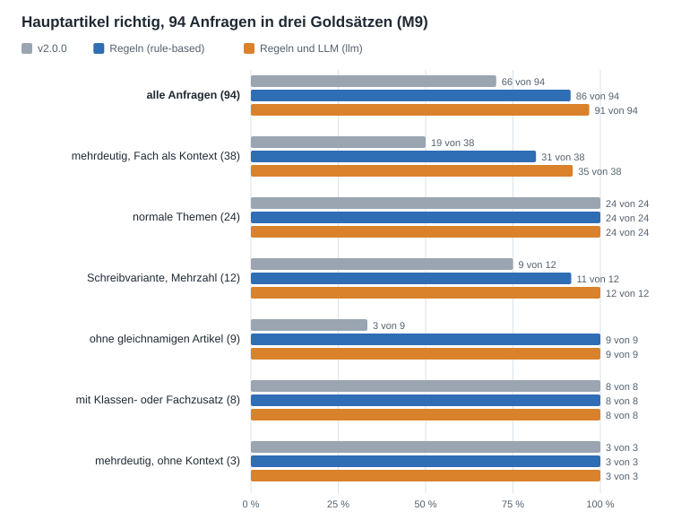
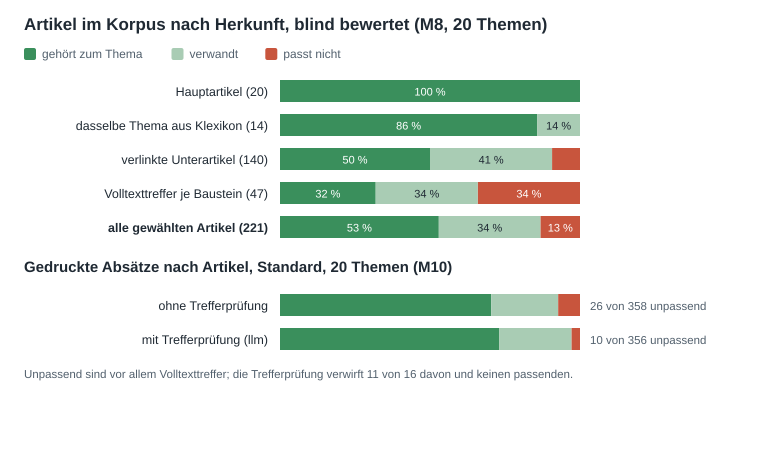
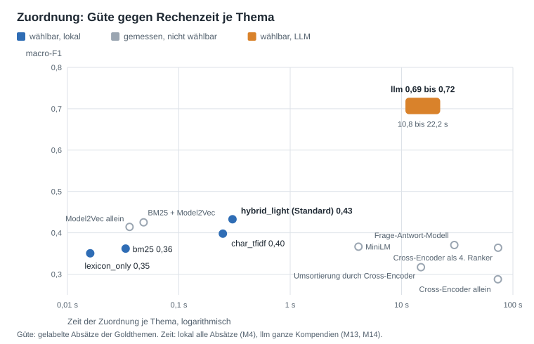
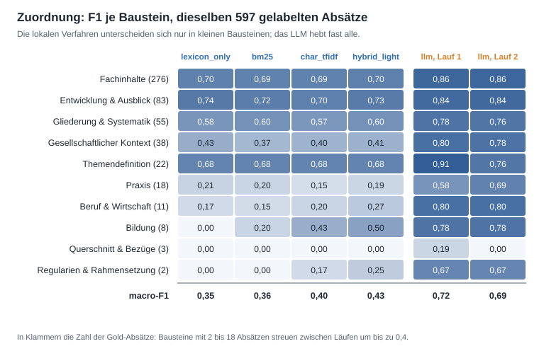
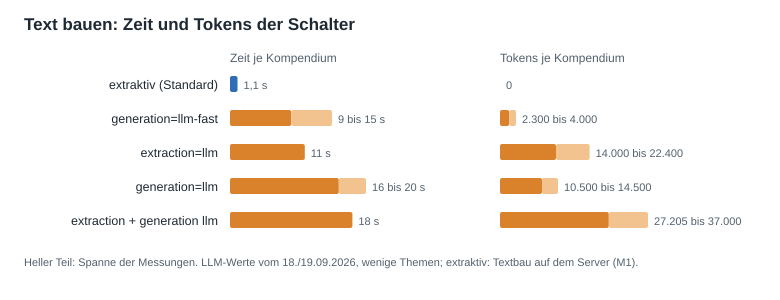

# Entscheidungsvorlage: Verfahren und Schalter von Teil 1

[Übersicht](README.md) · Stand 25.09.2026 · Zahlen: [Messprotokoll](05-messprotokoll.md), M1 bis M24; Rohdaten und
Zusammenfassungen in [messung/ergebnisse](messung/ergebnisse/README.md)

Teil 1 des Kompendiums, das Weltwissen, entsteht in fünf Schritten. An vier davon lässt sich ein Sprachmodell (LLM)
zuschalten. Diese Vorlage zeigt je Schritt, welche Verfahren es gibt, wie man sie im Dienst wählt, was sie leisten und
was sie an Zeit und Tokens kosten. Am Ende stehen drei empfohlene Kombinationen; der Schalter `preset` wählt jede
davon mit einem Wert (D41). „Standard“ heißt: Das gilt, wenn die Anfrage nichts anderes verlangt. Standard ist die
Stufe LLM-frei, auch wo ein LLM konfiguriert ist (D40).

## Empfehlung auf einen Blick

| | LLM-frei | ausgewogen | beste Qualität |
|---|---|---|---|
| Hauptartikel (`article_choice`) | `rule-based` | `llm` | `llm` |
| Korpus | Standard, 12 Artikel | Standard, mit Trefferprüfung | Standard, mit Trefferprüfung |
| Zuordnung (`matcher`) | `hybrid_light` | `hybrid_light` | `llm` |
| Text (`extraction`, `generation`) | `rule-based`, `rule-based` | `rule-based`, `rule-based` | `rule-based`, `rule-based` |
| Hauptartikel richtig, 94 Goldanfragen | 86 | 91 | 91 |
| gedruckte Absätze aus unpassenden Artikeln | 26 von 358 | 10 von 356 | nicht gemessen, Korpus wie ausgewogen |
| Zuordnung, macro-F1 | 0,43 | 0,43 | 0,69 bis 0,72 |
| Teil 1 je Kompendium | 1,35 s | rund 3,1 s | rund 14 bis 24 s |
| Tokens je Kompendium | 0 | Median 927 | rund 35.400 |
| Kompendien je Tagesbudget von 2 Mio. Tokens | ohne Grenze | rund 2.150 | rund 56 |
| so wählt man sie | Standard (D40) oder `preset: llm-free` | `preset: balanced` | `preset: best-quality` |



- **LLM-frei** ist das Beste, was ohne Sprachmodell geht: die geschärften Regeln der Artikelwahl, `hybrid_light` mit
  Model2Vec als bestes lokales Zuordnungsverfahren, wörtlicher Text. Keine Tokens, keine Abhängigkeit von der b-api.
- **Ausgewogen** ist die Empfehlung für den Betrieb, sobald er ein LLM nutzen soll. Die LLM-Artikelwahl ist der
  billigste Hebel mit messbarer Wirkung: fünf richtige Hauptartikel mehr von 94 und 10 statt 26 gedruckte Absätze aus
  unpassenden Artikeln, für im Median 1,7 s und 927 Tokens. Vorerst ist sie nicht Standard (D40); man schaltet sie je
  Anfrage mit `preset: balanced` ein oder global mit `LLM_ARTICLE_CHOICE_DEFAULT=llm`.
- **Beste Qualität** nimmt dazu das LLM als Zuordner: 0,69 bis 0,72 statt 0,43 macro-F1, aber Teil 1 dauert
  zehnmal so lange, und ein Kompendium kostet mehr Tokens als der ganze alte Dienst. Sinnvoll, wo Qualität zählt und
  Zeit nicht, etwa beim Vorbereiten eines Kompendiums für die Redaktion. Der Text bleibt wörtlich; soll ihn ein Mensch
  direkt lesen, kommt `generation=llm` dazu (siehe Schritt 4).

Zeiten: Entwicklungsrechner, Teil 1 im Prozess (M13, M14); auf dem Server über HTTP dauert Teil 1 ohne LLM im Median
2,0 s (M3). „Beste Qualität“ ist die Summe der einzeln gemessenen Schritte; die beiden LLM-Schalter liefen nie
zusammen, sie arbeiten aber nacheinander, Zeit und Tokens addieren sich also.

## Die Stufen mit einem Schalter: `preset`

`preset` setzt alle Schalter von Teil 1 auf eine der drei Stufen (D41). Einen Schalter, den die Anfrage selbst setzt,
lässt es stehen; so gibt `{"preset": "best-quality", "generation": "llm"}` die beste Zuordnung und dazu einen
umformulierten Text. Ohne `preset` gelten die Vorgaben der Einzelschalter, und die sind ausgeliefert die Stufe
`llm-free`.

| `preset` | `article_choice` | `matcher` | `extraction` | `generation` | `enrichment` |
|---|---|---|---|---|---|
| `llm-free` | `rule-based` | `hybrid_light` | `rule-based` | `rule-based` | `sources-only` |
| `balanced` | `llm` | `hybrid_light` | `rule-based` | `rule-based` | `sources-only` |
| `best-quality` | `llm` | `llm` | `rule-based` | `rule-based` | `sources-only` |

Wo man es findet: in `/docs` am Feld `preset` von `POST /api/v2/compendium` (mit Güte, Zeit und Tokens je Stufe)
und in drei Beispielen, eines je Stufe; `POST /api/v2/knowledge` nimmt `preset` ebenfalls an und übernimmt daraus nur
`article_choice`; auf der Kommandozeile `compendium generate --preset balanced`. Die Antwort nennt die Stufe in
`audit.preset`, was tatsächlich lief in `audit.llm`. Ohne LLM fallen `balanced` und `best-quality` auf die Regeln
zurück, und `audit.llm` sagt warum. Keine Stufe schaltet `generation` ein: Die Lesbarkeit ist nicht gemessen, das
Umformulieren bleibt eine bewusste Zusatzwahl.

## Der Ablauf



Dieselben Schritte mit allen Optionen, ihrer Güte, Zeit und ihren Tokens; die Quadrate zeigen, welche Stufe welche
Option nutzt:



Teil 2 (Lehrplanbezüge) und Teil 3 (Sammlungsüberblick) laufen daneben und brauchen kein LLM. Die Schritte 1 bis 4
laufen bei jeder Anfrage, Schritt 5 nur auf Wunsch. Ein LLM steht nur bereit, wenn es konfiguriert ist:
`LLM_ENABLED=true` und `B_API_KEY`, Modell `gpt-6-luna` (`B_API_MODEL`, seit D44). Die Zahlen dieser Vorlage stammen
von `gpt-5.6-luna`; `gpt-6-luna` erreicht dieselbe Güte mit gleich bis 12 % mehr Tokens zum halben Preis je Token,
antwortet aber je Aufruf ein Viertel bis drei Viertel langsamer (M19). Ohne LLM oder bei einem Ausfall der b-api
laufen alle Schritte regelbasiert, und das Audit der Antwort nennt den tatsächlich genutzten Weg.

## Schritt 1: Hauptartikel finden

Der Dienst bereinigt das Thema („Physik: Optik in Klasse 7“ wird zu *Optik* mit dem Fach Physik als Kontext) und
sucht dann den Artikel, um den sich der Korpus dreht.

| Verfahren | Wie es arbeitet |
|---|---|
| v2.0.0 (nur zum Vergleich) | exakter Titel oder Weiterleitung; bei einer Begriffsklärung zählt, wie oft die Wörter der Anfrage wörtlich im Anfang jeder Bedeutung stehen; sonst Titelvorschläge und Volltextsuche. Nicht mehr wählbar. |
| **Regeln** (`rule-based`) | wie v2.0.0, aber mit den Kontextwörtern des Fachs aus `config/subjects.yaml`, Wortanfängen statt ganzer Wörter, dreifach gewertetem Titel, Personen und Werken erst zuletzt und Regeln für gebeugte Formen und Genitivwendungen. Sie melden, ob sie sich sicher sind (`method`, `confident`). |
| **Regeln und LLM** (`llm`) | erst die Regeln; nur wenn sie unsicher sind, wählt das LLM unter ihren Kandidaten oder nennt einen Titel, der nur zählt, wenn das Archiv ihn als Artikel hat. |
| laya (nur zum Vergleich) | ein kleines lokales Entscheidungsmodell (mmBERT-base, 322 Mio. Parameter) wählt an der Stelle des LLM unter den Kandidaten der Regeln. Ohne Nachtraining gemessen; nicht eingebaut (D42). |
| alter Weg (v0.2.0, nur zum Vergleich) | ein LLM nennt bei jeder Anfrage bis zu zehn Begriffe mit vermutetem Wikipedia-Titel, jeder wird nachgeschlagen; einen Hauptartikel wählt er nicht. Nicht eingebaut. |

**Standard:** `rule-based` (D40); `llm` über `article_choice` oder die Stufen `balanced` und `best-quality`.

| Einstellung | Werte | Standard |
|---|---|---|
| Anfrage: `article_choice` (Kompendium und `POST /api/v2/knowledge`) | `rule-based`, `llm` | aus `LLM_ARTICLE_CHOICE_DEFAULT` |
| Anfrage: `preset` | `llm-free` setzt `rule-based`, `balanced` und `best-quality` setzen `llm` | kein `preset` |
| Umgebung: `LLM_ARTICLE_CHOICE_DEFAULT` | `rule-based`, `llm` | `rule-based` (D40); `llm` wirkt nur mit konfiguriertem LLM |

| 94 Anfragen in drei Goldsätzen (M9, M16, M17) | v2.0.0 | Regeln | Regeln und LLM | Regeln und laya | alter Weg |
|---|---|---|---|---|---|
| Hauptartikel richtig | 66 (70 %) | 86 (91 %) | 91 (97 %) | 81 (86 %) | 55 (59 %) an erster Stelle, 58 bis 78 unter bis zu zehn Artikeln |
| Zeit | rund 0,03 s | rund 0,03 s | +1,0 bis 2,7 s, nur bei unsicheren Themen | +0,45 s bei unsicheren Themen, 22 bis 61 s Laden und 1,7 GB je Worker | 6 bis 8 s bei jeder Anfrage |
| Tokens | 0 | 0 | rund 950 je Aufruf | 0 | 1.300 bis 1.500 je Anfrage |



**Beobachtungen**

- Gewonnen wird fast nur bei schwierigen Anfragen: mehrdeutige Wörter mit Fach von 19 auf 31 und mit LLM auf 35 von
  38, Anfragen ohne gleichnamigen Artikel von 3 auf 9 von 9. Normale Themen und Klassenzusätze trafen alle Verfahren
  immer.
- Die Selbsteinschätzung der Regeln trägt: Wo sie sich sicher sind, liegen sie 73 von 76 Mal richtig, bei den 18
  unsicheren nur 13 Mal. Das LLM entscheidet genau diese 18 und trifft alle; einen richtigen Artikel der Regeln hat es
  nie verworfen. Die Zeit fällt deshalb selten an: in M13 bei 5 von 30 Themen.
- Die drei übrigen Fehler sind sichere Fehler der Regeln, das LLM wird dort nicht gefragt: „Physik: Leiter“,
  „Physik: Strom“ (beide landen beim allgemeinen Physikartikel) und „Informatik: Netzwerk“. „Physik: Strom“ traf
  v2.0.0 noch, es ist die einzige Anfrage, die schlechter wurde.
- Validierungs- und Testsatz sind nicht mehr unabhängig; unabhängig gemessen ist nur der erste Lauf des Testsatzes,
  7, 8 und 9 von 12.
- Ein kleines lokales Entscheidungsmodell statt des LLM hilft nicht: laya-multilingual traf ohne Nachtraining 8 der
  18 unsicheren Anfragen, weniger als die Regeln (mit ihnen 81 von 94), und trennte die Volltexttreffer nicht besser
  als Zufall; auf der CPU braucht es 1,7 GB und rund 0,5 s je Entscheidung (M16). Es müsste erst auf unsere
  Entscheidungen trainiert werden und ist nicht eingebaut (D42).
- Der alte Weg über Begriffe vom LLM ersetzt die Artikelwahl nicht (M17): Der richtige Hauptartikel steht 55 Mal an
  erster Stelle und 58 bis 78 Mal unter bis zu zehn Artikeln, bei jeder Anfrage für 6 bis 8 s und rund 1.400 Tokens.
  Er fand aber zwei der drei sicheren Fehler der Regeln, *Elektrischer Strom* und *Rechnernetz*.

## Schritt 2: Korpus bauen

Aus dem Hauptartikel wird der Korpus: höchstens 12 Artikel und 400 Absätze, im Median 10,5 Artikel.

| Quelle | Wie sie in den Korpus kommt |
|---|---|
| Hauptartikel | immer, als erste Quelle |
| derselbe Artikel aus Klexikon | wenn es ihn gibt, als einfacher Einstieg |
| verlinkte Unterartikel | Links des Hauptartikels, gereiht nach Themenwort im Titel, Treffern in den Überschriften und Häufigkeit der Erwähnung; Jahre, Länder, Maßeinheiten und Listen sind gesperrt; mindestens 350 Zeichen Text |
| Volltexttreffer je Baustein | drei Plätze sind reserviert: je Baustein eine Suche nach Titel und drei Suchbegriffen des Bausteins, bis zu vier Treffer, die das Thema in Titel oder Einleitung nennen müssen |
| Materialien einer Sammlung (optional) | `knowledge_collection_id`: bis zu 30 Materialien mit je 20.000 Zeichen, wörtlich nur unter CC0, Public Domain, CC BY oder CC BY-SA; Bildung und Praxis bevorzugen sie. Am Goldstandard nicht gemessen. |

Artikel ohne das Themenwort im Titel geben nur die Absätze ab, die das Thema nennen. Mit `article_choice=llm`
benotet das LLM danach alle Korpusartikel in einem Aufruf (Trefferprüfung), und Volltexttreffer mit der Note 0 fallen
heraus; ohne Volltexttreffer wird es nicht gefragt.

| Einstellung | Werte | Standard |
|---|---|---|
| Anfrage: `max_articles` | 1 bis 50 | `CORPUS_MAX_ARTICLES` = 12; Hauptartikel und Klexikon-Zwilling immer |
| Umgebung: `CORPUS_MAX_CHUNKS` | 20 bis 5.000 Absätze | 400 |
| Umgebung: `ZIM_PROFILE` | `compact` (Top-Artikel, 1,4 GB), `standard` (ganze Wikipedia und Klexikon), `extended` (dazu Wikibooks und Wikiversity) | `standard` |
| Anfrage: `knowledge_collection_id` | nodeId einer Sammlung | keine |
| Trefferprüfung | über `article_choice` | an, wo `article_choice=llm` gilt |

| 20 Themen (M8, M10) | ohne Trefferprüfung | mit Trefferprüfung |
|---|---|---|
| unpassende Volltexttreffer im Korpus | 16 von 47 | 5 von 36; kein passender verworfen |
| gedruckte Absätze aus unpassenden Artikeln | 26 von 358 | 10 von 356 |
| gefüllte Inhaltsbausteine | 122 | 120 |
| Zeit | 0,9 s auf dem Server | +1,4 s im Median, 90. Perzentil 3,2 s |
| Tokens | 0 | rund 890 je Thema mit Volltexttreffern |



**Beobachtungen**

- Hauptartikel und Klexikon passen immer; verlinkte Unterartikel zu 9 % nicht, Volltexttreffer zu 34 %. Die
  Volltexttreffer sind die schwächste Quelle, und nur sie prüft das LLM.
- Einfache Filter trennen sie nicht: Das Themenwort in Titel oder erstem Satz zu verlangen verwirft 14 der 16
  unpassenden Treffer, aber auch 7 der 15 zentralen; die Model2Vec-Ähnlichkeit ist bei unpassenden Treffern so hoch
  wie bei guten. Das LLM trennt sie nur, wenn es alle Artikel eines Themas zugleich sieht; die Treffer allein benotet
  es zu mild (6 von 16).
- Die zwei Bausteine, die mit der Trefferprüfung leer werden, trugen bei „Atommodell“ nur Absätze aus *Kernwaffe*.
- Wikibooks und Wikiversity (`extended`) bringen nichts: Mit ihrer Volltextsuche kam in 20 Themen ein gefüllter
  Baustein dazu (mit Trefferprüfung drei), und aus guten Unterrichtsseiten wie *Physikunterricht/ Optik* druckte der
  Standard keinen Absatz (M11).

## Schritt 3: Absätze zuordnen

Jeder Absatz des Korpus kommt in höchstens einen der zehn Inhaltsbausteine des Templates SC26 oder in keinen. Die
drei übrigen Bausteine (Akteure, Quellen, Glossar) erzeugt der Dienst selbst.

| Verfahren | Wie es arbeitet |
|---|---|
| `lexicon_only` | nur das Überschriften-Lexikon: Ein Absatz bekommt einen Baustein, wenn seine Überschrift ihn nennt („Geschichte“ zeigt auf Entwicklung & Ausblick). |
| `bm25` | BM25 allein: gemeinsame Wörter von Absatz und Bausteinbeschreibung, gewichtet nach Seltenheit. |
| `char_tfidf` | Zeichenfolgen von drei bis fünf Buchstaben; erfasst zusammengesetzte Wörter („Lichtbrechung“ und „Brechung“). |
| **`hybrid_light`** | Lexikon, BM25, Zeichen-TF-IDF und Model2Vec-Vektoren zusammen; eine Regel-Policy entscheidet je Absatz, themenferne Absätze bleiben draußen. |
| `llm` | Das LLM ordnet jeden Absatz einem Baustein oder keinem zu, 50 Absätze zu je 400 Zeichen je Aufruf; wo es nicht antwortet, entscheidet `hybrid_light`. |

**Standard:** `hybrid_light` (D38). `llm` ist nur je Anfrage wählbar; als Vorgabe verweigert der Dienst den Start,
weil `hybrid_light` sein Rückfall ist.

| Einstellung | Werte | Standard |
|---|---|---|
| Anfrage: `matcher` | `hybrid_light`, `bm25`, `char_tfidf`, `lexicon_only`, `llm` | aus `MATCHER_DEFAULT` |
| Anfrage: `preset` | `llm-free` und `balanced` setzen `hybrid_light`, `best-quality` setzt `llm` | kein `preset` |
| Umgebung: `MATCHER_DEFAULT` | die vier lokalen | `hybrid_light` |
| Umgebung: `MODEL2VEC_PATH` | Pfad des Modells | im Image `/models/m2v`; ohne Model2Vec fällt `hybrid_light` auf 0,38 |
| Umgebung: `LLM_MAX_TOKENS_PER_REQUEST` | Tokens je Anfrage | 60.000: vier Stapel zugleich, weitere warten (D39); 100.000 erlaubt sieben |

| Verfahren | macro-F1, gelabelte Absätze | macro-F1, alle Absätze | Zuordnung je Thema | Teil 1 | Tokens |
|---|---|---|---|---|---|
| `llm` | 0,72 und 0,69 (zwei Läufe) | nicht gemessen | 10,8 und 22,2 s | 12,0 und 22,7 s | im Mittel 34.500 (18.800 bis 45.900) |
| **`hybrid_light`** | 0,43 | 0,45 | 0,30 s | 1,2 und 1,8 s | 0 |
| `char_tfidf` | 0,40 | 0,42 | 0,25 s | – | 0 |
| `bm25` | 0,36 | 0,37 | 0,03 s | – | 0 |
| `lexicon_only` | 0,35 | 0,35 | 0,02 s | – | 0 |

Zwei Zeitwerte bei `llm` und `hybrid_light`: M13 und M14, an verschiedenen Themen und Tagen. In M14 antwortete die
b-api langsamer, und Themen ab fünf Stapeln (rund 200 Absätze) brauchten eine zweite Runde. Teil 1 der übrigen
lokalen Verfahren wurde nicht eigens gemessen; ohne die Zuordnung dauert er rund 0,9 s.





**Beobachtungen**

- **Unterschiede nur in bestimmten Bausteinen.** Bei den großen Bausteinen liegen alle lokalen Verfahren gleichauf:
  Themendefinition 0,68 bei allen vier, Fachinhalte 0,69 bis 0,70, Entwicklung & Ausblick 0,70 bis 0,74, Gliederung
  & Systematik 0,57 bis 0,60. Der ganze Abstand von 0,35 auf 0,43 entsteht in drei kleinen Bausteinen, zu denen
  Artikel selten eine passende Überschrift haben: Bildung (0,00 bis 0,50), Regularien & Rahmensetzung (0,00 bis 0,25)
  und Beruf & Wirtschaft (0,15 bis 0,27), zusammen 21 der 597 Gold-Absätze. Bei Gesellschaftlichem Kontext und Praxis
  liegt das reine Lexikon sogar leicht vorn (M15).
- **Das LLM hebt fast jeden Baustein**, am stärksten die, an denen die lokalen Verfahren scheitern: Beruf &
  Wirtschaft von 0,27 auf 0,80, Gesellschaftlicher Kontext von 0,41 auf 0,78 bis 0,80, Praxis von 0,19 auf 0,58 bis
  0,69, Regularien von 0,25 auf 0,67. Auch die großen gewinnen: Fachinhalte 0,70 auf 0,86. Nur Querschnitt & Bezüge
  (3 Gold-Absätze) trifft niemand verlässlich.
- **Kleine Bausteine streuen.** Mit 2 bis 18 Gold-Absätzen springt ihr F1 zwischen zwei LLM-Läufen um bis zu 0,4
  (Praxis 0,58 und 0,69, Themendefinition 0,91 und 0,76); die großen bleiben stabil.
- **Schwerere Modelle helfen nicht.** Im selben Ablauf kamen MiniLM-Satzvektoren auf 0,37, ein Frage-Antwort-Modell
  auf 0,37 und ein Cross-Encoder auf 0,29, bei 4 bis 73 s je Thema; als Umsortierung verschlechtert der Cross-Encoder
  den Standard auf 0,32 (M4, M5).
- **Das LLM nur für unsichere Absätze** (47 % der Absätze, halbe Tokens) brachte 0,54 und so viele Fehlzuordnungen
  wie die Regeln; die Policy liegt auch bei ihren sicheren Absätzen zu 39 % falsch (M12). Verworfen.
- **Mögliche Vereinfachung ohne Qualitätsverlust:** BM25 mit Model2Vec erreicht 0,43 (alle Absätze 0,44) in 0,05 statt
  0,30 s. Als Strategie ist das nicht wählbar.

## Schritt 4: Text bauen und optional umformulieren

Der Text entsteht immer erst extraktiv: Je Baustein übernimmt der Dienst die zugeordneten Absätze wörtlich, ihre
ersten Sätze bis zum Längenbudget, jeden mit Belegnummer; dazu erzeugt er Akteure, Quellen und Glossar. Darauf setzen
drei Schalter auf.

| Schalter | Werte | Standard | Was er tut |
|---|---|---|---|
| `extraction` | `rule-based`, `llm` | `rule-based` (`LLM_EXTRACTION_DEFAULT`) | `llm`: Das LLM wählt je Baustein Sätze aus bis zu acht Kandidatenabsätzen (`LLM_EXTRACTION_CANDIDATES`); der Wortlaut bleibt der der Quelle. |
| `generation` | `rule-based`, `llm-fast`, `llm` | `rule-based` (`LLM_GENERATION_DEFAULT`) | `llm-fast`: Das LLM schreibt Themendefinition und Querschnitt & Bezüge neu (`LLM_FAST_SECTIONS`); `llm`: alle Inhaltsbausteine. |
| `enrichment` | `sources-only`, `model-knowledge` | `sources-only` (`LLM_ENRICHMENT_DEFAULT`) | `model-knowledge`: Das schreibende LLM darf eigenes Wissen ergänzen, markiert als `Evidenzgrad=Modellwissen`; nur mit `generation` `llm` oder `llm-fast`. |
| `target_length` | 2.000 bis 60.000 Zeichen | 12.000 | steuert die Länge über Budgets je Baustein; eine Richtgröße, keine Obergrenze |
| `empty_slot_policy` | `omit`, `note` | aus dem Template, bei SC26 `omit` | leere Bausteine weglassen oder mit Hinweis zeigen |

**Kombinierbar:** `extraction` und `generation` lassen sich zusammen einschalten, `enrichment` wirkt nur mit
`generation`. Alle LLM-Schalter teilen sich das Budget je Anfrage (`LLM_MAX_TOKENS_PER_REQUEST`) und das Tagesbudget
(`LLM_DAILY_TOKEN_BUDGET`, 2 Mio.). Ein geschriebener Satz bleibt nur, wenn er eine gültige Belegnummer trägt und
mindestens 20 % seiner Inhaltswörter im zitierten Absatz stehen; sonst wird er gestrichen
(`LLM_UNSUPPORTED_SENTENCES=drop`) oder als Schlussfolgerung markiert (`mark`).

| Schalter | Zeit | Tokens | Güte |
|---|---|---|---|
| extraktiv (Standard) | 1,1 s auf dem Server, samt Akteuren, Quellen, Glossar | 0 | jeder Satz wörtlich im zitierten Absatz (432 von 432) |
| `extraction=llm` | rund 11 s | 14.000 bis 22.400 | 14 richtige Absätze mehr bei gleicher Präzision (59 %) gegenüber derselben Konfiguration ohne LLM; kleine Bausteine oft falsch |
| `generation=llm-fast` | 9 bis 15 s | 2.300 bis 4.000 | flüssiger Einstieg; Belegprüfung |
| `generation=llm` | 16 bis 20 s | 10.500 bis 14.500 | flüssiger Text; Belegprüfung, im Median 73 % der Inhaltswörter im zitierten Absatz |
| beide auf `llm` | 18 s (Optik) | 27.205 (Optik) bis rund 37.000 | |



**Beobachtungen**

- Für Maschinen, also Suche, KI-Assistenten und Weiterverarbeitung, ist der extraktive Text der beste: Jeder Satz
  steht wörtlich in seiner Quelle. Für Menschen liest er sich wie eine geordnete Sammlung von Auszügen; dafür ist
  `generation` gedacht.
- `extraction=llm` wurde am 19.09.2026 ohne Model2Vec gemessen. Gegenüber dem heutigen Standard (110 gedruckte
  Absätze, 67 richtig, 61 %) sind 131 und 77 (59 %) nur ein Anhaltspunkt; in Querschnitt & Bezüge landeten 7 Absätze,
  keiner richtig. Keine Empfehlung.
- Die Werte der Text-Schalter stammen vom 18. und 19.09.2026 an vier Themen bzw. an Optik. Die Lesbarkeit ist nicht
  gemessen; ein Richtervergleich der Texte steht aus.

## Kosten und Kapazität

| Kombination | Tokens je Kompendium | Kompendien je Tag bei 2 Mio. Tokens |
|---|---|---|
| LLM-frei | 0 | ohne Grenze |
| ausgewogen | Median 927 | rund 2.150 |
| ausgewogen mit `generation=llm-fast` | rund 3.200 bis 4.900 | rund 400 bis 620 |
| beste Qualität | rund 35.400 | rund 56 |
| beste Qualität mit `generation=llm` | rund 46.000 bis 50.000 | rund 40 bis 44 |

Die Tokens der Kombinationen mit `generation` sind addiert, nicht gemessen. Das Tagesbudget gilt für alle Anfragen
und Worker zusammen; ist es aufgebraucht, fallen LLM-Schalter bis zum nächsten Tag auf die Regeln zurück.

## Die Empfehlungen im Einzelnen

### LLM-frei: das Optimum ohne Sprachmodell (Standard)

Anfrage: `{"topic": "Optik"}` genügt, ausdrücklich `{"topic": "Optik", "preset": "llm-free"}`. Die Einstellungen, mit
denen der Dienst ausgeliefert wird, ergeben diese Stufe; ein LLM darf konfiguriert sein, es wird nicht gefragt:

```
LLM_ARTICLE_CHOICE_DEFAULT=rule-based   # ausgeliefert (D40)
MATCHER_DEFAULT=hybrid_light
MODEL2VEC_PATH=/models/m2v              # im Image gesetzt; ohne Model2Vec 0,38 statt 0,43
ZIM_PROFILE=standard
CORPUS_MAX_ARTICLES=12
```

Ergebnis: 86 von 94 Hauptartikeln, 26 von 358 gedruckten Absätzen aus unpassenden Artikeln, macro-F1 0,43, Teil 1
in 1,35 s ohne Tokens. Keine andere lokale Einstellung war besser: Die übrigen Verfahren verlieren in kleinen
Bausteinen, Wikibooks und Wikiversity bringen nichts, schwerere Modelle schaden.

### Ausgewogen: Zeit und Kosten optimiert bei guter Qualität

Anfrage: `{"topic": "Optik", "preset": "balanced"}`. Dafür muss ein LLM konfiguriert sein:

```
LLM_ENABLED=true
B_API_KEY=…                             # aus dem Geheimnisspeicher, nie im Repository
LLM_ARTICLE_CHOICE_DEFAULT=llm          # nur wenn die Stufe für jede Anfrage gelten soll
```

Ergebnis: 91 von 94 Hauptartikeln, 10 von 356 gedruckten Absätzen aus unpassenden Artikeln, macro-F1 0,43, Teil 1
im Median 1,7 s länger (90. Perzentil 3,4 s), rund 930 Tokens. Wer einen lesbaren Einstieg braucht, ergänzt
`"generation": "llm-fast"`: 9 bis 15 s und 2.300 bis 4.000 Tokens mehr für Themendefinition und Querschnitt.

### Beste Qualität

Anfrage: `{"topic": "Optik", "preset": "best-quality"}`, mit konfiguriertem LLM wie oben und mehr Budget je Anfrage:

```
LLM_MAX_TOKENS_PER_REQUEST=100000       # sieben Stapel zugleich: keine zweite Runde bis 350 Absätze und kein
                                        # Rückfall bei sehr großen Themen (bei 60.000 ab rund 320 Absätzen);
                                        # nicht gemessen
```

Ergebnis: 91 von 94 Hauptartikeln, macro-F1 0,69 bis 0,72, Teil 1 rund 14 bis 24 s je nach Themengröße und b-api,
rund 35.400 Tokens. Der Text bleibt wörtlich und belegt. Liest ihn ein Mensch direkt, kommt `"generation": "llm"`
dazu: 16 bis 20 s und 10.500 bis 14.500 Tokens mehr; `enrichment` bleibt `sources-only`, damit jeder Satz belegt
bleibt.

## Was die Zahlen nicht sagen

- Die Goldlabels hat ein Sprachmodell vorgeschlagen (Claude), eine Redaktion hat sie nicht geprüft. Ein LLM als
  Zuordner teilt womöglich dessen Sicht; eine Gegenprobe mit einem anderen Modell auf fremden Themen steht aus.
- Kleine Bausteine haben 2 bis 18 Gold-Absätze; ihre Werte streuen zwischen Läufen um bis zu 0,4.
- Die Zeiten stammen vom Entwicklungsrechner (M13, M14) oder vom Server (M1, M3), die LLM-Zeiten hängen am Tag: Die
  b-api antwortete in M14 langsamer als in M13.
- Die Text-Schalter wurden an wenigen Themen und vor den Änderungen vom 23. und 24.09. gemessen.
- LLM-Schalter wurden einzeln gemessen, nicht zusammen.

## Zu entscheiden

1. **Vorgabe im Betrieb:** vorerst LLM-frei (D40). Offen ist, ob und wann der Betrieb auf ausgewogen umstellt:
   je Anfrage mit `preset: balanced` oder global mit `LLM_ARTICLE_CHOICE_DEFAULT=llm`; dafür sind `LLM_ENABLED`,
   `B_API_KEY` und das Tagesbudget auf dem Server zu prüfen.
2. **Beste Qualität als eigener Weg:** ob Redaktion oder Stapelläufe `matcher=llm` nutzen sollen, bei rund 35.400
   Tokens und 14 bis 24 s je Kompendium.
3. **Lesefassung:** ob `generation` für menschliche Leser nötig ist. Vorher sollte ein Richtervergleich die
   Lesbarkeit und Treue der geschriebenen Texte messen.
4. **Goldstandard prüfen lassen:** Alle Gütezahlen hängen an Labels, die eine Redaktion noch nicht gesehen hat.
5. **Sichere Fehler der Regeln:** ob das LLM mit `article_choice=llm` auch sichere Auflösungen mehrdeutiger Wörter
   prüfen soll. Der alte Weg fand zwei der drei (M17); es kostete einen Aufruf mehr bei jedem solchen Thema und wäre
   vorher am Gold zu messen.

## Außerhalb von Teil 1: Knoten-Eingang und Lehrplanbezüge

Zwei weitere Entscheidungen stehen an; die Zahlen stehen im [Messprotokoll](05-messprotokoll.md), M21 bis M24.

6. **Kompendium aus einem Material (`node_id` ohne `topic`):** Heute wird der Titel des Materials zum Thema. Echte
   Titel nennen oft Format oder Datum, deshalb wird das Kompendium selten brauchbar, das heißt: Mindestens die Hälfte
   seiner gedruckten Absätze passt zum Material. F1 misst, ob die richtigen Artikel im Kompendium landen: beim
   Hauptartikel gegen das Gold, bei allen gedruckten Artikeln gegen die, die zum Material gehören. Von 31
   WLO-Materialien mit klarem Thema (M23):

   | Weg | brauchbar | F1 Hauptartikel | F1 Artikel | LLM je Material |
   |---|---|---|---|---|
   | Begriff, den eine Lehrkraft eintippt | 18 | 0,94 | 0,45 | – |
   | Titel des Materials (heute) | 5 | 0,20 | 0,10 | – |
   | Titel, `balanced` | 10 | 0,45 | 0,22 | 600 Tokens, rund 4,6 s |
   | Thema vom LLM aus den Metadaten | 17 | 0,97 | 0,50 | 440 Tokens, 2,8 s |
   | Entitäten wie im alten Dienst als Korpus | 11 | 0,94 | 0,50 | 1.680 Tokens, 9,9 s |

   Mit dem Thema vom LLM trifft das Material den Hauptartikel so sicher wie ein Begriff, und bei gleichem
   Hauptartikel entsteht derselbe Text. Unscharf sind bei beiden die Nebenartikel: Rund ein Drittel passt nicht zum
   Material. Ohne LLM hilft auch ein Embedding nicht: Eine Suche mit dem Modell des Dienstes über alle 5,35 Mio.
   Archiveinträge trifft den Hauptartikel mit F1 höchstens 0,03 (M24). Die Entitäten des alten Dienstes lassen sich
   dagegen über die Verlinkung mit dem Hauptartikel des LLM-Themas filtern: zusammen Recall 0,89 statt 0,67 bei
   gleichem F1 (0,51), für rund 1.700 Tokens mehr je Material.

   Empfehlung: das Thema vom LLM, wo eines bereitsteht; ohne LLM bleibt der Titel, oder der Dienst verlangt dort das
   Thema vom Aufrufer. Dazu sollte der Dienst kein Kompendium bauen, wenn er kein Thema findet (heute entsteht auch zu
   Materialien ohne Thema eines). Weitere Verfahren für den Hauptartikel braucht es mit LLM nicht. Die verlinkten
   Entitäten des alten Dienstes lohnen nur, wenn mehrteilige Materialien breiter abgedeckt werden sollen. Bei den
   Nebenartikeln entfernt das Weglassen unverlinkter ein Viertel der unpassenden; für den Rest fehlt noch ein
   Verfahren.
7. **Lehrplanbezüge (Teil 2, M22):** Rund 60 % der ausgegebenen Lehrplanelemente gehören zum Thema, 13 bis 19 %
   passen nicht. Das Fach kürzt Teil 2 um ein Drittel, hebt die Treffsicherheit aber kaum und verwirft ein Viertel
   der passenden Elemente. Empfehlung: schärfere Stichwortregeln (lokal, verwerfen kein passendes Element) und nach
   einem Blick auf die Darstellung die Elemente, bei denen nur die Überschrift das Thema nennt, zu ihrem Bereich
   bündeln.
