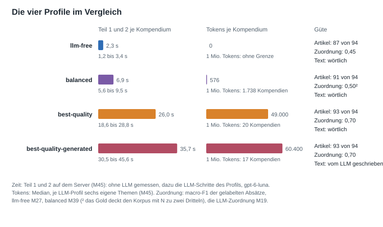
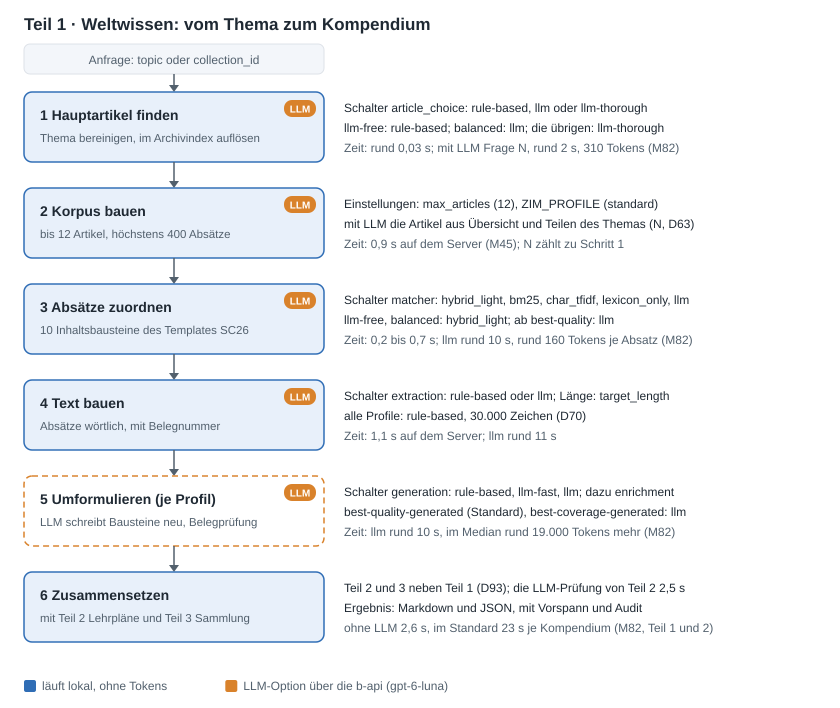
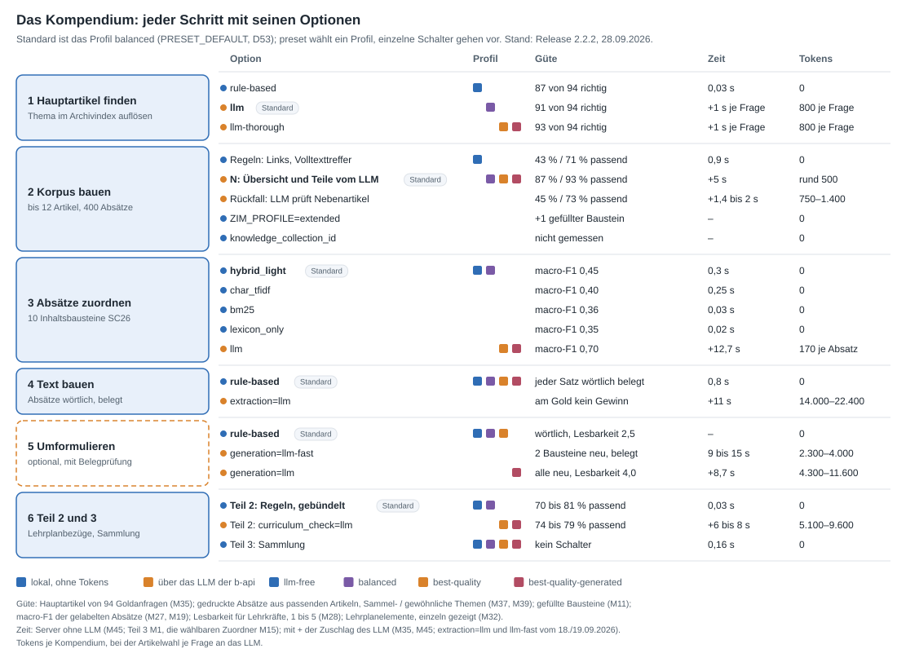
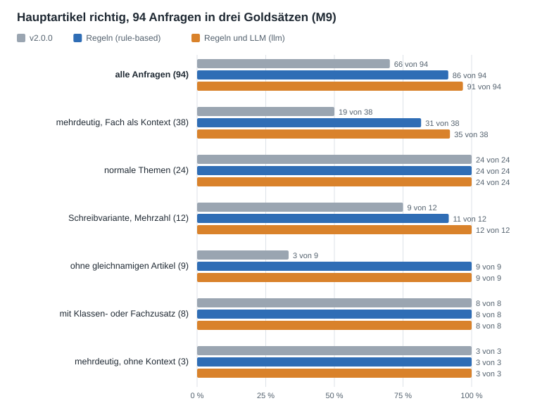
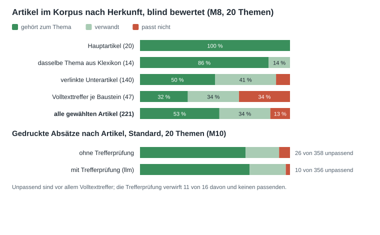
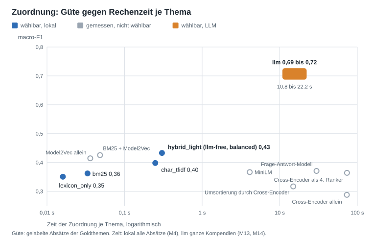
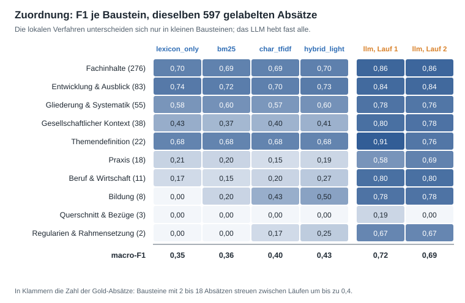
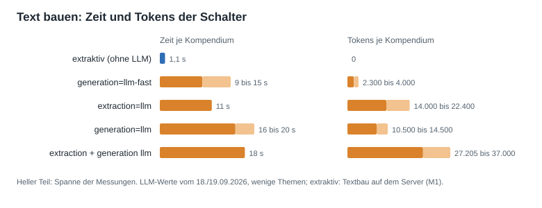

# Entscheidungsvorlage: Verfahren und Schalter von Teil 1

[Übersicht](README.md) · Stand 28.09.2026 · Zahlen: [Messprotokoll](05-messprotokoll.md), M1 bis M45; Rohdaten und
Zusammenfassungen in [messung/ergebnisse](messung/ergebnisse/README.md); Methoden und Werte von `/entities`:
[Entitäten und Kennungen](08-entitaeten-und-kennungen.md); alle Schritte mit ihren Methoden, Güte, Zeit und Tokens
je Profil: [Methoden, Messwerte und Profile](09-methoden-und-profile.md)

Teil 1 des Kompendiums, das Weltwissen, entsteht in fünf Schritten. An vier davon lässt sich ein Sprachmodell (LLM)
zuschalten. Diese Vorlage zeigt je Schritt, welche Verfahren es gibt, wie man sie im Dienst wählt, was sie leisten und
was sie an Zeit und Tokens kosten. Vier Profile bündeln sie (D53); der Schalter `preset` wählt eines. „Standard“
heißt: Das gilt, wenn die Anfrage nichts anderes verlangt. Standard ist das Profil `balanced` (`PRESET_DEFAULT`);
jedes Profil außer `llm-free` braucht ein LLM, sonst ist die Anfrage ein 503. Die Profile wählen auch das Verfahren
der QA-Paare (D54, D55, D57).

## Die vier Profile auf einen Blick

| | `llm-free` | `balanced` (Standard) | `best-quality` | `best-quality-generated` |
|---|---|---|---|---|
| Hauptartikel (`article_choice`) | `rule-based` | `llm` | `llm-thorough` | `llm-thorough` |
| Korpus | 12 Artikel, Volltexttreffer nur mit Link zum Hauptartikel | statt verlinkter Unterartikel und Volltexttreffer die Artikel, die das LLM als Übersicht und Teile nennt (D63); ohne Antwort wie `llm-free` mit Prüfung der Nebenartikel | wie `balanced` | wie `balanced` |
| Zuordnung (`matcher`) | `hybrid_light` | `hybrid_light` | `llm` | `llm` |
| Text (`generation`, `enrichment`) | wörtlich | wörtlich | wörtlich | vom LLM geschrieben, ergänzt um Modellwissen |
| QA-Paare (`/qa`, `method`) | `rule-based` | `rule-based` | `llm` | `llm` |
| Lehrplanbezüge (Teil 2, `curriculum_check`) | Regeln, Überschriften-Treffer gebündelt | wie `llm-free` | dazu LLM-Prüfung jedes Elements | dazu LLM-Prüfung jedes Elements |
| Entitäten (`/entities`, `methods`) | `ner` (spaCy) und `dictionary` (Artikeltitel) | `llm`: das LLM nennt sie mit Artikeltitel | wie `balanced` | wie `balanced` |
| Kennungen der Entitäten (Wikidata, GND, DBpedia; M43) | aus lokalen Daten zum verknüpften Artikel, in allen Profilen gleich (D65): Wikidata Präzision 0,29, Recall 0,55; GND 0,31 und 0,57; DBpedia über den englischen Artikel bei 88 % | ebenso, auf den Artikeln des LLM: Wikidata 0,70 und 0,89; GND 0,70 und 0,88; englischer Artikel bei 96 % | wie `balanced` | wie `balanced` |
| Hauptartikel richtig, 94 Goldanfragen (M35) | 87 | 91 | 93 | 93 |
| Material ohne `topic`: Hauptartikel-F1, zwei Stichproben (M25) | 0,56 und 0,63 | 0,98 und 0,88 | wie `balanced` | wie `balanced` |
| gedruckte Absätze aus unpassenden Artikeln, 20 Themen (M25) | 12 von 352 | 5 von 346 vor D63 | nicht gemessen | nicht gemessen |
| gedruckte Absätze aus passenden Artikeln, 25 Sammel- und 20 gewöhnliche Themen (M37, M39) | 43 % und 71 % | 87 % und 93 % seit D63 (vorher 45 und 73 %) | wie `balanced` (derselbe Korpus, nicht eigens gemessen) | wie `balanced` |
| Zuordnung, macro-F1 der gelabelten Absätze (M27, M19) | 0,45 | 0,45 vor D63; den Korpus mit N deckt das Gold nicht mehr ab (M39) | 0,70 vor D63 | 0,70 vor D63 |
| Lesbarkeit für Lehrkräfte, 1 bis 5, zwei Gutachter (M28) | wörtlich wie `best-quality` | wörtlich wie `best-quality` | 2,5 | 4,0; im Mittel 5 Füllsätze je Thema, mit dem ersten Prompt 12 (M31) |
| QA-Paare mangelfrei bei beiden Gutachtern (M30, M34) | 58 von 95 seit D60 (vorher 48 von 96); 0,52 s an rund 23.000 Zeichen (M45) | wie `llm-free` | 99 von 120; 6,3 s und 7.137 Tokens an rund 23.000 Zeichen (M45) | wie `best-quality` |
| Lehrplanelemente passend, 20 Themen, zwei Gutachter (M32) | 70 bis 81 %, 5 bis 9 % unpassend, ein Viertel der passenden nur gebündelt | wie `llm-free` | 74 bis 79 %, 5 bis 9 % unpassend, kein passendes verloren; rund 6 s und 8.000 bis 10.000 Tokens mehr | wie `best-quality` |
| Entitäten: F1 an 40 Materialtexten, zwei Gutachter, durch den Endpunkt (M36, D62) | 0,38, Präzision 0,29; 1,0 s an 1.500 Zeichen (M45) | 0,78, Präzision 0,70; 6,8 s und 1.284 Tokens an 1.500 Zeichen (M45) | wie `balanced` | wie `balanced` |
| Teil 1 und 2 je Kompendium auf dem Server (M45) | 2,3 s | rund 6,9 s | rund 26 s | rund 36 s |
| Tokens je Kompendium, Median (M45) | 0 | 576 | 49.019 | 60.357 |
| Budget je Anfrage (D59) | 60.000 | 60.000 | 180.000 | 180.000 |
| Kompendien je Tagesbudget von 2 Mio. Tokens | ohne Grenze | rund 3.500 | rund 41 | rund 33 |
| so wählt man es | `preset: llm-free`, ohne LLM `PRESET_DEFAULT=llm-free` | Standard, `preset: balanced` | `preset: best-quality` | `preset: best-quality-generated` |



- **`llm-free`** ist das Beste, was ohne Sprachmodell geht: die geschärften Regeln der Artikelwahl, für ein Material
  ohne `topic` die Regeln über Titel und Beschreibung (D47), Volltexttreffer nur mit Link zum Hauptartikel (D48),
  `hybrid_light` mit Model2Vec als bestes lokales Zuordnungsverfahren, wörtlicher Text und QA-Paare aus den Regeln über
  den spaCy-Parse (D55), aufgefüllt mit Glossar und Akteuren (D60): 58 von 95 bei beiden Gutachtern mangelfrei, in
  0,3 s je Text (M34). Entitäten (`/entities`) erkennt es mit spaCy und dem Wörterbuch der Artikeltitel: F1 0,38 an
  40 Materialtexten, weil das Wörterbuch auch Allerweltswörter verknüpft (M36). Keine Tokens, keine Abhängigkeit von
  der b-api; das Profil für einen Dienst ohne LLM.
- **`balanced`** ist der Standard. Die LLM-Artikelwahl ist der billigste Hebel mit messbarer Wirkung: fünf richtige
  Hauptartikel mehr von 94, 5 statt 12 gedruckte Absätze aus unpassenden Artikeln und bei einem Material ohne `topic`
  ein Hauptartikel-F1 von 0,88 bis 0,98 statt 0,56 bis 0,63, damals für rund 1,5 bis 2 s und 900 Tokens (M25, M27).
  Seit D63 nennt das LLM dazu Übersicht und Teile des Themas: 87 statt 43 % passende Absätze bei Sammelthemen (M39);
  ein Kompendium kostet so auf dem Server rund 6,9 s und 576 Tokens (M45). Die Zuordnung bleibt die von `llm-free`
  (0,45): Das LLM wirkt vor ihr, nicht in ihr (M27). Die QA-Paare kommen seit D57
  aus denselben Regeln wie in `llm-free` (Jan: der Standard fragt schnell und ressourcenschonend): 0,3 s, keine
  Tokens, kein zusätzliches Modell. Die zwei kleinen Modelle, die hier bis D57 fragten, waren in M30 die schwächste
  und langsamste Stufe (25 von 120 mangelfrei, rund 25 s je Text) und sind entfernt. In `/entities` nennt das LLM die
  Entitäten mit ihrem Artikeltitel (D62): F1 0,78 statt 0,38, von 269 Verknüpfungen meinte eine etwas anderes, rund
  800 Tokens und 4 s je Text (M36, durch den Endpunkt nachgemessen).
- **`best-quality`** nimmt dazu das LLM als Zuordner: 0,70 statt 0,45 macro-F1, für rund 26 s und 49.000 Tokens je
  Kompendium mit Teil 2 (M45): rund 170 Tokens je Absatz, dazu die Prüfung der Lehrplanelemente. Sinnvoll, wo Qualität zählt und Zeit nicht, etwa beim Vorbereiten eines Kompendiums
  für die Redaktion. Der Text bleibt wörtlich und belegt. Die QA-Paare schreibt das LLM: 99 von 120 mangelfrei, rund
  2.400 Tokens und 4 bis 7,5 s je Text (M30). Die Lehrplanelemente von Teil 2 prüft das LLM ebenfalls (D58): 74 bis
  79 % passend, kein passendes verworfen, im Median rund 6 s und 8.000 bis 10.000 Tokens mehr (M32). `/entities`
  arbeitet wie in `balanced`: Eine zweite LLM-Prüfung jeder Verknüpfung hob die Präzision auf 0,94, verwarf aber ein
  Drittel der passenden Entitäten (F1 0,76 statt 0,78); sie bleibt ein eigener Schalter (`link_check: llm`, D62).
- **`best-quality-generated`** lässt das LLM zusätzlich jeden Baustein schreiben und eigenes Wissen ergänzen, ohne
  Belegnummer und sichtbar gekennzeichnet mit `[Modellwissen]` (D56): rund 36 s und 60.000 Tokens je Kompendium (M45). Zwei
  blinde Gutachter zogen den geschriebenen Text in 11 von 12 Urteilen dem wörtlichen vor (Lesbarkeit 4,0 statt 2,5 von
  5, Zusammenhang 4,0 statt 2,4), bei ähnlich vielen Fachfehlern, die meist schon in den Quellen stehen (M28). Mit dem
  ersten Prompt bestand das ergänzte Modellwissen zu zwei Dritteln aus Füllsätzen; der zweite verlangt eine prüfbare
  Sachaussage oder nichts: 50 statt 82 ergänzte Sätze, davon 13 statt 50 Füllsätze und 32 statt 27 fachliche, keiner
  falsch nach beiden Gutachtern (M31). `/entities` wie in `balanced`.

Zeiten und Tokens: M45 (28.09.2026, Release 2.2.2, `gpt-6-luna`), Teil 1 und 2, jedes LLM-Profil auf sechs eigenen
Themen; die Zeit auf dem Server ohne LLM gemessen, dazu die Schritte, in denen das LLM des Profils arbeitet. Die
Werte vor D58 und D63 stehen in M27; seither kosten die `best-quality`-Profile rund das Doppelte, weil das LLM die
Lehrplanelemente prüft und der Korpus mit N größer ist ([Methoden, Messwerte und Profile](09-methoden-und-profile.md)).

## Die Profile: `preset`

`preset` setzt alle Schalter von Teil 1 und die Lehrplanprüfung von Teil 2 auf eines der vier Profile (D41, D53,
D58). Einen Schalter, den die Anfrage selbst
setzt, lässt es stehen. Ohne `preset` gilt `PRESET_DEFAULT`, ausgeliefert `balanced` (D53; bis dahin war `llm-free`
die Vorgabe, D40); es ersetzt die Vorgaben der Einzelschalter (`MATCHER_DEFAULT`, `LLM_ARTICLE_CHOICE_DEFAULT` und
die übrigen). Jedes Profil außer `llm-free` braucht ein LLM: Ohne `LLM_ENABLED` und `B_API_KEY` ist eine solche
Anfrage ein 503, der die Schalter nennt, die ein LLM brauchen; ein Dienst ohne LLM setzt `PRESET_DEFAULT=llm-free`.

| `preset` | `article_choice` | `matcher` | `extraction` | `generation` | `enrichment` | `curriculum_check` |
|---|---|---|---|---|---|---|
| `llm-free` | `rule-based` | `hybrid_light` | `rule-based` | `rule-based` | `sources-only` | `rule-based` |
| `balanced` | `llm` | `hybrid_light` | `rule-based` | `rule-based` | `sources-only` | `rule-based` |
| `best-quality` | `llm-thorough` | `llm` | `rule-based` | `rule-based` | `sources-only` | `llm` |
| `best-quality-generated` | `llm-thorough` | `llm` | `rule-based` | `llm` | `model-knowledge` | `llm` |

Wo man es findet: in `/docs` am Feld `preset` von `POST /api/v2/compendium` (mit Güte, Zeit und Tokens je Profil) und in
vier Beispielen, eines je Profil; `POST /api/v2/knowledge` und `POST /api/v2/qa` nehmen `preset` ebenfalls an
(`/knowledge` übernimmt daraus nur `article_choice`, `/qa` nur das Verfahren der Paare, D55); auf der Kommandozeile
`compendium generate --preset balanced`. Die Antwort nennt das wirksame Profil in `audit.preset`, was tatsächlich lief
in `audit.llm`. Ist die b-api nur gerade nicht erreichbar, laufen die Regeln, und `audit.llm` sagt warum.
`best-quality-generated` schaltet als einziges Profil `generation` und `enrichment` ein (Jan, 25.09.2026): Das LLM
schreibt jeden Baustein und darf eigenes Wissen ergänzen, ohne Belegnummer und sichtbar gekennzeichnet mit
`[Modellwissen]` (D56); `extraction` bleibt regelbasiert, weil es am Goldstandard nichts gewann (Schritt 4). Gemessen in
M27, M28, M31 und M45: rund 36 s und 60.000 Tokens je Kompendium (M45); zwei blinde Gutachter zogen den geschriebenen Text in 11
von 12 Urteilen dem wörtlichen vor (Lesbarkeit 4,0 statt 2,5 von 5, Zusammenhang 4,0 statt 2,4), bei ähnlich vielen
Fachfehlern, die meist schon in den Quellen stehen. Mit dem ersten Prompt waren zwei Drittel des ergänzten Modellwissens
Füllsätze; mit dem zweiten (D56) sind es 13 von 50 ergänzten Sätzen statt 50 von 82, und keiner ist nach beiden
Gutachtern falsch (M31).

## Die Profile je Endpunkt

| Endpunkt | `llm-free` | `balanced` | `best-quality` | `best-quality-generated` |
|---|---|---|---|---|
| `POST /api/v2/compendium`, Teil 1 und 2 | Regeln; 2,3 s, keine Tokens | das LLM nennt Übersicht und Teile des Themas (D63) und entscheidet unsichere Artikel; rund 6,9 s, 576 Tokens | dazu LLM-Zuordnung und die Prüfung der Lehrplanelemente; rund 26 s, 49.019 Tokens | dazu Text vom LLM; rund 36 s, 60.357 Tokens |
| `POST /api/v2/knowledge` | Regeln; 0,33 s | dieselben Artikel wie das Kompendium: Übersicht und Teile vom LLM (D63); 4,6 s, 494 Tokens | dazu prüft das LLM auch sichere Artikel; 5,7 s, 903 Tokens | wie `best-quality` |
| `POST /api/v2/qa` mit `text` | `rule-based`: 0,52 s an rund 23.000 Zeichen (M45), 9 bis 20 von 20 Paaren, 58 von 95 mangelfrei (M34) | wie `llm-free` (D57) | `llm`: 6,3 s und 7.137 Tokens für 20 Paare an rund 23.000 Zeichen (M45; an 5.000 bis 12.000 Zeichen rund 2.400, M30), 99 von 120 mangelfrei | wie `best-quality` |
| `POST /api/v2/qa` mit `topic` oder `node_id` | Teil 1 ohne LLM wie in `llm-free`, dann die Paare wie mit `text`; die Regeln lesen dazu Glossar und Akteure | ebenso; nur bei einem Material-Knoten wählt das LLM den Artikel (D47) | ebenso | ebenso; auch hier fragen die Paare den wörtlichen Teil 1 ab |
| `GET /api/v2/lehrplan/search` | Regeln finden und bewerten, 0,05 s (M45); `mode=topic` löst wie Teil 2 auf, 0,5 bis 1,3 s, keine Tokens | wie `llm-free`; mit `mode=topic` wählt das LLM den Artikel wie in Teil 2 | dazu bewertet das LLM jedes gefundene Element (D59): 8,3 s und 5.085 Tokens bei 13 bis 50 Treffern (M45); Demokratie ohne Fach: 819 Elemente, 75.016 Tokens, 9,5 s (M33) | wie `best-quality` |
| `GET /api/v2/nodes/{id}` | Regeln, in allen Profilen gleich: zeigt, was ein Knoten mitbringt | wie `llm-free` | wie `llm-free` | wie `llm-free` |
| `POST /api/v2/entities` | spaCy und Wörterbuch der Archive, ohne LLM; F1 0,38; 1,0 s an 1.500 Zeichen (M45) | das LLM nennt die Entitäten mit ihrem Artikeltitel; F1 0,78; 6,8 s und 1.284 Tokens an 1.500 Zeichen (M45, D62) | wie `balanced` | wie `balanced` |
| `GET /api/v2/collections/{id}/overview` | Teil 3, ohne LLM | wie `llm-free` | wie `llm-free` | wie `llm-free` |

`/knowledge`, `/qa`, `/lehrplan/search` und seit D62 `/entities` nehmen `preset` wie das Kompendium; ohne es gilt
`PRESET_DEFAULT`. Bei `/qa` wählt es nur das Verfahren der Paare, Teil 1 eines Themas entsteht immer ohne LLM (D55);
bei `/entities` die Wege der Erkennung (`methods`). `/nodes` und der Sammlungsüberblick kennen kein LLM und kein
Profil. Die beiden `best-quality`-Profile rechnen in jedem Endpunkt mit 180.000 Tokens je Anfrage, die anderen mit
60.000 (D59). Zeiten und Tokens: M45, ohne LLM auf dem Server, mit LLM im Entwicklungscontainer, das Kompendium als
Server plus die Schritte des LLM; die Güte aus M30, M32, M34 und M36.

## Der Ablauf



Dieselben Schritte mit allen Optionen, ihrer Güte, Zeit und ihren Tokens; die Quadrate zeigen, welches Profil welche
Option nutzt:



Teil 2 (Lehrplanbezüge) und Teil 3 (Sammlungsüberblick) laufen daneben; ein LLM prüft nur in den
`best-quality`-Profilen die Lehrplanelemente von Teil 2 (D58). Die Schritte 1 bis 4 laufen bei jeder Anfrage,
Schritt 5 nur auf Wunsch. Ein LLM steht nur bereit, wenn es konfiguriert ist: `LLM_ENABLED=true` und `B_API_KEY`,
Modell `gpt-6-luna` (`B_API_MODEL`, seit D44). Die LLM-Zahlen seit M19 stammen, wo nicht anders genannt, von
`gpt-6-luna`, ältere wie die der Text-Schalter vom 18. und 19.09.2026 von `gpt-5.6-luna`; `gpt-6-luna` erreicht
dieselbe Güte mit gleich bis 12 % mehr Tokens zum halben Preis je Token, antwortet aber je Aufruf ein Viertel bis drei
Viertel langsamer (M19). Ohne LLM oder bei einem Ausfall der b-api laufen alle Schritte regelbasiert, und das Audit
der Antwort nennt den tatsächlich genutzten Weg.

## Schritt 1: Hauptartikel finden

Der Dienst bereinigt das Thema („Physik: Optik in Klasse 7“ wird zu *Optik* mit dem Fach Physik als Kontext) und
sucht dann den Artikel, um den sich der Korpus dreht.

| Verfahren | Wie es arbeitet |
|---|---|
| v2.0.0 (nur zum Vergleich) | exakter Titel oder Weiterleitung; bei einer Begriffsklärung zählt, wie oft die Wörter der Anfrage wörtlich im Anfang jeder Bedeutung stehen; sonst Titelvorschläge und Volltextsuche. Nicht mehr wählbar. |
| **Regeln** (`rule-based`) | wie v2.0.0, aber mit den Kontextwörtern des Fachs aus `config/subjects.yaml`, Wortanfängen statt ganzer Wörter, dreifach gewertetem Titel, Personen und Werken erst zuletzt und Regeln für gebeugte Formen und Genitivwendungen. Sie melden, ob sie sich sicher sind (`method`, `confident`). |
| **Regeln und LLM** (`llm`) | erst die Regeln; nur wenn sie unsicher sind, wählt das LLM unter ihren Kandidaten oder nennt einen Titel, der nur zählt, wenn das Archiv ihn als Artikel hat. |
| **Regeln und LLM, gründlich** (`llm-thorough`) | wie `llm`, und das LLM prüft auch eine sichere Auflösung eines Wortes mit mehreren Bedeutungen (D61, Punkt 5). |
| laya (nur zum Vergleich) | ein kleines lokales Entscheidungsmodell (mmBERT-base, 322 Mio. Parameter) wählt an der Stelle des LLM unter den Kandidaten der Regeln. Ohne Nachtraining gemessen; nicht eingebaut (D42). |
| alter Weg (v0.2.0, nur zum Vergleich) | ein LLM nennt bei jeder Anfrage bis zu zehn Begriffe mit vermutetem Wikipedia-Titel, jeder wird nachgeschlagen; einen Hauptartikel wählt er nicht. Nicht eingebaut. |

**Profile:** `llm-free` nimmt `rule-based`, der Standard `balanced` `llm` (D53), die beiden `best-quality`-Profile
`llm-thorough` (D61).

| Einstellung | Werte | Standard |
|---|---|---|
| Anfrage: `article_choice` (Kompendium, `POST /api/v2/knowledge` und `/qa`) | `rule-based`, `llm`, `llm-thorough` | aus dem Profil; bei `/qa` mit `topic` `rule-based` in allen Profilen (D55) |
| Anfrage: `preset` | `llm-free` setzt `rule-based`, `balanced` `llm`, die `best-quality`-Profile `llm-thorough` | `PRESET_DEFAULT` |
| Umgebung: `PRESET_DEFAULT` | die vier Profile | `balanced` (D53); ein Dienst ohne LLM setzt `llm-free` |

| 94 Anfragen in drei Goldsätzen (M9, M16, M17) | v2.0.0 | Regeln | Regeln und LLM | Regeln und laya | alter Weg |
|---|---|---|---|---|---|
| Hauptartikel richtig | 66 (70 %) | 86 (91 %) | 91 (97 %) | 81 (86 %) | 55 (59 %) an erster Stelle, 58 bis 78 unter bis zu zehn Artikeln |
| Zeit | rund 0,03 s | rund 0,03 s | +1,0 bis 2,7 s, nur bei unsicheren Themen | +0,45 s bei unsicheren Themen, 22 bis 61 s Laden und 1,7 GB je Worker | 6 bis 8 s bei jeder Anfrage |
| Tokens | 0 | 0 | rund 950 je Aufruf | 0 | 1.300 bis 1.500 je Anfrage |



**Beobachtungen**

- Gewonnen wird fast nur bei schwierigen Anfragen: mehrdeutige Wörter mit Fach von 19 auf 31 und mit LLM auf 35 von
  38, Anfragen ohne gleichnamigen Artikel von 3 auf 9 von 9. Normale Themen und Klassenzusätze trafen alle Verfahren
  immer.
- Die Selbsteinschätzung der Regeln trägt: Wo sie sich sicher sind, liegen sie 73 von 76 Mal richtig, bei den 18
  unsicheren nur 13 Mal. Das LLM entscheidet genau diese 18 und trifft alle; einen richtigen Artikel der Regeln hat es
  nie verworfen. Die Zeit fällt deshalb selten an: in M13 bei 5 von 30 Themen.
- Die drei übrigen Fehler sind sichere Fehler der Regeln, das LLM wird dort nicht gefragt: „Physik: Leiter“,
  „Physik: Strom“ (beide landen beim allgemeinen Physikartikel) und „Informatik: Netzwerk“. „Physik: Strom“ traf
  v2.0.0 noch, es ist die einzige Anfrage, die schlechter wurde.
- Validierungs- und Testsatz sind nicht mehr unabhängig; unabhängig gemessen ist nur der erste Lauf des Testsatzes,
  7, 8 und 9 von 12.
- Neuere Läufe am selben Gold (M35): Die Regeln treffen 87, `llm` 91 und `llm-thorough` 93 von 94. Behoben wurde
  dazwischen ein Thema, dessen Titel auf einen Abschnitt weiterleitet; `llm-thorough` prüft auch sichere Auflösungen
  mehrdeutiger Wörter (Punkt 5).
- Ein kleines lokales Entscheidungsmodell statt des LLM hilft nicht: laya-multilingual traf ohne Nachtraining 8 der
  18 unsicheren Anfragen, weniger als die Regeln (mit ihnen 81 von 94), und trennte die Volltexttreffer nicht besser
  als Zufall; auf der CPU braucht es 1,7 GB und rund 0,5 s je Entscheidung (M16). Es müsste erst auf unsere
  Entscheidungen trainiert werden und ist nicht eingebaut (D42).
- Der alte Weg über Begriffe vom LLM ersetzt die Artikelwahl nicht (M17): Der richtige Hauptartikel steht 55 Mal an
  erster Stelle und 58 bis 78 Mal unter bis zu zehn Artikeln, bei jeder Anfrage für 6 bis 8 s und rund 1.400 Tokens.
  Er fand aber zwei der drei sicheren Fehler der Regeln, *Elektrischer Strom* und *Rechnernetz*.

**Ein Material als Eingang (D47):** Mit `node_id` ohne `topic` ist der Titel eines Materials nur der Anfang der Suche,
weil er oft ein Format nennt. Ohne LLM nehmen die Regeln den Artikel des Titels, wenn die Begriffe aus Titel und
Beschreibung ihn auch nennen, sonst den ersten Begriff, wenn der Titel ihn nennt, sonst keinen (404 mit der Bitte um
ein `topic`); mit `article_choice=llm` nennt das LLM den Artikel. Mit `topic` und `node_id` zusammen führt das Thema,
und mit `llm` hört eine Frage beides. Zahlen unter 6.

## Schritt 2: Korpus bauen

Aus dem Hauptartikel wird der Korpus: höchstens 12 Artikel und 400 Absätze, im Median 10,5 Artikel.

| Quelle | Wie sie in den Korpus kommt |
|---|---|
| Hauptartikel | immer, als erste Quelle |
| derselbe Artikel aus Klexikon | wenn es ihn gibt, als einfacher Einstieg |
| verlinkte Unterartikel | Links des Hauptartikels, gereiht nach Themenwort im Titel, Treffern in den Überschriften und Häufigkeit der Erwähnung; Jahre, Länder, Maßeinheiten und Listen sind gesperrt; mindestens 350 Zeichen Text |
| Volltexttreffer je Baustein | drei Plätze sind reserviert: je Baustein eine Suche nach Titel und drei Suchbegriffen des Bausteins, bis zu vier Treffer, die das Thema in Titel oder Einleitung nennen und mit dem Hauptartikel verlinkt sein müssen (D48) |
| Artikel eines Materials | mit `topic` und `node_id` zusammen: wenn er ein anderer ist als der Hauptartikel und mit ihm verlinkt, als eigene Quelle ohne Themenfilter (D47) |
| Materialien einer Sammlung (optional) | `knowledge_collection_id`: bis zu 30 Materialien mit je 20.000 Zeichen, wörtlich nur unter CC0, Public Domain, CC BY oder CC BY-SA; Bildung und Praxis bevorzugen sie. Am Goldstandard nicht gemessen. |

Artikel ohne das Themenwort im Titel geben nur die Absätze ab, die das Thema nennen. Mit `article_choice=llm` nennt
das LLM seit D63 zuerst den Übersichtsartikel des Themas und bis zu acht Artikel zu seinen Teilen; die davon im Archiv
stehen, kommen an die Stelle der verlinkten Unterartikel und Volltexttreffer, ohne Themenfilter (Punkt 9, M39). Nur
ohne brauchbare Antwort bleibt der Korpus wie oben, und dann benotet das LLM alle Korpusartikel in einem Aufruf, und
Volltexttreffer und verlinkte Unterartikel mit der Note 0 fallen heraus (D48); ohne solche Nebenartikel wird es nicht
gefragt.

| Einstellung | Werte | Standard |
|---|---|---|
| Anfrage: `max_articles` | 1 bis 50 | `CORPUS_MAX_ARTICLES` = 12; Hauptartikel und Klexikon-Zwilling immer |
| Umgebung: `CORPUS_MAX_CHUNKS` | 20 bis 5.000 Absätze | 400 |
| Umgebung: `ZIM_PROFILE` | `compact` (Top-Artikel, 1,4 GB), `standard` (ganze Wikipedia und Klexikon), `extended` (dazu Wikibooks und Wikiversity) | `standard` |
| Anfrage: `knowledge_collection_id` | nodeId einer Sammlung | keine |
| Übersicht und Teile vom LLM, sonst Prüfung der Nebenartikel | über `article_choice` | an, wo `article_choice` `llm` oder `llm-thorough` gilt (D63) |

| 20 Themen (M25, gpt-6-luna) | gedruckt aus passenden, verwandten, unpassenden Artikeln | gefüllte Inhaltsbausteine | LLM-Aufrufe, Tokens je Thema |
|---|---|---|---|
| bis D48 ohne LLM | 252, 80, 25 | 122 | – |
| **LLM-frei: ohne unverlinkte Volltexttreffer** | 263, 77, 12 | 118 | – |
| bis D48 mit Trefferprüfung | 257, 81, 17 | 120 | 15, 697 |
| **ausgewogen: ohne unverlinkte, dann Prüfung der Nebenartikel** | 264, 77, 5 | 117 | 20, 752 |

Auf 30 neuen Themen kostet `balanced` damit im Median 2,0 s und 935 Tokens mehr als die Regeln (M25; M13 mit
gpt-5.6-luna: 1,7 s und 930).



**Beobachtungen**

- Hauptartikel und Klexikon passen immer; verlinkte Unterartikel zu 9 % nicht, Volltexttreffer zu rund einem
  Drittel. Unverlinkte Volltexttreffer sind zu 10 von 16 unpassend, verlinkte zu 4 von 28 (M25); seit D48 fallen die
  unverlinkten weg und prüft das LLM auch die verlinkten Unterartikel.
- Einfache Filter trennen sie nicht: Das Themenwort in Titel oder erstem Satz zu verlangen verwirft 14 der 16
  unpassenden Treffer, aber auch 7 der 15 zentralen; die Model2Vec-Ähnlichkeit ist bei unpassenden Treffern so hoch
  wie bei guten. Das LLM trennt sie nur, wenn es alle Artikel eines Themas zugleich sieht; die Treffer allein benotet
  es zu mild (6 von 16). Die Verlinkung mit dem Hauptartikel trennt besser als jeder dieser Filter und fängt, was
  gpt-6-luna übersieht: Als Prüfer erkennt es nur 7 der 14 unpassenden Treffer (M25; gpt-5.6-luna 11 von 16).
- Die zwei Bausteine, die mit der Trefferprüfung leer werden, trugen bei „Atommodell“ nur Absätze aus *Kernwaffe*.
- Wikibooks und Wikiversity (`extended`) bringen nichts: Mit ihrer Volltextsuche kam in 20 Themen ein gefüllter
  Baustein dazu (mit Trefferprüfung drei), und aus guten Unterrichtsseiten wie *Physikunterricht/ Optik* druckte der
  Standard keinen Absatz (M11).

## Schritt 3: Absätze zuordnen

Jeder Absatz des Korpus kommt in höchstens einen der zehn Inhaltsbausteine des Templates SC26 oder in keinen. Die
drei übrigen Bausteine (Akteure, Quellen, Glossar) erzeugt der Dienst selbst.

| Verfahren | Wie es arbeitet |
|---|---|
| `lexicon_only` | nur das Überschriften-Lexikon: Ein Absatz bekommt einen Baustein, wenn seine Überschrift ihn nennt („Geschichte“ zeigt auf Entwicklung & Ausblick). |
| `bm25` | BM25 allein: gemeinsame Wörter von Absatz und Bausteinbeschreibung, gewichtet nach Seltenheit. |
| `char_tfidf` | Zeichenfolgen von drei bis fünf Buchstaben; erfasst zusammengesetzte Wörter („Lichtbrechung“ und „Brechung“). |
| **`hybrid_light`** | Lexikon, BM25, Zeichen-TF-IDF und Model2Vec-Vektoren zusammen; eine Regel-Policy entscheidet je Absatz, themenferne Absätze bleiben draußen. |
| `llm` | Das LLM ordnet jeden Absatz einem Baustein oder keinem zu, 50 Absätze zu je 400 Zeichen je Aufruf; wo es nicht antwortet, entscheidet `hybrid_light`. |

**Profile:** `llm-free` und `balanced` nehmen `hybrid_light` (D38), `best-quality` und `best-quality-generated` `llm`
(D53); wo das LLM nicht antwortet, entscheidet `hybrid_light`.

| Einstellung | Werte | Standard |
|---|---|---|
| Anfrage: `matcher` | `hybrid_light`, `bm25`, `char_tfidf`, `lexicon_only`, `llm` | aus dem Profil |
| Anfrage: `preset` | `llm-free` und `balanced` setzen `hybrid_light`, `best-quality` und `best-quality-generated` `llm` | `PRESET_DEFAULT` |
| Umgebung: `MODEL2VEC_PATH` | Pfad des Modells | im Image `/models/m2v`; ohne Model2Vec fällt `hybrid_light` auf 0,38 |
| Umgebung: `LLM_MAX_TOKENS_PER_REQUEST`, `LLM_MAX_TOKENS_PER_REQUEST_BEST_QUALITY` | Tokens je Anfrage in `llm-free` und `balanced`, in den `best-quality`-Profilen | 60.000: vier Stapel zugleich, weitere warten (D39); 180.000 (D59): rund dreimal so viele |

| Verfahren | macro-F1, gelabelte Absätze | macro-F1, alle Absätze | Zuordnung je Thema | Teil 1 | Tokens |
|---|---|---|---|---|---|
| `llm` | 0,72 und 0,69 (zwei Läufe) | nicht gemessen | 10,8 und 22,2 s | 12,0 und 22,7 s | im Mittel 34.500 (18.800 bis 45.900) |
| **`hybrid_light`** | 0,43 | 0,45 | 0,30 s | 1,2 und 1,8 s | 0 |
| `char_tfidf` | 0,40 | 0,42 | 0,25 s | – | 0 |
| `bm25` | 0,36 | 0,37 | 0,03 s | – | 0 |
| `lexicon_only` | 0,35 | 0,35 | 0,02 s | – | 0 |

Zwei Zeitwerte bei `llm` und `hybrid_light`: M13 und M14, an verschiedenen Themen und Tagen. In M14 antwortete die
b-api langsamer, und Themen ab fünf Stapeln (rund 200 Absätze) brauchten eine zweite Runde. Teil 1 der übrigen
lokalen Verfahren wurde nicht eigens gemessen; ohne die Zuordnung dauert er rund 0,9 s. Mit `gpt-6-luna` kam das LLM
auf 0,70 (M19); im Kompendium kostet es rund 170 Tokens je Absatz und im Median rund 11 s (M27). `hybrid_light` kommt
mit dem Code vom 25.09.2026 auf 0,447 bei den gelabelten und 0,459 bei allen Absätzen, `balanced` auf 0,450 und
0,460 (M27); die übrigen Zeilen stammen aus M15.





**Beobachtungen**

- **Unterschiede nur in bestimmten Bausteinen.** Bei den großen Bausteinen liegen alle lokalen Verfahren gleichauf:
  Themendefinition 0,68 bei allen vier, Fachinhalte 0,69 bis 0,70, Entwicklung & Ausblick 0,70 bis 0,74, Gliederung
  & Systematik 0,57 bis 0,60. Der ganze Abstand von 0,35 auf 0,43 entsteht in drei kleinen Bausteinen, zu denen
  Artikel selten eine passende Überschrift haben: Bildung (0,00 bis 0,50), Regularien & Rahmensetzung (0,00 bis 0,25)
  und Beruf & Wirtschaft (0,15 bis 0,27), zusammen 21 der 597 Gold-Absätze. Bei Gesellschaftlichem Kontext und Praxis
  liegt das reine Lexikon sogar leicht vorn (M15).
- **Das LLM hebt fast jeden Baustein**, am stärksten die, an denen die lokalen Verfahren scheitern: Beruf &
  Wirtschaft von 0,27 auf 0,80, Gesellschaftlicher Kontext von 0,41 auf 0,78 bis 0,80, Praxis von 0,19 auf 0,58 bis
  0,69, Regularien von 0,25 auf 0,67. Auch die großen gewinnen: Fachinhalte 0,70 auf 0,86. Nur Querschnitt & Bezüge
  (3 Gold-Absätze) trifft niemand verlässlich.
- **Kleine Bausteine streuen.** Mit 2 bis 18 Gold-Absätzen springt ihr F1 zwischen zwei LLM-Läufen um bis zu 0,4
  (Praxis 0,58 und 0,69, Themendefinition 0,91 und 0,76); die großen bleiben stabil.
- **Schwerere Modelle helfen nicht.** Im selben Ablauf kamen MiniLM-Satzvektoren auf 0,37, ein Frage-Antwort-Modell
  auf 0,37 und ein Cross-Encoder auf 0,29, bei 4 bis 73 s je Thema; als Umsortierung verschlechtert der Cross-Encoder
  den Standard auf 0,32 (M4, M5).
- **Das LLM nur für unsichere Absätze** (47 % der Absätze, halbe Tokens) brachte 0,54 und so viele Fehlzuordnungen
  wie die Regeln; die Policy liegt auch bei ihren sicheren Absätzen zu 39 % falsch (M12). Verworfen.
- **Mögliche Vereinfachung ohne Qualitätsverlust:** BM25 mit Model2Vec erreicht 0,43 (alle Absätze 0,44) in 0,05 statt
  0,30 s. Als Strategie ist das nicht wählbar.

## Schritt 4: Text bauen und optional umformulieren

Der Text entsteht immer erst extraktiv: Je Baustein übernimmt der Dienst die zugeordneten Absätze wörtlich, ihre
ersten Sätze bis zum Längenbudget, jeden mit Belegnummer; dazu erzeugt er Akteure, Quellen und Glossar. Darauf setzen
drei Schalter auf.

| Schalter | Werte | Standard | Was er tut |
|---|---|---|---|
| `extraction` | `rule-based`, `llm` | `rule-based` in allen Profilen | `llm`: Das LLM wählt je Baustein Sätze aus bis zu acht Kandidatenabsätzen (`LLM_EXTRACTION_CANDIDATES`); der Wortlaut bleibt der der Quelle. |
| `generation` | `rule-based`, `llm-fast`, `llm` | `llm` in `best-quality-generated`, sonst `rule-based` | `llm-fast`: Das LLM schreibt Themendefinition und Querschnitt & Bezüge neu (`LLM_FAST_SECTIONS`); `llm`: alle Inhaltsbausteine. |
| `enrichment` | `sources-only`, `model-knowledge` | `model-knowledge` in `best-quality-generated`, sonst `sources-only` | `model-knowledge`: Das schreibende LLM darf eigenes Wissen ergänzen, ohne Belegnummer und sichtbar gekennzeichnet mit `[Modellwissen]` (D56); nur mit `generation` `llm` oder `llm-fast`. |
| `target_length` | 2.000 bis 60.000 Zeichen | 12.000 | steuert die Länge über Budgets je Baustein; eine Richtgröße, keine Obergrenze |
| `empty_slot_policy` | `omit`, `note` | aus dem Template, bei SC26 `omit` | leere Bausteine weglassen oder mit Hinweis zeigen |

**Kombinierbar:** `extraction` und `generation` lassen sich zusammen einschalten, `enrichment` wirkt nur mit
`generation`. Alle LLM-Schalter teilen sich das Budget je Anfrage (`LLM_MAX_TOKENS_PER_REQUEST`, 60.000, in den
`best-quality`-Profilen `LLM_MAX_TOKENS_PER_REQUEST_BEST_QUALITY`, 180.000, D59) und das Tagesbudget
(`LLM_DAILY_TOKEN_BUDGET`, 2 Mio.). Ein geschriebener Satz bleibt nur, wenn er eine gültige Belegnummer trägt und
mindestens 20 % seiner Inhaltswörter im zitierten Absatz stehen; sonst wird er gestrichen
(`LLM_UNSUPPORTED_SENTENCES=drop`) oder als Schlussfolgerung markiert (`mark`).

| Schalter | Zeit | Tokens | Güte |
|---|---|---|---|
| extraktiv (Standard) | 1,1 s auf dem Server, samt Akteuren, Quellen, Glossar | 0 | jeder Satz wörtlich im zitierten Absatz (432 von 432) |
| `extraction=llm` | rund 11 s | 14.000 bis 22.400 | 14 richtige Absätze mehr bei gleicher Präzision (59 %) gegenüber derselben Konfiguration ohne LLM; kleine Bausteine oft falsch |
| `generation=llm-fast` | 9 bis 15 s | 2.300 bis 4.000 | flüssiger Einstieg; Belegprüfung |
| `generation=llm` | 16 bis 20 s | 10.500 bis 14.500 | flüssiger Text; Belegprüfung, im Median 73 % der Inhaltswörter im zitierten Absatz |
| beide auf `llm` | 18 s (Optik) | 27.205 (Optik) bis rund 37.000 | |
| `best-quality-generated` gegen `best-quality` (M27, M28, gpt-6-luna) | rund 8,8 s mehr | 4.300 bis 11.600 mehr | Lesbarkeit 4,0 statt 2,5, in 11 von 12 Urteilen vorgezogen; im Mittel 12 Füllsätze je Thema, mit Prompt v2 5 (M31) |



**Beobachtungen**

- Für Maschinen, also Suche, KI-Assistenten und Weiterverarbeitung, ist der extraktive Text der beste: Jeder Satz
  steht wörtlich in seiner Quelle. Für Menschen liest er sich wie eine geordnete Sammlung von Auszügen; dafür ist
  `generation` gedacht.
- `extraction=llm` wurde am 19.09.2026 ohne Model2Vec gemessen. Gegenüber dem heutigen Standard (110 gedruckte
  Absätze, 67 richtig, 61 %) sind 131 und 77 (59 %) nur ein Anhaltspunkt; in Querschnitt & Bezüge landeten 7 Absätze,
  keiner richtig. Keine Empfehlung.
- Die übrigen Werte der Text-Schalter stammen vom 18. und 19.09.2026 an vier Themen bzw. an Optik (gpt-5.6-luna). Die
  Lesbarkeit maß M28 an sechs Themen, blind von zwei Gutachtern: Der geschriebene Text liest sich besser (4,0 statt 2,5
  von 5, in 11 von 12 Urteilen vorgezogen), trug aber im Mittel 12 Füllsätze je Thema; zwei Drittel des ergänzten
  Modellwissens waren Füllsätze. Der zweite Prompt (D56) senkt das auf 13 von 50 ergänzten Sätzen und 5 Füllsätze je
  Thema (M31).

## Kosten und Kapazität

| Profil | Tokens je Kompendium mit Teil 2, Median (Spanne), M45 | Kompendien je Tag bei 2 Mio. Tokens |
|---|---|---|
| `llm-free` | 0 | ohne Grenze |
| `balanced` | 576 (495 bis 663) | rund 3.500 |
| `balanced` mit `generation=llm-fast` | rund 2.900 bis 4.600 (addiert) | rund 440 bis 700 |
| `best-quality` | 49.019 (17.357 bis 65.116) | rund 41 |
| `best-quality-generated` | 60.357 (44.639 bis 134.766) | rund 33 |

M45 maß jedes LLM-Profil auf sechs eigenen Themen; die Zeile mit `llm-fast` ist addiert. Große Themen kosten mehr:
Wikinger mit 400 Absätzen brauchte in `best-quality` 65.116 Tokens, Transistor in `best-quality-generated` 134.766;
M27 maß vor D58 und D63 noch 26.267 und 35.376. Mit Teil 2 kommt die Prüfung der Lehrplanelemente dazu:
Demokratie ohne Fach (382 Absätze, 819 Elemente) kostete 137.398 Tokens in `best-quality` und 152.197 in
`best-quality-generated` (M33). Eine Anfrage dieser Profile darf bis 180.000 Tokens ausgeben (D59), die der anderen
60.000; die Grenze schützt vor Ausreißern, die meisten Anfragen bleiben weit darunter. Das Tagesbudget gilt für alle
Anfragen und Worker zusammen; ist es aufgebraucht, fallen LLM-Schalter bis zum nächsten Tag auf die Regeln zurück.

## Die Empfehlungen im Einzelnen

### `llm-free`: das Optimum ohne Sprachmodell

Anfrage: `{"topic": "Optik", "preset": "llm-free"}`; ein Dienst ohne LLM stellt es als Vorgabe ein:

```
PRESET_DEFAULT=llm-free                 # ausgeliefert ist balanced (D53)
MODEL2VEC_PATH=/models/m2v              # im Image gesetzt; ohne Model2Vec 0,38 statt 0,43
ZIM_PROFILE=standard
CORPUS_MAX_ARTICLES=12
```

Ergebnis: 87 von 94 Hauptartikeln (M35), 12 von 352 gedruckten Absätzen aus unpassenden Artikeln (M25), macro-F1 0,45, Teil 1
und 2 in 1,6 s ohne Tokens (M27), QA-Paare aus den Regeln über den spaCy-Parse, 58 von 95 mangelfrei in 0,3 s je Text
(M34). Bei einem Material ohne `topic` trifft sie den Hauptartikel mit F1 0,56 bis 0,63; findet sie keinen, fragt der
404 nach einem `topic`. Keine andere lokale Einstellung war besser: Die übrigen Verfahren verlieren in kleinen
Bausteinen, Wikibooks und Wikiversity bringen nichts, schwerere Modelle schaden. `/entities` erkennt mit `ner`
(spaCy) und `dictionary` (Artikeltitel der Archive): an 40 Materialtexten F1 0,38 bei einer Präzision von 0,29 und
einem Recall von 0,55, in rund 0,25 s (M36); allein kommt `ner` auf 0,30, `dictionary` auf 0,35.

### `balanced`: Zeit und Kosten optimiert bei guter Qualität (Standard)

Anfrage: `{"topic": "Optik"}` genügt. Dafür muss ein LLM konfiguriert sein:

```
LLM_ENABLED=true
B_API_KEY=…                             # aus dem Geheimnisspeicher, nie im Repository
PRESET_DEFAULT=balanced                 # ausgeliefert
```

Ergebnis: 91 von 94 Hauptartikeln. Seit D63 nennt das LLM den Übersichtsartikel und die Teile jedes Themas: 87 statt
45 % der gedruckten Absätze aus passenden Artikeln bei 25 Sammelthemen wie „deutsche Dichter“, 93 statt 73 % bei 20
gewöhnlichen Themen (M39); Teil 1 und 2 rund 4,2 s und 480 Tokens (M39; vorher 3,4 s und 905 Tokens, M27). Bei einem
Material ohne `topic` F1 0,88 bis 0,98. Die Zuordnung maß vor D63 macro-F1 0,45 wie `llm-free` (M27); den Korpus mit
N deckt das Gold nicht mehr ab (M39). QA-Paare aus denselben Regeln wie `llm-free`,
58 von 95 mangelfrei in 0,3 s je Text (M34, D57, D60). `/entities` lässt das LLM die Entitäten mit ihrem
Artikeltitel nennen (`methods: llm`, D62): F1 0,78 bei einer Präzision von 0,70 und einem Recall von 0,89, rund 800
Tokens und 4 s je Text; durch den Endpunkt nachgemessen mit denselben Artikeln wie im Versuch (M36). Ohne `preset`
gilt auch dort dieses Profil, auf einem Server ohne LLM also ein 503. Wer einen lesbaren Einstieg braucht, ergänzt
`"generation": "llm-fast"`: 9 bis 15 s und 2.300 bis 4.000 Tokens mehr für Themendefinition und Querschnitt
(gpt-5.6-luna, 18.09.2026).

### `best-quality`

Anfrage: `{"topic": "Optik", "preset": "best-quality"}`, mit konfiguriertem LLM wie oben. Das Profil rechnet
mit einem eigenen, größeren Budget je Anfrage (D59), ausgeliefert:

```
LLM_MAX_TOKENS_PER_REQUEST_BEST_QUALITY=180000   # rund dreimal so viele Stapel der Zuordnung zugleich wie bei
                                                 # 60.000 und Platz für die Prüfung aller Lehrplanelemente,
                                                 # auch beim breitesten Thema (M33)
```

Ergebnis: 93 von 94 Hauptartikeln - das LLM prüft auch sichere Auflösungen mehrdeutiger Wörter (M35, D61) -,
macro-F1 0,70 (M19, gpt-6-luna), Teil 1 und 2 rund 14 s (11 bis 16 s), im Median 26.267 Tokens, rund 170 je Absatz
(M27); ein geprüftes Wort kostet rund 800 Tokens und 1 s mehr. Seit D63 nennt das LLM auch hier Übersicht und Teile
jedes Themas wie in `balanced`; Zuordnung, Zeit und Tokens dieses Profils sind vorher gemessen. Der Text bleibt wörtlich und belegt. QA-Paare vom LLM, 99 von 120 mangelfrei
(M30). `/entities` wie `balanced` (F1 0,78). Die zusätzliche Prüfung jeder Verknüpfung durch das LLM (`link_check:
llm`) ist in keinem Profil voreingestellt: Präzision 0,94 statt 0,70, aber Recall 0,64 statt 0,89 und F1 0,76, rund
820 Tokens und 2 s mehr (D62) - für Aufrufer, die eine kurze, sichere Liste brauchen.

### `best-quality-generated`

Anfrage: `{"topic": "Optik", "preset": "best-quality-generated"}`, mit LLM und Budget wie bei `best-quality`.

Ergebnis: wie `best-quality`, dazu schreibt das LLM jeden Baustein und darf eigenes Wissen ergänzen, sichtbar
gekennzeichnet mit `[Modellwissen]`; rund 24 s (19 bis 28 s) und im Median 35.376 Tokens (M27), mit dem zweiten Prompt
rund 3 % mehr (M31). Zwei blinde Gutachter zogen den geschriebenen Text in 11 von 12 Urteilen dem wörtlichen vor
(Lesbarkeit 4,0 statt 2,5 von 5, Zusammenhang 4,0 statt 2,4), bei ähnlich vielen Fachfehlern, die meist schon in den
Quellen stehen (M28). Mit dem zweiten Prompt (D56) sind 13 von 50 ergänzten Sätzen Füllsätze statt 50 von 82, 32 statt
27 fachlich und keiner nach beiden Gutachtern falsch; im Mittel bleiben 5 Füllsätze je Thema statt 12, und v2 wurde in 8
von 12 Urteilen vorgezogen (M31). Wer den geschriebenen Text ohne Modellwissen will, setzt `"enrichment":
"sources-only"`; dann bleibt jeder Satz belegt. `/entities` wie `balanced`.

## Was die Zahlen nicht sagen

- Die Goldlabels hat ein Sprachmodell vorgeschlagen (Claude), eine Redaktion hat sie nicht geprüft. Ein LLM als
  Zuordner teilt womöglich dessen Sicht; eine Gegenprobe mit einem anderen Modell auf fremden Themen steht aus.
- Kleine Bausteine haben 2 bis 18 Gold-Absätze; ihre Werte streuen zwischen Läufen um bis zu 0,4.
- Die Zeiten stammen vom Entwicklungsrechner (M13, M14, M27) oder vom Server (M1, M3), die LLM-Zeiten hängen am Tag:
  Die b-api antwortete in M14 langsamer als in M13. Denselben Prompt beantwortet ihr Zwischenspeicher in
  Zehntelsekunden; deshalb misst M27 die Zeit jedes Profils auf eigenen Themen.
- Die Profile sind an je sechs Themen gemessen (M27, M30, M31); Lesbarkeit, Modellwissen und QA-Paare haben zwei
  Claude-Gutachter blind bewertet (M28 bis M31), keine Redaktion. Das Maß schwankt zwischen zwei Läufen: Dieselben 29
  Paare aus dem Parse hielten beide Gutachter in M29 bei 1, in M30 bei 9 für mangelfrei; die LLM-Paare und das
  Modellwissen des ersten Prompts bewerteten sie beide Male fast gleich (M30, M31).
- Die Artikel von Materialien (D47) sind an 80 Materialien gemessen, die Claude beschriftet hat; ob der Artikel eines
  Materials neben einem Thema das Kompendium besser macht, ist nur auf Artikelebene gemessen.

## Zu entscheiden

1. **Vorgabe im Betrieb:** entschieden (D53): `balanced`. Vor dem nächsten Deployment brauchen die Server
   `LLM_ENABLED`, den Produktivschlüssel in `B_API_KEY` und ein Tagesbudget, sonst `PRESET_DEFAULT=llm-free`.
2. **Beste Qualität als eigener Weg:** entschieden (D53) als Profil `best-quality`, rund 26.000 Tokens und 14 s je
   Kompendium (M27).
3. **Lesefassung:** entschieden (D53) als Profil `best-quality-generated`; gemessen in M28: Der geschriebene Text liest
   sich besser (4,0 statt 2,5 von 5, in 11 von 12 Urteilen vorgezogen). Das Modellwissen ist seit D56 im Text sichtbar
   gekennzeichnet (`[Modellwissen]`, Jan), und der zweite Prompt verlangt eine prüfbare Sachaussage oder nichts: 13
   statt 50 Füllsätze bei 50 statt 82 ergänzten Sätzen (M31). Rhetorische Fragen sind seit D60 raus:
   Eine Frage ist keine prüfbare Sachaussage, ohne Beleg fällt sie weg statt als Modellwissen markiert zu bleiben -
   in M31 drei der 13 übrigen Füllsätze.
4. **Goldstandard prüfen lassen:** Alle Gütezahlen hängen an Labels, die eine Redaktion noch nicht gesehen hat.
5. **Sichere Fehler der Regeln:** entschieden und gebaut (D61, Jan: „mehrdeutige Wörter prüfen“). Mit
   `article_choice=llm` prüft das LLM nur unsichere Auflösungen. Prüft es auch sichere Auflösungen mehrdeutiger
   Wörter - über eine Begriffsklärung oder als exakter Titel, zu dem es eine Begriffsklärungsseite gibt -, kommt die
   Artikelwahl am Gold auf 93 statt 91 von 94 (nur Begriffsklärungen: 92), und keine der 44 richtigen Auflösungen, die
   es zusätzlich sah, wird falsch (M35). Der Preis: Das LLM wird bei 64 statt 18 von 94 Anfragen gefragt, je
   zusätzlicher Frage rund 800 Tokens und 1 s. Eingebaut als `article_choice: llm-thorough`, eingeschaltet wie
   vorgeschlagen in den beiden `best-quality`-Profilen, wo 800 Tokens neben 26.000 kaum zählen; `balanced` bleibt bei
   `llm` (dort hieße es im Mittel rund 450 Tokens und 0,5 s mehr je Anfrage für zwei Treffer auf 94), eine Anfrage kann
   `llm-thorough` einzeln setzen. Dabei behoben (`20aaca4`): Ein Thema,
   dessen Titel im Archiv auf einen Abschnitt weiterleitet („Gedicht“, „Nenner“), baute auf eine fast leere Seite.
6. **QA-Verfahren je Profil:** entschieden (D57). `llm-free` und `balanced` fragen mit den Regeln, die beiden
   `best-quality`-Profile mit dem LLM; die zwei kleinen Modelle (in M30 25 von 120 mangelfrei, rund 25 s je Text,
   1,3 GB je Worker) und `parse-based` sind aus Code und Image entfernt. Die vier alten Vorlagen bleiben nur als
   Rückfall, wenn das spaCy-Modell fehlt.
7. **Regeln der QA verbessern:** umgesetzt (D60, Jan: gibt ein Text wenig her, füllen Glossar und Akteure auf).
   Drei Sperren ohne Modell - der Satz endet vor einem zweiten, mit „und“ angehängten Verb, ein Maßverb fragt nicht
   „Was“ oder „Worauf“, eine Frage braucht ein Nomen, einen Namen oder eine Zahl ihres Satzes -, und Glossar und
   Akteure füllen auf, bevor ein Satz zweimal gefragt wird. Nachgemessen an den Texten und Bögen von M30 (M34): 58
   statt 46 von 95 Paaren mangelfrei bei beiden Gutachtern. Die meisten übrigen Mängel sind Fragen, die ohne den Text
   nicht zu verstehen sind („Wo befinden sich die Kurszentren?“), und Nachbar-Personen, die die Gutachter trivial
   nennen („Wer war Immanuel Kant?“ zu Ernst Abbe).
8. **Budget je Anfrage für `best-quality`:** entschieden (D59, Jan): Die beiden `best-quality`-Profile rechnen mit
   180.000 Tokens je Anfrage (`LLM_MAX_TOKENS_PER_REQUEST_BEST_QUALITY`), in jedem Endpunkt, auch in der
   Lehrplansuche, die seither die Profile nimmt; `llm-free` und `balanced` bleiben bei 60.000. Jan wollte zuerst
   120.000; damit prüfte das Kompendium mit Teil 1 und 2 beim breitesten Thema (Demokratie ohne Fach, 382 Absätze,
   819 Elemente) nur 579 Elemente. Ohne Grenze brauchte es 137.398 Tokens in `best-quality` und 152.197 in
   `best-quality-generated` (M33); Jan gab frei, das Budget zu erhöhen, und bei 180.000 prüften beide alle 819.
9. **Sammel- und Mischthemen („deutsche Dichter“):** entschieden und gebaut (D63; Jan, 26. und 27.09.2026): `llm-free`
   bleibt ohne LLM, die neue Frage N stellt das konfigurierte Modell (`gpt-6-luna`) ab `balanced` in allen höheren
   Profilen (Option C), nachgemessen in M39. Ohne großes LLM ist ihre Wirkung nicht erreichbar, weder mit spaCy und
   dem Archiv (M38) noch mit kleinen lokalen Modellen (M40), und `llm-free` bleibt, wie es ist (Jan nach M40, Weg (a)
   am Ende dieses Punkts).

   *Ausgangslage vor D63.* Der Dienst sucht zu jedem Thema genau einen Hauptartikel - über den Titel (genau, gebeugt,
   als Weiterleitung, über eine Begriffsklärung), sonst über Titelvorschläge und die Volltextsuche - und baut um ihn
   den Korpus: den Klexikon-Zwilling, die Unterartikel, auf die er verlinkt, und die mit ihm verlinkten
   Volltexttreffer. `balanced` und die `best-quality`-Profile lassen das LLM entscheiden, wo die Regeln unsicher sind,
   und unpassende Nebenartikel verwerfen. Ein Thema, das kein eigener Artikel ist - eine Gruppe wie „deutsche Dichter“
   oder die Verbindung zweier Themen wie „Klimawandel und Landwirtschaft“ -, erkennt keiner dieser Schritte als
   solches.

   *Die vier gemessenen Wege*, je Teil 1 im Ablauf des Dienstes mit wörtlichem Text, am Beispiel „deutsche Dichter“:
   - R, `llm-free` wie heute: „deutsche Dichter“ ist in der Wikipedia eine Weiterleitung auf *Liste deutschsprachiger
     Lyriker*, die Regeln halten das für sicher. Gedruckt werden die Liste, eine Liste von Anthologien, *Gedicht* und
     drei wenig bekannte Lyriker.
   - B, `balanced` wie heute: dasselbe, denn das LLM wird nur bei unsicheren Treffern gefragt. Bei unsicheren Gruppen
     hilft es („Philosophen der Aufklärung“: *Philosophes* statt *Böse Philosophen*), bei Verbindungen nicht
     („Klimawandel und Landwirtschaft“ bleibt bei *American Farm Bureau Federation*).
   - A, der Weg der alten App: ein Aufruf mit dem Prompt ihres Entitäten-Linkers, wortgleich - bis zu zehn Entitäten
     mit ihrem genauen Wikipedia-Titel, dazu eine lange Liste von Bildungsaspekten. Die gefundenen Artikel sind der
     Korpus, der erste ist der Hauptartikel. „deutsche Dichter“: Goethe, Schiller, Heine, Rilke, Hölderlin, Brecht,
     Droste-Hülshoff und zuletzt *Deutschsprachige Literatur*; Hauptartikel wird Goethe.
   - N, eine neue Frage: Das LLM nennt zuerst den Übersichtsartikel - bei einer Gruppe die Epoche, Gattung oder den
     Oberbegriff, ausdrücklich keine Liste - und dann bis zu acht Artikel zu den wichtigsten Vertretern, Teilen oder
     Aspekten. Der Übersichtsartikel wird Hauptartikel, die anderen kommen ganz in den Korpus, an Stelle der
     Unterartikel und Volltexttreffer. „deutsche Dichter“: *Deutschsprachige Literatur* mit Walther von der
     Vogelweide, Opitz, Schiller, Goethe, Heine, Droste-Hülshoff, Rilke und Brecht.

   A und N bauen den Korpus beide aus Artikeln, die das LLM nennt; der Unterschied ist die Frage. A fragt nach
   Entitäten ohne Rangfolge, und der erste Name wird Hauptartikel - oft ein Vertreter oder ein Nachbarbegriff
   (*Barock* statt *Barockliteratur*). N fragt nach der Übersicht und ihren Teilen.

   *Gemessen* wurde an 25 Sammel- und Mischthemen und zur Kontrolle an 20 gewöhnlichen Themen (M1). Jeden Artikel, aus
   dem ein Weg druckte, benoteten zwei Gutachter blind: 2 gehört zum Thema, 1 verwandt, 0 passt nicht. Gezählt wird
   der Anteil der gedruckten Absätze aus Artikeln mit Note 2; brauchbar ist ein Kompendium, bei dem es mindestens die
   Hälfte ist.

   | Weg | 25 Sammel- und Mischthemen | 20 gewöhnliche Themen | LLM je Thema |
   |---|---|---|---|
   | R `llm-free` heute | 43 %, 11 brauchbar | 71 %, 16 brauchbar | - |
   | B `balanced` heute | 45 %, 10 | 73 %, 18 | Artikelwahl und Prüfung der Nebenartikel, 900 bis 1.400 Tokens |
   | A alte App | 63 %, 16 | 70 %, 13 | 1.516 Tokens, 5,6 s |
   | N neue Frage | 87 %, 21 | 93 %, 19 | 493 Tokens, 3,5 s |

   N füllt dabei nicht weniger Bausteine (9,2 statt 8,5 bei den Sammelthemen, 8,8 statt 8,4 bei den gewöhnlichen).
   Bei gewöhnlichen Themen nennt N als Übersicht immer den Artikel, den auch die Regeln nehmen; dort kommt der
   Gewinn allein aus den Teilen, die die oft nur verwandten Unterartikel und Volltexttreffer ersetzen. Verbindungen
   zweier Themen bleiben auf jedem Weg schwach (N 53 %): Einen Artikel über beide Hälften gibt es selten.

   *Mögliche Änderungen je Profil*, als Anteil passender Absätze bei Sammelthemen / gewöhnlichen Themen. Die Zahlen
   der Optionen sind aus denselben Läufen nachgerechnet: je Thema der Weg, den die Option nähme.

   | Option | `llm-free` | `balanced` | `best-quality`, `best-quality-generated` |
   |---|---|---|---|
   | A: nichts ändern | 43 % / 71 % | 45 % / 73 % | Korpus wie `balanced` |
   | B: N nur, wo die Regeln kein Thema treffen (Titelvorschlag, Volltexttreffer, Listenseite) | bleibt | 74 % / 74 %; fragt bei 19 von 25 Sammelthemen, 1 von 20 gewöhnlichen und 5 von 94 Gold-Anfragen | wie `balanced` |
   | C: N bei jedem Thema; den Hauptartikel ersetzt N nur, wo B fragen würde | bleibt | 87 % / 93 %; je Kompendium rund 2 s mehr (3,5 s Frage statt 1,4 s Prüfung der Nebenartikel), rund 500 statt 900 Tokens | wie `balanced` |
   | D: B in `balanced`, C in den `best-quality`-Profilen | bleibt | 74 % / 74 % | 87 % / 93 % |

   `llm-free` bleibt in jeder Option, wie es ist: Ohne LLM nennt niemand Übersicht und Teile. Denkbar, aber nicht
   gemessen, wäre eine Regel, die bei einer Listenseite Einträge als Teile nimmt; die Archive kennen allerdings keine
   Rangfolge, nach der die wichtigen Einträge zu erkennen wären. Wo B nicht fragt, nennt N denselben Hauptartikel wie
   die Regeln (6 von 6 Sammelthemen, 19 von 19 gewöhnlichen), deshalb reicht es in C, den Hauptartikel nur dort zu
   ersetzen. Die `best-quality`-Profile wurden an diesen Themen nicht eigens gemessen: Ihr Korpus entsteht wie der
   von `balanced`, die Zuordnung der Absätze macht dort das LLM.

   Vorschlag, nach dem Nachrechnen geändert: C statt D. B trifft zu wenig - die sechs Sammelthemen mit eigenem Artikel
   lösen es nicht aus (*Edelgase* druckt dann weiter aus *Q-Phase (Meteoriten)*), und bei gewöhnlichen Themen fragt
   es fast nie, obwohl N gerade dort die Nebenartikel verbessert. C hebt `balanced` auf 87 und 93 %, kostet rund 2 s
   je Kompendium und spart Tokens. Vor dem Bau zu prüfen: die Artikelwahl an den fünf Gold-Anfragen, bei denen N den
   Hauptartikel ersetzen würde, und die Zuordnung am Gold (macro-F1), deren Absätze aus dem heutigen Korpus stammen.
   Sind die 2 s in `balanced` zu viel, bleibt D.

   *Geht es ohne großes LLM? (M38)* Jan entschied C, fragte aber zuerst, ob spaCy, ein anderes Verfahren ohne LLM oder
   ein kleines, schnelles Modell (höchstens 2 bis 3 s) dieselbe Wirkung erreicht. Gemessen an denselben Themen und mit
   derselben Skala:

   | Weg | Sammelthemen | gewöhnliche Themen | Zeit für die Artikel |
   |---|---|---|---|
   | heute (`llm-free` / `balanced`) | 43 / 45 % | 71 / 73 % | – |
   | ohne LLM: spaCy-Parse und Links des Archivs | 38 % | 71 % | im Median 3,1 s, bis 8,2 s |
   | N mit `meta-llama-3.1-8b-instruct` | 63 % | 63 % | 0,7 s |
   | N mit `qwen3-30b-a3b-instruct-2507` | 88 % | 83 % (zweite Noten 75 %) | 0,6 s |
   | N mit `gpt-6-luna` (M37) | 87 % | 93 % | 3,5 s |

   Die Entitätenerkennung von spaCy findet in einem Sammelthema fast nichts („deutsche“ in „deutsche Dichter“). Parse
   und Archivstruktur finden die Teile nicht: Ohne Wissen darüber, wer wichtig ist, nehmen sie die Links in der
   Reihenfolge der Seite (bei „deutsche Dichter“ Minnesänger vor Goethe), und das Lesen vieler Einleitungen sprengt
   den Zeitrahmen. `llm-free` bleibt deshalb, wie es ist. Ein kleines Modell reicht bei Sammelthemen:
   `qwen3-30b-a3b-instruct-2507` (academiccloud über die b-api, rund 3 Mrd. aktive Parameter) beantwortet die Frage in
   0,6 s ebenso gut wie `gpt-6-luna` in 3,5 s, erfand aber bei zwei Themen alle Titel (dann zählt der Rückfall) und
   liegt bei gewöhnlichen Themen zwischen heute und `gpt-6-luna`. Das 8B-Modell reicht nicht.

   *Entschieden (Jan, 27.09.2026):* Die Frage stellt das konfigurierte Modell (`gpt-6-luna`) in `balanced` und den
   `best-quality`-Profilen; die kleineren Modelle der b-api waren nicht gemeint. Gebaut als D63 (Option C), durch den
   Dienst nachgemessen (M39): in allen 45 Themen derselbe Hauptartikel wie beim Prototyp, 87 statt 45 % passende
   Absätze bei Sammelthemen und 93 statt 73 % bei gewöhnlichen, die Artikelwahl am Gold unverändert bei 91 und 93 von
   94 („Lichtlehre“ wird *Optik*, „Ursachen des Ersten Weltkriegs“ *Julikrise*). Die Frage kostet im Median 3,6 s und
   480 Tokens, ein Kompendium mit Teil 1 und 2 brauchte in `balanced` 4,2 s. Das Gold der Zuordnung deckt den neuen
   Korpus nicht mehr ab: 243 statt 62 der 643 Labels veralten, weil ihre Absätze in den ersetzten Nebenartikeln stehen.

   *Kann `llm-free` besser werden? (M40)* Jan: mit Modellen, die im Dienst selbst laufen - extrahierenden wie GLiNER,
   Flair oder GBERT-Feintunes, generativen wie LFM2, LFM2.5 und Qwen3 0.6B -, in höchstens 2 bis 3 s. Gemessen wurden
   die generativen (Jan gab nur sie frei; die extrahierenden finden Namen in einem Text, wissen aber nicht, welche zu
   einem Sammelthema gehören), mit derselben Frage, denselben Themen und derselben Skala:

   | Weg | Sammelthemen: passend | Absätze | gewöhnliche Themen: passend | Frage auf 4 Threads, Median |
   |---|---|---|---|---|
   | `llm-free` heute | 43 % | 351 | 71 % | – |
   | nur Hauptartikel und Zwilling (`max_articles: 2`) | 76 % | 214 | 94 % | – |
   | N mit LFM2-700M | 59 % | 290 | 92 % | 4,4 s |
   | N mit LFM2.5-1.2B | 61 % | 285 | 74 % | 4,8 s |
   | N mit Qwen3-0.6B | 55 % | 277 | 94 % | 6,3 s |
   | N mit `gpt-6-luna` (`balanced` seit D63) | 87 % | 504 | 93 % | 3,6 s über die b-api |

   Die kleinen Modelle kennen die Vertreter nicht: Von rund neun genannten Titeln hatte das Archiv im Mittel 0,3 bis 2,
   bei 5 bis 18 der 25 Sammelthemen keinen; meist nannten sie das Thema selbst als Übersicht und erfanden den Rest
   („Dichter der deutschen Literatur“, als Komponisten der Klassik „Bach, Johann“ und „Dürer, Martin“). Ihr Gewinn
   kommt aus dem kleineren Korpus, und ohne Modell ist er größer: Nur Hauptartikel und Zwilling bringen 76 und 94 % -
   für ein Drittel weniger Absätze und rund zwei gefüllte Bausteine weniger. In 2 bis 3 s blieben 2 der 135 Fragen.
   Kleine lokale Modelle verbessern `llm-free` also nicht.

   Wege für `llm-free` nach M40:
   - (a) nichts ändern: `llm-free` bleibt der schnelle, freie Weg; wer Sammelthemen braucht, nimmt `balanced`.
   - (b) ein kleinerer Korpus in `llm-free`, etwa `max_articles` 2 oder ohne Volltexttreffer: mehr passende Absätze
     (76 statt 43 % und 94 statt 71 %), aber weniger Text und Bausteine, und die Vertreter einer Gruppe fehlen weiter
     („deutsche Dichter“ bleibt auf der Liste). Gemessen ist nur die Grenze 2; eine Anfrage kann sie schon heute mit
     `max_articles` setzen.
   - (c) N vorab: `gpt-6-luna` beantwortet die Frage einmal für bekannte Themen - die Sammlungen und Themenseiten der
     WLO, die Themen der Lehrpläne -, der Dienst liefert die Antworten als Daten mit, und `llm-free` schlägt dort nach,
     ohne ein LLM zu rufen. Für diese Themen die Wirkung von N, für freie Eingaben nichts; die Liste muss mit neuen
     Archiven erneuert werden, und es wären Daten eines LLM in einem Profil ohne LLM. Nicht gemessen.

   Entschieden: (a) (Jan, 27.09.2026). (b) ändert, was ein Kompendium in `llm-free` ist, und hilft den Sammelthemen
   nicht; (c) lohnte sich erst, wenn die meisten Anfragen aus WLO-Sammlungen kämen. Beide sind nicht gebaut.
10. **Profile für `/entities`:** entschieden und gebaut (D62, Jan: „angemessene Zuordnung der Methoden auf die
    Profile gemäß der Ergebnisse“). Der Endpunkt erkannte ohne LLM (spaCy und ein Wörterbuch der Artikeltitel) und
    nahm kein Profil. An den Texten von 40 echten Materialien kommt das auf F1 0,38 bei einer Präzision von 0,29: Das
    Wörterbuch verknüpft Allerweltswörter („Woche“, „Frage“, „Ich“), und 65 von 394 Verknüpfungen meinen etwas anderes
    als der Text oder haben nichts mit ihm zu tun. Nennt das LLM die Entitäten selbst, mit dem genauen Titel ihres
    Artikels, sind es F1 0,78 bei einer einzigen unpassenden Verknüpfung (rund 800 Tokens, 4 s). Jedes Wort, das das
    LLM nannte, steht im Text, seine Stelle lässt sich also wie bisher angeben.

    Gebaut ist `methods: llm` (dieselbe Frage wortgleich), dazu `preset`: `llm-free` nimmt `ner` und `dictionary`,
    `balanced` und beide `best-quality`-Profile `llm`. Durch den Endpunkt nachgemessen, mit den Noten von M36: `llm-free`
    in allen 40 Texten wie vorher, das LLM wieder F1 0,78 (38 von 40 Texten mit denselben Artikeln; die zwei übrigen
    verknüpft der Endpunkt, wie seit D43, mit der Weiterleitung auf einen Abschnitt statt mit dem Artikel dahinter).
    Die Prüfung durch einen zweiten Aufruf (`link_check: llm`) war im Versuch vorgeschlagen, weil sie dort F1 0,80 bei
    einer Präzision von 0,91 erreichte - der Versuch zeigte ihr aber alle Verknüpfungen eines Textes, auch den Beifang
    der Regeln. Im Endpunkt sieht sie nur, was das LLM nannte, und benotet strenger: Präzision 0,94, aber ein Drittel
    der passenden Entitäten fällt weg, F1 0,76 statt 0,78; rund 820 Tokens und 2 s mehr. Sie bringt den
    `best-quality`-Profilen also keinen Gewinn und steht in keinem Profil; wer eine kurze, sichere Liste will, setzt
    sie selbst. Folge, wie vorgeschlagen: Wie die anderen Endpunkte folgt `/entities` PRESET_DEFAULT (`balanced`) und
    braucht ohne `preset` ein LLM - auf einem Server ohne LLM ein 503, bis der Aufrufer `preset: llm-free` setzt.
11. **Kennungen für Wikidata, DBpedia und die GND (M41 bis M43, D64, D65):** entschieden und gebaut, (a) und (b)
    (D65; Jan: „wenn de.dbpedia.org dauerhaft nicht antwortet dann sollten wir dbpedia.org nehmen“, die GND-Abzüge für
    den Container freigegeben). Jan: `/entities` soll neben Wikipedia möglichst
    genau und treffsicher auch Wikidata-, DBpedia- und DNB-Entitäten vorhersagen, möglichst lokal ohne API, mit den
    Profilen, gemessen, und neue Installationen sollen die Daten bekommen. Seit D43 nennt der Endpunkt zu jedem
    verknüpften Wikipedia-Artikel dessen Kennungen, alle aus lokalen Daten: GND, Art und VIAF aus dem Normdaten-Block
    im ZIM, die Wikidata-Nummer aus dem lokalen Index, die DBpedia-URI aus dem Titel gebildet. Die Kennungen folgen also
    der Verknüpfung, und die wählt das Profil (D62). Gemessen an den Texten der 40 Materialien aus M36 (M41):

    | Profil | Wikidata, DBpedia: Präzision / Recall / F1 | GND: Präzision / Recall / F1 |
    |---|---|---|
    | `llm-free` (Regeln) | 0,29 / 0,55 / 0,38 | 0,33 / 0,61 / 0,43 |
    | `balanced`, `best-quality` (LLM nennt) | 0,70 / 0,89 / 0,78 | 0,69 / 0,88 / 0,77 |
    | mit `link_check: llm` | 0,94 / 0,64 / 0,76 | 0,92 / 0,60 / 0,72 |

    Falsch ist dabei der Artikel, nie die Nummer (M18: 30 von 30 GND-, 29 von 30 Wikidata-Nummern gehören zu ihrem
    Artikel). Das Vorgehen passt also für Wikidata (alle 188 richtigen Artikel haben eine Nummer) und im Kern für die
    GND. Drei Stellen passen nicht oder nur teilweise:

    - *Neue Installationen:* Der Wikidata-Index war Handarbeit. Seit D64 baut ihn der Sidecar `wikidata-updater`
      selbst (echter Lauf auf frischen Volumes: 6 min 16 s, davon rund 2 min Download, danach die Dumps gelöscht), und
      die API übernimmt ihn ohne Neustart. Das ZIM kann die Wikipedia-Dumps nicht ersetzen: 14 der 188 Seiten verlinken
      ihr Wikidata-Objekt, keine hat Sprachlinks.
    - *GND-Lücke:* 49 der 188 richtigen Artikel haben keinen Normdaten-Block. Aus den GND-Abzügen der DNB (CC0,
      270 MB, zweimal im Jahr) bekommen 22 einen Vorschlag, 21 davon richtig (M42 a); 160 statt 139 trügen eine GND.
    - *DBpedia:* `de.dbpedia.org` antwortet nicht mehr, die gebildeten URIs führen ins Leere. DBpedia vergibt seine
      lebenden Kennungen nach dem englischen Artikel; den nennt `langlinks` (329 MB, derselbe Lauf wie der Index) für
      96 % der Artikel, die `balanced` verknüpft (M42 b).

    *Ein lokaler Verknüpfer für `llm-free`?* DBpedia Spotlight (lokal in Docker, Modell von 2022, 4,4 GB RAM)
    verknüpfte dieselben Texte nicht besser als die Regeln: bei gleicher Menge F1 0,37 statt 0,38, aber doppelt so
    oft etwas ganz anderes, meist Namensvettern (140 statt 65, M42 c). `llm-free` bleibt bei den Regeln; wer genaue
    Kennungen braucht, nimmt `balanced` oder setzt zusätzlich `link_check: llm` (Präzision 0,94).

    Nicht lokal machbar oder nicht lohnend: Entitäten ohne Artikel in der deutschen Wikipedia bräuchten die deutschen
    Namen aus Wikidata (Dump 71,6 GB, 17 Mio. deutsche Namen, viele mehrdeutig) oder die ganze GND als Namensliste
    (1,8 GB, 10 Mio. Sätze); fertige Verknüpfer für Wikidata auf Deutsch sind groß, alt oder nicht frei (mGENRE
    CC-BY-NC, BELA 22 GB und archiviert, entity-fishing 11 GB ohne deutsche Messwerte). GND-Schlagwörter für einen
    ganzen Text, wie die DNB sie vergibt, wären eine eigene Aufgabe: Annif mit freien GND-Modellen der finnischen
    Nationalbibliothek (1,8 GB, trainiert auf Titeln und Abstracts der TIB; die DNB erreicht mit eigenen
    Annif-Modellen F1 0,47), nicht gemessen.

    Mögliche Schritte, alle lokal und in allen Profilen gleich, weil keiner ein LLM braucht:
    - (a) GND-Lücke schließen: der Sidecar lädt auch die GND-Abzüge (Sachbegriffe, Geografika, Körperschaften), der
      Endpunkt nimmt die GND aus dem Normdaten-Block und sonst aus dem Abzug, zuerst über Wikidata-`sameAs`, dann über
      den eindeutigen Namen, und sagt, woher sie stammt (`gnd_source`).
    - (b) DBpedia-URI über den englischen Artikel: der Sidecar lädt auch `langlinks`, der Index kennt den englischen
      Titel, `dbpedia` wird `http://dbpedia.org/resource/<englischer Titel>`; ohne englischen Artikel keine URI
      (oder, als Variante, weiter die nicht erreichbare deutsche).
    - (c) nichts ändern.

    Vorschlag: (a) und (b). Beide machen die Kennungen treffsicherer, ohne ein Profil langsamer oder teurer zu machen;
    der Sidecar lädt dann statt 420 MB rund 1 GB, wenn ein neues Archiv kommt. (b) ändert, was Aufrufer im Feld
    `dbpedia` bekommen.

    Entschieden: (a) und (b), in allen Profilen gleich (Jan, 27.09.2026). Gebaut (D65): Der Wikidata-Sync lädt
    `langlinks` mit (zusammen rund 750 MB), `dbpedia` ist `http://dbpedia.org/resource/<englischer Titel>` und ohne
    englischen Artikel weiter die deutsche IRI; der Sidecar `gnd-updater` baut den GND-Index aus Sachbegriffen und
    Geografika (rund 65 MB; die Körperschaften brachten in M42 keinen Vorschlag), der Endpunkt nimmt die GND aus dem
    Normdaten-Block, sonst aus dem Index, und sagt unter `gnd_source`, woher. Nennt der Block eine Art (Person, Werk),
    muss der Satz aus dem Index sie haben. Im Dienst nachgemessen (M43), nachdem ein Blick in den echten Abzug zeigte,
    dass die DNB lange Namenslisten umbricht und der Leser diese Namen verlor (behoben, 1.072.074 statt 933.131
    eindeutige Namen):

    | Profil | Wikidata: Präzision / Recall / F1 | GND: Präzision / Recall / F1 | englischer Artikel für DBpedia |
    |---|---|---|---|
    | `llm-free` | 0,29 / 0,55 / 0,38 | 0,31 / 0,57 / 0,40 (M41: 0,43) | 348 von 394 (88 %) |
    | `balanced`, `best-quality` | 0,70 / 0,89 / 0,78 | 0,70 / 0,88 / 0,78 (M41: 0,77) | 259 von 269 (96 %) |
    | mit `link_check: llm` | 0,94 / 0,64 / 0,76 | 0,93 / 0,62 / 0,75 (M41: 0,72) | 139 von 142 (98 %) |

    160 statt 139 der 188 richtigen Artikel tragen eine richtige GND. An den 139 bekannten Nummern führten der
    Wikidata-Weg in 107 von 109 und der Namensweg in 90 von 91 Fällen zur selben Nummer. In `llm-free` sinkt die
    GND-F1 leicht, weil der Index auch dem Beifang der Regeln eine GND gibt (die Buchstaben „C“ und „M“, „Liste“):
    Die Kennungen folgen der Verknüpfung. Der Wikidata-Sync braucht mit einem Vorfilter für `langlinks` 619 statt
    1.271 s, der GND-Sync 78 s. Methoden und Werte aller Profile stehen auf der Seite
    [Entitäten und Kennungen](08-entitaeten-und-kennungen.md).

    Quellen der Recherche (27.09.2026): data.dnb.de/opendata (GND-Abzüge und ihre Größen), dumps.wikimedia.org
    (Läufe und Tabellen der deutschen Wikipedia), databus.dbpedia.org und downloads.dbpedia.org (Releases, Modell von
    Spotlight), wikidata.org (Statistik der Namen und von P227), huggingface.co/NatLibFi (Annif-Modelle),
    liberquarterly.eu/article/view/19422 (Erschließungsmaschine der DNB).

Die KI-Prüfung der Lehrplanelemente, seit D53 offen, ist mit D58 gebaut: Jan hat die MEM-Daten am 26.09.2026 ohne
Einschränkung freigegeben, die FWU stellt den Zugang offen bereit (github.com/FWU-DE/mem-mcp). Sie läuft in den beiden
`best-quality`-Profilen (`curriculum_check=llm`); `llm-free` und `balanced` bleiben bei den Regeln mit gebündelten
Überschriften-Treffern.

## Außerhalb von Teil 1: Knoten-Eingang und Lehrplanbezüge

Die Zahlen stehen im [Messprotokoll](05-messprotokoll.md), M21 bis M25.

6. **Kompendium aus einem Material (`node_id` ohne `topic`), eingebaut (D47):** Echte Titel nennen oft Format oder
   Datum; seit D47 ist der Titel nur der Anfang der Suche. Hauptartikel-F1 der Materialien mit klarem Thema: 31 aus
   M21 und 30 neue, beschriftet, bevor ein Weg auf ihnen lief (M25):

   | Weg | Stufe | M21-Materialien | neue Materialien | LLM je Material |
   |---|---|---|---|---|
   | Titel als Thema (bis D47) | – | 0,20 | 0,00 | – |
   | Regeln über Titel und Beschreibung | LLM-frei | 0,56 | 0,63 | – |
   | Thema vom LLM | ausgewogen | 0,98 | 0,88 | rund 310 bis 340 Tokens, 1,8 bis 2,0 s |
   | Begriff, den eine Lehrkraft eintippt | – | 0,94 | 0,83 | – |
   | Begriff und Material, das LLM hört beides | ausgewogen | 1,00 | 0,87 | rund 550 bis 600 Tokens, 2,5 bis 2,6 s |

   Findet die Regel keinen Artikel, fragt der 404 nach einem `topic`; zu Materialien ohne fachliches Thema baut sie
   in 5 von 6 Fällen keines, das LLM dagegen in 5 von 6 eines. Bis zum Kompendium gemessen (M23) wurde es mit dem
   Titel bei 5 von 31 Materialien brauchbar, mit dem Thema vom LLM bei 17; bei gleichem Hauptartikel entsteht
   derselbe Text wie zum Begriff. Mit `topic` und `node_id` zusammen führt das Thema, und der Artikel des Materials
   kommt dazu, wenn er mit dem Hauptartikel verlinkt ist; soweit M23 diese Artikel benotet hat (10), passten sie oder
   waren verwandt. Ohne LLM hilft kein Embedding (M24, F1 höchstens 0,03).

   Offen: ob der Artikel eines Materials neben einem Thema die Kompendien besser macht (nur auf Artikelebene
   gemessen), und ob das LLM zu Materialien ohne Thema schweigen soll; der Prompt erlaubt es, das Modell nutzt es
   selten.
7. **Lehrplanbezüge (Teil 2, M22, M32):** entschieden (D58). Alle Profile nutzen die schärferen Stichwortregeln
   (`f5d8297`) und bündeln Elemente, die nur ihre Überschrift zum Thema macht, bei ihrem Bereich: 70 bis 81 % der
   einzeln gezeigten passend statt 62 bis 67 %, 5 bis 9 % unpassend statt 11 bis 17 %. In den `best-quality`-Profilen
   prüft das LLM jedes Element: 74 bis 79 % passend, ohne ein passendes zu verlieren. Jeder Block nennt Lehrplan,
   Land, Bildungsstufe und Klasse. Model2Vec als Filter (D1) verlöre ein Viertel der passenden und bleibt draußen.
8. **Punkte der Durchsicht vom 25.09.2026, alle umgesetzt:** Behoben sind die Fehler (Messprotokoll, M25). Die Punkte, die
   ändern, was Aufrufer bekommen, hat Jan am 25.09.2026 zur Umsetzung nach Empfehlung freigegeben:
   - `/qa` mit `text` und zugleich `topic` oder `node_id` nahm den Text nicht, ohne es zu sagen. Umgesetzt (D49): 422,
     wie bei `/entities`; ebenso `subject`, `preset` und `article_choice` ohne Thema.
   - Ein unbekanntes `subject` („Pysik“) wurde still übergangen, Teil 2 suchte dann in allen Fächern; unbekannte Namen
     in `regenerate_sections` erneuerten nichts; unbekannte Felder aller Anfragen fielen still weg. Umgesetzt (D49):
     422 mit den erlaubten Werten; Fächer seit D51 gegen die beiden Fachvokabulare von edu-sharing.
   - `/lehrplan/search` suchte die Wörter, wie sie kamen, Teil 2 den aufgelösten Artikel, seine Aliase und
     Unterthemen. Umgesetzt (`ff41a11`): `mode=topic` löst `q` wie Teil 2 auf, nennt den Artikel in `topic` und
     antwortet 404 für ein Thema, das die Archive nicht haben; Standard bleibt `keyword`. Seit D59 nimmt die Suche
     die Profile: In `balanced` wählt das LLM den Artikel des Themen-Modus, in den `best-quality`-Profilen prüft es
     jeden Treffer.
   - Die CLI kannte keinen Knoten, `/qa` mit der Stufe `llm` öffnete nach dem Kompendium ein zweites Token- und
     Zeitbudget, und eine unbekannte `knowledge_collection_id` ergab 200 mit dem Fehler im Audit, eine unbekannte
     `collection_id` 404. Umgesetzt (D49): `--node-id` und `--repository`, ein Budget je Anfrage, 404 vor jedem
     LLM-Aufruf. `/matching/compare` ist entfallen (D50): Im Betrieb braucht ihn niemand, und `compendium eval`
     vergleicht die Strategien auf dem Gold. Wie der Comparator wählt `compendium eval` die Artikel ohne LLM; die
     Zuordnung einer Stufe mit LLM-Artikelwahl braucht deshalb eine eigene Messung.
   - Die Links des Hauptartikels wurden je Anfrage neu aufgelöst. Umgesetzt (`267210f`): Ein Archiv behält die
     aufgelösten Namen (bis 20.000); *Deutschland* braucht im ersten Korpus weiter 1,9 s, im zweiten zum selben Thema
     0,002 statt 0,19 s.
