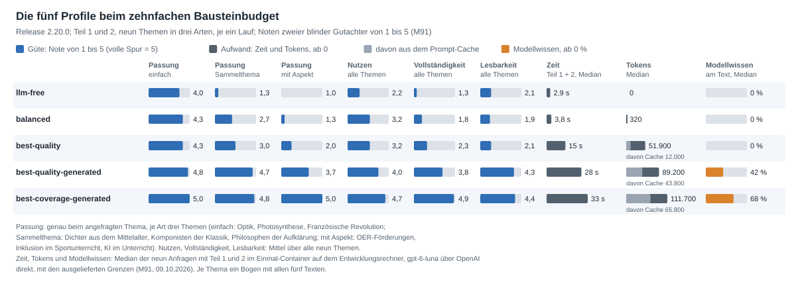
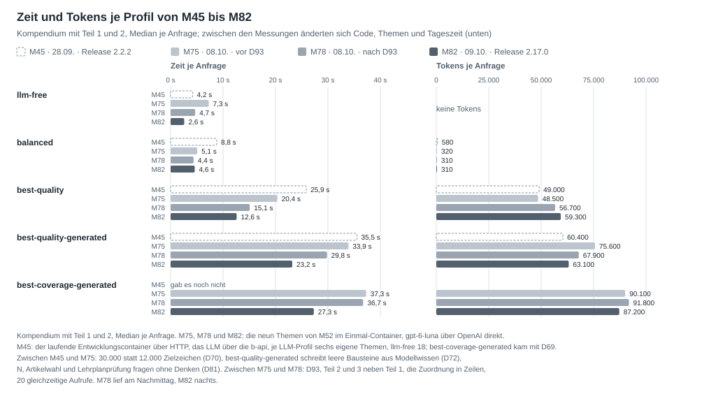
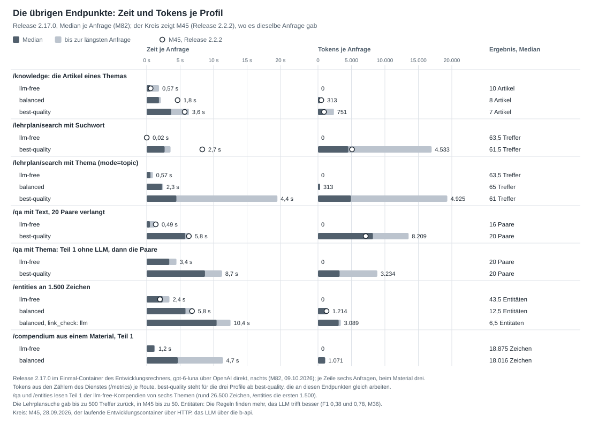

# Methoden, Messwerte und Profile

[Übersicht](README.md) · Stand 09.10.2026, Release 2.17.0 · Zahlen: [Messprotokoll](05-messprotokoll.md); die fünf
Profile, die Endpunkte und die KI-Fragen einzeln aus M82, die übrigen Methoden aus ihrer jeweils letzten Messung

Diese Seite begründet die fünf Profile. Für jeden wichtigen Schritt nennt sie die gemessenen Methoden mit Güte, Zeit
und Tokens und sagt, welches Profil welche Methode nutzt und warum: Artikelwahl, Korpusbau, Zuordnung der Absätze,
Text, Lehrplanschnipsel, QA-Paare und Entitäten. Die Profile legen fest, wo ein Sprachmodell (LLM) arbeitet:
`llm-free` nirgends; `balanced` dort, wo es wenig kostet und viel bringt; `best-quality` überall, wo es
die Güte messbar hebt; `best-quality-generated` lässt es zusätzlich den Text schreiben, `best-coverage-generated`
jeden Baustein vollständig zum angefragten Thema, aus den Belegen, wo sie es treffen, sonst aus Modellwissen (D69).
In jedem Profil hört jeder Prompt das angefragte Thema, nicht den gefundenen Artikel (D72). Gewählt
wird ein Profil mit
`preset`; ohne Angabe gilt `PRESET_DEFAULT`, ausgeliefert `best-quality-generated` (D82), ohne konfiguriertes LLM
`llm-free` (D68). Jedes Profil außer `llm-free` braucht ein konfiguriertes LLM, sonst ist die Anfrage ein 503.

## Die fünf Profile und ihre Methoden

| Schritt | `llm-free` | `balanced` | `best-quality` | `best-quality-generated` (Standard) | `best-coverage-generated` | Entscheidung |
|---|---|---|---|---|---|---|
| Hauptartikel (`article_choice`) | Regeln (`rule-based`) | Regeln, das LLM entscheidet die unsicheren Fälle (`llm`) | das LLM prüft auch sichere Auflösungen mehrdeutiger Wörter (`llm-thorough`) | wie `best-quality` | wie `best-quality` | D35, D53, D61 |
| Korpus | verlinkte Unterartikel und Volltexttreffer mit Link zum Hauptartikel | das LLM nennt Übersicht und Teile des Themas (N) | wie `balanced` | wie `balanced` | wie `balanced` | D48, D63 |
| Zuordnung (`matcher`) | `hybrid_light` mit Model2Vec | wie `llm-free` | das LLM ordnet jeden Absatz zu (`llm`) | wie `best-quality` | wie `best-quality` | D38, D53 |
| Text (`generation`, `enrichment`) | wörtlich, jeder Satz belegt | wie `llm-free` | wie `llm-free` | das LLM schreibt jeden Baustein zum angefragten Thema, Modellwissen für höchstens die Hälfte der Sätze, einen Baustein ohne Belege ganz aus Modellwissen, sichtbar markiert (D70, D72) | das LLM schreibt jeden Baustein vollständig zum angefragten Thema, aus den Belegen, wo sie es treffen, sonst aus Modellwissen, sichtbar markiert (`model-knowledge-full`) | D53, D56, D69 |
| Thema in den Prompts | – | das angefragte Thema | das angefragte Thema | das angefragte Thema; ist es ein Text (mehr als sechs Wörter oder 60 Zeichen, ein Satz, eine Frage) oder kommt ein Knoten oder eine Sammlung ohne Thema, formuliert das LLM es zuerst (`topic_wording`) | wie `best-quality-generated` | D72 |
| Prüfung des Modellwissens (`model_knowledge_check`) | – | – | – | keine (`rule-based`); mit `llm` streicht oder berichtigt ein zweiter Aufruf je Baustein Sätze aus Modellwissen | wie `best-quality-generated`; in M53 leichte Fehler je Text 1,1 statt 1,6 für rund 27.000 Tokens mehr, darum aus | D73, D74 |
| Hinweis aufs passende Profil (`audit.lint`, `topic-scope`) | wenn Wörter des Themas im Titel des Artikels fehlen | wenn die Frage N sagt, dass ihre Übersicht das Thema nicht deckt | wie `balanced` | – (der Text handelt vom angefragten Thema) | wie `best-quality-generated` | D73 |
| Lehrplanschnipsel (`curriculum_check`) | Regeln, Überschriften-Treffer gebündelt | wie `llm-free` | dazu prüft das LLM jedes Element (`llm`) | wie `best-quality` | wie `best-quality` | D58, D59 |
| QA-Paare (`/qa`, `method`) | Regeln aus dem spaCy-Parse, aufgefüllt mit Glossar und Akteuren | wie `llm-free` | das LLM schreibt die Paare (`llm`) | wie `best-quality` | wie `best-quality` | D55, D57, D60 |
| Entitäten (`/entities`, `methods`) | spaCy und das Wörterbuch der Artikeltitel (`ner`, `dictionary`) | das LLM nennt sie mit dem Titel ihres Artikels (`llm`) | wie `balanced` | wie `balanced` | wie `balanced` | D62 |
| Kennungen (Wikidata, GND, VIAF, DBpedia) | aus lokalen Indexen zum verknüpften Artikel | wie `llm-free` | wie `llm-free` | wie `llm-free` | wie `llm-free` | D43, D64, D65 |
| Material als Eingang (`node_id` ohne `topic`) | Regeln über Titel und Beschreibung | das LLM nennt den Artikel | wie `balanced` | wie `balanced` | wie `balanced` | D45, D47 |
| Teil 3: Sammlungsüberblick | edu-sharing zur Anfragezeit, kein LLM | wie `llm-free` | wie `llm-free` | wie `llm-free` | wie `llm-free` | – |
| Ziellänge von Teil 1 (`target_length`) | 30.000 Zeichen, eine Richtgröße: der wörtliche Text wird so lang, wie die Quellen tragen | wie `llm-free` | wie `llm-free` | 30.000 | 30.000 als Untergrenze | D69, D70 |
| Budget je Anfrage (D59, D102) | 60.000 Tokens | 60.000 | 200.000 | 200.000 | 200.000 | D59, D102 |
| Bausteinbudget (`BLOCK_BUDGET_FACTOR`) | das Zehnfache der Vorlage, Absätze und Zeichen | wie `llm-free` | wie `llm-free` | wie `llm-free` | wie `llm-free` | D102, M86 |

### Die fünf Profile beim zehnfachen Bausteinbudget (M91)

Release 2.20.0, gemessen am 09.10.2026 wie M82, aber mit dem zehnfachen Bausteinbudget (D102) und je Thema einem Bogen
mit allen fünf Texten ([M91](05-messprotokoll.md)): `best-coverage-generated` ist in jeder Note vorn (Passung 4,9,
Nutzen 4,7, Vollständigkeit 4,9, Lesbarkeit 4,4) und braucht 32,5 s, `best-quality-generated` 27,5 s (4,4, 4,0, 3,8,
4,3); Modellwissen 68 und 42 %. Die Empfehlung für den Betrieb steht in der Entscheidungsvorlage, Punkt 20. Die
Übersicht darunter ist der Stand vor D102.

### Die fünf Profile im Überblick: Güte, Zeit und Kosten (M82)

Release 2.17.0, gemessen am 09.10.2026: Teil 1 und 2 mit 30.000 Zielzeichen an den neun Themen von M48 und M52, je ein
Lauf mit `gpt-6-luna` im Einmal-Container des Entwicklungsrechners, nachts. Zwei neue blinde Gutachter lasen alle fünf
Texte je Thema und gaben bei der Passung in 37 von 45 Fällen dieselbe Note, sonst eine um eins verschiedene
([M82](05-messprotokoll.md)). Den Anteil des Modellwissens zählte ein zweiter Lauf der beiden schreibenden Profile.
Fett: die beste Note der Zeile.

| | `llm-free` | `balanced` | `best-quality` | `best-quality-generated` | `best-coverage-generated` |
|---|---|---|---|---|---|
| **Güte**, Noten von 1 bis 5 |  |  |  |  |  |
| Passung, Thema mit eigenem Artikel | 3,3 | 4,0 | 4,5 | 4,8 | **5,0** |
| Passung, Sammelthema | 1,2 | 2,0 | 2,5 | 4,0 | **5,0** |
| Passung, Thema mit Aspekt | 1,0 | 1,3 | 1,8 | 3,8 | **5,0** |
| Nutzen | 1,7 | 2,0 | 2,7 | 3,8 | **4,7** |
| Vollständigkeit | 1,2 | 1,4 | 2,1 | 3,7 | **5,0** |
| Lesbarkeit | 2,1 | 1,9 | 2,1 | 3,6 | **4,1** |
| Fehler je Text, schwer und leicht | 0,00 und 0,78 | 0,11 und 0,72 | 0,00 und 1,06 | 0,11 und 1,17 | 0,00 und 0,67 |
| Überschrift ist das angefragte Thema | 9 von 9 | 9 von 9 | 9 von 9 | 9 von 9 | 9 von 9 |
| Hauptartikel richtig, 94 Goldanfragen | 87 von 94 | 91 von 94 | 91 von 94 | 91 von 94 | 91 von 94 |
| **Zeit** |  |  |  |  |  |
| Anfrage mit Teil 1 und 2, Median (Spanne) | 2,6 s (1,6 bis 3,8 s) | 4,6 s (2,7 bis 6,1 s) | 12,6 s (10,1 bis 16,0 s) | 23,2 s (20,4 bis 25,4 s) | 27,3 s (25,0 bis 28,3 s) |
| **Kosten** |  |  |  |  |  |
| Tokens, Median | 0 | 310 | 59.300 | 63.100 | 87.200 |
| davon aus dem Prompt-Cache | – | 0 | 12.000 | 32.300 | 50.600 |
| **Text** |  |  |  |  |  |
| Zeichen, Median | 9.718 | 11.146 | 12.914 | 24.711 | 54.309 |
| Bausteine mit Text, von 10 | 7 | 7 | 8 | 10 | 10 |
| Modellwissen am Text, Median | 0 % | 0 % | 0 % | 51 % | 82 % |

- **Güte:** Passung, Nutzen und Vollständigkeit steigen mit jedem LLM-Schritt, am stärksten mit dem Schreiben; die
  Lesbarkeit erst mit dem Schreiben (1,9 bis 2,1 wörtlich, 3,6 und 4,1 geschrieben). Nur `best-coverage-generated`
  hält jedes Thema: Passung und Vollständigkeit 5,0 bei allen drei Arten. `best-quality-generated` bleibt bei Sammel-
  und Aspektthemen eine Stufe darunter (4,0 und 3,8), die wörtlichen Profile beim Oberbegriff oder einem Vertreter
  (höchstens 2,5).
- **Zeit:** 2,6 s ohne LLM, 4,6 s mit der Frage N, 12,6 s mit der Zuordnung durch das LLM, 23 und 27 s mit dem
  Schreiben, jeweils Teil 1 und 2; Teil 2 läuft neben der Zuordnung (D93). Tagsüber antwortet der Anbieter langsamer:
  In M78, am Nachmittag, brauchten die drei `best-quality`-Profile 15, 30 und 37 s.
- **Kosten:** Die Zuordnung durch das LLM und die Prüfung von Teil 2 kosten rund 59.000 Tokens; das Schreiben legt je
  Thema im Median 19.000 (`best-quality-generated`) und 41.000 (`best-coverage-generated`) dazu. Die Tokens folgen
  der Größe des Korpus. Aus dem Prompt-Cache, den der Anbieter günstiger abrechnet, kommen 12.000, 32.300 und 50.600.
- **Preis der Güte:** Die schreibenden Profile bestehen zu 51 und 82 % aus Modellwissen, im Markup gekennzeichnet
  und sichtbar als `[Modellwissen]` nur auf Wunsch (D76); der Text der wörtlichen Profile steht ganz in den Quellen.
- Die Noten gelten innerhalb einer Runde: In M52 (Stand D72) bekam `best-quality-generated` bei Sammel- und
  Aspektthemen 4,7 und 4,2, mit längeren Texten und mehr Modellwissen (62 %).

### Vor D72: fünf Profile an drei Arten von Themen (M48)

Teil 1 mit 30.000 Zielzeichen (D70), je drei Themen einer Art: einfach, mit eigenem Wikipedia-Artikel (Optik,
Photosynthese, Französische Revolution); Sammelthema, eine Gruppe ohne eigenen Artikel (Dichter aus dem Mittelalter,
Komponisten der Klassik, Philosophen der Aufklärung); mit Aspekt, den die Artikelwahl auf einen Oberbegriff auflöst
(OER-Förderungen, Inklusion im Sportunterricht, Künstliche Intelligenz im Unterricht). Zwei blinde Gutachter, Noten von
1 bis 5; Zeit und Tokens im Median auf dem Entwicklungsrechner, je ein Lauf mit frischen Antworten
([M48](05-messprotokoll.md)).

| | `llm-free` | `balanced` | `best-quality` | `best-quality-generated` | `best-coverage-generated` |
|---|---|---|---|---|---|
| Passung zum Thema, einfach | 3,2 | 4,0 | 4,5 | 4,8 | **5,0** |
| Passung, Sammelthema | 1,3 | 2,5 | 2,0 | 3,0 | **5,0** |
| Passung, mit Aspekt | 1,0 | 1,3 | 1,5 | 1,7 | **5,0** |
| Nutzen, alle neun Themen | 1,7 | 2,4 | 2,7 | 3,1 | **4,5** |
| Vollständigkeit | 1,2 | 1,4 | 1,9 | 2,6 | **4,8** |
| Lesbarkeit | 2,1 | 2,0 | 2,5 | 3,7 | **4,1** |
| schwere und leichte Fehler je Text | 0 und 0,5 | 0,06 und 0,8 | 0 und 1,2 | 0,11 und 1,0 | 0 und 0,8 |
| Überschrift ist das angefragte Thema | 3 von 9 | 3 von 9 | 3 von 9 | 3 von 9 | 9 von 9 |
| Zeit, Teil 1 | 1,6 s | 6,1 s | 18 s | 29 s | 37 s |
| Tokens (davon aus dem Prompt-Cache) | 0 | 580 | 61.060 (13.816) | 82.335 (37.262) | 101.150 (50.936) |
| Zeichen | 8.720 | 11.488 | 13.408 | 19.987 | 57.378 |
| Anteil Modellwissen am Text | 0 | 0 | 0 | 28 % (bis 50 %) | 84 % |

Die Tokens wachsen mit der Zuordnung durch das LLM, nicht mit dem Schreiben: `best-quality` braucht 61.060, das
Schreiben legt in `best-quality-generated` rund 21.000 und in `best-coverage-generated` rund 40.000 dazu. Die
wörtlichen Profile werden so lang, wie die Quellen tragen; in `best-coverage-generated` ist die Ziellänge Untergrenze,
der Text wird fast doppelt so lang.

Nach D72 maß M52 die fünf Profile; heute gilt die Übersicht oben (M82). [M51](05-messprotokoll.md) stellte
`best-quality-generated` vor und nach D72 nebeneinander: Passung bei Sammelthemen 3,8 statt 2,8, bei Themen mit Aspekt
4,0 statt 1,5.

### Welches Profil wofür

Nach M82, Release 2.17.0:

- **Thema mit eigenem Artikel** (Optik): `balanced` liefert einen wörtlichen, durchgehend belegten Text (Passung 4,0,
  5 s, 310 Tokens), etwa als Grundlage für Suche und KI-Assistenten. `best-quality-generated`, der ausgelieferte
  Standard (D82), schreibt einen lesbaren Text aus den Quellen und Modellwissen (Passung 4,8, Nutzen 4,3,
  Vollständigkeit 4,0, rund die Hälfte Modellwissen). `best-coverage-generated` schreibt den vollständigsten (Passung,
  Nutzen und Vollständigkeit 5,0), zu rund 80 % aus Modellwissen.
- **Sammelthema** (Dichter aus dem Mittelalter): `best-coverage-generated` (Passung 5,0) oder `best-quality-generated`
  (4,0); beide schreiben über die Gruppe. Die wörtlichen Profile drucken einen Vertreter oder den Oberbegriff, den die
  Artikelwahl findet (Passung höchstens 2,5); `llm-free` landet auf falschen oder zu engen Artikeln (1,2).
- **Thema mit Aspekt** (OER-Förderungen): `best-coverage-generated` (Passung 5,0) oder `best-quality-generated` (3,8),
  das kürzer schreibt. Die wörtlichen Profile bleiben beim Oberbegriff (höchstens 1,8).
- **Ohne Sprachmodell:** `llm-free` taugt nur für Themen mit eigenem Artikel (Passung 3,3, die meisten Bausteine
  lückenhaft); Sammel- und Aspektthemen kann es nicht, und Teil 2 findet für sie ohne die Frage N meist nichts.
- **`best-quality` in Teil 1:** Gegenüber `balanced` hebt es bei einfachen Themen Passung und Vollständigkeit um 0,5
  und 0,7, für rund 59.000 statt 310 Tokens; der Text bleibt wörtlich. Seine Stärke ist die Zuordnung (macro-F1 0,66
  bis 0,68 statt 0,455 am Gold, M82) und die Prüfung der Lehrplanelemente in Teil 2.
- **Belege:** Wo jede Aussage belegt sein muss, etwa für die Weiterverarbeitung, bleiben die wörtlichen Profile. Die
  schreibenden kennzeichnen ihr Modellwissen, prüfen es aber nicht gegen Quellen: In M48 standen sechs der acht
  leichten Fehler von `best-coverage-generated` in Sätzen mit `[Modellwissen]`.

### Was ein Kompendium je Profil kostet

Teil 1 und 2, gemessen am 09.10.2026 mit Release 2.17.0 und `gpt-6-luna` im Einmal-Container des
Entwicklungsrechners, nachts (M82). Auf dem Server dauern die Schritte ohne LLM etwa halb so lange (M45), die des LLM
gleich lang; tagsüber antwortet der Anbieter langsamer (M78).

| Profil | Zeit, Median (Spanne) | davon das LLM | Tokens, Median (Spanne) | Kompendien je Million Tokens |
|---|---|---|---|---|
| `llm-free` | 2,6 s (1,6 bis 3,8 s) | – | 0 | ohne Grenze |
| `balanced` | 4,6 s (2,7 bis 6,1 s) | rund 2 s: die Frage nach Übersicht und Teilen (N), selten die Artikelwahl | 314 (307 bis 1.234) | rund 3.200 |
| `best-quality` | 12,6 s (10,1 bis 16,0 s) | Artikelwahl und N, Zuordnung 10,0 s, die Prüfung der Lehrplanschnipsel neben der Zuordnung | 59.335 (29.663 bis 73.304) | rund 17 |
| `best-quality-generated` (Standard) | 23,2 s (20,4 bis 25,4 s) | dazu das Schreiben, 10,4 s | 63.117 (48.758 bis 92.436) | rund 16 |
| `best-coverage-generated` | 27,3 s (25,0 bis 28,3 s) | dazu das Schreiben aller Bausteine, 15,5 s | 87.225 (63.683 bis 115.269) | rund 11 |

Die Tokens folgen der Größe des Themas: Die LLM-Zuordnung kostet rund 160 Tokens je Absatz (M82 am Gold), und die
Frage N bringt bei großen Themen bis 400 Absätze in den Korpus; die Prüfung von Teil 2 kostet im Median rund 4.000
Tokens aus einem eigenen Budget (D94). Gegenüber M78 (08.10., nachmittags) sind die Zeiten der `best-quality`-Profile
nachts 17 bis 26 % kürzer, die Tokens gleich.

Wie sich Zeit und Tokens je Profil seit M45 bewegt haben; zwischen den Messungen änderten sich Code, Themen und
Tageszeit, die Anmerkungen unter der Grafik nennen es:

### Die übrigen Endpunkte

Median je Anfrage (M82), im Einmal-Container des Entwicklungsrechners, `gpt-6-luna` über OpenAI.

| Endpunkt | `llm-free` | mit LLM |
|---|---|---|
| `POST /api/v2/knowledge` (Artikel eines Themas) | 0,57 s, 10 Artikel | `balanced` 1,8 s und 313 Tokens; `best-quality` 3,6 s und 751 Tokens |
| `GET /api/v2/lehrplan/search`, Suchwort | 0,02 s | `best-quality` 2,7 s und 4.533 Tokens: das LLM benotet jeden Treffer |
| `GET /api/v2/lehrplan/search`, `mode=topic` | 0,57 s | `balanced` 2,3 s und 313 Tokens; `best-quality` 4,4 s und 4.925 Tokens |
| `POST /api/v2/qa` mit `text` (rund 26.500 Zeichen, 20 Paare verlangt) | 0,49 s, 16 Paare | `best-quality` 5,8 s und 8.209 Tokens, 20 Paare |
| `POST /api/v2/qa` mit `topic` (Teil 1 ohne LLM, dann die Paare) | 3,4 s, 20 Paare | `best-quality` 8,7 s und 3.234 Tokens, 20 Paare |
| `POST /api/v2/entities` (1.500 Zeichen) | 2,4 s, 44 Entitäten | `balanced` 5,8 s und 1.214 Tokens, 13 Entitäten (von 83 Verknüpfungen der sechs Texte 81 mit Wikidata-Nummer); mit `link_check: llm` 10,4 s und 3.089 Tokens |
| `POST /api/v2/compendium` aus einem Material (`node_id`, Teil 1) | 1,2 s | `balanced` 4,7 s und 1.071 Tokens: das LLM nennt den Artikel |
| `GET /api/v2/collections/{id}/overview` (Teil 3) | ohne Cache 0,8 bis 6,1 s, mit Cache unter 0,05 s; ohne LLM in allen Profilen | – |
| `GET /api/v2/nodes/{id}` | ohne LLM in allen Profilen | – |

## 1. Artikelwahl: den Hauptartikel finden

| Methode | Hauptartikel richtig, 94 Goldanfragen | Zeit | Tokens | genutzt in | Messung |
|---|---|---|---|---|---|
| alter Weg: ein LLM nennt bis zu zehn Begriffe, jeder wird nachgeschlagen | 55 an erster Stelle, 58 bis 78 unter allen | 6 bis 8 s je Anfrage | 1.300 bis 1.500 | alter Dienst | M17 |
| v2.0.0: Titel, Weiterleitung, Wortzählung in Begriffsklärungen | 66 | rund 0,03 s | 0 | abgelöst | M9 |
| **Regeln** mit den Kontextwörtern des Fachs, Wortanfängen und Genitivregeln | **87** | rund 0,03 s | 0 | `llm-free` | M9, M35, M82 |
| Regeln und laya, ein lokales Entscheidungsmodell | 81 | +0,45 s, 1,7 GB je Worker | 0 | nicht eingebaut (D42) | M16 |
| **Regeln, das LLM entscheidet unsichere Fälle** (`llm`) | **91** | mit der Frage N 2,4 s je Anfrage; die Artikelwahl gefragt bei 18 von 94 | 320 je Anfrage, fast alle für N | `balanced` | M9, M35, M82 |
| **das LLM prüft auch sichere Auflösungen** (`llm-thorough`) | **91 bis 93** | mit der Frage N 3,0 s je Anfrage; gefragt bei 64 von 94 | 748 je Anfrage | `best-quality`, `best-quality-generated`, `best-coverage-generated` | M35, M59, M82 |

**Warum so:**

- Die Regeln melden, ob sie sicher sind, und das trägt: sicher liegen sie 73 von 76 Mal richtig, unsicher nur 13 von
  18. Das LLM entscheidet genau diese 18 und trifft alle, ohne je einen richtigen Artikel der Regeln zu verwerfen.
  Darum ist `llm` der billigste Hebel mit messbarer Wirkung und steht schon in `balanced` (D35, D53).
- `llm-thorough` fängt zwei der drei sicheren Fehler der Regeln („Physik: Strom“, „Informatik: Netzwerk“), fragt dafür
  aber bei 64 statt 18 Anfragen. Das lohnt, wo Güte vor Zeit geht, also in den `best-quality`-Profilen (Jan, D61).
- Ohne LLM gibt es nichts Besseres als die Regeln: Das lokale Modell laya traf weniger (81) und braucht 1,7 GB je Worker
  (D42); der alte Weg über Begriffe vom LLM nennt keinen Hauptartikel und kostet bei jeder Anfrage einen Aufruf (M17).
- Seit D63 kann in `balanced` die vom LLM genannte Übersicht den Hauptartikel ersetzen, wo die Regeln das Thema
  verfehlen; am Gold bleibt es bei 91 und 93 (M39). M82 traf mit `llm-thorough` 91: Seine drei Fehlgriffe
  („Lichtlehre“, „Deutsch: Artikel“, „Ursachen des Ersten Weltkriegs“ → *Julikrise*) sind Grenzfälle, an denen die
  Antwort des Modells zwischen Läufen wechselt (M59: 93, M63: 92).
- Sagt das LLM, dass keiner der Kandidaten der Regeln passt, geht auch deren Artikel (D85): Das traf in M63 nur
  mehrdeutige Einzelwörter ohne Fach, bei denen die Regeln eine zufällige Bedeutung hielten („Stamm (Familienname)“).
  Die Übersicht der Frage N nimmt dann den Platz, wo das Archiv sie hat; sonst rät die Antwort zu einem Fach.
- Material als Eingang (D47): Titel nennen oft ein Format statt eines Themas. Die Regeln finden den Artikel über Titel
  und Beschreibung mit einem F1 von 0,56 und 0,63 an zwei Stichproben, das LLM mit 0,98 und 0,88 (M25). An den 40
  Materialien von eval/materialwahl findet das LLM in `balanced` 36 richtige Artikel (klar 30 von 31), die Regeln 21
  und für zehn keinen; 4,7 s und rund 1.070 Tokens je Kompendium aus einem Material (M82).
- Sammlung als Eingang (D92): Im Themenbaum heißt eine Sammlung oft nur „Grundlagen“ oder „Einführung“. Mit dem Ort im
  Baum - Sammlungen darüber, eigene Untersammlungen, erste Materialtitel, Nachbarn als nicht gemeint - nennt die Frage
  N die Sammlung selbst statt des ganzen Fachs (Note 3,5 bis 4,0 statt 1,9 von 5, bei sprechenden Titeln 3,9 bis 4,3
  statt 2,8 bis 2,9); bei neutralem Titel führt ihre Übersicht, und die schreibenden Profile formulieren das Thema mit
  dem Ort im Baum (3,8 statt 3,4 bis 3,5). Ohne LLM lösen die Regeln dann die nächste sprechende Sammlung darüber auf,
  ohne Zusätze in Klammern (3,3 statt 1,2, wo das von der ersten Messung abwich); bei sprechendem Titel bleibt es beim
  Titel, denn dort schadete der Elterntitel (M71).
- Fragen ohne LLM (D92): Eine Frage oder ein Satz ging ganz in die Volltextsuche (*Mond* für den Regenbogen). Wo die
  Regeln nur raten, gelten jetzt die Stichwörter der Frage in ihrer Reihenfolge: 43 bis 45 statt 22 bis 24 von 60
  Fragen bekommen einen passenden Artikel (M73). Bei kurzen Themen bleibt es bei den Regeln.

## 2. Korpusbau: welche Artikel neben den Hauptartikel kommen

Der Korpus hat höchstens 12 Artikel und 400 Absätze. Gemessen ist, woher die gedruckten Absätze stammen, benotet von
zwei Gutachtern: bei 25 Sammel- und Mischthemen wie „deutsche Dichter“ und bei 20 gewöhnlichen Themen.

| Methode | gedruckte Absätze aus passenden Artikeln: Sammelthemen / gewöhnliche | Zeit | Tokens je Thema | genutzt in | Messung |
|---|---|---|---|---|---|
| alter Weg: die Begriffe, die ein LLM nennt, als Korpus | 63 % / nicht gemessen | 6 bis 8 s | rund 1.500 | alter Dienst | M37 |
| **Regeln:** verlinkte Unterartikel und Volltexttreffer, nur mit Link zum Hauptartikel | **43 % / 71 %** | lokal | 0 | `llm-free` | M37, M39 |
| dazu prüft das LLM die Nebenartikel | 45 % / 73 % | +1,4 bis 2 s | 750 bis 1.400 | `balanced` bis D63; heute der Rückfall, wenn N nicht antwortet | M25, M37, M39 |
| kleine lokale Modelle (LFM2, Qwen3 0.6B) stellen die Frage N | kein Gewinn gegenüber den Regeln | 4,4 bis 6,3 s je Frage | 0 | nicht eingebaut | M40 |
| **das LLM nennt Übersicht und Teile des Themas (N)** | **87 % / 93 %** | +2 s | rund 310 | `balanced`, `best-quality`, `best-quality-generated`, `best-coverage-generated` | M37, M39, M82 |

**Warum so:**

- Unverlinkte Volltexttreffer waren zu 10 von 16 unpassend, verlinkte zu 4 von 28; seit D48 fallen die unverlinkten
  weg. So druckt `llm-free` 12 statt 25 Absätze aus unpassenden Artikeln, ohne LLM (M25).
- Bei Sammel- und Mischthemen trägt ein einzelner Hauptartikel nicht, die Regeln landen oft auf einer Liste. Die Frage
  N hebt den Anteil passender Absätze von 43 auf 87 % und bei gewöhnlichen Themen von 71 auf 93 %, für rund 2 s und 310
  Tokens (M82; vor D81, mit Denken, 5 s und 500). Kein anderer Schritt bringt so viel je Token; darum stellt schon
  `balanced` sie (Jan, D63).
- Ohne großes LLM geht das nicht: Kleine lokale Modelle wissen nicht, wer zu einer Gruppe gehört (M40). `llm-free`
  bleibt deshalb bei den Regeln (Jan).
- Der alte Weg kam auf 63 %, nannte aber keinen Hauptartikel und brachte Begriffsklärungsseiten mit (M17, M37).

## 3. Zuordnung: die Absätze auf die Bausteine verteilen

Jeder Absatz des Korpus kommt in höchstens einen der zehn Inhaltsbausteine des Templates SC26. Maß ist der macro-F1
am Goldstandard (zehn Themen, gelabelte Absätze).

| Methode | macro-F1 | Zeit je Kompendium | Tokens | genutzt in | Messung |
|---|---|---|---|---|---|
| nur das Überschriften-Lexikon (`lexicon_only`) | 0,35 | 0,02 s | 0 | wählbar | M15 |
| BM25 (`bm25`) | 0,36 | 0,03 s | 0 | wählbar | M15 |
| Zeichen-TF-IDF (`char_tfidf`) | 0,40 | 0,25 s | 0 | wählbar | M15 |
| Satzvektoren, Frage-Antwort-Modell, Cross-Encoder der Testapp | 0,29 bis 0,37 | 4 bis 73 s | 0 | nicht eingebaut | M4, M5 |
| `hybrid_light` ohne Model2Vec | 0,38 | 0,3 s | 0 | Rückfall ohne Modell | M15, M44 |
| **`hybrid_light` mit Model2Vec** | **0,45** | 0,2 bis 0,7 s | 0 | `llm-free`, `balanced` | M27, M44, M82 |
| das LLM nur für unsichere Absätze | 0,54 | halbe LLM-Zeit | halbe Tokens | verworfen | M12 |
| **das LLM ordnet jeden Absatz zu** (`llm`) | **0,66 bis 0,70** | +10 s | rund 160 je Absatz | `best-quality`, `best-quality-generated`, `best-coverage-generated` | M19, M27, M77, M82 |

**Warum so:**

- `hybrid_light` mit Model2Vec ist das beste lokal laufende Verfahren, in 0,3 s und ohne Tokens (D38). Schwerere
  Modelle der Testapp schneiden im Ablauf des Dienstes schlechter ab.
- Das LLM ordnet deutlich besser zu, vor allem in den kleinen Bausteinen, an denen die lokalen Verfahren scheitern
  (Beruf & Wirtschaft 0,27 auf 0,80, Gesellschaftlicher Kontext 0,41 auf 0,78). Es kostet aber rund 10 s und bei
  einem großen Thema viel: Wikinger mit 400 Absätzen 65.116 Tokens (M45). Seit D93 antwortet es in Zeilen statt in
  JSON, am Gold gleich gut (M77), in M82 mit 0,661 und 0,675 in zwei Läufen. Deshalb nur in den
  `best-quality`-Profilen (D53).
- `balanced` nimmt dieselbe Zuordnung wie `llm-free`. Auf den Absätzen, die das Gold noch abdeckt, kommt sie mit dem
  Korpus aus N auf 0,50 statt 0,45; das Gold deckt diesen Korpus aber nur zu zwei Dritteln ab (M39).
- Das Ziel 0,70 erreicht nur das LLM. Die sechs Faktoren der Regel-Policy sind gemessen (M44): drei tragen, zwei wirken
  auf dem Gold nicht, der Abschlag für Ausschlusswörter kostet leicht. Die Werte bleiben, bis Jan entscheidet.

## 4. Text von Teil 1: wörtlich oder geschrieben

| Methode | Güte | Zeit | Tokens | genutzt in | Messung |
|---|---|---|---|---|---|
| **wörtlich:** die zugeordneten Absätze, jeder Satz mit Belegnummer | jeder Satz steht wörtlich im zitierten Absatz; Lesbarkeit 2,5 von 5 | lokal | 0 | `llm-free`, `balanced`, `best-quality` | M3, M28 |
| das LLM wählt die Sätze aus (`extraction=llm`) | am Goldstandard kein Gewinn; beim zehnfachen Bausteinbudget Nutzen 3,1 statt 3,8 (`balanced`) und 3,4 statt 4,2 (`best-quality`), lesbarer, weniger Fehler (M89) | +6 bis +11 s | 14.000 bis 22.400, beim Zehnfachen rund 33.000 | in keinem Profil; Kästchen in der Prüfansicht (D103) | 02-weltwissen.md, M89 |
| **das LLM schreibt jeden Baustein, Modellwissen markiert** | Lesbarkeit 3,6, Nutzen 3,8 von 5; rund die Hälfte des Textes Modellwissen (M82); in M28 11 von 12 Urteilen vorgezogen, in M31 von 50 Sätzen Modellwissen keiner falsch | +10,4 s | je Thema im Median 19.000 mehr als `best-quality` | `best-quality-generated` (Standard) | M28, M31, M82 |
| **das LLM schreibt jeden Baustein vollständig zum angefragten Thema** (`model-knowledge-full`): Belege, wo sie das Thema treffen, sonst Modellwissen, auch ohne Belege | Passung und Vollständigkeit 5,0 bei allen drei Arten von Themen, Lesbarkeit 4,1, keine schweren Fehler; rund 54.000 Zeichen, zu 82 % Modellwissen (M82); Themen mit Aspekt in M47: Passung 4,81 statt 1,81 | +15,5 s | je Thema im Median 41.000 mehr als `best-quality`, 50.600 aus dem Prompt-Cache | `best-coverage-generated` | M46, M47, M82 |

**Warum so:** Der wörtliche Text ist nachprüfbar und bleibt deshalb der Standard bis `best-quality`; für KI und
Weiterverarbeitung ist das richtig. Für Menschen, die den Text direkt lesen, ist die geschriebene Fassung klar besser;
sie ist ein eigenes Profil (Jan, 25.09.2026), und ihr Modellwissen ist gekennzeichnet, nur als prüfbare Sachaussage
(D56): im Markup, sichtbar als `[Modellwissen]` nur auf Wunsch (`model_knowledge_label`, D76). Wer ein Thema mit Aspekt anfragt („OER-Förderungen“, „Inklusion im Sportunterricht“), bekommt dort aber einen
Text über den Artikel, auf den die Artikelwahl das Thema auflöst; `best-coverage-generated` schreibt jeden Baustein
über das angefragte Thema und füllt ihn, wo die Quellen nichts dazu sagen, aus Modellwissen (Jan, 01.10.2026: „max.
abdeckung der kategorien und max. nähe zum thema“, D69). Der Preis ist ein Text, der zum größten Teil aus
Modellwissen besteht; die Gutachter fanden darin keine schweren Fehler (M47).

## 5. Lehrplanschnipsel auswählen (Teil 2)

Teil 2 sucht in den MEM-Lehrplänen mit Stichwörtern, Fach- und Wortgrenzenfilter. Gemessen ist der Anteil der einzeln
gezeigten Elemente, die zum Thema passen, bei 20 Themen ohne und mit Fach, benotet von zwei Gutachtern.

| Methode | passend, ohne / mit Fach | passt nicht | Zeit | Tokens je Anfrage | genutzt in | Messung |
|---|---|---|---|---|---|---|
| jeder Treffer einzeln | 62 bis 64 % / 64 bis 67 % | 11 bis 17 % | 0,1 bis 0,7 s | 0 | abgelöst (D58) | M22, M32 |
| **Überschriften-Treffer gebündelt** | **70 bis 72 % / 77 bis 81 %** | 5 bis 9 % | 0,1 bis 0,4 s, die Suche 0,02 s | 0 | `llm-free`, `balanced` | M32, M82 |
| **dazu prüft das LLM jedes Element** | **74 bis 77 % / 76 bis 79 %** | 5 bis 9 % | +2,5 s neben der Zuordnung, die Suche 2,7 s | im Median rund 4.100 bis 4.500 | `best-quality`, `best-quality-generated`, `best-coverage-generated` | M32, M33, M82 |

**Warum so:**

- Viele Treffer stehen nur in der Überschrift eines Bereichs. Sie gebündelt in eine Zeile zu stellen, hebt den Anteil
  passender Elemente ohne Kosten; dafür steht ein Viertel der passenden nur in der Bündelzeile (D58).
- Die LLM-Prüfung verwirft Unpassendes, ohne ein passendes Element zu verlieren: An den 57 Themen von M57 gilt ihre
  Note 2 bei gewöhnlichen Themen zu 80 % als passend, bei Gruppen zu 55 %, bei Aspekten zu 19 %, und von den passenden
  Elementen behält sie alle (M82, wie M59). Sie kostet im Median rund 4.000 Tokens je Anfrage, bei breiten Themen bis
  rund 20.000 („Glas“, 245 Treffer); seit D81 fragt sie ohne Denken (2,7 statt 8,3 s in der Suche). Sie steht deshalb
  nur in den `best-quality`-Profilen und rechnet aus einem eigenen Budget von 400.000 Tokens, damit auch das breiteste
  Thema ganz geprüft wird: Demokratie ohne Fach, 819 Elemente, 75.016 Tokens (D59, D94, M33).

## 6. QA-Paare erzeugen

Je 20 verlangte Paare zu sechs Texten, benotet von zwei Gutachtern: mangelfrei heißt ohne Mangel bei beiden (Frage
ohne den Text verständlich, Antwort passt, nicht doppelt, nicht trivial, kein Sachfehler).

| Methode | mangelfrei bei beiden | Zeit je Text | Tokens je Text | genutzt in | Messung |
|---|---|---|---|---|---|
| vier Vorlagen | nicht bewertet; 82 % Jahresfragen, `count` nicht eingehalten | 0,02 s | 0 | abgelöst (D55) | M29, M30 |
| Satzanalyse (`parse-based`) | 36 % (16 von 44) | 0,17 s | 0 | entfernt (D57) | M30 |
| zwei kleine Modelle im Image | 21 % (25 von 120) | 25 s | 0; 1,3 GB je Worker | entfernt (D57) | M30 |
| **Regeln aus dem spaCy-Parse, aufgefüllt mit Glossar und Akteuren** | **61 % (58 von 95)** | 0,49 s, mit Thema 3,4 s | 0 | `llm-free`, `balanced` | M30, M34, M82 |
| **das LLM schreibt die Paare** | **83 % (99 von 120)** | 5,8 s, mit Thema 8,7 s | rund 2.400 bei 5.000 bis 12.000 Zeichen, 8.209 bei rund 26.500 | `best-quality`, `best-quality-generated`, `best-coverage-generated` | M30, M82 |

**Warum so:**

- Die Vorlagen fragten zu 82 % nach einer Jahreszahl und lieferten statt 20 rund 5 Paare. Die Regeln fragen aus dem
  Parse jedes Satzes nach Zeit, Ort, Person, Sache, Anzahl, Grund und Definition und halten `count` bei längeren
  Texten ein (D55); aufgefüllt aus Glossar und Akteuren sind 58 statt 46 von 95 Paaren mangelfrei (D60).
- Die kleinen Modelle waren die schwächste und langsamste Stufe. Der Standard soll schnell und sparsam fragen (Jan):
  `balanced` nimmt die Regeln, die Modelle sind entfernt (D57).
- Das LLM liefert vier von fünf Paaren mangelfrei und steht in den `best-quality`-Profilen. In M82 (sechs Themen à
  fünf Paare, Noten 0 bis 2 wie M59) bekamen seine Paare 1,37 und 1,47, die der Regeln 0,80 und 0,77; beide
  Gutachter fanden das LLM in allen sechs Themen besser, bei nicht mehr falschen Antworten.
- Teil 1 eines Themas entsteht für `/qa` immer ohne LLM; das Profil wählt nur das Verfahren der Paare (D55).

## 7. Entitäten ermitteln

F1 der verknüpften Artikel an den Texten von 40 Materialien, benotet von zwei Gutachtern, durch den Endpunkt gemessen.

| Methode | F1 (Präzision / Recall) | Zeit je Text | Tokens je Text | genutzt in | Messung |
|---|---|---|---|---|---|
| spaCy allein (`ner`) | 0,30 (0,41 / 0,23) | lokal | 0 | Teil von `llm-free` | M36 |
| das Wörterbuch der Artikeltitel allein (`dictionary`) | 0,35 (0,25 / 0,58) | lokal | 0 | Teil von `llm-free` | M36 |
| **spaCy und Wörterbuch** | **0,38 (0,29 / 0,55)** | 0,9 bis 2,4 s | 0 | `llm-free` | M36, M82 |
| **das LLM nennt die Entitäten mit ihrem Artikeltitel** | **0,78 (0,70 / 0,89)** | 5,5 bis 5,8 s | rund 900 bis 1.200 | `balanced`, `best-quality`, `best-quality-generated`, `best-coverage-generated` | M36, M82 |
| dazu prüft das LLM jede Verknüpfung (`link_check: llm`) | 0,76 (0,94 / 0,64) | +4,6 s | +1.900 | Schalter, in keinem Profil | M36, M82 |

Die Kennungen folgen dem verknüpften Artikel und kommen in allen Profilen aus denselben lokalen Indexen (M43):

| | `llm-free` | `balanced` und die `best-quality`-Profile |
|---|---|---|
| Wikidata-Nummer, Präzision / Recall | 0,29 / 0,55 | 0,70 / 0,89 |
| GND, Präzision / Recall | 0,31 / 0,57 | 0,70 / 0,88 |
| DBpedia-URI über den englischen Artikel | 88 % der Artikel | 96 % |

**Warum so:**

- M82 rechnete wie M59 nur mit den Noten von Gutachter 1 und den benoteten Verknüpfungen: die Regeln passend 29 %,
  von den passenden gefunden 55 % (wie M36), das LLM 69 und 81 % (M59: 73 und 84 %, im Rahmen der Streuung).
- Das Wörterbuch verknüpft auch Allerweltswörter; deshalb kommen die Regeln nur auf 0,38. Das LLM nennt die Entitäten
  mit dem Titel ihres Artikels, der im lokalen Archiv nachgeschlagen wird: 0,78, ohne Live-Abfrage. Darum nutzt es
  jedes Profil außer `llm-free` (Jan: Methoden gemäß den Ergebnissen, D62).
- Die zweite LLM-Prüfung jeder Verknüpfung hebt die Präzision auf 0,94, verwirft aber ein Drittel der passenden
  Entitäten; sie bleibt ein Schalter für kurze, sichere Listen.
- Die Kennungen sind genau so treffsicher wie die Verknüpfung; Wikidata und GND kommen aus Indexen, die zwei Sidecars
  bauen (D64, D65).

## Messbedingungen und Grenzen

- **Zeit und Tokens (M82):** Release 2.17.0, `gpt-6-luna` über OpenAI direkt, am 09.10.2026 nachts im
  Einmal-Container des Entwicklungsrechners; je Thema und Profil ein Lauf nach einem Aufwärmdurchgang. Die Schritte
  ohne LLM dauern dort etwa doppelt so lange wie auf dem Server, weil die Archive auf einem Windows-Laufwerk liegen
  (M45); die Schritte des LLM dauern tagsüber länger als nachts (M78).
- **Güte:** Artikelwahl und Zuordnung am Goldstandard des Dienstes (94 Anfragen, zehn Themen); Korpus, Text,
  Lehrplanschnipsel, QA-Paare und Entitäten von zwei blinden Gutachtern. Die Gutachter sind Claude-Subagenten, keine
  Lehrkräfte, und die Stichproben sind klein (sechs bis 45 Themen, 40 Materialtexte). Die Zahlen trennen die Methoden
  verlässlich; eine einzelne Zahl ist auf einige Prozent genau.
- **Stand der Güte:** Die fünf Profile und jede KI-Frage sind am 09.10.2026 mit Release 2.17.0 nachgemessen (M82)
  und halten die Werte ihrer letzten Messung im Rahmen der Streuung eines Laufs. Die Tabellen der Methoden nennen
  daneben die Messungen, aus denen eine Methode gewählt oder verworfen wurde.
- **Das Gold der Zuordnung** stammt aus dem Korpus vor D63 und deckt den Korpus mit N nur zu zwei Dritteln ab (M39).
