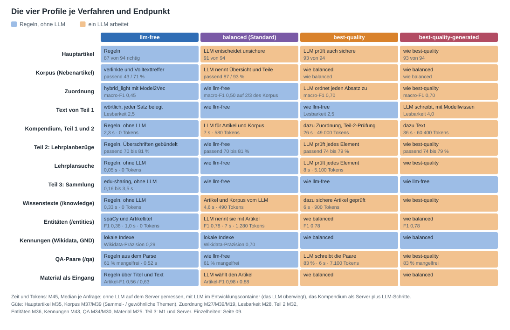
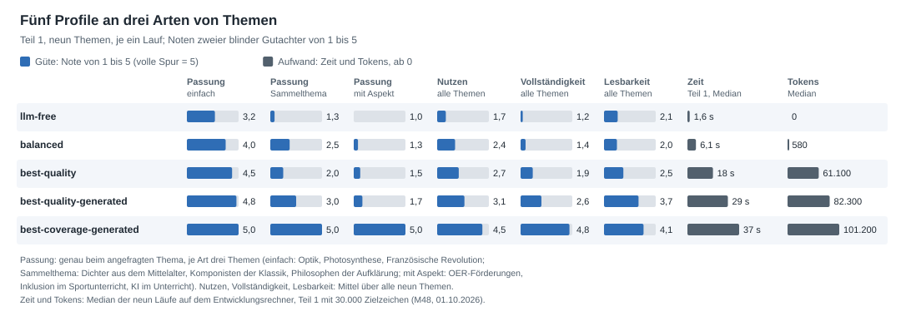
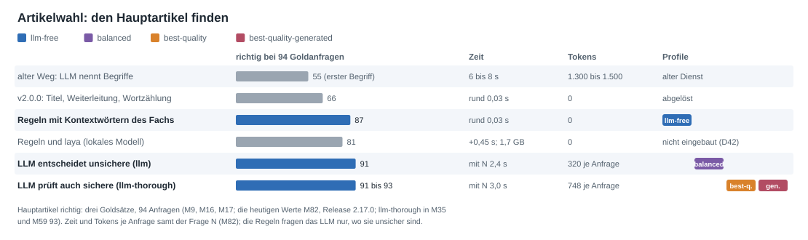
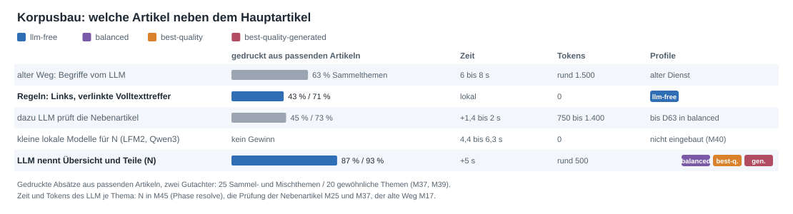
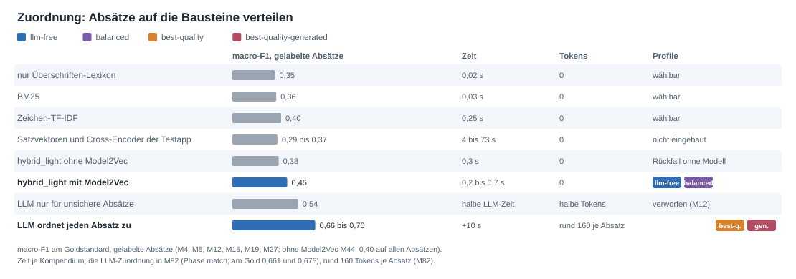
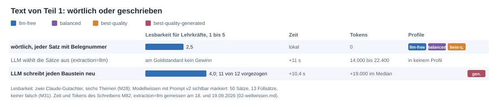
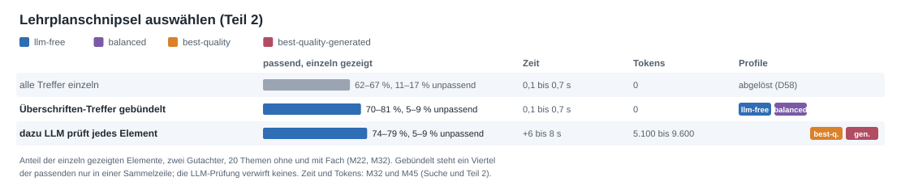
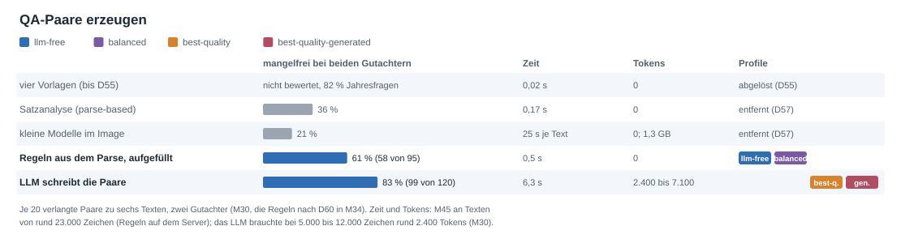
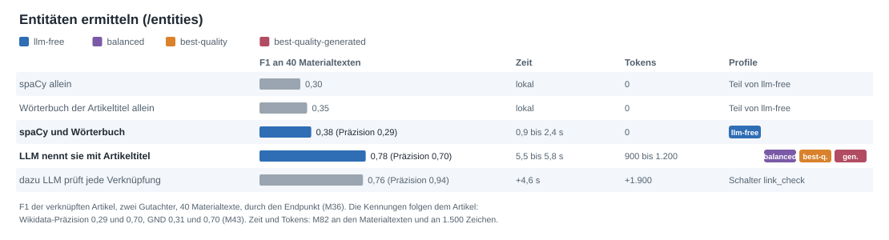

# Methoden, Messwerte und Profile

[Übersicht](README.md) · Stand 01.10.2026 (D70) · Zahlen: [Messprotokoll](05-messprotokoll.md); die fünf Profile
im Vergleich aus M48, Zeit und Tokens mit Teil 2 aus M45, die Güte jeder Methode aus ihrer jeweils letzten Messung

Diese Seite begründet die fünf Profile. Für jeden wichtigen Schritt nennt sie die gemessenen Methoden mit Güte, Zeit
und Tokens und sagt, welches Profil welche Methode nutzt und warum: Artikelwahl, Korpusbau, Zuordnung der Absätze,
Text, Lehrplanschnipsel, QA-Paare und Entitäten. Die Profile legen fest, wo ein Sprachmodell (LLM) arbeitet:
`llm-free` nirgends; `balanced`, der Standard, dort, wo es wenig kostet und viel bringt; `best-quality` überall, wo es
die Güte messbar hebt; `best-quality-generated` lässt es zusätzlich den Text schreiben, `best-coverage-generated`
jeden Baustein vollständig zum angefragten Thema, aus den Belegen, wo sie es treffen, sonst aus Modellwissen (D69).
In jedem Profil hört jeder Prompt das angefragte Thema, nicht den gefundenen Artikel (D72). Gewählt
wird ein Profil mit
`preset`; ohne Angabe gilt `PRESET_DEFAULT`, ausgeliefert `balanced` (D53). Jedes Profil außer `llm-free` braucht ein
konfiguriertes LLM, sonst ist die Anfrage ein 503.

## Die fünf Profile und ihre Methoden

| Schritt | `llm-free` | `balanced` (Standard) | `best-quality` | `best-quality-generated` | `best-coverage-generated` | Entscheidung |
|---|---|---|---|---|---|---|
| Hauptartikel (`article_choice`) | Regeln (`rule-based`) | Regeln, das LLM entscheidet die unsicheren Fälle (`llm`) | das LLM prüft auch sichere Auflösungen mehrdeutiger Wörter (`llm-thorough`) | wie `best-quality` | wie `best-quality` | D35, D53, D61 |
| Korpus | verlinkte Unterartikel und Volltexttreffer mit Link zum Hauptartikel | das LLM nennt Übersicht und Teile des Themas (N) | wie `balanced` | wie `balanced` | wie `balanced` | D48, D63 |
| Zuordnung (`matcher`) | `hybrid_light` mit Model2Vec | wie `llm-free` | das LLM ordnet jeden Absatz zu (`llm`) | wie `best-quality` | wie `best-quality` | D38, D53 |
| Text (`generation`, `enrichment`) | wörtlich, jeder Satz belegt | wie `llm-free` | wie `llm-free` | das LLM schreibt jeden Baustein zum angefragten Thema, Modellwissen für höchstens die Hälfte der Sätze, einen Baustein ohne Belege ganz aus Modellwissen, sichtbar markiert (D70, D72) | das LLM schreibt jeden Baustein vollständig zum angefragten Thema, aus den Belegen, wo sie es treffen, sonst aus Modellwissen, sichtbar markiert (`model-knowledge-full`) | D53, D56, D69 |
| Thema in den Prompts | – | das angefragte Thema | das angefragte Thema | das angefragte Thema; ist es ein Text (mehr als sechs Wörter oder 60 Zeichen, ein Satz, eine Frage) oder kommt ein Knoten oder eine Sammlung ohne Thema, formuliert das LLM es zuerst (`topic_wording`) | wie `best-quality-generated` | D72 |
| Prüfung des Modellwissens (`model_knowledge_check`) | – | – | – | keine (`rule-based`); mit `llm` streicht oder berichtigt ein zweiter Aufruf je Baustein Sätze aus Modellwissen | ein zweiter Aufruf je Baustein (`llm`): leichte Fehler je Text 1,1 statt 1,6 (M53) | D73 |
| Hinweis aufs passende Profil (`audit.lint`, `topic-scope`) | wenn Wörter des Themas im Titel des Artikels fehlen | wenn die Frage N sagt, dass ihre Übersicht das Thema nicht deckt | wie `balanced` | – (der Text handelt vom angefragten Thema) | wie `best-quality-generated` | D73 |
| Lehrplanschnipsel (`curriculum_check`) | Regeln, Überschriften-Treffer gebündelt | wie `llm-free` | dazu prüft das LLM jedes Element (`llm`) | wie `best-quality` | wie `best-quality` | D58, D59 |
| QA-Paare (`/qa`, `method`) | Regeln aus dem spaCy-Parse, aufgefüllt mit Glossar und Akteuren | wie `llm-free` | das LLM schreibt die Paare (`llm`) | wie `best-quality` | wie `best-quality` | D55, D57, D60 |
| Entitäten (`/entities`, `methods`) | spaCy und das Wörterbuch der Artikeltitel (`ner`, `dictionary`) | das LLM nennt sie mit dem Titel ihres Artikels (`llm`) | wie `balanced` | wie `balanced` | wie `balanced` | D62 |
| Kennungen (Wikidata, GND, VIAF, DBpedia) | aus lokalen Indexen zum verknüpften Artikel | wie `llm-free` | wie `llm-free` | wie `llm-free` | wie `llm-free` | D43, D64, D65 |
| Material als Eingang (`node_id` ohne `topic`) | Regeln über Titel und Beschreibung | das LLM nennt den Artikel | wie `balanced` | wie `balanced` | wie `balanced` | D45, D47 |
| Teil 3: Sammlungsüberblick | edu-sharing zur Anfragezeit, kein LLM | wie `llm-free` | wie `llm-free` | wie `llm-free` | wie `llm-free` | – |
| Ziellänge von Teil 1 (`target_length`) | 30.000 Zeichen, eine Richtgröße: der wörtliche Text wird so lang, wie die Quellen tragen | wie `llm-free` | wie `llm-free` | 30.000 | 30.000 als Untergrenze | D69, D70 |
| Budget je Anfrage (D59) | 60.000 Tokens | 60.000 | 180.000 | 180.000 | 180.000 | D59 |

### Die fünf Profile im Überblick: Güte, Zeit und Kosten (M52)

Stand D72: Jeder Prompt hört das angefragte Thema, `best-quality-generated` schreibt darüber und füllt leere
Bausteine. Teil 1 mit 30.000 Zielzeichen an denselben neun Themen wie M48, je ein Lauf mit `gpt-6-luna`; zwei neue
blinde Gutachter lasen alle fünf Texte je Thema und gaben bei der Passung in 38 von 45 Fällen dieselbe Note, sonst
eine um eins verschiedene ([M52](05-messprotokoll.md)). Fett: die beste Note der Zeile.

| | `llm-free` | `balanced` | `best-quality` | `best-quality-generated` | `best-coverage-generated` |
|---|---|---|---|---|---|
| **Güte**, Noten von 1 bis 5 |  |  |  |  |  |
| Passung, Thema mit eigenem Artikel | 3,0 | 3,7 | 4,2 | 4,8 | **5,0** |
| Passung, Sammelthema | 1,5 | 2,8 | 3,8 | 4,7 | **5,0** |
| Passung, Thema mit Aspekt | 1,0 | 1,2 | 1,7 | 4,2 | **5,0** |
| Nutzen | 1,5 | 2,3 | 2,7 | 4,1 | **4,8** |
| Vollständigkeit | 1,0 | 1,3 | 1,9 | 4,2 | **4,9** |
| Lesbarkeit | 2,1 | 1,9 | 1,9 | 3,9 | **4,2** |
| Fehler je Text, schwer und leicht | 0,00 und 0,44 | 0,17 und 0,50 | 0,06 und 0,61 | 0,00 und 0,61 | 0,11 und 0,78 |
| Überschrift ist das angefragte Thema | 3 von 9 | 3 von 9 | 3 von 9 | 9 von 9 | 9 von 9 |
| Hauptartikel richtig, 94 Goldanfragen (M35) | 87 von 94 | 91 von 94 | 93 von 94 | 93 von 94 | 93 von 94 |
| **Zeit** |  |  |  |  |  |
| Teil 1, Median (Spanne) | 1,7 s (1,0 bis 2,7 s) | 5,0 s (3,5 bis 6,3 s) | 16,4 s (15,0 bis 20,4 s) | 30,3 s (26,8 bis 34,9 s) | 37,8 s (35,3 bis 40,7 s) |
| **Kosten** |  |  |  |  |  |
| Tokens, Median | 0 | 530 | 59.900 | 84.000 | 103.300 |
| davon aus dem Prompt-Cache | – | 0 | 26.600 | 13.800 | 60.200 |
| **Text** |  |  |  |  |  |
| Zeichen, Median | 8.720 | 11.426 | 11.703 | 27.809 | 58.917 |
| Bausteine mit Text, von 10 | 6 | 6 | 7 | 10 | 10 |
| Modellwissen am Text, Median | 0 % | 0 % | 0 % | 62 % | 83 % |

- **Güte:** Passung, Nutzen und Vollständigkeit steigen mit jedem LLM-Schritt, am stärksten mit dem Schreiben; die
  Lesbarkeit erst mit dem Schreiben (1,9 bis 2,1 wörtlich, 3,9 und 4,2 geschrieben). Die Vollständigkeit wächst von 1,0
  (`llm-free`) auf 4,2 und 4,9; bei Themen mit Aspekt erreichen die wörtlichen Profile höchstens 1,7, die schreibenden
  4,2 und 5,0.
- **Zeit:** 1,7 s ohne LLM, 5 s mit der Artikelwahl, 16 s mit der Zuordnung, 30 und 38 s mit dem Schreiben.
- **Kosten:** Die Zuordnung durch das LLM kostet rund 60.000 Tokens, das Schreiben legt rund 24.000
  (`best-quality-generated`) und 43.000 (`best-coverage-generated`) dazu. `best-coverage-generated` liest 60.200
  davon aus dem Prompt-Cache, den der Anbieter günstiger abrechnet.
- **Preis der Güte:** Die schreibenden Profile bestehen zu 62 und 83 % aus gekennzeichnetem Modellwissen; der Text
  der wörtlichen Profile steht ganz in den Quellen.
- Die Noten gelten innerhalb dieser Runde: Neben schwächeren Texten fielen sie für `best-quality-generated` höher
  aus als in M51 (Passung 4,6 statt 4,2), wo es neben seiner alten Fassung und `best-coverage-generated` stand.

### Vor D72: fünf Profile an drei Arten von Themen (M48)

Teil 1 mit 30.000 Zielzeichen (D70), je drei Themen einer Art: einfach, mit eigenem Wikipedia-Artikel (Optik,
Photosynthese, Französische Revolution); Sammelthema, eine Gruppe ohne eigenen Artikel (Dichter aus dem Mittelalter,
Komponisten der Klassik, Philosophen der Aufklärung); mit Aspekt, den die Artikelwahl auf einen Oberbegriff auflöst
(OER-Förderungen, Inklusion im Sportunterricht, Künstliche Intelligenz im Unterricht). Zwei blinde Gutachter, Noten von
1 bis 5; Zeit und Tokens im Median auf dem Entwicklungsrechner, je ein Lauf mit frischen Antworten
([M48](05-messprotokoll.md)).

| | `llm-free` | `balanced` | `best-quality` | `best-quality-generated` | `best-coverage-generated` |
|---|---|---|---|---|---|
| Passung zum Thema, einfach | 3,2 | 4,0 | 4,5 | 4,8 | **5,0** |
| Passung, Sammelthema | 1,3 | 2,5 | 2,0 | 3,0 | **5,0** |
| Passung, mit Aspekt | 1,0 | 1,3 | 1,5 | 1,7 | **5,0** |
| Nutzen, alle neun Themen | 1,7 | 2,4 | 2,7 | 3,1 | **4,5** |
| Vollständigkeit | 1,2 | 1,4 | 1,9 | 2,6 | **4,8** |
| Lesbarkeit | 2,1 | 2,0 | 2,5 | 3,7 | **4,1** |
| schwere und leichte Fehler je Text | 0 und 0,5 | 0,06 und 0,8 | 0 und 1,2 | 0,11 und 1,0 | 0 und 0,8 |
| Überschrift ist das angefragte Thema | 3 von 9 | 3 von 9 | 3 von 9 | 3 von 9 | 9 von 9 |
| Zeit, Teil 1 | 1,6 s | 6,1 s | 18 s | 29 s | 37 s |
| Tokens (davon aus dem Prompt-Cache) | 0 | 580 | 61.060 (13.816) | 82.335 (37.262) | 101.150 (50.936) |
| Zeichen | 8.720 | 11.488 | 13.408 | 19.987 | 57.378 |
| Anteil Modellwissen am Text | 0 | 0 | 0 | 28 % (bis 50 %) | 84 % |

Die Tokens wachsen mit der Zuordnung durch das LLM, nicht mit dem Schreiben: `best-quality` braucht 61.060, das
Schreiben legt in `best-quality-generated` rund 21.000 und in `best-coverage-generated` rund 40.000 dazu. Die
wörtlichen Profile werden so lang, wie die Quellen tragen; in `best-coverage-generated` ist die Ziellänge Untergrenze,
der Text wird fast doppelt so lang.

Seit D72 gilt die Übersicht oben (M52). [M51](05-messprotokoll.md) stellte `best-quality-generated` vor und nach
D72 nebeneinander: Passung bei Sammelthemen 3,8 statt 2,8, bei Themen mit Aspekt 4,0 statt 1,5.

### Welches Profil wofür

Nach M52, Stand D72:

- **Thema mit eigenem Artikel** (Optik): `balanced` liefert einen wörtlichen, durchgehend belegten Text (Passung 3,7,
  5 s, 530 Tokens), etwa als Grundlage für Suche und KI-Assistenten. `best-quality-generated` schreibt einen lesbaren
  Text aus den Quellen und Modellwissen (Passung 4,8, Nutzen 4,5, Vollständigkeit 4,3, rund zwei Drittel
  Modellwissen). `best-coverage-generated` schreibt den vollständigsten (Passung, Nutzen und Vollständigkeit 5,0),
  zu rund 80 % aus Modellwissen.
- **Sammelthema** (Dichter aus dem Mittelalter): `best-coverage-generated` (Passung 5,0) oder `best-quality-generated`
  (4,7); beide schreiben über die Gruppe. Die wörtlichen Profile drucken einen Vertreter oder den Oberbegriff, den die
  Artikelwahl findet (Passung höchstens 3,8); `llm-free` landet auf falschen oder zu engen Artikeln (1,5).
- **Thema mit Aspekt** (OER-Förderungen): `best-coverage-generated` (Passung 5,0) oder `best-quality-generated` (4,2),
  das kürzer schreibt. Die wörtlichen Profile bleiben beim Oberbegriff (höchstens 1,7).
- **Ohne Sprachmodell:** `llm-free` taugt nur für Themen mit eigenem Artikel (Passung 3,0, die meisten Bausteine
  lückenhaft); Sammel- und Aspektthemen kann es nicht.
- **`best-quality` in Teil 1:** Gegenüber `balanced` hebt es bei einfachen Themen Passung und Vollständigkeit um 0,5
  und 0,7, für rund 60.000 statt 530 Tokens; der Text bleibt wörtlich. Seine Stärke ist die Zuordnung (macro-F1 0,70
  statt 0,45, M27) und die Prüfung der Lehrplanelemente in Teil 2.
- **Belege:** Wo jede Aussage belegt sein muss, etwa für die Weiterverarbeitung, bleiben die wörtlichen Profile. Die
  schreibenden kennzeichnen ihr Modellwissen sichtbar, prüfen es aber nicht gegen Quellen: In M48 standen sechs der acht
  leichten Fehler von `best-coverage-generated` in Sätzen mit `[Modellwissen]`.

### Was ein Kompendium je Profil kostet

Teil 1 und 2, gemessen am 28.09.2026 mit Release 2.2.2 und `gpt-6-luna` (M45). Die Zeit gilt für den Server: die
Schritte ohne LLM dort gemessen, dazu die Schritte, in denen das LLM des Profils arbeitet.

| Profil | Zeit auf dem Server, Median (Spanne) | davon das LLM | Tokens, Median (Spanne) | Kompendien je Tagesbudget von 2 Mio. Tokens |
|---|---|---|---|---|
| `llm-free` | 2,3 s (1,2 bis 3,4 s) | – | 0 | ohne Grenze |
| `balanced` | 6,9 s (5,6 bis 9,5 s) | 5,1 s: Artikelwahl und die Frage nach Übersicht und Teilen | 576 (495 bis 663) | rund 3.500 |
| `best-quality` | 26 s (19 bis 29 s) | 24,3 s: Artikelwahl 4,7 s, Zuordnung 12,7 s, Prüfung der Lehrplanschnipsel 7,0 s | 49.019 (17.357 bis 65.116) | rund 41 |
| `best-quality-generated` | 36 s (31 bis 46 s) | 32,8 s: dazu das Schreiben, 8,7 s | 60.357 (44.639 bis 134.766) | rund 33 |
| `best-coverage-generated` | Teil 1 allein auf dem Entwicklungsrechner mit 30.000 Zielzeichen: 37 s (35 bis 41 s), M48 | Artikelwahl, Zuordnung und das Schreiben aller Bausteine | Teil 1 allein: 101.150 (76.083 bis 111.081), die Hälfte aus dem Prompt-Cache (M48) | rund 20 |

Gegenüber M27 (25.09.2026: 26.267 und 35.376 Tokens, 14 und 24 s) kosten die beiden `best-quality`-Profile heute rund
das Doppelte: Seit D58 prüft das LLM die Lehrplanschnipsel (im Median rund 7 s und 5.000 bis 10.000 Tokens), und seit
D63 enthält der Korpus die Artikel, die das LLM als Übersicht und Teile nennt: im Median 255 statt 105 Absätze, die
LLM-Zuordnung kostet rund 170 Tokens je Absatz. Die Tokens hängen also vor allem an der Größe des Themas.

### Die übrigen Endpunkte

Median je Anfrage (M45). Ohne LLM auf dem Server gemessen, mit LLM im Entwicklungscontainer; dort überwiegt das LLM,
das auf dem Server dieselbe b-api anspricht.

| Endpunkt | `llm-free` | mit LLM |
|---|---|---|
| `POST /api/v2/knowledge` (Artikel eines Themas) | 0,33 s, 10 Artikel | `balanced` 4,6 s und 494 Tokens; `best-quality` 5,7 s und 903 Tokens |
| `GET /api/v2/lehrplan/search` (13 bis 50 Treffer) | 0,05 s | `best-quality` 8,3 s und 5.085 Tokens: das LLM benotet jeden Treffer |
| `POST /api/v2/qa` mit `text` (rund 23.000 Zeichen, 20 Paare verlangt) | 0,52 s, 14 Paare | `best-quality` 6,3 s und 7.137 Tokens, 20 Paare |
| `POST /api/v2/entities` (1.500 Zeichen) | 1,0 s, 44 Entitäten | `balanced` 6,8 s und 1.284 Tokens, 13 Entitäten; 73 von 74 tragen eine Wikidata-Nummer |
| `GET /api/v2/nodes/{id}`, `GET /api/v2/collections/{id}/overview` | ohne LLM in allen Profilen | – |

## 1. Artikelwahl: den Hauptartikel finden

| Methode | Hauptartikel richtig, 94 Goldanfragen | Zeit | Tokens | genutzt in | Messung |
|---|---|---|---|---|---|
| alter Weg: ein LLM nennt bis zu zehn Begriffe, jeder wird nachgeschlagen | 55 an erster Stelle, 58 bis 78 unter allen | 6 bis 8 s je Anfrage | 1.300 bis 1.500 | alter Dienst | M17 |
| v2.0.0: Titel, Weiterleitung, Wortzählung in Begriffsklärungen | 66 | rund 0,03 s | 0 | abgelöst | M9 |
| **Regeln** mit den Kontextwörtern des Fachs, Wortanfängen und Genitivregeln | **87** | rund 0,03 s | 0 | `llm-free` | M9, M35 |
| Regeln und laya, ein lokales Entscheidungsmodell | 81 | +0,45 s, 1,7 GB je Worker | 0 | nicht eingebaut (D42) | M16 |
| **Regeln, das LLM entscheidet unsichere Fälle** (`llm`) | **91** | +1 s je Frage, gefragt bei 18 von 94 | rund 800 je Frage | `balanced` | M9, M35 |
| **das LLM prüft auch sichere Auflösungen** (`llm-thorough`) | **93** | +1 s je Frage, gefragt bei 64 von 94 | rund 800 je Frage | `best-quality`, `best-quality-generated`, `best-coverage-generated` | M35 |

**Warum so:**

- Die Regeln melden, ob sie sicher sind, und das trägt: sicher liegen sie 73 von 76 Mal richtig, unsicher nur 13 von
  18. Das LLM entscheidet genau diese 18 und trifft alle, ohne je einen richtigen Artikel der Regeln zu verwerfen.
  Darum ist `llm` der billigste Hebel mit messbarer Wirkung und steht im Standard `balanced` (D35, D53).
- `llm-thorough` fängt zwei der drei sicheren Fehler der Regeln („Physik: Strom“, „Informatik: Netzwerk“), fragt dafür
  aber bei 64 statt 18 Anfragen. Das lohnt, wo Güte vor Zeit geht, also in den `best-quality`-Profilen (Jan, D61).
- Ohne LLM gibt es nichts Besseres als die Regeln: Das lokale Modell laya traf weniger (81) und braucht 1,7 GB je Worker
  (D42); der alte Weg über Begriffe vom LLM nennt keinen Hauptartikel und kostet bei jeder Anfrage einen Aufruf (M17).
- Seit D63 kann in `balanced` die vom LLM genannte Übersicht den Hauptartikel ersetzen, wo die Regeln das Thema
  verfehlen; am Gold bleibt es bei 91 und 93 (M39).
- Material als Eingang (D47): Titel nennen oft ein Format statt eines Themas. Die Regeln finden den Artikel über Titel
  und Beschreibung mit einem F1 von 0,56 und 0,63 an zwei Stichproben, das LLM mit 0,98 und 0,88 (M25).

## 2. Korpusbau: welche Artikel neben den Hauptartikel kommen

Der Korpus hat höchstens 12 Artikel und 400 Absätze. Gemessen ist, woher die gedruckten Absätze stammen, benotet von
zwei Gutachtern: bei 25 Sammel- und Mischthemen wie „deutsche Dichter“ und bei 20 gewöhnlichen Themen.

| Methode | gedruckte Absätze aus passenden Artikeln: Sammelthemen / gewöhnliche | Zeit | Tokens je Thema | genutzt in | Messung |
|---|---|---|---|---|---|
| alter Weg: die Begriffe, die ein LLM nennt, als Korpus | 63 % / nicht gemessen | 6 bis 8 s | rund 1.500 | alter Dienst | M37 |
| **Regeln:** verlinkte Unterartikel und Volltexttreffer, nur mit Link zum Hauptartikel | **43 % / 71 %** | lokal | 0 | `llm-free` | M37, M39 |
| dazu prüft das LLM die Nebenartikel | 45 % / 73 % | +1,4 bis 2 s | 750 bis 1.400 | `balanced` bis D63; heute der Rückfall, wenn N nicht antwortet | M25, M37, M39 |
| kleine lokale Modelle (LFM2, Qwen3 0.6B) stellen die Frage N | kein Gewinn gegenüber den Regeln | 4,4 bis 6,3 s je Frage | 0 | nicht eingebaut | M40 |
| **das LLM nennt Übersicht und Teile des Themas (N)** | **87 % / 93 %** | +5 s | rund 500 | `balanced`, `best-quality`, `best-quality-generated`, `best-coverage-generated` | M37, M39, M45 |

**Warum so:**

- Unverlinkte Volltexttreffer waren zu 10 von 16 unpassend, verlinkte zu 4 von 28; seit D48 fallen die unverlinkten
  weg. So druckt `llm-free` 12 statt 25 Absätze aus unpassenden Artikeln, ohne LLM (M25).
- Bei Sammel- und Mischthemen trägt ein einzelner Hauptartikel nicht, die Regeln landen oft auf einer Liste. Die Frage
  N hebt den Anteil passender Absätze von 43 auf 87 % und bei gewöhnlichen Themen von 71 auf 93 %, für rund 5 s und 500
  Tokens. Kein anderer Schritt bringt so viel je Token; darum stellt schon `balanced` sie (Jan, D63).
- Ohne großes LLM geht das nicht: Kleine lokale Modelle wissen nicht, wer zu einer Gruppe gehört (M40). `llm-free`
  bleibt deshalb bei den Regeln (Jan).
- Der alte Weg kam auf 63 %, nannte aber keinen Hauptartikel und brachte Begriffsklärungsseiten mit (M17, M37).

## 3. Zuordnung: die Absätze auf die Bausteine verteilen

Jeder Absatz des Korpus kommt in höchstens einen der zehn Inhaltsbausteine des Templates SC26. Maß ist der macro-F1
am Goldstandard (zehn Themen, gelabelte Absätze).

| Methode | macro-F1 | Zeit je Kompendium | Tokens | genutzt in | Messung |
|---|---|---|---|---|---|
| nur das Überschriften-Lexikon (`lexicon_only`) | 0,35 | 0,02 s | 0 | wählbar | M15 |
| BM25 (`bm25`) | 0,36 | 0,03 s | 0 | wählbar | M15 |
| Zeichen-TF-IDF (`char_tfidf`) | 0,40 | 0,25 s | 0 | wählbar | M15 |
| Satzvektoren, Frage-Antwort-Modell, Cross-Encoder der Testapp | 0,29 bis 0,37 | 4 bis 73 s | 0 | nicht eingebaut | M4, M5 |
| `hybrid_light` ohne Model2Vec | 0,38 | 0,3 s | 0 | Rückfall ohne Modell | M15, M44 |
| **`hybrid_light` mit Model2Vec** | **0,45** | 0,3 s | 0 | `llm-free`, `balanced` | M27, M44 |
| das LLM nur für unsichere Absätze | 0,54 | halbe LLM-Zeit | halbe Tokens | verworfen | M12 |
| **das LLM ordnet jeden Absatz zu** (`llm`) | **0,70** | +12,7 s | rund 170 je Absatz | `best-quality`, `best-quality-generated`, `best-coverage-generated` | M19, M27, M45 |

**Warum so:**

- `hybrid_light` mit Model2Vec ist das beste lokal laufende Verfahren, in 0,3 s und ohne Tokens (D38). Schwerere
  Modelle der Testapp schneiden im Ablauf des Dienstes schlechter ab.
- Das LLM ordnet deutlich besser zu, vor allem in den kleinen Bausteinen, an denen die lokalen Verfahren scheitern
  (Beruf & Wirtschaft 0,27 auf 0,80, Gesellschaftlicher Kontext 0,41 auf 0,78). Es kostet aber rund 12,7 s und bei
  einem großen Thema viel: Wikinger mit 400 Absätzen 65.116 Tokens (M45). Deshalb nur in den `best-quality`-Profilen
  (D53).
- `balanced` nimmt dieselbe Zuordnung wie `llm-free`. Auf den Absätzen, die das Gold noch abdeckt, kommt sie mit dem
  Korpus aus N auf 0,50 statt 0,45; das Gold deckt diesen Korpus aber nur zu zwei Dritteln ab (M39).
- Das Ziel 0,70 erreicht nur das LLM. Die sechs Faktoren der Regel-Policy sind gemessen (M44): drei tragen, zwei wirken
  auf dem Gold nicht, der Abschlag für Ausschlusswörter kostet leicht. Die Werte bleiben, bis Jan entscheidet.

## 4. Text von Teil 1: wörtlich oder geschrieben

| Methode | Güte | Zeit | Tokens | genutzt in | Messung |
|---|---|---|---|---|---|
| **wörtlich:** die zugeordneten Absätze, jeder Satz mit Belegnummer | jeder Satz steht wörtlich im zitierten Absatz; Lesbarkeit 2,5 von 5 | lokal | 0 | `llm-free`, `balanced`, `best-quality` | M3, M28 |
| das LLM wählt die Sätze aus (`extraction=llm`) | am Goldstandard kein Gewinn | +11 s | 14.000 bis 22.400 | in keinem Profil | 02-weltwissen.md |
| **das LLM schreibt jeden Baustein, Modellwissen sichtbar markiert** | Lesbarkeit 4,0 von 5, 11 von 12 Urteilen vorgezogen; Modellwissen 50 Sätze in sechs Themen, 13 davon Füllsätze, keiner falsch | +8,7 s | rund 4.300 bis 11.600 mehr | `best-quality-generated` | M28, M31, M45 |
| **das LLM schreibt jeden Baustein vollständig zum angefragten Thema** (`model-knowledge-full`): Belege, wo sie das Thema treffen, sonst Modellwissen, auch ohne Belege | Themen mit Aspekt: Passung 4,81 statt 1,81, Nutzen 4,81 statt 2,12, Vollständigkeit 5,0 statt 1,7 von 5, keine schweren Fehler; rund 30.000 statt 12.000 Zeichen, den größten Teil aus Modellwissen | Teil 1 rund 28 s statt 24 s | 91.000 bis 99.000 statt rund 70.000 für Teil 1, ein Drittel aus dem Prompt-Cache | `best-coverage-generated` | M46, M47 |

**Warum so:** Der wörtliche Text ist nachprüfbar und bleibt deshalb der Standard bis `best-quality`; für KI und
Weiterverarbeitung ist das richtig. Für Menschen, die den Text direkt lesen, ist die geschriebene Fassung klar besser;
sie ist ein eigenes Profil (Jan, 25.09.2026), und ihr Modellwissen steht sichtbar als `[Modellwissen]` da, nur als
prüfbare Sachaussage (D56). Wer ein Thema mit Aspekt anfragt („OER-Förderungen“, „Inklusion im Sportunterricht“), bekommt dort aber einen
Text über den Artikel, auf den die Artikelwahl das Thema auflöst; `best-coverage-generated` schreibt jeden Baustein
über das angefragte Thema und füllt ihn, wo die Quellen nichts dazu sagen, aus Modellwissen (Jan, 01.10.2026: „max.
abdeckung der kategorien und max. nähe zum thema“, D69). Der Preis ist ein Text, der zum größten Teil aus
Modellwissen besteht; die Gutachter fanden darin keine schweren Fehler (M47).

## 5. Lehrplanschnipsel auswählen (Teil 2)

Teil 2 sucht in den MEM-Lehrplänen mit Stichwörtern, Fach- und Wortgrenzenfilter. Gemessen ist der Anteil der einzeln
gezeigten Elemente, die zum Thema passen, bei 20 Themen ohne und mit Fach, benotet von zwei Gutachtern.

| Methode | passend, ohne / mit Fach | passt nicht | Zeit | Tokens je Anfrage | genutzt in | Messung |
|---|---|---|---|---|---|---|
| jeder Treffer einzeln | 62 bis 64 % / 64 bis 67 % | 11 bis 17 % | 0,1 bis 0,7 s | 0 | abgelöst (D58) | M22, M32 |
| **Überschriften-Treffer gebündelt** | **70 bis 72 % / 77 bis 81 %** | 5 bis 9 % | 0,1 bis 0,7 s, Suche auf dem Server 0,05 s | 0 | `llm-free`, `balanced` | M32, M45 |
| **dazu prüft das LLM jedes Element** | **74 bis 77 % / 76 bis 79 %** | 5 bis 9 % | +6 bis 8 s | 5.100 bis 9.600 | `best-quality`, `best-quality-generated`, `best-coverage-generated` | M32, M33, M45 |

**Warum so:**

- Viele Treffer stehen nur in der Überschrift eines Bereichs. Sie gebündelt in eine Zeile zu stellen, hebt den Anteil
  passender Elemente ohne Kosten; dafür steht ein Viertel der passenden nur in der Bündelzeile (D58).
- Die LLM-Prüfung verwirft Unpassendes, ohne ein passendes Element zu verlieren, kostet aber 6 bis 8 s und bis rund
  10.000 Tokens je Anfrage. Sie steht deshalb nur in den `best-quality`-Profilen, mit 180.000 Tokens je Anfrage, damit
  auch das breiteste Thema ganz geprüft wird: Demokratie ohne Fach, 819 Elemente, 75.016 Tokens (D59, M33).

## 6. QA-Paare erzeugen

Je 20 verlangte Paare zu sechs Texten, benotet von zwei Gutachtern: mangelfrei heißt ohne Mangel bei beiden (Frage
ohne den Text verständlich, Antwort passt, nicht doppelt, nicht trivial, kein Sachfehler).

| Methode | mangelfrei bei beiden | Zeit je Text | Tokens je Text | genutzt in | Messung |
|---|---|---|---|---|---|
| vier Vorlagen | nicht bewertet; 82 % Jahresfragen, `count` nicht eingehalten | 0,02 s | 0 | abgelöst (D55) | M29, M30 |
| Satzanalyse (`parse-based`) | 36 % (16 von 44) | 0,17 s | 0 | entfernt (D57) | M30 |
| zwei kleine Modelle im Image | 21 % (25 von 120) | 25 s | 0; 1,3 GB je Worker | entfernt (D57) | M30 |
| **Regeln aus dem spaCy-Parse, aufgefüllt mit Glossar und Akteuren** | **61 % (58 von 95)** | 0,52 s | 0 | `llm-free`, `balanced` | M30, M34, M45 |
| **das LLM schreibt die Paare** | **83 % (99 von 120)** | 6,3 s | rund 2.400 bei 5.000 bis 12.000 Zeichen, 7.137 bei rund 23.000 | `best-quality`, `best-quality-generated`, `best-coverage-generated` | M30, M45 |

**Warum so:**

- Die Vorlagen fragten zu 82 % nach einer Jahreszahl und lieferten statt 20 rund 5 Paare. Die Regeln fragen aus dem
  Parse jedes Satzes nach Zeit, Ort, Person, Sache, Anzahl, Grund und Definition und halten `count` bei längeren
  Texten ein (D55); aufgefüllt aus Glossar und Akteuren sind 58 statt 46 von 95 Paaren mangelfrei (D60).
- Die kleinen Modelle waren die schwächste und langsamste Stufe. Der Standard soll schnell und sparsam fragen (Jan):
  `balanced` nimmt die Regeln, die Modelle sind entfernt (D57).
- Das LLM liefert vier von fünf Paaren mangelfrei und steht in den `best-quality`-Profilen.
- Teil 1 eines Themas entsteht für `/qa` immer ohne LLM; das Profil wählt nur das Verfahren der Paare (D55).

## 7. Entitäten ermitteln

F1 der verknüpften Artikel an den Texten von 40 Materialien, benotet von zwei Gutachtern, durch den Endpunkt gemessen.

| Methode | F1 (Präzision / Recall) | Zeit je Text | Tokens je Text | genutzt in | Messung |
|---|---|---|---|---|---|
| spaCy allein (`ner`) | 0,30 (0,41 / 0,23) | lokal | 0 | Teil von `llm-free` | M36 |
| das Wörterbuch der Artikeltitel allein (`dictionary`) | 0,35 (0,25 / 0,58) | lokal | 0 | Teil von `llm-free` | M36 |
| **spaCy und Wörterbuch** | **0,38 (0,29 / 0,55)** | 1,0 s | 0 | `llm-free` | M36, M45 |
| **das LLM nennt die Entitäten mit ihrem Artikeltitel** | **0,78 (0,70 / 0,89)** | 6,8 s | rund 1.300 | `balanced`, `best-quality`, `best-quality-generated`, `best-coverage-generated` | M36, M45 |
| dazu prüft das LLM jede Verknüpfung (`link_check: llm`) | 0,76 (0,94 / 0,64) | +2 s | +820 | Schalter, in keinem Profil | M36 |

Die Kennungen folgen dem verknüpften Artikel und kommen in allen Profilen aus denselben lokalen Indexen (M43):

| | `llm-free` | `balanced` und die `best-quality`-Profile |
|---|---|---|
| Wikidata-Nummer, Präzision / Recall | 0,29 / 0,55 | 0,70 / 0,89 |
| GND, Präzision / Recall | 0,31 / 0,57 | 0,70 / 0,88 |
| DBpedia-URI über den englischen Artikel | 88 % der Artikel | 96 % |

**Warum so:**

- Das Wörterbuch verknüpft auch Allerweltswörter; deshalb kommen die Regeln nur auf 0,38. Das LLM nennt die Entitäten
  mit dem Titel ihres Artikels, der im lokalen Archiv nachgeschlagen wird: 0,78, ohne Live-Abfrage. Darum nutzt es
  jedes Profil außer `llm-free` (Jan: Methoden gemäß den Ergebnissen, D62).
- Die zweite LLM-Prüfung jeder Verknüpfung hebt die Präzision auf 0,94, verwirft aber ein Drittel der passenden
  Entitäten; sie bleibt ein Schalter für kurze, sichere Listen.
- Die Kennungen sind genau so treffsicher wie die Verknüpfung; Wikidata und GND kommen aus Indexen, die zwei Sidecars
  bauen (D64, D65).

## Messbedingungen und Grenzen

- **Zeit und Tokens (M45):** Release 2.2.2, `gpt-6-luna` über die b-api (Staging), 28.09.2026. Die Kompendien liefen
  zu 18 Themen, die keine frühere Messung gestellt hatte; jedes LLM-Profil bekam sechs eigene, weil die b-api eine
  wiederholte Frage aus ihrem Zwischenspeicher in Zehntelsekunden beantwortet. Die Zeiten ohne LLM stammen vom Server,
  die mit LLM aus dem Entwicklungscontainer, dessen lokale Schritte wegen der Archive auf einem Windows-Laufwerk etwa
  doppelt so lange dauern.
- **Güte:** Artikelwahl und Zuordnung am Goldstandard des Dienstes (94 Anfragen, zehn Themen); Korpus, Text,
  Lehrplanschnipsel, QA-Paare und Entitäten von zwei blinden Gutachtern. Die Gutachter sind Claude-Subagenten, keine
  Lehrkräfte, und die Stichproben sind klein (sechs bis 45 Themen, 40 Materialtexte). Die Zahlen trennen die Methoden
  verlässlich; eine einzelne Zahl ist auf einige Prozent genau.
- **Stand der Güte:** gemessen vom 23. bis 28.09.2026. Die Fixes des Audits vom 27.09. ändern diese Verfahren nicht
  wesentlich; die Zuordnung ist danach nachgemessen und gleich (M44).
- **Das Gold der Zuordnung** stammt aus dem Korpus vor D63 und deckt den Korpus mit N nur zu zwei Dritteln ab (M39).
