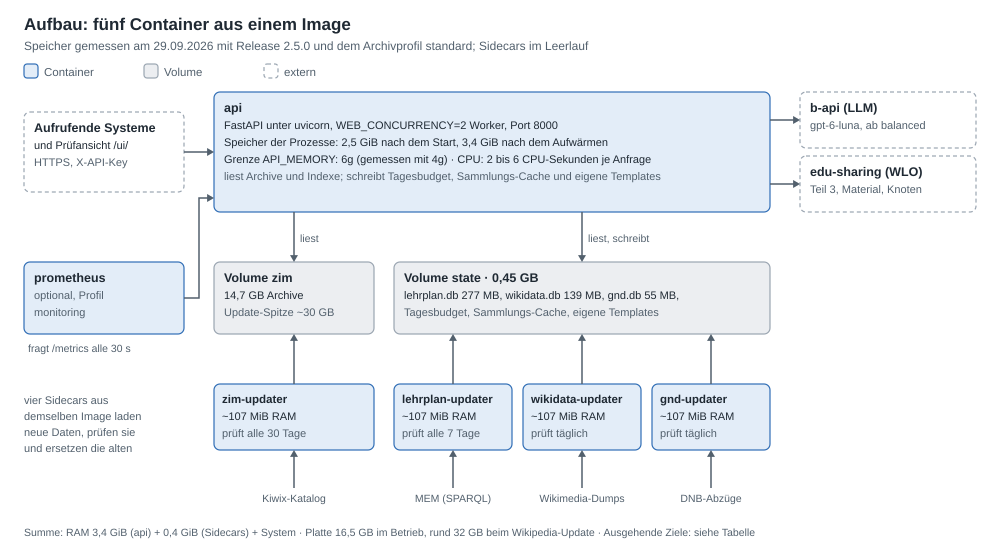
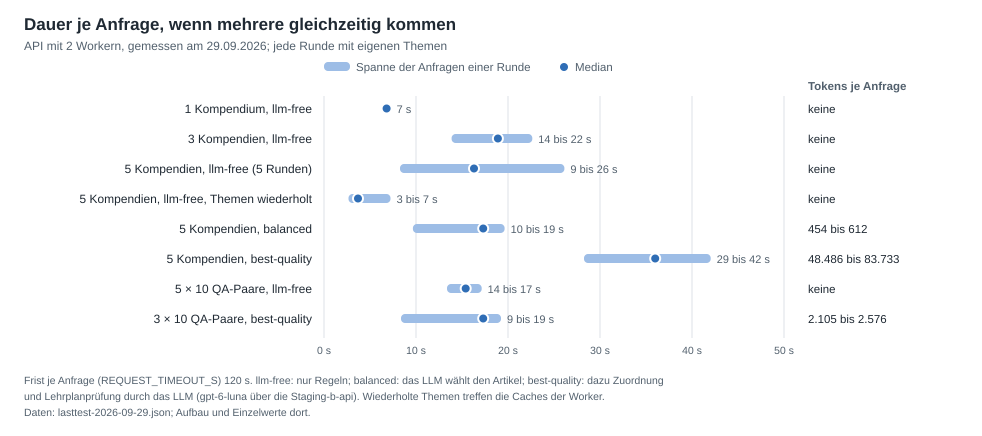
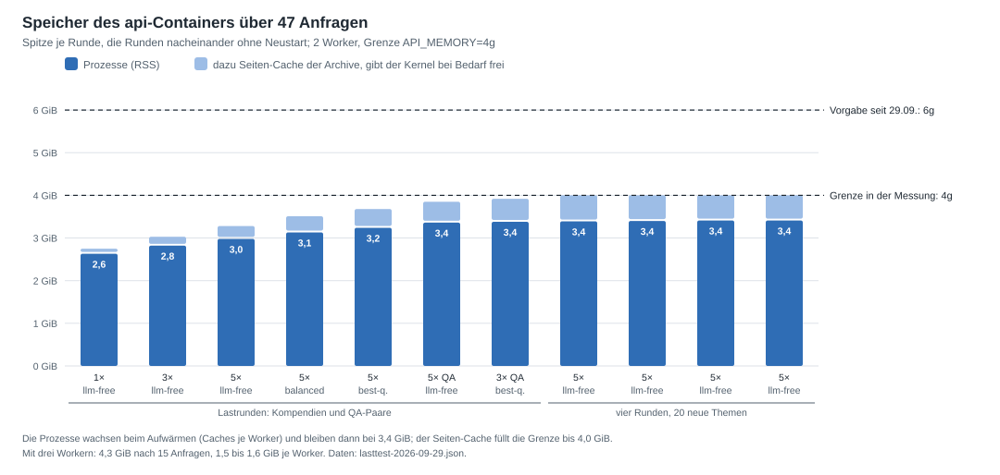

# Übergabe an das Technik-Team

Stand 09.10.2026 · Release 2.18.2 · für den Umzug in das interne GitLab und auf einen eigenen Server

Der Kompendium-Dienst ersetzt den alten Dienst (`/api/v1`), der Kompendien und QA-Paare erzeugt hat. Diese drei Seiten
fassen zusammen, was der Betrieb braucht und wie andere Systeme den Dienst aufrufen. Sie beschreiben `main` und damit
Release 2.18.2. Gegenüber 2.5.0 gilt ohne Eintrag kein Tagesbudget (D67), und ohne Profil im Aufruf läuft eine Anfrage
`llm-free`, solange kein LLM eingerichtet ist (D68); seit 2.7.0 endet ein Satz aus Modellwissen nur noch mit
`"model_knowledge_label": true` sichtbar mit `[Modellwissen]` (D76), und seit 2.8.0 bekommt eine Sammlung in `node_id`
Teil 3 wie mit `collection_id` (D77); seit 2.9.0 stellt der Quellenblock Teil 1 nur dann ganz unter CC BY-SA 4.0, wenn
alle Quellen frei lizenziert sind (D78); seit 2.13.0 nennt das Thema einer Sammlung mit inhaltsneutralem Titel die
Sammlung darüber, etwa „Grundlagen (Kernphysik)“ (D92); seit 2.18.0 kann der Dienst das Routing der b-api nutzen, über
eine Route, die vorab in der b-api angelegt ist (`B_API_PROVIDER=router`, D97), seit 2.18.1 nennt `/health` unter
`components.llm.reason`, warum das LLM nicht verfügbar ist (D98), und seit 2.19.0 vervielfacht `BLOCK_BUDGET_FACTOR`
(Vorgabe 10) das Budget jedes Bausteins: Die Texte werden länger, die wörtlichen deutlich, und die schreibenden Profile
brauchen rund ein Drittel mehr Tokens (D102). Was sich je Stand für den Betrieb ändert, steht in
[docs/betrieb.md](../betrieb.md) unter „Updates“. Die Speichergrenze 6g steht in `docker-compose.yml` und gilt mit jedem
Image.

| Seite | für wen | Inhalt |
|---|---|---|
| diese Seite | Betrieb | Aufbau, Ressourcen mit Lastmessung, Netz, CI im GitLab nach dem Muster der Plattform, Betrieb in Kürze |
| [Aufrufe](aufrufe.md) | Entwicklung der aufrufenden Systeme | alter und neuer Aufruf, Profile, die drei Teile, curl-Beispiele, Ausgabe mit jq, weitere Funktionen |
| [Konfiguration](konfiguration.md) | Betrieb | alle Umgebungsvariablen mit Vorgabe und Empfehlung für den Betrieb |

Ausführlich: [installation.md](../installation.md) (Server einrichten), [betrieb.md](../betrieb.md) (Updates,
Störungen, Überwachung), das [README](../../README.md) (alle Endpunkte und Parameter) und die
[Architektur](../entwicklung/10-architektur.md) mit drei interaktiven Diagrammen.

## Aufbau



- **Ein Image, fünf Container.** `api` beantwortet die Anfragen. Vier Sidecars halten die lokalen Daten aktuell:
  `zim-updater` (Wikipedia und Klexikon als ZIM-Archive von Kiwix), `lehrplan-updater` (Lehrpläne der MEM),
  `wikidata-updater` und `gnd-updater` (Indexe für die Kennungen der Entitäten). Jeder Sidecar lädt, prüft die
  Prüfsumme und ersetzt die Datei in einem Schritt; die API übernimmt neue Daten ohne Neustart.
- **Zwei Volumes.** `zim` hält die Archive, `state` den Lehrplan-Cache, die beiden Indexe, den Tageszähler der
  LLM-Tokens, den Sammlungs-Cache und eigene Templates. Sichern muss man nur `state/templates/`, falls eigene
  Templates angelegt werden; alles andere bauen die Sidecars neu ([betrieb.md](../betrieb.md), Volumes).
- **Zur Anfragezeit** spricht die API nur mit der b-api (LLM, ab Profil `balanced`) und mit edu-sharing (Teil 3,
  Materialien, Knoten). Wikipedia, Lehrpläne und Normdaten liest sie lokal.
- Prometheus ist optional (`docker compose --profile monitoring up -d`); Konfiguration und Alarmregeln liegen in
  `monitoring/`.

## Ressourcen

### Empfehlung für 3 bis 5 gleichzeitige Anfragen

Archivprofil `standard` (vollständige deutsche Wikipedia ohne Bilder und Klexikon), die zwei Worker des Images:

| | Minimum | Empfohlen | Grundlage (Messung unten) |
|---|---|---|---|
| CPU | 2 vCPU | 4 vCPU | Die API rechnet mit 2 Workern im Mittel auf rund einem Kern, in Spitzen auf bis zu vier: fünf gleichzeitige Kompendien dauerten mit 2, 4 und 16 vCPU gleich lang. Die übrigen Kerne sind für die Sidecars (der Neubau des Wikidata-Index dauert auf dem Server rund acht Minuten) und einen dritten Worker |
| RAM | 6 GB | 8 GB | API nach dem Aufwärmen 3,4 GiB, höher stieg sie in 47 Anfragen nicht; Sidecars zusammen rund 0,4 GiB im Leerlauf, beim Bau ihrer Indexe mehr (nicht gemessen); dazu das System |
| Grenze `API_MEMORY` | `4g` | `6g`, die Vorgabe | 4 GiB trugen alle 47 Anfragen, waren aber mit Seiten-Cache voll; 6g lässt Luft für Spitzen, etwa ein großes `existing_markdown` (bis 13 MB je Anfrage). Seit dem 29.09.2026 die Vorgabe in `docker-compose.yml`, vorher 4g |
| Platte | 50 GB | 60 GB, SSD | Daten 16,5 GB im Betrieb, mit der Wikipedia-Ausgabe 2026-10 (18,6 GB) rund 20,5 GB; beim Update der Wikipedia liegen altes und neues Archiv 24 Stunden nebeneinander: rund 33 GB beim Wechsel auf 2026-10, bis rund 38 GB bei zwei Ausgaben dieser Größe; dazu System und Docker (D99) |
| Netz | – | – | eingehend nur der Port der API (8000, besser hinter einem Reverse-Proxy mit TLS); ausgehend siehe [Netz](#netz) |

Mehr gleichzeitige Anfragen: je weiterer Worker (`WEB_CONCURRENCY`) rund 1,7 GiB mehr, also `WEB_CONCURRENCY=3` mit
`API_MEMORY=8g`, 12 GB RAM und 4 vCPU. Das Archivprofil `compact` (1,4 GB statt 14,7 GB, mit der Wikipedia 2026-10 statt
18,7 GB) senkt Platte und Grundbedarf, enthält aber nur die meistgelesenen Artikel der Wikipedia; gemessen ist es hier
nicht.

### Lastmessung vom 29.09.2026

Aufbau: Entwicklungsrechner mit Docker Desktop (WSL2), 16 vCPU, 7,4 GiB für alle Container, NVMe-SSD. Die API lief mit
Version 2.5.0 (Commit `b95a546`, zwei Korrekturen an `/docs` und der Prüfansicht nach dem Release), 2 Workern und der
Grenze 4 GiB, mit Wikipedia de ohne Bilder (Stand 2026-01, 14,6 GB) und Klexikon (0,14 GB); LLM war gpt-6-luna über
die Staging-b-api. Jede Runde schickt alle Anfragen gleichzeitig, jede
Runde mit eigenen Themen, die Runden nacheinander ohne Neustart. Gemessen ist nur der Container `api`; die Sidecars
liefen nicht. Rohdaten: [lasttest-2026-09-29.json](lasttest-2026-09-29.json), Skript: [lasttest.py](lasttest.py).



| Runde | gleichzeitig | Dauer je Anfrage | Tokens je Anfrage | Prozesse (RSS) vorher → Spitze | CPU-Zeit der Runde | Kerne Spitze (Mittel) |
|---|---:|---|---|---|---:|---|
| Kompendium `llm-free` | 1 | 6,8 s | – | 2,54 → 2,63 GiB | 5,1 s | 1,2 (0,6) |
| Kompendium `llm-free` | 3 | 14,3 bis 22,2 s | – | 2,63 → 2,82 GiB | 19,8 s | 2,1 (0,8) |
| Kompendium `llm-free` | 5 | 10,7 bis 25,7 s | – | 2,83 → 2,98 GiB | 27,8 s | 1,9 (0,9) |
| Kompendium `balanced` | 5 | 10,1 bis 19,2 s | 454 bis 612 | 2,96 → 3,13 GiB | 29,7 s | 4,1 (1,4) |
| Kompendium `best-quality` | 5 | 28,7 bis 41,6 s | 48.486 bis 83.733 | 3,13 → 3,24 GiB | 29,9 s | 2,7 (0,6) |
| 10 QA-Paare `llm-free` | 5 | 13,8 bis 16,7 s | – | 3,24 → 3,36 GiB | 21,6 s | 2,3 (1,1) |
| 10 QA-Paare `best-quality` | 3 | 8,8 bis 18,8 s | 2.105 bis 2.576 | 3,36 → 3,38 GiB | 14,4 s | 2,4 (0,7) |
| vier weitere Runden `llm-free`, 20 neue Themen | je 5 | 8,7 bis 24,9 s | – | 3,38 → 3,41 GiB | 20,2 bis 24,5 s | bis 3,3 |

- **Alle 47 Anfragen kamen mit HTTP 200 zurück**, die längste nach 41,6 s. Die Frist je Anfrage
  (`REQUEST_TIMEOUT_S`) ist mit OpenAI 300 s, mit academiccloud 600 s (bis 2.13.0: 120 s); Aufrufer sollten 30 s
  länger warten.
- **Gleichzeitige Anfragen teilen sich die Worker.** Ein Worker nimmt mehrere Anfragen an, rechnet sie aber
  weitgehend nacheinander: Lesen der Archive und Zuordnung halten die Interpreter-Sperre von Python. Ein Kompendium
  allein dauerte 6,8 s, fünf gleichzeitig je 9 bis 26 s.
- **Die LLM-Profile warten vor allem auf die b-api.** `best-quality` brauchte kaum mehr CPU-Zeit als `llm-free`
  (29,9 zu 27,8 s für fünf Kompendien), aber 48.000 bis 84.000 Tokens je Kompendium; 2 Mio. Tokens reichen für
  25 bis 40 davon. `balanced` kostet rund 500 Tokens. Eine Tagesgrenze gibt es nur, wenn `LLM_DAILY_TOKEN_BUDGET`
  sie setzt (Vorgabe `0`, keine Grenze).
- **Bekannte Themen sind schneller.** Fünf Themen, die der Dienst schon erzeugt hatte, dauerten gleichzeitig 3,1 bis
  6,8 s statt 9 bis 26 s. Die Worker halten Gelesenes im Speicher, jeder für sich.



- **Der Speicher der Prozesse wächst beim Aufwärmen und bleibt dann stehen:** 2,54 GiB nach dem Start, 3,38 GiB nach
  27 Anfragen, 3,41 GiB nach 20 weiteren mit neuen Themen. Je Worker sind das rund 1,7 GiB; ein Neustart setzt ihn
  zurück.
- **Der Seiten-Cache füllt die Grenze** bis 4,0 GiB. Der Kernel gibt ihn bei Bedarf frei, daran scheiterte keine
  Anfrage. Mit der Grenze 6g statt 4g lagen die Dauern im selben Bereich (Vergleich unten).

Zwei Vergleiche, jeder mit denselben fünf Themen für alle Aufbauten, jeweils auf einer frisch gestarteten API nach
einer Aufwärmrunde:

| Aufbau | 1. Durchgang | 2. Durchgang (Caches warm) | Prozesse nach 15 Anfragen |
|---|---|---|---|
| 2 Worker, `API_MEMORY=6g` | 15,0 bis 18,8 s | 1,9 bis 6,3 s | 3,09 GiB |
| 3 Worker, `API_MEMORY=6g` | 8,3 bis 12,6 s | 3,8 bis 9,9 s | 4,30 GiB |

| vCPU (`docker update --cpus`) | fünf neue Themen gleichzeitig, `llm-free` | CPU-Zeit | Kerne Spitze |
|---|---|---:|---:|
| 2 | 7,5 bis 13,2 s | 15,4 s | 1,7 |
| 4 | 7,0 bis 11,5 s | 15,4 s | 2,1 |
| 16 | 6,1 bis 12,1 s | 15,0 s | 2,1 |

Ein dritter Worker verkürzt neue Themen, verlängert aber Wiederholungen, denn jeder Worker hat eigene Caches und eine
Wiederholung trifft seltener den Worker, der das Thema kennt. Für 3 bis 5 gleichzeitige Anfragen reichen die zwei
Worker des Images; mehr CPU bringt ihnen nichts.

**Auf dem Zielserver nachmessen:** [lasttest.py](lasttest.py) braucht nur Python ab 3.10 und Docker auf dem Host und
liest cgroup v1 und v2. Mit fünf Themen, die der Dienst noch nicht hatte; `--container` nennt den Container der API,
wenn das Compose-Projekt anders heißt (`docker compose ps`), `--url` die Adresse:

```bash
python3 docs/uebergabe/lasttest.py --name 5-balanced --preset balanced --api-key "$API_KEY" Vulkan Demokratie Zellteilung Optik Evolution
```

### Platte

| Was | Größe | Anmerkung |
|---|---|---|
| Image für alle fünf Container | 1,1 GB | das vorige bleibt bis `docker image prune` liegen |
| Volume `zim` | 14,7 GB | Wikipedia de ohne Bilder 14,6 GB (13,6 GiB, Stand 2026-01), Klexikon 0,14 GB. Beim Update liegen altes und neues Archiv 24 Stunden nebeneinander (`ZIM_RETENTION_HOURS`): rund 30 GB, mit der Ausgabe 2026-10 (rund 18,6 GB) rund 33 GB (M84). Ein Download beginnt nur, wenn das Volume ihn und 1 GB darüber fasst |
| Volume `state` | 0,45 GB | `lehrplan.db` 277 MB, `wikidata.db` 139 MB, `gnd.db` 55 MB; der Neubau des Wikidata-Index braucht rund 1,5 GB frei |
| Protokolle | höchstens 0,25 GB | je Container fünf Dateien zu 10 MB |
| Volume `prometheus` (optional) | nicht gemessen | 30 Tage Aufbewahrung |

### Netz

Eingehend: nur der Port der API. Die Vorgabe `API_BIND=0.0.0.0:8000` bindet an alle Schnittstellen, und Docker leitet
an der Firewall des Hosts vorbei; hinter einem Reverse-Proxy auf dem Host `API_BIND=127.0.0.1:8000` setzen
([installation.md](../installation.md), Abschnitt 8).

Ausgehend, alles über HTTPS:

| Container | Ziel | wofür |
|---|---|---|
| `api` | `b-api.staging.openeduhub.net` (zu `redaktion.openeduhub.net`: `b-api.prod.openeduhub.net`) | LLM ab Profil `balanced` |
| `api` | `repository.staging.openeduhub.net`, `redaktion.openeduhub.net` | Teil 3, Materialtexte, Knoten |
| `zim-updater` | `opds.library.kiwix.org`, `download.kiwix.org` und dessen Spiegel | Katalog und Archive; Kiwix leitet auf wechselnde Spiegel um, geprüft wird per SHA-256 |
| `lehrplan-updater` | `sparql.mem.edufeed.org` | Lehrpläne |
| `wikidata-updater` | `dumps.wikimedia.org` | drei Dumps der deutschen Wikipedia, rund 750 MB je Neubau |
| `gnd-updater` | `data.dnb.de` | zwei Abzüge der GND, rund 65 MB |
| Browser der Leser von `/docs` und `/redoc` | `cdn.jsdelivr.net` | Swagger UI und ReDoc, in fester Version mit Prüfsumme |

Lässt die Firewall die Kiwix-Spiegel nicht zu: `ZIM_BOOTSTRAP_DOWNLOAD=false` setzen, die Archive von Hand ins
Volume `zim` legen und ohne Katalog übernehmen:
`docker compose run --rm --no-deps zim-updater compendium zim sync --offline`.

## CI im internen GitLab

[`.gitlab-ci.yml`](../../.gitlab-ci.yml) folgt dem Muster der Plattform-Projekte: die Stufen `build`, `test`,
`humanitec` und `deploy`, Pipelines für Branches (`workflow: rules`). Anders als im Muster laufen auch Git-Tags, damit
ein Release sein Image bekommt; eingebundene Teil-Pipelines (`include: local`) braucht ein Repository mit einem
einzigen Image nicht. Die Pipeline prüft und veröffentlicht wie die GitHub-CI (`.github/workflows/ci.yml` und
`dependency-audit.yml`), die das Image weiter nach `ghcr.io` baut, 6 bis 11 Minuten je Lauf. Auf einem GitLab
gelaufen ist sie noch nicht. Geprüft sind ihr Aufbau und die Namen der Tags (`tests/test_gitlab_ci.py`) und der
Funktionstest: lokal über Volumes und mit Python 3.12 ohne die Umgebung des Projekts, so wie er in GitLab läuft.

| Stufe | Jobs | was geschieht |
|---|---|---|
| build | `sample archives` und `docker build`, nur für `main`, `develop` und Tags | Beispielarchive bauen; das Image bauen (BuildKit mit Cache in der Registry, `:buildcache`) und prüfen wie auf GitHub mit `scripts/smoke_image.py`: gehärtet wie in Compose, `/health` nennt Commit und Model2Vec, ein Kompendium aus den Beispielarchiven, 503 für ein LLM-Profil ohne LLM, Entitäten, QA-Paare, Prüfansicht, die vier Sidecars. Erst dann pushen als `:<Commit>` |
| test | `ruff`, `mypy`, `dependency-audit`, `alert-rules`, `pytest`, `ui-scripts` | in jeder Pipeline, gleichzeitig mit dem Bau (`needs: []`) |
| humanitec | noch keiner | hier meldet ein Job das Image `:<Commit>` bei Humanitec an; er folgt, sobald die Angaben unten da sind |
| deploy | `docker tag` | erst nach bestandenen Tests, Namen wie auf GitHub: `main` wird `:main` und `:latest`, `v2.5.0` wird `:2.5.0` und `:2.5`, `develop` wird `:develop` |

- **Wöchentlicher Audit:** Eine geplante Pipeline führt nur `dependency-audit` aus, wie `dependency-audit.yml` auf
  GitHub. Dafür in GitLab unter *Build > Pipeline schedules* einen wöchentlichen Lauf auf `main` anlegen.
- **Kein Überholen:** Ein neuer Commit auf einem Branch bricht dessen ältere Pipeline ab (GitLab-Einstellung
  *Auto-cancel redundant pipelines*, ab Werk an). `docker tag` läuft zu Ende, wenn es einmal begonnen hat, und je
  Branch oder Tag nur einmal zugleich (`resource_group`). So zeigen `:main` und `:latest` nie auf einen älteren Commit
  zurück.
- **Was GitHub mehr hat:** Dependabot (auf GitLab wäre das Renovate), die Prüfung, dass das Image ohne Anmeldung
  ziehbar ist, und die Pages mit den Diagrammen; intern ist davon vermutlich nichts nötig.

Für das neue GitLab zu klären:

- **Runner:** Docker-Executor; `docker build` und `docker tag` brauchen Docker-in-Docker, also einen privilegierten
  Runner.
- **Variablen** (CI/CD-Einstellungen, geheime maskiert): `DIND_IMAGE`, `DIND_HOST`, `DIND_DRIVER`, `DIND_TLS_CERTDIR`
  wie in der alten Pipeline; `DIND_IMAGE` ist ein Alpine-Image mit Docker (etwa `docker:dind`), denn der Funktionstest
  holt sich dort `python3` und `py3-httpx`. Die Registry nennt `DOCKER_REGISTRY` mit `DOCKER_USERNAME` und
  `DOCKER_PASSWORD`, das Image heißt dann `$DOCKER_REGISTRY/projects/wlo/compendious-text-fastapi`; ohne
  `DOCKER_REGISTRY` nimmt die Pipeline die Registry des GitLab selbst (`$CI_REGISTRY_IMAGE`).
- **Humanitec:** Organisation, Anwendung und Umgebungen, ein Token als maskierte Variable und wie die Plattform eine
  Workload beschreibt (etwa Score). Der Dienst sind fünf Container aus einem Image mit zwei gemeinsamen Volumes
  ([Aufbau](#aufbau)); Speicher und CPU je Container stehen unter [Ressourcen](#ressourcen). Am schnellsten hilft eine
  der eingebundenen Dateien eines Plattform-Projekts (etwa `gateway/.gitlab-ci.yml`) mit ihrem Humanitec-Job.
- **Ausgehend vom Runner:** `ghcr.io` (uv), Docker Hub (Python, Node, Prometheus, `moby/buildkit`), `pypi.org` und
  `files.pythonhosted.org` (Pakete), `huggingface.co` (Model2Vec), `github.com` (spaCy-Modell) und das Paketarchiv
  von Alpine (`python3`, `py3-httpx` für den Funktionstest).
- Die uv-Version steht im Dockerfile und in allen Pipelines gleich, BuildKit in beiden CIs mit demselben Digest;
  `tests/test_ci_pins.py` prüft beides.

## Betrieb in Kürze

- **Erststart:** `.env` aus [Konfiguration](konfiguration.md) anlegen, `docker compose up -d`. Der `zim-updater` lädt
  rund 14,7 GB, der `wikidata-updater` rund 750 MB, der `gnd-updater` rund 65 MB; der `lehrplan-updater` erntet die
  MEM in rund 25 Minuten. `GET /ready` antwortet 200, sobald die Pflichtarchive geladen sind. Nach einem Neustart
  meldete die API sich in der Messung nach 30 bis 45 s gesund.
- **Prüfen:** `GET /health` nennt Version, Commit, Archive, Indexe, LLM und verbrauchte Tokens des Tages.
- **Update:** neues Tag in `IMAGE`, dann `docker compose pull && docker compose up -d`. Laufende Anfragen bekommen bis
  zu 630 s (`API_STOP_GRACE_PERIOD`), genug auch für academiccloud. Was sich je Release am Betrieb ändert, steht in [betrieb.md](../betrieb.md).
- **Sicherheit:** `API_KEYS` setzen, sonst beantwortet der Dienst jeden, und jeder verbraucht LLM-Tokens ohne
  Tagesgrenze (Vorgabe von `LLM_DAILY_TOKEN_BUDGET`: keine);
  dazu `METRICS_TOKEN` und `ADMIN_TOKEN`, alle mit `openssl rand -hex 32` erzeugt.
- **Überwachung:** `GET /metrics` für Prometheus; `monitoring/alerts.yml` meldet unter anderem ausgefallene
  Sidecars, volles Volume, fehlende Indexe und, wenn eines gesetzt ist, ein schnell schwindendes Tagesbudget
  ([betrieb.md](../betrieb.md)).
