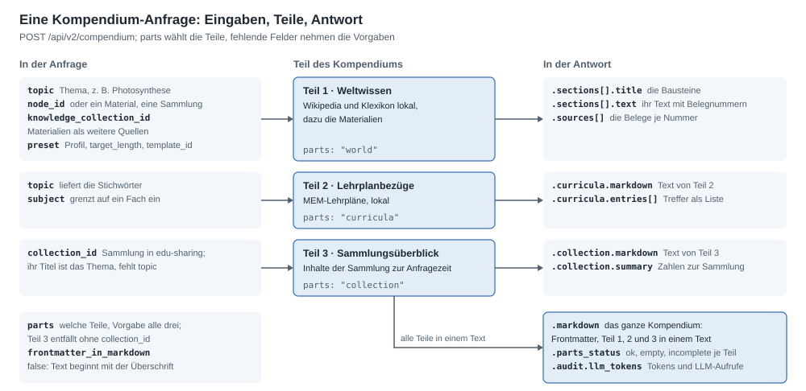

# Aufrufe: alter und neuer Dienst

[Übergabe](README.md) · Stand 30.09.2026 · `main` nach Release 2.5.0

Diese Seite zeigt, wie die aufrufenden Systeme vom alten Dienst (`/api/v1`) auf den neuen (`/api/v2`) umsteigen: die
Aufrufe vorher und nachher, die Profile, die Wahl der drei Teile und wie man aus der Antwort nur den fertigen Text
oder nur die QA-Paare holt. Jede Anfrage an den neuen Dienst auf dieser Seite ist am 29.09.2026 gelaufen; die
Aufrufe des alten Dienstes sind aus seinem Code abgeleitet (compendious 0.2.0), denn er läuft hier nicht mehr.
Alle Felder mit Beispielen je Profil zeigt `/docs` des Dienstes.

## Was sich ändert


| Zweck | alter Dienst | neuer Dienst |
|---|---|---|
| Kompendium zu einem Thema | `POST /api/v1/pipeline-compendium-only` (Linker, dann Kompendium) oder `POST /api/v1/compendium` mit `input_type: "text"` | `POST /api/v2/compendium` mit `topic` |
| QA-Paare zu einem Text | `POST /api/v1/qa` | `POST /api/v2/qa` mit `text` |
| QA-Paare zu einem Thema | `POST /api/v1/pipeline` (Kompendium und Paare in einem Aufruf) | `POST /api/v2/qa` mit `topic`: erzeugt Teil 1 selbst und fragt ihn ab |
| Begriffe mit Wikipedia-Artikel | `POST /api/v1/linker` (live bei Wikipedia) | `POST /api/v2/entities` (lokal, mit Wikidata- und GND-Nummer) |
| Länge | `config.length`, Vorgabe 6.000 Zeichen | `target_length`, Vorgabe 12.000; eine Richtgröße, der Text wird so lang, wie die Quellen tragen |
| Zugang | ohne Schlüssel | Header `X-API-Key`, sobald `API_KEYS` gesetzt ist |
| Grenze | 60 Anfragen je Minute und IP | 60 je Minute und Aufrufer, je Worker (`RATE_LIMIT`) |
| Fehler | HTTP 200 mit „# Fehler bei der Generierung“ als Text | HTTP-Status mit JSON (siehe [Fehler](#fehler)) |

## Profile

Jede Anfrage wählt mit `preset` ein Profil; ohne gilt `PRESET_DEFAULT` des Servers, ausgeliefert `balanced`, und auf
einem Server ohne LLM `llm-free`. Das Profil bestimmt, wo das LLM mitarbeitet; alles andere rechnet der Dienst
lokal. Ebenso das Template von Teil 1: `template_id`, sonst `TEMPLATE_DEFAULT`, ausgeliefert `sc26`.


| Profil | Was das LLM tut | Kompendium allein | Tokens | wofür |
|---|---|---|---|---|
| `llm-free` | nichts | 2,3 s | 0 | Massenabrufe, Server ohne LLM |
| `balanced` | wählt unsichere Hauptartikel, nennt Übersicht und Teile des Themas | 6,9 s | rund 580 | **Standard** |
| `best-quality` | dazu: ordnet die Absätze den Bausteinen zu, prüft die Lehrplanbezüge | 26 s | rund 49.000, je nach Thema bis 87.000 | Vorbereitung durch die Redaktion |
| `best-quality-generated` | dazu: schreibt den Text neu, Modellwissen sichtbar markiert | 36 s | rund 60.000 | lesbarer Fließtext |

Zeit und Tokens: Median auf dem Server, ein Kompendium allein (Messung M45,
[01-alt-und-neu.md](../entwicklung/01-alt-und-neu.md)); der alte Dienst brauchte im besten Fall 35 s und 7.900 Tokens.
Gleichzeitig mit anderen dauert es länger ([Lastmessung](README.md#lastmessung-vom-29092026)). Bei `/api/v2/qa`
schreiben `llm-free` und `balanced` die Paare mit Regeln aus dem Satzbau, die beiden `best-quality`-Profile mit dem LLM.

## Vorbereitung

```bash
export KOMPENDIUM=https://kompendium.example.org   # Adresse des Dienstes
export API_KEY=...                                 # einer der Schlüssel aus API_KEYS
```

Die Beispiele brauchen `curl` und `jq`. Ein Kompendium kann mit `best-quality` unter Last 40 s dauern; `--max-time 180`
lässt genug Zeit. Unter Windows (Git Bash, PowerShell) schickt curl Umlaute aus `-d` nicht als UTF-8, der Dienst
antwortet dann mit 422: dort den Körper aus einer UTF-8-Datei senden (`--data-binary @anfrage.json`).

## Vorher: der alte Dienst

```bash
# Kompendium zu einem Thema: ein LLM nennt Begriffe, dann schreibt ein LLM den Text (6.000 Zeichen)
curl -sS -X POST "$ALT/api/v1/pipeline-compendium-only" -H 'Content-Type: application/json' \
  -d '{"text": "Photosynthese"}' \
  | jq -r '.compendium_output.markdown' > photosynthese.md

# QA-Paare zu diesem Text
jq -Rs '{text: ., num_pairs: 15, max_answer_length: 400}' photosynthese.md \
  | curl -sS -X POST "$ALT/api/v1/qa" -H 'Content-Type: application/json' --data-binary @- \
  | jq '.qa'

# beides in einem Aufruf
curl -sS -X POST "$ALT/api/v1/pipeline" -H 'Content-Type: application/json' \
  -d '{"text": "Photosynthese", "config": {"qa": {"num_pairs": 15}}}' \
  | jq '{markdown: .compendium_output.markdown, qa: .qa_output.qa}'
```

## Jetzt: ein Kompendium

```bash
# Profil balanced: das ganze Kompendium als Markdown
curl -sS --max-time 180 -X POST "$KOMPENDIUM/api/v2/compendium" \
  -H "X-API-Key: $API_KEY" -H 'Content-Type: application/json' \
  -d '{"topic": "Photosynthese", "preset": "balanced"}' \
  | jq -r '.markdown' > photosynthese.md

# Profil best-quality: dasselbe, das LLM ordnet zu und prüft die Lehrplanbezüge
curl -sS --max-time 180 -X POST "$KOMPENDIUM/api/v2/compendium" \
  -H "X-API-Key: $API_KEY" -H 'Content-Type: application/json' \
  -d '{"topic": "Photosynthese", "preset": "best-quality"}' \
  | jq -r '.markdown' > photosynthese-best.md
```

`.markdown` ist das fertige Kompendium: YAML-Frontmatter (Quellen, Stand der Archive, KI-Kennzeichnung nach
Art. 50 AI Act), dann `# Kompendium: Photosynthese`, `## Teil 1 · Weltwissen`, `## Teil 2 · Lehrplanbezüge` und
`## Teil 3 · Die Sammlung im Überblick`, soweit angefordert. Unsichtbare Marken (`<!-- kompendium:section … -->`) kennzeichnen die Bausteine; sie
braucht ein späterer Aufruf, der geprüfte Bausteine mit `existing_markdown` behält.

Was die Antwort sonst trägt:

| Ausdruck | liefert |
|---|---|
| `jq -r '.markdown'` | das ganze Kompendium als Markdown |
| `jq -r '.sections[] \| select(.text != "") \| "## \(.title)\n\n\(.text)\n"'` | nur Teil 1, Baustein für Baustein |
| `jq -r '.curricula.markdown'` | nur Teil 2 |
| `jq -r '.collection.markdown'` | nur Teil 3 |
| `jq '.parts_status'` | je Teil `ok`, `empty`, `incomplete` oder `unavailable` (ohne `collection_id` steht Teil 3 auf `unavailable`) |
| `jq '.audit.llm_tokens'` | Tokens und LLM-Aufrufe dieser Anfrage |
| `jq '.sources[] \| {title, url, license}'` | die Belege hinter den Nummern im Text |

Ohne Frontmatter beginnt der Text mit der Überschrift: `"frontmatter_in_markdown": false` in der Anfrage. Die Daten des
Frontmatters stehen dann weiter in `.frontmatter`.

## Die drei Teile wählen



`parts` nennt die Teile; ohne das Feld sind es alle drei, und Teil 3 entfällt, wenn keine `collection_id` dabei ist.

```bash
# Teil 1 und 2, ohne Teil 3 und ohne Frontmatter
curl -sS --max-time 180 -X POST "$KOMPENDIUM/api/v2/compendium" \
  -H "X-API-Key: $API_KEY" -H 'Content-Type: application/json' \
  -d '{"topic": "Photosynthese", "preset": "balanced", "parts": ["world", "curricula"], "frontmatter_in_markdown": false}' \
  | jq -r '.markdown' > photosynthese.md

# nur Teil 1 (rund 26.000 Zeichen bei Photosynthese; Teil 2 bringt weitere 70.000)
curl -sS --max-time 180 -X POST "$KOMPENDIUM/api/v2/compendium" \
  -H "X-API-Key: $API_KEY" -H 'Content-Type: application/json' \
  -d '{"topic": "Photosynthese", "preset": "balanced", "parts": ["world"], "frontmatter_in_markdown": false}' \
  | jq -r '.markdown' > photosynthese-teil1.md
```

### Teil 3: die Sammlung

`collection_id` ist die Knoten-ID einer Sammlung in edu-sharing. Teil 3 beschreibt sie: Kennzahlen (Materialtypen,
Stufen, Fächer, Lizenzen), dann je Inhalt eine Zeile mit Link, Beschreibung, Schlagwörtern, Typ, Stufe, Lizenz und
`nodeId`, danach die Untersammlungen mit ihren Inhalten. Fehlt `topic`, ist der Titel der Sammlung das Thema.

```bash
# Kompendium zur Sammlung Optik der WLO-Staging, alle drei Teile
curl -sS --max-time 180 -X POST "$KOMPENDIUM/api/v2/compendium" \
  -H "X-API-Key: $API_KEY" -H 'Content-Type: application/json' \
  -d '{"collection_id": "9e7ae956-e9df-430f-bace-f3db4b910013", "preset": "balanced"}' \
  > optik.json
jq -r '.topic' optik.json                  # Optik, der Titel der Sammlung
jq -r '.collection.markdown' optik.json    # nur Teil 3
jq '.collection.summary.materials' optik.json
```

Ohne Zugangsdaten liest der Dienst nur Öffentliches; mit `EDU_SHARING_USER` und `EDU_SHARING_PASSWORD` alles, was
dieses Konto lesen darf. Eine Sammlung liest er höchstens alle `COLLECTION_CACHE_TTL_S` (eine Stunde) neu.

### Eine Sammlung als Quelle für Teil 1

`knowledge_collection_id` nennt eine Sammlung, deren Materialien Teil 1 als weitere Quellen nutzt, neben Wikipedia und
Klexikon. Der Dienst liest bis zu 30 Materialien (`KNOWLEDGE_MAX_MATERIALS`) mit offener Lizenz und lesbarem Text;
ihre Absätze stehen im Text mit Belegnummer wie die der Wikipedia. Teil 1 muss dabei sein, sonst 422.

```bash
# Thema Optik, Materialien der Sammlung als Quellen, dieselbe Sammlung als Teil 3
curl -sS --max-time 180 -X POST "$KOMPENDIUM/api/v2/compendium" \
  -H "X-API-Key: $API_KEY" -H 'Content-Type: application/json' \
  -d '{"topic": "Optik", "collection_id": "9e7ae956-e9df-430f-bace-f3db4b910013", "knowledge_collection_id": "9e7ae956-e9df-430f-bace-f3db4b910013", "preset": "balanced"}' \
  > optik.json
jq '.audit.knowledge | {considered, sources, skipped_license, empty, failed: (.failed | length)}' optik.json
jq '.sources[] | select(.project == "wlo_material") | {title, license, url}' optik.json
```

Bei der Sammlung Optik der Staging (anonym gelesen): 131 von 168 Inhalten ohne offene Lizenz übersprungen, 30
gelesen, 6 als Quelle genutzt, 7 ohne Text, 17 ohne Zugangsdaten nicht lesbar. `collection_id` und
`knowledge_collection_id` können auch verschiedene Sammlungen sein.

### Ein Material oder eine Sammlung als Eingang

`node_id` nennt einen Knoten im Repository. Der Dienst leitet Thema, Fach und Stufe aus seinen Metadaten ab;
`GET /api/v2/nodes/{node_id}` zeigt vorher, was er liest. Ein `topic` dazu geht vor.

```bash
curl -sS --max-time 180 -X POST "$KOMPENDIUM/api/v2/compendium" \
  -H "X-API-Key: $API_KEY" -H 'Content-Type: application/json' \
  -d '{"node_id": "ac66224b-42b0-4676-a53d-71b058dc780b", "preset": "balanced", "parts": ["world"]}' \
  | jq '{thema: .topic, material: .node.title}'
```

## QA-Paare

```bash
# zu einem Thema: der Dienst erzeugt Teil 1 (ohne LLM) und fragt ihn ab; best-quality lässt das LLM die Paare schreiben
curl -sS --max-time 180 -X POST "$KOMPENDIUM/api/v2/qa" \
  -H "X-API-Key: $API_KEY" -H 'Content-Type: application/json' \
  -d '{"topic": "Photosynthese", "count": 10, "preset": "best-quality"}' \
  | jq '.pairs'

# zu einem vorhandenen Text, etwa Teil 1 von oben (höchstens 50.000 Zeichen)
jq -Rs '{text: ., count: 10, preset: "balanced"}' photosynthese-teil1.md \
  | curl -sS --max-time 180 -X POST "$KOMPENDIUM/api/v2/qa" \
      -H "X-API-Key: $API_KEY" -H 'Content-Type: application/json' --data-binary @- \
  | jq '.pairs'
```

`.pairs` ist eine Liste `[{"question": "…", "answer": "…", "level": null}, …]`. Nur die Paare als Text:
`jq -r '.pairs[] | "F: \(.question)\nA: \(.answer)\n"'`; als Liste ohne `level`:
`jq '[.pairs[] | {question, answer}]'`.

| alter Dienst | neuer Dienst |
|---|---|
| `num_pairs` 1 bis 200, Vorgabe 15 | `count` 1 bis 50, Vorgabe 5; eine Obergrenze: ein kurzer Text trägt weniger, `note` sagt dann, wie viele |
| `max_answer_length` 50 bis 1.000, Vorgabe 400 | `max_answer_length` 50 bis 2.000, Vorgabe 300 |
| `level_property` und `level_values` | `levels`, etwa `["Sekundarstufe I", "Sekundarstufe II"]`; nur das LLM ordnet Stufen zu |
| Antwort `.qa[]` mit `question`, `answer`, `level_value` | Antwort `.pairs[]` mit `question`, `answer`, `level`, dazu `method`, `note`, `llm_tokens` |

Gemessen am 29.09.2026: zehn Paare zu Photosynthese mit `best-quality` in 7 s für rund 2.000 Tokens, zu Teil 1 mit
`balanced` (Regeln) in unter 1 s.

## Weitere Funktionen

| Endpunkt | was er liefert |
|---|---|
| `POST /api/v2/entities` | Personen, Orte, Begriffe in einem Text, je mit Wikipedia-Artikel und Kennungen (Wikidata, GND, VIAF, DBpedia); `llm-free` mit Regeln, sonst nennt das LLM sie |
| `POST /api/v2/knowledge` | die Artikel zu einem Thema mit Einleitung und Abschnitten, ohne Zuordnung: Rohstoff für eigene Verarbeitung |
| `GET /api/v2/lehrplan/search?q=…` | Lehrplanelemente der MEM zu Stichwörtern (Teil 2 allein) |
| `GET /api/v2/collections/{id}/overview` | Teil 3 allein |
| `GET /api/v2/nodes/{id}` | Metadaten eines Materials oder einer Sammlung und das daraus abgeleitete Thema |
| `GET /api/v2/templates` | die Gliederungen von Teil 1: `sc26` (13 Bausteine, Vorgabe) und `standard` (6); eigene mit `PUT` und `ADMIN_TOKEN` |
| `existing_markdown`, `regenerate_sections` | ein früheres Kompendium mitschicken: redaktionell geprüfte Bausteine bleiben wörtlich, nur die genannten entstehen neu |
| `/ui/` | Prüfansicht für die Redaktion (`UI_ENABLED`): die Antworten aller Endpunkte im Browser, mit Herkunft je Absatz, Qualität, Zeit und Kosten |
| `/docs`, `/redoc` | die API mit Beispielen je Profil (`API_DOCS_ENABLED`) |
| `/health`, `/ready`, `/metrics` | Zustand, Bereitschaft, Messwerte für Prometheus |

```bash
# Entitäten in einem Text (unter Windows den Körper aus einer UTF-8-Datei senden)
curl -sS -X POST "$KOMPENDIUM/api/v2/entities" \
  -H "X-API-Key: $API_KEY" -H 'Content-Type: application/json' \
  -d '{"text": "Albert Einstein entwickelte in Bern die spezielle Relativitätstheorie.", "preset": "balanced"}' \
  | jq '.entities[] | {text, artikel: .article.title, wikidata: .article.ids.wikidata, gnd: .article.ids.gnd}'
```

## Fehler

Fehler kommen als HTTP-Status mit JSON in `detail`, etwa bei einem unbekannten Thema:
`{"detail": {"message": "Thema in den Archiven nicht gefunden", "resolution": {…, "alternatives": []}}}`.

| Status | wann |
|---|---|
| 401 | `API_KEYS` ist gesetzt und der Header `X-API-Key` fehlt oder passt nicht |
| 404 | Thema nicht in den Archiven (`resolution.alternatives` schlägt andere vor), Sammlung, Knoten oder Template unbekannt |
| 413 | Körper größer als erlaubt (`REQUEST_BODY_MAX_BYTES`) |
| 422 | ein Feld oder eine Kombination ist nicht erlaubt, etwa `knowledge_collection_id` ohne Teil 1; Körper kein UTF-8-JSON |
| 429 | mehr als `RATE_LIMIT` Anfragen je Minute |
| 502 | edu-sharing antwortet fehlerhaft |
| 503 | auf diesem Server gerade nicht möglich: Archive noch nicht geladen, oder ein Profil oder Schalter im Aufruf braucht ein LLM und keins ist eingerichtet (ohne Angabe läuft `llm-free`) |

In Skripten Fehler abfangen: `set -o pipefail` und `jq -e`, das mit Status 1 endet, wenn `.markdown` fehlt:

```bash
set -o pipefail
curl -sS --fail-with-body --max-time 180 -X POST "$KOMPENDIUM/api/v2/compendium" \
  -H "X-API-Key: $API_KEY" -H 'Content-Type: application/json' \
  -d '{"topic": "Photosynthese", "preset": "balanced"}' \
  | jq -er '.markdown' > photosynthese.md || echo "Kompendium fehlgeschlagen" >&2
```
